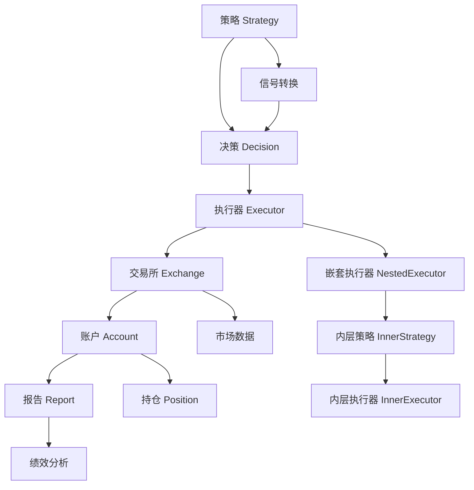
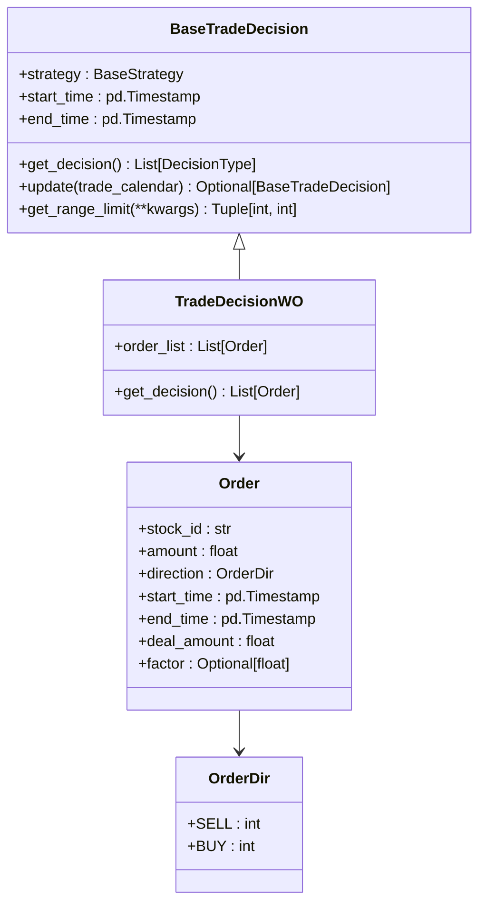
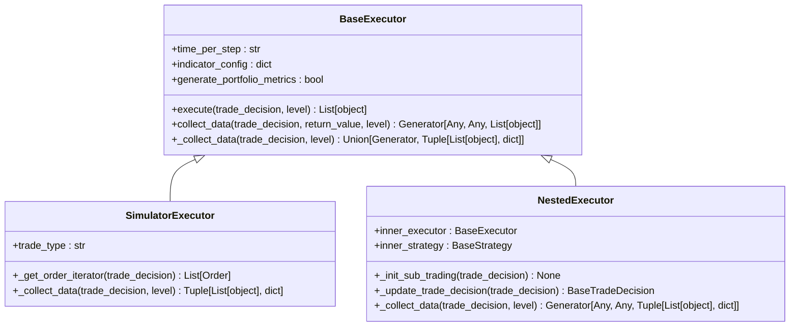
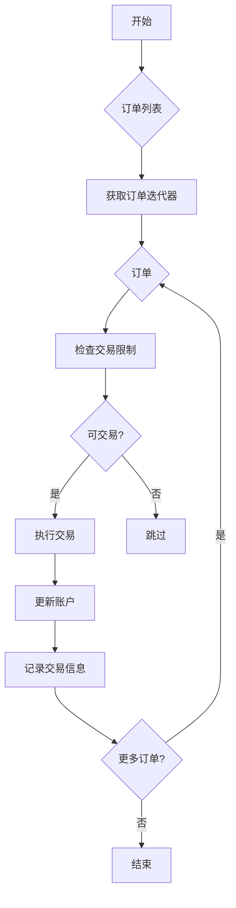
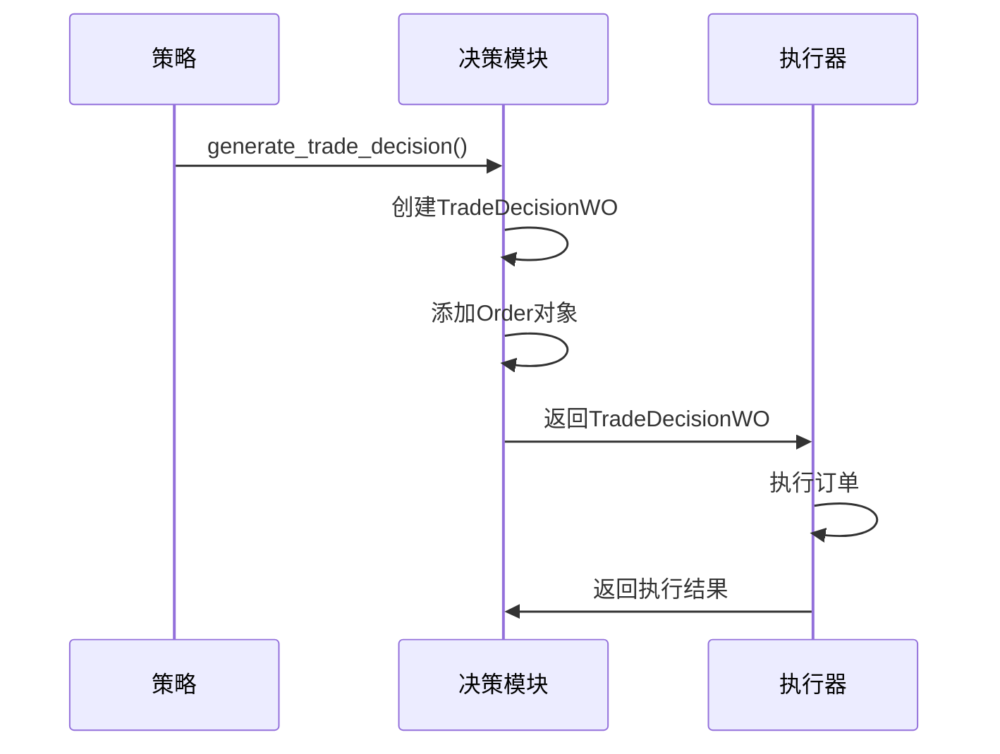
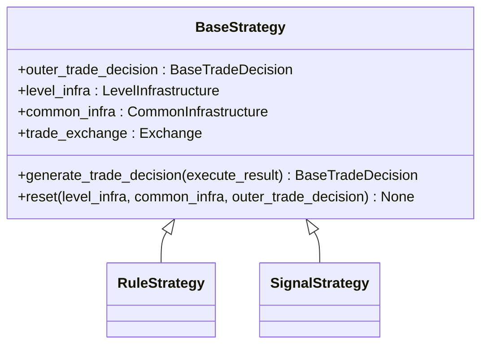
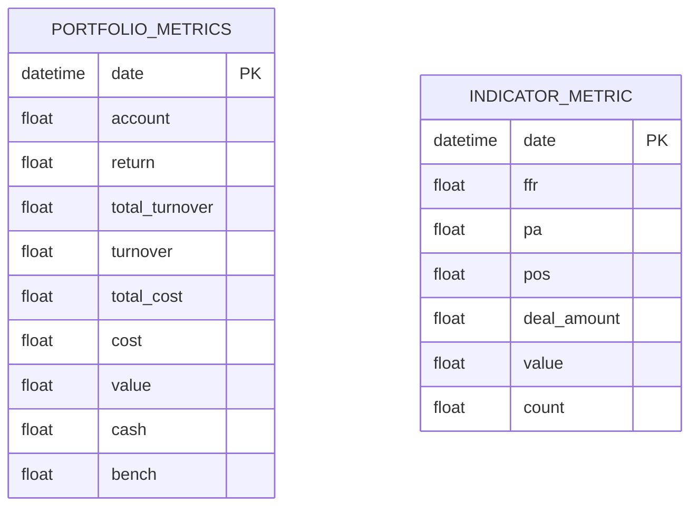
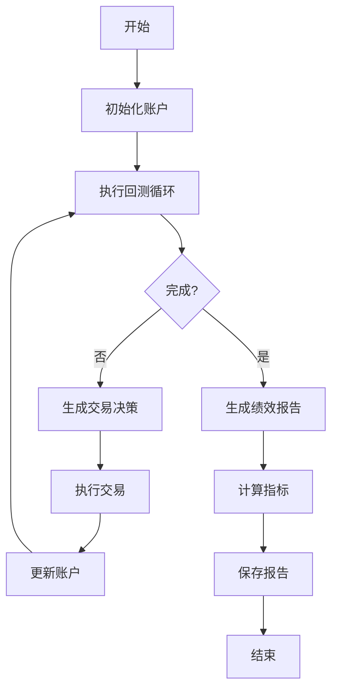

# 回测API

<cite>
**本文档引用的文件**   
- [__init__.py](file://qlib/backtest/__init__.py)
- [backtest.py](file://qlib/backtest/backtest.py)
- [decision.py](file://qlib/backtest/decision.py)
- [executor.py](file://qlib/backtest/executor.py)
- [report.py](file://qlib/backtest/report.py)
- [account.py](file://qlib/backtest/account.py)
- [exchange.py](file://qlib/backtest/exchange.py)
- [rule_strategy.py](file://qlib/contrib/strategy/rule_strategy.py)
- [signal_strategy.py](file://qlib/contrib/strategy/signal_strategy.py)
- [base.py](file://qlib/strategy/base.py)
</cite>

## 目录
1. [引言](#引言)
2. [回测系统架构](#回测系统架构)
3. [核心组件分析](#核心组件分析)
4. [回测引擎配置](#回测引擎配置)
5. [执行器与订单生成](#执行器与订单生成)
6. [决策模块与信号转换](#决策模块与信号转换)
7. [策略接口实现](#策略接口实现)
8. [回测报告生成](#回测报告生成)
9. [策略示例分析](#策略示例分析)
10. [结论](#结论)

## 引言
本文档旨在构建一个全面的回测系统API文档，涵盖从信号执行到绩效分析的完整链条。我们将详细说明回测引擎（Backtest）的配置参数、执行器（Executor）的订单生成逻辑、决策模块（Decision）的信号转换机制。重点解析策略（Strategy）接口的实现方式，包括rule_strategy和signal_strategy的差异与应用场景。同时，文档化回测报告（Report）的生成流程与指标计算方法，并结合examples中的策略示例，展示如何通过API定制交易逻辑。

## 回测系统架构



**图表来源**
- [__init__.py](file://qlib/backtest/__init__.py#L217-L276)
- [backtest.py](file://qlib/backtest/backtest.py#L26-L50)
- [executor.py](file://qlib/backtest/executor.py#L310-L373)
- [decision.py](file://qlib/backtest/decision.py#L302-L597)

## 核心组件分析

### 回测引擎（Backtest Engine）
回测引擎是整个系统的核心，负责协调策略、执行器和交易所之间的交互。它通过`backtest`函数初始化策略和执行器，并驱动回测循环。

**组件来源**
- [__init__.py](file://qlib/backtest/__init__.py#L217-L276)

### 决策模块（Decision Module）
决策模块负责生成具体的交易决策，主要由`BaseTradeDecision`类及其子类实现。`Order`类定义了交易订单的基本属性。



**图表来源**
- [decision.py](file://qlib/backtest/decision.py#L302-L597)

### 执行器（Executor）
执行器负责执行交易决策，主要由`BaseExecutor`类及其子类实现。`SimulatorExecutor`模拟真实市场环境，`NestedExecutor`支持嵌套执行。



**图表来源**
- [executor.py](file://qlib/backtest/executor.py#L22-L629)

## 回测引擎配置

### 基准指数配置
回测引擎支持配置基准指数，用于计算相对收益。基准指数可以通过`benchmark`参数指定，支持多种格式：

- **字符串**：直接指定指数代码，如"SH000300"（沪深300）
- **列表**：指定股票池，计算平均收益作为基准
- **pandas.Series**：直接提供基准收益序列

```python
# 示例：配置基准指数
backtest(
    start_time="2020-01-01",
    end_time="2020-12-31",
    strategy=strategy_config,
    executor=executor_config,
    benchmark="SH000300",  # 沪深300指数
    account=1e9,
    exchange_kwargs={
        "freq": "day",
        "open_cost": 0.0015,
        "close_cost": 0.0025,
        "min_cost": 5.0,
    }
)
```

**组件来源**
- [__init__.py](file://qlib/backtest/__init__.py#L113-L174)
- [report.py](file://qlib/backtest/report.py#L42-L122)

### 交易成本配置
交易成本是回测中重要的参数，影响策略的实际收益。系统支持配置多种交易成本：

- **开仓成本** (`open_cost`)：开仓时的交易费率
- **平仓成本** (`close_cost`)：平仓时的交易费率
- **最低成本** (`min_cost`)：单笔交易的最低成本

```python
# 示例：配置交易成本
exchange_kwargs = {
    "open_cost": 0.0015,    # 0.15% 开仓费
    "close_cost": 0.0025,   # 0.25% 平仓费
    "min_cost": 5.0,        # 最低5元手续费
}
```

**组件来源**
- [__init__.py](file://qlib/backtest/__init__.py#L40-L42)
- [exchange.py](file://qlib/backtest/exchange.py#L48-L50)

## 执行器与订单生成

### 订单生成逻辑
执行器负责将策略生成的决策转换为具体的交易订单。`SimulatorExecutor`根据`trade_type`参数决定订单的执行方式：

- **串行执行** (`TT_SERIAL`)：订单按顺序执行，允许先卖出再买入
- **并行执行** (`TT_PARAL`)：订单同时执行，不允许资金再利用



**图表来源**
- [executor.py](file://qlib/backtest/executor.py#L513-L629)

### 交易限制处理
系统提供了多种交易限制处理机制，确保回测结果的准确性：

- **涨跌停限制**：通过`limit_threshold`参数设置涨跌停阈值
- **停牌处理**：自动检测停牌股票，避免无效交易
- **交易单位限制**：考虑股票的交易单位（如A股100股）

```python
# 示例：配置交易限制
exchange_kwargs = {
    "limit_threshold": 0.1,  # 10% 涨跌停限制
    "trade_unit": 100,       # A股交易单位
}
```

**组件来源**
- [exchange.py](file://qlib/backtest/exchange.py#L46-L48)
- [executor.py](file://qlib/backtest/executor.py#L594-L612)

## 决策模块与信号转换

### 信号转换机制
决策模块负责将策略信号转换为具体的交易决策。`TradeDecisionWO`类是主要的决策容器，包含订单列表和执行时间范围。



**图表来源**
- [decision.py](file://qlib/backtest/decision.py#L547-L579)
- [executor.py](file://qlib/backtest/executor.py#L590-L629)

### 时间范围管理
系统支持精确的时间范围管理，确保交易在指定时间内执行：

- **交易时间范围**：通过`start_time`和`end_time`参数设置
- **日内交易限制**：使用`TradeRangeByTime`类设置日内交易时间

```python
# 示例：设置日内交易时间
from qlib.backtest.decision import TradeRangeByTime

trade_range = TradeRangeByTime("9:30", "14:30")  # 9:30-14:30交易
```

**组件来源**
- [decision.py](file://qlib/backtest/decision.py#L264-L299)

## 策略接口实现

### 策略基类
所有策略都继承自`BaseStrategy`类，必须实现`generate_trade_decision`方法：



**图表来源**
- [base.py](file://qlib/strategy/base.py#L23-L297)

### Rule Strategy
Rule Strategy基于预定义规则生成交易信号，适用于简单的技术指标策略：

- **TWAP策略**：时间加权平均价格策略
- **SBB策略**：选择相邻交易时段中更好的一个进行买卖
- **AC策略**：基于波动率的自适应策略

```python
# 示例：TWAP策略
from qlib.contrib.strategy.rule_strategy import TWAPStrategy

strategy = TWAPStrategy()
```

**组件来源**
- [rule_strategy.py](file://qlib/contrib/strategy/rule_strategy.py#L22-L122)

### Signal Strategy
Signal Strategy基于预测信号生成交易决策，适用于复杂的机器学习模型：

- **TopkDropoutStrategy**：基于信号排名的选股策略
- **WeightStrategyBase**：基于权重的目标持仓策略
- **EnhancedIndexingStrategy**：增强型指数跟踪策略

```python
# 示例：TopkDropout策略
from qlib.contrib.strategy.signal_strategy import TopkDropoutStrategy

strategy = TopkDropoutStrategy(
    topk=50,
    n_drop=10,
    method_sell="bottom",
    method_buy="top"
)
```

**组件来源**
- [signal_strategy.py](file://qlib/contrib/strategy/signal_strategy.py#L75-L523)

## 回测报告生成

### 报告指标计算
系统提供全面的绩效分析指标，包括：

- **年化收益**：年化收益率
- **最大回撤**：最大资金回撤幅度
- **IC值**：信息系数，衡量预测能力



**图表来源**
- [report.py](file://qlib/backtest/report.py#L22-L215)
- [report.py](file://qlib/backtest/report.py#L249-L652)

### 绩效分析流程
回测报告的生成流程如下：



**图表来源**
- [backtest.py](file://qlib/backtest/backtest.py#L26-L50)
- [account.py](file://qlib/backtest/account.py#L338-L403)

## 策略示例分析

### 简单均线策略
基于移动平均线的简单策略示例：

```python
# 示例：简单均线策略
from qlib.contrib.strategy.signal_strategy import TopkDropoutStrategy
from qlib.contrib.strategy.rule_strategy import SBBStrategyEMA

# 使用EMA信号的SBB策略
strategy = SBBStrategyEMA(
    instruments="csi300",
    freq="day"
)
```

**组件来源**
- [rule_strategy.py](file://qlib/contrib/strategy/rule_strategy.py#L297-L381)

### 增强型指数策略
基于风险模型的增强型指数跟踪策略：

```python
# 示例：增强型指数策略
from qlib.contrib.strategy.signal_strategy import EnhancedIndexingStrategy

strategy = EnhancedIndexingStrategy(
    riskmodel_root="/path/to/riskmodel",
    market="csi500",
    turn_limit=None,
    optimizer_kwargs={}
)
```

**组件来源**
- [signal_strategy.py](file://qlib/contrib/strategy/signal_strategy.py#L375-L523)

## 结论
本文档详细介绍了QLib回测系统的API设计，涵盖了从信号执行到绩效分析的完整链条。通过理解回测引擎的配置参数、执行器的订单生成逻辑、决策模块的信号转换机制，以及策略接口的实现方式，用户可以更好地利用该系统进行量化策略的开发和测试。系统提供的丰富策略类型和详细的绩效分析功能，为量化研究提供了强大的支持。