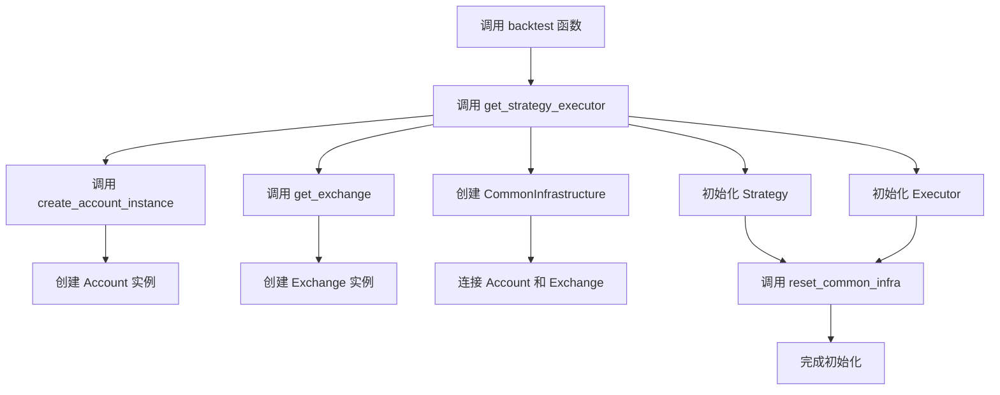
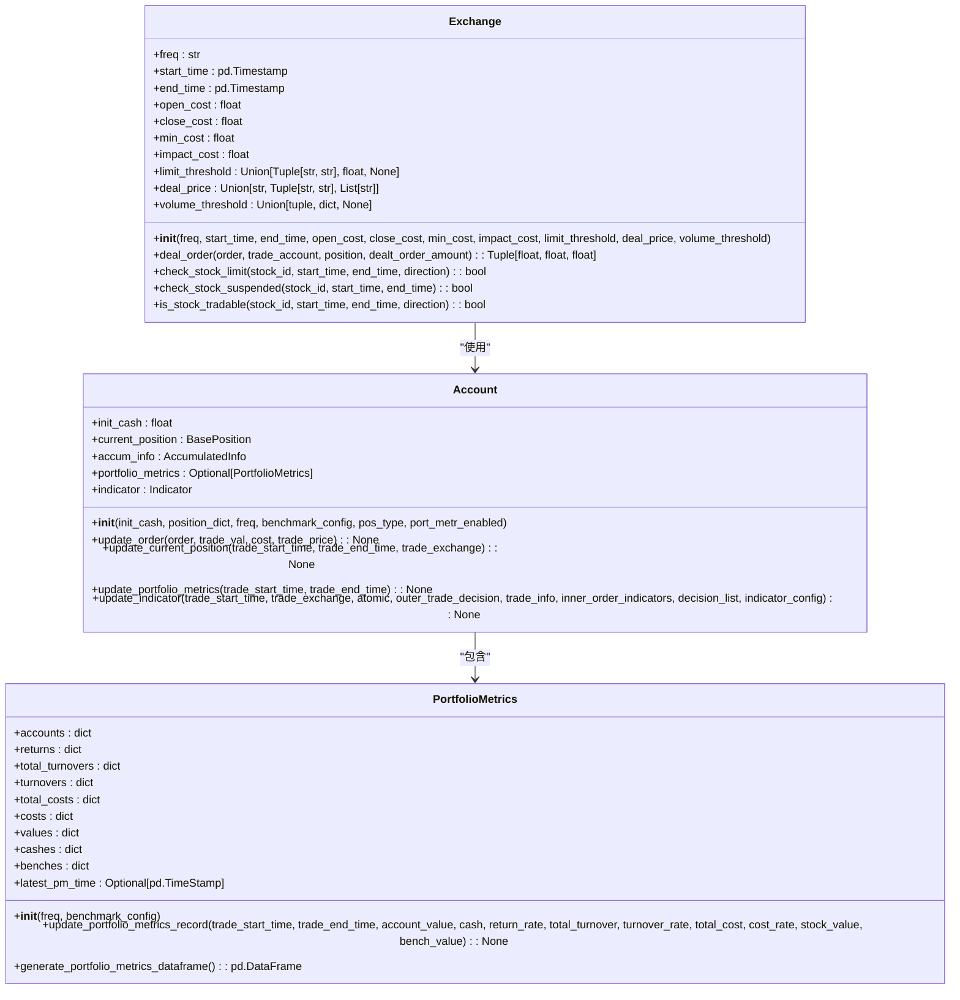
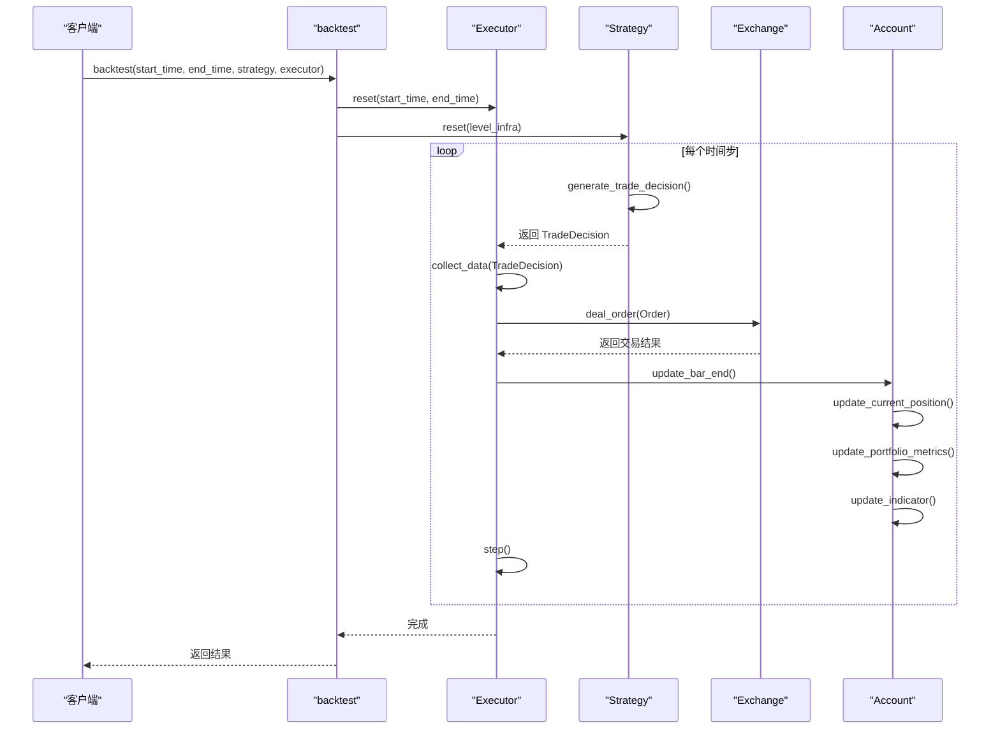
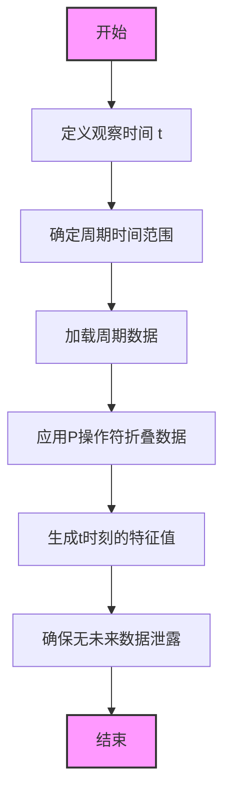

# 回测引擎

<cite>
**本文档引用的文件**   
- [__init__.py](file://qlib/backtest/__init__.py)
- [backtest.py](file://qlib/backtest/backtest.py)
- [exchange.py](file://qlib/backtest/exchange.py)
- [executor.py](file://qlib/backtest/executor.py)
- [account.py](file://qlib/backtest/account.py)
- [position.py](file://qlib/backtest/position.py)
- [report.py](file://qlib/backtest/report.py)
- [utils.py](file://qlib/backtest/utils.py)
- [decision.py](file://qlib/backtest/decision.py)
- [config.py](file://qlib/config.py)
- [pit.py](file://qlib/data/pit.py)
- [workflow_by_code.py](file://examples/workflow_by_code.py)
</cite>

## 目录
1. [引言](#引言)
2. [回测引擎初始化流程](#回测引擎初始化流程)
3. [核心配置项](#核心配置项)
4. [工作时序协调机制](#工作时序协调机制)
5. [PIT数据访问机制](#pit数据访问机制)
6. [编程方式构建回测流程](#编程方式构建回测流程)
7. [常见问题排查指南](#常见问题排查指南)
8. [结论](#结论)

## 引言

回测引擎是量化投资研究中的核心组件，用于模拟交易策略在历史数据上的表现。本文档全面文档化回测引擎的初始化流程、核心配置项、工作时序协调机制以及PIT（Point-in-Time）数据访问机制。通过分析代码库，我们将深入探讨引擎如何协调数据提供者、策略、执行器和报告模块的工作，重点说明PIT机制在防止未来数据泄露中的作用及其配置方式。同时，通过`workflow_by_code.py`中的示例，展示如何通过编程方式构建复杂的回测流程，并提供常见问题的排查指南。

**本文档引用的文件**  
- [__init__.py](file://qlib/backtest/__init__.py#L1-L350)
- [workflow_by_code.py](file://examples/workflow_by_code.py#L1-L86)

## 回测引擎初始化流程

回测引擎的初始化是一个多步骤的过程，涉及多个核心组件的协同工作。整个流程从调用`backtest`函数开始，该函数是用户与回测系统交互的主要入口点。

初始化流程的核心是`get_strategy_executor`函数，它负责创建和配置策略（Strategy）与执行器（Executor）实例。该函数首先调用`create_account_instance`来创建交易账户，然后调用`get_exchange`来获取或创建交易所实例。这些组件通过`CommonInfrastructure`对象进行连接，确保它们能够共享必要的基础设施。

**Diagram sources **  
- [__init__.py](file://qlib/backtest/__init__.py#L177-L214)
- [backtest.py](file://qlib/backtest/backtest.py#L217-L276)

**本文档引用的文件**  
- [__init__.py](file://qlib/backtest/__init__.py#L1-L350)
- [backtest.py](file://qlib/backtest/backtest.py#L1-L111)
- [account.py](file://qlib/backtest/account.py#L1-L418)
- [exchange.py](file://qlib/backtest/exchange.py#L1-L800)
- [utils.py](file://qlib/backtest/utils.py#L1-L291)

## 核心配置项

回测引擎提供了丰富的配置项，允许用户精确控制回测的各个方面。这些配置项主要分为基准指数设置、交易成本模型和滑点模拟三大类。

### 基准指数设置

基准指数用于评估策略的相对表现。在`PortfolioMetrics`类中，可以通过`benchmark_config`参数进行配置。该配置支持多种输入格式，包括字符串代码（如"SH000300"）、股票列表或直接的`pd.Series`时间序列数据。基准指数的收益率将被计算并用于生成相对绩效指标。

### 交易成本模型

交易成本模型由`Exchange`类管理，主要通过以下三个参数配置：
- `open_cost`: 开仓交易成本率
- `close_cost`: 平仓交易成本率
- `min_cost`: 最小交易成本

这些参数在`Exchange`的初始化方法中定义，并在订单执行时由`deal_order`方法应用。交易成本会直接影响账户的现金和累计成本，从而影响最终的回测结果。

### 滑点模拟

滑点（Slippage）模拟通过`impact_cost`参数实现，该参数代表市场冲击成本率。在`Exchange`类中，`deal_order`方法会根据此参数计算实际成交价格与目标价格之间的差异。此外，`volume_threshold`参数可用于设置成交量限制，进一步模拟真实市场中的流动性约束。

**Diagram sources **  
- [exchange.py](file://qlib/backtest/exchange.py#L38-L200)
- [account.py](file://qlib/backtest/account.py#L79-L110)
- [report.py](file://qlib/backtest/report.py#L22-L42)

**本文档引用的文件**  
- [exchange.py](file://qlib/backtest/exchange.py#L1-L800)
- [account.py](file://qlib/backtest/account.py#L1-L418)
- [report.py](file://qlib/backtest/report.py#L1-L652)

## 工作时序协调机制

回测引擎通过一个精巧的时序协调机制来管理策略、执行器、数据提供者和报告模块之间的交互。这个机制的核心是`TradeCalendarManager`，它负责管理交易日历和时间步进。

### 主要组件及其交互

回测流程的主循环在`collect_data_loop`函数中实现。该函数通过一个`while`循环迭代，直到执行器报告交易完成。在每个时间步，策略生成交易决策，执行器收集并执行这些决策，最后账户和报告模块更新状态。

**Diagram sources **  
- [backtest.py](file://qlib/backtest/backtest.py#L53-L93)
- [executor.py](file://qlib/backtest/executor.py#L227-L303)
- [account.py](file://qlib/backtest/account.py#L338-L403)

**本文档引用的文件**  
- [backtest.py](file://qlib/backtest/backtest.py#L1-L111)
- [executor.py](file://qlib/backtest/executor.py#L1-L629)
- [strategy/base.py](file://qlib/strategy/base.py#L1-L297)
- [account.py](file://qlib/backtest/account.py#L1-L418)

## PIT数据访问机制

PIT（Point-in-Time）数据访问机制是防止未来数据泄露的关键技术。它确保在任何时间点t，策略只能访问到在t时刻之前已经公开的数据。

### PIT机制原理

PIT机制的核心思想是将数据分为“观察时间”（observe_time）和“周期时间”（period_time）。例如，计算2019年7月19日的过去四个季度的平均收益时，观察时间是2019年7月19日，而周期时间是过去四个季度的财报发布日期。

在QLib中，`P`操作符用于实现PIT机制。当加载一个PIT表达式时，系统会为每个观察时间点加载相应的周期数据，并将其“折叠”成一个点，从而确保不会引入未来信息。

**Diagram sources **  
- [pit.py](file://qlib/data/pit.py#L1-L72)
- [config.py](file://qlib/config.py#L226-L237)

**本文档引用的文件**  
- [pit.py](file://qlib/data/pit.py#L1-L72)
- [config.py](file://qlib/config.py#L1-L527)

## 编程方式构建回测流程

QLib支持通过编程方式构建复杂的回测流程，这提供了比YAML配置文件更大的灵活性。`workflow_by_code.py`示例展示了如何通过代码实现完整的量化研究工作流。

### 示例分析

该示例首先初始化QLib环境，然后通过`init_instance_by_config`函数创建模型和数据集实例。接着，它定义了一个包含执行器、策略和回测参数的配置字典。最后，它使用记录器（Recorder）来管理实验，并依次生成信号、进行信号分析和执行回测。

这种编程方式的优势在于可以轻松地集成Python的控制流语句（如循环和条件判断），实现动态的、复杂的回测逻辑。例如，可以根据市场状态动态调整策略参数，或在不同时间段使用不同的模型。

**本文档引用的文件**  
- [workflow_by_code.py](file://examples/workflow_by_code.py#L1-L86)

## 常见问题排查指南

在使用回测引擎时，可能会遇到各种问题。本节提供了一些常见问题的排查指南。

### 回测结果偏差分析

回测结果偏差可能由多种因素引起：
1. **未来数据泄露**：检查是否正确使用了PIT机制，确保所有特征计算都遵循时间一致性原则。
2. **交易成本设置不当**：验证`open_cost`、`close_cost`和`min_cost`参数是否符合实际市场情况。
3. **滑点模拟不足**：调整`impact_cost`和`volume_threshold`参数，使其更贴近真实市场流动性。

### 内存占用优化

对于大规模回测，内存占用可能成为一个瓶颈。优化建议包括：
1. **使用磁盘缓存**：在`config.py`中启用`DISK_EXPRESSION_CACHE`和`DISK_DATASET_CACHE`。
2. **限制数据加载范围**：精确设置`start_time`和`end_time`，避免加载不必要的历史数据。
3. **减少并行度**：调整`kernels`参数，平衡计算速度和内存使用。

### 多进程加速配置

QLib支持多进程加速，可以通过以下方式配置：
1. **设置joblib_backend**：在`config.py`中将`joblib_backend`设置为"multiprocessing"。
2. **调整kernels数量**：根据CPU核心数设置`kernels`参数，通常设置为`max(multiprocessing.cpu_count() - 2, 1)`。
3. **配置maxtasksperchild**：设置`maxtasksperchild`参数以控制每个进程处理的任务数，有助于内存管理。

**本文档引用的文件**  
- [config.py](file://qlib/config.py#L1-L527)
- [workflow_by_code.py](file://examples/workflow_by_code.py#L1-L86)

## 结论

本文档全面文档化了QLib回测引擎的核心功能和工作机制。我们详细介绍了引擎的初始化流程、核心配置项、工作时序协调机制以及PIT数据访问机制。通过分析代码库，我们展示了如何通过编程方式构建复杂的回测流程，并提供了常见问题的排查指南。理解这些核心概念对于有效使用QLib进行量化投资研究至关重要。未来的工作可以进一步探索更高级的配置选项和优化技巧，以提升回测的准确性和效率。