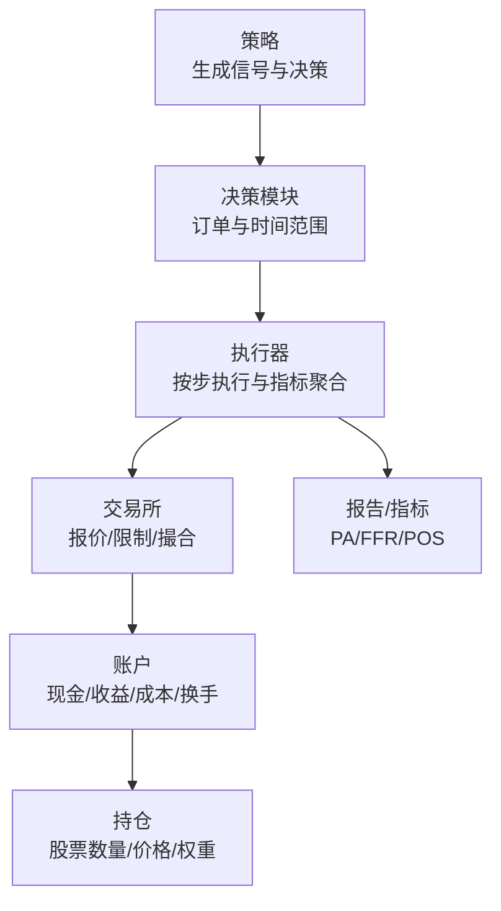
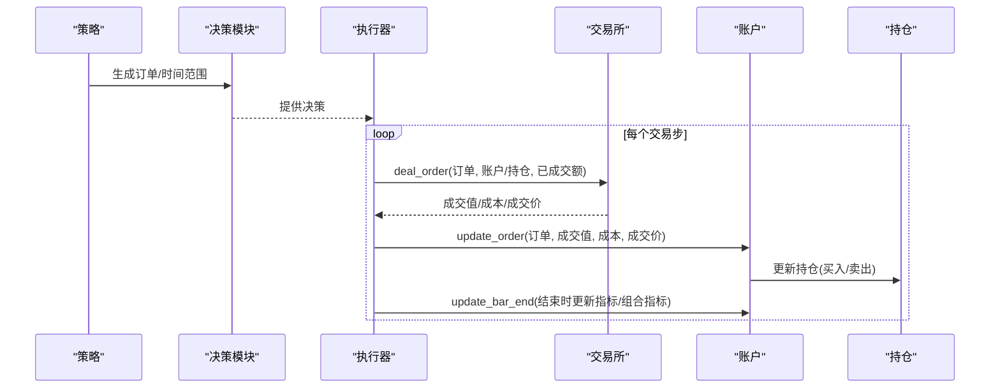
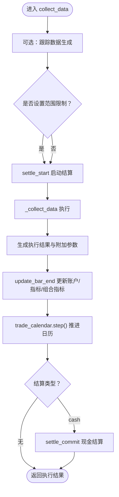
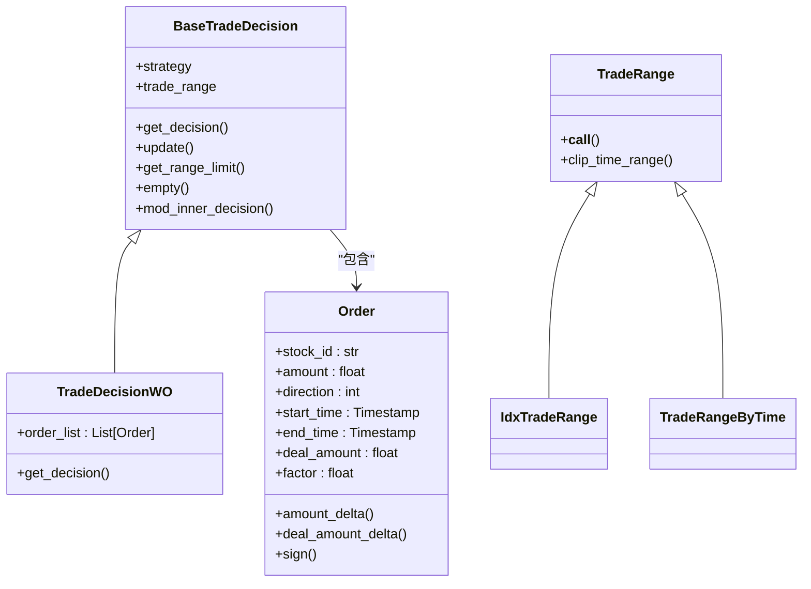
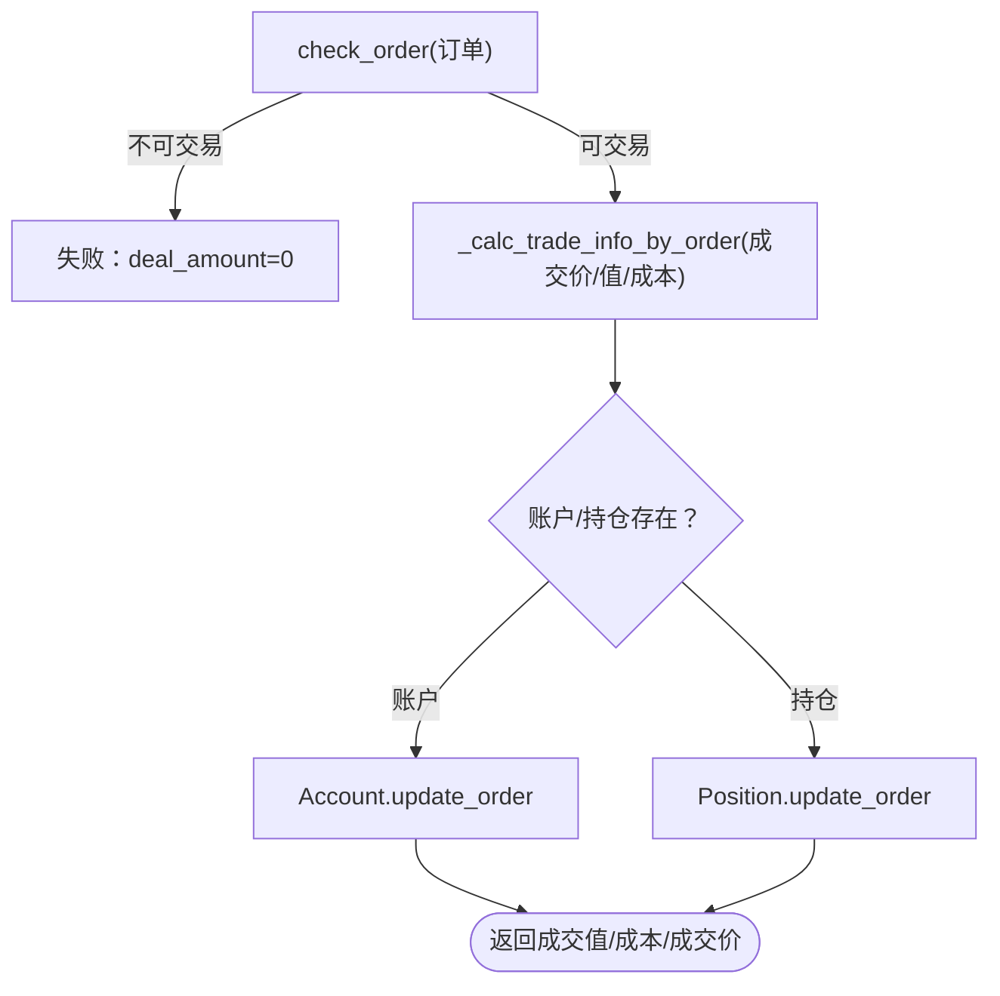
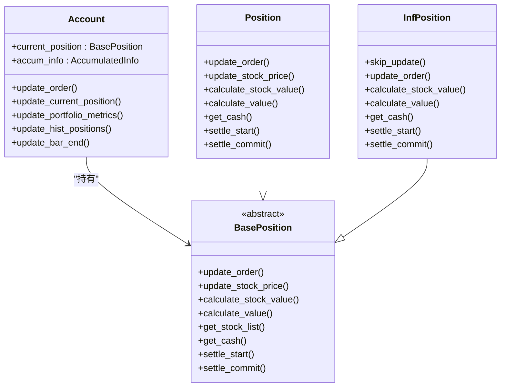
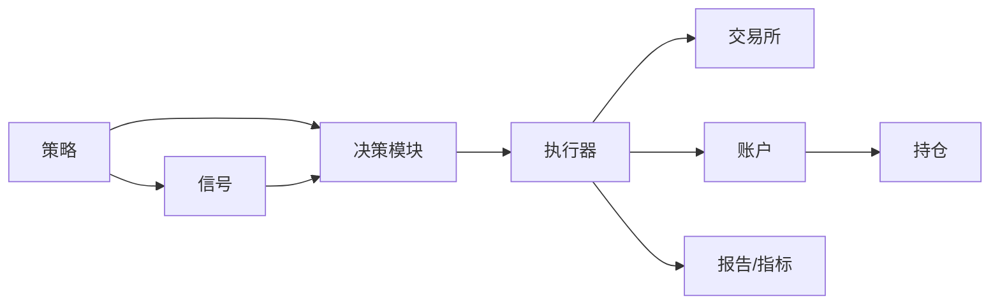

# 执行器

<cite>
**本文引用的文件列表**
- [executor.py](file://qlib/backtest/executor.py)
- [decision.py](file://qlib/backtest/decision.py)
- [exchange.py](file://qlib/backtest/exchange.py)
- [account.py](file://qlib/backtest/account.py)
- [position.py](file://qlib/backtest/position.py)
- [utils.py](file://qlib/backtest/utils.py)
- [report.py](file://qlib/backtest/report.py)
- [signal.py](file://qlib/backtest/signal.py)
</cite>

## 目录
1. [引言](#引言)
2. [项目结构](#项目结构)
3. [核心组件](#核心组件)
4. [架构总览](#架构总览)
5. [详细组件分析](#详细组件分析)
6. [依赖关系分析](#依赖关系分析)
7. [性能考量](#性能考量)
8. [故障排查指南](#故障排查指南)
9. [结论](#结论)
10. [附录](#附录)

## 引言
本文件围绕执行器（Executor）在回测框架中的核心职责与工作流程展开，系统性阐述从策略生成的调仓信号到具体买卖订单的执行过程；解释执行器支持的订单执行模式与配置参数；文档化决策模块的信号解析机制（目标权重计算、交易量分配算法）；结合交易所与账户模块，说明交易撮合逻辑、持仓更新与资金变动的完整链条；最后给出性能优化建议与高级执行策略定制方法。

## 项目结构
执行器相关代码主要位于 backtest 子模块中，围绕“策略-决策-执行器-交易所-账户”的闭环组织：
- 策略与信号：策略基于信号生成交易决策（订单集合），信号可来自缓存或模型预测。
- 决策模块：定义订单数据结构与决策容器，支持时间范围限制与层级传播。
- 执行器：负责按步推进、收集数据、执行订单、更新指标与账户。
- 交易所：提供报价、成交量、涨跌停、交易单位等约束，完成撮合与成本计算。
- 账户与持仓：维护现金、股票头寸、累计收益/成本/换手等指标，支持结算机制。

图表来源
- [executor.py](file://qlib/backtest/executor.py#L180-L304)
- [decision.py](file://qlib/backtest/decision.py#L302-L596)
- [exchange.py](file://qlib/backtest/exchange.py#L421-L464)
- [account.py](file://qlib/backtest/account.py#L180-L418)
- [position.py](file://qlib/backtest/position.py#L231-L566)
- [report.py](file://qlib/backtest/report.py#L249-L652)

章节来源
- [executor.py](file://qlib/backtest/executor.py#L180-L304)
- [decision.py](file://qlib/backtest/decision.py#L302-L596)
- [exchange.py](file://qlib/backtest/exchange.py#L421-L464)
- [account.py](file://qlib/backtest/account.py#L180-L418)
- [position.py](file://qlib/backtest/position.py#L231-L566)
- [report.py](file://qlib/backtest/report.py#L249-L652)

## 核心组件
- 执行器基类与嵌套执行器
  - BaseExecutor：统一管理交易日历、基础设施、指标配置、账户与交易所接入；提供 execute/collect_data 流程与 bar 结束时的指标与账户更新。
  - NestedExecutor：在更高频环境中嵌套执行，支持外层策略对内层策略的决策传播与范围限制。
  - SimulatorExecutor：模拟真实市场，支持串行/并行两种交易类型，逐笔执行订单并返回成交结果。
- 决策模块
  - Order：订单数据结构，包含股票代码、方向、数量、起止时间、已成交数量与因子等。
  - BaseTradeDecision/TradeDecisionWO：决策容器，封装订单列表与时间范围限制，支持空决策与层级传播。
  - TradeRange/IdxTradeRange/TradeRangeByTime：时间范围限制工具，支持索引区间与按时间区间裁剪。
- 交易所
  - Exchange：提供报价、涨跌停检查、成交量限制、交易单位与因子处理、目标金额/权重到订单的生成、撮合与成本计算。
- 账户与持仓
  - Account：维护当前持仓、累计收益/成本/换手，更新每日收盘价、持有天数，生成组合指标与历史持仓快照。
  - BasePosition/Position/InfPosition：抽象与实现不同类型的持仓，支持结算延迟、权重更新、价值计算。
- 报告与指标
  - Indicator：按订单与步骤聚合指标（成交额、成交数量、成本、方向、满成率、价格优势、正向比率等）。
  - PortfolioMetrics：按日生成组合指标（账户值、收益、成本、换手、基准收益等）。
- 信号
  - Signal/SignalWCache/ModelSignal：统一信号接口，支持缓存与模型预测信号。

章节来源
- [executor.py](file://qlib/backtest/executor.py#L22-L304)
- [executor.py](file://qlib/backtest/executor.py#L310-L629)
- [decision.py](file://qlib/backtest/decision.py#L30-L205)
- [decision.py](file://qlib/backtest/decision.py#L206-L596)
- [exchange.py](file://qlib/backtest/exchange.py#L28-L200)
- [exchange.py](file://qlib/backtest/exchange.py#L421-L790)
- [account.py](file://qlib/backtest/account.py#L71-L418)
- [position.py](file://qlib/backtest/position.py#L16-L566)
- [report.py](file://qlib/backtest/report.py#L249-L652)
- [signal.py](file://qlib/backtest/signal.py#L1-L106)

## 架构总览
执行器工作流从策略生成决策开始，经由执行器按步推进，调用交易所进行撮合，更新账户与持仓，最终生成交易指标与组合指标。

图表来源
- [executor.py](file://qlib/backtest/executor.py#L590-L629)
- [exchange.py](file://qlib/backtest/exchange.py#L421-L464)
- [account.py](file://qlib/backtest/account.py#L203-L224)
- [position.py](file://qlib/backtest/position.py#L390-L400)
- [report.py](file://qlib/backtest/report.py#L338-L403)

## 详细组件分析

### 执行器：职责与流程
- 基础职责
  - 维护交易日历与基础设施（账户、交易所、日历）。
  - 接收策略决策，按步推进，产出执行结果。
  - 在每步结束更新账户与指标，支持原子与嵌套执行器。
- 关键流程
  - collect_data：生成训练数据（可选）、执行订单、更新账户、推进日历、结算（可选）。
  - execute：兼容旧接口，内部委托 collect_data。
  - NestedExecutor：在子级别重置日历、注入内层策略、按范围限制执行、汇总内层指标。
- 订单执行模式
  - SimulatorExecutor 支持串行与并行两种交易类型：
    - 串行：按订单顺序依次执行，适合先卖后买场景。
    - 并行：按方向排序（先买后卖）以规避资金冲突，假设同一策略步内不会出现同向冲突。
- 指标与配置
  - indicator_config：支持满成率（FFR）与价格优势（PA）的加权方式与基础价格聚合方式。
  - generate_portfolio_metrics：是否生成组合指标。
  - settle_type：支持结算延迟（cash）等机制。

图表来源
- [executor.py](file://qlib/backtest/executor.py#L227-L304)
- [executor.py](file://qlib/backtest/executor.py#L396-L484)
- [account.py](file://qlib/backtest/account.py#L338-L403)
- [position.py](file://qlib/backtest/position.py#L487-L501)

章节来源
- [executor.py](file://qlib/backtest/executor.py#L180-L304)
- [executor.py](file://qlib/backtest/executor.py#L310-L629)

### 决策模块：信号解析与订单生成
- 订单数据结构
  - Order：包含股票代码、方向（买/卖）、数量、起止时间、已成交数量与因子等字段。
  - 方向解析：支持字符串、数值、枚举与数组输入，统一映射为买/卖。
- 决策容器
  - BaseTradeDecision：封装策略生成的决策，支持时间范围限制与层级传播。
  - TradeDecisionWO：直接包含订单列表，自动填充起止时间。
  - EmptyTradeDecision：空决策。
- 时间范围限制
  - TradeRange/IdxTradeRange/TradeRangeByTime：支持索引区间与按时间区间裁剪，用于嵌套执行器的步长控制。
- 目标权重与交易量分配
  - Exchange.generate_amount_position_from_weight_position：根据权重与可用现金，计算可购买的调整后数量字典。
  - Exchange.generate_order_for_target_amount_position：根据目标与当前头寸，生成买卖订单列表，考虑交易单位与涨跌停限制。

图表来源
- [decision.py](file://qlib/backtest/decision.py#L30-L205)
- [decision.py](file://qlib/backtest/decision.py#L206-L596)

章节来源
- [decision.py](file://qlib/backtest/decision.py#L30-L205)
- [decision.py](file://qlib/backtest/decision.py#L206-L596)
- [exchange.py](file://qlib/backtest/exchange.py#L534-L678)

### 交易所：撮合与约束
- 报价与限制
  - get_deal_price：按买卖方向选择报价字段，默认使用成交价，若为空则回退到收盘价。
  - check_stock_suspended/check_stock_limit：检查停牌与涨跌停限制。
  - limit_threshold/volume_threshold：支持表达式与阈值两种限制类型，支持累计与实时容量限制。
- 撮合与成本
  - deal_order：检查订单合法性，计算成交价、成交值与成本，更新订单与账户/持仓。
  - round_amount_by_trade_unit/get_amount_of_trade_unit：按交易单位与因子进行向下取整，确保符合最小交易单位。
- 目标到订单的生成
  - generate_amount_position_from_weight_position：按权重与现金计算目标数量。
  - generate_order_for_target_amount_position：根据目标与当前头寸生成买卖订单，考虑交易单位与可交易性。

图表来源
- [exchange.py](file://qlib/backtest/exchange.py#L421-L464)
- [account.py](file://qlib/backtest/account.py#L203-L224)
- [position.py](file://qlib/backtest/position.py#L390-L400)

章节来源
- [exchange.py](file://qlib/backtest/exchange.py#L28-L200)
- [exchange.py](file://qlib/backtest/exchange.py#L421-L790)

### 账户与持仓：资金与头寸更新
- 资金变动
  - update_order：按买卖方向先更新账户状态再更新持仓，或反之，确保成本扣减正确。
  - 累计指标：累计收益、成本、换手，用于组合指标计算。
- 持仓更新
  - update_stock_price/update_order：按收盘价更新持仓价格与数量，支持结算延迟（cash）。
  - 权重与价值：计算股票价值与总资产，更新权重。
- 组合指标
  - update_current_position/update_portfolio_metrics：按日更新账户值、收益、成本、换手与基准收益。
  - update_hist_positions：记录历史持仓快照。

图表来源
- [account.py](file://qlib/backtest/account.py#L71-L418)
- [position.py](file://qlib/backtest/position.py#L16-L566)

章节来源
- [account.py](file://qlib/backtest/account.py#L180-L418)
- [position.py](file://qlib/backtest/position.py#L231-L566)

### 报告与指标：PA/FFR/POS
- 订单级指标
  - update_order_indicators：填充订单级指标（成交数量、成交价、成交值、成本、方向、满成率）。
- 步骤级指标
  - agg_order_indicators：聚合内层指标，计算价格优势（PA）与满成率（FFR），支持按数量/价值加权。
  - cal_trade_indicators：汇总满成率、价格优势、正向比率、成交数量、成交额与订单数。
- 组合指标
  - PortfolioMetrics：按日生成账户值、收益、成本、换手、基准收益等指标序列。

章节来源
- [report.py](file://qlib/backtest/report.py#L249-L652)

### 信号到订单：策略与信号
- 信号接口
  - Signal/SignalWCache/ModelSignal：统一信号接口，支持缓存与模型预测信号。
  - create_signal_from：根据输入对象创建信号实例。
- 与决策的关系
  - 策略基于信号生成目标权重或直接生成订单，封装为 TradeDecisionWO 或自定义决策类型，交由执行器执行。

章节来源
- [signal.py](file://qlib/backtest/signal.py#L1-L106)
- [decision.py](file://qlib/backtest/decision.py#L547-L596)

## 依赖关系分析
- 执行器依赖
  - 决策模块：接收订单与时间范围限制。
  - 交易所：进行报价、限制检查与撮合。
  - 账户与持仓：更新资金与头寸。
  - 日历与基础设施：统一管理频率、起止时间与共享资源。
- 指标依赖
  - 报告模块：聚合订单与步骤级指标，生成 PA/FFR/POS 与组合指标。
- 信号依赖
  - 策略依赖信号模块生成预测信号，进而生成订单。

图表来源
- [executor.py](file://qlib/backtest/executor.py#L180-L304)
- [decision.py](file://qlib/backtest/decision.py#L302-L596)
- [exchange.py](file://qlib/backtest/exchange.py#L421-L464)
- [account.py](file://qlib/backtest/account.py#L338-L403)
- [report.py](file://qlib/backtest/report.py#L539-L629)
- [signal.py](file://qlib/backtest/signal.py#L1-L106)

章节来源
- [utils.py](file://qlib/backtest/utils.py#L1-L291)
- [executor.py](file://qlib/backtest/executor.py#L180-L304)

## 性能考量
- 批量处理订单
  - 使用并行交易类型（并行先买后卖）减少资金占用冲突，提升吞吐。
  - 在高频场景下，优先使用高效数据结构与向量化操作（例如指数数据与数组指标）。
- 指标计算优化
  - 指标聚合采用分层汇总与加权平均，避免重复计算；合理设置 PA 的基础价格聚合方式（TWAP/VWAP）。
- 数据加载与缓存
  - 利用交易所的数据缓存与字段预加载，减少重复查询。
- 日志与调试
  - 在 verbose 模式下输出关键交易信息，便于定位问题；但生产回测应关闭以降低开销。

[本节为通用指导，不直接分析具体文件]

## 故障排查指南
- 订单未成交
  - 检查是否触发涨跌停或停牌：使用交易所的限制检查函数。
  - 检查交易单位与因子：确认 round_amount_by_trade_unit 是否导致成交数量为零。
- 资金不足或结算冲突
  - 若启用结算延迟（cash），需等待 settle_commit 后才可使用当日资金。
- 指标异常
  - 满成率/价格优势为空：确认订单成交值非零且基础价格有效。
  - 组合指标缺失：确认已启用组合指标生成与正确的基准配置。

章节来源
- [exchange.py](file://qlib/backtest/exchange.py#L421-L464)
- [position.py](file://qlib/backtest/position.py#L487-L501)
- [report.py](file://qlib/backtest/report.py#L539-L629)

## 结论
执行器作为策略与市场的桥梁，承担了从订单到成交、从成交到资金与头寸更新的全流程职责。通过决策模块的标准化订单与时间范围控制、交易所的严格约束与撮合、账户与持仓的精确更新以及报告模块的多维指标，形成了完整的回测闭环。合理配置执行模式与指标参数、利用并行与批量处理策略，可在保证精度的同时显著提升回测效率。

## 附录
- 高级执行策略定制建议
  - 自定义执行器：继承 BaseExecutor，重写 _collect_data 以实现特定的订单调度与风控策略。
  - 自定义订单生成：在策略中使用 Exchange.generate_order_for_target_amount_position 或 generate_amount_position_from_weight_position，结合 volume_threshold 与交易单位约束。
  - 指标扩展：在 Indicator 中增加新的订单级或步骤级指标，或在 PortfolioMetrics 中扩展组合指标列。

章节来源
- [executor.py](file://qlib/backtest/executor.py#L22-L119)
- [exchange.py](file://qlib/backtest/exchange.py#L534-L678)
- [report.py](file://qlib/backtest/report.py#L249-L652)