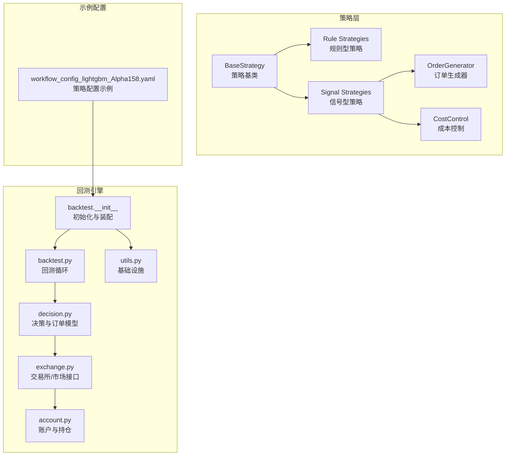
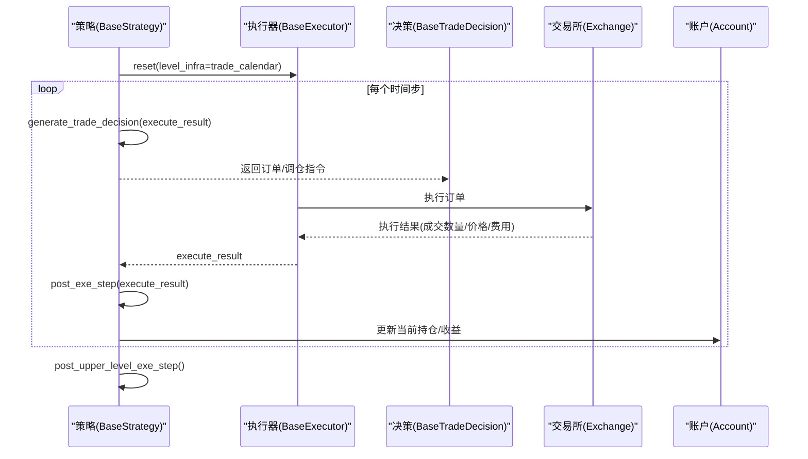
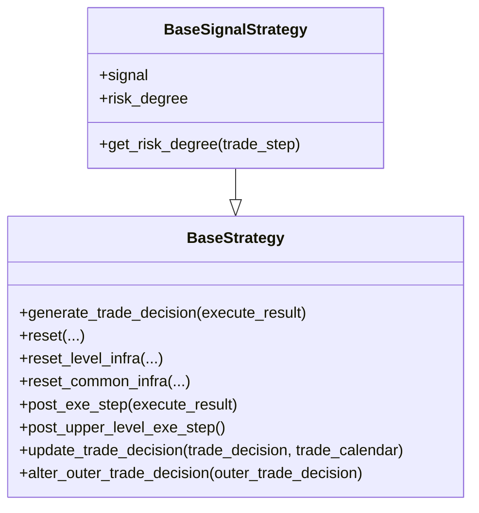
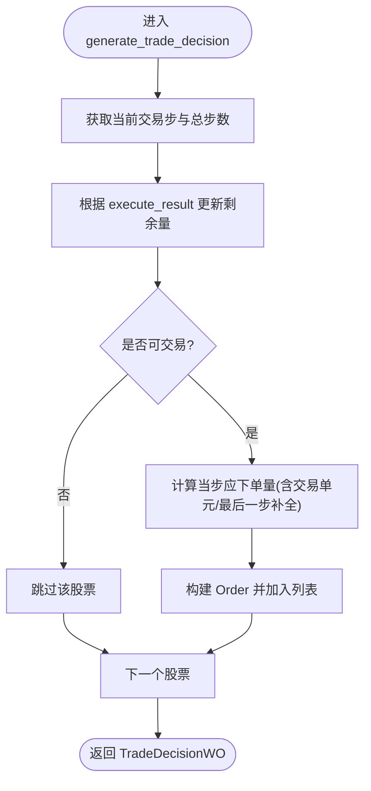
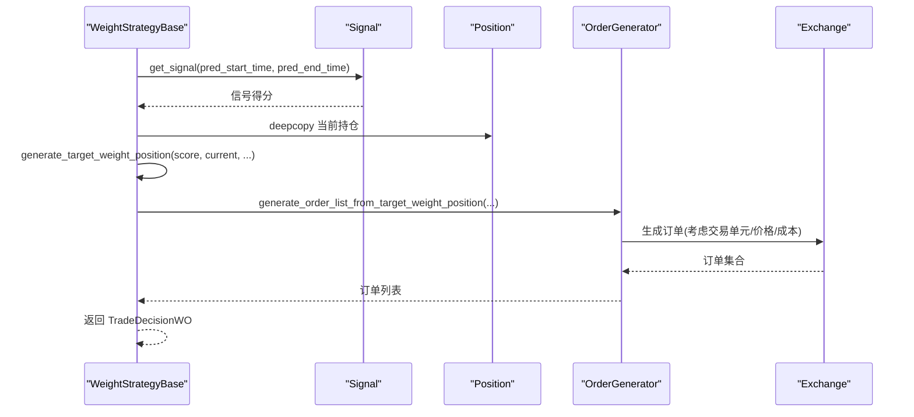
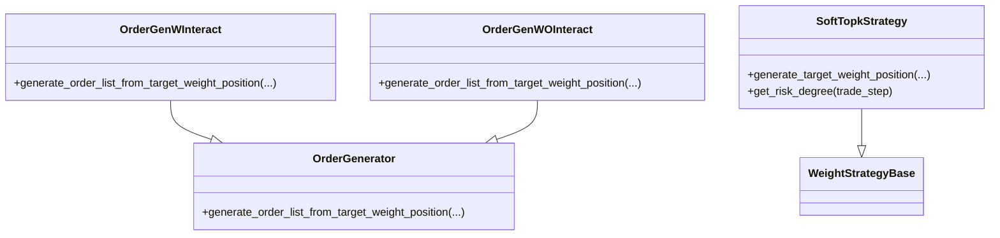
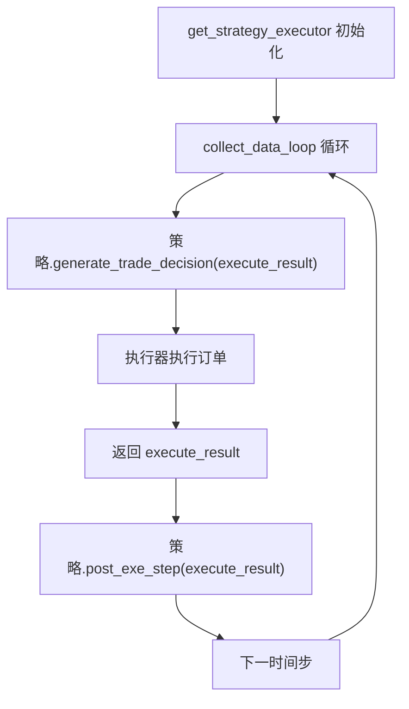
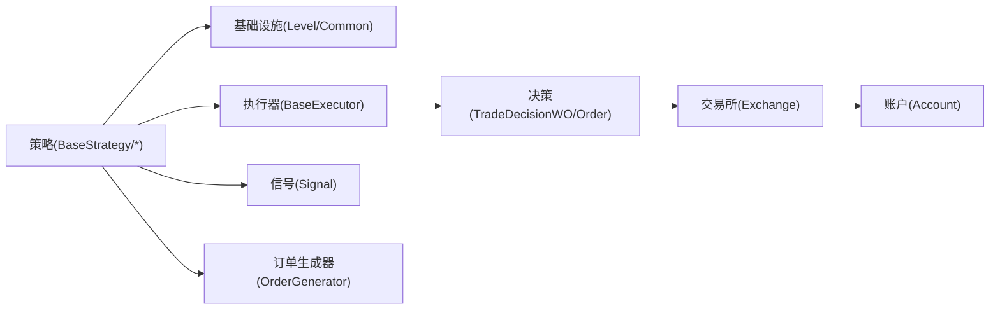

# 策略接口

<cite>
**本文引用的文件列表**
- [qlib/strategy/base.py](file://qlib/strategy/base.py)
- [qlib/contrib/strategy/rule_strategy.py](file://qlib/contrib/strategy/rule_strategy.py)
- [qlib/contrib/strategy/signal_strategy.py](file://qlib/contrib/strategy/signal_strategy.py)
- [qlib/contrib/strategy/order_generator.py](file://qlib/contrib/strategy/order_generator.py)
- [qlib/contrib/strategy/cost_control.py](file://qlib/contrib/strategy/cost_control.py)
- [qlib/backtest/__init__.py](file://qlib/backtest/__init__.py)
- [qlib/backtest/backtest.py](file://qlib/backtest/backtest.py)
- [qlib/backtest/decision.py](file://qlib/backtest/decision.py)
- [qlib/backtest/exchange.py](file://qlib/backtest/exchange.py)
- [qlib/backtest/account.py](file://qlib/backtest/account.py)
- [qlib/backtest/utils.py](file://qlib/backtest/utils.py)
- [examples/benchmarks/LightGBM/workflow_config_lightgbm_Alpha158.yaml](file://examples/benchmarks/LightGBM/workflow_config_lightgbm_Alpha158.yaml)
</cite>

## 目录
1. [引言](#引言)
2. [项目结构](#项目结构)
3. [核心组件](#核心组件)
4. [架构总览](#架构总览)
5. [详细组件分析](#详细组件分析)
6. [依赖关系分析](#依赖关系分析)
7. [性能考量](#性能考量)
8. [故障排查指南](#故障排查指南)
9. [结论](#结论)
10. [附录](#附录)

## 引言
本文件系统性地文档化 Qlib 的策略接口设计与实现，重点对比 rule_strategy 与 signal_strategy 两类策略模式的架构差异与适用场景；解释如何通过继承 BaseStrategy 实现自定义交易逻辑，以及 generate_trade_decision 生命周期方法的调用机制；结合 examples 中的工作流配置文件，展示如何在实际回测中配置与使用不同策略；并说明 order_generator 的订单生成逻辑与 cost_control 的交易成本控制机制；最后阐述策略与回测引擎之间的交互协议，包括信号输入格式、调仓周期处理与异常恢复机制。

## 项目结构
策略接口位于 qlib/strategy 与 qlib/contrib/strategy 下，分别包含通用策略基类与具体策略实现：
- 策略基类：qlib/strategy/base.py
- 规则型策略（rule_strategy）：twap、分段择时（SBB）、波动率自适应（AC）、随机采样（RandomOrder）、文件读取（FileOrder）
- 信号型策略（signal_strategy）：TopkDropout、基于权重的目标组合（WeightStrategyBase）、增强指数（EnhancedIndexing）
- 订单生成器（order_generator）：根据目标权重生成订单
- 成本控制（cost_control）：软TopK等策略
- 回测交互：qlib/backtest/* 提供策略与执行器的交互协议

图表来源
- [qlib/strategy/base.py](file://qlib/strategy/base.py#L1-L297)
- [qlib/contrib/strategy/rule_strategy.py](file://qlib/contrib/strategy/rule_strategy.py#L1-L673)
- [qlib/contrib/strategy/signal_strategy.py](file://qlib/contrib/strategy/signal_strategy.py#L1-L523)
- [qlib/contrib/strategy/order_generator.py](file://qlib/contrib/strategy/order_generator.py#L1-L219)
- [qlib/contrib/strategy/cost_control.py](file://qlib/contrib/strategy/cost_control.py#L1-L102)
- [qlib/backtest/backtest.py](file://qlib/backtest/backtest.py#L1-L111)
- [qlib/backtest/__init__.py](file://qlib/backtest/__init__.py#L1-L350)
- [qlib/backtest/decision.py](file://qlib/backtest/decision.py#L1-L200)
- [qlib/backtest/exchange.py](file://qlib/backtest/exchange.py#L120-L140)
- [qlib/backtest/account.py](file://qlib/backtest/account.py#L225-L248)
- [qlib/backtest/utils.py](file://qlib/backtest/utils.py#L252-L290)
- [examples/benchmarks/LightGBM/workflow_config_lightgbm_Alpha158.yaml](file://examples/benchmarks/LightGBM/workflow_config_lightgbm_Alpha158.yaml#L1-L72)

章节来源
- [qlib/strategy/base.py](file://qlib/strategy/base.py#L1-L297)
- [qlib/contrib/strategy/rule_strategy.py](file://qlib/contrib/strategy/rule_strategy.py#L1-L673)
- [qlib/contrib/strategy/signal_strategy.py](file://qlib/contrib/strategy/signal_strategy.py#L1-L523)
- [qlib/contrib/strategy/order_generator.py](file://qlib/contrib/strategy/order_generator.py#L1-L219)
- [qlib/contrib/strategy/cost_control.py](file://qlib/contrib/strategy/cost_control.py#L1-L102)
- [qlib/backtest/backtest.py](file://qlib/backtest/backtest.py#L1-L111)
- [qlib/backtest/__init__.py](file://qlib/backtest/__init__.py#L1-L350)
- [qlib/backtest/decision.py](file://qlib/backtest/decision.py#L1-L200)
- [qlib/backtest/exchange.py](file://qlib/backtest/exchange.py#L120-L140)
- [qlib/backtest/account.py](file://qlib/backtest/account.py#L225-L248)
- [qlib/backtest/utils.py](file://qlib/backtest/utils.py#L252-L290)
- [examples/benchmarks/LightGBM/workflow_config_lightgbm_Alpha158.yaml](file://examples/benchmarks/LightGBM/workflow_config_lightgbm_Alpha158.yaml#L1-L72)

## 核心组件
- BaseStrategy：定义策略抽象与生命周期钩子，提供与回测引擎交互的统一接口。
- Rule Strategies：以规则驱动的交易策略，如 TWAP、SBB、AC、RandomOrder、FileOrder。
- Signal Strategies：以信号驱动的交易策略，如 TopkDropout、WeightStrategyBase、EnhancedIndexing。
- OrderGenerator：将目标权重转换为可执行订单。
- CostControl：对交易行为进行成本与风险控制（如 SoftTopkStrategy）。
- Backtest 协议：通过 backtest_loop 与 collect_data_loop 驱动策略与执行器的交互。

章节来源
- [qlib/strategy/base.py](file://qlib/strategy/base.py#L1-L297)
- [qlib/contrib/strategy/rule_strategy.py](file://qlib/contrib/strategy/rule_strategy.py#L1-L673)
- [qlib/contrib/strategy/signal_strategy.py](file://qlib/contrib/strategy/signal_strategy.py#L1-L523)
- [qlib/contrib/strategy/order_generator.py](file://qlib/contrib/strategy/order_generator.py#L1-L219)
- [qlib/contrib/strategy/cost_control.py](file://qlib/contrib/strategy/cost_control.py#L1-L102)
- [qlib/backtest/backtest.py](file://qlib/backtest/backtest.py#L1-L111)

## 架构总览
策略与回测引擎的交互遵循“策略生成决策 → 执行器执行 → 回传执行结果 → 策略后处理”的闭环流程。策略通过 generate_trade_decision 生成订单或调仓指令，执行器按时间步推进，交易所负责撮合与成本计算，账户维护资产与收益指标。

图表来源
- [qlib/backtest/backtest.py](file://qlib/backtest/backtest.py#L53-L111)
- [qlib/backtest/decision.py](file://qlib/backtest/decision.py#L329-L363)
- [qlib/backtest/exchange.py](file://qlib/backtest/exchange.py#L120-L140)
- [qlib/backtest/account.py](file://qlib/backtest/account.py#L225-L248)
- [qlib/strategy/base.py](file://qlib/strategy/base.py#L133-L147)

## 详细组件分析

### 策略基类与生命周期
- 基类职责：提供 reset/reset_level_infra/reset_common_infra、generate_trade_decision 抽象方法，以及与回测引擎交互的基础设施访问器（交易日历、账户、交易所）。
- 生命周期钩子：
  - generate_trade_decision：每步生成交易决策。
  - post_exe_step：每步执行完成后回调，用于统计、指标更新等。
  - post_upper_level_exe_step：上层执行完成后的收尾工作。
  - update_trade_decision / alter_outer_trade_decision：跨层级策略协作与决策更新。
- 信号型策略扩展：BaseSignalStrategy 支持从 Signal 或 (model, dataset) 创建信号，并提供 risk_degree 动态风控比例。

图表来源
- [qlib/strategy/base.py](file://qlib/strategy/base.py#L23-L297)
- [qlib/contrib/strategy/signal_strategy.py](file://qlib/contrib/strategy/signal_strategy.py#L25-L74)

章节来源
- [qlib/strategy/base.py](file://qlib/strategy/base.py#L23-L297)
- [qlib/contrib/strategy/signal_strategy.py](file://qlib/contrib/strategy/signal_strategy.py#L25-L74)

### Rule Strategies（规则型策略）
- TWAPStrategy：按总步数均匀分配下单量，考虑交易单位与最后一步补全，避免未来信息泄漏。
- SBBStrategyBase/SBBStrategyEMA：相邻两根 K 线内择时，EMA 作为趋势信号，支持交易单元与最后一步补全。
- ACStrategy：基于波动率的自适应拆单，结合交易单元与最后一步补全。
- RandomOrderStrategy：按市场池与成交量采样生成订单。
- FileOrderStrategy：从 CSV 文件读取订单清单。

图表来源
- [qlib/contrib/strategy/rule_strategy.py](file://qlib/contrib/strategy/rule_strategy.py#L43-L123)
- [qlib/contrib/strategy/rule_strategy.py](file://qlib/contrib/strategy/rule_strategy.py#L157-L295)
- [qlib/contrib/strategy/rule_strategy.py](file://qlib/contrib/strategy/rule_strategy.py#L461-L537)

章节来源
- [qlib/contrib/strategy/rule_strategy.py](file://qlib/contrib/strategy/rule_strategy.py#L1-L673)

### Signal Strategies（信号型策略）
- TopkDropoutStrategy：基于信号排序，按 topk 与 n_drop 进行轮动替换，支持仅可交易过滤与涨跌停限制。
- WeightStrategyBase：以信号生成目标权重，再由 OrderGenerator 转换为订单。
- EnhancedIndexingStrategy：结合因子暴露、因子协方差、特异方差与基准权重进行优化，输出目标权重。

图表来源
- [qlib/contrib/strategy/signal_strategy.py](file://qlib/contrib/strategy/signal_strategy.py#L298-L373)
- [qlib/contrib/strategy/order_generator.py](file://qlib/contrib/strategy/order_generator.py#L142-L219)

章节来源
- [qlib/contrib/strategy/signal_strategy.py](file://qlib/contrib/strategy/signal_strategy.py#L1-L523)
- [qlib/contrib/strategy/order_generator.py](file://qlib/contrib/strategy/order_generator.py#L1-L219)

### 订单生成与成本控制
- OrderGenerator 抽象：定义从目标权重到订单列表的转换接口。
- OrderGenWInteract：考虑可交易性与成本率，先计算可交易价值与保留现金，再生成目标金额并生成订单。
- OrderGenWOInteract：不与交易所交互，使用预测日或当前持仓价格估算目标金额，再生成订单。
- SoftTopkStrategy：在 WeightStrategyBase 基础上，对卖出权重进行上限控制与买入权重分配策略（first_fill/average_fill）。

图表来源
- [qlib/contrib/strategy/order_generator.py](file://qlib/contrib/strategy/order_generator.py#L1-L219)
- [qlib/contrib/strategy/cost_control.py](file://qlib/contrib/strategy/cost_control.py#L1-L102)

章节来源
- [qlib/contrib/strategy/order_generator.py](file://qlib/contrib/strategy/order_generator.py#L1-L219)
- [qlib/contrib/strategy/cost_control.py](file://qlib/contrib/strategy/cost_control.py#L1-L102)

### 回测引擎交互协议
- 初始化与装配：get_strategy_executor 会创建账户、交易所与基础设施，并将策略与执行器注入。
- 回测循环：collect_data_loop 按时间步推进，策略生成决策，执行器收集数据并返回执行结果，策略在每步结束后回调 post_exe_step。
- 决策模型：TradeDecisionWO 包含订单列表与时间范围限制；Order 定义了股票、数量、方向、时间窗口等字段。
- 交易所与成本：Exchange 提供交易撮合、价格、手续费、最小费用、涨跌停阈值等参数；Account 维护当前持仓与收益指标。

图表来源
- [qlib/backtest/__init__.py](file://qlib/backtest/__init__.py#L177-L215)
- [qlib/backtest/backtest.py](file://qlib/backtest/backtest.py#L53-L111)
- [qlib/backtest/decision.py](file://qlib/backtest/decision.py#L329-L363)
- [qlib/backtest/exchange.py](file://qlib/backtest/exchange.py#L120-L140)
- [qlib/backtest/account.py](file://qlib/backtest/account.py#L225-L248)

章节来源
- [qlib/backtest/__init__.py](file://qlib/backtest/__init__.py#L1-L350)
- [qlib/backtest/backtest.py](file://qlib/backtest/backtest.py#L1-L111)
- [qlib/backtest/decision.py](file://qlib/backtest/decision.py#L1-L200)
- [qlib/backtest/exchange.py](file://qlib/backtest/exchange.py#L120-L140)
- [qlib/backtest/account.py](file://qlib/backtest/account.py#L225-L248)

### 工作流配置与使用示例
- 在 workflow_config_lightgbm_Alpha158.yaml 中，strategy 使用 TopkDropoutStrategy，通过 signal 指向预测结果占位符，backtest 指定账户规模与交易成本参数，exchange_kwargs 设置涨跌停阈值、成交价、买卖手续费与最低手续费。
- 使用方式：通过 backtest 接口加载配置，自动实例化策略与执行器，运行回测循环并产出指标与报告。

章节来源
- [examples/benchmarks/LightGBM/workflow_config_lightgbm_Alpha158.yaml](file://examples/benchmarks/LightGBM/workflow_config_lightgbm_Alpha158.yaml#L1-L72)
- [qlib/backtest/__init__.py](file://qlib/backtest/__init__.py#L217-L310)

## 依赖关系分析
- 策略对基础设施的依赖：BaseStrategy 通过 level_infra/common_infra 获取 trade_calendar、trade_account、trade_exchange。
- 策略对执行器的依赖：collect_data_loop 驱动策略与执行器交互；执行器内部可能嵌套子执行器与子策略，通过 alter_outer_trade_decision 与 update_trade_decision 协作。
- 信号型策略对信号源的依赖：BaseSignalStrategy 通过 create_signal_from 接受 Signal、(model, dataset)、DataFrame 等多种输入。
- 订单生成器对交易所的依赖：OrderGenerator 依赖 Exchange 的定价、交易单元、成本率与撮合能力。

图表来源
- [qlib/strategy/base.py](file://qlib/strategy/base.py#L1-L297)
- [qlib/backtest/backtest.py](file://qlib/backtest/backtest.py#L53-L111)
- [qlib/backtest/decision.py](file://qlib/backtest/decision.py#L329-L363)
- [qlib/backtest/exchange.py](file://qlib/backtest/exchange.py#L120-L140)
- [qlib/backtest/account.py](file://qlib/backtest/account.py#L225-L248)
- [qlib/contrib/strategy/signal_strategy.py](file://qlib/contrib/strategy/signal_strategy.py#L25-L74)
- [qlib/contrib/strategy/order_generator.py](file://qlib/contrib/strategy/order_generator.py#L1-L219)

章节来源
- [qlib/strategy/base.py](file://qlib/strategy/base.py#L1-L297)
- [qlib/backtest/backtest.py](file://qlib/backtest/backtest.py#L1-L111)
- [qlib/backtest/decision.py](file://qlib/backtest/decision.py#L1-L200)
- [qlib/backtest/exchange.py](file://qlib/backtest/exchange.py#L120-L140)
- [qlib/backtest/account.py](file://qlib/backtest/account.py#L225-L248)
- [qlib/contrib/strategy/signal_strategy.py](file://qlib/contrib/strategy/signal_strategy.py#L1-L523)
- [qlib/contrib/strategy/order_generator.py](file://qlib/contrib/strategy/order_generator.py#L1-L219)

## 性能考量
- 规则型策略（TWAP/SBB/AC）：计算集中在每步的下单量分配与交易单元处理，复杂度较低，适合高频或长周期稳健拆单。
- 信号型策略（TopkDropout/EnhancedIndexing）：依赖信号生成与优化过程，前者复杂度与候选池大小相关，后者涉及矩阵运算与约束求解，需注意缓存与批量化。
- 订单生成器：OrderGenWInteract 考虑可交易性与成本率，可能需要多次价格查询与撮合评估；OrderGenWOInteract 不与交易所交互，但需预估价格，可能引入偏差。
- 成本控制：SoftTopkStrategy 对卖出权重进行裁剪与再分配，增加一次权重重算，需平衡交易成本与组合稳定性。

[本节为通用指导，无需列出具体文件来源]

## 故障排查指南
- 策略未生成有效订单：检查 generate_trade_decision 是否正确处理 execute_result、交易单元与最后一步补全；确认 is_stock_tradable/check_stock_suspended 判断。
- 订单无法成交：检查交易所参数（limit_threshold、deal_price、open_cost、close_cost、min_cost），以及订单方向与时间窗口。
- 信号为空：确认 signal 输入格式与时间窗口匹配；TopkDropoutStrategy 对 DataFrame 多列仅取首列。
- 跨层级协作问题：使用 update_trade_decision/alter_outer_trade_decision 协调内外层策略的决策范围与更新时机。
- 异常恢复：回测循环在每步结束后回调 post_exe_step，可在其中记录异常状态并进行补偿或跳过。

章节来源
- [qlib/contrib/strategy/rule_strategy.py](file://qlib/contrib/strategy/rule_strategy.py#L1-L673)
- [qlib/contrib/strategy/signal_strategy.py](file://qlib/contrib/strategy/signal_strategy.py#L1-L523)
- [qlib/backtest/backtest.py](file://qlib/backtest/backtest.py#L53-L111)
- [qlib/backtest/exchange.py](file://qlib/backtest/exchange.py#L120-L140)

## 结论
- Rule Strategies 适用于规则明确、稳健拆单与简单择时场景；Signal Strategies 更适合以信号驱动的主动管理与优化组合。
- 通过 BaseStrategy 的统一接口与生命周期钩子，策略可以灵活接入回测引擎并与执行器协同。
- OrderGenerator 与成本控制模块提供了从目标权重到可执行订单的完整链路，结合交易所的成本参数可实现更贴近真实市场的回测。
- 工作流配置文件展示了如何在实际项目中装配策略、信号与回测参数，便于快速落地与复现实验。

[本节为总结性内容，无需列出具体文件来源]

## 附录
- 信号输入格式：支持 Signal 对象、(model, dataset) 元组、DataFrame、Series、文本路径等；TopkDropoutStrategy 仅取首列。
- 调仓周期处理：TradeCalendarManager 提供 step 时间窗口与 trade_len；get_start_end_idx 可限制内层策略的决策索引范围。
- 异常恢复机制：collect_data_loop 在每步结束后回调 post_exe_step，策略可在此处记录状态并进行补偿。

章节来源
- [qlib/contrib/strategy/signal_strategy.py](file://qlib/contrib/strategy/signal_strategy.py#L25-L74)
- [qlib/backtest/utils.py](file://qlib/backtest/utils.py#L252-L290)
- [qlib/backtest/backtest.py](file://qlib/backtest/backtest.py#L53-L111)