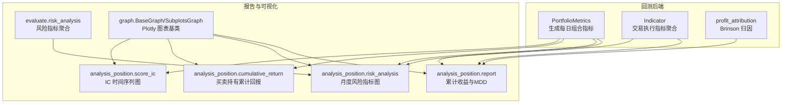
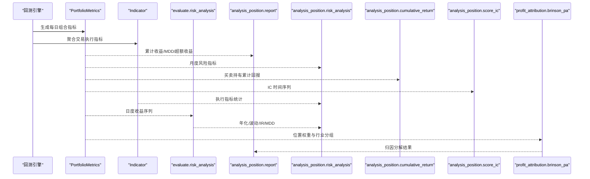
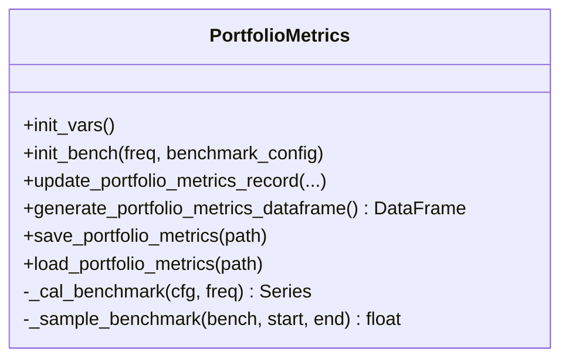
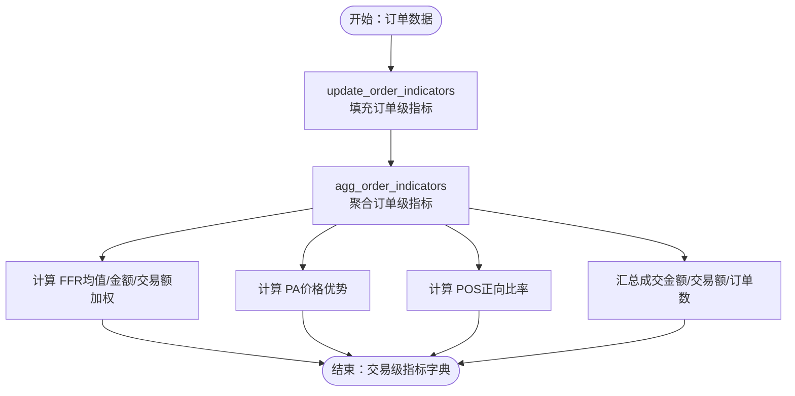
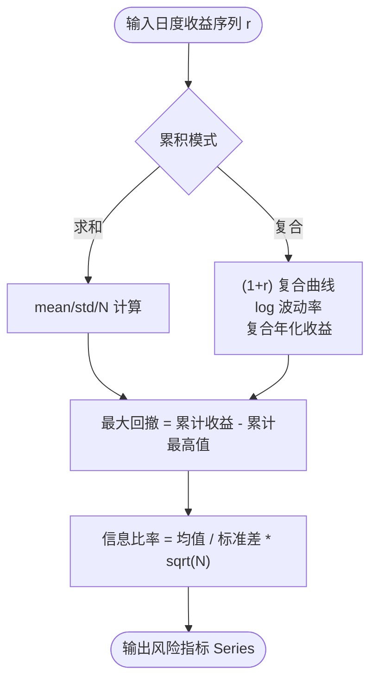
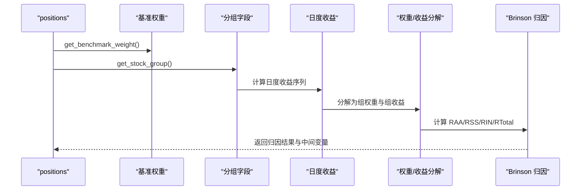
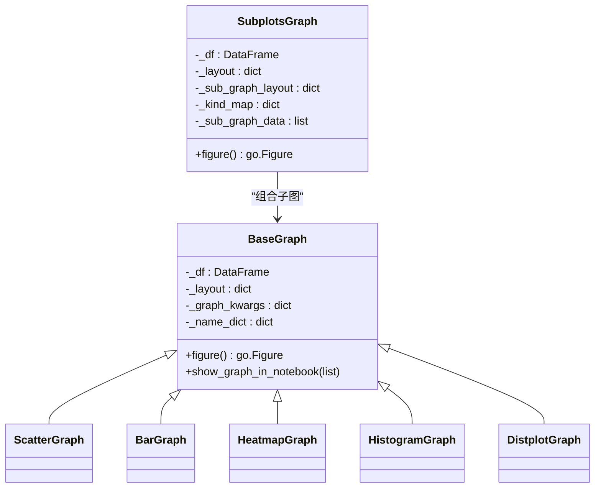
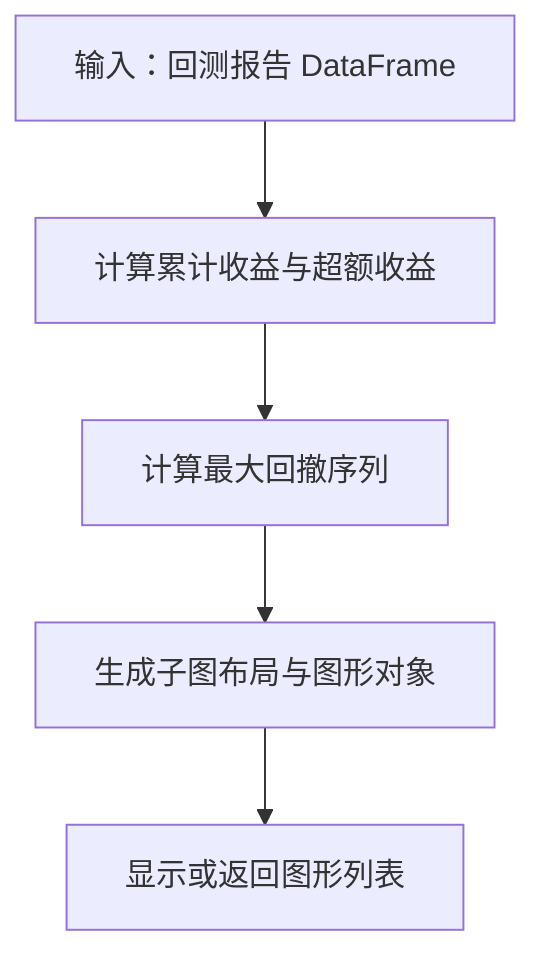
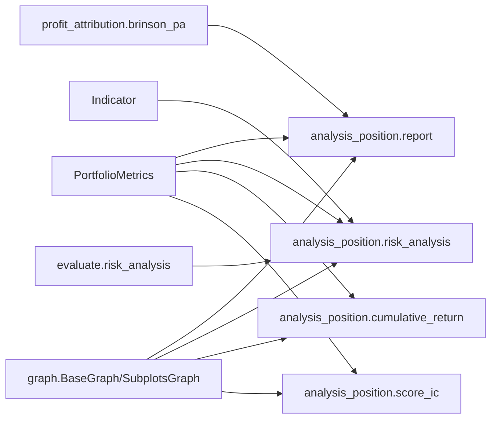

# 绩效分析

<cite>
**本文引用的文件**
- [report.py](file://qlib/backtest/report.py)
- [profit_attribution.py](file://qlib/backtest/profit_attribution.py)
- [evaluate.py](file://qlib/contrib/evaluate.py)
- [evaluate_portfolio.py](file://qlib/contrib/evaluate_portfolio.py)
- [graph.py](file://qlib/contrib/report/graph.py)
- [report.py（位置分析）](file://qlib/contrib/report/analysis_position/report.py)
- [risk_analysis.py（位置分析）](file://qlib/contrib/report/analysis_position/risk_analysis.py)
- [cumulative_return.py（位置分析）](file://qlib/contrib/report/analysis_position/cumulative_return.py)
- [score_ic.py（位置分析）](file://qlib/contrib/report/analysis_position/score_ic.py)
- [alpha.py（模型评估）](file://qlib/contrib/eva/alpha.py)
- [strategy.rst（组件文档）](file://docs/component/strategy.rst)
- [report.rst（组件文档）](file://docs/component/report.rst)
</cite>

## 目录
1. [简介](#简介)
2. [项目结构](#项目结构)
3. [核心组件](#核心组件)
4. [架构总览](#架构总览)
5. [详细组件分析](#详细组件分析)
6. [依赖关系分析](#依赖关系分析)
7. [性能与复杂度考量](#性能与复杂度考量)
8. [故障排查指南](#故障排查指南)
9. [结论](#结论)
10. [附录：API 调用示例与指标解释](#附录api-调用示例与指标解释)

## 简介
本文件系统性地文档化 Qlib 回测绩效分析模块，覆盖以下方面：
- 收益率曲线生成：日度累计收益、基准收益、超额收益及其最大回撤序列
- 风险指标计算：年化收益、波动率、信息比率、最大回撤
- 收益归因分析：基于 Brinson 的资产配置与选股归因（RAA、RSS、RIN、RTotal）
- IC 值评估：分层 IC 与秩 IC 的时间序列可视化
- 可视化组件：Plotly 图表基类、子图布局、单图渲染与 Notebook 展示
- API 使用示例：如何从回测结果中提取关键指标并解释其金融学含义

## 项目结构
该模块由两部分组成：
- 回测后端：负责生成每日组合指标与交易执行指标
- 报告与可视化：负责风险指标聚合、归因分析与图表输出

图表来源
- [report.py](file://qlib/backtest/report.py#L22-L247)
- [profit_attribution.py](file://qlib/backtest/profit_attribution.py#L226-L335)
- [evaluate.py](file://qlib/contrib/evaluate.py#L27-L94)
- [report.py（位置分析）](file://qlib/contrib/report/analysis_position/report.py#L1-L164)
- [risk_analysis.py（位置分析）](file://qlib/contrib/report/analysis_position/risk_analysis.py#L112-L160)
- [cumulative_return.py（位置分析）](file://qlib/contrib/report/analysis_position/cumulative_return.py#L89-L180)
- [score_ic.py（位置分析）](file://qlib/contrib/report/analysis_position/score_ic.py#L10-L72)
- [graph.py](file://qlib/contrib/report/graph.py#L17-L139)

章节来源
- [report.py](file://qlib/backtest/report.py#L22-L247)
- [profit_attribution.py](file://qlib/backtest/profit_attribution.py#L226-L335)
- [evaluate.py](file://qlib/contrib/evaluate.py#L27-L94)
- [report.py（位置分析）](file://qlib/contrib/report/analysis_position/report.py#L1-L164)
- [risk_analysis.py（位置分析）](file://qlib/contrib/report/analysis_position/risk_analysis.py#L112-L160)
- [cumulative_return.py（位置分析）](file://qlib/contrib/report/analysis_position/cumulative_return.py#L89-L180)
- [score_ic.py（位置分析）](file://qlib/contrib/report/analysis_position/score_ic.py#L10-L72)
- [graph.py](file://qlib/contrib/report/graph.py#L17-L139)

## 核心组件
- 投组指标生成器（PortfolioMetrics）
  - 计算每日账户价值、收益、成本、换手、基准收益等
  - 提供 benchmark 采样、数据帧生成与 CSV 导出/加载
- 交易执行指标聚合（Indicator）
  - 计算成交满足率（FFR）、价格优势（PA）、正向比率（POS）、成交金额、交易额、订单数
  - 支持按均值/按金额/按交易额加权统计
- 风险指标聚合（evaluate.risk_analysis）
  - 年化收益、波动率、信息比率、最大回撤
  - 支持“求和”与“复合”两种累积模式
- 收益归因（profit_attribution.brinson_pa）
  - 基于 Brinson 模型分解资产配置（RAA）、个股选择（RSS）、交互项（RIN）与总超额收益（RTotal）
- 可视化基类（graph.BaseGraph/SubplotsGraph）
  - Plotly 图表封装，支持散点、柱状、热力图、直方图与子图布局
- 位置分析报告（analysis_position.*）
  - 累计收益与 MDD、月度风险指标条形图、买卖持有累计回报、IC 时间序列

章节来源
- [report.py](file://qlib/backtest/report.py#L22-L247)
- [report.py](file://qlib/backtest/report.py#L249-L652)
- [evaluate.py](file://qlib/contrib/evaluate.py#L27-L94)
- [profit_attribution.py](file://qlib/backtest/profit_attribution.py#L226-L335)
- [graph.py](file://qlib/contrib/report/graph.py#L17-L139)
- [report.py（位置分析）](file://qlib/contrib/report/analysis_position/report.py#L1-L164)
- [risk_analysis.py（位置分析）](file://qlib/contrib/report/analysis_position/risk_analysis.py#L112-L160)
- [cumulative_return.py（位置分析）](file://qlib/contrib/report/analysis_position/cumulative_return.py#L89-L180)
- [score_ic.py（位置分析）](file://qlib/contrib/report/analysis_position/score_ic.py#L10-L72)

## 架构总览
下图展示了从回测到报告的关键流程与模块交互。

图表来源
- [report.py](file://qlib/backtest/report.py#L22-L247)
- [report.py](file://qlib/backtest/report.py#L249-L652)
- [evaluate.py](file://qlib/contrib/evaluate.py#L27-L94)
- [report.py（位置分析）](file://qlib/contrib/report/analysis_position/report.py#L1-L164)
- [risk_analysis.py（位置分析）](file://qlib/contrib/report/analysis_position/risk_analysis.py#L112-L160)
- [cumulative_return.py（位置分析）](file://qlib/contrib/report/analysis_position/cumulative_return.py#L89-L180)
- [score_ic.py（位置分析）](file://qlib/contrib/report/analysis_position/score_ic.py#L10-L72)
- [profit_attribution.py](file://qlib/backtest/profit_attribution.py#L226-L335)

## 详细组件分析

### 投组指标生成器（PortfolioMetrics）
- 主要职责
  - 维护每日账户价值、收益、成本、换手、基准收益等序列
  - 提供 benchmark 采样与基准收益计算
  - 生成 DataFrame、CSV 导出/加载
- 关键接口
  - 初始化与基准设置：[init_bench](file://qlib/backtest/report.py#L90-L121)
  - 更新每日指标：[update_portfolio_metrics_record](file://qlib/backtest/report.py#L153-L202)
  - 生成 DataFrame：[generate_portfolio_metrics_dataframe](file://qlib/backtest/report.py#L203-L215)
  - 导出/导入：[save_portfolio_metrics/load_portfolio_metrics](file://qlib/backtest/report.py#L217-L247)

图表来源
- [report.py](file://qlib/backtest/report.py#L22-L247)

章节来源
- [report.py](file://qlib/backtest/report.py#L22-L247)

### 交易执行指标聚合（Indicator）
- 主要职责
  - 计算每步交易的订单级指标（成交金额、成交均价、交易成本、方向等）
  - 聚合为交易级指标（FFR、PA、POS、成交金额、交易额、订单数）
  - 支持按均值/金额/交易额加权统计
- 关键接口
  - 订单级更新：[update_order_indicators](file://qlib/backtest/report.py#L339-L342)
  - 订单聚合与价格优势：[agg_order_indicators](file://qlib/backtest/report.py#L539-L553)
  - 交易级指标计算：[cal_trade_indicators](file://qlib/backtest/report.py#L608-L643)
  - FFR/PA/POS 统计（支持加权）：[FFR/PA/POS 计算](file://qlib/backtest/report.py#L554-L607)

图表来源
- [report.py](file://qlib/backtest/report.py#L339-L643)

章节来源
- [report.py](file://qlib/backtest/report.py#L249-L652)

### 风险指标聚合（evaluate.risk_analysis）
- 功能要点
  - 支持“求和”（线性收益）与“复合”（几何收益）两种累积模式
  - 计算均值、标准差、年化收益、信息比率、最大回撤
  - 自动根据频率推导年化系数 N
- 关键接口
  - [risk_analysis](file://qlib/contrib/evaluate.py#L27-L94)

图表来源
- [evaluate.py](file://qlib/contrib/evaluate.py#L27-L94)

章节来源
- [evaluate.py](file://qlib/contrib/evaluate.py#L27-L94)

### 收益归因分析（profit_attribution.brinson_pa）
- 功能要点
  - 获取基准权重与策略持仓权重
  - 将股票按行业或分位分组，计算组内权重与组内收益
  - 分解 RAA（资产配置）、RSS（个股选择）、RIN（交互项）、RTotal（总超额）
- 关键接口
  - [brinson_pa](file://qlib/backtest/profit_attribution.py#L226-L335)
  - [get_stock_group/get_daily_bin_group](file://qlib/backtest/profit_attribution.py#L179-L224)
  - [decompose_portofolio_weight/decompose_portofolio](file://qlib/backtest/profit_attribution.py#L72-L177)

图表来源
- [profit_attribution.py](file://qlib/backtest/profit_attribution.py#L226-L335)

章节来源
- [profit_attribution.py](file://qlib/backtest/profit_attribution.py#L226-L335)

### 可视化组件（graph.BaseGraph/SubplotsGraph）
- 功能要点
  - 封装 Plotly 图表基类，支持 Scatter/Bar/Heatmap/Histogram/Distplot
  - 子图布局与多列子图生成
  - Notebook 渲染与自定义布局
- 关键接口
  - [BaseGraph](file://qlib/contrib/report/graph.py#L17-L139)
  - [SubplotsGraph](file://qlib/contrib/report/graph.py#L202-L385)

图表来源
- [graph.py](file://qlib/contrib/report/graph.py#L17-L139)
- [graph.py](file://qlib/contrib/report/graph.py#L202-L385)

章节来源
- [graph.py](file://qlib/contrib/report/graph.py#L17-L139)
- [graph.py](file://qlib/contrib/report/graph.py#L202-L385)

### 位置分析报告（analysis_position.*）
- 累计收益与 MDD（analysis_position.report）
  - 计算基准累计收益、策略累计收益、含/不含成本的超额收益
  - 计算最大回撤序列并绘制子图
  - [report_graph/_report_figure](file://qlib/contrib/report/analysis_position/report.py#L66-L164)
- 月度风险指标（analysis_position.risk_analysis）
  - 对超额收益（含/不含成本）进行月度统计，输出条形图与月度序列图
  - [risk_analysis_graph/_get_monthly_risk_analysis_figure](file://qlib/contrib/report/analysis_position/risk_analysis.py#L129-L160)
- 买卖持有累计回报（analysis_position.cumulative_return）
  - 按买入/卖出/持有/净买卖分组，计算日度标签收益的加权平均与累计序列
  - [cumulative_return_graph/_get_figure_with_position](file://qlib/contrib/report/analysis_position/cumulative_return.py#L89-L180)
- IC 时间序列（analysis_position.score_ic）
  - 计算每日 IC 与秩 IC，并绘制时间序列图
  - [score_ic_graph/_get_score_ic](file://qlib/contrib/report/analysis_position/score_ic.py#L10-L72)

图表来源
- [report.py（位置分析）](file://qlib/contrib/report/analysis_position/report.py#L1-L164)
- [risk_analysis.py（位置分析）](file://qlib/contrib/report/analysis_position/risk_analysis.py#L112-L160)
- [cumulative_return.py（位置分析）](file://qlib/contrib/report/analysis_position/cumulative_return.py#L89-L180)
- [score_ic.py（位置分析）](file://qlib/contrib/report/analysis_position/score_ic.py#L10-L72)

章节来源
- [report.py（位置分析）](file://qlib/contrib/report/analysis_position/report.py#L1-L164)
- [risk_analysis.py（位置分析）](file://qlib/contrib/report/analysis_position/risk_analysis.py#L112-L160)
- [cumulative_return.py（位置分析）](file://qlib/contrib/report/analysis_position/cumulative_return.py#L89-L180)
- [score_ic.py（位置分析）](file://qlib/contrib/report/analysis_position/score_ic.py#L10-L72)

## 依赖关系分析
- 模块耦合
  - 回测后端（report.py、profit_attribution.py）与报告模块（analysis_position.*）通过 DataFrame 接口耦合
  - 风险指标聚合（evaluate.risk_analysis）独立于回测后端，仅依赖日度收益序列
  - 可视化基类（graph.py）被所有报告模块复用
- 外部依赖
  - Plotly 用于图表渲染
  - Pandas/Numpy 用于数值与时间序列处理
  - Qlib 数据访问（D）用于特征与基准权重读取（归因）

图表来源
- [report.py](file://qlib/backtest/report.py#L22-L247)
- [profit_attribution.py](file://qlib/backtest/profit_attribution.py#L226-L335)
- [evaluate.py](file://qlib/contrib/evaluate.py#L27-L94)
- [report.py（位置分析）](file://qlib/contrib/report/analysis_position/report.py#L1-L164)
- [risk_analysis.py（位置分析）](file://qlib/contrib/report/analysis_position/risk_analysis.py#L112-L160)
- [cumulative_return.py（位置分析）](file://qlib/contrib/report/analysis_position/cumulative_return.py#L89-L180)
- [score_ic.py（位置分析）](file://qlib/contrib/report/analysis_position/score_ic.py#L10-L72)
- [graph.py](file://qlib/contrib/report/graph.py#L17-L139)

章节来源
- [report.py](file://qlib/backtest/report.py#L22-L247)
- [profit_attribution.py](file://qlib/backtest/profit_attribution.py#L226-L335)
- [evaluate.py](file://qlib/contrib/evaluate.py#L27-L94)
- [report.py（位置分析）](file://qlib/contrib/report/analysis_position/report.py#L1-L164)
- [risk_analysis.py（位置分析）](file://qlib/contrib/report/analysis_position/risk_analysis.py#L112-L160)
- [cumulative_return.py（位置分析）](file://qlib/contrib/report/analysis_position/cumulative_return.py#L89-L180)
- [score_ic.py（位置分析）](file://qlib/contrib/report/analysis_position/score_ic.py#L10-L72)
- [graph.py](file://qlib/contrib/report/graph.py#L17-L139)

## 性能与复杂度考量
- PortfolioMetrics
  - 每日指标更新为 O(1) 操作；DataFrame 合并为 O(n)（n 为交易日）
- Indicator
  - 订单级指标聚合涉及多层索引对齐与重采样，复杂度约 O(n·k)（k 为平均股票数）
  - 加权统计在 O(n·k) 内完成
- evaluate.risk_analysis
  - 线性扫描计算均值/标准差/最大回撤，O(n)
- profit_attribution.brinson_pa
  - 分组与加权求和 O(n·k)，分位分组需排序，整体 O(n·k + n·log n)
- 可视化
  - Plotly 图形生成与子图布局为 O(n) 或 O(n·m)（m 为子图数）

[本节为通用性能讨论，不直接分析具体文件]

## 故障排查指南
- 基准缺失或为空
  - 现象：初始化基准时报错或返回空
  - 排查：确认基准代码存在且时间范围有效；检查频率参数
  - 参考路径：[PortfolioMetrics._cal_benchmark](file://qlib/backtest/report.py#L96-L121)
- 回测报告列缺失
  - 现象：绘图或风险分析报错
  - 排查：确保包含 return、cost、bench、turnover 列
  - 参考路径：[analysis_position.report_graph](file://qlib/contrib/report/analysis_position/report.py#L166-L249)
- 归因分组异常
  - 现象：分位分组断层或 NaN
  - 排查：检查 group_n 设置与分位边界；确认基准权重与收益序列时间对齐
  - 参考路径：[get_daily_bin_group/get_stock_group](file://qlib/backtest/profit_attribution.py#L179-L224)
- 图表渲染问题
  - 现象：Notebook 中无法显示或空白
  - 排查：切换渲染器或手动调用 show_graph_in_notebook
  - 参考路径：[BaseGraph.show_graph_in_notebook](file://qlib/contrib/report/graph.py#L86-L107)

章节来源
- [report.py](file://qlib/backtest/report.py#L96-L121)
- [report.py（位置分析）](file://qlib/contrib/report/analysis_position/report.py#L166-L249)
- [profit_attribution.py](file://qlib/backtest/profit_attribution.py#L179-L224)
- [graph.py](file://qlib/contrib/report/graph.py#L86-L107)

## 结论
本模块以 PortfolioMetrics 为核心，串联交易执行指标、风险指标聚合、收益归因与可视化输出，形成完整的回测绩效分析闭环。通过统一的 DataFrame 接口与 Plotly 图表基类，用户可快速生成收益率曲线、风险指标图、归因分解图与 IC 时间序列图，并据此解释策略的收益来源与风险特征。

[本节为总结性内容，不直接分析具体文件]

## 附录：API 调用示例与指标解释

### API 调用示例（从回测结果提取关键指标）
- 生成回测报告与位置数据
  - 参考路径：[evaluate.backtest_daily](file://qlib/contrib/evaluate.py#L148-L274)
- 计算风险指标
  - 参考路径：[evaluate.risk_analysis](file://qlib/contrib/evaluate.py#L27-L94)
- 生成位置分析报告与图表
  - 参考路径：[analysis_position.report_graph](file://qlib/contrib/report/analysis_position/report.py#L166-L249)
  - [analysis_position.risk_analysis_graph](file://qlib/contrib/report/analysis_position/risk_analysis.py#L162-L298)
  - [analysis_position.cumulative_return_graph](file://qlib/contrib/report/analysis_position/cumulative_return.py#L182-L274)
  - [analysis_position.score_ic_graph](file://qlib/contrib/report/analysis_position/score_ic.py#L25-L72)
- 收益归因
  - 参考路径：[profit_attribution.brinson_pa](file://qlib/backtest/profit_attribution.py#L226-L335)

章节来源
- [evaluate.py](file://qlib/contrib/evaluate.py#L148-L274)
- [evaluate.py](file://qlib/contrib/evaluate.py#L27-L94)
- [report.py（位置分析）](file://qlib/contrib/report/analysis_position/report.py#L166-L249)
- [risk_analysis.py（位置分析）](file://qlib/contrib/report/analysis_position/risk_analysis.py#L162-L298)
- [cumulative_return.py（位置分析）](file://qlib/contrib/report/analysis_position/cumulative_return.py#L182-L274)
- [score_ic.py（位置分析）](file://qlib/contrib/report/analysis_position/score_ic.py#L25-L72)
- [profit_attribution.py](file://qlib/backtest/profit_attribution.py#L226-L335)

### 关键指标的金融学意义
- 年化收益
  - 定义：将日度平均收益按年化尺度转换，反映策略长期盈利能力
  - 计算参考：[evaluate.risk_analysis](file://qlib/contrib/evaluate.py#L27-L94)
- 波动率（标准差）
  - 定义：衡量日度收益的离散程度，反映策略收益的稳定性
  - 计算参考：[evaluate.risk_analysis](file://qlib/contrib/evaluate.py#L27-L94)
- 信息比率（IR）
  - 定义：超额收益的单位风险贡献，衡量风险调整后的收益能力
  - 计算参考：[evaluate.risk_analysis](file://qlib/contrib/evaluate.py#L27-L94)
- 最大回撤（MDD）
  - 定义：从峰值到随后最低值的相对跌幅，衡量策略的最大潜在损失
  - 计算参考：[evaluate.risk_analysis](file://qlib/contrib/evaluate.py#L27-L94)
- Brinson 归因
  - RAA（资产配置）：因偏离基准权重而产生的超额收益
  - RSS（个股选择）：在各组内选择个股产生的超额收益
  - RIN（交互项）：权重与收益共同变化带来的影响
  - RTotal（总超额）：RAA + RSS + RIN
  - 计算参考：[profit_attribution.brinson_pa](file://qlib/backtest/profit_attribution.py#L226-L335)
- IC 与秩 IC
  - 定义：预测分数与下期收益的线性/秩相关性，衡量预测质量
  - 计算参考：[alpha.calc_ic](file://qlib/contrib/eva/alpha.py#L160-L194)

章节来源
- [evaluate.py](file://qlib/contrib/evaluate.py#L27-L94)
- [profit_attribution.py](file://qlib/backtest/profit_attribution.py#L226-L335)
- [alpha.py（模型评估）](file://qlib/contrib/eva/alpha.py#L160-L194)