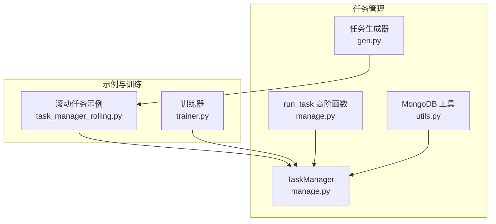
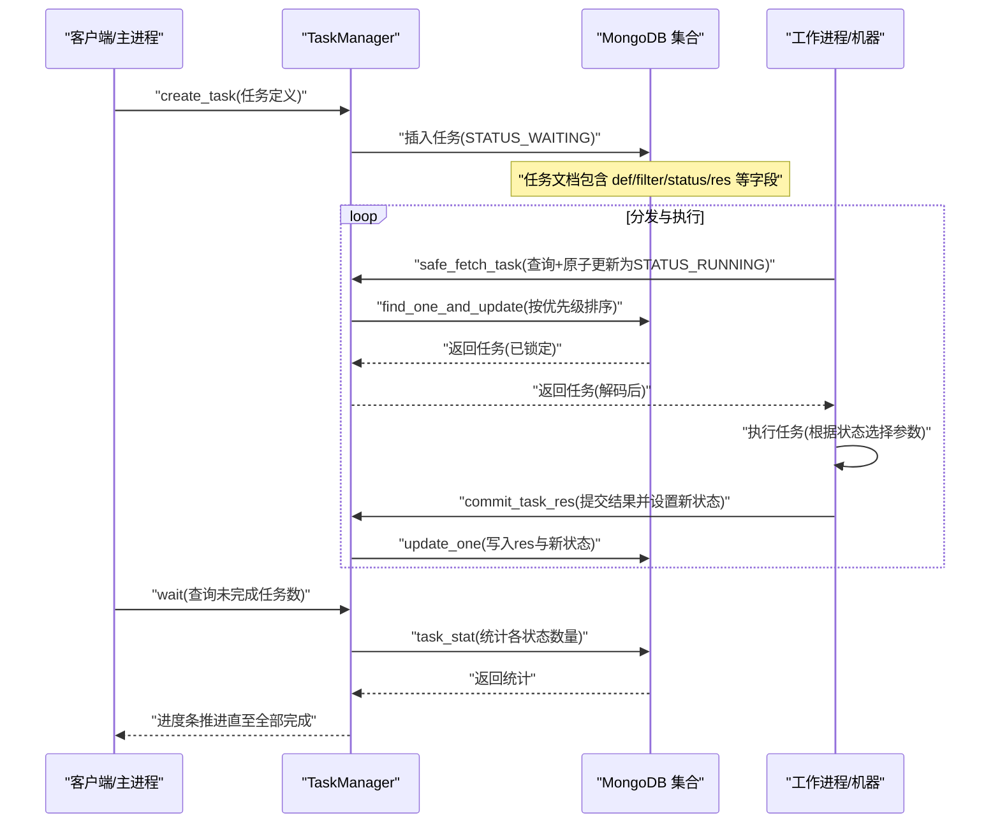
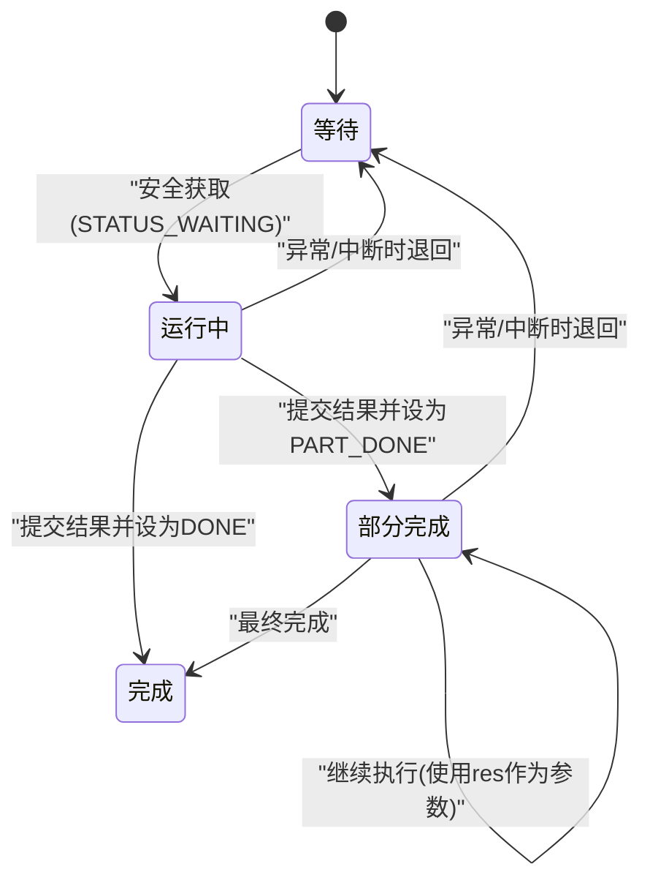
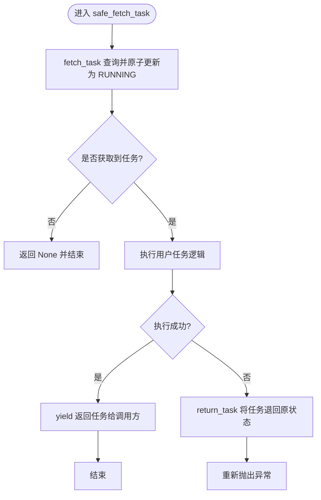
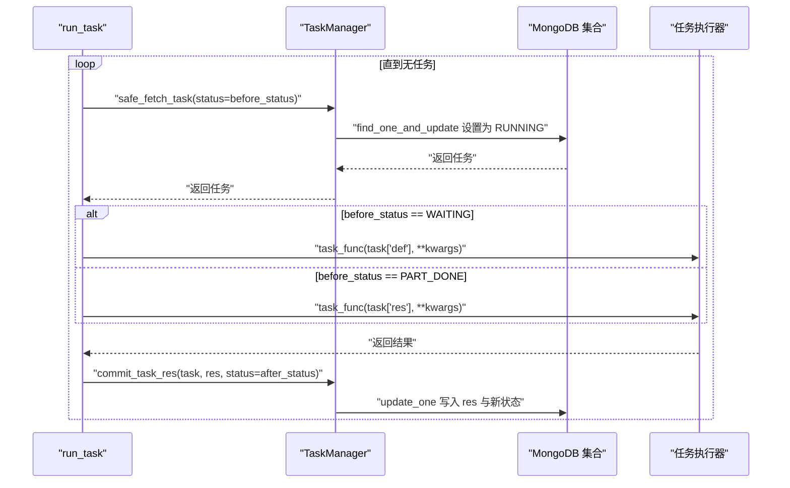
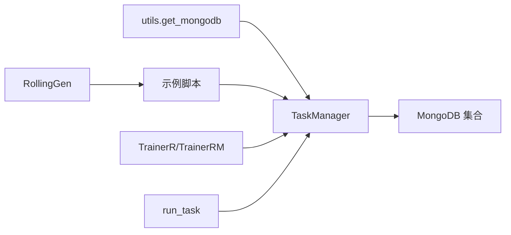

# 任务执行

<cite>
**本文引用的文件列表**
- [manage.py](file://qlib/workflow/task/manage.py)
- [utils.py](file://qlib/workflow/task/utils.py)
- [gen.py](file://qlib/workflow/task/gen.py)
- [task_manager_rolling.py](file://examples/model_rolling/task_manager_rolling.py)
- [trainer.py](file://qlib/model/trainer.py)
</cite>

## 目录
1. [简介](#简介)
2. [项目结构](#项目结构)
3. [核心组件](#核心组件)
4. [架构总览](#架构总览)
5. [详细组件分析](#详细组件分析)
6. [依赖关系分析](#依赖关系分析)
7. [性能考量](#性能考量)
8. [故障排查指南](#故障排查指南)
9. [结论](#结论)
10. [附录](#附录)

## 简介
本文件面向任务执行与调度系统，聚焦于TaskManager类如何基于MongoDB实现分布式任务队列。文档将详细说明：
- 任务的四种状态（STATUS_WAITING、STATUS_RUNNING、STATUS_PART_DONE、STATUS_DONE）及其转换机制
- fetch_task与safe_fetch_task如何保证任务被唯一消费
- commit_task_res如何持久化结果
- wait如何实现主进程同步等待
- create_task的幂等性插入
- task_stat的状态统计
- reset_waiting的异常恢复功能
- run_task高阶函数如何封装任务执行循环与资源管理

## 项目结构
围绕任务管理的核心模块位于workflow/task目录，配合示例与训练器模块协同工作：
- workflow/task/manage.py：TaskManager类与run_task高阶函数
- workflow/task/utils.py：MongoDB连接工具get_mongodb
- workflow/task/gen.py：任务生成器RollingGen等
- examples/model_rolling/task_manager_rolling.py：基于TaskManager的滚动任务示例
- qlib/model/trainer.py：TrainerR/TrainerRM对TaskManager的集成调用

图表来源
- [manage.py](file://qlib/workflow/task/manage.py#L1-L120)
- [utils.py](file://qlib/workflow/task/utils.py#L22-L58)
- [gen.py](file://qlib/workflow/task/gen.py#L141-L303)
- [task_manager_rolling.py](file://examples/model_rolling/task_manager_rolling.py#L1-L117)
- [trainer.py](file://qlib/model/trainer.py#L384-L448)

章节来源
- [manage.py](file://qlib/workflow/task/manage.py#L1-L120)
- [utils.py](file://qlib/workflow/task/utils.py#L22-L58)
- [gen.py](file://qlib/workflow/task/gen.py#L141-L303)
- [task_manager_rolling.py](file://examples/model_rolling/task_manager_rolling.py#L1-L117)
- [trainer.py](file://qlib/model/trainer.py#L384-L448)

## 核心组件
- TaskManager：负责任务的创建、查询、消费、提交结果、状态统计与等待
- run_task：封装任务循环、参数选择与结果提交
- get_mongodb：提供MongoDB数据库实例
- RollingGen：生成滚动任务模板集合

章节来源
- [manage.py](file://qlib/workflow/task/manage.py#L76-L120)
- [manage.py](file://qlib/workflow/task/manage.py#L483-L550)
- [utils.py](file://qlib/workflow/task/utils.py#L22-L58)
- [gen.py](file://qlib/workflow/task/gen.py#L141-L303)

## 架构总览
下图展示了TaskManager在分布式任务队列中的角色与交互流程。

图表来源
- [manage.py](file://qlib/workflow/task/manage.py#L263-L381)
- [manage.py](file://qlib/workflow/task/manage.py#L352-L381)
- [manage.py](file://qlib/workflow/task/manage.py#L456-L478)

## 详细组件分析

### TaskManager 类与状态机
- 四种状态
  - STATUS_WAITING：等待执行
  - STATUS_RUNNING：正在执行
  - STATUS_PART_DONE：部分完成（可继续后续步骤）
  - STATUS_DONE：全部完成
- 状态转换
  - WAITING -> RUNNING：通过安全获取（见下文）
  - RUNNING -> DONE 或 PART_DONE：通过commit_task_res提交结果并设置新状态
  - PART_DONE -> PART_DONE 或 DONE：通过run_task在第二次及以后迭代中使用中间结果作为参数
  - 异常或强制释放：通过return_task将任务退回至原状态（默认WAITING）

图表来源
- [manage.py](file://qlib/workflow/task/manage.py#L76-L81)
- [manage.py](file://qlib/workflow/task/manage.py#L263-L381)
- [manage.py](file://qlib/workflow/task/manage.py#L352-L381)

章节来源
- [manage.py](file://qlib/workflow/task/manage.py#L76-L81)
- [manage.py](file://qlib/workflow/task/manage.py#L263-L381)
- [manage.py](file://qlib/workflow/task/manage.py#L352-L381)

### fetch_task 与 safe_fetch_task：唯一消费保障
- fetch_task
  - 使用查询条件与状态过滤，结合find_one_and_update原子更新任务状态为STATUS_RUNNING
  - 排序依据priority字段降序，确保高优先级任务优先被取走
  - 返回解码后的任务文档
- safe_fetch_task
  - 基于上下文管理器包装fetch_task
  - 若在执行过程中抛出异常或键盘中断，则自动将任务退回原状态（默认WAITING），避免任务丢失
  - 正常退出时不改变任务状态，由上层逻辑决定是否提交结果

图表来源
- [manage.py](file://qlib/workflow/task/manage.py#L263-L316)
- [manage.py](file://qlib/workflow/task/manage.py#L286-L309)

章节来源
- [manage.py](file://qlib/workflow/task/manage.py#L263-L316)
- [manage.py](file://qlib/workflow/task/manage.py#L286-L309)

### commit_task_res：持久化结果
- 将任务结果res以pickle序列化后存入任务文档的res字段
- 同步更新任务状态为指定值（默认STATUS_DONE）
- 使用MongoDB的update_one进行原子更新，保证结果与状态的一致性

章节来源
- [manage.py](file://qlib/workflow/task/manage.py#L352-L368)

### wait：主进程同步等待
- 通过task_stat统计各状态任务数量，计算未完成任务数
- 使用进度条显示完成进度，每10秒轮询一次
- 当未完成任务数归零时结束等待

章节来源
- [manage.py](file://qlib/workflow/task/manage.py#L456-L478)

### create_task：幂等性插入
- 对每个任务定义，先查询是否存在相同filter的任务
- 若不存在则插入新任务（STATUS_WAITING），记录其_id
- 若存在则直接返回已有任务的_id
- 支持dry_run模式仅统计新任务而不实际插入

章节来源
- [manage.py](file://qlib/workflow/task/manage.py#L215-L262)

### task_stat：状态统计
- 对满足查询条件的任务进行遍历统计
- 统计各状态的数量并返回字典

章节来源
- [manage.py](file://qlib/workflow/task/manage.py#L396-L413)

### reset_waiting：异常恢复
- 将处于STATUS_RUNNING的任务重置为STATUS_WAITING
- 可用于处理运行中的任务意外退出的情况，便于重新调度

章节来源
- [manage.py](file://qlib/workflow/task/manage.py#L414-L426)

### run_task：高阶函数封装
- 循环从任务池中获取任务，直到无可用任务
- 参数选择策略
  - 若before_status为STATUS_WAITING：使用task["def"]作为参数
  - 若before_status为STATUS_PART_DONE：使用task["res"]作为参数
- 执行完成后调用commit_task_res提交结果，并设置after_status
- 支持force_release使用进程池执行（单进程场景下默认串行）

图表来源
- [manage.py](file://qlib/workflow/task/manage.py#L483-L550)

章节来源
- [manage.py](file://qlib/workflow/task/manage.py#L483-L550)

### 与训练器的集成
- TrainerR/TrainerRM在train阶段调用TaskManager.create_task创建任务
- 通过run_task执行任务（可跨进程/多机）
- 最终通过wait等待所有任务完成，再回填Recorder并设置状态标签

章节来源
- [trainer.py](file://qlib/model/trainer.py#L384-L448)
- [trainer.py](file://qlib/model/trainer.py#L466-L486)
- [trainer.py](file://qlib/model/trainer.py#L524-L594)

## 依赖关系分析
- TaskManager依赖MongoDB集合（通过get_mongodb获取）
- 任务定义与结果采用pickle序列化存储，确保复杂对象的持久化
- 任务优先级通过priority字段控制，影响取任务顺序
- 示例与训练器模块通过TaskManager统一接入任务队列

图表来源
- [utils.py](file://qlib/workflow/task/utils.py#L22-L58)
- [manage.py](file://qlib/workflow/task/manage.py#L95-L120)
- [gen.py](file://qlib/workflow/task/gen.py#L141-L303)
- [task_manager_rolling.py](file://examples/model_rolling/task_manager_rolling.py#L1-L117)
- [trainer.py](file://qlib/model/trainer.py#L384-L448)

章节来源
- [utils.py](file://qlib/workflow/task/utils.py#L22-L58)
- [manage.py](file://qlib/workflow/task/manage.py#L95-L120)
- [gen.py](file://qlib/workflow/task/gen.py#L141-L303)
- [task_manager_rolling.py](file://examples/model_rolling/task_manager_rolling.py#L1-L117)
- [trainer.py](file://qlib/model/trainer.py#L384-L448)

## 性能考量
- 原子更新与唯一消费
  - 使用find_one_and_update与状态字段原子更新，避免并发竞争导致重复消费
- 优先级调度
  - 通过priority降序排序，优先处理高优先级任务
- 序列化开销
  - 任务定义与结果均采用pickle序列化，注意大对象带来的序列化/反序列化成本
- 等待轮询
  - wait采用固定间隔轮询，建议在大规模任务时适当增大轮询间隔以降低数据库压力

[本节为通用指导，不涉及具体文件分析]

## 故障排查指南
- 任务无法被消费
  - 检查任务状态是否仍为STATUS_RUNNING且长时间未变更，必要时使用reset_waiting将其退回
- 任务异常中断
  - 使用safe_fetch_task的上下文管理器可自动退回任务；若手动调用，需显式调用return_task
- 结果未持久化
  - 确认commit_task_res调用是否成功，检查res字段是否正确写入
- 等待无法结束
  - 检查wait的查询条件是否匹配目标任务，确认task_stat统计是否正确

章节来源
- [manage.py](file://qlib/workflow/task/manage.py#L414-L426)
- [manage.py](file://qlib/workflow/task/manage.py#L352-L381)
- [manage.py](file://qlib/workflow/task/manage.py#L456-L478)

## 结论
TaskManager通过MongoDB实现了可靠的分布式任务队列，结合原子更新与上下文管理器确保任务唯一消费与异常恢复；run_task高阶函数封装了任务执行循环与参数选择，支持幂等插入与状态流转。配合TrainerR/TrainerRM，可实现从任务创建、分发、执行到结果回填的完整流水线。

[本节为总结性内容，不涉及具体文件分析]

## 附录
- MongoDB配置
  - 在初始化时提供task_url与task_db_name，确保TaskManager能够连接数据库
- 任务字段约定
  - def：任务定义（pickle序列化）
  - filter：用于幂等查询的键（与def一致）
  - status：任务状态
  - res：任务结果（pickle序列化）
  - priority：任务优先级（整数）

章节来源
- [utils.py](file://qlib/workflow/task/utils.py#L22-L58)
- [manage.py](file://qlib/workflow/task/manage.py#L33-L75)