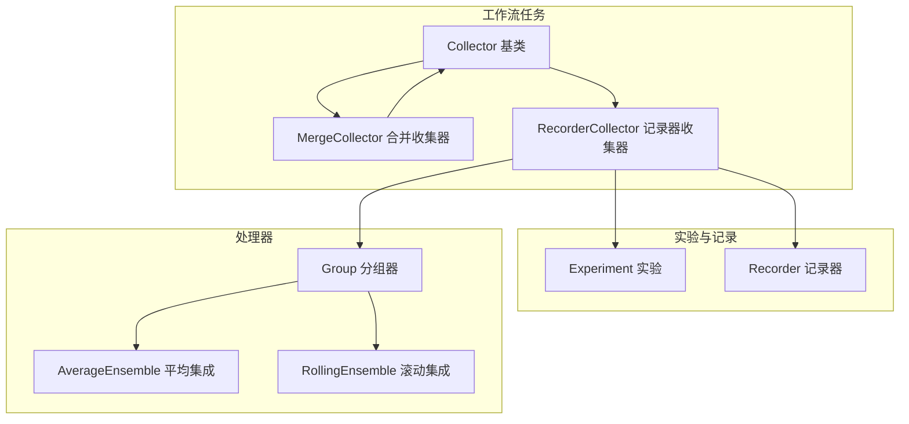
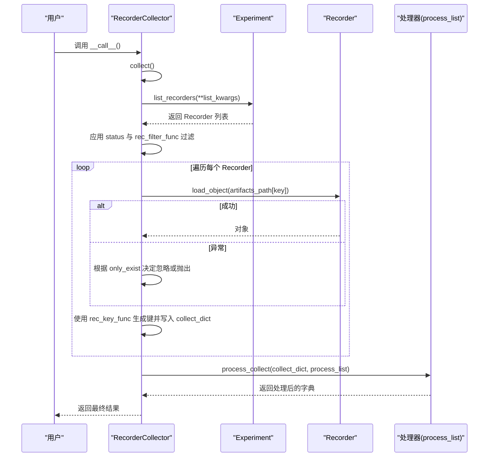
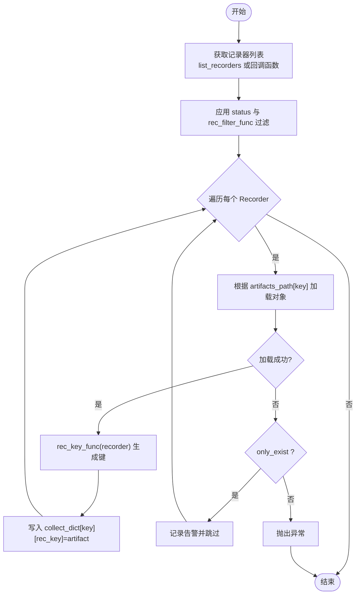
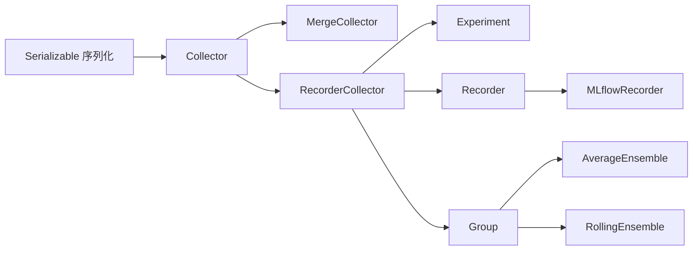

# 任务收集

<cite>
**本文引用的文件列表**
- [collect.py](file://qlib/workflow/task/collect.py)
- [recorder.py](file://qlib/workflow/recorder.py)
- [exp.py](file://qlib/workflow/exp.py)
- [task_manager_rolling.py](file://examples/model_rolling/task_manager_rolling.py)
- [record_temp.py](file://qlib/contrib/workflow/record_temp.py)
- [group.py](file://qlib/model/ens/group.py)
- [ensemble.py](file://qlib/model/ens/ensemble.py)
</cite>

## 目录
1. [简介](#简介)
2. [项目结构](#项目结构)
3. [核心组件](#核心组件)
4. [架构总览](#架构总览)
5. [组件详解](#组件详解)
6. [依赖关系分析](#依赖关系分析)
7. [性能考量](#性能考量)
8. [故障排查指南](#故障排查指南)
9. [结论](#结论)
10. [附录：典型用例](#附录典型用例)

## 简介
本文件面向任务收集系统，聚焦于 Collector 基类及其两个关键子类：
- MergeCollector：用于合并多个 Collector 的采集结果，支持自定义外层键重组策略。
- RecorderCollector：从实验记录（Recorder）中按条件筛选并提取持久化对象（如 pred.pkl、IC 等），并通过 process_list 链式调用处理器完成分组、集成等后处理。

文档将详细说明：
- 如何通过 collect 方法从 Recorder 中提取预测结果、IC 值等指标；
- 如何利用 process_list 参数链式调用处理器进行数据聚合与后处理；
- RecorderCollector 如何通过 rec_key_func 和 rec_filter_func 实现记录器过滤与键值映射；
- artifacts_path 参数如何定位特定的持久化对象（如 pred.pkl）；
- 跨实验结果合并与性能指标分析的典型用例。

## 项目结构
围绕任务收集的核心代码位于 workflow/task 目录，配合 workflow/recorder 与 workflow/exp 提供的 Recorder/Experiment 能力，以及 model/ens 下的 Group/Ensemble 处理器。

图表来源
- [collect.py](file://qlib/workflow/task/collect.py#L19-L259)
- [recorder.py](file://qlib/workflow/recorder.py#L28-L120)
- [exp.py](file://qlib/workflow/exp.py#L15-L120)
- [group.py](file://qlib/model/ens/group.py#L20-L115)
- [ensemble.py](file://qlib/model/ens/ensemble.py#L76-L132)

章节来源
- [collect.py](file://qlib/workflow/task/collect.py#L19-L259)
- [recorder.py](file://qlib/workflow/recorder.py#L28-L120)
- [exp.py](file://qlib/workflow/exp.py#L15-L120)

## 核心组件
- Collector 基类
  - 定义 collect 抽象接口与 process_collect 的链式处理器执行逻辑；
  - __call__ 将 collect 与 process_collect 组合为统一流程。
- MergeCollector
  - 聚合多个 Collector 的输出，支持 merge_func 自定义外层键组合。
- RecorderCollector
  - 从 Experiment 列表中筛选 Recorder，按 artifacts_key 与 artifacts_path 加载持久化对象；
  - 通过 rec_key_func 生成每条记录的键，rec_filter_func 过滤记录；
  - 支持 status 过滤与 only_exist 行为控制加载异常时的处理策略。

章节来源
- [collect.py](file://qlib/workflow/task/collect.py#L19-L88)
- [collect.py](file://qlib/workflow/task/collect.py#L89-L134)
- [collect.py](file://qlib/workflow/task/collect.py#L136-L259)

## 架构总览
下图展示了 RecorderCollector 在采集过程中的关键步骤与依赖关系。

图表来源
- [collect.py](file://qlib/workflow/task/collect.py#L183-L248)
- [exp.py](file://qlib/workflow/exp.py#L221-L240)
- [recorder.py](file://qlib/workflow/recorder.py#L90-L104)

## 组件详解

### Collector 基类
- 职责
  - 定义 collect 抽象方法，由子类实现具体采集逻辑；
  - 提供 process_collect，按顺序对每个“产物”应用处理器；
  - __call__ 将采集与处理串联，返回统一结果。
- 关键点
  - process_list 可为单个可调用对象或列表，内部会标准化为列表；
  - 仅支持可调用对象作为处理器，否则抛出不支持错误。

章节来源
- [collect.py](file://qlib/workflow/task/collect.py#L19-L88)

### MergeCollector
- 职责
  - 聚合多个 Collector 的输出，形成新的键空间；
  - 若未提供 merge_func，则默认以 (collector_key, inner_key) 作为新键。
- 典型用法
  - 将不同来源（模型、数据集、滚动窗口等）的采集结果合并到一个字典中，便于后续统一处理。

章节来源
- [collect.py](file://qlib/workflow/task/collect.py#L89-L134)

### RecorderCollector
- 职责
  - 从 Experiment 或回调函数返回的记录器集合中筛选并采集；
  - 依据 artifacts_key 与 artifacts_path 加载持久化对象；
  - 通过 rec_key_func 为每个 Recorder 生成唯一键，rec_filter_func 进行过滤；
  - 支持 status 过滤与 only_exist 行为控制加载异常时的处理。
- 关键参数
  - experiment：Experiment 实例或实验名；也可传入回调函数返回记录器列表；
  - rec_key_func：从 Recorder 生成键，默认使用 Recorder.info["id"]；
  - rec_filter_func：过滤 Recorder 的谓词函数；
  - artifacts_path：产物名称到 Recorder 内部路径的映射，默认包含 pred 与 IC；
  - artifacts_key：要采集的产物键列表，默认取 artifacts_path 的键；
  - list_kwargs：传递给 list_recorders 的关键字参数；
  - status：仅采集指定状态的 Recorder，默认仅采集 FINISHED。
- 采集流程要点
  - 先 list_recorders，再应用 status 与 rec_filter_func；
  - 遍历 Recorder，逐个加载 artifacts_path[key]；
  - 若 only_exist=True 且加载失败则忽略并告警；否则抛出异常；
  - 若出现重复键，会警告覆盖风险。

图表来源
- [collect.py](file://qlib/workflow/task/collect.py#L183-L248)
- [exp.py](file://qlib/workflow/exp.py#L221-L240)
- [recorder.py](file://qlib/workflow/recorder.py#L90-L104)

章节来源
- [collect.py](file://qlib/workflow/task/collect.py#L136-L259)
- [exp.py](file://qlib/workflow/exp.py#L221-L240)
- [recorder.py](file://qlib/workflow/recorder.py#L90-L104)

### 处理器（process_list）
- Group
  - 将键空间按 group_func 进行分组，形成嵌套字典；
  - 可选地在分组后对每个组应用 Ensemble。
- Ensemble
  - AverageEnsemble：对同时间步的数据做标准化后平均；
  - RollingEnsemble：对滚动序列按时间排序拼接并去重。
- 在 RecorderCollector 中的常见用法
  - 通过 process_list=[RollingGroup()] 将滚动任务的结果按 (模型, 滚动窗口) 分组并集成；
  - 通过 process_list=[Group(..., ens=AverageEnsemble())] 对同一时间步的多模型结果进行标准化平均。

章节来源
- [group.py](file://qlib/model/ens/group.py#L20-L115)
- [ensemble.py](file://qlib/model/ens/ensemble.py#L76-L132)

## 依赖关系分析
- Collector 依赖 Serializable（pickle_backend=dill）以支持用户方法的序列化；
- RecorderCollector 依赖 Experiment.list_recorders 与 Recorder.load_object；
- 处理器依赖 pandas 数据结构与 joblib 并行工具（Group）。

图表来源
- [collect.py](file://qlib/workflow/task/collect.py#L19-L259)
- [recorder.py](file://qlib/workflow/recorder.py#L247-L494)
- [exp.py](file://qlib/workflow/exp.py#L15-L120)
- [group.py](file://qlib/model/ens/group.py#L20-L115)
- [ensemble.py](file://qlib/model/ens/ensemble.py#L76-L132)

章节来源
- [collect.py](file://qlib/workflow/task/collect.py#L19-L259)
- [recorder.py](file://qlib/workflow/recorder.py#L247-L494)
- [exp.py](file://qlib/workflow/exp.py#L15-L120)

## 性能考量
- RecorderCollector 在采集前会调用 list_recorders，若实验记录较多，建议合理设置 status 与 rec_filter_func，减少不必要的加载；
- process_list 中的处理器（尤其是 Group/RollingGroup）可能涉及大量数据的拼接与去重，注意内存占用；
- artifacts_path 默认包含 IC 相关产物时，加载 IC 文件可能带来额外开销，可根据需要精简 artifacts_key；
- 通过 TimeInspector 记录 list_recorders 的耗时，有助于定位性能瓶颈。

章节来源
- [collect.py](file://qlib/workflow/task/collect.py#L183-L248)
- [recorder.py](file://qlib/workflow/recorder.py#L90-L104)

## 故障排查指南
- 加载对象失败
  - 现象：提示无法加载 artifacts_path[key]；
  - 处理：检查 artifacts_path 映射是否正确；若 only_exist=True 则会忽略并告警；若 False 则抛出异常；
  - 建议：确认 Recorder 中确实存在该对象，或调整 artifacts_key。
- 重复键覆盖
  - 现象：日志警告键重复并被覆盖；
  - 处理：检查 rec_key_func 是否唯一；必要时加入更多维度（如模型、滚动窗口）。
- 过滤条件过于严格
  - 现象：采集结果为空；
  - 处理：检查 status 与 rec_filter_func；适当放宽过滤条件或增加日志统计。
- 处理器不可调用
  - 现象：process_collect 抛出不支持错误；
  - 处理：确保 process_list 中元素均为可调用对象。

章节来源
- [collect.py](file://qlib/workflow/task/collect.py#L183-L248)
- [collect.py](file://qlib/workflow/task/collect.py#L52-L76)

## 结论
- RecorderCollector 是从实验记录中提取与聚合结果的关键组件，通过 artifacts_path 与 artifacts_key 精准定位持久化对象；
- 通过 rec_key_func 与 rec_filter_func 实现灵活的记录器过滤与键值映射；
- process_list 提供强大的后处理能力，结合 Group/Ensemble 可实现跨实验、跨模型的合并与性能指标分析；
- MergeCollector 适合将多个来源的采集结果整合为统一字典，便于下游统一处理。

## 附录：典型用例

### 用例一：从实验中采集预测与标签并滚动集成
- 目标：从滚动实验中采集 pred.pkl 与 label.pkl，按滚动窗口分组并集成得到统一预测；
- 关键点：
  - artifacts_key 设为 ["pred", "label"]；
  - artifacts_path 指向 pred.pkl 与 label.pkl；
  - process_list 使用 RollingEnsemble；
  - 可结合 rec_key_func 将 (模型, 滚动窗口) 作为键，便于后续分组与对比。

章节来源
- [task_manager_rolling.py](file://examples/model_rolling/task_manager_rolling.py#L91-L116)
- [collect.py](file://qlib/workflow/task/collect.py#L136-L259)
- [ensemble.py](file://qlib/model/ens/ensemble.py#L76-L132)

### 用例二：按模型与滚动窗口分组并平均集成
- 目标：对同一时间步的不同模型结果进行标准化平均；
- 关键点：
  - process_list 使用 Group(..., ens=AverageEnsemble())；
  - rec_key_func 返回 (模型, 滚动窗口)；
  - artifacts_key 包含各模型的预测结果。

章节来源
- [task_manager_rolling.py](file://examples/model_rolling/task_manager_rolling.py#L91-L116)
- [group.py](file://qlib/model/ens/group.py#L20-L115)
- [ensemble.py](file://qlib/model/ens/ensemble.py#L76-L132)

### 用例三：跨实验合并与性能指标分析
- 目标：将多个实验的 IC 结果合并，计算整体指标；
- 关键点：
  - 使用 MergeCollector 将不同实验的采集结果合并；
  - artifacts_path 中包含 IC 对应的持久化文件；
  - process_list 可先 Group 再 Ensemble，得到跨实验的统一 IC 曲线。

章节来源
- [collect.py](file://qlib/workflow/task/collect.py#L89-L134)
- [collect.py](file://qlib/workflow/task/collect.py#L136-L259)
- [record_temp.py](file://qlib/contrib/workflow/record_temp.py#L32-L86)