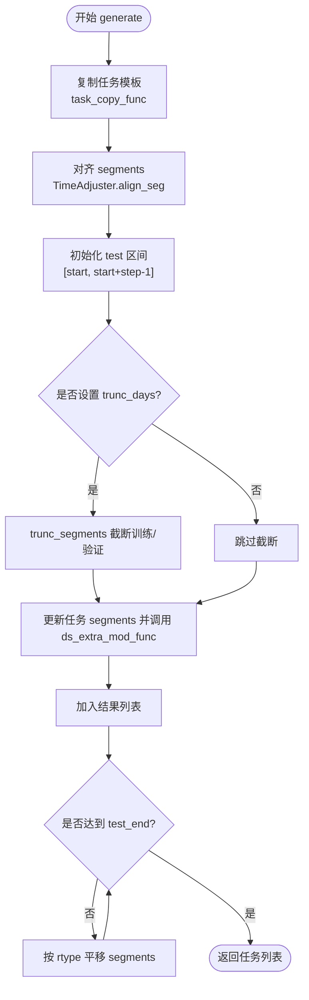

# 任务生成

<cite>
**本文引用的文件**
- [gen.py](file://qlib/workflow/task/gen.py)
- [utils.py](file://qlib/workflow/task/utils.py)
- [data.py](file://qlib/utils/data.py)
- [dataset.py](file://qlib/contrib/meta/data_selection/dataset.py)
- [base.py](file://qlib/contrib/rolling/base.py)
- [task_manager_rolling.py](file://examples/model_rolling/task_manager_rolling.py)
- [online_management_simulate.py](file://examples/online_srv/online_management_simulate.py)
</cite>

## 目录
1. [简介](#简介)
2. [项目结构](#项目结构)
3. [核心组件](#核心组件)
4. [架构总览](#架构总览)
5. [详细组件分析](#详细组件分析)
6. [依赖关系分析](#依赖关系分析)
7. [性能与最佳实践](#性能与最佳实践)
8. [故障排查指南](#故障排查指南)
9. [结论](#结论)

## 简介
本文件面向任务生成系统，聚焦于以下目标：
- 解释 TaskGen 抽象基类及其具体实现 RollingGen 和 MultiHorizonGenBase 的职责与协作方式
- 说明如何通过 gen_task_config 创建任务模板，并使用 task_generator 批量生成任务
- 深入讲解 RollingGen 的滚动训练机制：ROLL_EX 扩展模式与 ROLL_SD 滑动模式
- 讲解 TimeAdjuster 的对齐、截断与平移能力，以及其在防止未来信息泄露中的作用
- 介绍 handler_mod 与 trunc_segments 在避免未来信息泄露中的关键用法
- 给出任务复制策略（task_copy_func）与数据段截断（trunc_days）的最佳实践

## 项目结构
任务生成相关代码主要位于 workflow/task 子模块中，包含任务生成器、时间调整工具与辅助函数；同时在示例与元学习模块中可以看到这些组件的实际应用。

图表来源
- [gen.py](file://qlib/workflow/task/gen.py#L14-L352)
- [utils.py](file://qlib/workflow/task/utils.py#L81-L280)
- [data.py](file://qlib/utils/data.py#L38-L64)
- [dataset.py](file://qlib/contrib/meta/data_selection/dataset.py#L254-L315)
- [base.py](file://qlib/contrib/rolling/base.py#L184-L216)
- [task_manager_rolling.py](file://examples/model_rolling/task_manager_rolling.py#L24-L69)
- [online_management_simulate.py](file://examples/online_srv/online_management_simulate.py#L24-L79)

章节来源
- [gen.py](file://qlib/workflow/task/gen.py#L14-L352)
- [utils.py](file://qlib/workflow/task/utils.py#L81-L280)
- [data.py](file://qlib/utils/data.py#L38-L64)
- [dataset.py](file://qlib/contrib/meta/data_selection/dataset.py#L254-L315)
- [base.py](file://qlib/contrib/rolling/base.py#L184-L216)
- [task_manager_rolling.py](file://examples/model_rolling/task_manager_rolling.py#L24-L69)
- [online_management_simulate.py](file://examples/online_srv/online_management_simulate.py#L24-L79)

## 核心组件
- TaskGen 抽象基类：定义 generate 接口，用于从任务模板生成一组任务
- RollingGen：基于时间窗口滚动生成任务序列，支持扩展（EXPANDING）与滑动（SLIDING）两种滚动模式
- MultiHorizonGenBase：按不同预测时长（horizon）生成任务集合，并进行时间对齐与截断
- TimeAdjuster：提供日历对齐、索引计算、截断与平移等时间操作
- task_generator：组合多个 TaskGen 对任务模板进行批量生成
- handler_mod：在滚动过程中自动延长数据处理器的结束时间，避免数据不足
- trunc_segments：按测试起始时间向前截断训练/验证等时间段，防止未来信息泄露
- deepcopy_basic_type：轻量深拷贝，便于在共享处理器等场景下复用对象

章节来源
- [gen.py](file://qlib/workflow/task/gen.py#L51-L352)
- [utils.py](file://qlib/workflow/task/utils.py#L81-L280)
- [data.py](file://qlib/utils/data.py#L38-L64)

## 架构总览
任务生成的整体流程如下：
- 用户准备任务模板（包含 model、dataset、record 等）
- 通过 task_generator 将模板交给一个或多个 TaskGen 实例
- RollingGen 负责按步长生成滚动任务序列，必要时调用 handler_mod 延长数据处理器结束时间
- MultiHorizonGenBase 负责按不同 horizon 生成多任务，并对 segments 进行对齐与截断
- TimeAdjuster 提供对齐、截断与平移的基础能力，贯穿整个流程
- 最终得到一批任务，交由训练器执行

图表来源
- [gen.py](file://qlib/workflow/task/gen.py#L14-L301)
- [gen.py](file://qlib/workflow/task/gen.py#L93-L126)
- [gen.py](file://qlib/workflow/task/gen.py#L127-L140)
- [utils.py](file://qlib/workflow/task/utils.py#L173-L279)

## 详细组件分析

### TaskGen 抽象基类
- 角色：定义 generate(task) 接口，子类负责将单个任务模板转换为一组任务
- 特点：通过 __call__ 提供简写语法，便于直接调用

章节来源
- [gen.py](file://qlib/workflow/task/gen.py#L51-L91)

### RollingGen：滚动任务生成器
- 关键参数
  - step：滚动步长（交易日）
  - rtype：滚动类型，ROLL_EX（扩展）或 ROLL_SD（滑动）
  - ds_extra_mod_func：生成任务后的额外修改回调，默认使用 handler_mod
  - test_key/train_key：测试/训练键名，默认 "test"/"train"
  - trunc_days：按测试起始时间向前截断的天数
  - task_copy_func：任务复制策略，默认 copy.deepcopy
- 生成流程
  - 首次生成：对齐 segments，设置 test 区间为 [start, start+step-1]，可选 trunc_days 截断
  - 后续滚动：根据 rtype 决定 train/test 的平移规则，直到 test 结束时间超过上限
  - 每次生成均调用 ds_extra_mod_func（如 handler_mod）以确保数据可用性
- 滚动模式
  - ROLL_EX（扩展）：仅扩展训练区间，测试/验证区间大小保持不变
  - ROLL_SD（滑动）：整体区间向后平移，测试/验证区间大小保持不变

图表来源
- [gen.py](file://qlib/workflow/task/gen.py#L141-L301)
- [gen.py](file://qlib/workflow/task/gen.py#L181-L227)
- [gen.py](file://qlib/workflow/task/gen.py#L228-L301)
- [utils.py](file://qlib/workflow/task/utils.py#L173-L279)

章节来源
- [gen.py](file://qlib/workflow/task/gen.py#L141-L301)
- [gen.py](file://qlib/workflow/task/gen.py#L181-L227)
- [gen.py](file://qlib/workflow/task/gen.py#L228-L301)

### MultiHorizonGenBase：多时长任务生成器
- 用途：针对同一任务模板，按不同的 horizon 列表生成多个任务
- 关键点
  - set_horizon(task, hr)：子类需实现该方法以“原地”修改任务的标签/模型参数以适配指定 horizon
  - 生成时先对齐 segments，再按 hr + label_leak_n 截断训练/验证区间，防止未来信息泄露
  - test_key 默认为 "test"

图表来源
- [gen.py](file://qlib/workflow/task/gen.py#L304-L352)
- [gen.py](file://qlib/workflow/task/gen.py#L338-L350)
- [gen.py](file://qlib/workflow/task/gen.py#L305-L323)

章节来源
- [gen.py](file://qlib/workflow/task/gen.py#L304-L352)
- [gen.py](file://qlib/workflow/task/gen.py#L338-L350)
- [gen.py](file://qlib/workflow/task/gen.py#L305-L323)

### TimeAdjuster：时间对齐与平移
- 主要能力
  - align_idx/align_time：将任意时间点对齐到交易日历
  - align_seg：对字典或元组形式的 segments 进行对齐
  - truncate：按测试起始时间向前截断训练/验证区间
  - shift：按步长与模式（滑动/扩展）平移区间
  - cal_interval：计算两个时间点之间的交易日间隔
- 重要常量
  - SHIFT_SD（滑动）、SHIFT_EX（扩展）

图表来源
- [utils.py](file://qlib/workflow/task/utils.py#L81-L280)

章节来源
- [utils.py](file://qlib/workflow/task/utils.py#L81-L280)

### task_generator：批量任务生成
- 功能：将多个任务模板依次交给多个 TaskGen，最终输出完整的任务列表
- 行为：若输入为单个模板，则转为列表；若生成器为单个实例，则转为列表；逐个生成并拼接

章节来源
- [gen.py](file://qlib/workflow/task/gen.py#L14-L48)

### handler_mod：数据处理器结束时间修正
- 作用：当数据处理器的 end_time 早于当前任务的 test 区间结束时间时，自动将其延长至 test 区间结束时间，保证数据加载完整
- 安全性：对不存在键或类型异常进行捕获，避免报错

章节来源
- [gen.py](file://qlib/workflow/task/gen.py#L93-L126)

### trunc_segments：防止未来信息泄露
- 作用：按测试起始时间向前截断训练/验证区间，截断长度为 days
- 适用场景：当标签包含未来若干交易日的信息时，需要预留足够的历史窗口，避免“泄漏”

章节来源
- [gen.py](file://qlib/workflow/task/gen.py#L127-L140)

### 任务复制策略（task_copy_func）与最佳实践
- 作用：控制任务复制行为，避免多个任务共享同一对象导致副作用
- 推荐策略
  - 默认使用 copy.deepcopy，确保完全隔离
  - 若希望在任务之间共享处理器等昂贵对象，可使用 deepcopy_basic_type，仅浅拷贝容器类型，保留深层对象引用
- 典型用法
  - 共享处理器：在 RollingGen 中传入 task_copy_func=deepcopy_basic_type，使多个任务共享同一个 DataHandler 实例
  - 隔离任务：默认不传入自定义复制函数，使用 copy.deepcopy

章节来源
- [gen.py](file://qlib/workflow/task/gen.py#L141-L179)
- [data.py](file://qlib/utils/data.py#L38-L64)

### 数据段截断（trunc_days）最佳实践
- 目标：避免未来信息泄露，确保训练/验证数据不包含测试期之后的信息
- 使用建议
  - 在 RollingGen.generate 中设置 trunc_days，通常等于预测 horizon 或更大，以覆盖标签所需的未来窗口
  - 在 MultiHorizonGenBase.generate 中，截断长度为 hr + label_leak_n，确保每个 horizon 下的数据安全
- 注意事项
  - trunc_days 应与标签构造逻辑一致，避免截断过度导致样本过少
  - 若使用扩展模式（ROLL_EX），训练区间的扩展不应影响验证/测试区间的大小

章节来源
- [gen.py](file://qlib/workflow/task/gen.py#L141-L179)
- [gen.py](file://qlib/workflow/task/gen.py#L305-L323)
- [gen.py](file://qlib/workflow/task/gen.py#L338-L350)

## 依赖关系分析
- RollingGen 依赖 TimeAdjuster 进行对齐、截断与平移
- RollingGen 可选调用 handler_mod 以延长数据处理器结束时间
- MultiHorizonGenBase 依赖 TimeAdjuster 进行对齐与截断
- task_generator 组合多个 TaskGen，形成流水线式任务生成
- 示例模块展示了 RollingGen 在实际工作流中的使用方式

图表来源
- [gen.py](file://qlib/workflow/task/gen.py#L14-L352)
- [utils.py](file://qlib/workflow/task/utils.py#L81-L280)
- [base.py](file://qlib/contrib/rolling/base.py#L184-L216)
- [task_manager_rolling.py](file://examples/model_rolling/task_manager_rolling.py#L24-L69)
- [online_management_simulate.py](file://examples/online_srv/online_management_simulate.py#L24-L79)
- [dataset.py](file://qlib/contrib/meta/data_selection/dataset.py#L254-L315)

章节来源
- [gen.py](file://qlib/workflow/task/gen.py#L14-L352)
- [utils.py](file://qlib/workflow/task/utils.py#L81-L280)
- [base.py](file://qlib/contrib/rolling/base.py#L184-L216)
- [task_manager_rolling.py](file://examples/model_rolling/task_manager_rolling.py#L24-L69)
- [online_management_simulate.py](file://examples/online_srv/online_management_simulate.py#L24-L79)
- [dataset.py](file://qlib/contrib/meta/data_selection/dataset.py#L254-L315)

## 性能与最佳实践
- 复制策略
  - 默认 copy.deepcopy：安全性高，适合大多数场景
  - deepcopy_basic_type：在共享处理器等昂贵对象时可显著减少内存占用与拷贝开销
- 截断长度
  - trunc_days 或 hr + label_leak_n 应与标签构造一致，避免过度截断导致样本不足
- 滚动模式选择
  - ROLL_EX：适合需要逐步扩大训练集的场景，但会增加训练成本
  - ROLL_SD：适合固定窗口滚动，便于对比与稳定性评估
- 数据加载
  - 使用 handler_mod 自动延长处理器结束时间，避免因数据边界导致的任务失败
- 批量生成
  - task_generator 支持多生成器串联，建议按功能拆分生成器，提高可维护性

[本节为通用指导，无需列出章节来源]

## 故障排查指南
- “超出日历范围”
  - 现象：平移后索引越界
  - 处理：检查 test_end 与 step 是否过大，适当减小步长或缩短测试期
- “数据不足”
  - 现象：数据处理器 end_time 早于 test 区间结束时间
  - 处理：启用 handler_mod 或手动延长处理器 end_time
- “未来信息泄露”
  - 现象：验证/训练包含测试期之后的数据
  - 处理：设置 trunc_days 或在 MultiHorizonGenBase 中按 hr + label_leak_n 截断
- “任务共享导致副作用”
  - 现象：多个任务共享同一对象导致状态污染
  - 处理：使用默认 copy.deepcopy 或 deepcopy_basic_type 明确复制策略

章节来源
- [gen.py](file://qlib/workflow/task/gen.py#L93-L126)
- [gen.py](file://qlib/workflow/task/gen.py#L127-L140)
- [gen.py](file://qlib/workflow/task/gen.py#L242-L279)
- [utils.py](file://qlib/workflow/task/utils.py#L242-L279)

## 结论
任务生成系统围绕 TaskGen 抽象基类展开，通过 RollingGen 与 MultiHorizonGenBase 实现滚动与多时长任务生成。TimeAdjuster 提供了对齐、截断与平移的基础设施，配合 handler_mod 与 trunc_segments，有效防止未来信息泄露。借助 task_generator，用户可以灵活组合多种生成策略，构建大规模、可复用的任务流水线。在实践中，合理选择复制策略与截断长度，是保障实验稳定性的关键。