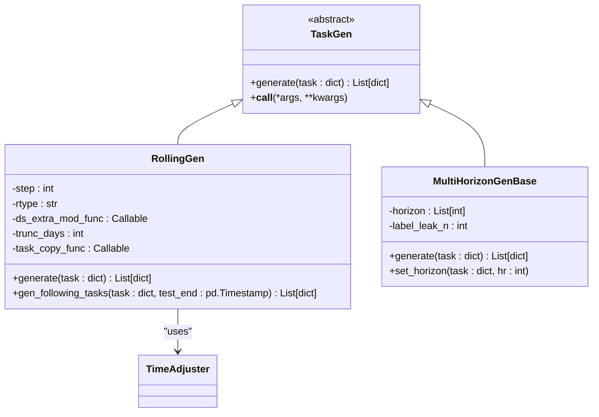
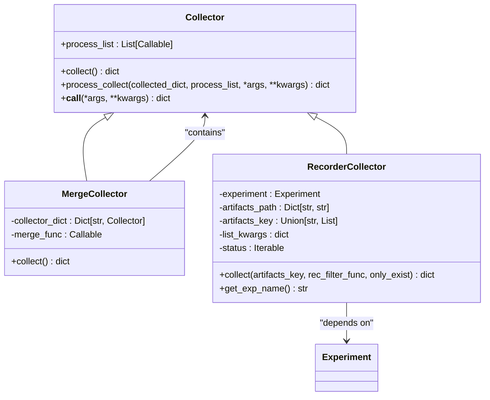
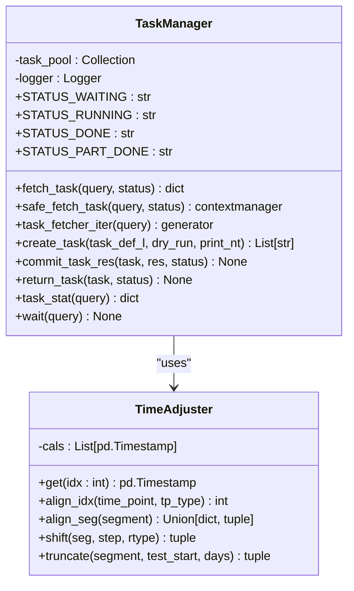
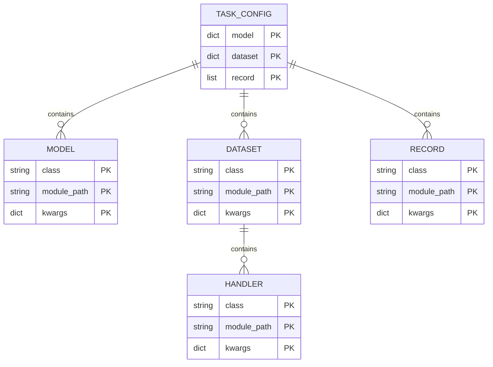
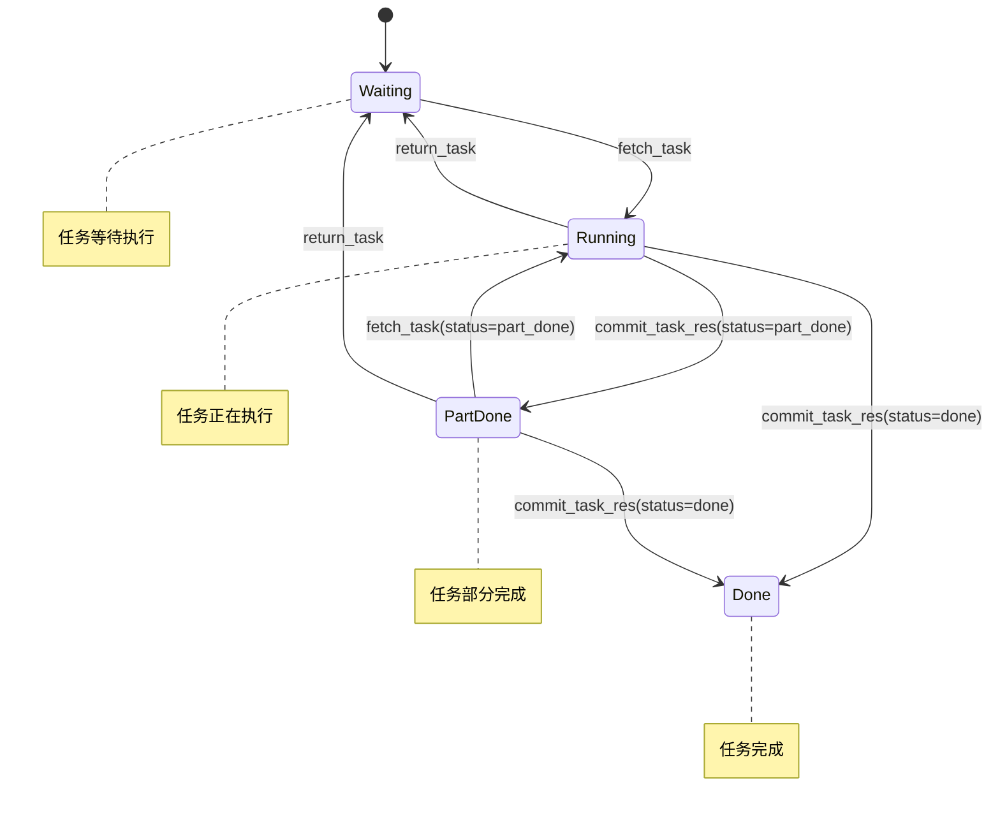
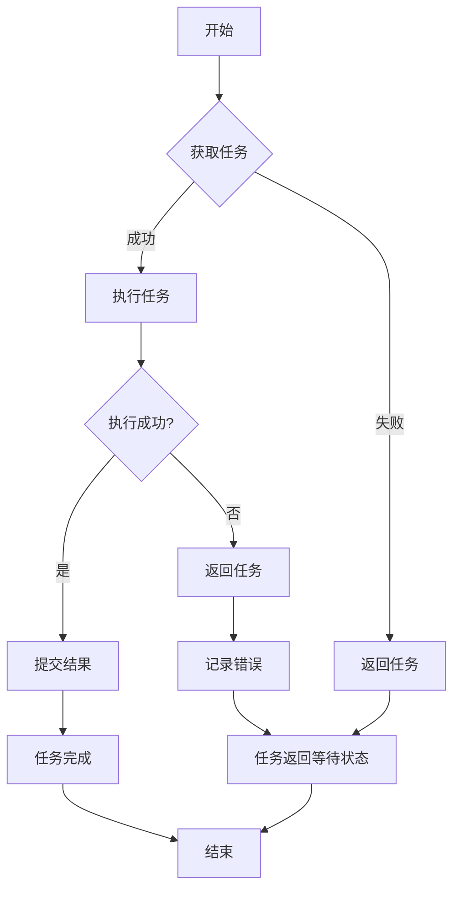
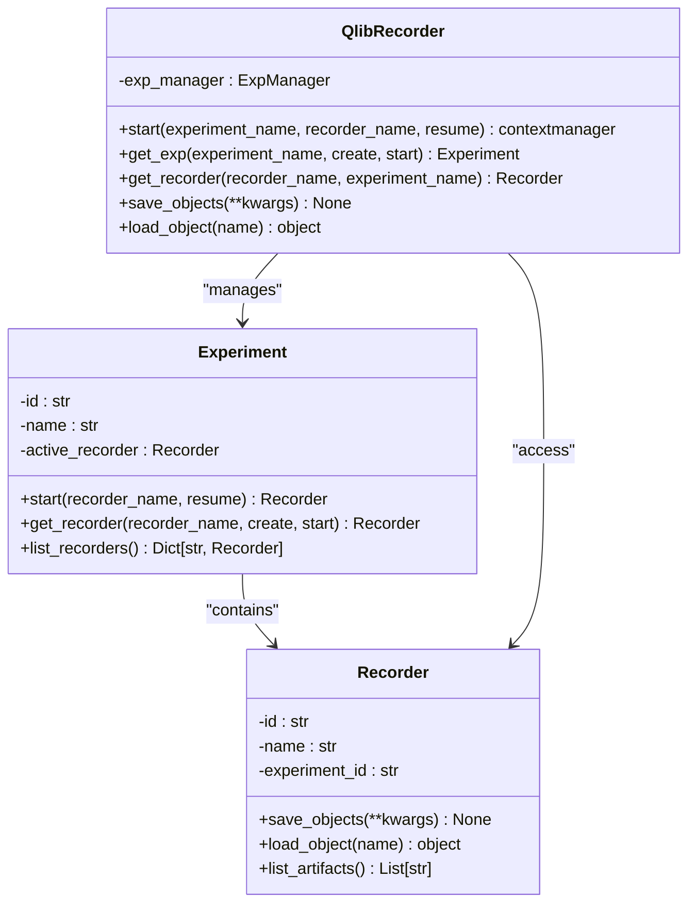
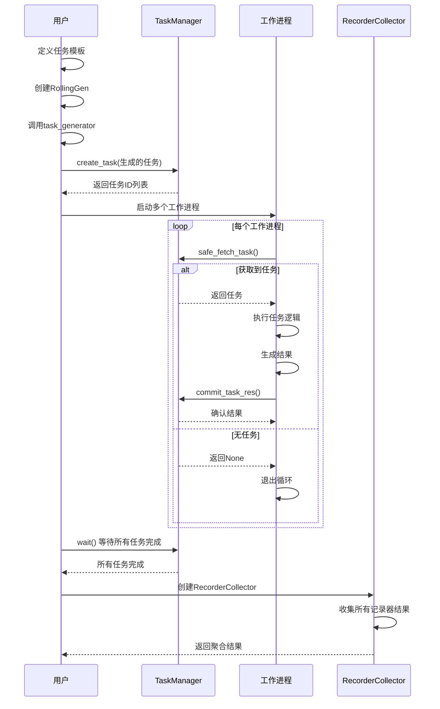

# 任务管理

<cite>
**本文档引用的文件**  
- [gen.py](file://qlib/workflow/task/gen.py)
- [collect.py](file://qlib/workflow/task/collect.py)
- [manage.py](file://qlib/workflow/task/manage.py)
- [utils.py](file://qlib/workflow/task/utils.py)
- [workflow_by_code.py](file://examples/workflow_by_code.py)
- [task_manager_rolling.py](file://examples/model_rolling/task_manager_rolling.py)
- [workflow_config_lightgbm_Alpha158.yaml](file://examples/benchmarks/LightGBM/workflow_config_lightgbm_Alpha158.yaml)
- [exp.py](file://qlib/workflow/exp.py)
- [recorder.py](file://qlib/workflow/recorder.py)
- [expm.py](file://qlib/workflow/expm.py)
</cite>

## 目录
1. [简介](#简介)
2. [任务生成](#任务生成)
3. [任务收集](#任务收集)
4. [任务执行与调度](#任务执行与调度)
5. [任务元数据与配置](#任务元数据与配置)
6. [任务依赖与执行策略](#任务依赖与执行策略)
7. [错误恢复机制](#错误恢复机制)
8. [跨任务数据共享](#跨任务数据共享)
9. [工作流配置文件](#工作流配置文件)
10. [完整流程示例](#完整流程示例)

## 简介
本文档详细描述了QLib任务管理系统的核心组件和工作流程，包括任务生成（TaskGen）、任务收集（Collector）和任务执行的完整流程。系统通过`gen_task_config`创建任务配置，使用`TaskManager`进行任务调度与状态监控。文档解释了任务依赖关系、执行策略和错误恢复机制，提供了任务元数据结构定义和跨任务数据共享的最佳实践，并结合`workflow_config.yaml`配置文件说明参数传递方式。

**Section sources**
- [gen.py](file://qlib/workflow/task/gen.py#L1-L352)
- [collect.py](file://qlib/workflow/task/collect.py#L1-L259)
- [manage.py](file://qlib/workflow/task/manage.py#L1-L557)

## 任务生成
任务生成系统通过`TaskGen`基类和具体的生成器（如`RollingGen`）来创建任务。`task_generator`函数是任务生成的核心入口，它接受任务模板列表和任务生成器列表，生成最终的任务列表。

`RollingGen`是主要的任务生成器，用于生成滚动任务。它支持两种滚动类型：`ROLL_EX`（固定起始日期，扩展结束日期）和`ROLL_SD`（固定时间段，滑动窗口）。生成器通过调整任务配置中的时间片段（segments）来创建不同的任务实例。



**Diagram sources**
- [gen.py](file://qlib/workflow/task/gen.py#L52-L352)
- [utils.py](file://qlib/workflow/task/utils.py#L82-L281)

**Section sources**
- [gen.py](file://qlib/workflow/task/gen.py#L1-L352)
- [utils.py](file://qlib/workflow/task/utils.py#L82-L281)

## 任务收集
任务收集系统通过`Collector`基类和具体的收集器（如`RecorderCollector`）来收集和处理任务结果。`Collector`支持对收集到的结果进行一系列处理，如分组、集成等。

`RecorderCollector`是主要的收集器，用于从实验记录器中收集结果。它可以根据实验名称、记录器状态等条件过滤记录器，并从记录器中加载指定的工件（artifacts）。收集器支持自定义键生成函数和过滤函数，以灵活地组织和筛选结果。



**Diagram sources**
- [collect.py](file://qlib/workflow/task/collect.py#L19-L259)
- [exp.py](file://qlib/workflow/exp.py#L15-L380)

**Section sources**
- [collect.py](file://qlib/workflow/task/collect.py#L1-L259)
- [exp.py](file://qlib/workflow/exp.py#L15-L380)

## 任务执行与调度
任务执行与调度系统通过`TaskManager`类来管理任务的生命周期。`TaskManager`将所有任务存储在MongoDB中，确保每个任务只被使用一次，并支持并发执行。

`TaskManager`定义了四种任务状态：`waiting`（等待中）、`running`（运行中）、`part_done`（部分完成）和`done`（已完成）。系统通过`safe_fetch_task`上下文管理器安全地获取任务，确保在发生异常时任务能被正确返回。



**Diagram sources**
- [manage.py](file://qlib/workflow/task/manage.py#L33-L557)
- [utils.py](file://qlib/workflow/task/utils.py#L82-L281)

**Section sources**
- [manage.py](file://qlib/workflow/task/manage.py#L1-L557)
- [utils.py](file://qlib/workflow/task/utils.py#L1-L309)

## 任务元数据与配置
任务元数据以字典形式定义，包含模型、数据集、记录器等核心组件的配置。任务配置通过`workflow_config.yaml`文件或代码方式定义，支持占位符替换和动态参数注入。

任务配置的核心结构包括：
- `model`：模型配置，指定模型类和模块路径
- `dataset`：数据集配置，包含数据处理器和时间片段
- `record`：记录器配置，定义结果生成和分析流程



**Diagram sources**
- [workflow_config_lightgbm_Alpha158.yaml](file://examples/benchmarks/LightGBM/workflow_config_lightgbm_Alpha158.yaml#L1-L72)
- [gen.py](file://qlib/workflow/task/gen.py#L238-L273)

**Section sources**
- [workflow_config_lightgbm_Alpha158.yaml](file://examples/benchmarks/LightGBM/workflow_config_lightgbm_Alpha158.yaml#L1-L72)
- [gen.py](file://qlib/workflow/task/gen.py#L1-L352)

## 任务依赖与执行策略
任务系统支持复杂的依赖关系和执行策略。通过`TaskManager`的状态机，可以实现任务的串行、并行和条件执行。`run_task`函数提供了灵活的任务执行框架，支持从`waiting`到`done`或`part_done`的状态转换。

执行策略包括：
- **串行执行**：通过`wait`方法等待所有任务完成
- **并行执行**：多个工作进程同时从`TaskManager`获取任务
- **分阶段执行**：通过`part_done`状态实现多阶段任务处理



**Diagram sources**
- [manage.py](file://qlib/workflow/task/manage.py#L77-L80)
- [manage.py](file://qlib/workflow/task/manage.py#L483-L549)

**Section sources**
- [manage.py](file://qlib/workflow/task/manage.py#L1-L557)

## 错误恢复机制
系统提供了完善的错误恢复机制。`safe_fetch_task`上下文管理器确保在发生异常时，运行中的任务能被自动返回到`waiting`状态。`reset_waiting`方法可以重置所有运行中的任务，使其重新变为等待状态。

当工作进程意外退出时，可以通过以下步骤恢复：
1. 调用`reset_waiting`方法重置所有运行中的任务
2. 重新启动工作进程继续处理任务
3. 使用`wait`方法等待所有任务完成



**Diagram sources**
- [manage.py](file://qlib/workflow/task/manage.py#L286-L309)
- [manage.py](file://qlib/workflow/task/manage.py#L414-L431)

**Section sources**
- [manage.py](file://qlib/workflow/task/manage.py#L1-L557)

## 跨任务数据共享
系统通过`Recorder`和`Experiment`机制实现跨任务数据共享。每个任务的结果保存在记录器中，可以通过`RecorderCollector`进行收集和整合。`R`全局对象提供了统一的接口来访问实验和记录器。

数据共享的最佳实践包括：
- 使用`save_objects`和`load_object`方法保存和加载Python对象
- 通过`artifact_path`参数组织工件的存储结构
- 利用`Experiment`的命名空间管理相关任务



**Diagram sources**
- [__init__.py](file://qlib/workflow/__init__.py#L26-L681)
- [exp.py](file://qlib/workflow/exp.py#L15-L380)
- [recorder.py](file://qlib/workflow/recorder.py#L28-L494)

**Section sources**
- [__init__.py](file://qlib/workflow/__init__.py#L1-L682)
- [exp.py](file://qlib/workflow/exp.py#L1-L380)
- [recorder.py](file://qlib/workflow/recorder.py#L1-L494)

## 工作流配置文件
工作流配置文件（`workflow_config.yaml`）是定义任务的主要方式。配置文件采用YAML格式，包含`qlib_init`、`task`等核心部分。`task`部分定义了模型、数据集和记录器的配置。

配置文件支持参数引用和占位符，如`<PRED>`、`<MODEL>`等，这些占位符会在运行时被实际值替换。配置文件还支持通过`&`和`*`语法定义和引用锚点，避免重复配置。

```yaml
qlib_init:
    provider_uri: "~/.qlib/qlib_data/cn_data"
    region: cn
market: &market csi300
benchmark: &benchmark SH000300
data_handler_config: &data_handler_config
    start_time: 2008-01-01
    end_time: 2020-08-01
    fit_start_time: 2008-01-01
    fit_end_time: 2014-12-31
    instruments: *market
task:
    model:
        class: LGBModel
        module_path: qlib.contrib.model.gbdt
        kwargs:
            loss: mse
            colsample_bytree: 0.8879
    dataset:
        class: DatasetH
        module_path: qlib.data.dataset
        kwargs:
            handler:
                class: Alpha158
                module_path: qlib.contrib.data.handler
                kwargs: *data_handler_config
            segments:
                train: [2008-01-01, 2014-12-31]
                valid: [2015-01-01, 2016-12-31]
                test: [2017-01-01, 2020-08-01]
```

**Section sources**
- [workflow_config_lightgbm_Alpha158.yaml](file://examples/benchmarks/LightGBM/workflow_config_lightgbm_Alpha158.yaml#L1-L72)

## 完整流程示例
以下是一个完整的任务管理流程示例，展示了从任务生成到结果收集的全过程：



**Diagram sources**
- [task_manager_rolling.py](file://examples/model_rolling/task_manager_rolling.py#L24-L117)
- [workflow_by_code.py](file://examples/workflow_by_code.py#L19-L86)

**Section sources**
- [task_manager_rolling.py](file://examples/model_rolling/task_manager_rolling.py#L1-L117)
- [workflow_by_code.py](file://examples/workflow_by_code.py#L1-L86)