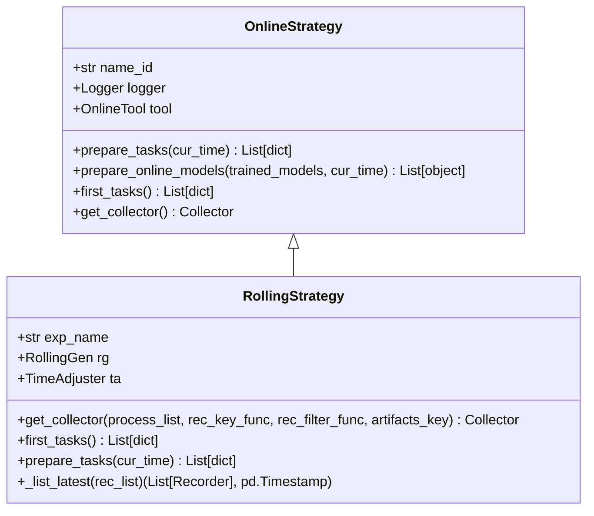
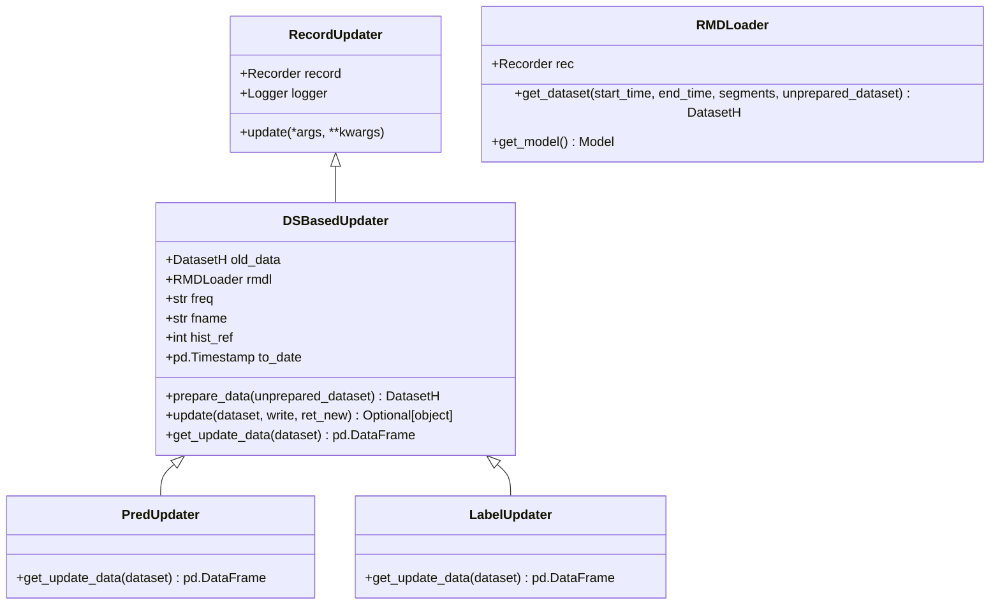
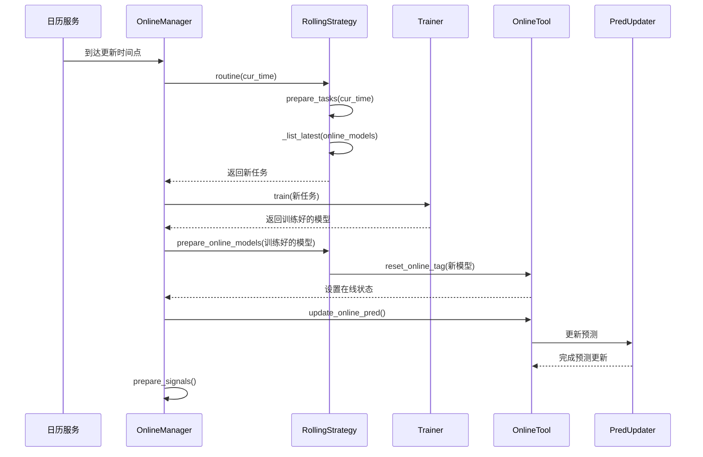
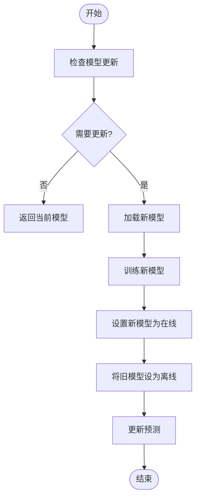
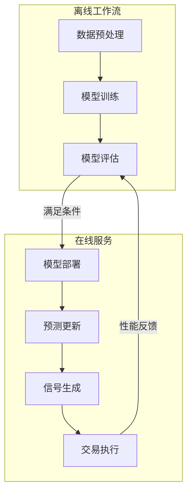

# 在线服务

<cite>
**本文档引用的文件**
- [manager.py](file://qlib/workflow/online/manager.py)
- [strategy.py](file://qlib/workflow/online/strategy.py)
- [update.py](file://qlib/workflow/online/update.py)
- [utils.py](file://qlib/workflow/online/utils.py)
- [rolling_online_management.py](file://examples/online_srv/rolling_online_management.py)
- [update_online_pred.py](file://examples/online_srv/update_online_pred.py)
- [recorder.py](file://qlib/workflow/recorder.py)
</cite>

## 目录
1. [在线服务模块API设计](#在线服务模块api设计)
2. [自动化模型滚动更新机制](#自动化模型滚动更新机制)
3. [在线预测服务生命周期管理](#在线预测服务生命周期管理)
4. [在线服务与离线工作流集成](#在线服务与离线工作流集成)
5. [版本控制与回滚方案](#版本控制与回滚方案)

## 在线服务模块API设计

在线服务模块的核心组件包括`OnlineManager`、`OnlineStrategy`和`RecordUpdater`，它们共同构成了完整的在线预测服务架构。

### OnlineManager接口设计

`OnlineManager`是在线服务的核心管理器，负责协调多个在线策略并管理其生命周期。

**核心方法：**
- `first_train()`: 执行首次训练，为所有策略生成初始模型
- `routine()`: 执行常规更新流程，包括准备任务、训练模型和更新信号
- `simulate()`: 模拟历史交易流程，用于策略验证
- `add_strategy()`: 动态添加新的在线策略
- `prepare_signals()`: 准备交易信号，支持多种集成策略

**状态管理：**
- `STATUS_SIMULATING`: 模拟状态，用于回测
- `STATUS_ONLINE`: 在线状态，用于实时交易

**Section sources**
- [manager.py](file://qlib/workflow/online/manager.py#L101-L383)

### OnlineStrategy接口设计

`OnlineStrategy`定义了在线策略的抽象接口，所有具体策略都必须实现这些方法。



**Diagram sources**
- [strategy.py](file://qlib/workflow/online/strategy.py#L19-L209)

**核心方法：**
- `prepare_tasks()`: 根据当前时间准备需要训练的新任务
- `prepare_online_models()`: 从训练好的模型中选择在线服务模型
- `first_tasks()`: 生成初始训练任务
- `get_collector()`: 获取结果收集器，用于收集预测结果

`RollingStrategy`是`OnlineStrategy`的具体实现，专门用于滚动更新场景，通过`RollingGen`生成滚动任务。

**Section sources**
- [strategy.py](file://qlib/workflow/online/strategy.py#L19-L209)

### RecordUpdater接口设计

`RecordUpdater`是记录更新器的基类，负责更新模型预测和其他相关数据。



**Diagram sources**
- [update.py](file://qlib/workflow/online/update.py#L66-L299)

**核心组件：**
- `DSBasedUpdater`: 基于数据集的更新器基类，处理数据更新的通用逻辑
- `PredUpdater`: 预测更新器，专门用于更新模型预测
- `LabelUpdater`: 标签更新器，用于更新标签数据
- `RMDLoader`: 记录-模型-数据集加载器，负责加载模型和数据集

**Section sources**
- [update.py](file://qlib/workflow/online/update.py#L66-L299)

## 自动化模型滚动更新机制

自动化模型滚动更新机制通过`OnlineManager`和`RollingStrategy`的协同工作实现，确保模型能够根据市场变化自动更新。

### 滚动更新触发机制

滚动更新的触发机制基于时间驱动和策略决策相结合的方式。



**Diagram sources**
- [manager.py](file://qlib/workflow/online/manager.py#L184-L229)
- [strategy.py](file://qlib/workflow/online/strategy.py#L167-L189)
- [utils.py](file://qlib/workflow/online/utils.py#L159-L177)

**触发条件：**
1. **时间条件**: 达到预设的更新周期（如每日、每周）
2. **数据条件**: 新的市场数据可用
3. **性能条件**: 当前模型性能下降到阈值以下

**更新流程：**
1. `OnlineManager.routine()`被调用，传入当前时间
2. `RollingStrategy.prepare_tasks()`检查是否需要生成新任务
3. 通过比较最新在线模型的测试时间段与当前时间间隔来决定
4. 如果间隔达到滚动步长，则生成后续任务
5. `Trainer`训练新任务
6. `RollingStrategy.prepare_online_models()`将新模型设置为在线模型
7. `OnlineTool.update_online_pred()`更新预测

**Section sources**
- [manager.py](file://qlib/workflow/online/manager.py#L184-L229)
- [strategy.py](file://qlib/workflow/online/strategy.py#L167-L189)

## 在线预测服务生命周期管理

在线预测服务的生命周期管理涵盖了从模型加载到服务终止的全过程，确保服务的稳定性和可靠性。

### 模型热加载机制

模型热加载允许在不中断服务的情况下更新模型，通过`OnlineTool`实现无缝切换。



**Diagram sources**
- [utils.py](file://qlib/workflow/online/utils.py#L129-L144)

**热加载流程：**
1. 使用`OnlineToolR.reset_online_tag()`方法
2. 先将所有现有模型标记为"offline"
3. 再将新模型标记为"online"
4. 通过标签管理实现原子性切换

**Section sources**
- [utils.py](file://qlib/workflow/online/utils.py#L129-L144)

### 流量切换策略

流量切换通过渐进式的方式进行，确保服务稳定性。

**切换策略：**
- **立即切换**: 新模型训练完成后立即切换所有流量
- **渐进切换**: 按照预设比例逐步将流量从旧模型切换到新模型
- **A/B测试**: 同时运行新旧模型，比较性能后决定最终切换

**实现方式：**
通过`OnlineManager.history`记录每个时间点的在线模型，可以实现基于时间的流量路由。

**Section sources**
- [manager.py](file://qlib/workflow/online/manager.py#L136-L138)

### 健康检查机制

健康检查确保在线服务的可用性和性能。

**检查项：**
- 模型加载状态
- 预测响应时间
- 资源使用情况
- 预测结果质量

**实现方式：**
通过`OnlineTool.online_models()`获取当前在线模型列表，结合外部监控系统进行健康检查。

**Section sources**
- [utils.py](file://qlib/workflow/online/utils.py#L146-L157)

## 在线服务与离线工作流集成

在线服务与离线工作流的集成通过配置驱动的方式实现，支持定时更新和条件触发更新。

### 定时更新配置

通过配置文件实现定时更新策略。

```yaml
qlib_init:
    provider_uri: "~/.qlib/qlib_data/cn_data"
    region: cn
task:
    model:
        class: LGBModel
        module_path: qlib.contrib.model.gbdt
    dataset:
        class: DatasetH
        module_path: qlib.data.dataset
        kwargs:
            handler:
                class: Alpha158
                module_path: qlib.contrib.data.handler
    record: 
        - class: SignalRecord
          module_path: qlib.workflow.record_temp
```

**配置说明：**
- `qlib_init`: Qlib初始化配置
- `task`: 任务配置，包括模型、数据集和记录器
- `record`: 记录器配置，指定信号记录器

**Section sources**
- [workflow_config_lightgbm_Alpha158.yaml](file://examples/benchmarks/LightGBM/workflow_config_lightgbm_Alpha158.yaml)

### 条件触发更新

条件触发更新基于特定条件自动触发模型更新。

**触发条件类型：**
- **时间条件**: 每日、每周等固定周期
- **数据条件**: 新数据到达
- **性能条件**: 模型性能下降
- **市场条件**: 市场状态变化

**实现示例：**
```python
def routine(self, cur_time=None, task_kwargs={}, model_kwargs={}, signal_kwargs={}):
    # ... 
    if not self._postpone_action():
        for strategy, models in zip(self.strategies, models_list):
            models = self.trainer.end_train(models, experiment_name=strategy.name_id)
        self.prepare_signals(**signal_kwargs)
```

**Section sources**
- [manager.py](file://qlib/workflow/online/manager.py#L184-L229)

### 集成示例

完整的在线服务集成示例展示了如何将各个组件组合使用。



**Diagram sources**
- [rolling_online_management.py](file://examples/online_srv/rolling_online_management.py)
- [update_online_pred.py](file://examples/online_srv/update_online_pred.py)

**集成流程：**
1. 离线工作流完成模型训练和评估
2. 满足条件后触发模型部署
3. 在线服务加载新模型
4. 更新预测并生成交易信号
5. 执行交易并将结果反馈给离线工作流

**Section sources**
- [rolling_online_management.py](file://examples/online_srv/rolling_online_management.py)
- [update_online_pred.py](file://examples/online_srv/update_online_pred.py)

## 版本控制与回滚方案

版本控制和回滚方案确保在线服务的可靠性和可恢复性。

### 版本控制策略

通过`Recorder`系统实现完整的版本控制。

**版本标识：**
- 实验名称（experiment_name）
- 记录器ID（recorder id）
- 时间戳

**版本管理：**
- 每个模型版本都有唯一的记录器
- 通过标签（tags）标记版本状态（online/offline）
- 历史记录保存在`OnlineManager.history`中

**Section sources**
- [recorder.py](file://qlib/workflow/recorder.py)
- [manager.py](file://qlib/workflow/online/manager.py#L136-L138)

### 回滚方案

回滚方案允许在新模型表现不佳时快速恢复到之前的稳定版本。

**回滚流程：**
1. 检测到新模型性能下降
2. 从`OnlineManager.history`中查找之前的稳定版本
3. 使用`OnlineTool.reset_online_tag()`将旧版本重新设置为在线
4. 停止新模型的预测更新
5. 监控回滚后的系统性能

**实现方式：**
```python
def rollback_to_previous_version(self, strategy, version_count=1):
    history_times = sorted(self.history.keys(), reverse=True)
    if len(history_times) <= version_count:
        raise ValueError("Not enough versions for rollback")
    
    target_time = history_times[version_count]
    previous_models = self.history[target_time][strategy]
    self.logger.info(f"Rolling back to models from {target_time}")
    strategy.tool.reset_online_tag(previous_models)
    strategy.tool.update_online_pred()
```

**Section sources**
- [manager.py](file://qlib/workflow/online/manager.py#L136-L138)
- [utils.py](file://qlib/workflow/online/utils.py#L129-L144)