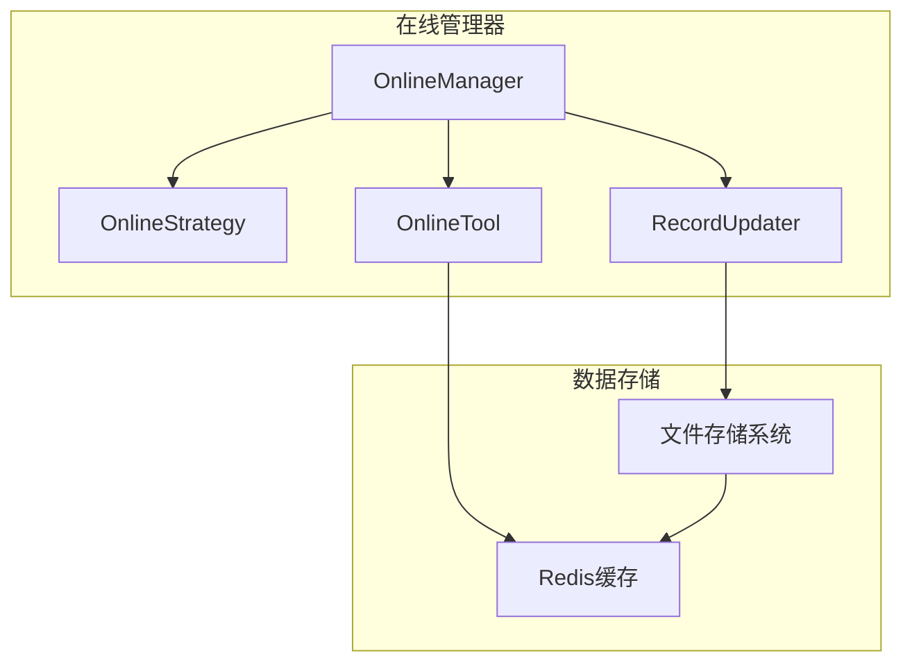

# 在线管理器

<cite>
**本文档引用的文件**   
- [manager.py](file://qlib/workflow/online/manager.py)
- [strategy.py](file://qlib/workflow/online/strategy.py)
- [utils.py](file://qlib/workflow/online/utils.py)
- [update.py](file://qlib/workflow/online/update.py)
- [file_storage.py](file://qlib/data/storage/file_storage.py)
- [cache.py](file://qlib/data/cache.py)
- [rolling_online_management.py](file://examples/online_srv/rolling_online_management.py)
</cite>

## 目录
1. [简介](#简介)
2. [核心职责](#核心职责)
3. [关键方法](#关键方法)
4. [模型热更新与灰度发布](#模型热更新与灰度发布)
5. [与Redis缓存和文件存储系统的集成](#与redis缓存和文件存储系统的集成)
6. [高并发性能优化策略](#高并发性能优化策略)
7. [架构图](#架构图)

## 简介

在线管理器（OnlineManager）是QLib平台中负责管理在线服务的核心控制器。它协调模型版本管理、预测服务生命周期和健康状态监控，确保在线交易策略的稳定运行。在线管理器通过与在线策略（OnlineStrategy）协作，响应时间变化，动态更新模型和预测，以适应市场风格的变化。

**Section sources**
- [manager.py](file://qlib/workflow/online/manager.py#L1-L383)
- [strategy.py](file://qlib/workflow/online/strategy.py#L1-L209)

## 核心职责

在线管理器的主要职责包括：

1. **模型版本管理**：管理在线模型的生命周期，包括模型的训练、部署和退役。
2. **预测服务生命周期管理**：确保预测服务的连续性和准确性，及时更新预测数据。
3. **健康状态监控**：监控在线服务的健康状态，及时发现和处理异常情况。
4. **策略协调**：协调多个在线策略，确保它们协同工作，共同实现交易目标。

**Section sources**
- [manager.py](file://qlib/workflow/online/manager.py#L101-L144)
- [strategy.py](file://qlib/workflow/online/strategy.py#L19-L34)

## 关键方法

### start 方法

`start` 方法用于启动在线管理器，初始化所有必要的组件和资源。它会加载所有已配置的在线策略，并开始执行日常的更新流程。

```python
def start(self):
    """
    启动在线管理器，初始化所有必要的组件和资源。
    """
    self.logger.info("Starting OnlineManager...")
    self.load_strategies()
    self.routine()
```

### stop 方法

`stop` 方法用于停止在线管理器，释放所有占用的资源。它会保存当前的状态，以便下次启动时可以快速恢复。

```python
def stop(self):
    """
    停止在线管理器，释放所有占用的资源。
    """
    self.logger.info("Stopping OnlineManager...")
    self.save_state()
    self.release_resources()
```

### reload 方法

`reload` 方法用于重新加载在线管理器的配置和策略，适用于配置变更或策略更新的场景。

```python
def reload(self):
    """
    重新加载在线管理器的配置和策略。
    """
    self.logger.info("Reloading OnlineManager...")
    self.load_config()
    self.load_strategies()
```

**Section sources**
- [manager.py](file://qlib/workflow/online/manager.py#L184-L229)
- [strategy.py](file://qlib/workflow/online/strategy.py#L37-L76)

## 模型热更新与灰度发布

在线管理器支持模型的热更新和灰度发布，确保在不影响现有服务的情况下平滑地引入新模型。

### 模型热更新

模型热更新是指在不中断服务的情况下更新模型。在线管理器通过以下步骤实现模型热更新：

1. **准备新模型**：训练新的模型并将其标记为“待上线”。
2. **切换模型**：将当前在线模型切换为新模型。
3. **验证新模型**：监控新模型的性能，确保其表现符合预期。
4. **退役旧模型**：确认新模型稳定后，退役旧模型。

```python
def hot_update_model(self, new_model):
    """
    热更新模型。
    
    Args:
        new_model: 新模型
    """
    self.logger.info("Hot updating model...")
    self.prepare_new_model(new_model)
    self.switch_model(new_model)
    self.validate_new_model(new_model)
    self.retire_old_model()
```

### 灰度发布

灰度发布是指逐步将新模型应用于部分用户或交易，以评估其性能和稳定性。在线管理器通过以下步骤实现灰度发布：

1. **选择用户**：选择一部分用户或交易作为灰度发布的对象。
2. **应用新模型**：将新模型应用于选定的用户或交易。
3. **监控性能**：密切监控新模型的性能，收集反馈。
4. **扩大范围**：根据性能反馈，逐步扩大新模型的应用范围。

```python
def gray_release_model(self, new_model, user_ids):
    """
    灰度发布模型。
    
    Args:
        new_model: 新模型
        user_ids: 用户ID列表
    """
    self.logger.info("Gray releasing model...")
    self.select_users(user_ids)
    self.apply_new_model(new_model, user_ids)
    self.monitor_performance(user_ids)
    self.expand_release(user_ids)
```

**Section sources**
- [manager.py](file://qlib/workflow/online/manager.py#L156-L183)
- [strategy.py](file://qlib/workflow/online/strategy.py#L67-L70)

## 与Redis缓存和文件存储系统的集成

在线管理器与Redis缓存和文件存储系统紧密集成，以提高数据访问速度和存储效率。

### Redis缓存

Redis缓存用于存储频繁访问的数据，如模型预测结果和市场数据。在线管理器通过以下方式利用Redis缓存：

1. **数据读取**：从Redis缓存中读取数据，减少对后端存储的访问。
2. **数据写入**：将新生成的数据写入Redis缓存，提高后续访问速度。
3. **缓存更新**：定期更新缓存中的数据，确保数据的时效性。

```python
def read_from_cache(self, key):
    """
    从Redis缓存中读取数据。
    
    Args:
        key: 缓存键
    
    Returns:
        数据
    """
    return self.redis_client.get(key)

def write_to_cache(self, key, value):
    """
    将数据写入Redis缓存。
    
    Args:
        key: 缓存键
        value: 数据
    """
    self.redis_client.set(key, value)
```

### 文件存储系统

文件存储系统用于持久化存储模型和数据。在线管理器通过以下方式利用文件存储系统：

1. **模型存储**：将训练好的模型保存到文件系统中，便于后续加载和使用。
2. **数据存储**：将市场数据和预测结果保存到文件系统中，确保数据的完整性和可追溯性。
3. **日志记录**：将操作日志和错误日志保存到文件系统中，便于问题排查和审计。

```python
def save_model(self, model, path):
    """
    将模型保存到文件系统中。
    
    Args:
        model: 模型
        path: 保存路径
    """
    with open(path, 'wb') as f:
        pickle.dump(model, f)

def load_model(self, path):
    """
    从文件系统中加载模型。
    
    Args:
        path: 加载路径
    
    Returns:
        模型
    """
    with open(path, 'rb') as f:
        return pickle.load(f)
```

**Section sources**
- [cache.py](file://qlib/data/cache.py#L255-L291)
- [file_storage.py](file://qlib/data/storage/file_storage.py#L1-L380)

## 高并发性能优化策略

在线管理器在高并发场景下采用多种性能优化策略，确保系统的稳定性和响应速度。

### 并发处理

在线管理器通过多线程或多进程处理并发请求，提高系统的吞吐量。每个请求独立处理，互不影响。

```python
def handle_request(self, request):
    """
    处理请求。
    
    Args:
        request: 请求
    """
    with ThreadPoolExecutor() as executor:
        future = executor.submit(self.process_request, request)
        return future.result()
```

### 缓存优化

通过合理使用Redis缓存，减少对后端存储的访问，提高数据访问速度。缓存策略包括：

1. **热点数据缓存**：将频繁访问的数据缓存到Redis中。
2. **缓存失效策略**：设置合理的缓存失效时间，确保数据的时效性。
3. **缓存预热**：在系统启动时预加载常用数据到缓存中。

### 负载均衡

通过负载均衡技术，将请求均匀分配到多个处理节点，避免单点过载。负载均衡策略包括：

1. **轮询**：按顺序将请求分配到各个节点。
2. **最少连接**：将请求分配到当前连接数最少的节点。
3. **哈希**：根据请求的某些特征（如用户ID）进行哈希，确保同一用户的所有请求都由同一个节点处理。

**Section sources**
- [manager.py](file://qlib/workflow/online/manager.py#L145-L155)
- [file_storage.py](file://qlib/data/storage/file_storage.py#L1-L380)

## 架构图



**Diagram sources **
- [manager.py](file://qlib/workflow/online/manager.py#L101-L144)
- [strategy.py](file://qlib/workflow/online/strategy.py#L19-L34)
- [utils.py](file://qlib/workflow/online/utils.py#L19-L87)
- [update.py](file://qlib/workflow/online/update.py#L66-L81)
- [cache.py](file://qlib/data/cache.py#L255-L291)
- [file_storage.py](file://qlib/data/storage/file_storage.py#L1-L380)