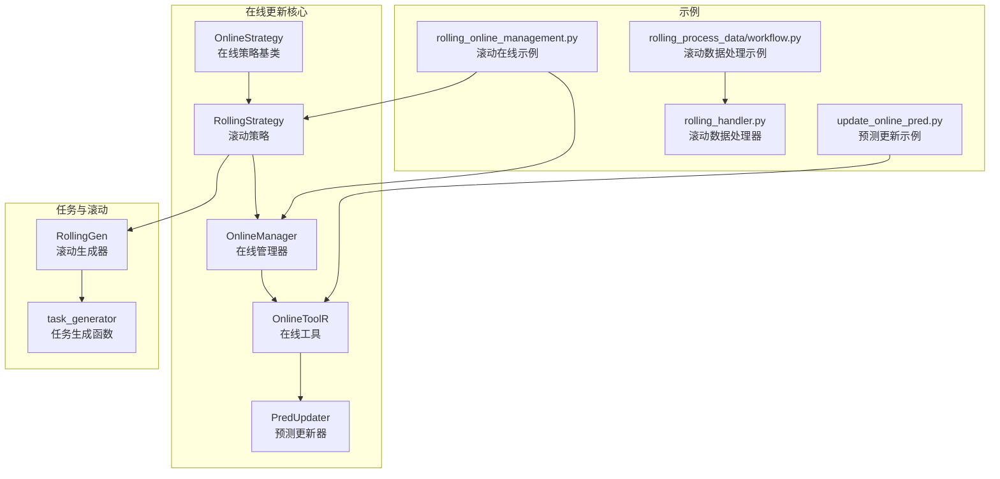
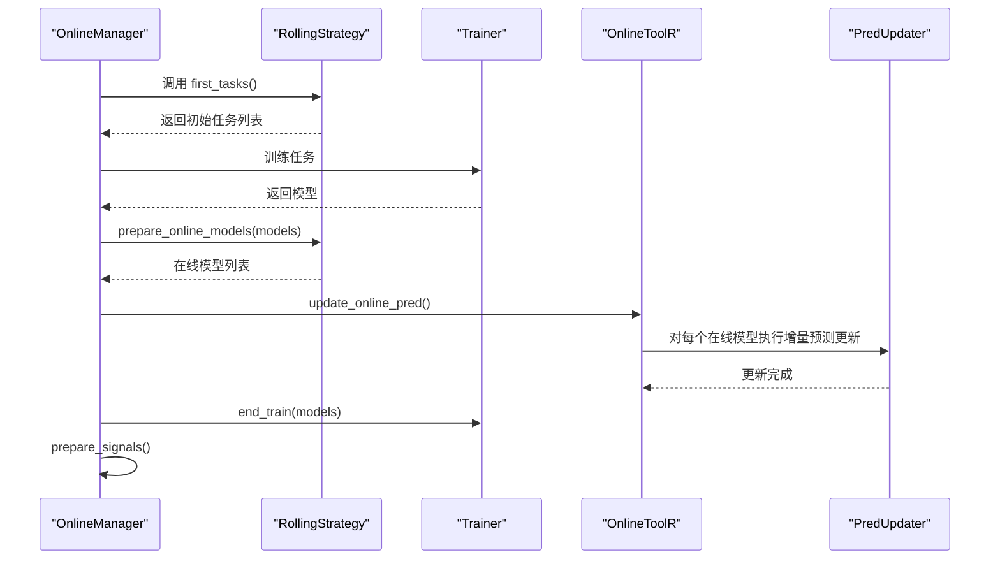
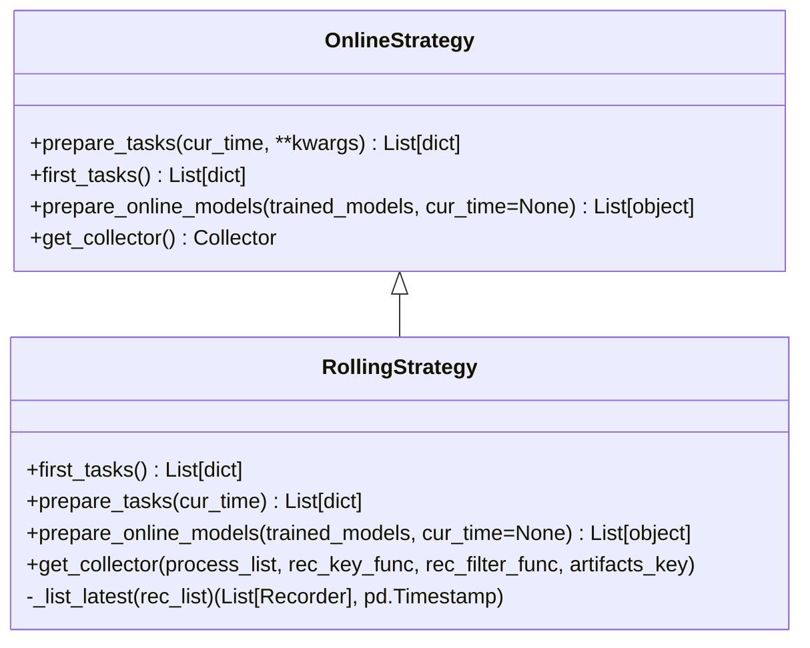
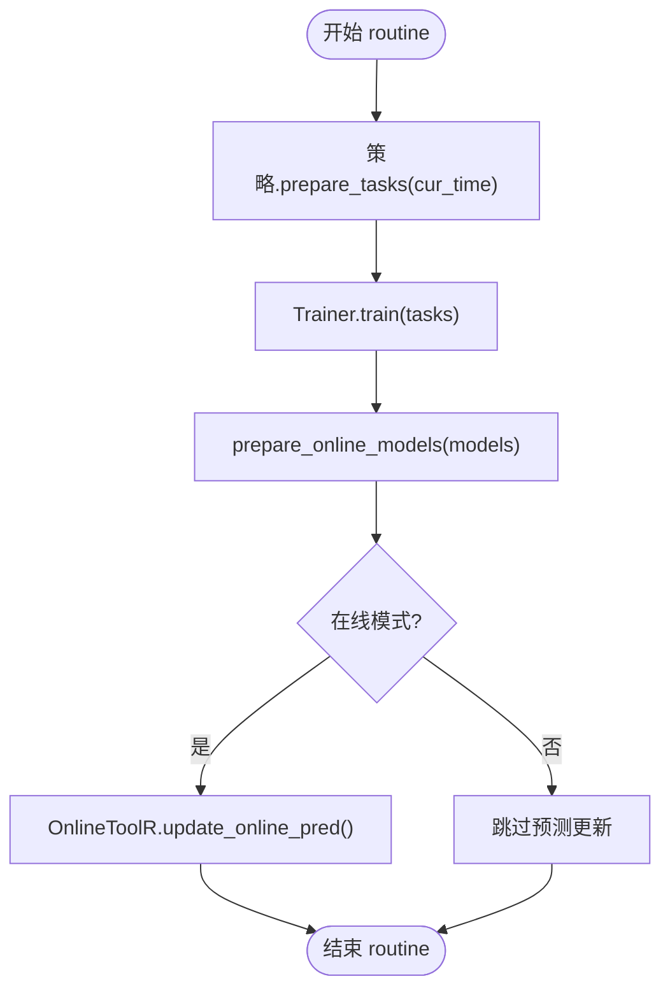
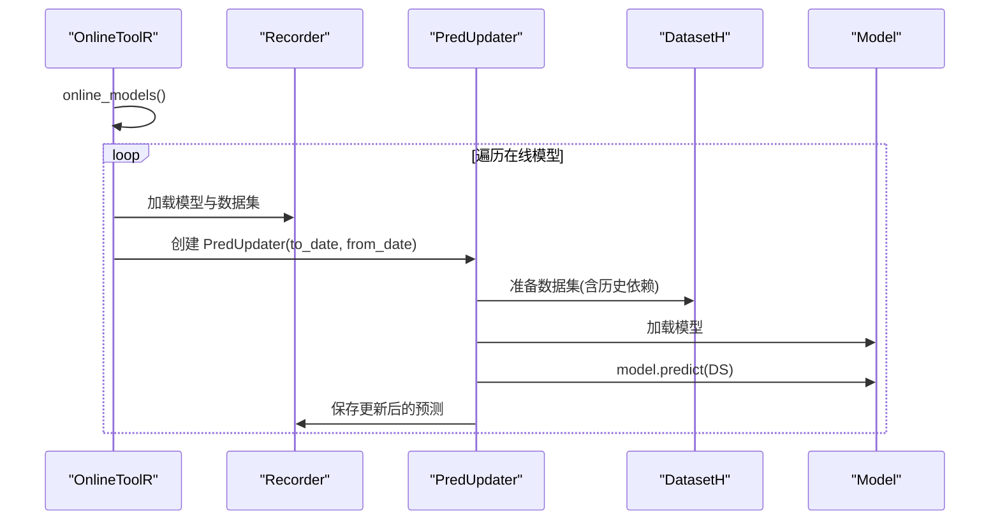
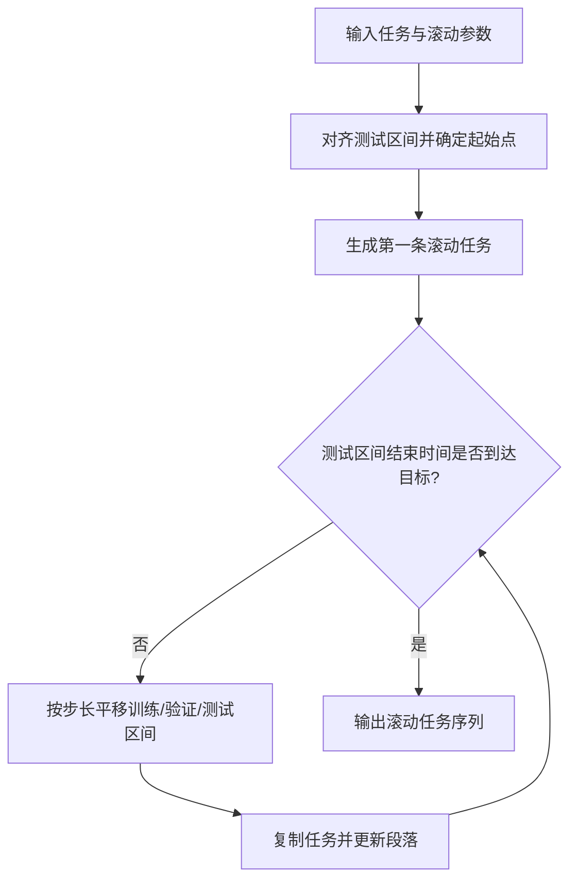
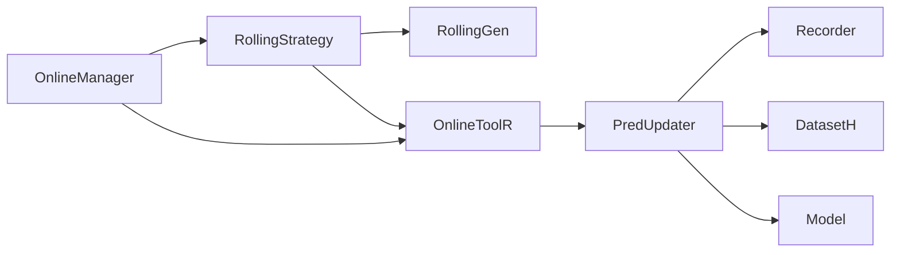

# 更新策略

<cite>
**本文引用的文件**
- [qlib/workflow/online/strategy.py](file://qlib/workflow/online/strategy.py)
- [qlib/workflow/online/manager.py](file://qlib/workflow/online/manager.py)
- [qlib/workflow/online/update.py](file://qlib/workflow/online/update.py)
- [qlib/workflow/online/utils.py](file://qlib/workflow/online/utils.py)
- [qlib/workflow/task/gen.py](file://qlib/workflow/task/gen.py)
- [examples/online_srv/rolling_online_management.py](file://examples/online_srv/rolling_online_management.py)
- [examples/online_srv/update_online_pred.py](file://examples/online_srv/update_online_pred.py)
- [examples/rolling_process_data/workflow.py](file://examples/rolling_process_data/workflow.py)
- [examples/rolling_process_data/rolling_handler.py](file://examples/rolling_process_data/rolling_handler.py)
</cite>

## 目录
1. [简介](#简介)
2. [项目结构](#项目结构)
3. [核心组件](#核心组件)
4. [架构总览](#架构总览)
5. [详细组件分析](#详细组件分析)
6. [依赖关系分析](#依赖关系分析)
7. [性能考量](#性能考量)
8. [故障排查指南](#故障排查指南)
9. [结论](#结论)
10. [附录](#附录)

## 简介
本文件围绕在线服务的更新策略展开，重点解析 RollingUpdateStrategy（基于 RollingStrategy 的滚动更新策略）的实现机制，系统说明三类更新模式：定时更新、性能触发更新、手动更新，并解释策略如何评估新模型性能以决定是否切换流量。同时提供自定义更新策略的扩展接口说明，指导如何继承基类并实现关键方法；最后结合 examples 中的 rolling_process_data 示例，展示策略在实际场景中的应用路径。

## 项目结构
与更新策略直接相关的模块主要分布在以下位置：
- 在线策略与管理：workflow/online 下的 strategy.py、manager.py、update.py、utils.py
- 任务生成与滚动：workflow/task/gen.py
- 示例：examples/online_srv 下的滚动在线示例与预测更新示例；examples/rolling_process_data 下的滚动数据处理示例

图表来源
- [qlib/workflow/online/strategy.py](file://qlib/workflow/online/strategy.py#L1-L209)
- [qlib/workflow/online/manager.py](file://qlib/workflow/online/manager.py#L1-L383)
- [qlib/workflow/online/update.py](file://qlib/workflow/online/update.py#L1-L299)
- [qlib/workflow/online/utils.py](file://qlib/workflow/online/utils.py#L1-L188)
- [qlib/workflow/task/gen.py](file://qlib/workflow/task/gen.py#L1-L352)
- [examples/online_srv/rolling_online_management.py](file://examples/online_srv/rolling_online_management.py#L1-L144)
- [examples/online_srv/update_online_pred.py](file://examples/online_srv/update_online_pred.py#L1-L55)
- [examples/rolling_process_data/workflow.py](file://examples/rolling_process_data/workflow.py#L1-L135)
- [examples/rolling_process_data/rolling_handler.py](file://examples/rolling_process_data/rolling_handler.py#L1-L33)

章节来源
- [qlib/workflow/online/strategy.py](file://qlib/workflow/online/strategy.py#L1-L209)
- [qlib/workflow/online/manager.py](file://qlib/workflow/online/manager.py#L1-L383)
- [qlib/workflow/online/update.py](file://qlib/workflow/online/update.py#L1-L299)
- [qlib/workflow/online/utils.py](file://qlib/workflow/online/utils.py#L1-L188)
- [qlib/workflow/task/gen.py](file://qlib/workflow/task/gen.py#L1-L352)
- [examples/online_srv/rolling_online_management.py](file://examples/online_srv/rolling_online_management.py#L1-L144)
- [examples/online_srv/update_online_pred.py](file://examples/online_srv/update_online_pred.py#L1-L55)
- [examples/rolling_process_data/workflow.py](file://examples/rolling_process_data/workflow.py#L1-L135)
- [examples/rolling_process_data/rolling_handler.py](file://examples/rolling_process_data/rolling_handler.py#L1-L33)

## 核心组件
- OnlineStrategy：在线策略基类，定义 prepare_tasks、first_tasks、prepare_online_models、get_collector 等抽象接口，供具体策略实现。
- RollingStrategy：滚动策略，基于 RollingGen 生成滚动任务，按当前时间与最新记录的时间间隔判断是否需要新增任务，并选择在线模型。
- OnlineManager：在线管理器，协调策略执行、训练、信号准备与历史记录；支持在线与仿真两种运行模式。
- OnlineToolR：基于 Recorder 的在线工具，负责设置/获取在线标签、列出在线模型、批量更新在线模型预测。
- RollingGen：滚动任务生成器，支持扩展型与滑动型滚动，控制步长、截断天数、测试键等。
- PredUpdater：基于数据集的预测更新器，负责增量更新在线模型的预测结果。

章节来源
- [qlib/workflow/online/strategy.py](file://qlib/workflow/online/strategy.py#L1-L209)
- [qlib/workflow/online/manager.py](file://qlib/workflow/online/manager.py#L1-L383)
- [qlib/workflow/online/utils.py](file://qlib/workflow/online/utils.py#L1-L188)
- [qlib/workflow/task/gen.py](file://qlib/workflow/task/gen.py#L1-L352)
- [qlib/workflow/online/update.py](file://qlib/workflow/online/update.py#L1-L299)

## 架构总览
在线更新的整体流程如下：
- 初始化 OnlineManager 并注册一个或多个 OnlineStrategy（通常为 RollingStrategy）
- 首次训练 first_train：从策略的 first_tasks 生成初始任务并训练，随后将模型标记为在线
- 日常 routine：按时间推进，策略 prepare_tasks 生成新任务，训练后 prepare_online_models 决定在线模型集合，最后在线工具更新在线模型的预测
- 信号准备：根据收集到的预测结果生成交易信号

图表来源
- [qlib/workflow/online/manager.py](file://qlib/workflow/online/manager.py#L156-L228)
- [qlib/workflow/online/strategy.py](file://qlib/workflow/online/strategy.py#L155-L209)
- [qlib/workflow/online/utils.py](file://qlib/workflow/online/utils.py#L159-L179)
- [qlib/workflow/online/update.py](file://qlib/workflow/online/update.py#L211-L249)

## 详细组件分析

### RollingStrategy：滚动更新策略
- 角色定位：基于 RollingGen 生成滚动任务，依据当前时间与最新在线记录的测试结束时间计算间隔，决定是否新增滚动任务；负责将训练好的模型标记为在线模型。
- 关键方法
  - first_tasks：使用 RollingGen 将模板任务转换为滚动任务序列
  - prepare_tasks：遍历当前在线记录，计算与当前时间的间隔，调用 RollingGen.gen_following_tasks 生成后续滚动任务
  - prepare_online_models：默认将训练得到的模型全部标记为在线（可重写以实现更复杂的切换逻辑）
  - get_collector：返回用于收集不同模型结果的收集器，按模型名与滚动测试段区分
  - _list_latest：从一组记录中筛选出测试结束时间最晚的记录集合作为“最新”集合

图表来源
- [qlib/workflow/online/strategy.py](file://qlib/workflow/online/strategy.py#L19-L209)

章节来源
- [qlib/workflow/online/strategy.py](file://qlib/workflow/online/strategy.py#L92-L209)

### OnlineManager：在线管理器
- 角色定位：统一调度多个策略，维护在线模型历史，支持在线与仿真两种模式；提供 routine 流程与信号准备能力。
- 关键流程
  - first_train：逐个策略生成初始任务并训练，随后调用 prepare_online_models 并记录在线历史
  - routine：按时间推进，逐策略生成新任务、训练、标记在线模型、更新在线预测、延迟训练与信号准备
  - simulate：历史仿真模式，支持延迟训练与延迟准备信号
  - prepare_signals：合并各策略收集结果，生成交易信号

图表来源
- [qlib/workflow/online/manager.py](file://qlib/workflow/online/manager.py#L184-L228)
- [qlib/workflow/online/utils.py](file://qlib/workflow/online/utils.py#L159-L179)

章节来源
- [qlib/workflow/online/manager.py](file://qlib/workflow/online/manager.py#L101-L383)

### OnlineToolR 与 PredUpdater：在线预测更新
- OnlineToolR
  - set_online_tag/get_online_tag/reset_online_tag：对模型记录设置在线标签
  - online_models：查询当前在线模型
  - update_online_pred：对所有在线模型执行增量预测更新
- PredUpdater
  - 基于数据集进行预测更新，自动推导历史依赖长度，裁剪旧数据并拼接新预测
  - 支持 to_date/from_date 控制更新范围

图表来源
- [qlib/workflow/online/utils.py](file://qlib/workflow/online/utils.py#L159-L179)
- [qlib/workflow/online/update.py](file://qlib/workflow/online/update.py#L180-L249)

章节来源
- [qlib/workflow/online/utils.py](file://qlib/workflow/online/utils.py#L1-L188)
- [qlib/workflow/online/update.py](file://qlib/workflow/online/update.py#L1-L299)

### RollingGen：滚动任务生成
- 支持两种滚动类型：扩展型（EXPANDING）与滑动型（SLIDING），通过 step 控制滚动步长
- 提供 gen_following_tasks：从当前测试区间开始，按步长生成后续滚动任务，直到达到目标结束时间
- 提供 generate：将单个任务转换为滚动任务序列，并可选进行数据集段截断以避免未来信息泄露

图表来源
- [qlib/workflow/task/gen.py](file://qlib/workflow/task/gen.py#L141-L303)

章节来源
- [qlib/workflow/task/gen.py](file://qlib/workflow/task/gen.py#L1-L352)

### 定时更新、性能触发更新与手动更新

- 定时更新（基于时间推进）
  - 由 OnlineManager.routine 按日/按频率推进，策略通过 RollingStrategy.prepare_tasks 基于当前时间与最新记录的测试结束时间计算间隔，决定是否生成新的滚动任务
  - 在线模式下，routine 结束后会调用 OnlineToolR.update_online_pred 进行预测更新
  - 参考路径：[examples/online_srv/rolling_online_management.py](file://examples/online_srv/rolling_online_management.py#L1-L144)

- 性能触发更新（基于策略评估）
  - 当前 RollingStrategy 默认将训练得到的所有模型标记为在线，未内置性能阈值判定逻辑
  - 如需实现性能触发更新，可在自定义策略中重写 prepare_online_models 或在 OnlineManager 中增加评估步骤（例如比较新旧模型的指标，再决定是否切换在线模型）
  - 参考路径：[qlib/workflow/online/strategy.py](file://qlib/workflow/online/strategy.py#L46-L71)

- 手动更新（显式触发）
  - 通过 OnlineToolR.update_online_pred 显式更新在线模型的预测
  - 示例脚本展示了首次训练后调用 update_online_pred 的流程
  - 参考路径：[examples/online_srv/update_online_pred.py](file://examples/online_srv/update_online_pred.py#L1-L55)

章节来源
- [qlib/workflow/online/strategy.py](file://qlib/workflow/online/strategy.py#L46-L71)
- [qlib/workflow/online/manager.py](file://qlib/workflow/online/manager.py#L184-L228)
- [examples/online_srv/rolling_online_management.py](file://examples/online_srv/rolling_online_management.py#L1-L144)
- [examples/online_srv/update_online_pred.py](file://examples/online_srv/update_online_pred.py#L1-L55)

### 自定义更新策略扩展接口
- 继承 OnlineStrategy 并实现以下方法：
  - first_tasks：生成初始滚动任务
  - prepare_tasks：根据当前时间与在线记录，生成后续滚动任务
  - prepare_online_models：决定哪些模型进入在线状态（可加入性能评估）
  - get_collector：返回收集器，用于区分不同模型与滚动段的结果
- 可参考 RollingStrategy 的实现作为模板，按需重写上述方法

章节来源
- [qlib/workflow/online/strategy.py](file://qlib/workflow/online/strategy.py#L19-L209)

### 实际应用：rolling_process_data 示例
- 该示例演示了滚动数据处理流程：通过 RollingDataHandler 与 DatasetH 配合，按年份偏移逐步更新训练/验证/测试区间，从而实现滚动训练与评估
- 与在线更新策略的关系：该示例侧重数据层面的滚动，而在线更新策略侧重模型与预测的滚动更新；两者可结合使用，先用 rolling_process_data 生成滚动数据，再用 RollingStrategy 生成滚动任务并训练

章节来源
- [examples/rolling_process_data/workflow.py](file://examples/rolling_process_data/workflow.py#L1-L135)
- [examples/rolling_process_data/rolling_handler.py](file://examples/rolling_process_data/rolling_handler.py#L1-L33)

## 依赖关系分析
- RollingStrategy 依赖 RollingGen 生成滚动任务，并通过 OnlineToolR 获取在线模型与更新预测
- OnlineManager 协调策略执行、训练与信号准备，并在在线模式下调用 OnlineToolR.update_online_pred
- PredUpdater 依赖 Recorder、DatasetH 与 Model，实现增量预测更新

图表来源
- [qlib/workflow/online/strategy.py](file://qlib/workflow/online/strategy.py#L92-L209)
- [qlib/workflow/online/manager.py](file://qlib/workflow/online/manager.py#L184-L228)
- [qlib/workflow/online/utils.py](file://qlib/workflow/online/utils.py#L159-L179)
- [qlib/workflow/online/update.py](file://qlib/workflow/online/update.py#L180-L249)

章节来源
- [qlib/workflow/online/strategy.py](file://qlib/workflow/online/strategy.py#L92-L209)
- [qlib/workflow/online/manager.py](file://qlib/workflow/online/manager.py#L184-L228)
- [qlib/workflow/online/utils.py](file://qlib/workflow/online/utils.py#L159-L179)
- [qlib/workflow/online/update.py](file://qlib/workflow/online/update.py#L180-L249)

## 性能考量
- 预测更新的增量更新：PredUpdater 仅更新 from_date 到 to_date 区间内的预测，避免全量重算
- 历史依赖长度：自动推导历史依赖长度，减少不必要的数据加载
- 在线模型数量：prepare_online_models 可限制在线模型数量，降低预测更新与信号准备的开销
- 延迟训练与延迟准备：在仿真模式下可延迟训练与信号准备，提高批处理效率

章节来源
- [qlib/workflow/online/update.py](file://qlib/workflow/online/update.py#L180-L249)
- [qlib/workflow/online/manager.py](file://qlib/workflow/online/manager.py#L302-L347)

## 故障排查指南
- 预测更新失败
  - 现象：LoadObjectError 导致无法加载预测文件
  - 处理：OnlineToolR.update_online_pred 会捕获异常并跳过对应记录，检查 Recorder 是否包含预测文件
  - 参考路径：[qlib/workflow/online/utils.py](file://qlib/workflow/online/utils.py#L167-L176)
- 日期边界问题
  - 现象：to_date 超过日历最新日期
  - 处理：PredUpdater 会将 to_date 裁剪至最新日期，避免越界
  - 参考路径：[qlib/workflow/online/update.py](file://qlib/workflow/online/update.py#L158-L168)
- 延迟训练与信号准备
  - 现象：仿真模式下延迟准备导致信号提前或滞后
  - 处理：注意 delay_prepare 的警告提示，确保在线模型预测时间不早于信号准备时间
  - 参考路径：[qlib/workflow/online/manager.py](file://qlib/workflow/online/manager.py#L357-L383)

章节来源
- [qlib/workflow/online/utils.py](file://qlib/workflow/online/utils.py#L159-L179)
- [qlib/workflow/online/update.py](file://qlib/workflow/online/update.py#L158-L168)
- [qlib/workflow/online/manager.py](file://qlib/workflow/online/manager.py#L357-L383)

## 结论
- RollingStrategy 通过 RollingGen 实现滚动任务生成，结合 OnlineManager 的 routine 流程，形成“按时间推进”的定时更新机制
- 在线预测更新由 OnlineToolR 与 PredUpdater 协同完成，采用增量更新策略提升性能
- 当前 RollingStrategy 默认将所有训练模型标记为在线，若需引入性能触发更新，可在 prepare_online_models 中加入评估逻辑
- examples/rolling_process_data 展示了滚动数据处理流程，可与在线更新策略配合使用，构建完整的滚动训练与在线更新闭环

## 附录
- 示例入口
  - 滚动在线示例：[examples/online_srv/rolling_online_management.py](file://examples/online_srv/rolling_online_management.py#L1-L144)
  - 预测更新示例：[examples/online_srv/update_online_pred.py](file://examples/online_srv/update_online_pred.py#L1-L55)
  - 滚动数据处理示例：[examples/rolling_process_data/workflow.py](file://examples/rolling_process_data/workflow.py#L1-L135)