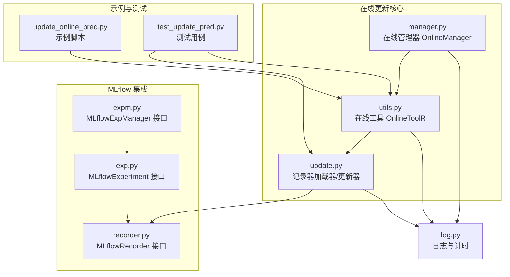
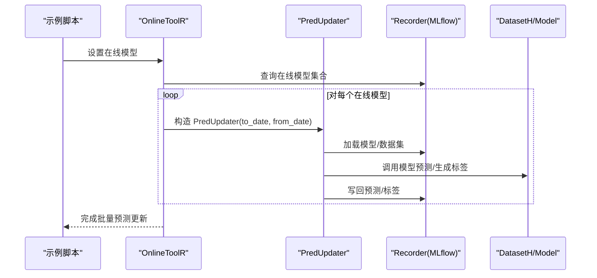
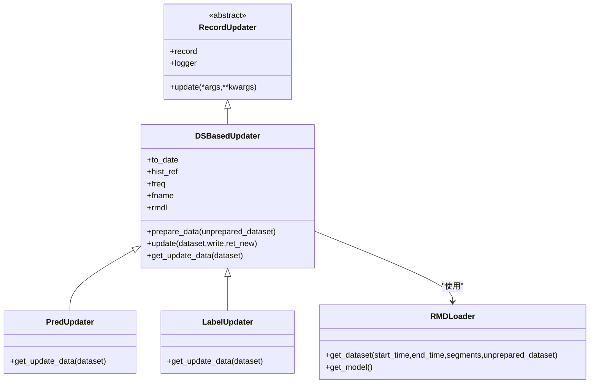
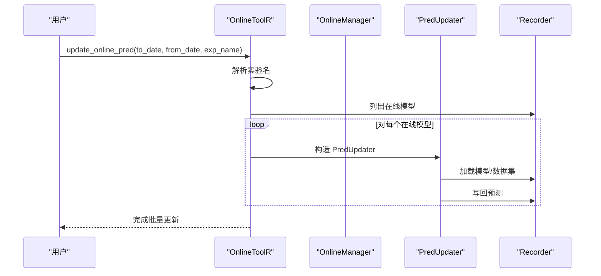
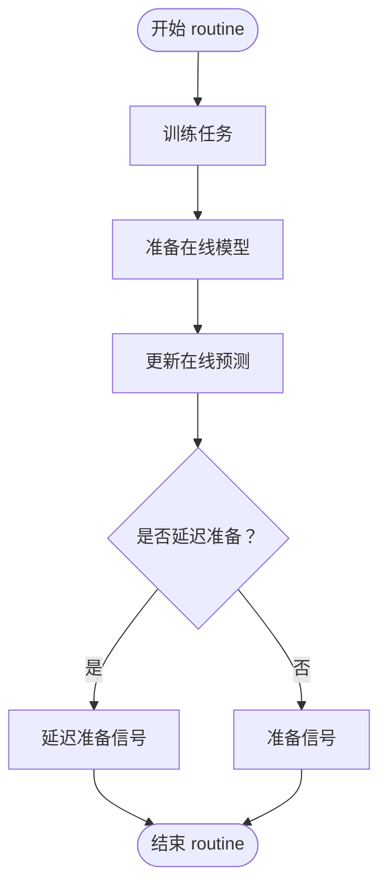
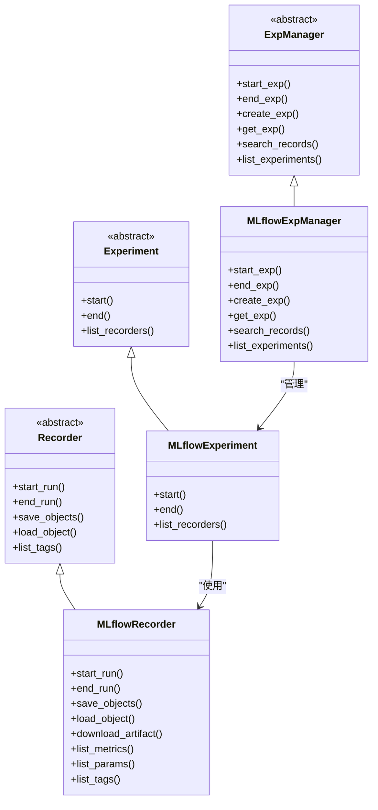
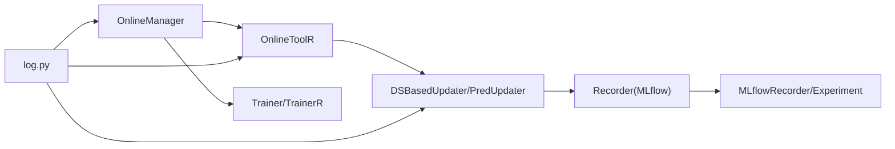

# 自动化更新

<cite>
**本文引用的文件列表**
- [update.py](file://qlib/workflow/online/update.py)
- [utils.py](file://qlib/workflow/online/utils.py)
- [manager.py](file://qlib/workflow/online/manager.py)
- [update_online_pred.py](file://examples/online_srv/update_online_pred.py)
- [recorder.py](file://qlib/workflow/recorder.py)
- [exp.py](file://qlib/workflow/exp.py)
- [expm.py](file://qlib/workflow/expm.py)
- [log.py](file://qlib/log.py)
- [test_update_pred.py](file://tests/rolling_tests/test_update_pred.py)
</cite>

## 目录
1. [简介](#简介)
2. [项目结构](#项目结构)
3. [核心组件](#核心组件)
4. [架构总览](#架构总览)
5. [详细组件分析](#详细组件分析)
6. [依赖关系分析](#依赖关系分析)
7. [性能考量](#性能考量)
8. [故障排查指南](#故障排查指南)
9. [结论](#结论)
10. [附录](#附录)

## 简介
本文件面向自动化模型更新系统，聚焦于RecordUpdater（在本代码库中以“基于记录器的更新器”实现）的工作流程，阐述其如何监听离线训练任务完成后触发在线模型更新；覆盖从模型验证、版本发布到预测服务重启的完整流水线；结合update_online_pred.py示例，解释如何配置更新任务的调度频率与依赖关系；并提供错误恢复机制、日志追踪方法以及与MLflow实验管理系统的集成方式。

## 项目结构
自动化更新相关的核心代码集中在workflow/online子模块，并通过示例脚本与MLflow实验管理对接：
- workflow/online/update.py：定义记录器加载器与数据集驱动的更新器基类及具体实现（预测更新器、标签更新器）
- workflow/online/utils.py：在线工具（OnlineToolR），负责在线模型标记、查询与批量预测更新
- workflow/online/manager.py：在线管理器，协调策略、训练器与更新流程，支持模拟与实时运行
- examples/online_srv/update_online_pred.py：示例脚本，演示首次训练后设置在线模型并更新在线预测
- workflow/recorder.py、workflow/exp.py、workflow/expm.py：MLflow记录器与实验管理接口
- log.py：日志与时间开销统计工具
- tests/rolling_tests/test_update_pred.py：滚动更新预测与标签的测试用例

图表来源
- [update.py](file://qlib/workflow/online/update.py#L1-L299)
- [utils.py](file://qlib/workflow/online/utils.py#L1-L188)
- [manager.py](file://qlib/workflow/online/manager.py#L1-L383)
- [update_online_pred.py](file://examples/online_srv/update_online_pred.py#L1-L55)
- [recorder.py](file://qlib/workflow/recorder.py#L83-L493)
- [exp.py](file://qlib/workflow/exp.py#L1-L274)
- [expm.py](file://qlib/workflow/expm.py#L1-L435)
- [log.py](file://qlib/log.py#L1-L263)
- [test_update_pred.py](file://tests/rolling_tests/test_update_pred.py#L1-L136)

章节来源
- [update.py](file://qlib/workflow/online/update.py#L1-L299)
- [utils.py](file://qlib/workflow/online/utils.py#L1-L188)
- [manager.py](file://qlib/workflow/online/manager.py#L1-L383)
- [update_online_pred.py](file://examples/online_srv/update_online_pred.py#L1-L55)
- [recorder.py](file://qlib/workflow/recorder.py#L83-L493)
- [exp.py](file://qlib/workflow/exp.py#L1-L274)
- [expm.py](file://qlib/workflow/expm.py#L1-L435)
- [log.py](file://qlib/log.py#L1-L263)
- [test_update_pred.py](file://tests/rolling_tests/test_update_pred.py#L1-L136)

## 核心组件
- 记录器加载器（RMDLoader）：从记录器加载数据集与模型参数，为更新器提供推理所需的数据与模型
- 数据集驱动更新器（DSBasedUpdater）：根据给定时间段准备数据集，调用模型进行预测或标签生成，并写回记录器
- 具体更新器
  - 预测更新器（PredUpdater）：对在线模型执行预测更新
  - 标签更新器（LabelUpdater）：基于SignalRecord生成标签并更新
- 在线工具（OnlineToolR）：管理在线模型标记、查询在线模型集合，并批量触发预测更新
- 在线管理器（OnlineManager）：编排策略、训练、在线模型选择与信号准备，按周期（如日）自动更新在线预测
- MLflow集成：通过MLflowRecorder/MLflowExperiment/MLflowExpManager实现实验与记录器的生命周期管理
- 日志与计时：统一的日志接口与时间开销统计，便于追踪与性能分析

章节来源
- [update.py](file://qlib/workflow/online/update.py#L1-L299)
- [utils.py](file://qlib/workflow/online/utils.py#L1-L188)
- [manager.py](file://qlib/workflow/online/manager.py#L1-L383)
- [recorder.py](file://qlib/workflow/recorder.py#L83-L493)
- [exp.py](file://qlib/workflow/exp.py#L1-L274)
- [expm.py](file://qlib/workflow/expm.py#L1-L435)
- [log.py](file://qlib/log.py#L1-L263)

## 架构总览
自动化更新系统围绕“记录器”作为数据与模型的载体，通过“在线工具”选择在线模型，再由“数据集驱动更新器”对预测或标签进行增量更新，最终写回到记录器。在线管理器负责周期性地触发这一流程，并可与MLflow实验管理对接，实现实验与记录器的全生命周期管理。

图表来源
- [update_online_pred.py](file://examples/online_srv/update_online_pred.py#L1-L55)
- [utils.py](file://qlib/workflow/online/utils.py#L159-L179)
- [update.py](file://qlib/workflow/online/update.py#L211-L249)
- [recorder.py](file://qlib/workflow/recorder.py#L397-L444)

## 详细组件分析

### 组件A：记录器加载器与数据集驱动更新器
- RMDLoader
  - 提供加载数据集与模型的方法，支持从记录器加载“dataset”与“params.pkl”
  - 支持按时间段配置数据集分段与setup_data
- DSBasedUpdater
  - 核心逻辑：计算历史依赖窗口、准备数据集、调用具体更新器方法、写回记录器
  - 支持to_date/from_date边界控制与最新日期裁剪
  - 历史依赖自动推断（针对TSDatasetH）
- PredUpdater
  - 使用模型进行预测，替换旧预测区间，写回pred.pkl
- LabelUpdater
  - 使用SignalRecord生成标签，替换旧标签区间，写回label.pkl

图表来源
- [update.py](file://qlib/workflow/online/update.py#L21-L299)

章节来源
- [update.py](file://qlib/workflow/online/update.py#L21-L299)

### 组件B：在线工具（OnlineToolR）
- 在线模型标记与查询：支持将模型标记为在线/离线，查询当前在线模型集合
- 批量预测更新：遍历在线模型，构造PredUpdater并执行更新，跳过缺失预测对象的记录器并记录警告
- 实验名解析：支持默认实验名与显式实验名

图表来源
- [utils.py](file://qlib/workflow/online/utils.py#L159-L179)
- [update.py](file://qlib/workflow/online/update.py#L211-L249)

章节来源
- [utils.py](file://qlib/workflow/online/utils.py#L1-L188)

### 组件C：在线管理器（OnlineManager）
- 生命周期：first_train（首次训练并准备在线模型）、routine（周期性流程：训练->准备在线模型->更新预测->准备信号）
- 模拟模式：simulate支持延迟训练与延迟准备信号，便于历史回测
- 信号准备：基于收集器合并各策略结果，生成交易信号序列

图表来源
- [manager.py](file://qlib/workflow/online/manager.py#L184-L229)

章节来源
- [manager.py](file://qlib/workflow/online/manager.py#L1-L383)

### 组件D：MLflow实验管理集成
- MLflowRecorder：封装MLflow客户端，提供start_run/end_run、保存/加载对象、下载制品等能力
- MLflowExperiment：封装MLflow实验，支持启动/结束记录器
- MLflowExpManager：封装MLflow实验管理器，支持创建/获取/删除实验、搜索记录、URI切换

图表来源
- [recorder.py](file://qlib/workflow/recorder.py#L83-L493)
- [exp.py](file://qlib/workflow/exp.py#L1-L274)
- [expm.py](file://qlib/workflow/expm.py#L1-L435)

章节来源
- [recorder.py](file://qlib/workflow/recorder.py#L83-L493)
- [exp.py](file://qlib/workflow/exp.py#L1-L274)
- [expm.py](file://qlib/workflow/expm.py#L1-L435)

### 组件E：示例脚本与调度频率
- 示例脚本update_online_pred.py展示了首次训练后将模型标记为在线，并调用在线工具更新预测
- 调度频率与依赖关系建议
  - 频率：每日更新一次预测，可在业务系统定时任务中调用update_online_pred
  - 依赖：确保离线训练任务完成后才触发在线预测更新；若使用延迟训练器，需在所有策略的任务准备完毕后再统一end_train
  - 依赖检查：在routine中先训练、再准备在线模型、最后更新预测，避免信号污染

章节来源
- [update_online_pred.py](file://examples/online_srv/update_online_pred.py#L1-L55)
- [manager.py](file://qlib/workflow/online/manager.py#L184-L229)

## 依赖关系分析
- 组件耦合
  - OnlineToolR依赖记录器接口与记录器加载器，用于在线模型标记与批量更新
  - DSBasedUpdater依赖记录器接口与数据集/模型，实现预测/标签更新
  - OnlineManager依赖策略、训练器与在线工具，形成完整的周期性更新流水线
- 外部依赖
  - MLflow：记录器与实验管理
  - 日历与数据访问：D.calendar用于时间边界与频率控制
  - 日志：统一日志接口与时间开销统计

图表来源
- [utils.py](file://qlib/workflow/online/utils.py#L159-L179)
- [update.py](file://qlib/workflow/online/update.py#L211-L249)
- [manager.py](file://qlib/workflow/online/manager.py#L184-L229)
- [recorder.py](file://qlib/workflow/recorder.py#L397-L444)
- [log.py](file://qlib/log.py#L1-L263)

章节来源
- [utils.py](file://qlib/workflow/online/utils.py#L1-L188)
- [update.py](file://qlib/workflow/online/update.py#L1-L299)
- [manager.py](file://qlib/workflow/online/manager.py#L1-L383)
- [recorder.py](file://qlib/workflow/recorder.py#L83-L493)
- [log.py](file://qlib/log.py#L1-L263)

## 性能考量
- 历史依赖窗口：自动推断TSDatasetH的step_len-1作为历史依赖长度，减少不必要的数据加载
- 数据替换策略：使用区间替换与去重合并，避免重复写入与索引冲突
- 异步日志：MLflowRecorder支持异步日志等待，保证end_run前完成异步队列
- 时间开销统计：TimeInspector提供统一的时间开销统计，便于定位瓶颈

章节来源
- [update.py](file://qlib/workflow/online/update.py#L180-L249)
- [recorder.py](file://qlib/workflow/recorder.py#L397-L444)
- [log.py](file://qlib/log.py#L86-L150)

## 故障排查指南
- 加载对象异常（LoadObjectError）
  - 现象：尝试加载pred.pkl失败时会跳过该记录器并记录警告
  - 处理：检查记录器中是否存在pred.pkl；确认模型训练阶段已正确记录
- 最新日期边界
  - 现象：to_date超过最新交易日时会被裁剪至最新日期
  - 处理：确保to_date不超过D.calendar[-1]；必要时使用from_date限定更新范围
- CUDA设备兼容问题
  - 现象：GPU上保存的模型在CPU实例上加载可能报错
  - 处理：在加载时指定map_location映射到CPU
- MLflow实验/记录器状态
  - 现象：实验不存在或已被删除
  - 处理：通过ExpManager创建/获取实验；确认URI与权限

章节来源
- [utils.py](file://qlib/workflow/online/utils.py#L169-L179)
- [update.py](file://qlib/workflow/online/update.py#L158-L179)
- [recorder.py](file://qlib/workflow/recorder.py#L413-L444)
- [expm.py](file://qlib/workflow/expm.py#L354-L435)
- [test_update_pred.py](file://tests/rolling_tests/test_update_pred.py#L1-L136)

## 结论
本自动化更新系统以记录器为核心载体，通过在线工具与数据集驱动更新器实现对在线模型预测与标签的增量更新；在线管理器提供周期性调度与信号准备能力；MLflow实验管理接口贯穿实验与记录器的全生命周期；日志与计时工具保障可观测性与性能分析。示例脚本与测试用例提供了可复用的实践路径，建议在生产环境中结合延迟训练器与信号延迟准备，确保更新流程的稳定性与一致性。

## 附录
- 关键流程参考路径
  - 在线预测更新入口：[update_online_pred.py](file://examples/online_srv/update_online_pred.py#L35-L45)
  - 批量更新实现：[utils.py](file://qlib/workflow/online/utils.py#L159-L179)
  - 更新器核心逻辑：[update.py](file://qlib/workflow/online/update.py#L211-L249)
  - MLflow记录器接口：[recorder.py](file://qlib/workflow/recorder.py#L397-L444)
  - 实验管理接口：[expm.py](file://qlib/workflow/expm.py#L318-L435)
  - 日志与计时：[log.py](file://qlib/log.py#L86-L150)
  - 测试用例（滚动更新）：[test_update_pred.py](file://tests/rolling_tests/test_update_pred.py#L1-L136)