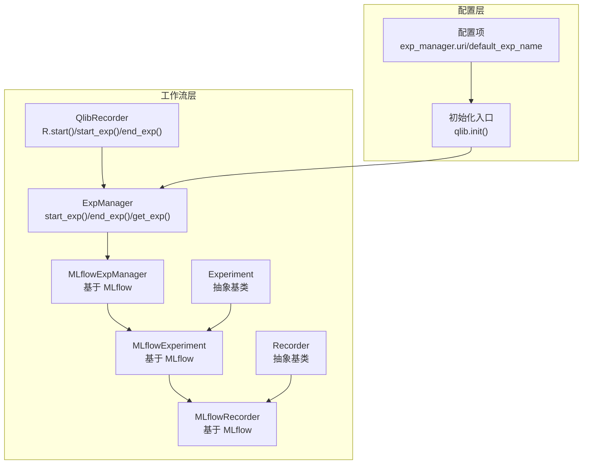
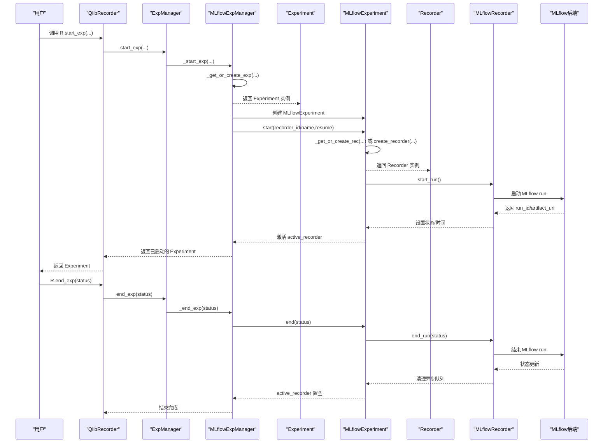
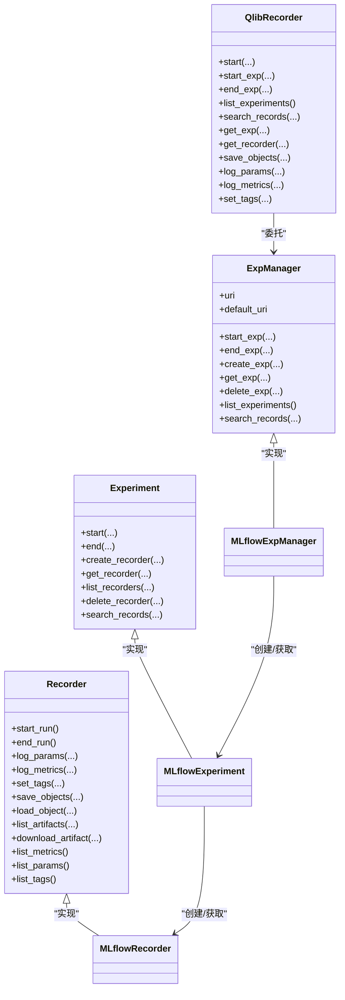
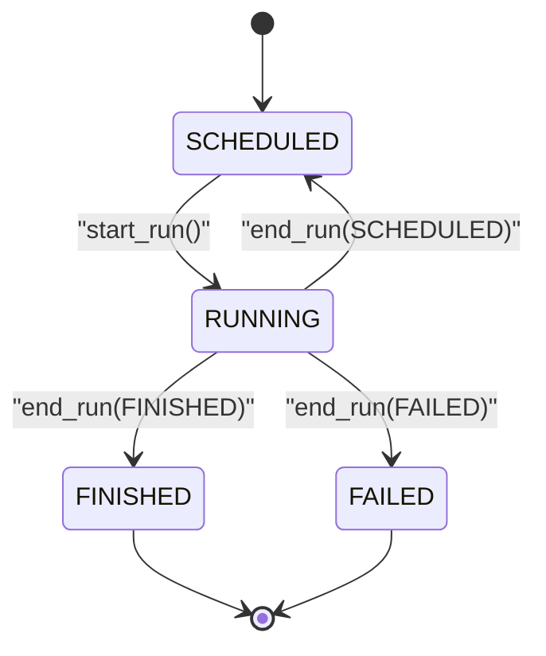

# 实验管理

<cite>
**本文引用的文件列表**
- [qlib/workflow/__init__.py](file://qlib/workflow/__init__.py)
- [qlib/workflow/expm.py](file://qlib/workflow/expm.py)
- [qlib/workflow/exp.py](file://qlib/workflow/exp.py)
- [qlib/workflow/recorder.py](file://qlib/workflow/recorder.py)
- [qlib/config.py](file://qlib/config.py)
- [qlib/__init__.py](file://qlib/__init__.py)
- [tests/dependency_tests/test_mlflow.py](file://tests/dependency_tests/test_mlflow.py)
- [examples/run_all_model.py](file://examples/run_all_model.py)
</cite>

## 目录
1. [简介](#简介)
2. [项目结构](#项目结构)
3. [核心组件](#核心组件)
4. [架构总览](#架构总览)
5. [详细组件分析](#详细组件分析)
6. [依赖关系分析](#依赖关系分析)
7. [性能考量](#性能考量)
8. [故障排查指南](#故障排查指南)
9. [结论](#结论)
10. [附录](#附录)

## 简介
本文件系统性梳理 Qlib 的实验管理（ExpManager）体系，重点围绕以下目标展开：
- 解释 QlibRecorder、Experiment 和 MLflowExperiment 的设计与交互
- 详述实验的创建、启动、终止与查询流程，覆盖 R.start_exp()、R.get_exp()、R.list_experiments() 等核心接口
- 阐明实验元数据的存储结构、生命周期管理以及与 MLflow 后端的集成机制
- 提供实验状态转换图与异常处理策略，并说明如何通过 search_records 进行实验结果检索

## 项目结构
实验管理相关代码主要位于 workflow 子模块中，配合全局配置与初始化入口，形成“记录器包装器 + 实验管理器 + 实验 + 记录器”的分层架构。

图表来源
- [qlib/workflow/__init__.py](file://qlib/workflow/__init__.py#L1-L120)
- [qlib/workflow/expm.py](file://qlib/workflow/expm.py#L1-L120)
- [qlib/workflow/exp.py](file://qlib/workflow/exp.py#L1-L60)
- [qlib/workflow/recorder.py](file://qlib/workflow/recorder.py#L1-L60)
- [qlib/config.py](file://qlib/config.py#L33-L52)
- [qlib/__init__.py](file://qlib/__init__.py#L259-L296)

章节来源
- [qlib/workflow/__init__.py](file://qlib/workflow/__init__.py#L1-L120)
- [qlib/workflow/expm.py](file://qlib/workflow/expm.py#L1-L120)
- [qlib/workflow/exp.py](file://qlib/workflow/exp.py#L1-L60)
- [qlib/workflow/recorder.py](file://qlib/workflow/recorder.py#L1-L60)
- [qlib/config.py](file://qlib/config.py#L33-L52)
- [qlib/__init__.py](file://qlib/__init__.py#L259-L296)

## 核心组件
- QlibRecorder：面向用户的高层封装，提供 start/start_exp/end_exp/list_experiments/search_records 等便捷接口；内部委托给 ExpManager 完成具体操作。
- ExpManager：实验管理器抽象基类，定义实验的创建、启动、结束、查询等通用接口；支持多后端（当前以 MLflow 为主）。
- MLflowExpManager：ExpManager 的 MLflow 实现，负责与 MLflow 后端交互，创建/获取实验、搜索运行记录等。
- Experiment：实验抽象基类，定义实验的生命周期与记录器管理；MLflowExperiment 为其 MLflow 实现。
- Recorder：记录器抽象基类，定义参数、指标、标签、制品等日志与持久化接口；MLflowRecorder 为其 MLflow 实现。

章节来源
- [qlib/workflow/__init__.py](file://qlib/workflow/__init__.py#L26-L120)
- [qlib/workflow/expm.py](file://qlib/workflow/expm.py#L22-L120)
- [qlib/workflow/exp.py](file://qlib/workflow/exp.py#L14-L60)
- [qlib/workflow/recorder.py](file://qlib/workflow/recorder.py#L28-L60)

## 架构总览
下图展示从用户调用到 MLflow 后端的完整调用链路与职责划分。

图表来源
- [qlib/workflow/__init__.py](file://qlib/workflow/__init__.py#L97-L164)
- [qlib/workflow/expm.py](file://qlib/workflow/expm.py#L318-L365)
- [qlib/workflow/exp.py](file://qlib/workflow/exp.py#L243-L380)
- [qlib/workflow/recorder.py](file://qlib/workflow/recorder.py#L335-L396)

章节来源
- [qlib/workflow/__init__.py](file://qlib/workflow/__init__.py#L97-L164)
- [qlib/workflow/expm.py](file://qlib/workflow/expm.py#L318-L365)
- [qlib/workflow/exp.py](file://qlib/workflow/exp.py#L243-L380)
- [qlib/workflow/recorder.py](file://qlib/workflow/recorder.py#L335-L396)

## 详细组件分析

### QlibRecorder（高层记录器包装）
- 职责
  - 提供 start/start_exp/end_exp/list_experiments/search_records 等高层 API
  - 在 with 上下文中自动处理异常并设置记录器状态为 FAILED
  - 将用户请求委派给底层 ExpManager
- 关键接口
  - start(...)/start_exp(...)/end_exp(...): 生命周期控制
  - search_records(...): 查询实验记录（DataFrame）
  - list_experiments(): 列举实验
  - get_exp(...): 获取或创建实验
  - get_recorder(...)/list_recorders(...): 获取记录器与列举记录器
  - save_objects/load_object/log_params/log_metrics/set_tags 等便捷方法
- 异常处理
  - with 上下文内捕获异常并调用 end_exp(FAILED)，确保实验状态一致性

章节来源
- [qlib/workflow/__init__.py](file://qlib/workflow/__init__.py#L26-L120)
- [qlib/workflow/__init__.py](file://qlib/workflow/__init__.py#L120-L213)
- [qlib/workflow/__init__.py](file://qlib/workflow/__init__.py#L214-L324)
- [qlib/workflow/__init__.py](file://qlib/workflow/__init__.py#L325-L480)
- [qlib/workflow/__init__.py](file://qlib/workflow/__init__.py#L481-L682)

### ExpManager（实验管理器抽象）
- 职责
  - 维护默认 URI 与当前活动实验 URI 的切换
  - 提供 get_exp/create_exp/delete_exp/list_experiments 等通用接口
  - 通过子类实现具体后端逻辑（如 MLflow）
- 关键点
  - default_uri 与 uri 属性：优先使用当前活动 URI，否则回退到默认 URI
  - _get_or_create_exp：在文件方案下使用文件锁避免并发冲突；对其他方案二次校验避免重复创建
  - search_records：统一查询接口，由子类实现

章节来源
- [qlib/workflow/expm.py](file://qlib/workflow/expm.py#L22-L120)
- [qlib/workflow/expm.py](file://qlib/workflow/expm.py#L120-L217)
- [qlib/workflow/expm.py](file://qlib/workflow/expm.py#L218-L317)

### MLflowExpManager（MLflow 实现）
- 职责
  - 基于 MLflow 客户端创建/获取实验、删除实验、列举实验
  - 在启动实验时创建/激活 MLflowExperiment，并启动其 Recorder
  - 实现 search_records，委托 MLflow 客户端搜索运行
- 关键点
  - _client 属性按需创建，避免缓存带来的维护成本
  - create_exp：捕获资源已存在错误并抛出自定义异常
  - list_experiments：兼容 MLflow 版本差异（>=2 使用 search_experiments）

章节来源
- [qlib/workflow/expm.py](file://qlib/workflow/expm.py#L318-L435)
- [tests/dependency_tests/test_mlflow.py](file://tests/dependency_tests/test_mlflow.py#L18-L35)

### Experiment（实验抽象）
- 职责
  - 定义实验生命周期：start/end、创建/获取记录器、列举记录器、删除记录器、搜索记录
  - 维护 active_recorder，保证同一时刻仅有一个活跃记录器
- 关键点
  - get_recorder：支持根据 id/name 获取或创建记录器；可选择自动启动
  - list_recorders：支持字典或列表返回类型
  - search_records：由子类实现（如 MLflowExperiment）

章节来源
- [qlib/workflow/exp.py](file://qlib/workflow/exp.py#L14-L120)
- [qlib/workflow/exp.py](file://qlib/workflow/exp.py#L120-L241)

### MLflowExperiment（MLflow 实现）
- 职责
  - 基于 MLflow 客户端管理实验：创建/获取/删除实验、搜索运行、列举记录器
  - 启动/结束实验时与 Recorder 协作
- 关键点
  - start：根据 resume 参数决定复用已有记录器或新建
  - _get_recorder：按 id/name 获取记录器；name 需唯一，否则警告并返回最新
  - list_recorders：支持按状态过滤与最大结果数限制
  - search_records：直接委托 MLflow 客户端 search_runs

章节来源
- [qlib/workflow/exp.py](file://qlib/workflow/exp.py#L243-L380)

### Recorder（记录器抽象）
- 职责
  - 定义参数、指标、标签、制品等日志接口
  - 维护记录器状态（SCHEDULED/RUNNING/FINISHED/FAILED）
- 关键点
  - 抽象方法需由子类实现（如 MLflowRecorder）

章节来源
- [qlib/workflow/recorder.py](file://qlib/workflow/recorder.py#L28-L60)

### MLflowRecorder（MLflow 实现）
- 职责
  - 基于 MLflow 客户端进行参数/指标/标签/制品的记录与查询
  - 自动记录未提交代码、必要环境变量等信息
  - 支持对象序列化/反序列化保存与加载
- 关键点
  - start_run：设置跟踪 URI、启动 run、记录命令与环境变量、开启异步日志
  - end_run：等待异步队列、设置结束时间与状态、调用 MLflow 结束 run
  - save_objects/load_object：支持本地路径或直接传入对象
  - list_*：查询参数/指标/标签

章节来源
- [qlib/workflow/recorder.py](file://qlib/workflow/recorder.py#L247-L494)

## 依赖关系分析
- 组件耦合
  - QlibRecorder 依赖 ExpManager；ExpManager 依赖 Experiment；MLflowExpManager 继承 ExpManager；MLflowExperiment 继承 Experiment；MLflowRecorder 继承 Recorder
- 外部依赖
  - MLflow 客户端用于实验与运行的创建、查询、删除
  - 文件锁用于文件型后端的并发安全
- 可能的循环依赖
  - 当前文件组织避免了循环导入；各模块职责清晰，通过实例传递而非直接 import 类型

图表来源
- [qlib/workflow/__init__.py](file://qlib/workflow/__init__.py#L26-L120)
- [qlib/workflow/expm.py](file://qlib/workflow/expm.py#L22-L120)
- [qlib/workflow/exp.py](file://qlib/workflow/exp.py#L14-L60)
- [qlib/workflow/recorder.py](file://qlib/workflow/recorder.py#L28-L60)

章节来源
- [qlib/workflow/__init__.py](file://qlib/workflow/__init__.py#L26-L120)
- [qlib/workflow/expm.py](file://qlib/workflow/expm.py#L22-L120)
- [qlib/workflow/exp.py](file://qlib/workflow/exp.py#L14-L60)
- [qlib/workflow/recorder.py](file://qlib/workflow/recorder.py#L28-L60)

## 性能考量
- 异步日志
  - MLflowRecorder 在启动时启用异步日志队列，减少网络写入阻塞；结束时等待队列清空，确保数据落盘
- 客户端创建
  - MLflowExpManager 的 _client 属性按需创建，避免缓存带来的状态不一致问题
- 并发安全
  - 文件型后端使用文件锁避免多进程同时创建实验导致冲突
- 结果集限制
  - MLflowExperiment.list_recorders 对结果数量有限制（UNLIMITED），避免一次性拉取过多数据

章节来源
- [qlib/workflow/recorder.py](file://qlib/workflow/recorder.py#L335-L396)
- [qlib/workflow/expm.py](file://qlib/workflow/expm.py#L318-L365)
- [tests/dependency_tests/test_mlflow.py](file://tests/dependency_tests/test_mlflow.py#L18-L35)
- [qlib/workflow/exp.py](file://qlib/workflow/exp.py#L340-L380)

## 故障排查指南
- 常见异常与定位
  - 实验不存在：get_exp/_get_exp 抛出 ValueError，提示输入的 id/name 不正确
  - 记录器不存在：get_recorder 抛出 ValueError，提示输入的 id/name 不正确
  - 删除失败：delete_exp/delete_recorder 捕获 MLflow 异常并抛出带上下文的错误信息
  - 并发冲突：文件型后端使用文件锁避免重复创建实验
- 排查步骤
  - 确认 exp_manager.uri 是否正确指向 MLflow 目标位置
  - 使用 R.list_experiments() 与 exp.list_recorders() 核对实验/记录器是否存在
  - 使用 R.search_records() 检索运行记录，确认 filter_string/order_by/max_results 配置是否合理
  - 若出现 FAILED 状态，检查 with 上下文是否提前异常退出

章节来源
- [qlib/workflow/expm.py](file://qlib/workflow/expm.py#L366-L435)
- [qlib/workflow/exp.py](file://qlib/workflow/exp.py#L287-L380)
- [qlib/workflow/recorder.py](file://qlib/workflow/recorder.py#L380-L396)

## 结论
Qlib 的实验管理以 QlibRecorder 为入口，通过 ExpManager/Experiment/Recorder 的分层设计，结合 MLflow 后端实现了完整的实验生命周期管理。该体系具备良好的扩展性与可观测性，既满足本地文件型后端的简单部署，也支持分布式场景下的并发安全与状态一致性。通过 R.start_exp()/R.get_exp()/R.list_experiments() 等高层 API，用户可以快速完成实验的创建、启动、终止与查询，并借助 search_records 实现灵活的结果检索。

## 附录

### 实验状态转换图

图表来源
- [qlib/workflow/recorder.py](file://qlib/workflow/recorder.py#L28-L60)
- [qlib/workflow/recorder.py](file://qlib/workflow/recorder.py#L335-L396)

### R.start_exp()/R.get_exp()/R.list_experiments() 使用要点
- R.start_exp(...)
  - 适合需要手动控制实验生命周期的场景；结束后需手动调用 R.end_exp(...)
- R.start(...)
  - 适合 with 上下文；异常自动标记为 FAILED，无需手动 end_exp
- R.get_exp(experiment_id/name, create=True/False, start=True/False)
  - create=True：找不到则自动创建；start=True：创建后自动启动
  - create=False：找不到直接报错
- R.list_experiments()
  - 列举所有未删除的实验（MLflow 后端）

章节来源
- [qlib/workflow/__init__.py](file://qlib/workflow/__init__.py#L97-L164)
- [qlib/workflow/__init__.py](file://qlib/workflow/__init__.py#L200-L241)
- [qlib/workflow/__init__.py](file://qlib/workflow/__init__.py#L242-L324)

### 实验元数据存储结构与生命周期
- 元数据存储
  - 实验与记录器在 MLflow 中以实验/运行的形式存储；参数、指标、标签、制品均通过 MLflow 客户端记录
- 生命周期
  - 实验：创建/启动（激活 Recorder）/结束（设置状态）
  - 记录器：创建/启动（启动 MLflow run）/记录日志/下载制品/结束（结束 MLflow run）
- 默认实验
  - 通过配置项 default_exp_name 指定，默认实验名称可在初始化时设置

章节来源
- [qlib/config.py](file://qlib/config.py#L33-L52)
- [qlib/__init__.py](file://qlib/__init__.py#L259-L296)
- [qlib/workflow/exp.py](file://qlib/workflow/exp.py#L243-L380)
- [qlib/workflow/recorder.py](file://qlib/workflow/recorder.py#L335-L396)

### 与 MLflow 后端的集成机制
- ExpManager.uri 与默认 URI
  - 默认从配置读取；若 start_exp 显式传入 uri，则临时覆盖当前活动实验 URI
- MLflow 客户端
  - MLflowExpManager._client 按需创建；MLflowExperiment/MLflowRecorder 内部持有 MlflowClient
- 搜索与过滤
  - search_records 支持 filter_string、run_view_type、max_results、order_by 等参数

章节来源
- [qlib/workflow/expm.py](file://qlib/workflow/expm.py#L283-L317)
- [qlib/workflow/expm.py](file://qlib/workflow/expm.py#L399-L405)
- [qlib/workflow/exp.py](file://qlib/workflow/exp.py#L317-L324)

### 通过 search_records 检索实验结果
- 使用方式
  - R.search_records(experiment_ids, filter_string, run_view_type, max_results, order_by)
  - 返回 DataFrame，包含 metrics.*、params.*、tags.* 列
- 示例参考
  - 文档与示例中展示了如何按指标排序与筛选

章节来源
- [qlib/workflow/__init__.py](file://qlib/workflow/__init__.py#L165-L199)
- [qlib/workflow/expm.py](file://qlib/workflow/expm.py#L399-L405)
- [examples/run_all_model.py](file://examples/run_all_model.py#L133-L160)