# 工作流API

<cite>
**本文档中引用的文件**   
- [__init__.py](file://qlib/workflow/__init__.py)
- [exp.py](file://qlib/workflow/exp.py)
- [recorder.py](file://qlib/workflow/recorder.py)
- [expm.py](file://qlib/workflow/expm.py)
- [gen.py](file://qlib/workflow/task/gen.py)
- [collect.py](file://qlib/workflow/task/collect.py)
- [manage.py](file://qlib/workflow/task/manage.py)
- [record_temp.py](file://qlib/workflow/record_temp.py)
- [manager.py](file://qlib/workflow/online/manager.py)
- [strategy.py](file://qlib/workflow/online/strategy.py)
- [update.py](file://qlib/workflow/online/update.py)
- [utils.py](file://qlib/workflow/online/utils.py)
</cite>

## 目录
1. [简介](#简介)
2. [核心组件](#核心组件)
3. [实验管理API](#实验管理api)
4. [任务生成与收集](#任务生成与收集)
5. [在线服务更新机制](#在线服务更新机制)
6. [元数据存储结构](#元数据存储结构)
7. [结论](#结论)

## 简介
工作流管理API是QLib框架的核心组件，提供了一套完整的实验管理和任务调度系统。该API基于MLflow设计，但提供了更丰富的功能和更好的用户体验。系统主要由实验管理（ExpManager）、实验记录（Recorder）、任务调度（TaskManager）和在线服务更新（RecordUpdater）等核心组件构成。

API设计的核心理念是通过记录（Recorder）对象提供直观的接口，而不是像MLflow那样频繁使用run_id。这使得接口如log、start等更加直观易用。同时，系统提供了比MLflow原生功能更丰富的特性，如在运行开始时记录代码差异、直接序列化Python对象等。

**Section sources**
- [__init__.py](file://qlib/workflow/__init__.py#L4-L15)

## 核心组件

工作流管理API由多个核心组件构成，每个组件都有明确的职责和功能。系统采用分层架构，从顶层的全局记录器（QlibRecorder）到底层的实验管理器（ExpManager）和记录器（Recorder），形成了完整的实验管理生态系统。

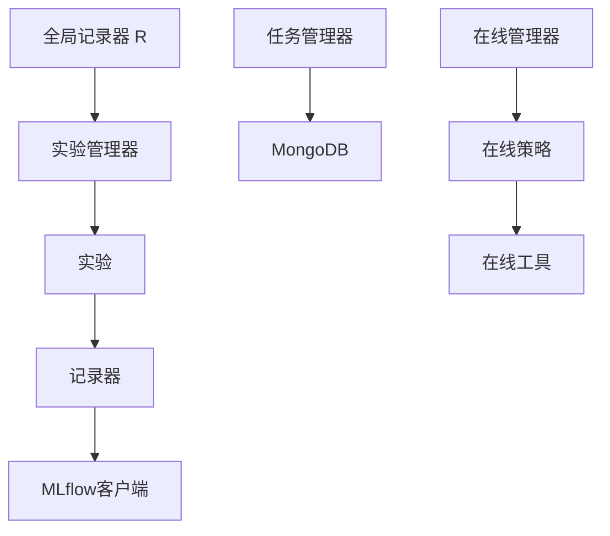

**Diagram sources **
- [__init__.py](file://qlib/workflow/__init__.py)
- [expm.py](file://qlib/workflow/expm.py)
- [exp.py](file://qlib/workflow/exp.py)
- [recorder.py](file://qlib/workflow/recorder.py)

**Section sources**
- [__init__.py](file://qlib/workflow/__init__.py#L26-L682)
- [expm.py](file://qlib/workflow/expm.py#L23-L435)
- [exp.py](file://qlib/workflow/exp.py#L15-L380)
- [recorder.py](file://qlib/workflow/recorder.py#L28-L494)

## 实验管理API

实验管理API提供了完整的实验生命周期管理功能，包括实验的创建、启动、结束和查询。核心接口通过全局记录器R提供，用户可以通过R对象直接访问所有功能。

### R.start_exp()接口
`R.start_exp()`是启动实验的核心方法，它允许用户以编程方式启动一个实验。该方法接受多个参数来指定实验和记录器的属性：

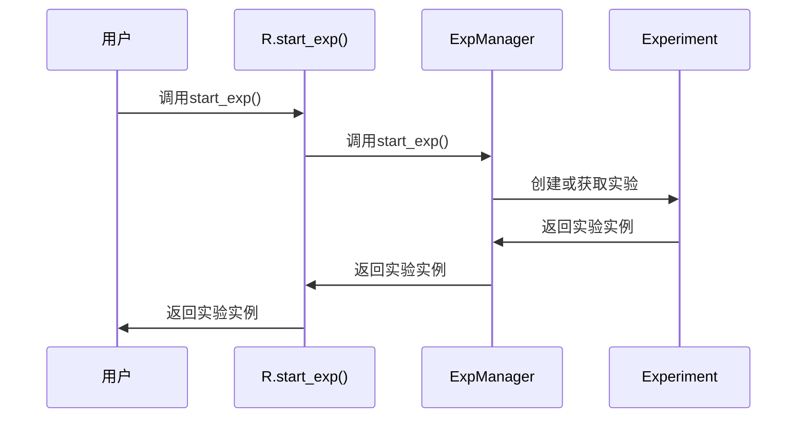

**Diagram sources **
- [__init__.py](file://qlib/workflow/__init__.py#L97-L145)
- [expm.py](file://qlib/workflow/expm.py#L47-L93)

该方法的主要参数包括：
- **experiment_id**: 实验的ID
- **experiment_name**: 实验的名称
- **recorder_id**: 记录器的ID
- **recorder_name**: 记录器的名称
- **uri**: 实验的跟踪URI
- **resume**: 是否恢复特定的记录器

### R.get_recorder()接口
`R.get_recorder()`用于获取特定的记录器实例，这是进行实验记录操作的关键入口。该方法的使用逻辑如下：

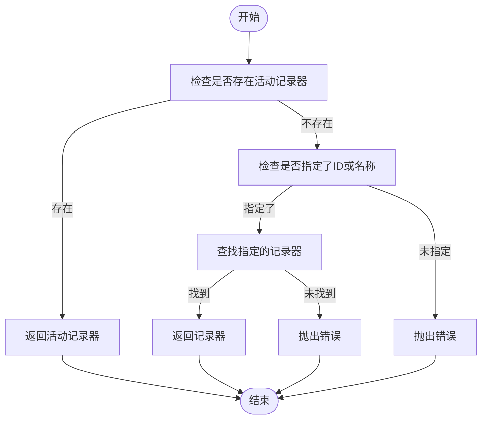

**Diagram sources **
- [__init__.py](file://qlib/workflow/__init__.py#L392-L459)

记录器的状态包括：
- **SCHEDULED**: 已调度
- **RUNNING**: 运行中
- **FINISHED**: 已完成
- **FAILED**: 失败

### 实验生命周期管理
实验的生命周期管理涉及多个状态转换，从创建到结束的完整流程如下：

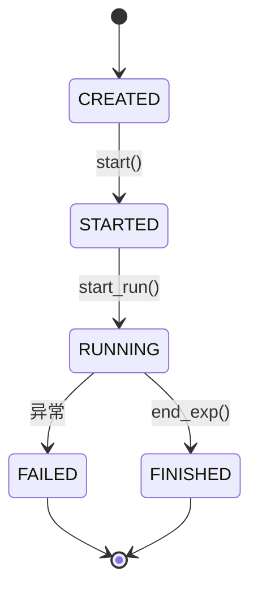

**Diagram sources **
- [__init__.py](file://qlib/workflow/__init__.py)
- [exp.py](file://qlib/workflow/exp.py)

**Section sources**
- [__init__.py](file://qlib/workflow/__init__.py#L37-L163)
- [exp.py](file://qlib/workflow/exp.py#L44-L73)
- [expm.py](file://qlib/workflow/expm.py#L95-L117)

## 任务生成与收集

任务生成与收集系统是工作流管理API的重要组成部分，它提供了灵活的任务生成和结果收集机制。

### TaskGen任务生成器
`TaskGen`是任务生成的基础类，通过继承该类可以实现各种任务生成策略。`RollingGen`是其中一个具体的实现，用于生成滚动任务：

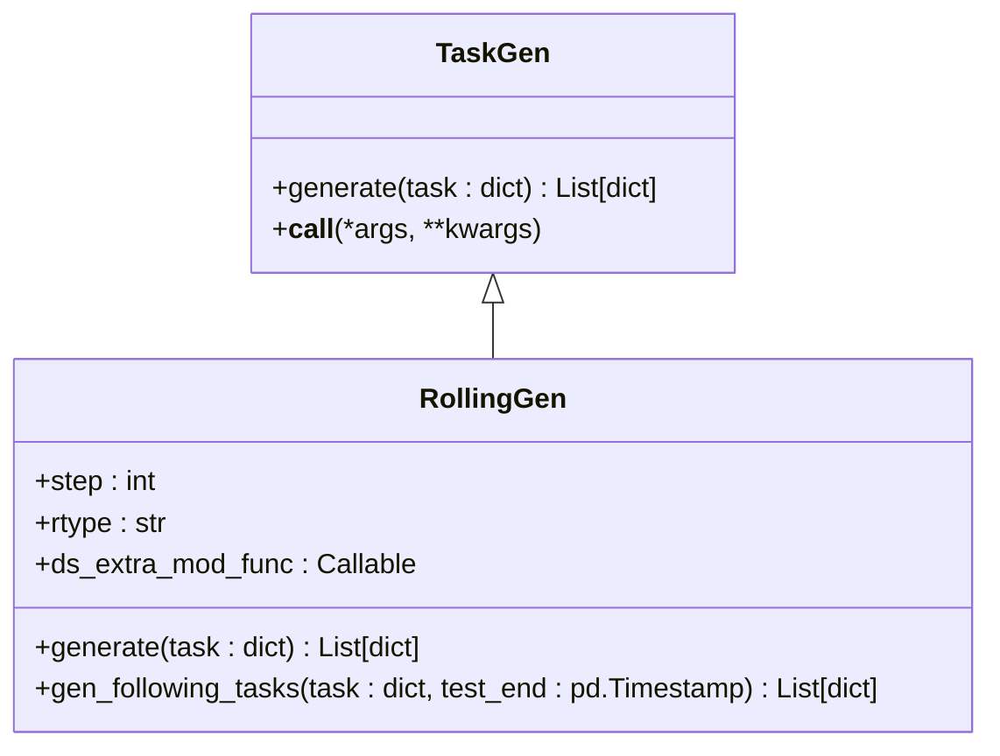

**Diagram sources **
- [gen.py](file://qlib/workflow/task/gen.py#L52-L141)

`RollingGen`支持两种滚动类型：
- **ROLL_EX**: 固定起始日期，扩展结束日期
- **ROLL_SD**: 固定时间段大小，从起始日期滑动

### Collector结果收集器
`Collector`系统提供了灵活的结果收集机制，支持多种收集策略：

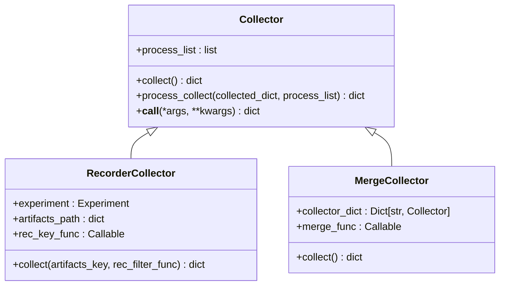

**Diagram sources **
- [collect.py](file://qlib/workflow/task/collect.py#L19-L136)

`RecorderCollector`可以从指定的实验中收集记录器的结果，而`MergeCollector`可以合并多个收集器的结果。

### TaskManager任务管理器
`TaskManager`提供了任务的生命周期管理，确保每个任务只被使用一次：

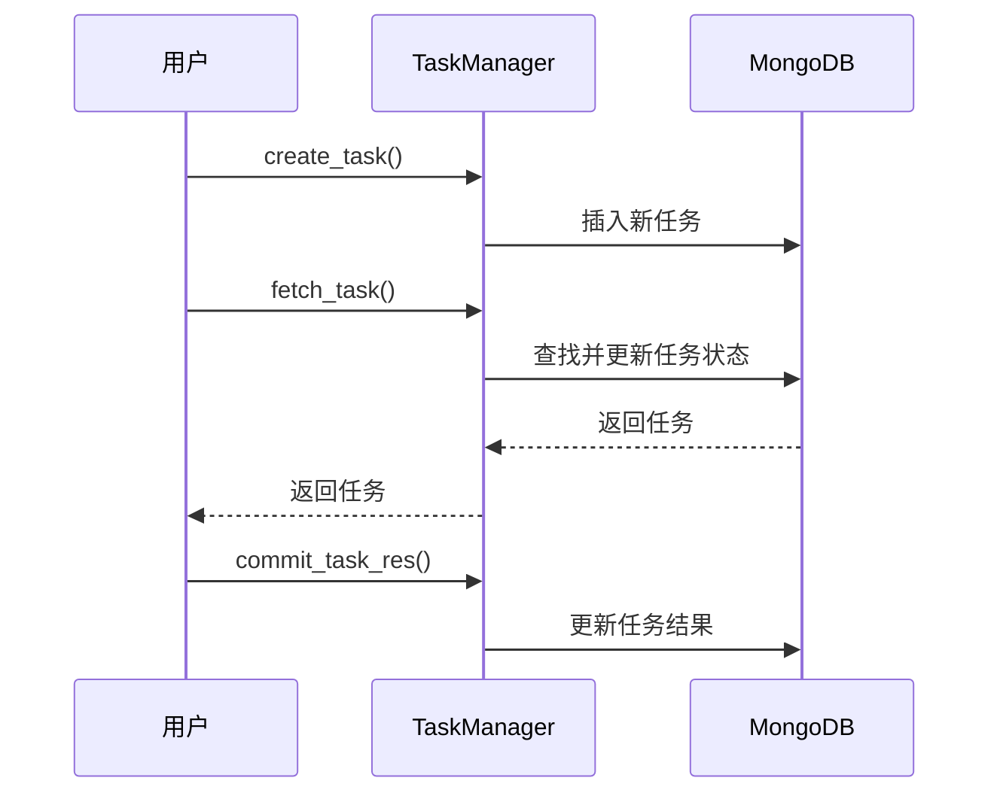

**Diagram sources **
- [manage.py](file://qlib/workflow/task/manage.py#L33-L557)

任务管理器支持以下状态：
- **STATUS_WAITING**: 等待训练
- **STATUS_RUNNING**: 训练中
- **STATUS_DONE**: 已完成
- **STATUS_PART_DONE**: 部分完成

**Section sources**
- [gen.py](file://qlib/workflow/task/gen.py#L1-L352)
- [collect.py](file://qlib/workflow/task/collect.py#L1-L259)
- [manage.py](file://qlib/workflow/task/manage.py#L1-L557)

## 在线服务更新机制

在线服务更新机制为实时交易系统提供了必要的支持，包括在线策略管理、模型更新和预测更新等功能。

### OnlineManager在线管理器
`OnlineManager`是在线服务的核心组件，负责管理在线策略和模型：

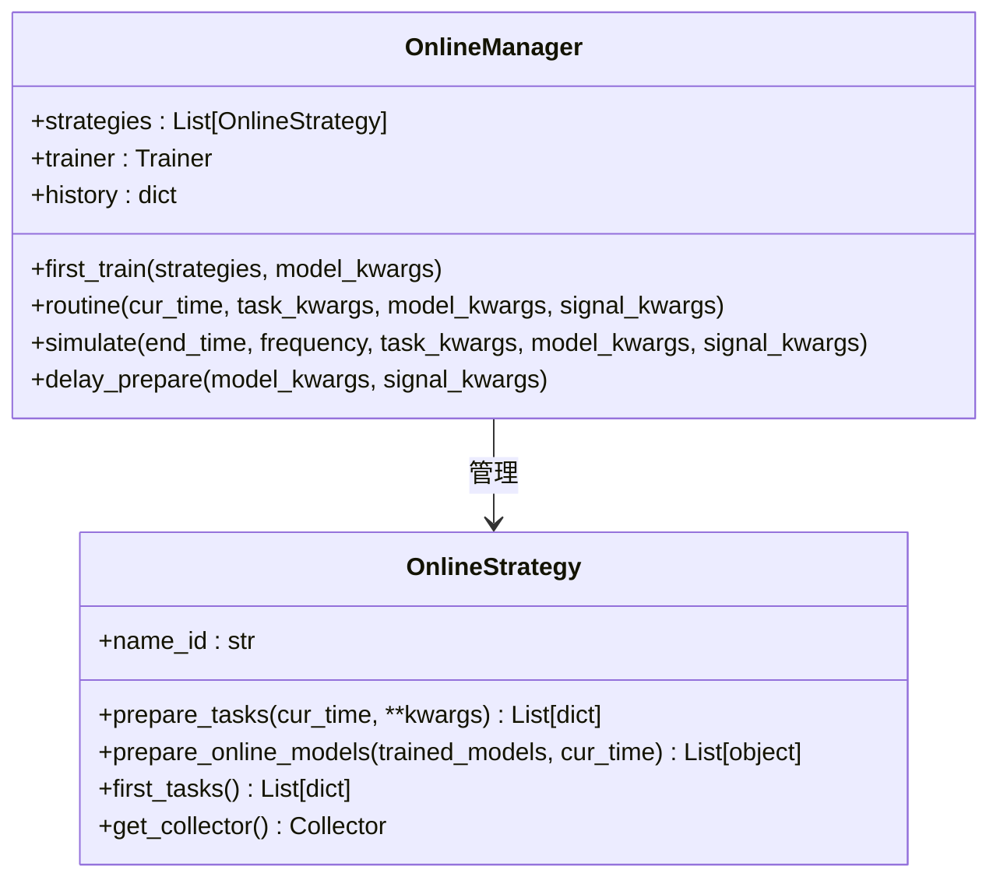

**Diagram sources **
- [manager.py](file://qlib/workflow/online/manager.py#L101-L383)
- [strategy.py](file://qlib/workflow/online/strategy.py#L19-L92)

### RollingStrategy滚动策略
`RollingStrategy`是`OnlineStrategy`的一个具体实现，用于实现滚动更新策略：

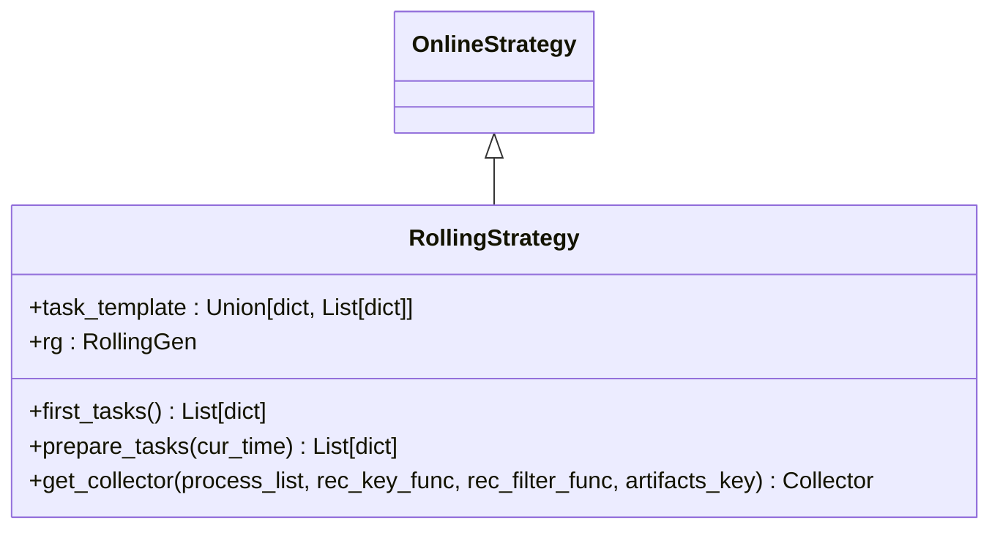

**Diagram sources **
- [strategy.py](file://qlib/workflow/online/strategy.py#L92-L209)

### RecordUpdater记录更新器
`RecordUpdater`系统提供了在线更新预测和标签的功能：

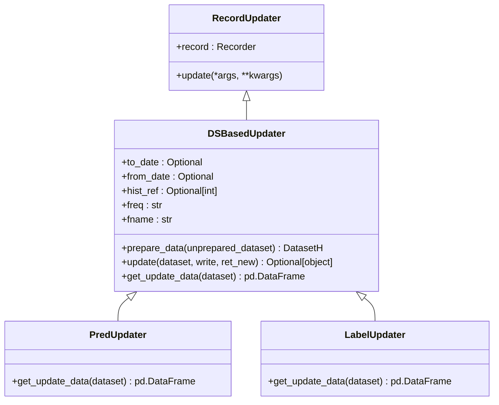

**Diagram sources **
- [update.py](file://qlib/workflow/online/update.py#L66-L299)

`PredUpdater`和`LabelUpdater`分别用于更新预测和标签数据，确保在线服务的数据始终保持最新。

### OnlineTool在线工具
`OnlineTool`系统用于管理在线模型的状态：

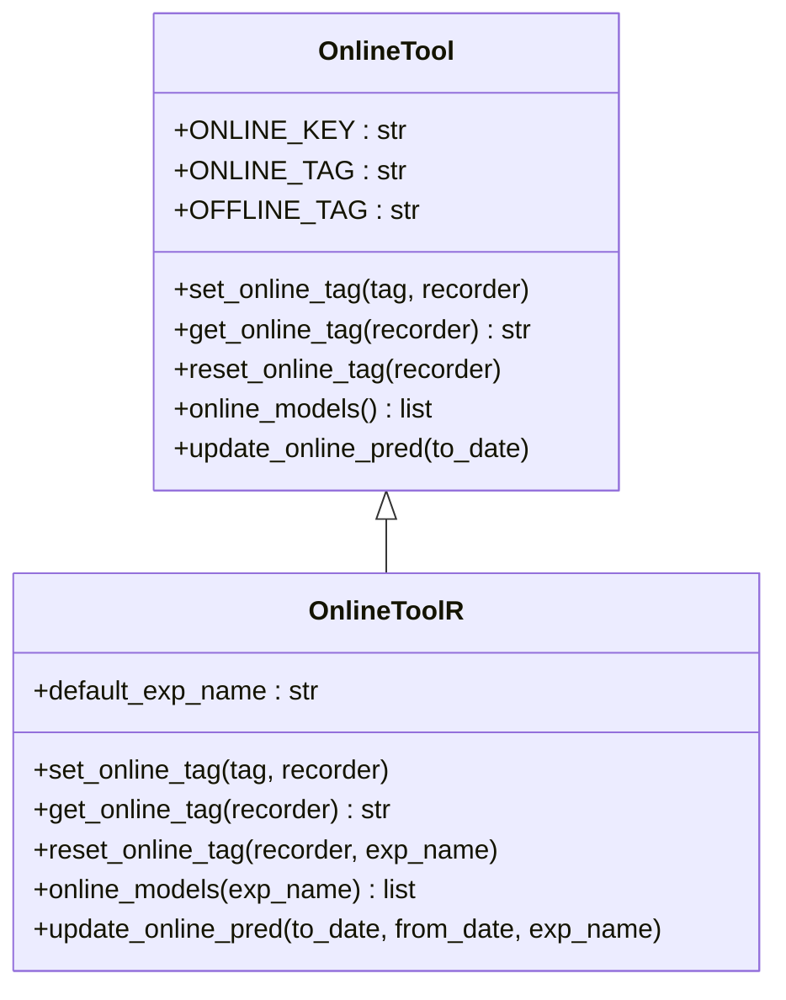

**Diagram sources **
- [utils.py](file://qlib/workflow/online/utils.py#L19-L188)

**Section sources**
- [manager.py](file://qlib/workflow/online/manager.py#L101-L383)
- [strategy.py](file://qlib/workflow/online/strategy.py#L19-L209)
- [update.py](file://qlib/workflow/online/update.py#L66-L299)
- [utils.py](file://qlib/workflow/online/utils.py#L19-L188)

## 元数据存储结构

工作流管理API的元数据存储结构设计合理，支持高效的查询和管理。

### 实验元数据结构
实验元数据包含以下关键字段：

| 字段名 | 类型 | 描述 |
|-------|------|------|
| id | str | 实验的唯一标识符 |
| name | str | 实验名称 |
| active_recorder | str | 活动记录器的ID |
| recorders | list | 所有记录器的ID列表 |

**Section sources**
- [exp.py](file://qlib/workflow/exp.py#L33-L42)

### 记录器元数据结构
记录器元数据包含详细的运行信息：

| 字段名 | 类型 | 描述 |
|-------|------|------|
| id | str | 记录器的唯一标识符 |
| name | str | 记录器名称 |
| experiment_id | str | 所属实验的ID |
| start_time | datetime | 开始时间 |
| end_time | datetime | 结束时间 |
| status | str | 状态（SCHEDULED, RUNNING, FINISHED, FAILED） |

**Section sources**
- [recorder.py](file://qlib/workflow/recorder.py#L60-L69)

### 任务元数据结构
任务管理器中的任务元数据结构：

| 字段名 | 类型 | 描述 |
|-------|------|------|
| def | Binary | 序列化的任务定义 |
| filter | dict | 用于过滤任务的JSON-like数据 |
| status | str | 任务状态（waiting, running, done, part_done） |
| res | Binary | 序列化的任务结果 |

**Section sources**
- [manage.py](file://qlib/workflow/task/manage.py#L41-L46)

## 结论
工作流管理API提供了一套完整、灵活且易于使用的实验管理和任务调度系统。通过R对象提供的高层接口，用户可以轻松地管理实验的整个生命周期，从创建、运行到结果收集和分析。

系统的核心优势包括：
1. **直观的API设计**：通过记录器对象提供直观的接口，避免了频繁使用run_id的复杂性
2. **丰富的功能**：支持代码差异记录、对象直接序列化等高级功能
3. **灵活的任务管理**：通过TaskGen和Collector系统提供灵活的任务生成和结果收集机制
4. **强大的在线服务支持**：通过OnlineManager和相关组件提供完整的在线服务更新机制

该API的设计既保持了与MLflow的兼容性，又提供了更丰富的功能和更好的用户体验，是量化研究和交易系统开发的理想选择。