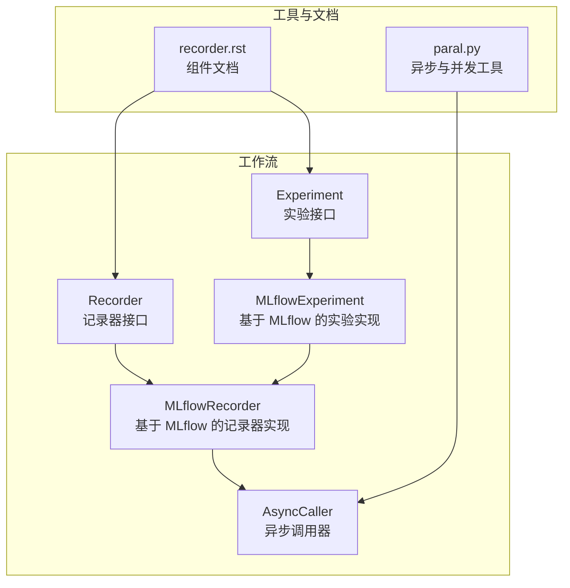
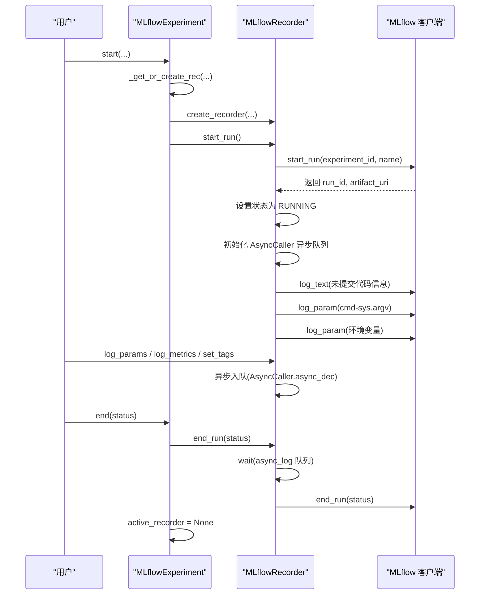
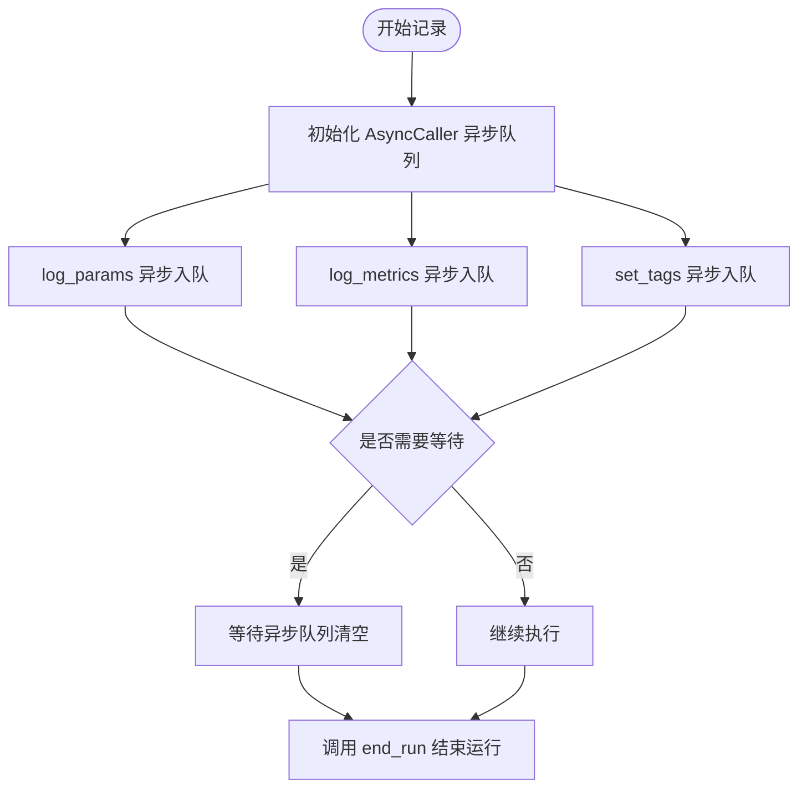
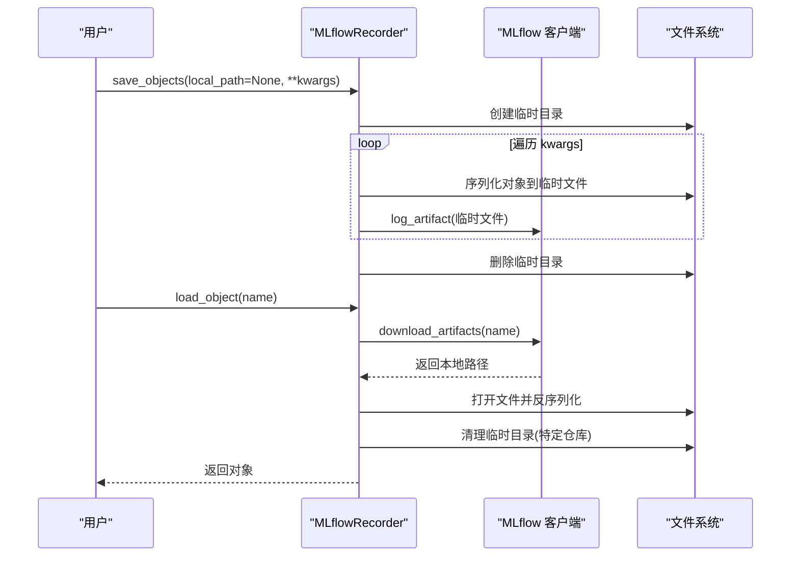
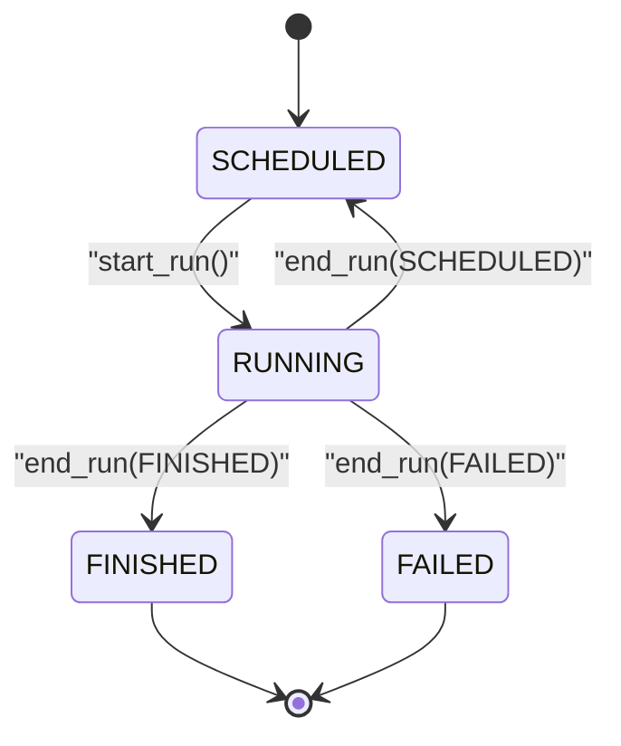
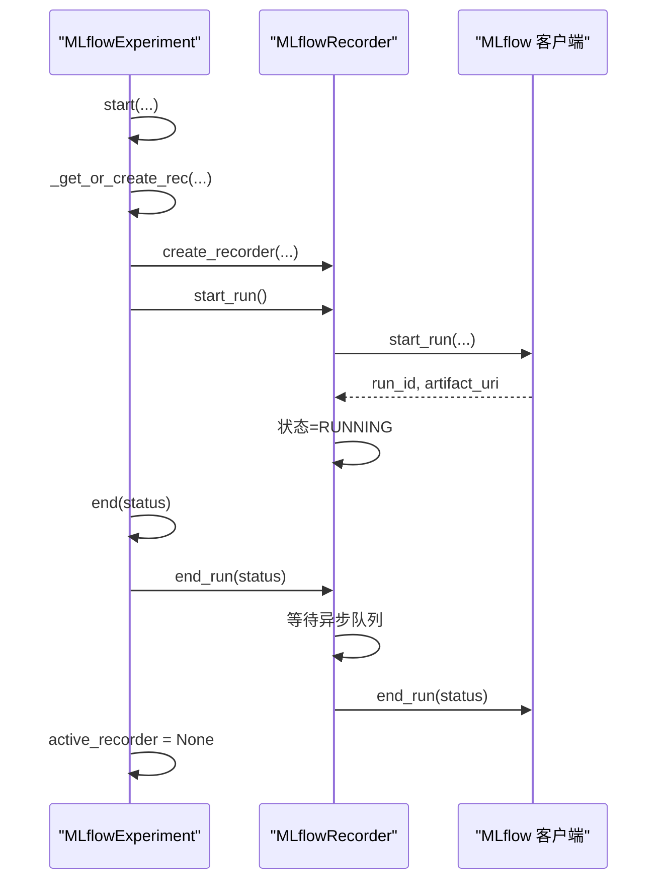
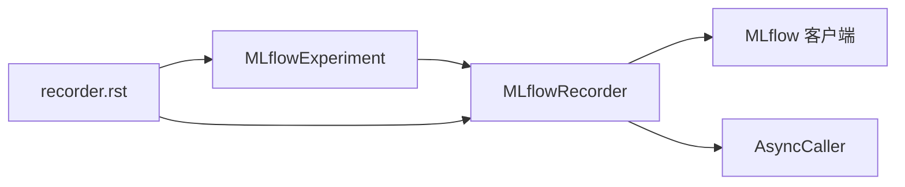

# 记录器

<cite>
**本文引用的文件列表**
- [recorder.py](file://qlib/workflow/recorder.py)
- [exp.py](file://qlib/workflow/exp.py)
- [paral.py](file://qlib/utils/paral.py)
- [recorder.rst](file://docs/component/recorder.rst)
</cite>

## 目录
1. [简介](#简介)
2. [项目结构](#项目结构)
3. [核心组件](#核心组件)
4. [架构总览](#架构总览)
5. [组件详解](#组件详解)
6. [依赖关系分析](#依赖关系分析)
7. [性能考量](#性能考量)
8. [故障排查指南](#故障排查指南)
9. [结论](#结论)
10. [附录](#附录)

## 简介
本文件系统性地梳理 Qlib 的记录器（Recorder）体系，重点围绕 MLflowRecorder 的实现细节展开，覆盖以下主题：
- 日志记录接口：log_params、log_metrics、set_tags 的异步调用机制与性能优化
- 对象序列化与存储：save_objects 如何将 Python 对象序列化并保存到后端；load_object 如何从后端加载对象
- 记录器状态机：SCHEDULED、RUNNING、FINISHED、FAILED 的管理与转换
- 实验产物管理：list_artifacts、download_artifact 的使用方式
- 记录器与实验（Experiment）的绑定关系与生命周期示例

## 项目结构
记录器相关的核心代码位于 workflow 子模块中，配合通用工具模块（如异步调用）与文档说明共同构成完整的实验管理能力。

图表来源
- [recorder.py](file://qlib/workflow/recorder.py#L28-L494)
- [exp.py](file://qlib/workflow/exp.py#L15-L380)
- [paral.py](file://qlib/utils/paral.py#L72-L130)
- [recorder.rst](file://docs/component/recorder.rst#L1-L155)

章节来源
- [recorder.py](file://qlib/workflow/recorder.py#L28-L494)
- [exp.py](file://qlib/workflow/exp.py#L15-L380)
- [paral.py](file://qlib/utils/paral.py#L72-L130)
- [recorder.rst](file://docs/component/recorder.rst#L1-L155)

## 核心组件
- Recorder：记录器抽象基类，定义了统一的日志与产物管理接口，包括参数、指标、标签、制品的记录与查询。
- MLflowRecorder：基于 MLflow 的具体实现，负责对接 MLflow 客户端，封装异步日志、自动记录未提交代码、环境变量等增强功能。
- Experiment：实验抽象基类，负责实验生命周期管理与记录器的创建/获取。
- MLflowExperiment：基于 MLflow 的实验实现，负责启动/结束实验、创建/恢复记录器、列出记录器等。
- AsyncCaller：线程安全的异步调用器，用于将日志写入操作放入队列异步执行，减少主线程阻塞。

章节来源
- [recorder.py](file://qlib/workflow/recorder.py#L28-L494)
- [exp.py](file://qlib/workflow/exp.py#L15-L380)
- [paral.py](file://qlib/utils/paral.py#L72-L130)

## 架构总览
下图展示了 Experiment 与 Recorder 的绑定关系，以及 MLflowRecorder 在其中的角色。

图表来源
- [exp.py](file://qlib/workflow/exp.py#L257-L279)
- [recorder.py](file://qlib/workflow/recorder.py#L335-L396)
- [paral.py](file://qlib/utils/paral.py#L118-L129)

## 组件详解

### MLflowRecorder：日志接口与异步机制
- 异步日志实现
  - 在 start_run 中初始化 AsyncCaller 异步队列，随后对 log_params、log_metrics、set_tags 使用装饰器包装，使其通过异步队列执行，避免频繁网络请求阻塞主线程。
  - 结束时在 end_run 中等待异步队列清空，确保所有日志持久化后再结束运行。
- 参数与指标记录
  - log_params：逐条记录参数键值对。
  - log_metrics：支持 step 参数，逐条记录指标。
  - set_tags：逐条设置标签。
- 自动增强
  - 自动记录未提交代码差异、状态与缓存差异，便于溯源。
  - 自动记录命令行参数与特定前缀的环境变量，提升可复现实验的能力。

图表来源
- [recorder.py](file://qlib/workflow/recorder.py#L335-L396)
- [paral.py](file://qlib/utils/paral.py#L72-L130)

章节来源
- [recorder.py](file://qlib/workflow/recorder.py#L335-L396)
- [paral.py](file://qlib/utils/paral.py#L72-L130)

### MLflowRecorder：对象序列化与存储（save_objects/load_object）
- save_objects
  - 支持直接上传本地文件或目录；若未提供本地路径，则将关键字参数中的对象序列化到临时文件，再上传到 MLflow 后端。
  - 序列化采用通用序列化工具，确保跨平台兼容性。
- load_object
  - 从 MLflow 下载指定名称的制品文件，使用 pickle 反序列化为对象。
  - 对于特定制品仓库（如 Azure Blob），会清理下载产生的临时目录以节省磁盘空间。
  - 若反序列化失败，抛出加载错误异常，便于上层处理。

图表来源
- [recorder.py](file://qlib/workflow/recorder.py#L397-L444)

章节来源
- [recorder.py](file://qlib/workflow/recorder.py#L397-L444)

### MLflowRecorder：状态机管理（SCHEDULED、RUNNING、FINISHED、FAILED）
- 初始状态：SCHEDULED（由基类 Recorder 设置）
- 运行中：start_run 将状态切换为 RUNNING，并记录起始时间
- 结束时：end_run 接受目标状态（SCHEDULED、RUNNING、FINISHED、FAILED），更新结束时间并在必要时等待异步队列
- 状态约束：仅允许设置受支持的状态值，避免非法状态

图表来源
- [recorder.py](file://qlib/workflow/recorder.py#L36-L41)
- [recorder.py](file://qlib/workflow/recorder.py#L335-L396)

章节来源
- [recorder.py](file://qlib/workflow/recorder.py#L36-L41)
- [recorder.py](file://qlib/workflow/recorder.py#L335-L396)

### MLflowRecorder：实验产物管理（list_artifacts/download_artifact）
- list_artifacts：列出当前记录器下的制品清单（返回路径列表）
- download_artifact：将制品下载到本地指定目录并返回本地路径
- 二者均通过 MLflow 客户端完成，保证与 MLflow 生态一致的使用体验

章节来源
- [recorder.py](file://qlib/workflow/recorder.py#L475-L482)

### 实验与记录器的绑定关系与生命周期
- MLflowExperiment 负责实验的启动与结束，内部维护 active_recorder
- start：根据是否恢复现有记录器或新建记录器，设置 active_recorder 并调用其 start_run
- end：调用 active_recorder 的 end_run，并将 active_recorder 置空
- create_recorder：创建新的 MLflowRecorder
- _get_recorder：按 id 或 name 获取记录器，支持从 MLflow 已有 run 恢复

图表来源
- [exp.py](file://qlib/workflow/exp.py#L257-L279)
- [exp.py](file://qlib/workflow/exp.py#L280-L304)
- [recorder.py](file://qlib/workflow/recorder.py#L335-L396)

章节来源
- [exp.py](file://qlib/workflow/exp.py#L257-L279)
- [exp.py](file://qlib/workflow/exp.py#L280-L304)
- [recorder.py](file://qlib/workflow/recorder.py#L335-L396)

## 依赖关系分析
- MLflowRecorder 依赖 MLflow 客户端进行运行、参数、指标、标签与制品的管理
- MLflowRecorder 通过 AsyncCaller 将日志写入操作异步化，降低网络 IO 对主线程的影响
- MLflowExperiment 作为实验入口，负责记录器的创建、激活与生命周期管理
- 文档组件 recorder.rst 提供高层说明与 API 概览，便于用户理解整体架构

图表来源
- [recorder.py](file://qlib/workflow/recorder.py#L247-L494)
- [exp.py](file://qlib/workflow/exp.py#L243-L380)
- [paral.py](file://qlib/utils/paral.py#L72-L130)
- [recorder.rst](file://docs/component/recorder.rst#L1-L155)

章节来源
- [recorder.py](file://qlib/workflow/recorder.py#L247-L494)
- [exp.py](file://qlib/workflow/exp.py#L243-L380)
- [paral.py](file://qlib/utils/paral.py#L72-L130)
- [recorder.rst](file://docs/component/recorder.rst#L1-L155)

## 性能考量
- 异步日志：通过 AsyncCaller 将参数、指标、标签写入后台队列，显著降低主线程阻塞风险，适合高频日志场景
- 等待策略：end_run 前等待异步队列清空，确保数据一致性；同时注意这可能带来额外等待时间
- 产物存储：save_objects 采用临时文件序列化后再上传，避免大对象直接内存传输；load_object 下载后清理临时目录，减少磁盘占用
- 环境变量与未提交代码：自动记录有助于溯源，但也会产生额外文本日志，建议在 CI/CD 场景中按需开启

[本节为通用性能讨论，不涉及具体文件分析]

## 故障排查指南
- 无法获取制品本地目录
  - 现象：调用 get_local_dir 抛出异常
  - 可能原因：记录器尚未创建或 artifact_uri 为空
  - 处理：先调用 start_run，再访问本地目录
- 下载对象失败
  - 现象：load_object 抛出加载错误异常
  - 可能原因：制品不存在、权限不足、对象序列化格式不匹配
  - 处理：确认制品名称正确、检查 MLflow 后端可用性、确保环境一致
- 结束记录器报错
  - 现象：end_run 期间等待异步队列或 MLflow 结束时报错
  - 可能原因：异步队列未正确初始化或主线程提前退出
  - 处理：确保在 start_run 后调用 end_run；必要时显式调用 wait() 等待队列完成

章节来源
- [recorder.py](file://qlib/workflow/recorder.py#L315-L334)
- [recorder.py](file://qlib/workflow/recorder.py#L413-L444)
- [recorder.py](file://qlib/workflow/recorder.py#L380-L396)

## 结论
MLflowRecorder 通过封装 MLflow 客户端，提供了统一且易用的实验记录接口，并引入异步日志、自动溯源与环境变量记录等增强特性，有效提升了实验管理的效率与可复现性。结合 MLflowExperiment 的生命周期管理，用户可以便捷地完成从实验启动、记录器运行到实验结束的全流程操作。对于对象存储与加载，采用序列化+制品管理的方式兼顾了灵活性与可靠性。

[本节为总结性内容，不涉及具体文件分析]

## 附录
- 相关文档参考：组件文档对 Recorder 与 Experiment 的高层说明，便于快速了解 API 与使用场景
- 注意事项：Python 对象序列化依赖 pickle，不同环境可能存在兼容性问题，建议在相同环境中进行对象加载

章节来源
- [recorder.rst](file://docs/component/recorder.rst#L1-L155)