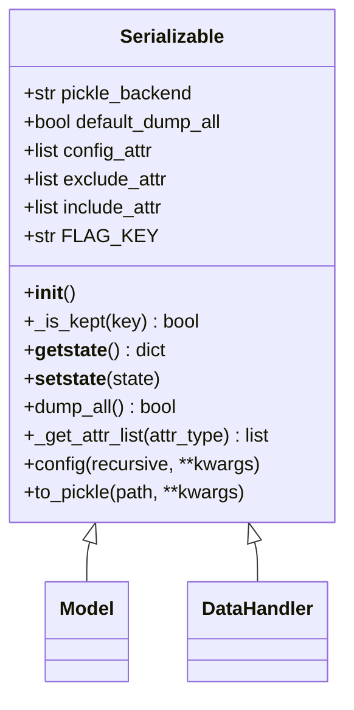
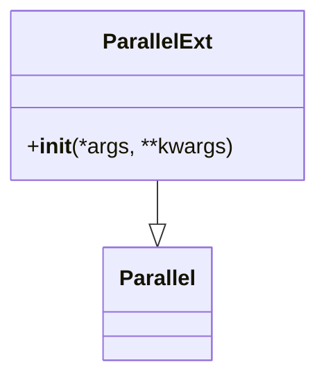
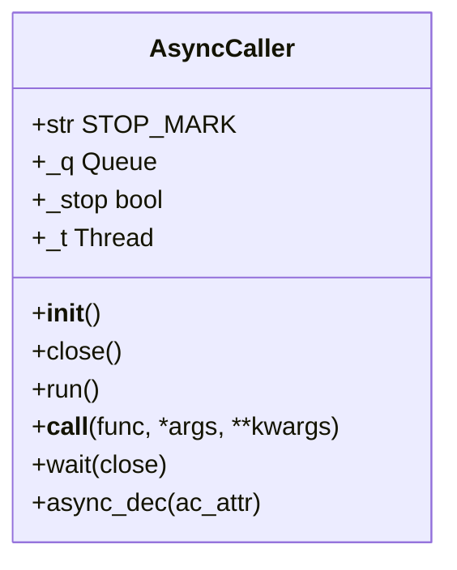
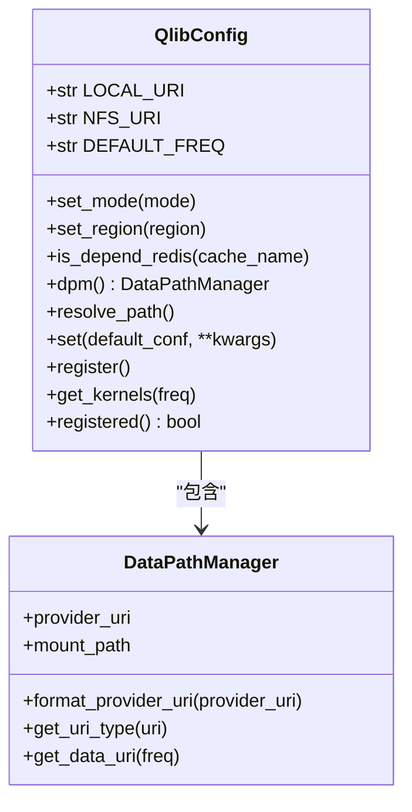

# 工具API

<cite>
**本文档引用的文件**  
- [serial.py](file://qlib/utils/serial.py)
- [paral.py](file://qlib/utils/paral.py)
- [file.py](file://qlib/utils/file.py)
- [config.py](file://qlib/config.py)
- [__init__.py](file://qlib/__init__.py)
- [objm.py](file://qlib/utils/objm.py)
- [exceptions.py](file://qlib/utils/exceptions.py)
- [log.py](file://qlib/log.py)
- [data.py](file://qlib/data/data.py)
- [cache.py](file://qlib/data/cache.py)
</cite>

## 目录
1. [简介](#简介)
2. [序列化模块 (serial)](#序列化模块-serial)
3. [并行计算模块 (paral)](#并行计算模块-paral)
4. [文件操作工具 (file)](#文件操作工具-file)
5. [配置管理系统 (config)](#配置管理系统-config)
6. [工具函数最佳实践](#工具函数最佳实践)
7. [附录](#附录)

## 简介
本文档旨在全面整理QLib框架中的核心工具类API，涵盖序列化、并行计算、文件操作和配置管理等通用功能。文档重点说明了`serial`模块的对象序列化机制及其在模型保存中的应用，`paral`模块的多进程并行接口使用方法。同时，详细描述了配置系统（`qlib.init()`）的参数设置、环境初始化流程与分布式配置模式。最后，提供了内存管理、日志记录和异常处理等工具函数的最佳实践。

**文档来源**
- [__init__.py](file://qlib/__init__.py)
- [config.py](file://qlib/config.py)

## 序列化模块 (serial)

`serial`模块是QLib中用于对象序列化和持久化的核心工具，它提供了一套灵活的机制来控制对象的保存和加载过程，特别适用于机器学习模型的保存与恢复。

### 核心类 `Serializable`

`Serializable`类是所有可序列化对象的基类。它通过重写`__getstate__`和`__setstate__`方法，实现了对序列化过程的精细控制。其核心功能是根据预设规则决定对象的哪些属性在序列化时被保留或丢弃。

**属性保留规则（优先级从高到低）：**
1.  **配置属性列表** (`config_attr`)：始终被丢弃。
2.  **包含属性列表** (`include_attr`)：始终被保留。
3.  **排除属性列表** (`exclude_attr`)：始终被丢弃。
4.  **非下划线开头的属性名**：被保留。
5.  **下划线开头的属性名**：仅当`dump_all=True`时才被保留。

此机制允许用户在保存模型时，选择性地排除大型数据集或临时变量，从而减小模型文件的大小。



**图源**
- [serial.py](file://qlib/utils/serial.py#L11-L170)

### 序列化与反序列化接口

`Serializable`类提供了简洁的API用于对象的持久化：

-   **`to_pickle(path, **kwargs)`**: 将对象序列化并保存到指定路径的pickle文件中。`kwargs`参数可以临时覆盖`config`设置，例如`dump_all=True`来保存所有属性。
-   **`load(filepath)`**: 从文件中加载并反序列化一个对象。该方法是类方法，确保加载的对象类型与调用类一致。
-   **`config(**kwargs)`**: 配置序列化行为，支持`dump_all`、`exclude`和`include`等参数。`recursive=True`时，该配置会递归应用到对象的所有可序列化子对象。

**应用场景：模型保存**
在机器学习工作流中，训练好的模型（如`LGBModel`）通常继承自`Serializable`。通过调用`model.to_pickle("model.pkl")`，可以将模型的参数和结构保存下来，而训练数据等大型属性则被自动排除，实现了高效的模型持久化。

**节源**
- [serial.py](file://qlib/utils/serial.py#L115-L154)

## 并行计算模块 (paral)

`paral`模块基于`joblib`库构建，提供了增强的并行计算能力，旨在简化复杂数据结构的并行处理，并解决内存泄漏问题。

### 核心功能 `ParallelExt`

`ParallelExt`是`joblib.Parallel`的扩展类，主要解决了`joblib`在不同版本中`maxtasksperchild`参数的兼容性问题。它允许用户在进程池中设置每个工作进程执行的任务数量上限，这对于防止内存泄漏至关重要。



**图源**
- [paral.py](file://qlib/utils/paral.py#L20-L31)

### 异步调用器 `AsyncCaller`

`AsyncCaller`是一个基于线程的异步调用器，用于将函数调用非阻塞地执行。它内部维护一个任务队列和一个工作线程，非常适合处理如日志记录等耗时但无需立即返回结果的操作。



**图源**
- [paral.py](file://qlib/utils/paral.py#L72-L117)

### 复杂并行处理 `complex_parallel`

`complex_parallel`函数是该模块的亮点，它能够处理嵌套了`joblib.delayed`任务的复杂数据结构（如字典、列表）。它会自动遍历结构，提取所有延迟任务，将它们并行执行，然后用执行结果替换原始的延迟任务。

```python
# 示例
from qlib.utils.paral import complex_parallel
from joblib import delayed

complex_iter = {"a": delayed(sum)([1,2,3]), "b": [1, 2, delayed(sum)([10, 1])]}
result = complex_parallel(Parallel(), complex_iter) # {'a': 6, 'b': [1, 2, 11]}
```

**节源**
- [paral.py](file://qlib/utils/paral.py#L269-L295)

### 子进程调用 `call_in_subproc`

`call_in_subproc`是一个装饰器类，用于将函数调用封装在子进程中执行。这可以有效避免因函数内部状态导致的内存泄漏，因为子进程在执行完毕后会完全退出，释放所有资源。

**节源**
- [paral.py](file://qlib/utils/paral.py#L298-L333)

## 文件操作工具 (file)

`file`模块提供了一系列用于文件和目录操作的实用工具，特别是对多部分文件的打包和解包支持。

### 核心上下文管理器

-   **`save_multiple_parts_file(filename, format)`**: 该上下文管理器创建一个临时目录，用户可以在其中生成多个文件。当上下文退出时，这些文件会被自动打包成指定格式（如`gztar`）的归档文件，并重命名为`filename`。这非常适合保存包含多个文件的模型。
-   **`unpack_archive_with_buffer(buffer, format)`**: 与上述功能相反，它从一个字节缓冲区中解压归档文件，并在临时目录中提供解压后的内容。上下文退出后，临时文件和目录会被自动清理。
-   **`get_tmp_file_with_buffer(buffer)`**: 将字节缓冲区写入一个临时文件，并在上下文中提供该文件的路径。

**节源**
- [file.py](file://qlib/utils/file.py#L44-L161)

## 配置管理系统 (config)

QLib的配置系统是其灵活性和可扩展性的核心，通过`qlib.init()`函数进行初始化，支持客户端、服务器和高频数据等多种模式。

### `QlibConfig` 类

`QlibConfig`继承自`Config`，是全局配置的中心。它管理着数据提供者、缓存、日志、并行计算等所有核心组件的配置。



**图源**
- [config.py](file://qlib/config.py#L314-L523)

### 初始化流程 `qlib.init()`

`qlib.init()`是配置系统的入口点，其主要流程如下：

1.  **模式设置**：根据`default_conf`参数（如`"client"`或`"server"`）加载预设的配置模板。
2.  **区域设置**：根据`region`参数（如`REG_CN`）加载特定市场的交易规则。
3.  **参数覆盖**：应用用户通过`**kwargs`传入的自定义参数。
4.  **路径解析**：处理`provider_uri`和`mount_path`，确定数据的实际访问路径。
5.  **NFS挂载**：如果`provider_uri`指向NFS服务器，且`auto_mount=True`，则自动执行挂载命令。
6.  **组件注册**：调用`C.register()`，初始化日志系统、注册所有数据操作符、设置实验管理器（如MLflow）等。

**分布式配置模式**

QLib支持客户端-服务器架构，其配置模式如下：
-   **服务器模式 (`server`)**: 启用磁盘缓存（`DISK_DATASET_CACHE`），数据存储在NFS服务器上。
-   **客户端模式 (`client`)**: 默认禁用缓存，通过`provider_uri`连接到服务器获取数据。`mount_path`是NFS在本地的挂载点。

**节源**
- [__init__.py](file://qlib/__init__.py#L25-L85)
- [config.py](file://qlib/config.py#L249-L286)

## 工具函数最佳实践

### 内存管理

QLib通过`MemCache`类实现内存缓存，以加速数据访问。最佳实践包括：
-   **复用数据处理器**：在多次训练任务中，复用已处理好的`DataHandler`对象，避免重复的数据加载和预处理。这可以通过序列化`DataHandler`来实现。
-   **合理设置缓存大小**：通过`C["mem_cache_size_limit"]`和`C["mem_cache_limit_type"]`（`length`或`sizeof`）来控制内存缓存的大小，防止内存溢出。

**节源**
- [data_mem_resuse_demo.py](file://examples/data_demo/data_mem_resuse_demo.py)
- [cache.py](file://qlib/data/cache.py)

### 日志记录

`log`模块提供了强大的日志功能：
-   **`get_module_logger(name)`**: 获取一个命名的日志记录器，所有日志都会以`qlib.<name>`的格式输出。
-   **`TimeInspector`**: 用于性能分析，可以精确测量代码块的执行时间，并通过`logt`上下文管理器自动记录。
-   **全局日志级别控制**：使用`set_global_logger_level_cm()`上下文管理器可以临时改变所有`qlib`日志的级别，便于调试。

**节源**
- [log.py](file://qlib/log.py)

### 异常处理

`exceptions`模块定义了QLib特有的异常类型，便于进行精确的错误处理：
-   **`QlibException`**: 所有QLib异常的基类。
-   **`RecorderInitializationError`**: 当在实验进行中尝试重新初始化时抛出。
-   **`LoadObjectError`**: 当记录器无法加载对象时抛出。

**节源**
- [exceptions.py](file://qlib/utils/exceptions.py)

## 附录

### 核心配置参数摘要

| 参数 | 默认值 | 描述 |
| :--- | :--- | :--- |
| `provider_uri` | `"~/.qlib/qlib_data/cn_data"` | 数据存储的根路径，支持本地路径或NFS路径。 |
| `dataset_cache` | `None` (client) / `DiskDatasetCache` (server) | 数据集缓存策略。 |
| `expression_cache` | `None` (client) / `DiskExpressionCache` (server) | 表达式缓存策略。 |
| `kernels` | `max(cpu_count - 2, 1)` | 并行计算使用的CPU核心数。 |
| `dump_protocol_version` | `4` | pickle序列化协议版本。 |
| `logging_level` | `logging.INFO` | 全局日志级别。 |
| `region` | `REG_CN` | 市场区域，影响交易规则。 |

**节源**
- [config.py](file://qlib/config.py#L134-L247)