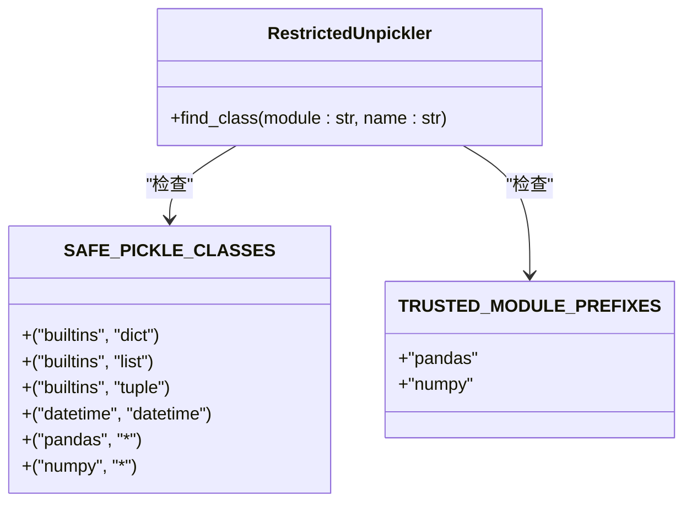
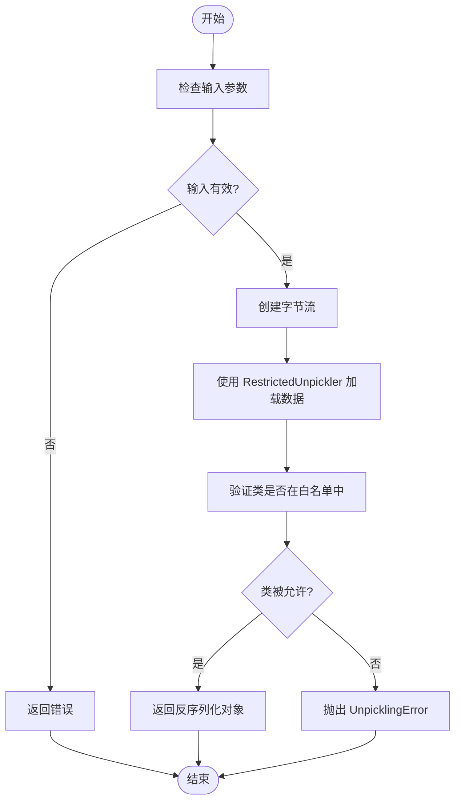
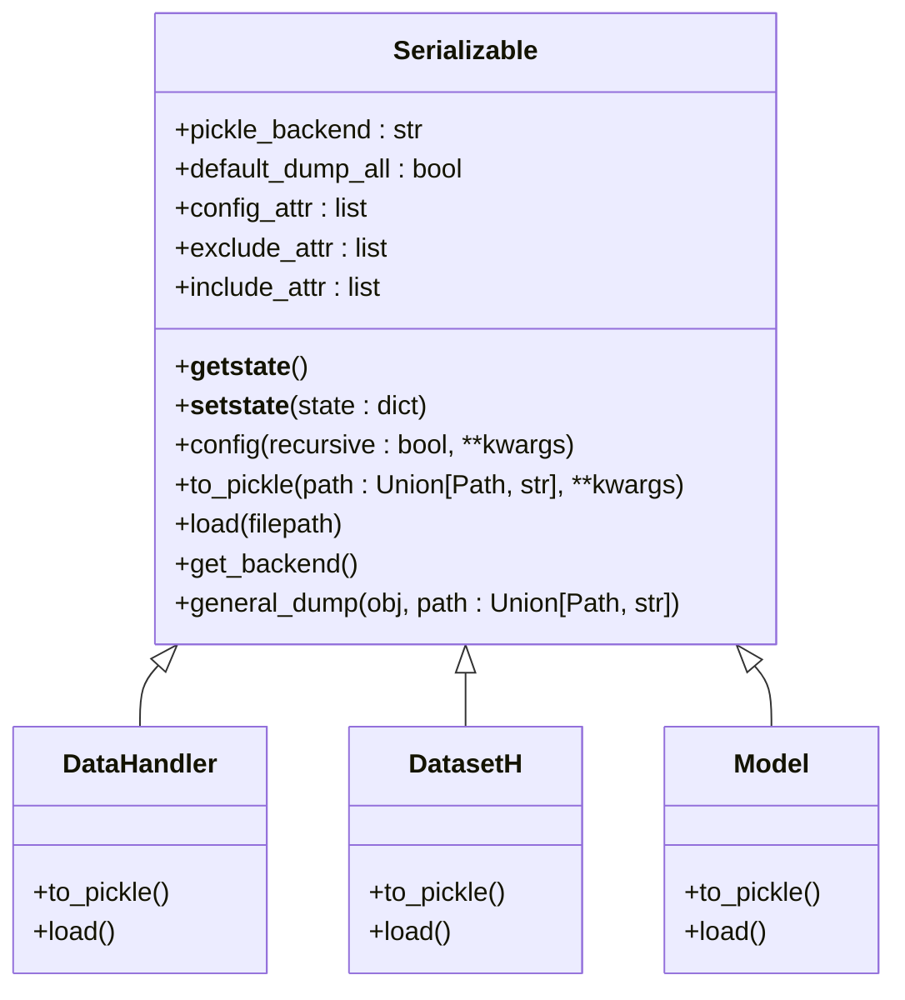
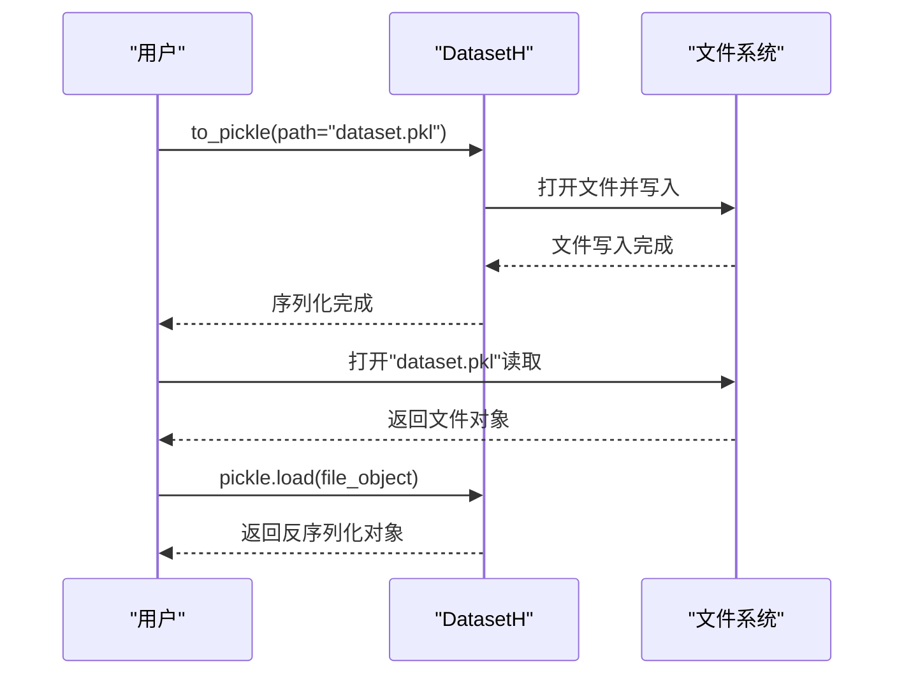
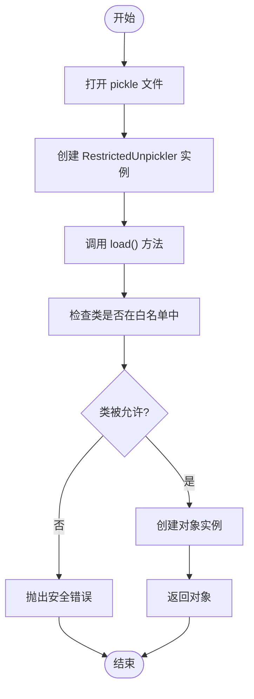
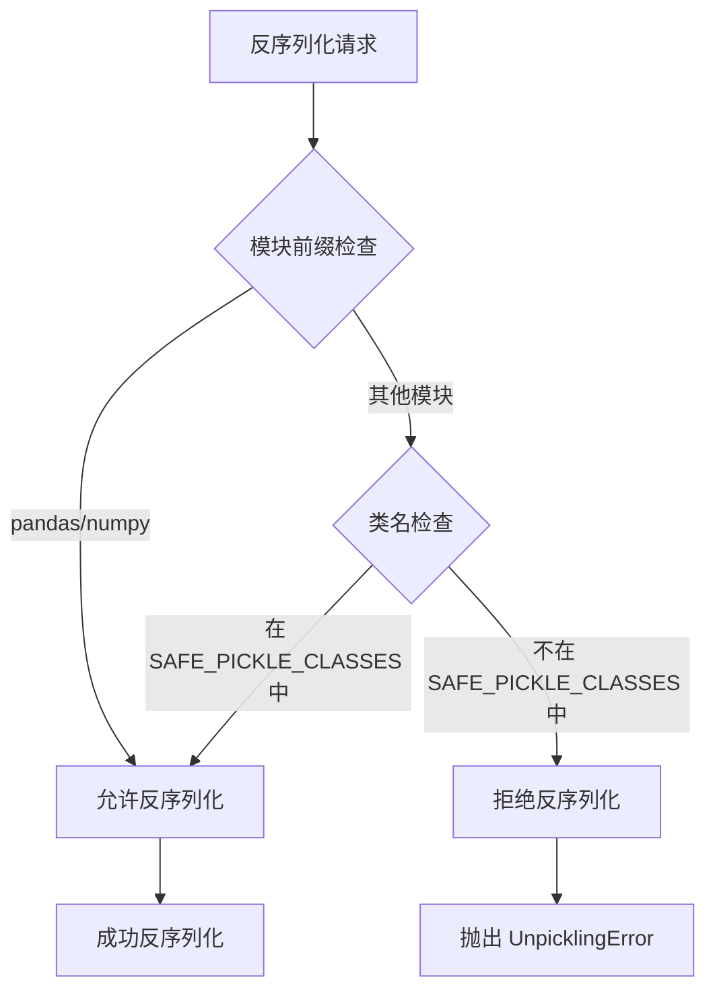
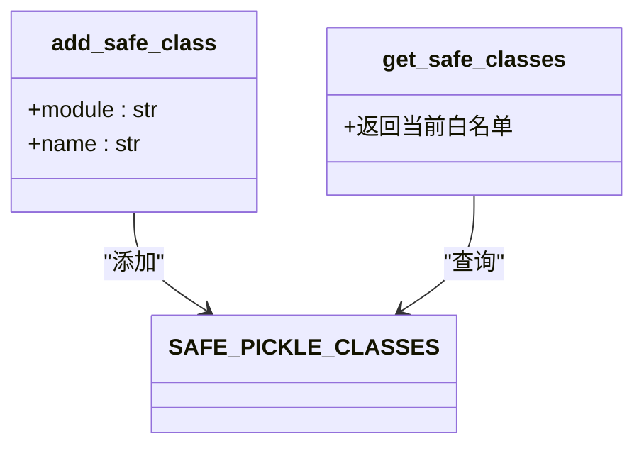
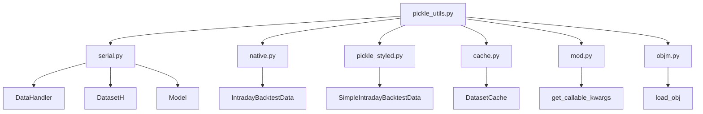

# 安全反序列化工具

<cite>
**本文档中引用的文件**  
- [pickle_utils.py](file://qlib/utils/pickle_utils.py)
- [serial.py](file://qlib/utils/serial.py)
- [native.py](file://qlib/rl/data/native.py)
- [pickle_styled.py](file://qlib/rl/data/pickle_styled.py)
- [cache.py](file://qlib/data/cache.py)
- [mod.py](file://qlib/utils/mod.py)
- [objm.py](file://qlib/utils/objm.py)
- [serial.rst](file://docs/advanced/serial.rst)
- [workflow.py](file://examples/highfreq/workflow.py)
</cite>

## 目录
1. [简介](#简介)
2. [安全反序列化机制](#安全反序列化机制)
3. [核心组件分析](#核心组件分析)
4. [序列化框架](#序列化框架)
5. [使用示例](#使用示例)
6. [安全策略](#安全策略)
7. [依赖分析](#依赖分析)

## 简介
Qlib 提供了一套完整的序列化和反序列化工具，用于在磁盘上保存和加载各种组件的状态，如数据处理器、数据集、模型等。为了防止恶意代码执行，Qlib 实现了安全的反序列化机制，通过限制可反序列化的类来增强安全性。

## 安全反序列化机制

Qlib 的安全反序列化机制主要通过 `qlib.utils.pickle_utils` 模块实现，该模块提供了安全的反序列化函数，防止任意代码执行。

```mermaid
classDiagram
class RestrictedUnpickler {
+find_class(module : str, name : str)
}
class RestrictedUnpickler : : find_class {
+module : str
+name : str
}
class restricted_pickle_load {
+file : BinaryIO
}
class restricted_pickle_loads {
+data : bytes
}
RestrictedUnpickler --> restricted_pickle_load : "使用"
RestrictedUnpickler --> restricted_pickle_loads : "使用"
restricted_pickle_load --> "BinaryIO" : "输入"
restricted_pickle_loads --> "bytes" : "输入"
```

**图示来源**
- [pickle_utils.py](file://qlib/utils/pickle_utils.py#L61-L141)

**本节来源**
- [pickle_utils.py](file://qlib/utils/pickle_utils.py#L1-L172)

## 核心组件分析

### RestrictedUnpickler 类
`RestrictedUnpickler` 是一个自定义的反序列化器，它继承自 `pickle.Unpickler`，通过重写 `find_class` 方法来限制可反序列化的类。



**图示来源**
- [pickle_utils.py](file://qlib/utils/pickle_utils.py#L16-L58)

### 安全反序列化函数
Qlib 提供了两个主要的安全反序列化函数：



**图示来源**
- [pickle_utils.py](file://qlib/utils/pickle_utils.py#L99-L141)

**本节来源**
- [pickle_utils.py](file://qlib/utils/pickle_utils.py#L99-L172)

## 序列化框架

Qlib 的序列化框架基于 `Serializable` 基类，为各种组件提供统一的序列化接口。



**图示来源**
- [serial.py](file://qlib/utils/serial.py#L11-L190)

**本节来源**
- [serial.py](file://qlib/utils/serial.py#L1-L190)

## 使用示例

### 序列化和反序列化数据集
以下示例展示了如何使用 Qlib 的序列化功能保存和加载数据集：



**图示来源**
- [workflow.py](file://examples/highfreq/workflow.py#L120-L131)
- [serial.rst](file://docs/advanced/serial.rst#L28-L33)

### 安全反序列化使用
在需要安全反序列化的场景中，应使用 `restricted_pickle_load` 函数：



**本节来源**
- [native.py](file://qlib/rl/data/native.py#L16)
- [pickle_styled.py](file://qlib/rl/data/pickle_styled.py#L263)
- [cache.py](file://qlib/data/cache.py#L227)

## 安全策略

Qlib 的安全反序列化策略基于白名单机制，确保只有受信任的类可以被反序列化。

### 白名单机制


**本节来源**
- [pickle_utils.py](file://qlib/utils/pickle_utils.py#L55-L96)

### 可扩展的安全策略
Qlib 提供了扩展安全策略的接口，允许用户添加自定义的可信类：



**本节来源**
- [pickle_utils.py](file://qlib/utils/pickle_utils.py#L144-L171)

## 依赖分析

Qlib 的安全反序列化工具与其他组件有紧密的依赖关系：



**图示来源**
- [pickle_utils.py](file://qlib/utils/pickle_utils.py)
- [serial.py](file://qlib/utils/serial.py)
- [native.py](file://qlib/rl/data/native.py)
- [pickle_styled.py](file://qlib/rl/data/pickle_styled.py)
- [cache.py](file://qlib/data/cache.py)
- [mod.py](file://qlib/utils/mod.py)
- [objm.py](file://qlib/utils/objm.py)

**本节来源**
- [pickle_utils.py](file://qlib/utils/pickle_utils.py#L1-L172)
- [serial.py](file://qlib/utils/serial.py#L1-L190)
- [native.py](file://qlib/rl/data/native.py#L1-L235)
- [pickle_styled.py](file://qlib/rl/data/pickle_styled.py#L1-L297)
- [cache.py](file://qlib/data/cache.py#L1-L1199)
- [mod.py](file://qlib/utils/mod.py#L1-L241)
- [objm.py](file://qlib/utils/objm.py#L1-L120)