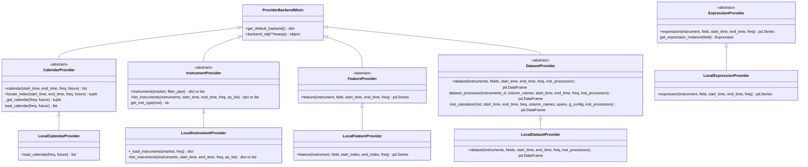
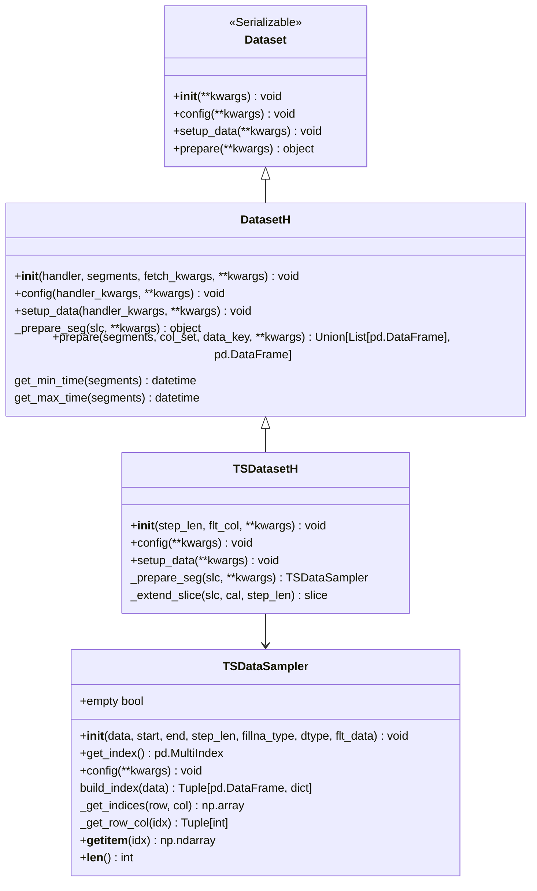
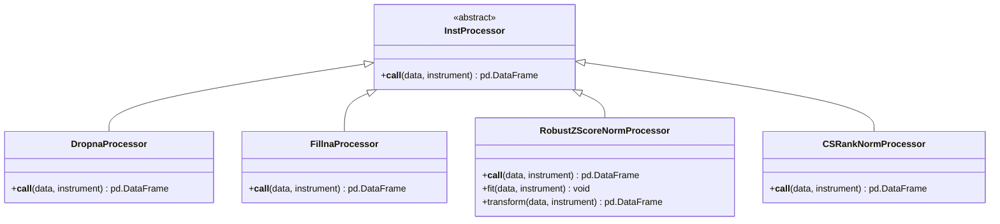
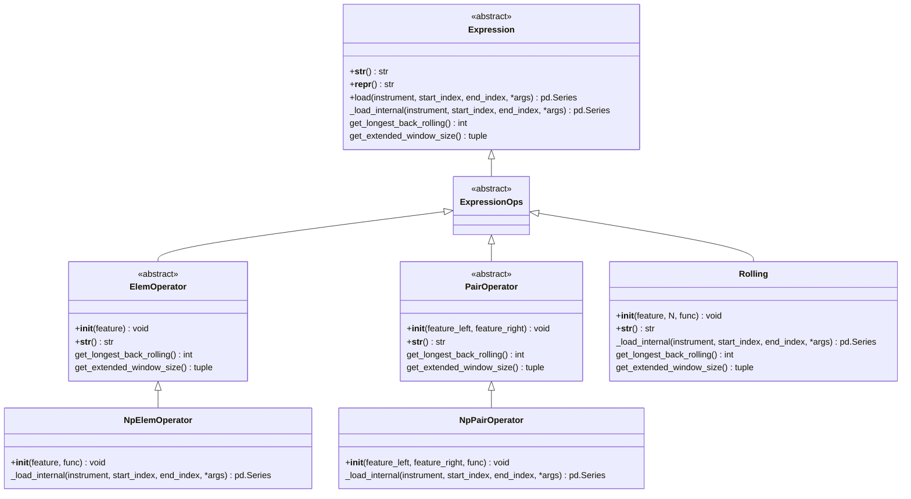
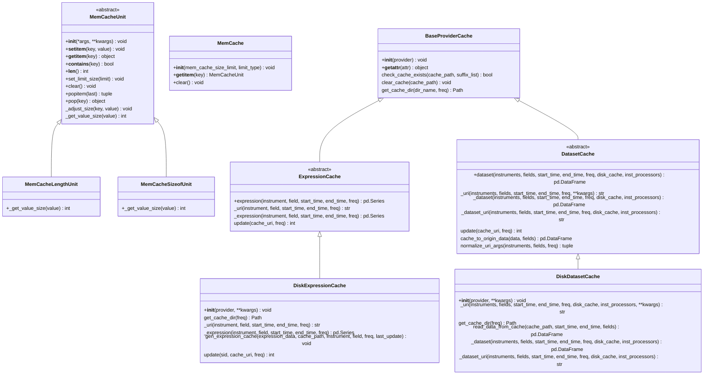
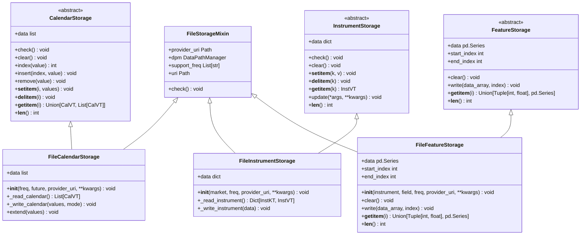
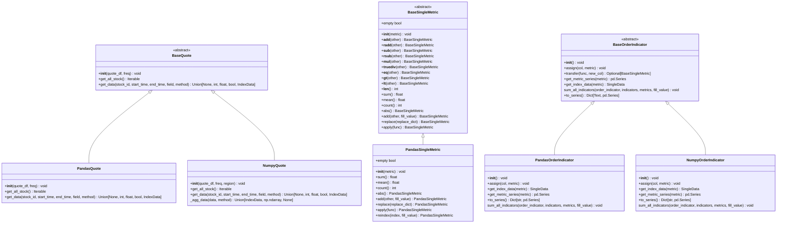

# 数据API

<cite>
**本文档引用的文件**   
- [__init__.py](file://qlib/data/__init__.py)
- [data.py](file://qlib/data/data.py)
- [base.py](file://qlib/data/base.py)
- [cache.py](file://qlib/data/cache.py)
- [ops.py](file://qlib/data/ops.py)
- [file_storage.py](file://qlib/data/storage/file_storage.py)
- [high_performance_ds.py](file://qlib/backtest/high_performance_ds.py)
- [data_cache_demo.py](file://examples/data_demo/data_cache_demo.py)
- [data_mem_resuse_demo.py](file://examples/data_demo/data_mem_resuse_demo.py)
- [dataset/__init__.py](file://qlib/data/dataset/__init__.py)
- [loader.py](file://qlib/data/dataset/loader.py)
</cite>

## 目录
1. [数据提供者](#数据提供者)
2. [数据集](#数据集)
3. [处理器](#处理器)
4. [操作符](#操作符)
5. [缓存机制](#缓存机制)
6. [核心函数详解](#核心函数详解)
7. [数据存储接口扩展](#数据存储接口扩展)
8. [高性能数据结构](#高性能数据结构)

## 数据提供者

qlib.data模块的核心是数据提供者（DataProvider）体系，它通过一系列抽象基类和具体实现来提供不同类型的数据。主要的数据提供者包括CalendarProvider（日历）、InstrumentProvider（标的）、FeatureProvider（特征）和ExpressionProvider（表达式）。

这些提供者遵循统一的设计模式：定义抽象接口，由具体实现类（如LocalCalendarProvider）负责从本地或远程加载数据。这种设计实现了数据访问逻辑与数据源的解耦，使得系统可以灵活地支持多种数据源。



**图源**
- [data.py](file://qlib/data/data.py#L65-L295)
- [data.py](file://qlib/data/data.py#L637-L724)

**节源**
- [data.py](file://qlib/data/data.py#L65-L295)
- [data.py](file://qlib/data/data.py#L637-L724)

## 数据集

数据集（Dataset）是qlib中用于模型训练和推理的数据准备组件。它负责将原始数据转换为模型所需的格式。DatasetH是核心实现，它结合了DataHandler来处理数据预处理逻辑。

数据集的设计允许用户将数据预处理逻辑（如特征工程、标准化）放在DataHandler中，而数据集本身主要负责数据分割和特定于模型的处理。这种分离使得数据处理逻辑更加模块化和可重用。



**图源**
- [dataset/__init__.py](file://qlib/data/dataset/__init__.py#L15-L722)

**节源**
- [dataset/__init__.py](file://qlib/data/dataset/__init__.py#L15-L722)

## 处理器

处理器（Processor）是数据预处理的核心组件，通常作为DataHandler的一部分使用。它们负责执行各种数据转换操作，如缺失值填充、标准化、去极值等。处理器的设计遵循链式调用模式，可以将多个处理器串联起来形成复杂的数据处理流水线。

在DatasetProvider中，inst_processors参数允许在获取数据时应用处理器，这为数据处理提供了极大的灵活性。



**图源**
- [dataset/processor.py](file://qlib/data/dataset/processor.py)

**节源**
- [dataset/processor.py](file://qlib/data/dataset/processor.py)

## 操作符

操作符（Ops）是qlib中用于构建特征表达式的核心组件。它们基于表达式（Expression）基类实现，支持各种数学运算、逻辑运算和时间序列运算。操作符的设计使得用户可以用类似公式的方式定义复杂的特征。

操作符分为几大类：元素级运算符（ElemOperator）、成对运算符（PairOperator）、滚动运算符（Rolling）等。这种分层设计使得操作符的扩展非常方便。



**图源**
- [base.py](file://qlib/data/base.py#L13-L281)
- [ops.py](file://qlib/data/ops.py#L37-L780)

**节源**
- [base.py](file://qlib/data/base.py#L13-L281)
- [ops.py](file://qlib/data/ops.py#L37-L780)

## 缓存机制

qlib的缓存机制是其高性能的关键。它实现了多级缓存策略，包括内存缓存（MemCache）和磁盘缓存（DiskCache）。内存缓存基于OrderedDict实现，支持按长度或大小限制的LRU淘汰策略。

磁盘缓存主要用于缓存计算密集型的特征数据集，避免重复计算。DiskDatasetCache和DiskExpressionCache是主要的磁盘缓存实现，它们使用HDF5格式存储数据，并通过Redis锁保证多进程环境下的读写安全。



**图源**
- [cache.py](file://qlib/data/cache.py#L43-L800)

**节源**
- [cache.py](file://qlib/data/cache.py#L43-L800)

## 核心函数详解

### D.instruments()

`D.instruments()`函数用于获取标的池配置。它接受market参数指定市场范围（如"all"、"csi300"等），并可选地通过filter_pipe参数添加动态过滤器。该函数返回一个字典，包含市场名称和过滤器配置，或直接返回标的列表。

```python
# 获取CSI300指数成分股
instruments = D.instruments("csi300")

# 添加动态过滤器
filter_pipe = [
    {"filter_type": "ExpressionDFilter", "rule_expression": "$open<40"},
    {"filter_type": "NameDFilter", "name_rule_re": "SH[0-9]{4}55"}
]
instruments = D.instruments("csi500", filter_pipe=filter_pipe)
```

**节源**
- [data.py](file://qlib/data/data.py#L206-L264)

### D.features()

`D.features()`函数是获取特征数据的核心接口。它接受标的列表、特征字段列表和时间范围，返回一个以<标的, 时间>为索引的DataFrame。该函数内部使用DatasetProvider和缓存机制来高效地获取数据。

```python
# 获取多个标的的多个特征
instruments = ["SH600000", "SH600004"]
fields = ["$close", "$volume", "Ref($close, 1)"]
data = D.features(instruments, fields, start_time="2020-01-01", end_time="2020-12-31")
```

**节源**
- [data.py](file://qlib/data/data.py#L453-L634)

### D.calendar()

`D.calendar()`函数用于获取指定时间范围内的交易日历。它支持多种频率（年、季、月、周、日）和未来交易日选项。该函数利用内存缓存来提高性能，避免重复加载日历数据。

```python
# 获取2020年的日线交易日历
calendar = D.calendar(start_time="2020-01-01", end_time="2020-12-31", freq="day")

# 获取包含未来交易日的日历
future_calendar = D.calendar(freq="day", future=True)
```

**节源**
- [data.py](file://qlib/data/data.py#L71-L109)

## 数据存储接口扩展

qlib通过storage模块提供了可扩展的数据存储接口。FileStorage是主要的实现，它定义了日历、标的和特征数据的存储方式。用户可以通过实现自定义的Storage类来支持新的数据存储后端。



**图源**
- [file_storage.py](file://qlib/data/storage/file_storage.py)

**节源**
- [file_storage.py](file://qlib/data/storage/file_storage.py)

## 高性能数据结构

qlib在backtest模块中提供了高性能数据结构，用于优化回测性能。NumpyQuote和PandasQuote是两种主要的报价数据结构，它们针对不同的使用场景进行了优化。

NumpyQuote使用numpy数组存储数据，适合需要高性能数值计算的场景；PandasQuote则保持了pandas DataFrame的灵活性，适合需要复杂数据操作的场景。



**图源**
- [high_performance_ds.py](file://qlib/backtest/high_performance_ds.py)

**节源**
- [high_performance_ds.py](file://qlib/backtest/high_performance_ds.py)