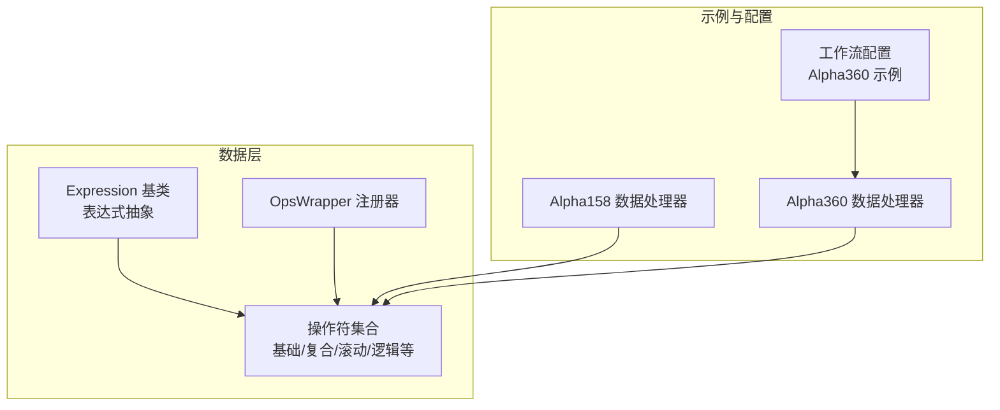
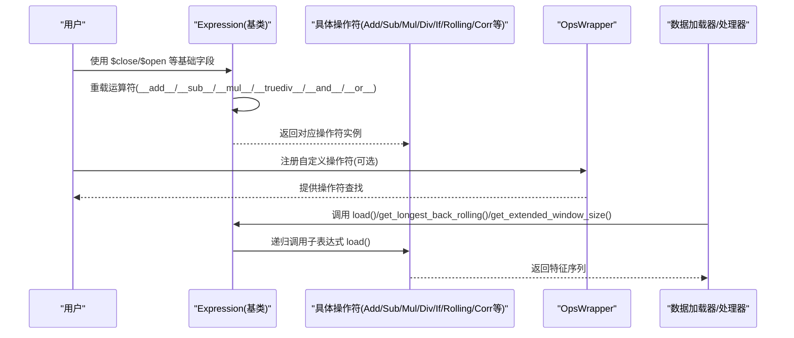
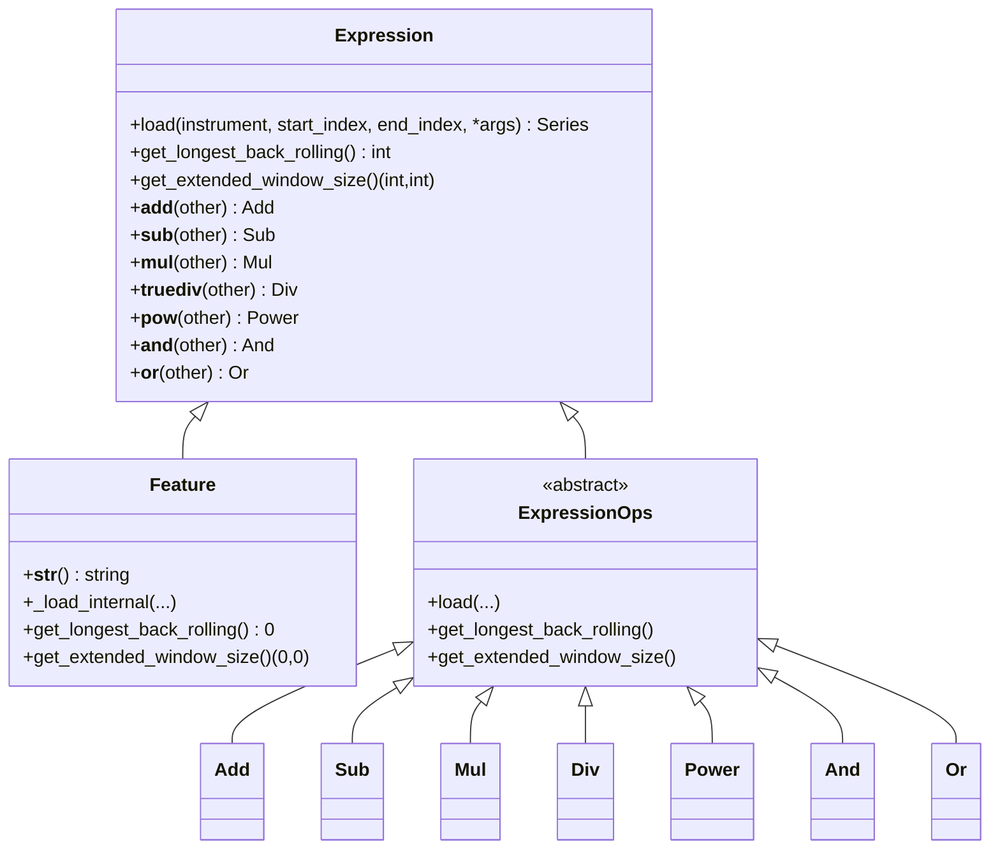
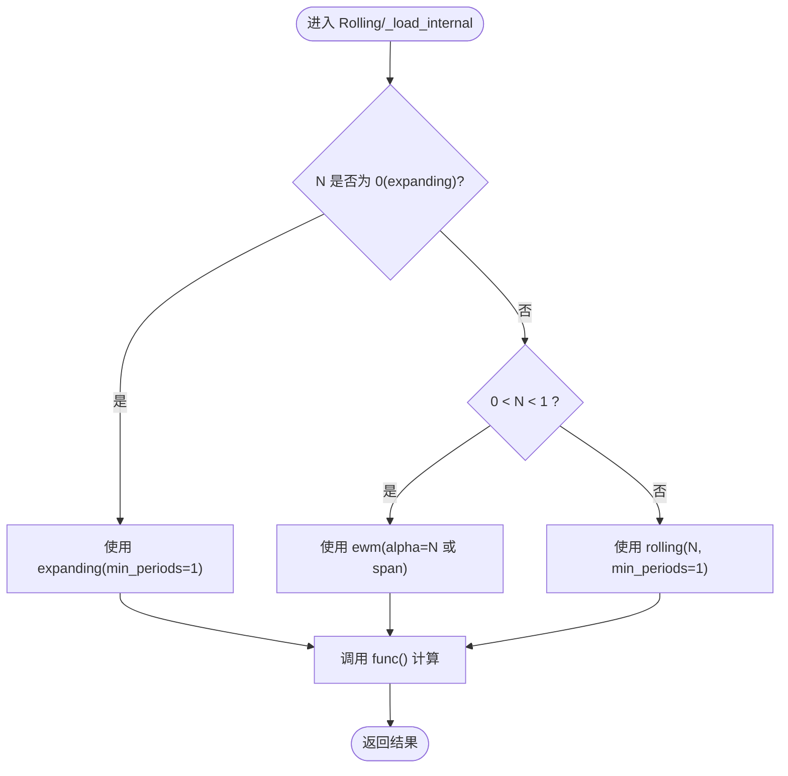
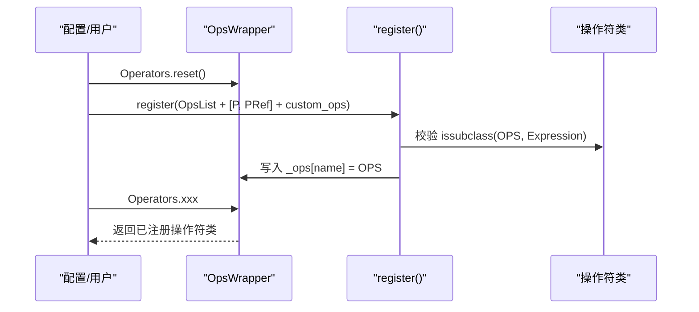
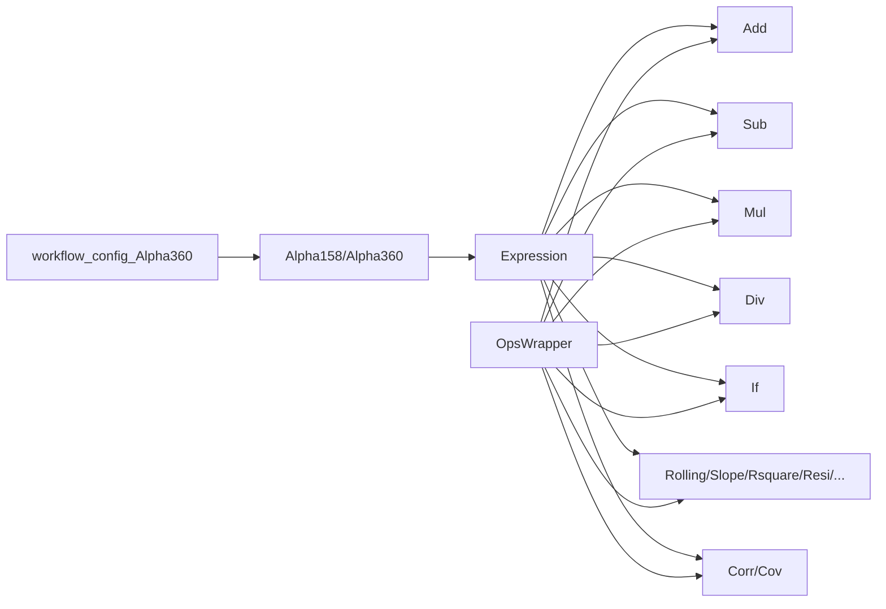

# 操作符系统

<cite>
**本文引用的文件**
- [qlib/data/base.py](file://qlib/data/base.py)
- [qlib/data/ops.py](file://qlib/data/ops.py)
- [qlib/tests/ops/test_special_ops.py](file://tests/ops/test_special_ops.py)
- [qlib/tests/test_register_ops.py](file://tests/test_register_ops.py)
- [qlib/contrib/data/handler.py](file://qlib/contrib/data/handler.py)
- [qlib/contrib/data/loader.py](file://qlib/contrib/data/loader.py)
- [examples/benchmarks/ADARNN/workflow_config_adarnn_Alpha360.yaml](file://examples/benchmarks/ADARNN/workflow_config_adarnn_Alpha360.yaml)
</cite>

## 目录
1. [简介](#简介)
2. [项目结构](#项目结构)
3. [核心组件](#核心组件)
4. [架构总览](#架构总览)
5. [详细组件分析](#详细组件分析)
6. [依赖关系分析](#依赖关系分析)
7. [性能考虑](#性能考虑)
8. [故障排查指南](#故障排查指南)
9. [结论](#结论)
10. [附录](#附录)

## 简介
本文件系统性梳理 Qlib 的操作符系统，重点覆盖：
- 基础操作符（Add、Sub、Mul、Div 等）与复合操作符（If、Rolling、Corr 等）的实现机制
- Expression 基类通过重载 Python 运算符（__add__、__sub__ 等）实现表达式链式构建
- 使用 $close、$open 等基础字段构建复杂 Alpha 因子表达式的方法
- 操作符注册机制（OpsWrapper）与自定义操作符的开发流程
- 性能优化建议：避免重复计算、利用向量化操作

## 项目结构
操作符系统主要由以下模块构成：
- 表达式与操作符定义：位于数据层的表达式基类与各类操作符
- 注册与加载：操作符注册器与统一入口
- Alpha 因子示例：基于操作符构建的 Alpha 因子配置与使用

图表来源
- [qlib/data/base.py](file://qlib/data/base.py#L13-L236)
- [qlib/data/ops.py](file://qlib/data/ops.py#L1565-L1681)
- [qlib/contrib/data/handler.py](file://qlib/contrib/data/handler.py#L48-L158)
- [examples/benchmarks/ADARNN/workflow_config_adarnn_Alpha360.yaml](file://examples/benchmarks/ADARNN/workflow_config_adarnn_Alpha360.yaml#L1-L88)

章节来源
- [qlib/data/base.py](file://qlib/data/base.py#L13-L236)
- [qlib/data/ops.py](file://qlib/data/ops.py#L1565-L1681)
- [qlib/contrib/data/handler.py](file://qlib/contrib/data/handler.py#L48-L158)
- [examples/benchmarks/ADARNN/workflow_config_adarnn_Alpha360.yaml](file://examples/benchmarks/ADARNN/workflow_config_adarnn_Alpha360.yaml#L1-L88)

## 核心组件
- Expression 抽象基类：定义表达式接口、缓存加载、窗口扩展查询等能力，并重载 Python 运算符以支持链式表达式构建。
- 操作符集合：包含元素级、成对级、三元级、滚动类、配对滚动类等操作符，覆盖加减乘除、比较、逻辑、统计、相关性等。
- OpsWrapper 注册器：集中管理操作符注册、查找与覆盖提示，支持自定义操作符注入。
- Alpha 因子示例：通过数据处理器与数据加载器，将表达式转换为特征字段，用于模型训练与回测。

章节来源
- [qlib/data/base.py](file://qlib/data/base.py#L13-L236)
- [qlib/data/ops.py](file://qlib/data/ops.py#L1565-L1681)
- [qlib/contrib/data/handler.py](file://qlib/contrib/data/handler.py#L48-L158)

## 架构总览
操作符系统采用“表达式抽象 + 操作符组合”的设计，通过 Expression 的运算符重载实现链式表达式构建；通过 OpsWrapper 统一注册与访问；最终在数据处理阶段将表达式解析为可执行的特征序列。

图表来源
- [qlib/data/base.py](file://qlib/data/base.py#L32-L141)
- [qlib/data/ops.py](file://qlib/data/ops.py#L1565-L1681)
- [qlib/contrib/data/handler.py](file://qlib/contrib/data/handler.py#L48-L158)

## 详细组件分析

### Expression 基类与运算符重载
- 作用：定义表达式抽象、缓存加载、窗口扩展查询；重载 Python 运算符以支持链式表达式构建。
- 关键点：
  - 缓存：load 中使用内存缓存 H["f"]，避免重复计算。
  - 窗口扩展：get_longest_back_rolling 与 get_extended_window_size 用于确定数据拉取范围。
  - 运算符重载：__add__、__sub__、__mul__、__truediv__、__pow__、__and__、__or__ 等返回对应操作符实例，形成表达式树。

图表来源
- [qlib/data/base.py](file://qlib/data/base.py#L13-L236)
- [qlib/data/ops.py](file://qlib/data/ops.py#L358-L636)

章节来源
- [qlib/data/base.py](file://qlib/data/base.py#L13-L236)

### 基础操作符（Add、Sub、Mul、Div 等）
- 实现方式：NpPairOperator 将两个输入（表达式或常量）加载为序列后，通过 numpy 对应函数进行逐元素运算。
- 特性：
  - 至少一个输入必须是表达式实例，否则直接作为常量参与计算。
  - 长度不一致时会记录调试日志并抛出异常，便于定位数据对齐问题。
- 典型用法：表达式链式组合，如 $close/$open、$close - $open 等。

章节来源
- [qlib/data/ops.py](file://qlib/data/ops.py#L279-L360)
- [qlib/data/ops.py](file://qlib/data/ops.py#L358-L636)

### 复合操作符（If、Rolling、Corr 等）
- If：三元条件选择，根据布尔条件从左右分支选择值。
- Rolling：滚动统计族，包括 Mean、Sum、Std、Var、Skew、Kurt、Max、Min、Med、Mad、Rank、Quantile、Count、Delta、Slope、Rsquare、Resi、WMA、EMA 等。
  - 支持 expanding（N=0）、rolling（N>0）、指数平滑（0<N<1）三种模式。
  - 通过 get_longest_back_rolling 与 get_extended_window_size 计算所需历史窗口长度。
- Corr：配对滚动相关系数，内部先计算滚动相关，再剔除任一侧标准差接近零的情况。
- PairRolling：配对滚动通用框架，支持 corr、cov 等。

图表来源
- [qlib/data/ops.py](file://qlib/data/ops.py#L713-L779)
- [qlib/data/ops.py](file://qlib/data/ops.py#L1349-L1384)

章节来源
- [qlib/data/ops.py](file://qlib/data/ops.py#L639-L706)
- [qlib/data/ops.py](file://qlib/data/ops.py#L713-L779)
- [qlib/data/ops.py](file://qlib/data/ops.py#L1467-L1499)
- [qlib/data/ops.py](file://qlib/data/ops.py#L1386-L1465)

### 表达式链式构建与 Alpha 因子示例
- 基础字段：$close、$open、$high、$low、$vwap、$volume 等通过 Feature/PFeature 表达式表示。
- 链式构建：通过 Expression 的运算符重载，将多个操作符拼接为表达式树。
- Alpha 示例：
  - Alpha158/Alpha360 数据处理器将表达式配置转换为特征字段，用于模型训练。
  - 示例表达式：Ref($close, -2)/Ref($close, -1) - 1（标签），以及多种滚动统计与比价表达式。

章节来源
- [qlib/data/base.py](file://qlib/data/base.py#L238-L282)
- [qlib/contrib/data/handler.py](file://qlib/contrib/data/handler.py#L48-L158)
- [qlib/contrib/data/loader.py](file://qlib/contrib/data/loader.py#L27-L83)
- [examples/benchmarks/ADARNN/workflow_config_adarnn_Alpha360.yaml](file://examples/benchmarks/ADARNN/workflow_config_adarnn_Alpha360.yaml#L1-L88)

### 操作符注册机制（OpsWrapper）与自定义操作符
- 注册器：OpsWrapper 维护操作符字典，支持 reset、register、按名称访问。
- 注册策略：
  - 接受操作符类列表或配置字典（含 class 与 module_path）。
  - 校验类型为 Expression 子类，若同名覆盖则发出警告。
- 自定义操作符：
  - 继承 ElemOperator（单参）或 PairOperator（双参）等基类，实现 _load_internal 与窗口扩展查询方法。
  - 在测试中演示了通过 custom_ops 注入自定义 Diff、Distance 操作符，并在表达式中使用。

图表来源
- [qlib/data/ops.py](file://qlib/data/ops.py#L1565-L1681)

章节来源
- [qlib/data/ops.py](file://qlib/data/ops.py#L1565-L1681)
- [tests/test_register_ops.py](file://tests/test_register_ops.py#L1-L65)

## 依赖关系分析
- Expression 与各操作符之间为组合关系：Expression 通过运算符重载生成具体操作符实例。
- OpsWrapper 与操作符之间为注册与访问关系：统一注册、按名查找。
- 数据处理器与操作符之间为使用关系：将表达式配置转换为特征序列。

图表来源
- [qlib/data/base.py](file://qlib/data/base.py#L32-L141)
- [qlib/data/ops.py](file://qlib/data/ops.py#L1565-L1681)
- [qlib/contrib/data/handler.py](file://qlib/contrib/data/handler.py#L48-L158)

章节来源
- [qlib/data/base.py](file://qlib/data/base.py#L32-L141)
- [qlib/data/ops.py](file://qlib/data/ops.py#L1565-L1681)
- [qlib/contrib/data/handler.py](file://qlib/contrib/data/handler.py#L48-L158)

## 性能考虑
- 避免重复计算
  - 利用 Expression.load 的内存缓存（H["f"]），同一表达式在相同参数下复用结果。
  - 合理拆分表达式，减少不必要的重复 load 调用。
- 向量化优先
  - 基础操作符（NpPairOperator/NpElemOperator）直接使用 numpy 函数，具备良好向量化性能。
  - 滚动类操作符优先使用 pandas 内置方法（如 expanding/rolling/ewm），避免 apply(lambda x) 的 Python 循环。
- 窗口与历史需求
  - 正确实现 get_longest_back_rolling 与 get_extended_window_size，确保数据拉取范围准确，避免过度拉取导致内存压力。
- 特殊场景
  - Corr 在计算后对标准差接近零的样本置空，避免无效相关性；注意这可能引入额外的 NaN 处理成本。
  - PairRolling(N=0) 的准确性提示，必要时改用固定窗口以获得稳定结果。

章节来源
- [qlib/data/base.py](file://qlib/data/base.py#L142-L208)
- [qlib/data/ops.py](file://qlib/data/ops.py#L713-L779)
- [qlib/data/ops.py](file://qlib/data/ops.py#L1467-L1499)

## 故障排查指南
- 表达式链构建错误
  - 确认运算符重载返回的是操作符实例，而非直接数值；检查表达式树是否正确嵌套。
- 数据长度不一致
  - NpPairOperator 在长度不一致时会记录调试日志并抛出异常，需检查左右分支的时间索引与长度。
- 窗口扩展与历史需求
  - 若出现数据不足或越界，检查 get_extended_window_size 与 get_longest_back_rolling 的实现是否合理。
- 自定义操作符未生效
  - 确保通过 custom_ops 注入并在注册时未被覆盖；检查类名与模块路径配置。
- Alpha 因子配置问题
  - 参考 Alpha158/Alpha360 的字段配置，确认表达式语法与字段存在性。

章节来源
- [qlib/data/ops.py](file://qlib/data/ops.py#L279-L360)
- [tests/test_register_ops.py](file://tests/test_register_ops.py#L1-L65)
- [qlib/contrib/data/handler.py](file://qlib/contrib/data/handler.py#L48-L158)

## 结论
Qlib 的操作符系统通过 Expression 抽象与运算符重载实现了强大的表达式链式构建能力；配合 OpsWrapper 的集中注册与加载机制，既保证了灵活性，又提供了良好的扩展性。在实际应用中，建议充分利用向量化操作、合理设置窗口与缓存策略，并通过自定义操作符满足特定业务需求，从而高效构建高质量的 Alpha 因子。

## 附录
- 使用 $close/$open 等基础字段构建复杂 Alpha 因子的参考路径：
  - 基础字段与表达式：[qlib/data/base.py](file://qlib/data/base.py#L238-L282)
  - Alpha158 字段配置示例：[qlib/contrib/data/loader.py](file://qlib/contrib/data/loader.py#L27-L83)
  - Alpha360 工作流配置示例：[examples/benchmarks/ADARNN/workflow_config_adarnn_Alpha360.yaml](file://examples/benchmarks/ADARNN/workflow_config_adarnn_Alpha360.yaml#L1-L88)
- 自定义操作符开发参考：
  - 测试用自定义 Diff/Distance：[tests/test_register_ops.py](file://tests/test_register_ops.py#L1-L65)
  - 注册器实现与使用：[qlib/data/ops.py](file://qlib/data/ops.py#L1565-L1681)