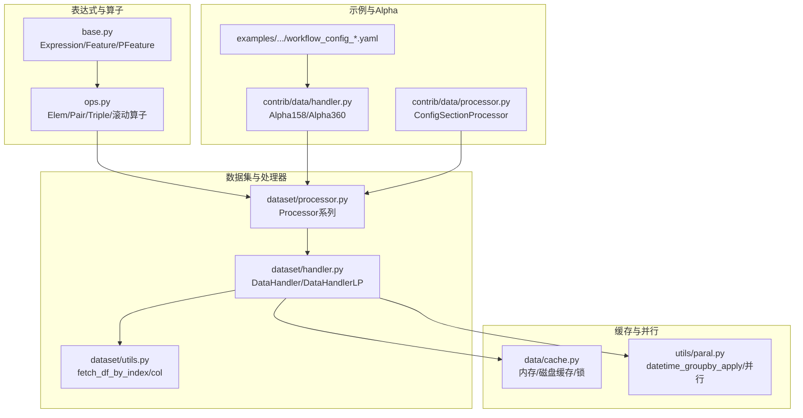
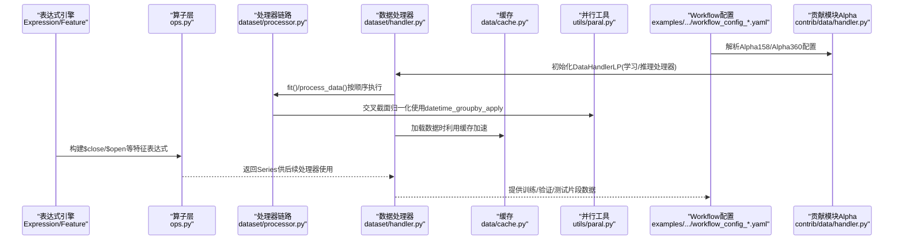
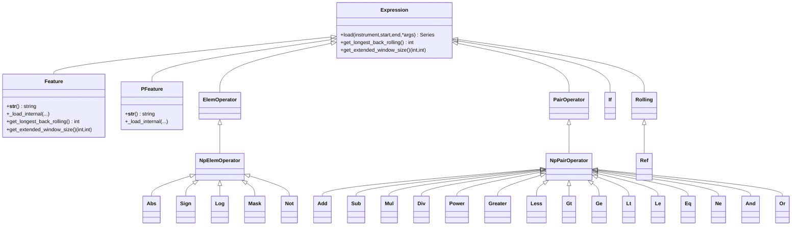
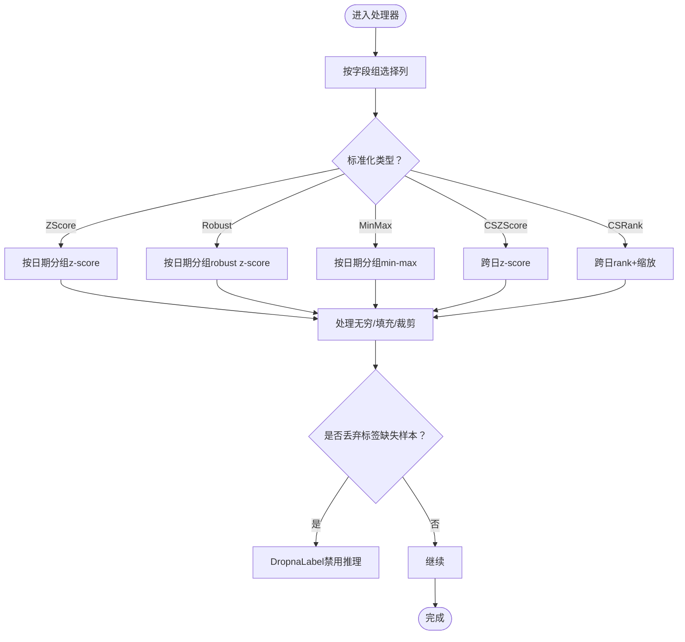
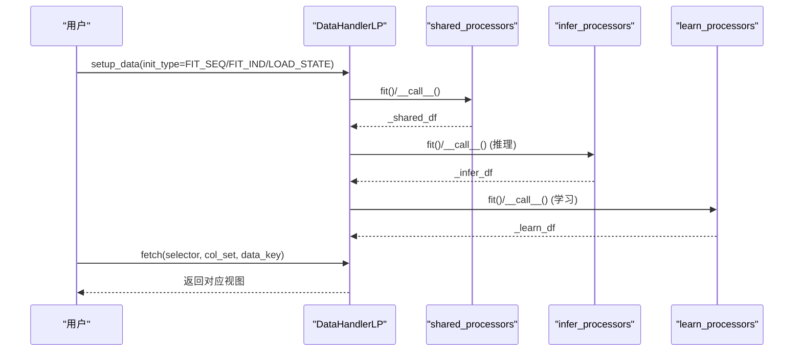
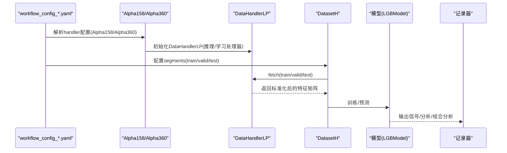
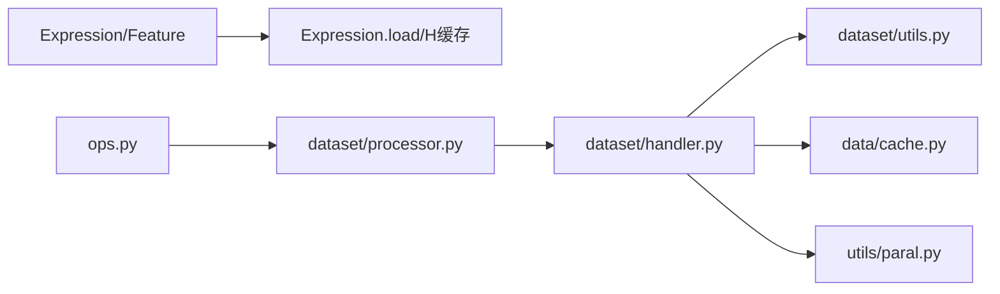

# 数据处理与特征工程

<cite>
**本文引用的文件列表**
- [ops.py](file://qlib/data/ops.py)
- [base.py](file://qlib/data/base.py)
- [processor.py](file://qlib/data/dataset/processor.py)
- [handler.py](file://qlib/data/dataset/handler.py)
- [utils.py](file://qlib/data/dataset/utils.py)
- [cache.py](file://qlib/data/cache.py)
- [paral.py](file://qlib/utils/paral.py)
- [workflow_config_lightgbm_Alpha158.yaml](file://examples/benchmarks/LightGBM/workflow_config_lightgbm_Alpha158.yaml)
- [workflow_config_lightgbm_Alpha360.yaml](file://examples/benchmarks/LightGBM/workflow_config_lightgbm_Alpha360.yaml)
- [handler.py](file://qlib/contrib/data/handler.py)
- [processor.py](file://qlib/contrib/data/processor.py)
</cite>

## 目录
1. [简介](#简介)
2. [项目结构](#项目结构)
3. [核心组件](#核心组件)
4. [架构总览](#架构总览)
5. [详细组件分析](#详细组件分析)
6. [依赖关系分析](#依赖关系分析)
7. [性能考虑](#性能考虑)
8. [故障排查指南](#故障排查指南)
9. [结论](#结论)
10. [附录](#附录)

## 简介
本文件系统性梳理QLib中数据处理与特征工程的实现，重点覆盖：
- Ops模块中的基础算子（如$close/$open）与复合表达式构建方法
- Processor与Handler在特征标准化、去极值、行业中性化等预处理流程中的职责与协作
- 自定义特征处理器的开发规范与注册机制
- 结合examples中的workflow配置，展示Alpha因子构建的完整流程
- 性能优化建议：向量化计算、缓存策略与并行处理最佳实践

## 项目结构
围绕数据处理与特征工程的关键目录与文件如下：
- 表达式与算子：qlib/data/ops.py、qlib/data/base.py
- 数据集处理器：qlib/data/dataset/processor.py
- 数据处理器与工作流：qlib/data/dataset/handler.py、qlib/data/dataset/utils.py
- 缓存与并行：qlib/data/cache.py、qlib/utils/paral.py
- 示例与Alpha配置：examples/benchmarks/LightGBM/*.yaml
- 贡献模块的Alpha处理器与Handler：qlib/contrib/data/processor.py、qlib/contrib/data/handler.py

图表来源
- [base.py](file://qlib/data/base.py#L1-L282)
- [ops.py](file://qlib/data/ops.py#L1-L800)
- [processor.py](file://qlib/data/dataset/processor.py#L1-L420)
- [handler.py](file://qlib/data/dataset/handler.py#L1-L787)
- [utils.py](file://qlib/data/dataset/utils.py#L1-L143)
- [cache.py](file://qlib/data/cache.py#L1-L800)
- [paral.py](file://qlib/utils/paral.py#L1-L333)
- [handler.py](file://qlib/contrib/data/handler.py#L1-L158)
- [processor.py](file://qlib/contrib/data/processor.py#L1-L130)

章节来源
- [base.py](file://qlib/data/base.py#L1-L282)
- [ops.py](file://qlib/data/ops.py#L1-L800)
- [processor.py](file://qlib/data/dataset/processor.py#L1-L420)
- [handler.py](file://qlib/data/dataset/handler.py#L1-L787)
- [utils.py](file://qlib/data/dataset/utils.py#L1-L143)
- [cache.py](file://qlib/data/cache.py#L1-L800)
- [paral.py](file://qlib/utils/paral.py#L1-L333)
- [handler.py](file://qlib/contrib/data/handler.py#L1-L158)
- [processor.py](file://qlib/contrib/data/processor.py#L1-L130)

## 核心组件
- 表达式与算子体系
  - 基础表达式：Expression、Feature（$close/$open等）、PFeature（点时态）
  - 元算子：Abs、Sign、Log、Mask、Not
  - 双目算子：Add/Sub/Mul/Div/Power/比较与逻辑运算
  - 三目算子：If条件选择
  - 滚动与扩展：Rolling、Ref、EWMA等
- 处理器（Processor）
  - 标准化：ZScoreNorm、RobustZScoreNorm、MinMaxNorm、CSZScoreNorm、CSRankNorm
  - 填充与过滤：Fillna、DropnaProcessor、DropnaLabel、DropCol、FilterCol
  - 异常值处理：ProcessInf、TanhProcess
  - 交叉截面填充：CSZFillna
  - 时间范围过滤：TimeRangeFlt
- 数据处理器（DataHandler/DataHandlerLP）
  - DataHandler：统一的数据加载与查询接口
  - DataHandlerLP：支持学习/推理两套处理器流水线，可独立或追加处理
- 缓存与并行
  - 内存缓存：MemCache、Expire控制
  - 磁盘缓存：ExpressionCache/DatasetCache、索引管理、Redis读写锁
  - 并行：datetime_groupby_apply、ParallelExt、AsyncCaller等

章节来源
- [base.py](file://qlib/data/base.py#L1-L282)
- [ops.py](file://qlib/data/ops.py#L1-L800)
- [processor.py](file://qlib/data/dataset/processor.py#L1-L420)
- [handler.py](file://qlib/data/dataset/handler.py#L1-L787)
- [cache.py](file://qlib/data/cache.py#L1-L800)
- [paral.py](file://qlib/utils/paral.py#L1-L333)

## 架构总览
下图展示了从表达式构建到数据处理与Alpha工作流的整体架构。

图表来源
- [ops.py](file://qlib/data/ops.py#L1-L800)
- [base.py](file://qlib/data/base.py#L1-L282)
- [processor.py](file://qlib/data/dataset/processor.py#L1-L420)
- [handler.py](file://qlib/data/dataset/handler.py#L1-L787)
- [cache.py](file://qlib/data/cache.py#L1-L800)
- [paral.py](file://qlib/utils/paral.py#L1-L333)
- [handler.py](file://qlib/contrib/data/handler.py#L1-L158)
- [workflow_config_lightgbm_Alpha158.yaml](file://examples/benchmarks/LightGBM/workflow_config_lightgbm_Alpha158.yaml#L1-L72)
- [workflow_config_lightgbm_Alpha360.yaml](file://examples/benchmarks/LightGBM/workflow_config_lightgbm_Alpha360.yaml#L1-L79)

## 详细组件分析

### 表达式与算子（Ops）体系
- 基础表达式
  - Feature：静态特征，字符串形式为“$xxx”，通过底层数据源加载
  - PFeature：点时态特征，支持周期参数
- 元算子（逐元素）
  - Abs、Sign、Log、Mask、Not等，基于numpy函数封装
- 双目算子（逐元素）
  - Add/Sub/Mul/Div/Power及比较与逻辑运算，支持标量与Series混合
- 三目算子
  - If(condition, x, y)，按条件选择
- 滚动与扩展
  - Rolling：支持窗口大小为0（扩展）与指数平滑（alpha∈(0,1)）
  - Ref：时移引用（前/后N期）

图表来源
- [base.py](file://qlib/data/base.py#L1-L282)
- [ops.py](file://qlib/data/ops.py#L1-L800)

章节来源
- [base.py](file://qlib/data/base.py#L1-L282)
- [ops.py](file://qlib/data/ops.py#L1-L800)

### 处理器（Processor）详解
- 标准化与去极值
  - ZScoreNorm：按时间分组进行均值/标准差标准化
  - RobustZScoreNorm：使用中位数与MAD（1.4826倍），可选裁剪
  - MinMaxNorm：区间缩放，自动忽略零方差列
  - CSZScoreNorm：跨日标准化（按日期分组）
  - CSRankNorm：跨日秩变换并线性缩放
- 填充与过滤
  - Fillna：按字段组填充
  - DropnaProcessor/DropnaLabel：丢弃缺失样本（标签场景不可用于推理）
  - DropCol/FilterCol：按列名集合保留/剔除
- 异常值处理
  - ProcessInf：将无穷替换为该列非无穷值的均值
  - TanhProcess：对噪声数据做tanh去噪
- 交叉截面填充
  - CSZFillna：按日期分组用组内均值填充
- 时间范围过滤
  - TimeRangeFlt：按起止时间过滤股票存在性

图表来源
- [processor.py](file://qlib/data/dataset/processor.py#L1-L420)

章节来源
- [processor.py](file://qlib/data/dataset/processor.py#L1-L420)

### 数据处理器（DataHandler/DataHandlerLP）
- DataHandler
  - 统一加载与查询接口，支持多级索引（日期、股票）
  - 支持按列集合返回原始/有意义列
  - 提供proc_func钩子在fetch前应用处理器
- DataHandlerLP
  - 维护raw/infer/learn三份数据视图
  - 支持共享/推理/学习三段处理器流水线
  - 支持独立(process_type=PTYPE_I)与追加(process_type=PTYPE_A)两种组合方式
  - 提供fit与fit_process_data，按需fit并处理

图表来源
- [handler.py](file://qlib/data/dataset/handler.py#L1-L787)

章节来源
- [handler.py](file://qlib/data/dataset/handler.py#L1-L787)

### 自定义特征处理器开发与注册
- 开发规范
  - 继承Processor基类，实现fit与__call__，必要时重写readonly/is_for_infer/config
  - 使用get_group_columns按字段组选择列，避免硬编码列名
  - 对于跨日操作，优先使用groupby("datetime", group_keys=False)并配合pd.option_context抑制警告
- 注册机制
  - DataHandlerLP构造时通过配置列表传入处理器描述（类名、kwargs或实例）
  - contrib.data.handler中的Alpha158/Alpha360会自动注入默认推理/学习处理器，并根据fit_start_time/fit_end_time动态补全fit参数
  - utils.init_instance_by_config负责实例化处理器

章节来源
- [processor.py](file://qlib/data/dataset/processor.py#L1-L420)
- [handler.py](file://qlib/contrib/data/handler.py#L1-L158)
- [utils.py](file://qlib/data/dataset/utils.py#L1-L143)

### Alpha因子构建流程（以examples为例）
- Alpha158/Alpha360
  - Alpha158：默认推理处理器为空，学习阶段包含DropnaLabel与CSRankNorm(label)
  - Alpha360：默认推理处理器包含ProcessInf/ZScoreNorm/Fillna；学习阶段包含DropnaLabel与CSZScoreNorm(label)
  - 标签配置：Ref($close,-2)/Ref($close,-1) - 1 或 Ref($vwap,-2)/Ref($vwap,-1) - 1
- Workflow配置要点
  - data_handler_config：start_time/end_time/fit_start_time/fit_end_time/instruments
  - dataset：handler为Alpha158/Alpha360，segments划分训练/验证/测试
  - record：SignalRecord、SigAnaRecord、PortAnaRecord等

图表来源
- [workflow_config_lightgbm_Alpha158.yaml](file://examples/benchmarks/LightGBM/workflow_config_lightgbm_Alpha158.yaml#L1-L72)
- [workflow_config_lightgbm_Alpha360.yaml](file://examples/benchmarks/LightGBM/workflow_config_lightgbm_Alpha360.yaml#L1-L79)
- [handler.py](file://qlib/contrib/data/handler.py#L1-L158)

章节来源
- [workflow_config_lightgbm_Alpha158.yaml](file://examples/benchmarks/LightGBM/workflow_config_lightgbm_Alpha158.yaml#L1-L72)
- [workflow_config_lightgbm_Alpha360.yaml](file://examples/benchmarks/LightGBM/workflow_config_lightgbm_Alpha360.yaml#L1-L79)
- [handler.py](file://qlib/contrib/data/handler.py#L1-L158)

## 依赖关系分析
- 表达式依赖
  - Feature/PFeature依赖底层数据源（FeatureD/PITD）
  - Expression.load通过H缓存键命中，避免重复计算
- 处理器依赖
  - Processor依赖utils.fetch_df_by_index与get_group_columns
  - CSZScoreNorm依赖robust_zscore/zscore工具
- 数据处理器依赖
  - DataHandlerLP依赖processor模块与utils.fetch_df_by_index/col
  - 支持proc_func钩子在fetch前应用处理器
- 缓存与并行
  - CacheUtils提供Redis读写锁，MemCacheExpire控制过期
  - datetime_groupby_apply基于joblib并行，按日期重采样分块

图表来源
- [base.py](file://qlib/data/base.py#L1-L282)
- [ops.py](file://qlib/data/ops.py#L1-L800)
- [processor.py](file://qlib/data/dataset/processor.py#L1-L420)
- [handler.py](file://qlib/data/dataset/handler.py#L1-L787)
- [utils.py](file://qlib/data/dataset/utils.py#L1-L143)
- [cache.py](file://qlib/data/cache.py#L1-L800)
- [paral.py](file://qlib/utils/paral.py#L1-L333)

章节来源
- [base.py](file://qlib/data/base.py#L1-L282)
- [ops.py](file://qlib/data/ops.py#L1-L800)
- [processor.py](file://qlib/data/dataset/processor.py#L1-L420)
- [handler.py](file://qlib/data/dataset/handler.py#L1-L787)
- [utils.py](file://qlib/data/dataset/utils.py#L1-L143)
- [cache.py](file://qlib/data/cache.py#L1-L800)
- [paral.py](file://qlib/utils/paral.py#L1-L333)

## 性能考虑
- 向量化计算
  - 优先使用numpy/pandas内置向量化操作（如NpElemOperator/NpPairOperator），避免显式循环
  - 在Rolling中合理设置N=0（扩展）或(0,1)（指数平滑），减少apply开销
- 缓存策略
  - Expression缓存：H内存缓存键包含表达式、标的、时间窗等，命中直接返回
  - 磁盘缓存：ExpressionCache/DatasetCache支持服务端/客户端模式，Redis锁保障并发安全
  - 缓存更新：按扩展窗口大小移除尾部冗余数据，增量更新
- 并行处理
  - datetime_groupby_apply按日期重采样并行执行，适合跨日标准化/填充
  - ParallelExt支持进程池与maxtasksperchild，降低内存泄漏风险
  - AsyncCaller异步记录器，避免阻塞主流程
- I/O与索引
  - DataHandler.fetch支持col_set=CS_RAW返回原始数据，减少复制
  - lazy_sort_index确保索引有序，提升查询效率

章节来源
- [base.py](file://qlib/data/base.py#L1-L282)
- [cache.py](file://qlib/data/cache.py#L1-L800)
- [paral.py](file://qlib/utils/paral.py#L1-L333)
- [handler.py](file://qlib/data/dataset/handler.py#L1-L787)

## 故障排查指南
- 常见问题
  - 列长度不一致：NpPairOperator在Series长度不一致时抛出异常并记录调试信息
  - 无穷值：ProcessInf将无穷替换为该列非无穷值均值，避免影响后续标准化
  - 标签缺失：DropnaLabel会禁用推理阶段，需在学习阶段处理
  - 缓存冲突：Redis锁失败时提示清理锁键，避免死锁
- 定位建议
  - 打开调试日志，观察Expression.load错误上下文（instrument/表达式/时间窗）
  - 使用DataHandler.fetch_orig与col_set=CS_RAW减少中间复制
  - 对CSZScoreNorm等跨日操作，确认字段组命名与日期索引层级正确

章节来源
- [ops.py](file://qlib/data/ops.py#L1-L800)
- [processor.py](file://qlib/data/dataset/processor.py#L1-L420)
- [cache.py](file://qlib/data/cache.py#L1-L800)
- [handler.py](file://qlib/data/dataset/handler.py#L1-L787)

## 结论
QLib在数据处理与特征工程方面提供了完整的表达式算子体系、灵活的处理器流水线与高效的数据加载/缓存/并行能力。通过DataHandlerLP与contrib.data的Alpha处理器，能够快速搭建Alpha因子的标准化、去极值与行业中性化流程。结合examples的workflow配置，可实现从特征构建到模型训练与回测分析的闭环。建议在实际工程中遵循向量化优先、缓存复用与并行分治的原则，持续优化特征工程与训练效率。

## 附录
- 常用字段组
  - feature：特征列集合
  - label：标签列集合
- 常用标签表达式
  - Ref($close,-2)/Ref($close,-1) - 1
  - Ref($vwap,-2)/Ref($vwap,-1) - 1