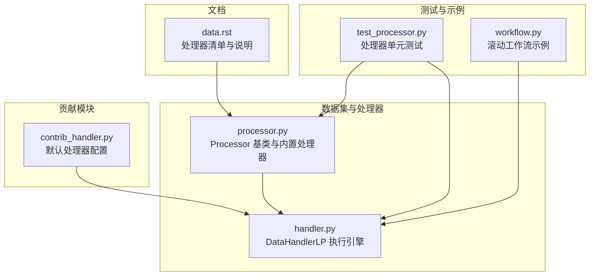
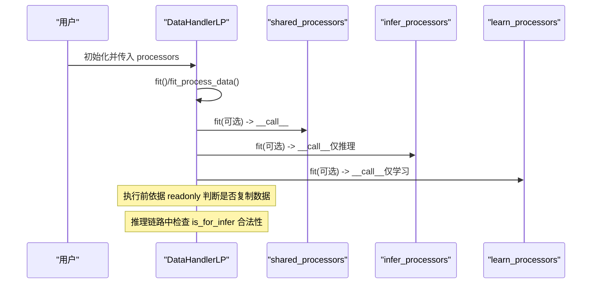
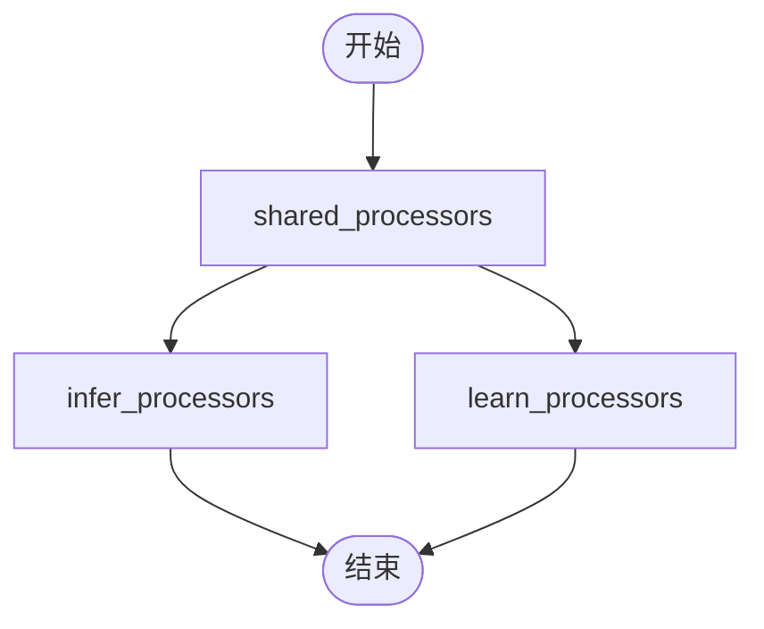
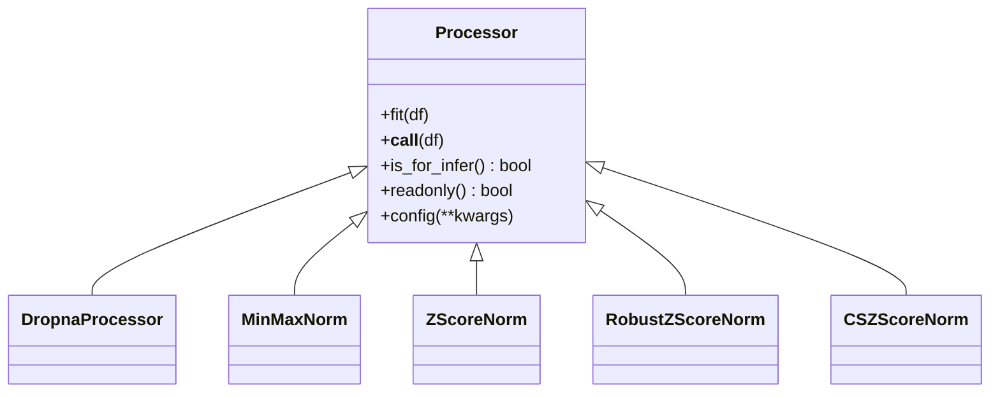

# 数据处理器

<cite>
**本文引用的文件**
- [processor.py](file://qlib/data/dataset/processor.py)
- [handler.py](file://qlib/data/dataset/handler.py)
- [test_processor.py](file://tests/data_mid_layer_tests/test_processor.py)
- [workflow.py](file://examples/rolling_process_data/workflow.py)
- [contrib_handler.py](file://qlib/contrib/data/handler.py)
- [data.rst](file://docs/component/data.rst)
</cite>

## 目录
1. [简介](#简介)
2. [项目结构](#项目结构)
3. [核心组件](#核心组件)
4. [架构总览](#架构总览)
5. [组件详解](#组件详解)
6. [依赖关系分析](#依赖关系分析)
7. [性能考量与优化建议](#性能考量与优化建议)
8. [故障排查指南](#故障排查指南)
9. [结论](#结论)
10. [附录：自定义处理器开发指南](#附录自定义处理器开发指南)

## 简介
本文件系统性梳理 Qlib 数据处理流水线中的处理器体系，重点解析 Processor 基类的 readonly 与 is_for_infer 方法在 DataHandler 中的执行顺序与内存安全控制；深入讲解 DropnaProcessor、MinMaxNorm、ZScoreNorm 等内置处理器的实现细节与适用场景；说明 shared/infer/learn 三类处理器的执行顺序及对训练-推理一致性的关键影响；并提供自定义处理器开发与集成到工作流的最佳实践与性能优化建议。

## 项目结构
围绕数据处理器的核心代码主要位于以下模块：
- 处理器基类与内置处理器：qlib/data/dataset/processor.py
- 数据处理器执行引擎：qlib/data/dataset/handler.py
- 测试用例与示例工作流：tests/data_mid_layer_tests/test_processor.py、examples/rolling_process_data/workflow.py
- 贡献模块中的默认处理器配置：qlib/contrib/data/handler.py
- 文档参考：docs/component/data.rst

图表来源
- [processor.py](file://qlib/data/dataset/processor.py#L35-L120)
- [handler.py](file://qlib/data/dataset/handler.py#L430-L620)
- [test_processor.py](file://tests/data_mid_layer_tests/test_processor.py#L1-L76)
- [workflow.py](file://examples/rolling_process_data/workflow.py#L60-L90)
- [contrib_handler.py](file://qlib/contrib/data/handler.py#L12-L45)
- [data.rst](file://docs/component/data.rst#L427-L446)

章节来源
- [processor.py](file://qlib/data/dataset/processor.py#L1-L120)
- [handler.py](file://qlib/data/dataset/handler.py#L430-L620)

## 核心组件
- Processor 基类
  - 提供 fit 与 __call__ 接口，支持“可学习”的数据处理参数估计与数据变换。
  - readonly：指示处理器是否只读访问输入数据，帮助 DataHandler 避免不必要的数据拷贝。
  - is_for_infer：指示处理器是否可用于推理阶段，用于在推理链路中进行合法性检查。
  - config：支持设置 fit_start_time/fit_end_time 等关键参数。
- 内置处理器
  - DropnaProcessor：按字段组删除缺失值，readonly=True。
  - MinMaxNorm：基于指定时间窗口计算每列最小/最大值进行归一化，需 fit。
  - ZScoreNorm：基于指定时间窗口计算均值/标准差进行标准化，需 fit。
  - RobustZScoreNorm：使用稳健统计量（中位数与MAD）进行标准化，并可选裁剪异常值。
  - CSZScoreNorm：按日期分组进行跨截面标准化。
  - 其他：Fillna、ProcessInf、CSRankNorm、CSZFillna、TimeRangeFlt 等。
- DataHandlerLP 执行引擎
  - 支持 shared/infer/learn 三段式处理器链路，独立或追加两种执行模式。
  - 在每个阶段前根据 readonly 判断是否复制原始数据以避免原地修改。
  - 对推理链路进行 is_for_infer 合法性检查。

章节来源
- [processor.py](file://qlib/data/dataset/processor.py#L35-L120)
- [handler.py](file://qlib/data/dataset/handler.py#L430-L620)

## 架构总览
下图展示了 DataHandlerLP 的数据处理流水线，以及 Processor 基类 readonly/is_for_infer 对内存安全与执行顺序的约束。

图表来源
- [handler.py](file://qlib/data/dataset/handler.py#L514-L611)
- [processor.py](file://qlib/data/dataset/processor.py#L62-L81)

## 组件详解

### Processor 基类与 readonly/is_for_infer
- readonly
  - 若返回 True，表示处理器不会修改输入 DataFrame，DataHandler 可直接复用共享数据，避免拷贝。
  - 若返回 False，表示可能原地修改输入，DataHandler 将在进入该链路前复制一份数据。
- is_for_infer
  - 若返回 False，DataHandler 在推理链路中会拒绝该处理器，防止在推理阶段引入依赖标签或不适用的预处理。
- config
  - 支持设置 fit_start_time/fit_end_time，便于 MinMaxNorm/ZScoreNorm 等需要拟合统计量的处理器在正确的时间窗口内学习参数。

章节来源
- [processor.py](file://qlib/data/dataset/processor.py#L62-L92)

### DropnaProcessor
- 功能：按字段组删除缺失值，适合特征或标签维度的清洗。
- readonly：True，避免原地修改。
- 适用场景：训练/推理阶段均可使用，但若删除标签导致样本被剔除，则不适合推理链路（见 DropnaLabel）。

章节来源
- [processor.py](file://qlib/data/dataset/processor.py#L94-L103)

### MinMaxNorm
- 功能：对指定字段组进行最小-最大归一化，fit 时在指定时间窗口内计算每列的 min/max。
- readonly：False（会原地写入），但通过 DataHandler 的 readonly 检查避免对共享数据造成副作用。
- 关键点：fit_end_time 不应包含测试期信息，否则会造成数据泄漏。
- 适用场景：需要将特征压缩到固定区间（如[0,1]）时使用。

章节来源
- [processor.py](file://qlib/data/dataset/processor.py#L196-L226)

### ZScoreNorm
- 功能：对指定字段组进行标准化，fit 时在指定时间窗口内计算每列的均值/标准差。
- readonly：False（会原地写入），但通过 DataHandler 的 readonly 检查避免对共享数据造成副作用。
- 关键点：fit_end_time 不应包含测试期信息，避免数据泄漏。
- 适用场景：特征分布偏移较大或模型对数值尺度敏感时使用。

章节来源
- [processor.py](file://qlib/data/dataset/processor.py#L228-L259)

### RobustZScoreNorm
- 功能：使用稳健统计量（中位数与MAD）进行标准化，并可选裁剪异常值。
- readonly：False（会原地写入）。
- 适用场景：存在较多异常值或分布非正态时，比 ZScoreNorm 更稳健。

章节来源
- [processor.py](file://qlib/data/dataset/processor.py#L262-L298)

### CSZScoreNorm（跨截面标准化）
- 功能：按日期分组对字段组进行标准化，常用于标签的跨日标准化。
- readonly：False（会原地写入）。
- 适用场景：标签标准化、消除日间系统性偏差。

章节来源
- [processor.py](file://qlib/data/dataset/processor.py#L300-L323)

### 其他常用处理器
- Fillna：填充缺失值，支持字段组与填充值。
- ProcessInf：替换无穷大/负无穷为该列非无穷值的均值。
- CSRankNorm：按日期分组进行秩变换并归一化。
- CSZFillna：按日期分组填充缺失值。
- TimeRangeFlt：按时间范围过滤股票，注意可能引入数据泄露风险。

章节来源
- [processor.py](file://qlib/data/dataset/processor.py#L179-L194)
- [processor.py](file://qlib/data/dataset/processor.py#L161-L177)
- [processor.py](file://qlib/data/dataset/processor.py#L326-L360)
- [processor.py](file://qlib/data/dataset/processor.py#L362-L372)
- [processor.py](file://qlib/data/dataset/processor.py#L383-L420)

### DataHandlerLP 的执行顺序与一致性
- 三种处理器链路
  - shared_processors：对原始数据进行通用预处理，通常 readonly=True。
  - infer_processors：仅用于推理阶段的数据处理。
  - learn_processors：仅用于学习阶段的数据处理。
- 两种执行模式
  - PTYPE_A（追加）：先对共享数据应用 infer_processors 得到 _infer，再在 _infer 基础上追加 learn_processors 得到 _learn。
  - PTYPE_I（独立）：_infer 仅由 shared + infer；_learn 仅由 shared + learn。
- readonly 与拷贝策略
  - 在进入每个链路前，若链路中存在非 readonly 处理器，则复制一份数据，避免原地修改影响后续链路。
- is_for_infer 合法性
  - 推理链路中，若处理器 is_for_infer 返回 False，将抛出错误，防止在推理阶段使用不适用的处理器。
- 训练-推理一致性
  - shared/infer/learn 的划分确保训练与推理的预处理路径清晰分离，避免标签信息泄露到推理阶段，提升一致性与可解释性。

图表来源
- [handler.py](file://qlib/data/dataset/handler.py#L426-L436)
- [handler.py](file://qlib/data/dataset/handler.py#L578-L611)

章节来源
- [handler.py](file://qlib/data/dataset/handler.py#L426-L436)
- [handler.py](file://qlib/data/dataset/handler.py#L578-L611)

### 示例工作流与默认配置
- 示例工作流
  - 使用 RollingDataWorkflow 展示了在滚动训练中动态调整 fit 时间窗口与数据分段的方法，并在推理链路中使用 RobustZScoreNorm，在学习链路中使用 DropnaLabel 和 CSZScoreNorm。
- 默认处理器配置
  - Alpha360/Alpha158 等贡献模块处理器提供了默认的推理/学习处理器列表，其中 Alpha158 的默认学习链路包含 DropnaLabel 与 CSZScoreNorm，推理链路包含 ProcessInf、ZScoreNorm、Fillna 等。

章节来源
- [workflow.py](file://examples/rolling_process_data/workflow.py#L60-L90)
- [contrib_handler.py](file://qlib/contrib/data/handler.py#L12-L45)
- [contrib_handler.py](file://qlib/contrib/data/handler.py#L37-L45)

## 依赖关系分析
- 处理器依赖
  - 所有处理器继承自 Processor 基类，遵循统一接口与生命周期。
  - MinMaxNorm/ZScoreNorm/RobustZScoreNorm/CSZScoreNorm 依赖时间索引切片工具 fetch_df_by_index 与字段组选择工具 get_group_columns。
- DataHandlerLP 依赖
  - 通过 init_instance_by_config 将配置转换为具体处理器实例。
  - 在 process_data 中按 readonly 与 is_for_infer 进行执行顺序与安全性控制。
- 测试与示例
  - 单元测试验证 MinMaxNorm/ZScoreNorm 的结果与手工实现一致。
  - 示例工作流演示了 fit 时间窗口与链路配置的实际使用。

图表来源
- [processor.py](file://qlib/data/dataset/processor.py#L35-L120)
- [processor.py](file://qlib/data/dataset/processor.py#L196-L323)

章节来源
- [processor.py](file://qlib/data/dataset/processor.py#L35-L120)
- [processor.py](file://qlib/data/dataset/processor.py#L196-L323)

## 性能考量与优化建议
- 避免不必要的数据拷贝
  - 尽量使用 readonly=True 的处理器（如 DropnaProcessor、DropCol、FilterCol、Fillna 等），以便 DataHandler 在进入链路前不复制数据。
  - 对于需要原地修改的处理器（如 MinMaxNorm、ZScoreNorm、RobustZScoreNorm、CSZScoreNorm），确保其仅在必要链路中使用，并尽量缩短 fit 时间窗口。
- 合理配置 fit 时间范围
  - fit_start_time/fit_end_time 必须严格限定在训练期内，不得包含测试期，防止数据泄漏。
  - 对于滚动训练，随时间滑动更新 fit 窗口，保证统计量与实际数据分布一致。
- 减少跨列操作与分组开销
  - CSZScoreNorm/CSRankNorm/CSZFillna 等跨截面操作会在日期维度进行分组，尽量缩小字段组范围，减少分组数量。
- 内存与缓存
  - 使用 DataHandlerLP 的 drop_raw 选项在不需要原始数据时释放内存。
  - 在合适场景使用缓存与增量处理，降低重复计算成本。

章节来源
- [handler.py](file://qlib/data/dataset/handler.py#L578-L611)
- [processor.py](file://qlib/data/dataset/processor.py#L196-L259)

## 故障排查指南
- 推理链路报错“仅可使用可用于推理的处理器”
  - 检查对应处理器的 is_for_infer 是否返回 True；若删除标签导致样本被剔除，应使用 DropnaLabel 并将其置于学习链路。
- 归一化/标准化结果异常
  - 检查 fit 时间窗口是否包含测试期；确认字段组选择是否正确；核对 MinMax/ZScore 的忽略逻辑（当极差为0或标准差为0时的特殊处理）。
- 数据泄漏或一致性问题
  - 确认 shared/infer/learn 的链路划分是否符合预期；避免在推理链路中使用依赖标签的处理器。
- 性能瓶颈
  - 检查是否存在大量非 readonly 处理器链路；尝试将部分处理移到 shared 或改为 readonly 实现；缩小字段组与时间窗口。

章节来源
- [handler.py](file://qlib/data/dataset/handler.py#L530-L541)
- [test_processor.py](file://tests/data_mid_layer_tests/test_processor.py#L1-L76)

## 结论
Qlib 的数据处理器体系通过 Processor 基类的 readonly 与 is_for_infer 机制，配合 DataHandlerLP 的三段式链路与 readonly 拷贝策略，实现了训练-推理一致且可扩展的数据预处理流水线。内置处理器覆盖了常见的缺失值处理、归一化/标准化、跨截面处理等需求。通过合理配置 fit 时间窗口与链路划分，可以有效避免数据泄漏并提升性能。

## 附录：自定义处理器开发指南
- 开发步骤
  - 新建类继承自 Processor。
  - 实现 __call__ 完成数据变换；如需 fit，请实现 fit 并在 __call__ 中使用学习到的参数。
  - 如为只读变换，重写 readonly 返回 True；如不能用于推理，重写 is_for_infer 返回 False。
  - 在 config 中支持 fit_start_time/fit_end_time 参数（如适用）。
- 集成到工作流
  - 在 DataHandlerLP 的 infer_processors/learn_processors/shared_processors 中以字典形式配置，包含 class 与 kwargs。
  - 对于需要 fit 的处理器，确保在初始化或 setup_data 时提供正确的 fit_start_time/fit_end_time。
- 最佳实践
  - 明确 readonly 语义，优先使用只读处理器。
  - 严格区分推理与学习链路，避免在推理链路使用依赖标签的处理器。
  - 缩小字段组与时间窗口，减少不必要的计算与内存占用。

章节来源
- [processor.py](file://qlib/data/dataset/processor.py#L35-L92)
- [handler.py](file://qlib/data/dataset/handler.py#L437-L511)
- [workflow.py](file://examples/rolling_process_data/workflow.py#L60-L90)
- [contrib_handler.py](file://qlib/contrib/data/handler.py#L12-L45)