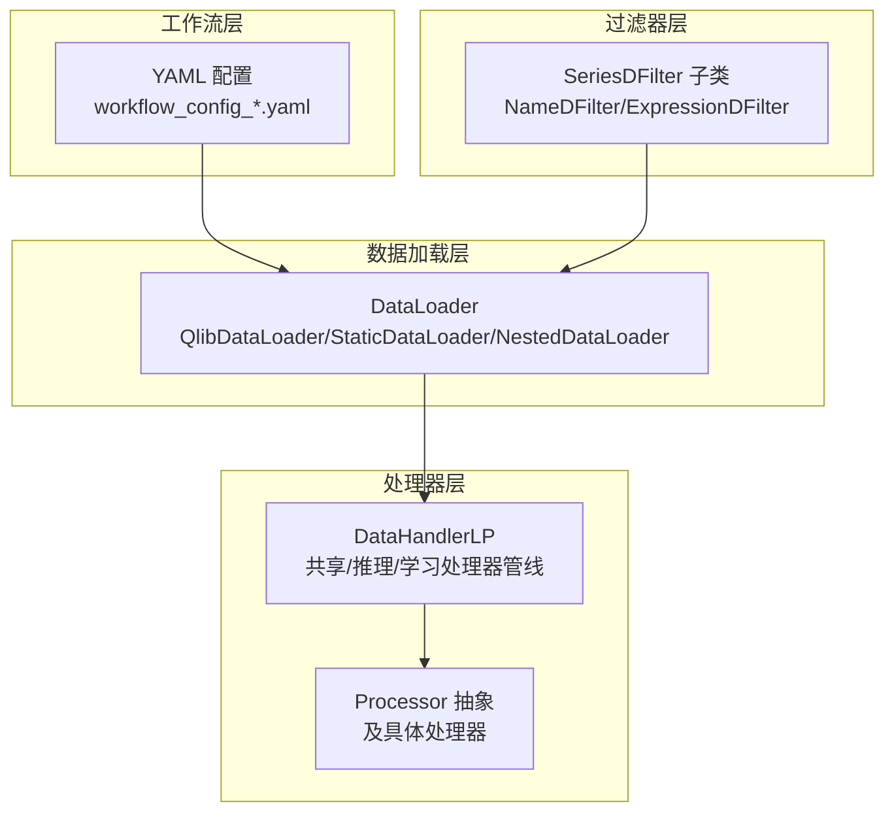
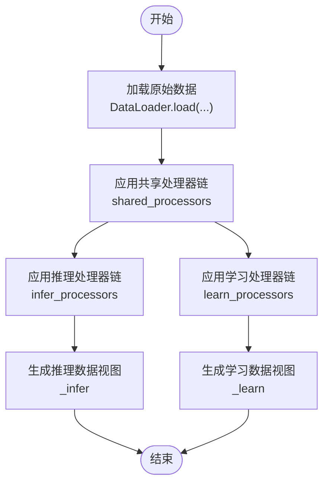
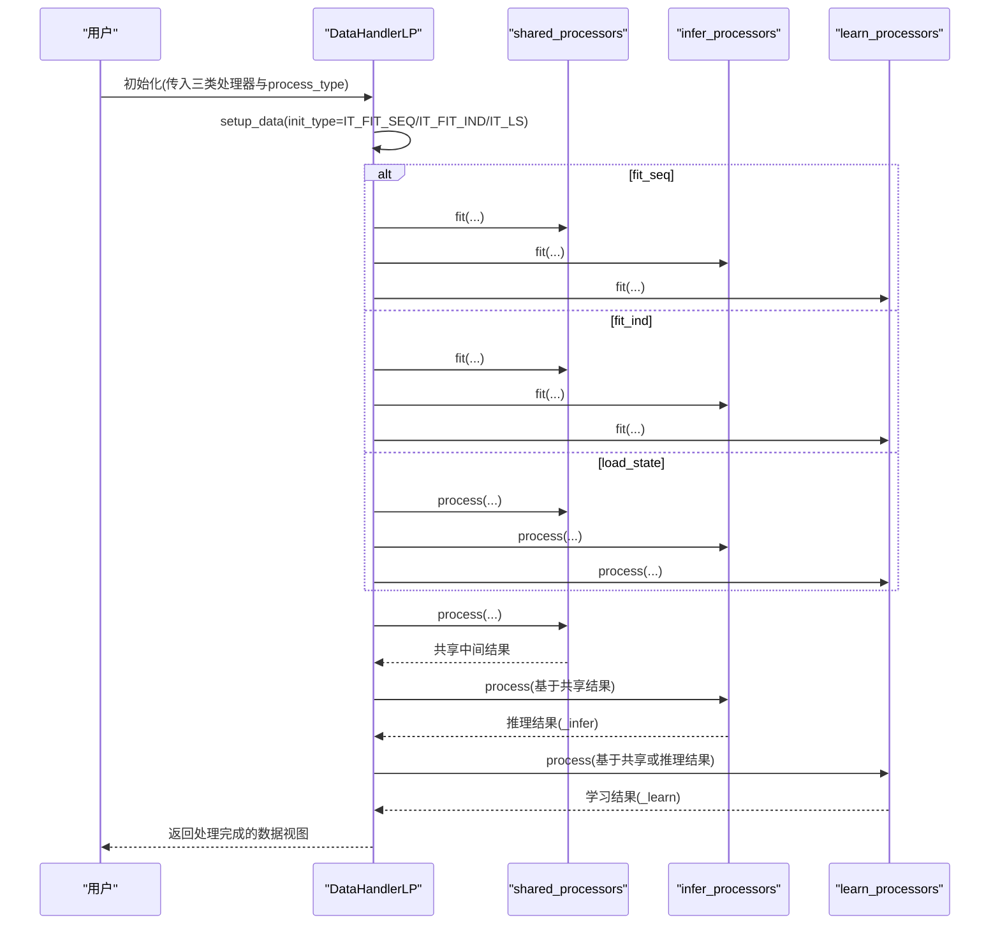
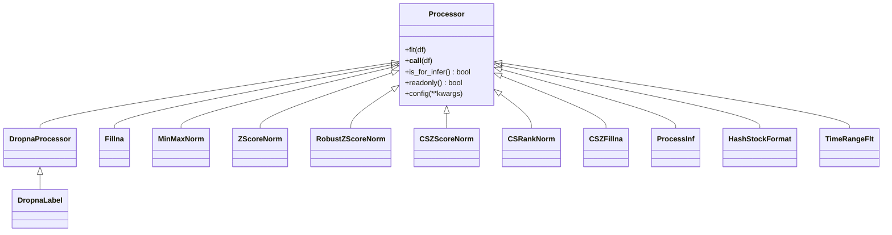
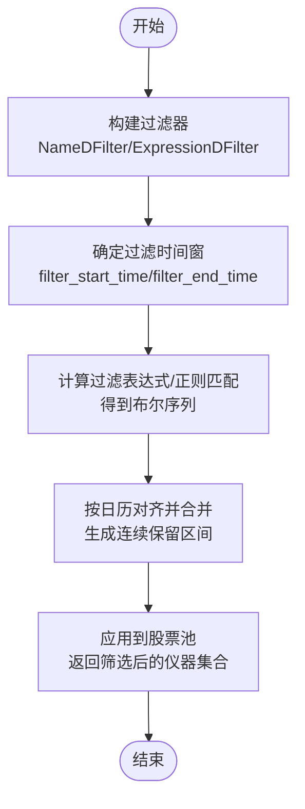
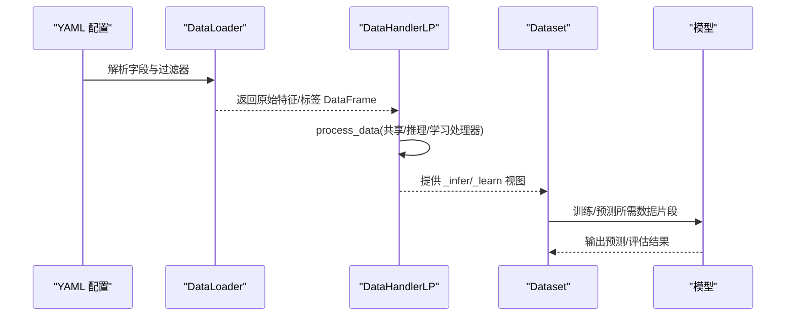
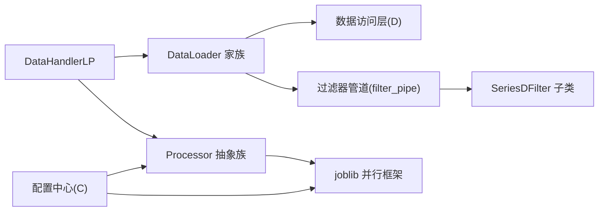

# 特征处理管道

<cite>
**本文引用的文件列表**
- [handler.py](file://qlib/data/dataset/handler.py)
- [processor.py](file://qlib/data/dataset/processor.py)
- [loader.py](file://qlib/data/dataset/loader.py)
- [filter.py](file://qlib/data/filter.py)
- [data.rst](file://docs/component/data.rst)
- [data.py](file://qlib/data/data.py)
- [paral.py](file://qlib/utils/paral.py)
- [config.py](file://qlib/config.py)
- [handler.py（contrib）](file://qlib/contrib/data/handler.py)
- [workflow_config_lightgbm_Alpha158.yaml](file://examples/benchmarks/LightGBM/workflow_config_lightgbm_Alpha158.yaml)
</cite>

## 目录
1. [引言](#引言)
2. [项目结构](#项目结构)
3. [核心组件](#核心组件)
4. [架构总览](#架构总览)
5. [详细组件分析](#详细组件分析)
6. [依赖关系分析](#依赖关系分析)
7. [性能考量](#性能考量)
8. [故障排查指南](#故障排查指南)
9. [结论](#结论)
10. [附录](#附录)

## 引言
本文件系统性阐述 Qlib 中 DataHandler 如何协调数据加载、过滤、处理的完整流程，重点覆盖：
- shared_processors、infer_processors、learn_processors 三类处理器的协同工作机制
- PTYPE_I（独立）与 PTYPE_A（追加）两种处理模式的区别与选择依据
- ExpressionDFilter 与 NameDFilter 在动态股票池构建中的应用方法
- 结合 workflow 配置示例，展示从原始数据到模型输入特征的端到端处理流程
- 管道性能调优实践建议：并行化配置与内存管理策略

## 项目结构
围绕特征处理管道，涉及的关键模块与职责如下：
- 数据加载层：DataLoader 及其子类负责从底层数据源加载原始特征与标签
- 处理器层：Processor 抽象及具体处理器（如归一化、填充、去空等）对数据进行变换
- 过滤器层：SeriesDFilter 的子类（NameDFilter、ExpressionDFilter）用于动态筛选股票池
- 处理器管线：DataHandlerLP 将上述能力整合为可配置的处理流水线，并支持推理与学习两套数据视图
- 工作流层：通过 YAML 配置驱动 DataHandler 与 Dataset 的装配，形成完整的训练/推理闭环

图表来源
- [loader.py](file://qlib/data/dataset/loader.py#L1-L120)
- [handler.py](file://qlib/data/dataset/handler.py#L383-L787)
- [filter.py](file://qlib/data/filter.py#L1-L120)
- [workflow_config_lightgbm_Alpha158.yaml](file://examples/benchmarks/LightGBM/workflow_config_lightgbm_Alpha158.yaml#L1-L72)

章节来源
- [loader.py](file://qlib/data/dataset/loader.py#L1-L120)
- [handler.py](file://qlib/data/dataset/handler.py#L383-L787)
- [filter.py](file://qlib/data/filter.py#L1-L120)
- [workflow_config_lightgbm_Alpha158.yaml](file://examples/benchmarks/LightGBM/workflow_config_lightgbm_Alpha158.yaml#L1-L72)

## 核心组件
- DataHandlerLP：提供 raw/infer/learn 三种数据视图；支持 PTYPE_I 与 PTYPE_A 两种处理模式；具备 fit/process 流程与只读优化
- Processor 抽象与常用处理器：Dropna、Fillna、ZScoreNorm、CSZScoreNorm、CSRankNorm 等
- DataLoader：统一加载接口，支持多组字段拼接、静态数据装载、嵌套组合
- SeriesDFilter：动态过滤器基类，提供基于表达式或名称规则的股票池筛选
- 工作流配置：通过 YAML 驱动 DataHandler 与 Dataset 组装，指定时间窗、过滤器、处理器等

章节来源
- [handler.py](file://qlib/data/dataset/handler.py#L383-L787)
- [processor.py](file://qlib/data/dataset/processor.py#L1-L120)
- [loader.py](file://qlib/data/dataset/loader.py#L1-L120)
- [filter.py](file://qlib/data/filter.py#L1-L120)
- [data.rst](file://docs/component/data.rst#L320-L450)

## 架构总览
DataHandlerLP 的处理流程分为“共享处理器链 + 推理处理器链 + 学习处理器链”，并根据 process_type 决定学习链的起点与是否复用推理链结果。

图表来源
- [handler.py](file://qlib/data/dataset/handler.py#L553-L614)

章节来源
- [handler.py](file://qlib/data/dataset/handler.py#L553-L614)

## 详细组件分析

### DataHandlerLP：三类处理器与两类处理模式
- 三类处理器
  - shared_processors：对原始数据进行一次性预处理，通常包含跨时间窗口的统计参数计算
  - infer_processors：仅用于推理阶段的数据变换，如标准化、无穷值处理、缺失值填充等
  - learn_processors：仅用于学习阶段的数据变换，如丢弃含标签的样本、标签标准化等
- 两类处理模式
  - PTYPE_I（独立）：学习链从共享数据起点开始，推理链与学习链互不复用
  - PTYPE_A（追加）：学习链从推理链结果继续执行，适合需要在推理后进一步加工学习数据的情形
- 关键行为
  - process_data：按顺序执行各链，支持 with_fit 模式；对只读处理器避免复制以节省内存
  - fit_process_data：先 fit 后 process，确保参数估计与应用一致
  - drop_raw：可选删除原始数据以降低内存占用

图表来源
- [handler.py](file://qlib/data/dataset/handler.py#L511-L614)

章节来源
- [handler.py](file://qlib/data/dataset/handler.py#L430-L614)

### 处理器抽象与常用处理器
- Processor 抽象
  - fit(df)：学习参数（如统计量）
  - __call__(df)：就地或返回新 DataFrame 的变换
  - is_for_infer()：是否可用于推理
  - readonly()：是否只读（影响是否复制）
  - config(**kwargs)：配置 fit 时间窗等参数
- 常用处理器
  - DropnaProcessor/DropnaLabel：丢弃含空值的样本或标签
  - Fillna：按字段组填充缺失值
  - MinMaxNorm/ZScoreNorm/RobustZScoreNorm：数值归一化
  - CSZScoreNorm/CSRankNorm/CSZFillna：跨截面标准化/排名/填充
  - ProcessInf：将无穷大替换为列均值
  - HashStockFormat：转换为哈希存储格式
  - TimeRangeFlt：基于起止时间过滤股票

图表来源
- [processor.py](file://qlib/data/dataset/processor.py#L1-L120)
- [processor.py](file://qlib/data/dataset/processor.py#L120-L220)
- [processor.py](file://qlib/data/dataset/processor.py#L220-L320)
- [processor.py](file://qlib/data/dataset/processor.py#L320-L420)

章节来源
- [processor.py](file://qlib/data/dataset/processor.py#L1-L120)
- [processor.py](file://qlib/data/dataset/processor.py#L120-L220)
- [processor.py](file://qlib/data/dataset/processor.py#L220-L320)
- [processor.py](file://qlib/data/dataset/processor.py#L320-L420)

### 动态股票池过滤器：ExpressionDFilter 与 NameDFilter
- SeriesDFilter 基类
  - 提供过滤时间窗、布尔序列构造与合并逻辑
- NameDFilter
  - 基于正则表达式匹配股票名称，生成时间序列上的保留区间
- ExpressionDFilter
  - 基于表达式规则（基础特征、横截面特征、时序特征）计算过滤条件，动态生成保留区间
- 使用场景
  - 在 DataLoader 加载前通过 filter_pipe 对股票池进行筛选，减少后续处理规模
  - 支持 keep 参数控制缺失时间段的保留策略

图表来源
- [filter.py](file://qlib/data/filter.py#L1-L120)
- [filter.py](file://qlib/data/filter.py#L265-L376)

章节来源
- [filter.py](file://qlib/data/filter.py#L1-L120)
- [filter.py](file://qlib/data/filter.py#L265-L376)
- [data.rst](file://docs/component/data.rst#L320-L360)

### 端到端工作流：从原始数据到模型输入
- YAML 配置要点
  - data_handler_config：指定时间窗、拟合时间窗、市场/股票池、过滤器管道
  - dataset：指定 DataHandler 类型（如 Alpha158），并划分训练/验证/测试分段
- 实际流程
  - DataLoader 依据配置加载特征与标签
  - DataHandlerLP 应用 shared/infer/learn 处理器链
  - Dataset 从 DataHandlerLP 获取训练/验证/测试片段
  - 模型在学习阶段使用 _learn，在推理阶段使用 _infer

图表来源
- [loader.py](file://qlib/data/dataset/loader.py#L120-L228)
- [handler.py](file://qlib/data/dataset/handler.py#L553-L614)
- [workflow_config_lightgbm_Alpha158.yaml](file://examples/benchmarks/LightGBM/workflow_config_lightgbm_Alpha158.yaml#L1-L72)

章节来源
- [loader.py](file://qlib/data/dataset/loader.py#L120-L228)
- [handler.py](file://qlib/data/dataset/handler.py#L553-L614)
- [workflow_config_lightgbm_Alpha158.yaml](file://examples/benchmarks/LightGBM/workflow_config_lightgbm_Alpha158.yaml#L1-L72)

### DataHandlerLP 的默认实现与扩展
- 默认处理器配置
  - Alpha158/Alpha360 等内置处理器配置示例，展示如何在不同任务中选择不同的推理/学习处理器链
- 扩展点
  - 自定义 DataHandlerLP 子类，重写 get_feature_config/get_label_config
  - 通过 check_transform_proc 注入 fit_start_time/fit_end_time 等参数

章节来源
- [handler.py（contrib）](file://qlib/contrib/data/handler.py#L1-L158)

## 依赖关系分析
- 组件耦合
  - DataHandlerLP 依赖 Processor 抽象族与 DataLoader 家族
  - DataLoader 依赖数据访问层（D）与过滤器管道
  - 过滤器依赖日历与表达式求值（DatasetD）
- 外部依赖
  - joblib 并行框架用于跨日期分组的并行处理
  - 配置中心（C）提供 CPU 数量与缓存策略

图表来源
- [handler.py](file://qlib/data/dataset/handler.py#L383-L787)
- [processor.py](file://qlib/data/dataset/processor.py#L1-L120)
- [loader.py](file://qlib/data/dataset/loader.py#L1-L120)
- [filter.py](file://qlib/data/filter.py#L1-L120)
- [paral.py](file://qlib/utils/paral.py#L1-L120)
- [config.py](file://qlib/config.py#L104-L132)

章节来源
- [handler.py](file://qlib/data/dataset/handler.py#L383-L787)
- [processor.py](file://qlib/data/dataset/processor.py#L1-L120)
- [loader.py](file://qlib/data/dataset/loader.py#L1-L120)
- [filter.py](file://qlib/data/filter.py#L1-L120)
- [paral.py](file://qlib/utils/paral.py#L1-L120)
- [config.py](file://qlib/config.py#L104-L132)

## 性能考量
- 并行化配置
  - datetime_groupby_apply：按日期分组并行处理，支持 n_jobs 与 resample 规则
  - ParallelExt：封装 joblib.Parallel，支持 maxtasksperchild 控制子进程生命周期
  - 建议：对跨截面操作（如 CSZScoreNorm）启用并行，合理设置 n_jobs 与 resample 规则
- 内存管理策略
  - readonly 优化：只读处理器链避免复制，显著降低内存峰值
  - drop_raw：在不需要原始数据时删除 _data，释放内存
  - 分批处理：对大规模数据采用分段迭代（如 get_range_iterator）逐步处理
- 缓存与磁盘
  - DiskDatasetCache/DiskExpressionCache：利用磁盘缓存减少重复计算
  - 注意：缓存命中与失效策略需结合业务场景权衡

章节来源
- [paral.py](file://qlib/utils/paral.py#L1-L120)
- [config.py](file://qlib/config.py#L104-L132)
- [handler.py](file://qlib/data/dataset/handler.py#L553-L614)

## 故障排查指南
- 常见问题
  - 推理链处理器不可用于学习：DataHandlerLP 在推理链校验 is_for_infer，若错误放入 learn_processors 将抛出类型错误
  - fit 时间窗泄漏：归一化类要求 fit_end_time 不包含测试数据信息，否则导致数据泄露
  - 无穷值与缺失值：ProcessInf 与 Fillna 可分别处理无穷值与缺失值，注意跨截面填充与整体填充的差异
  - 过滤器时间窗不一致：ExpressionDFilter/NameDFilter 的 filter_start_time/filter_end_time 与查询时间窗交集决定过滤范围
- 定位手段
  - 使用 TimeInspector 日志定位耗时步骤
  - 逐步缩小处理器链，确认问题出现在哪一步骤
  - 检查 readonly 与 copy 行为，避免不必要的内存复制

章节来源
- [handler.py](file://qlib/data/dataset/handler.py#L530-L542)
- [processor.py](file://qlib/data/dataset/processor.py#L196-L260)
- [filter.py](file://qlib/data/filter.py#L312-L376)

## 结论
DataHandlerLP 将“共享-推理-学习”三层处理器链与“独立/追加”两类处理模式有机结合，既保证了推理与学习的灵活性，又通过只读优化与并行化策略提升了整体性能。配合动态过滤器与标准工作流配置，能够高效地从原始数据构建面向模型的高质量特征输入，满足从研究到生产的多种需求。

## 附录
- 快速参考
  - 处理器链配置：在 DataHandlerLP 初始化时传入 shared/infer/learn 三类处理器
  - 处理模式选择：PTYPE_A 更常见，适合在推理后继续加工学习数据；PTYPE_I 适用于两套链完全独立的场景
  - 动态过滤器：ExpressionDFilter 支持复杂表达式，NameDFilter 支持正则匹配，二者均可通过 filter_pipe 注入 DataLoader
  - 工作流装配：YAML 中通过 dataset.handler 指向具体 DataHandler 类（如 Alpha158），并划分 segments

章节来源
- [handler.py](file://qlib/data/dataset/handler.py#L430-L614)
- [filter.py](file://qlib/data/filter.py#L265-L376)
- [workflow_config_lightgbm_Alpha158.yaml](file://examples/benchmarks/LightGBM/workflow_config_lightgbm_Alpha158.yaml#L1-L72)