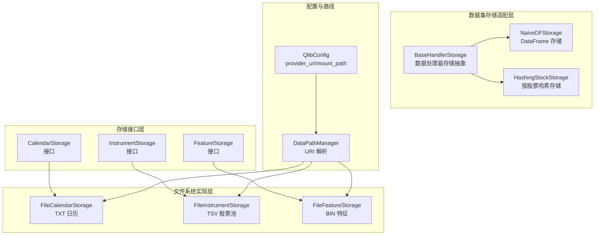
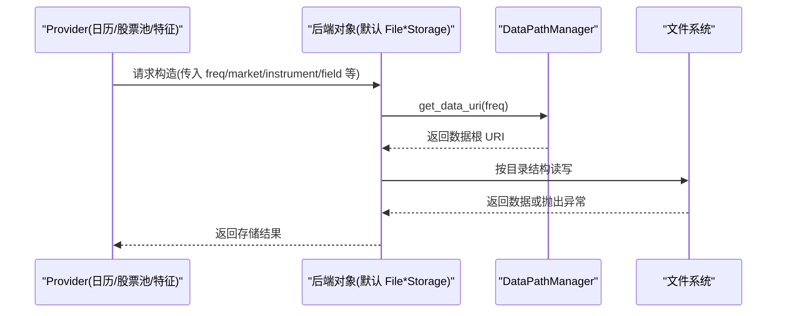
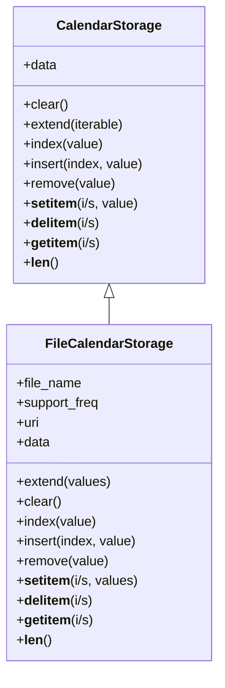
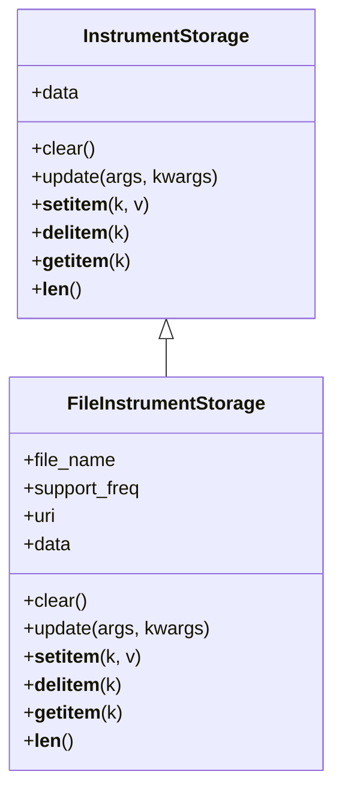
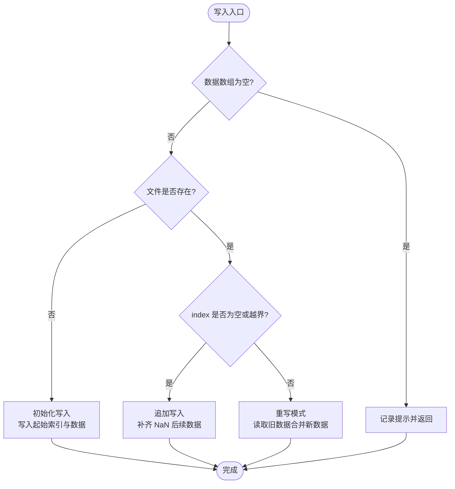
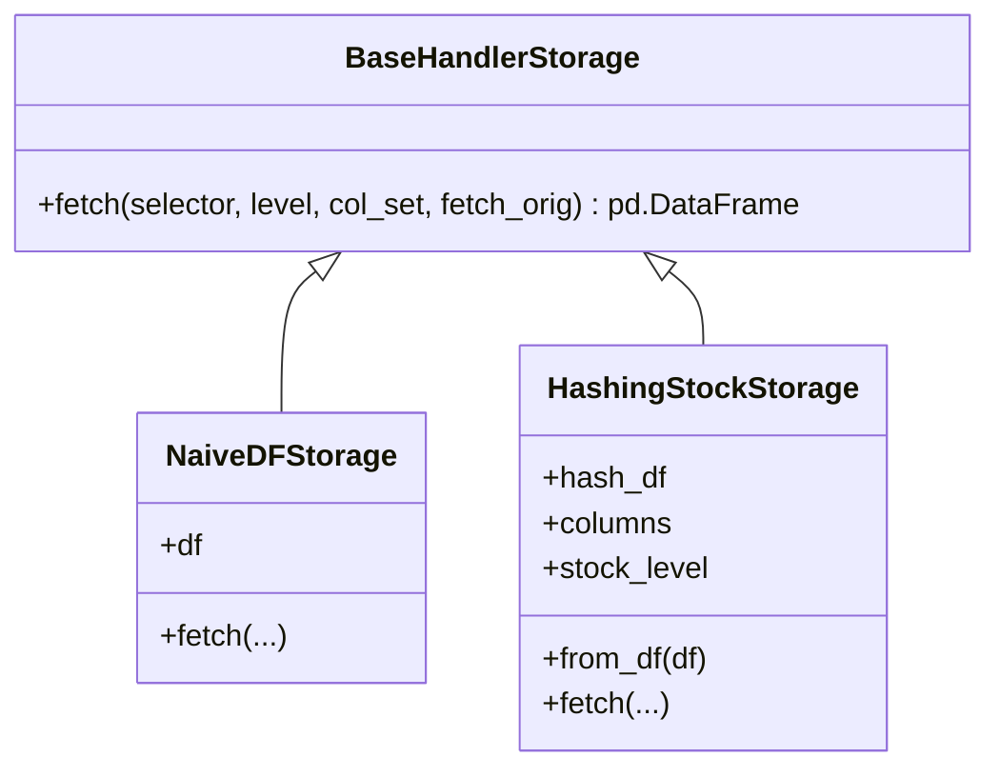

# 数据存储机制

<cite>
**本文引用的文件列表**
- [storage.py](file://qlib/data/storage/storage.py)
- [file_storage.py](file://qlib/data/storage/file_storage.py)
- [storage.py](file://qlib/data/dataset/storage.py)
- [config.py](file://qlib/config.py)
- [data.py](file://qlib/data/data.py)
- [cache.py](file://qlib/data/cache.py)
- [__init__.py](file://qlib/data/storage/__init__.py)
</cite>

## 目录
1. [简介](#简介)
2. [项目结构](#项目结构)
3. [核心组件](#核心组件)
4. [架构总览](#架构总览)
5. [详细组件分析](#详细组件分析)
6. [依赖关系分析](#依赖关系分析)
7. [性能考量](#性能考量)
8. [故障排查指南](#故障排查指南)
9. [结论](#结论)
10. [附录](#附录)

## 简介
本技术文档系统性阐述 Qlib 的数据存储机制，重点覆盖三大存储接口：CalendarStorage（日历存储）、InstrumentStorage（股票池存储）与 FeatureStorage（特征存储）。文档将：
- 解释基于文件系统的数据持久化格式与目录结构规范；
- 文档化存储插件的扩展方式，指导开发者实现自定义存储后端（如数据库、云存储）；
- 说明数据版本管理与元数据维护机制；
- 提供大规模数据集的存储性能调优建议。

## 项目结构
围绕数据存储的核心模块分布如下：
- 接口定义层：在 storage.py 中定义抽象接口与类型别名；
- 文件系统实现层：在 file_storage.py 中提供 FileCalendarStorage、FileInstrumentStorage、FileFeatureStorage；
- 数据集存储适配层：dataset/storage.py 定义数据处理器的数据存储抽象；
- 配置与路径解析：config.py 中的 DataPathManager 负责根据 provider_uri 和 mount_path 计算数据 URI；
- Provider 默认后端绑定：data.py 将 Provider 与默认 File*Storage 后端进行绑定；
- 缓存与元数据：cache.py 展示了缓存与元数据更新的实践模式。

图表来源
- [storage.py](file://qlib/data/storage/storage.py#L84-L189)
- [storage.py](file://qlib/data/storage/storage.py#L191-L253)
- [storage.py](file://qlib/data/storage/storage.py#L255-L495)
- [file_storage.py](file://qlib/data/storage/file_storage.py#L76-L190)
- [file_storage.py](file://qlib/data/storage/file_storage.py#L192-L283)
- [file_storage.py](file://qlib/data/storage/file_storage.py#L285-L380)
- [storage.py](file://qlib/data/dataset/storage.py#L12-L51)
- [storage.py](file://qlib/data/dataset/storage.py#L54-L86)
- [storage.py](file://qlib/data/dataset/storage.py#L88-L192)
- [config.py](file://qlib/config.py#L323-L422)

章节来源
- [storage.py](file://qlib/data/storage/storage.py#L1-L120)
- [file_storage.py](file://qlib/data/storage/file_storage.py#L1-L120)
- [config.py](file://qlib/config.py#L323-L422)

## 核心组件
- CalendarStorage：面向时间序列日历的增删改查与长度操作，支持切片访问与索引定位。
- InstrumentStorage：面向市场与频率的股票池映射，键为股票代码，值为时间段区间列表。
- FeatureStorage：面向单个特征的时间序列存储，支持写入、重写、重采样基线（rebase）、范围读取等。

章节来源
- [storage.py](file://qlib/data/storage/storage.py#L84-L189)
- [storage.py](file://qlib/data/storage/storage.py#L191-L253)
- [storage.py](file://qlib/data/storage/storage.py#L255-L495)

## 架构总览
下图展示了 Provider 与默认 File*Storage 的绑定关系，以及 DataPathManager 如何根据 provider_uri/mount_path 生成数据 URI，最终落到文件系统上的目录结构。

图表来源
- [data.py](file://qlib/data/data.py#L49-L83)
- [config.py](file://qlib/config.py#L366-L384)
- [file_storage.py](file://qlib/data/storage/file_storage.py#L60-L73)

## 详细组件分析

### CalendarStorage 分析
- 设计要点
  - 支持整数索引与切片访问，行为与 Python 列表一致；
  - 提供 clear、extend、index、insert、remove、__setitem__、__delitem__、__getitem__、__len__ 等方法；
  - 通过 FileCalendarStorage 实现 TXT 文件读写，支持未来交易日标记；
  - 支持不同频率的日历回采（resample），以统一到目标频率。
- 文件系统格式与目录规范
  - 目录：{data_root}/{freq}/calendars/
  - 文件命名：{freq}.txt 或 {freq}_future.txt（未来标志）
  - 内容：每行一个日期字符串；读取时去除空白行。
- 性能与可用性
  - 可选启用读缓存（内存缓存），减少重复读取；
  - 当目标频率不存在时，自动寻找最近可回采频率并转换。

图表来源
- [storage.py](file://qlib/data/storage/storage.py#L84-L189)
- [file_storage.py](file://qlib/data/storage/file_storage.py#L76-L190)

章节来源
- [storage.py](file://qlib/data/storage/storage.py#L84-L189)
- [file_storage.py](file://qlib/data/storage/file_storage.py#L76-L190)

### InstrumentStorage 分析
- 设计要点
  - 键为股票代码，值为时间段区间列表（起止时间）；
  - 支持 update、__setitem__、__delitem__、__getitem__、__len__；
  - 通过 FileInstrumentStorage 实现 TSV 文件读写，包含三列：symbol、start_datetime、end_datetime。
- 文件系统格式与目录规范
  - 目录：{data_root}/{freq}/instruments/
  - 文件命名：{market}.txt（小写）
  - 内容：制表符分隔的三列，按 symbol 聚合，每个 symbol 多行表示多个区间。
- 性能与可用性
  - 读取时仅加载必要列，解析为字典结构；
  - 更新采用全量读取-修改-落盘的方式。

图表来源
- [storage.py](file://qlib/data/storage/storage.py#L191-L253)
- [file_storage.py](file://qlib/data/storage/file_storage.py#L192-L283)

章节来源
- [storage.py](file://qlib/data/storage/storage.py#L191-L253)
- [file_storage.py](file://qlib/data/storage/file_storage.py#L192-L283)

### FeatureStorage 分析
- 设计要点
  - 面向单个 instrument.field 在某频率下的时间序列；
  - 支持 write（追加或重写）、rebase（调整起止索引）、rewrite（整体重写）、__getitem__（整数或切片）、__len__；
  - start_index/end_index 表示存储的闭区间边界，便于增量写入与对齐。
- 文件系统格式与目录规范
  - 目录：{data_root}/{freq}/features/{instrument}/{field}.{freq}.bin
  - 文件：二进制文件，首 4 字节存储起始索引（int32 小端），后续每 4 字节存储一个浮点数（float32 小端）。
- 写入策略与重采样基线
  - 追加：当 index 为空或大于当前 end_index 时，自动填充 NaN 至目标位置再写入；
  - 重写：打开 rb+，合并旧数据与新数据，NaN 填充缺失，重新写回；
  - rebase：调整存储区间，必要时填充 NaN 并重写部分数据。

图表来源
- [file_storage.py](file://qlib/data/storage/file_storage.py#L295-L330)

章节来源
- [storage.py](file://qlib/data/storage/storage.py#L255-L495)
- [file_storage.py](file://qlib/data/storage/file_storage.py#L285-L380)

### 数据集存储适配层（HandlerStorage）
- BaseHandlerStorage：定义数据处理器的数据存储抽象 fetch 接口；
- NaiveDFStorage：直接使用 DataFrame 作为存储，适合小规模或简单场景；
- HashingStockStorage：按股票维度构建哈希表，加速随机访问单只股票数据，适合大规模多股票场景。

图表来源
- [storage.py](file://qlib/data/dataset/storage.py#L12-L51)
- [storage.py](file://qlib/data/dataset/storage.py#L54-L86)
- [storage.py](file://qlib/data/dataset/storage.py#L88-L192)

章节来源
- [storage.py](file://qlib/data/dataset/storage.py#L12-L51)
- [storage.py](file://qlib/data/dataset/storage.py#L54-L86)
- [storage.py](file://qlib/data/dataset/storage.py#L88-L192)

## 依赖关系分析
- Provider 与后端绑定
  - Provider 默认后端类名规则：CalendarProvider -> FileCalendarStorage，InstrumentProvider -> FileInstrumentStorage，FeatureProvider -> FileFeatureStorage；
  - 通过 data.py 的 get_default_backend 与 backend_obj 动态实例化。
- DataPathManager 与配置
  - config.py 中的 DataPathManager 根据 provider_uri 与 mount_path 计算数据 URI；
  - 支持本地路径与 NFS 路径两种类型，Windows 下对挂载路径有特殊处理；
  - QlibConfig.resolve_path 会规范化 provider_uri 与 mount_path，确保两者频率集合一致。
- 文件系统目录结构
  - 日历：{data_root}/{freq}/calendars/{freq}.txt 或 {freq}_future.txt
  - 股票池：{data_root}/{freq}/instruments/{market}.txt
  - 特征：{data_root}/{freq}/features/{instrument}/{field}.{freq}.bin

图表来源
- [data.py](file://qlib/data/data.py#L49-L83)
- [config.py](file://qlib/config.py#L366-L384)
- [file_storage.py](file://qlib/data/storage/file_storage.py#L60-L73)

章节来源
- [data.py](file://qlib/data/data.py#L49-L83)
- [config.py](file://qlib/config.py#L323-L422)
- [file_storage.py](file://qlib/data/storage/file_storage.py#L60-L73)

## 性能考量
- 文件系统读写
  - CalendarStorage/FileInstrumentStorage 使用文本/CSV 读写，适合中小规模数据；若日志/股票池规模较大，建议考虑二进制或数据库后端。
  - FeatureStorage 采用二进制文件，首 4 字节存储起始索引，后续按 float32 连续存储，支持高效随机访问与范围读取。
- 缓存策略
  - FileCalendarStorage 支持读缓存（内存缓存），可显著降低重复读取开销；
  - DatasetCache/DiskDatasetCache 等缓存机制可用于数据集层面的缓存与元数据维护。
- 并发与一致性
  - 缓存层存在读写冲突风险，需结合锁机制或分布式缓存策略（如 Redis）避免并发问题。
- 大规模数据优化建议
  - 使用 HashingStockStorage 加速按股票维度的随机访问；
  - 对 FeatureStorage 的写入采用批量追加与重写相结合，尽量减少频繁小粒度写入；
  - 对于超大规模数据，建议实现自定义存储后端（见下一节）。

章节来源
- [file_storage.py](file://qlib/data/storage/file_storage.py#L130-L146)
- [cache.py](file://qlib/data/cache.py#L395-L427)
- [cache.py](file://qlib/data/cache.py#L812-L839)
- [cache.py](file://qlib/data/cache.py#L1049-L1061)
- [storage.py](file://qlib/data/dataset/storage.py#L88-L192)

## 故障排查指南
- 常见错误与定位
  - 文件不存在：FileStorageMixin.check 抛出“存储不存在”异常，检查 provider_uri/mount_path 与目标频率是否匹配；
  - 频率不支持：support_freq 不包含目标 freq，需确认 provider_uri 中的频率集合或回采策略；
  - 索引越界：FeatureStorage 访问时若索引小于 start_index，抛出 IndexError；
  - 类型错误：FeatureStorage.__getitem__ 仅支持 int 或 slice，其他类型会抛出 TypeError。
- 元数据与版本
  - DatasetCache 在更新索引与元数据时会同步写入磁盘，注意权限与路径有效性；
  - 若使用 Redis 缓存，连接失败时会降级为不使用缓存并输出警告。

章节来源
- [file_storage.py](file://qlib/data/storage/file_storage.py#L65-L73)
- [file_storage.py](file://qlib/data/storage/file_storage.py#L346-L376)
- [cache.py](file://qlib/data/cache.py#L812-L839)
- [cache.py](file://qlib/data/cache.py#L1049-L1061)

## 结论
Qlib 的数据存储体系以抽象接口为核心，通过 File*Storage 提供稳定可靠的文件系统实现，并借助 DataPathManager 统一路径解析。FeatureStorage 的二进制格式与索引设计使得时间序列数据的高效读写成为可能；同时，Provider 默认后端绑定与缓存机制共同保障了工程可用性。对于更大规模与更复杂场景，开发者可参考现有接口与实现模式，快速扩展数据库或云存储后端。

## 附录

### 自定义存储后端扩展指南
- 实现步骤
  - 继承对应抽象接口：CalendarStorage、InstrumentStorage、FeatureStorage；
  - 实现 data、__getitem__、__len__、write/rebase/rewrite 等关键方法；
  - 在 Provider 中将默认后端类名映射到你的实现类（参考 data.py 的 get_default_backend）；
  - 在配置中设置 provider_uri/mount_path，确保 DataPathManager 能正确解析数据 URI。
- 注意事项
  - 明确数据格式与目录结构，保持与现有约定一致；
  - 处理好索引边界与空数据返回，保证与现有上层逻辑兼容；
  - 考虑并发安全与缓存一致性，必要时引入锁或分布式缓存。

章节来源
- [storage.py](file://qlib/data/storage/storage.py#L84-L189)
- [storage.py](file://qlib/data/storage/storage.py#L191-L253)
- [storage.py](file://qlib/data/storage/storage.py#L255-L495)
- [data.py](file://qlib/data/data.py#L49-L83)
- [config.py](file://qlib/config.py#L323-L422)

### 目录结构与持久化格式规范
- 日历（TXT）
  - 路径：{data_root}/{freq}/calendars/{freq}.txt 或 {freq}_future.txt
  - 内容：每行一个日期字符串
- 股票池（TSV）
  - 路径：{data_root}/{freq}/instruments/{market}.txt
  - 内容：三列，分别为 symbol、start_datetime、end_datetime
- 特征（BIN）
  - 路径：{data_root}/{freq}/features/{instrument}/{field}.{freq}.bin
  - 格式：首 4 字节为起始索引（int32 小端），其后每 4 字节为一个 float32 数值

章节来源
- [file_storage.py](file://qlib/data/storage/file_storage.py#L60-L73)
- [file_storage.py](file://qlib/data/storage/file_storage.py#L105-L125)
- [file_storage.py](file://qlib/data/storage/file_storage.py#L204-L237)
- [file_storage.py](file://qlib/data/storage/file_storage.py#L289-L294)

### 版本管理与元数据维护
- DatasetCache 通过索引文件与元数据文件维护数据集版本与最后更新时间；
- 更新流程：构建新索引、写入索引文件、更新元数据文件中的 last_update 字段；
- 缓存同步：支持从磁盘同步索引与追加索引，确保一致性。

章节来源
- [cache.py](file://qlib/data/cache.py#L812-L839)
- [cache.py](file://qlib/data/cache.py#L1049-L1061)