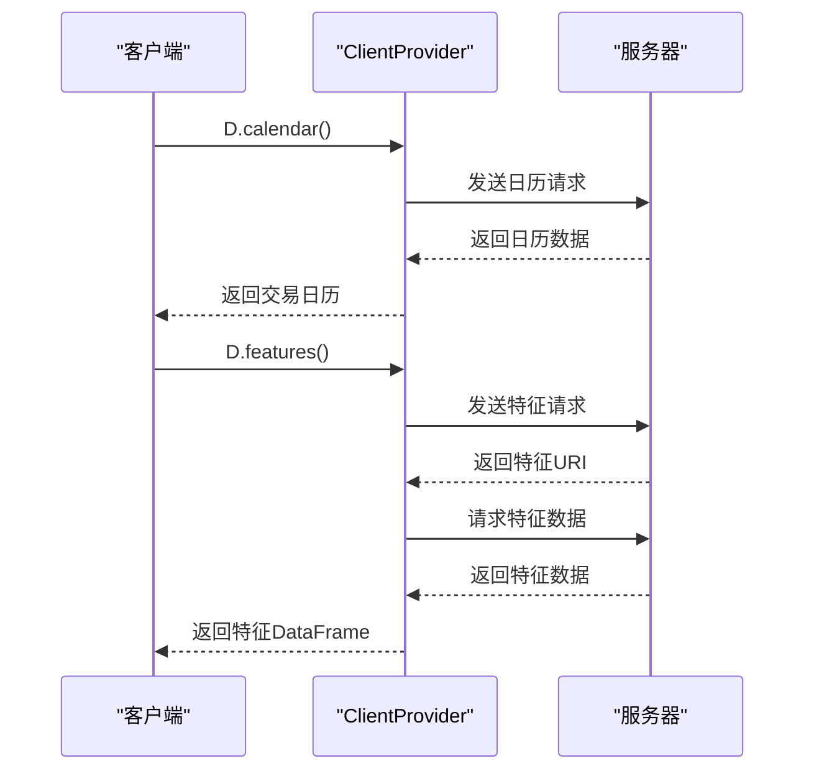
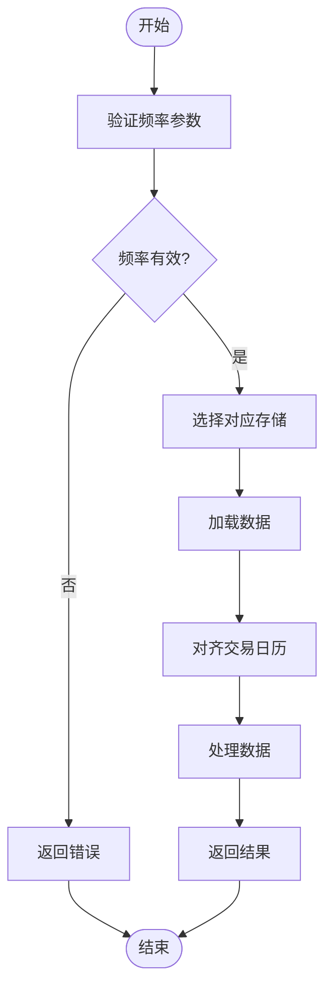
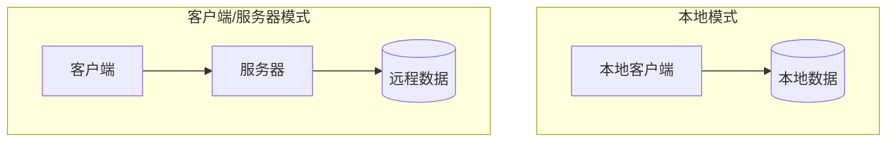

# 数据访问接口

<cite>
**本文档引用的文件**   
- [__init__.py](file://qlib/data/__init__.py)
- [data.py](file://qlib/data/data.py)
- [base.py](file://qlib/data/base.py)
- [client.py](file://qlib/data/client.py)
- [cache.py](file://qlib/data/cache.py)
- [filter.py](file://qlib/data/filter.py)
- [config.py](file://qlib/config.py)
- [workflow_by_code.py](file://examples/workflow_by_code.py)
- [PIT.rst](file://docs/advanced/PIT.rst)
- [README.md](file://scripts/data_collector/README.md)
</cite>

## 目录
1. [简介](#简介)
2. [核心API函数](#核心api函数)
3. [提供者接口设计](#提供者接口设计)
4. [数据查询语法](#数据查询语法)
5. [时间序列对齐与多频率处理](#时间序列对齐与多频率处理)
6. [客户端/服务器模式配置](#客户端服务器模式配置)
7. [性能比较与适用场景](#性能比较与适用场景)
8. [实际用例分析](#实际用例分析)
9. [结论](#结论)

## 简介

数据访问接口是QLib框架的核心组件，为量化研究提供了统一的数据访问方式。该接口通过D类和相关提供者接口，实现了对市场数据、特征数据和日历数据的高效访问。系统支持本地模式和客户端/服务器模式两种数据访问方式，满足不同场景下的需求。

数据访问接口的设计遵循模块化原则，通过抽象基类定义了统一的接口规范，同时提供了灵活的实现机制。核心功能包括：市场仪器列表获取、特征数据查询、交易日历访问等。接口还支持复杂的数据查询语法和时间序列处理，为量化策略开发提供了强大的数据支持。

**本文档引用的文件**   
- [__init__.py](file://qlib/data/__init__.py)
- [data.py](file://qlib/data/data.py)

## 核心API函数

### D.instruments() 函数

`D.instruments()` 函数用于获取指定市场的仪器列表。该函数支持多种输入参数，可以灵活地定义股票池。

```python
D.instruments(market="all", filter_pipe=None)
```

**参数说明**：
- `market`：市场标识符，可以是字符串（如"all"、"csi300"）或仪器列表
- `filter_pipe`：过滤管道，包含一系列动态过滤器

该函数返回一个字典，包含市场名称和过滤器配置。当输入为列表时，直接返回原始列表。函数内部通过`InstrumentProvider.instruments()`方法实现，支持基于表达式的动态过滤。

**Section sources**
- [data.py](file://qlib/data/data.py#L205-L264)

### D.features() 函数

`D.features()` 函数是获取特征数据的核心接口，支持多仪器、多特征的批量查询。

```python
D.features(instruments, fields, start_time=None, end_time=None, freq="day", disk_cache=None, inst_processors=[])
```

**参数说明**：
- `instruments`：仪器列表或字典
- `fields`：特征字段列表
- `start_time`、`end_time`：时间范围
- `freq`：数据频率
- `disk_cache`：磁盘缓存策略
- `inst_processors`：仪器处理器

该函数通过`DatasetProvider.dataset()`方法实现，支持并行计算和缓存机制，确保高效的数据访问。

**Section sources**
- [data.py](file://qlib/data/data.py#L1162-L1191)

### D.calendar() 函数

`D.calendar()` 函数用于获取指定时间范围内的交易日历。

```python
D.calendar(start_time=None, end_time=None, freq="day", future=False)
```

**参数说明**：
- `start_time`、`end_time`：时间范围
- `freq`：时间频率（年/季/月/周/日）
- `future`：是否包含未来交易日

该函数返回一个时间戳列表，表示指定范围内的交易日。内部通过`CalendarProvider.calendar()`方法实现，并使用内存缓存提高访问效率。

**Section sources**
- [data.py](file://qlib/data/data.py#L71-L109)

## 提供者接口设计

### 提供者接口体系

QLib的数据访问接口基于提供者模式设计，定义了一系列抽象基类：

```mermaid
classDiagram
class CalendarProvider {
+calendar(start_time, end_time, freq, future) list
+locate_index(start_time, end_time, freq, future) tuple
+_get_calendar(freq, future) tuple
+load_calendar(freq, future) list
}
class InstrumentProvider {
+instruments(market, filter_pipe) dict/list
+list_instruments(instruments, start_time, end_time, freq, as_list) dict/list
+_uri(instruments, start_time, end_time, freq, as_list) str
}
class FeatureProvider {
+feature(instrument, field, start_time, end_time, freq) pd.Series
}
class ExpressionProvider {
+expression(instrument, field, start_time, end_time, freq) pd.Series
+get_expression_instance(field) Expression
}
class DatasetProvider {
+dataset(instruments, fields, start_time, end_time, freq, inst_processors) pd.DataFrame
+_uri(instruments, fields, start_time, end_time, freq, disk_cache, inst_processors) str
}
CalendarProvider <|-- LocalCalendarProvider
InstrumentProvider <|-- LocalInstrumentProvider
FeatureProvider <|-- LocalFeatureProvider
ExpressionProvider <|-- LocalExpressionProvider
DatasetProvider <|-- LocalDatasetProvider
DatasetProvider <|-- ClientDatasetProvider
```



**Diagram sources **
- [data.py](file://qlib/data/data.py#L65-L477)

### 本地提供者实现

本地提供者从本地文件系统加载数据，是默认的数据访问模式。

#### LocalCalendarProvider

`LocalCalendarProvider` 从本地文件加载交易日历数据。它使用`ProviderBackendMixin`来管理后端存储，通过`FileCalendarStorage`读取日历文件。数据加载后会被缓存在内存中，提高后续访问效率。

#### LocalInstrumentProvider

`LocalInstrumentProvider` 管理仪器列表数据。它从本地文件加载市场仪器数据，并支持基于时间范围的过滤。仪器数据也使用内存缓存，避免重复加载。

#### LocalFeatureProvider

`LocalFeatureProvider` 负责特征数据的访问。它通过`FileFeatureStorage`从本地文件系统读取特征数据，并支持按时间范围切片访问。

**Section sources**
- [data.py](file://qlib/data/data.py#L637-L742)

### 客户端提供者实现

客户端提供者通过网络请求从服务器获取数据，支持分布式数据访问。



**Diagram sources **
- [data.py](file://qlib/data/data.py#L967-L1056)
- [client.py](file://qlib/data/client.py#L1-L104)

## 数据查询语法

### 特征表达式语法

QLib支持丰富的特征表达式语法，允许用户通过简单的字符串定义复杂的特征计算。

#### 基本特征

基本特征以`$`开头，表示直接从数据源读取的原始特征：

```python
"$close"    # 收盘价
"$open"     # 开盘价
"$volume"   # 成交量
```

#### 衍生特征

衍生特征通过操作符组合基本特征创建：

```python
"($close-$open)/$open"    # 日收益率
"$volume*$close"          # 成交额
"Ref($close, 1)"          # 昨日收盘价
"Mean($close, 5)"         # 5日移动平均
```

### 点对点(PIT)数据查询

PIT（Point-in-Time）数据用于处理财务报告等周期性数据，支持季度和年度数据查询。

```python
"$$roewa_q"    # 季度净资产收益率
"$$profit_a"   # 年度利润
```

PIT数据文件命名规则：`XXX_q.data`表示季度数据，`XXX_a.data`表示年度数据。查询时必须以`_q`或`_a`结尾。

**Section sources**
- [base.py](file://qlib/data/base.py#L266-L274)
- [PIT.rst](file://docs/advanced/PIT.rst#L134-L135)

### 过滤器语法

过滤器用于动态筛选仪器列表，支持多种过滤条件。

#### 表达式过滤器

基于特征表达式的过滤：

```python
{
    "filter_type": "ExpressionDFilter",
    "rule_expression": "$open<40",
    "filter_start_time": None,
    "filter_end_time": None,
    "keep": False
}
```

#### 名称过滤器

基于仪器名称的正则表达式过滤：

```python
{
    "filter_type": "NameDFilter",
    "name_rule_re": "SH[0-9]{4}55",
    "filter_start_time": None,
    "filter_end_time": None
}
```

**Section sources**
- [filter.py](file://qlib/data/filter.py#L51-L200)

## 时间序列对齐与多频率处理

### 时间序列对齐

QLib自动处理不同频率数据的时间序列对齐问题。当数据索引不是时间戳时，系统会自动转换为交易日历上的时间戳。

```python
def inst_calculator(inst, start_time, end_time, freq, column_names):
    # ... 计算表达式
    if not data.empty and not np.issubdtype(data.index.dtype, np.dtype("M")):
        _calendar = Cal.calendar(freq=freq)
        data.index = _calendar[data.index.values.astype(int)]
    data.index.names = ["datetime"]
    return data
```

### 多频率数据处理

系统支持多种数据频率，包括：
- 日线数据（day）
- 分钟线数据（1min, 5min等）
- 周线、月线、季线、年线数据

多频率数据通过`freq`参数指定，不同频率的数据存储在不同的文件中。系统会根据频率自动选择正确的数据源。



**Diagram sources **
- [data.py](file://qlib/data/data.py#L618-L622)

## 客户端/服务器模式配置

### 服务器端配置

服务器端需要配置数据提供者和缓存策略：

```yaml
calendar_provider: LocalCalendarProvider
instrument_provider: LocalInstrumentProvider
feature_provider: LocalFeatureProvider
dataset_provider: LocalDatasetProvider
expression_cache: DiskExpressionCache
dataset_cache: DiskDatasetCache
```

### 客户端配置

客户端通过`qlib.init()`配置连接信息：

```python
qlib.init(
    provider_uri="~/.qlib/qlib_data/cn_data",
    region=REG_CN,
    redis_host="127.0.0.1",
    redis_port=6379,
    flask_server="127.0.0.1",
    flask_port=9000
)
```

### 连接机制

客户端使用SocketIO与服务器通信：

```python
class Client:
    def __init__(self, host, port):
        self.sio = socketio.Client()
        self.server_host = host
        self.server_port = port
    
    def send_request(self, request_type, request_content, msg_queue, msg_proc_func=None):
        self.connect_server()
        self.sio.emit(request_type + "_request", request_content)
        self.sio.wait()
```

**Section sources**
- [config.py](file://qlib/config.py#L134-L184)
- [client.py](file://qlib/data/client.py#L1-L104)

## 性能比较与适用场景

### 本地模式

**优点**：
- 低延迟：数据直接从本地磁盘读取
- 高吞吐：适合大规模数据处理
- 简单部署：无需额外服务器

**缺点**：
- 存储成本：需要本地存储完整数据集
- 数据同步：多客户端间数据同步复杂

**适用场景**：
- 单机研究环境
- 大规模回测
- 离线数据分析

### 客户端/服务器模式

**优点**：
- 集中管理：数据集中存储和管理
- 资源共享：多客户端共享数据
- 弹性扩展：可扩展服务器资源

**缺点**：
- 网络延迟：受网络状况影响
- 服务器负载：需要维护服务器性能

**适用场景**：
- 团队协作环境
- 云端研究平台
- 实时数据服务



**Diagram sources **
- [data.py](file://qlib/data/data.py#L1224-L1237)

## 实际用例分析

### 跨市场数据检索

通过`D.instruments()`和`D.features()`组合，可以实现跨市场数据检索：

```python
# 获取CSI300和CSI500成分股
csi300 = D.instruments("csi300")
csi500 = D.instruments("csi500")

# 获取两个市场的收盘价数据
instruments = csi300 + csi500
fields = ["$close"]
data = D.features(instruments, fields, start_time="2020-01-01", end_time="2021-01-01")
```

### 跨周期数据处理

结合不同频率的数据进行分析：

```python
# 获取日线和分钟线数据
daily_data = D.features(instruments, ["$close"], freq="day")
min_data = D.features(instruments, ["$close"], freq="1min")

# 将分钟线数据聚合为日线数据进行对比
min_data_daily = min_data.groupby(level=0).last()
```

### 复杂特征计算

使用表达式语法创建复杂特征：

```python
# 计算波动率锥
fields = [
    "Std($close, 20)/Mean($close, 20)",  # 20日波动率
    "Std($close, 60)/Mean($close, 60)",  # 60日波动率
    "Std($close, 120)/Mean($close, 120)" # 120日波动率
]
volatility_cone = D.features(instruments, fields)
```

**Section sources**
- [workflow_by_code.py](file://examples/workflow_by_code.py#L1-L86)

## 结论

QLib的数据访问接口提供了一套完整、灵活且高效的数据访问解决方案。通过D类和提供者接口的设计，实现了统一的数据访问API，支持本地和分布式两种模式。

核心优势包括：
1. **统一接口**：D.instruments()、D.features()、D.calendar()等函数提供了简洁的API
2. **灵活扩展**：提供者模式支持自定义数据源实现
3. **高效性能**：缓存机制和并行计算确保高性能数据访问
4. **丰富语法**：支持复杂的特征表达式和过滤器语法

在实际应用中，用户可以根据具体需求选择合适的模式。对于单机研究，本地模式提供了最佳性能；对于团队协作，客户端/服务器模式提供了更好的资源共享和数据管理能力。