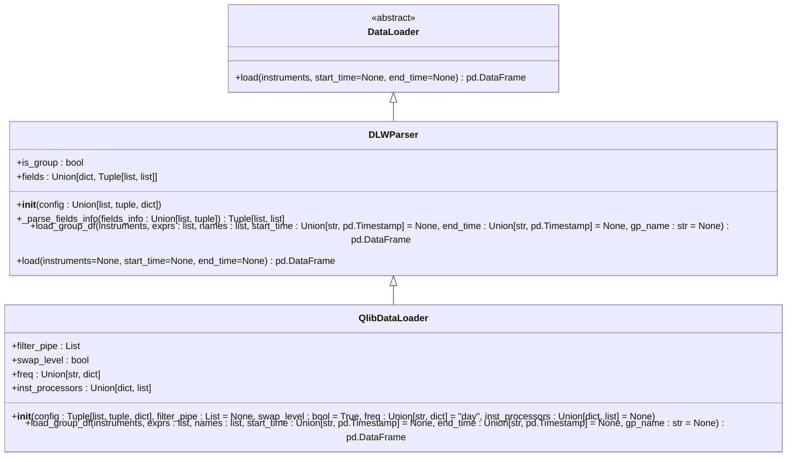
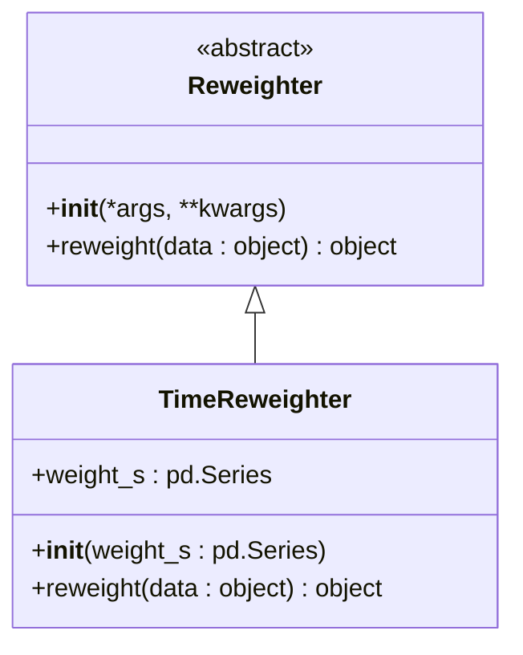
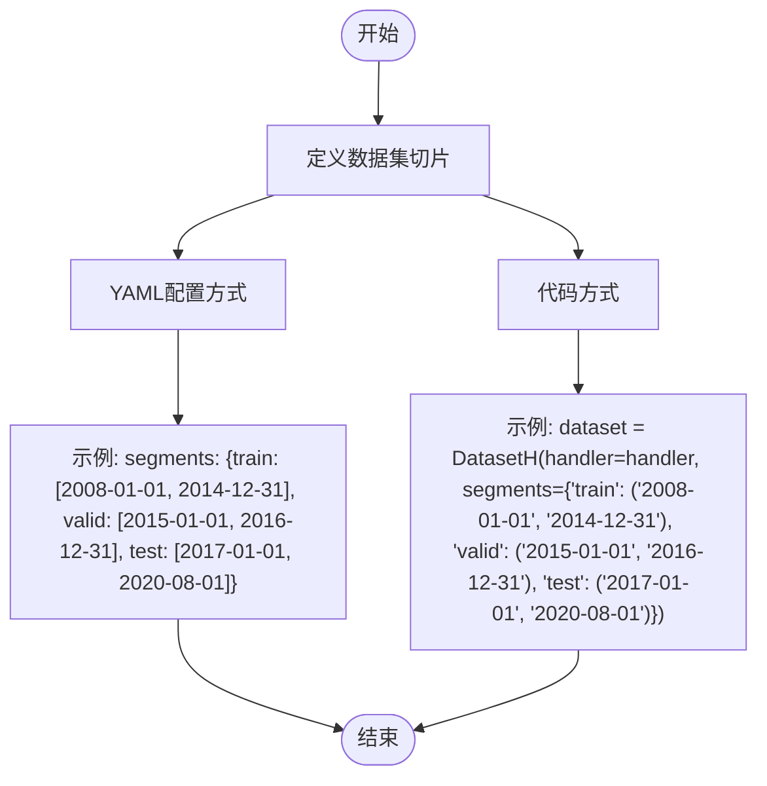
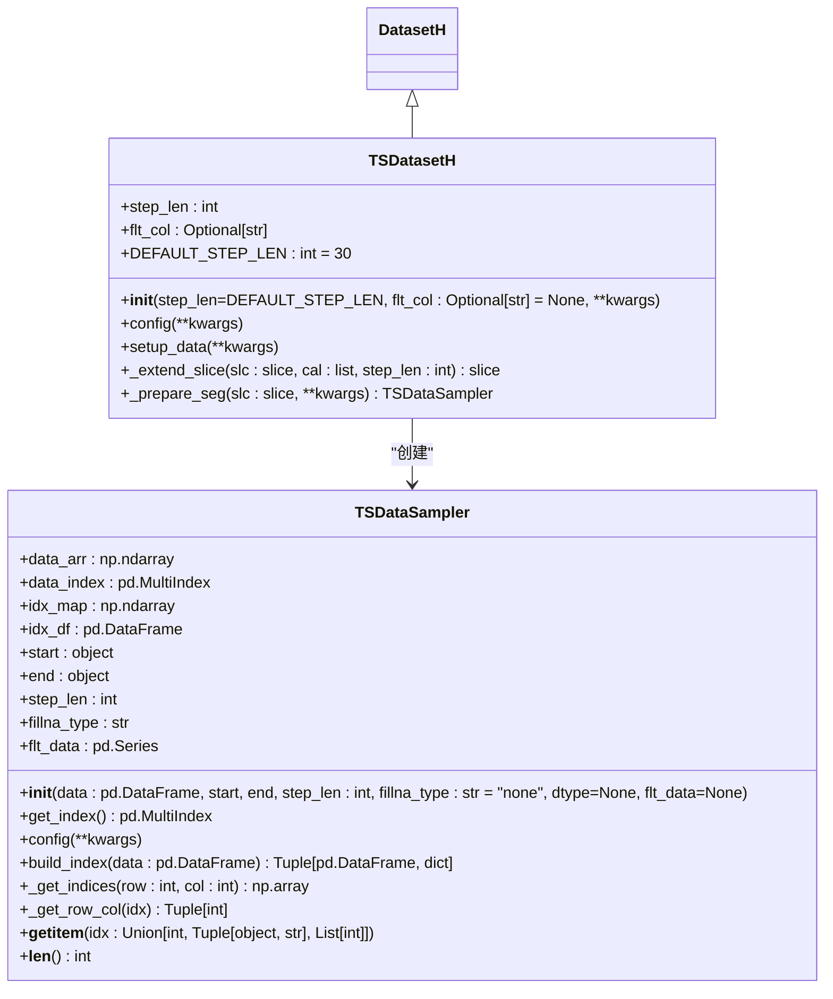
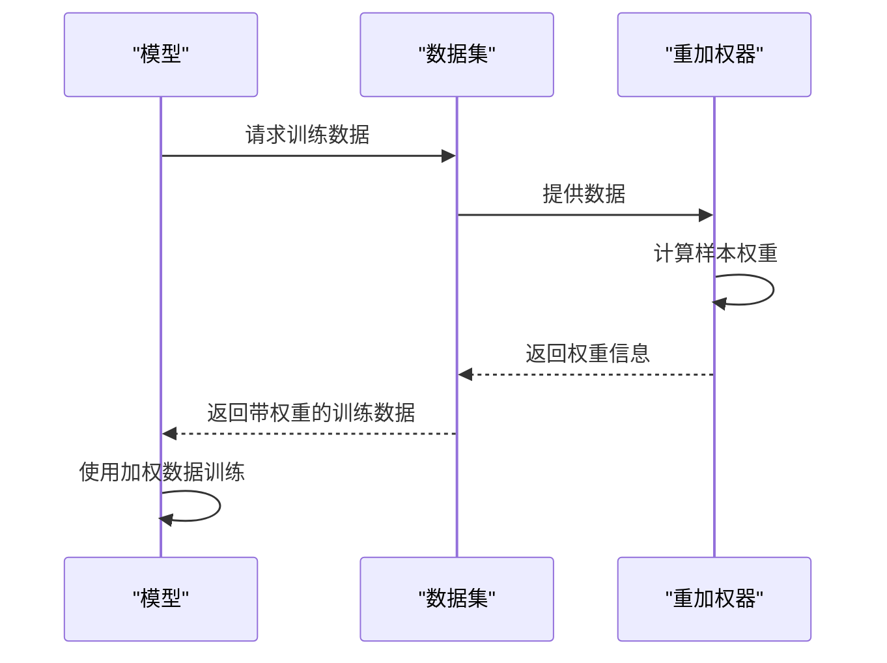
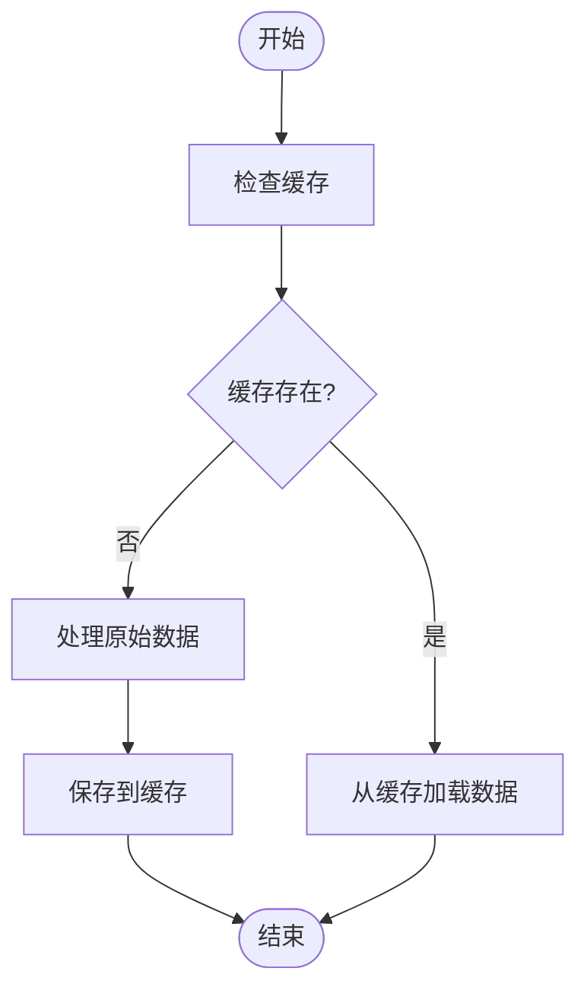
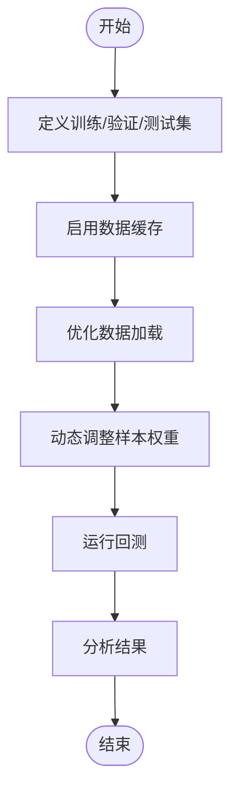

# 数据集管理

<cite>
**本文档引用的文件**   
- [__init__.py](file://qlib/data/dataset/__init__.py)
- [handler.py](file://qlib/data/dataset/handler.py)
- [loader.py](file://qlib/data/dataset/loader.py)
- [weight.py](file://qlib/data/dataset/weight.py)
- [storage.py](file://qlib/data/dataset/storage.py)
- [utils.py](file://qlib/data/dataset/utils.py)
- [workflow_config_lightgbm_configurable_dataset.yaml](file://examples/benchmarks/LightGBM/workflow_config_lightgbm_configurable_dataset.yaml)
- [highfreq/workflow.py](file://examples/highfreq/workflow.py)
</cite>

## 目录
1. [引言](#引言)
2. [核心组件](#核心组件)
3. [数据集加载流程](#数据集加载流程)
4. [批处理机制](#批处理机制)
5. [样本权重计算](#样本权重计算)
6. [数据集切片规则](#数据集切片规则)
7. [高级特性](#高级特性)
8. [最佳实践](#最佳实践)
9. [结论](#结论)

## 引言
本文档详细介绍了QLib框架中的数据集管理功能，重点涵盖DatasetProvider的数据集加载流程、Loader的批处理机制以及WeightManager的样本权重计算功能。文档还说明了如何通过YAML配置或代码方式定义复杂的数据集切片规则，并详细描述了时间序列分割、样本权重调整和数据集版本控制等高级特性。最后，提供了在大规模回测中高效管理训练/验证/测试集的最佳实践指南。

## 核心组件
QLib的数据集管理功能由多个核心组件构成，包括DatasetProvider、Loader和WeightManager。这些组件协同工作，为机器学习模型提供高效、灵活的数据支持。

**Section sources**
- [__init__.py](file://qlib/data/dataset/__init__.py#L1-L723)
- [handler.py](file://qlib/data/dataset/handler.py#L1-L787)

## 数据集加载流程
DatasetProvider的数据集加载流程主要通过`DatasetH`和`DataHandler`类实现。`DatasetH`作为数据集的基类，负责管理数据的分段和加载，而`DataHandler`则负责实际的数据加载和预处理。

```mermaid
classDiagram
class DatasetH {
+handler : DataHandler
+segments : Dict[Text, Tuple]
+fetch_kwargs : Dict
+__init__(handler : Union[Dict, DataHandler], segments : Dict[Text, Tuple], fetch_kwargs : Dict = {})
+config(handler_kwargs : dict = None, **kwargs)
+setup_data(handler_kwargs : dict = None, **kwargs)
+prepare(segments : Union[List[Text], Tuple[Text], Text, slice], col_set=DataHandler.CS_ALL, data_key=DataHandlerLP.DK_I, **kwargs)
}
class DataHandler {
+instruments : object
+start_time : object
+end_time : object
+data_loader : DataLoader
+fetch_orig : bool
+_data : pd.DataFrame
+__init__(instruments=None, start_time=None, end_time=None, data_loader : Union[dict, str, DataLoader] = None, init_data=True, fetch_orig=True)
+config(**kwargs)
+setup_data(enable_cache : bool = False)
+fetch(selector : Union[pd.Timestamp, slice, str, pd.Index] = slice(None, None), level : Union[str, int] = "datetime", col_set : Union[str, List[str]] = DataHandlerABC.CS_ALL, data_key : DATA_KEY_TYPE = DataHandlerABC.DK_I, squeeze : bool = False, proc_func : Optional[Callable] = None)
}
DatasetH --> DataHandler : "使用"
```

**Diagram sources **
- [__init__.py](file://qlib/data/dataset/__init__.py#L72-L247)
- [handler.py](file://qlib/data/dataset/handler.py#L68-L787)

**Section sources**
- [__init__.py](file://qlib/data/dataset/__init__.py#L72-L247)
- [handler.py](file://qlib/data/dataset/handler.py#L68-L787)

## 批处理机制
Loader的批处理机制通过`DataLoader`类实现，支持从原始数据源加载数据，并提供灵活的配置选项。`QlibDataLoader`是`DataLoader`的一个具体实现，支持通过配置文件定义数据加载规则。



**Diagram sources **
- [loader.py](file://qlib/data/dataset/loader.py#L18-L415)

**Section sources**
- [loader.py](file://qlib/data/dataset/loader.py#L18-L415)

## 样本权重计算
WeightManager的样本权重计算功能通过`Reweighter`类实现。`Reweighter`是一个抽象基类，用户需要提供具体的重加权方法来实现样本权重的计算。



**Diagram sources **
- [weight.py](file://qlib/data/dataset/weight.py#L5-L27)
- [contrib/meta/data_selection/model.py](file://qlib/contrib/meta/data_selection/model.py#L183-L190)

**Section sources**
- [weight.py](file://qlib/data/dataset/weight.py#L5-L27)
- [contrib/meta/data_selection/model.py](file://qlib/contrib/meta/data_selection/model.py#L183-L190)

## 数据集切片规则
数据集切片规则可以通过YAML配置或代码方式定义。切片规则在`DatasetH`的`segments`参数中定义，支持多种时间范围的切片。



**Diagram sources **
- [workflow_config_lightgbm_configurable_dataset.yaml](file://examples/benchmarks/LightGBM/workflow_config_lightgbm_configurable_dataset.yaml#L68-L71)
- [highfreq/workflow.py](file://examples/highfreq/workflow.py#L53-L60)

**Section sources**
- [workflow_config_lightgbm_configurable_dataset.yaml](file://examples/benchmarks/LightGBM/workflow_config_lightgbm_configurable_dataset.yaml#L68-L71)
- [highfreq/workflow.py](file://examples/highfreq/workflow.py#L53-L60)

## 高级特性
### 时间序列分割
时间序列分割通过`TSDatasetH`类实现，支持将表格数据转换为时间序列数据。`TSDatasetH`继承自`DatasetH`，并提供了时间序列数据的采样功能。



**Diagram sources **
- [__init__.py](file://qlib/data/dataset/__init__.py#L642-L719)
- [__init__.py](file://qlib/data/dataset/__init__.py#L272-L430)

**Section sources**
- [__init__.py](file://qlib/data/dataset/__init__.py#L642-L719)
- [__init__.py](file://qlib/data/dataset/__init__.py#L272-L430)

### 样本权重调整
样本权重调整功能允许用户根据特定规则调整样本的权重，以优化模型训练效果。`TimeReweighter`是`Reweighter`的一个具体实现，支持基于时间的权重调整。



**Diagram sources **
- [contrib/model/pytorch_lstm_ts.py](file://qlib/contrib/model/pytorch_lstm_ts.py#L200-L217)
- [contrib/model/pytorch_gru_ts.py](file://qlib/contrib/model/pytorch_gru_ts.py#L205-L222)

**Section sources**
- [contrib/model/pytorch_lstm_ts.py](file://qlib/contrib/model/pytorch_lstm_ts.py#L200-L217)
- [contrib/model/pytorch_gru_ts.py](file://qlib/contrib/model/pytorch_gru_ts.py#L205-L222)

### 数据集版本控制
数据集版本控制通过`DataHandler`的`setup_data`方法实现，支持启用缓存以保存处理后的数据。当`enable_cache`参数设置为`True`时，处理后的数据将被保存到磁盘，下次加载时直接从磁盘读取。



**Diagram sources **
- [handler.py](file://qlib/data/dataset/handler.py#L174-L190)

**Section sources**
- [handler.py](file://qlib/data/dataset/handler.py#L174-L190)

## 最佳实践
### 大规模回测中的数据集管理
在大规模回测中，高效管理训练/验证/测试集至关重要。以下是一些最佳实践：

1. **合理划分数据集**：确保训练集、验证集和测试集的时间范围不重叠，避免数据泄露。
2. **使用缓存**：启用`DataHandler`的缓存功能，避免重复处理数据，提高加载速度。
3. **优化数据加载**：使用`QlibDataLoader`的`filter_pipe`和`inst_processors`参数，减少不必要的数据加载和处理。
4. **动态调整样本权重**：根据市场情况动态调整样本权重，提高模型的适应性。



**Diagram sources **
- [highfreq/workflow.py](file://examples/highfreq/workflow.py#L135-L164)

**Section sources**
- [highfreq/workflow.py](file://examples/highfreq/workflow.py#L135-L164)

## 结论
本文档详细介绍了QLib框架中的数据集管理功能，涵盖了数据集加载流程、批处理机制、样本权重计算、数据集切片规则以及高级特性。通过合理使用这些功能，用户可以在大规模回测中高效管理训练/验证/测试集，优化模型训练效果。希望本文档能为用户提供有价值的参考和指导。