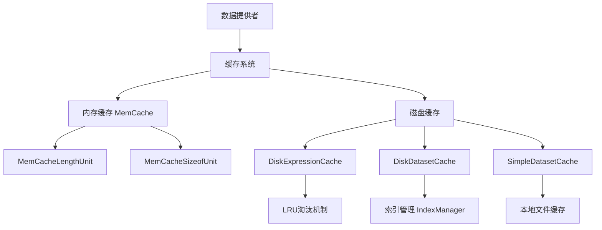
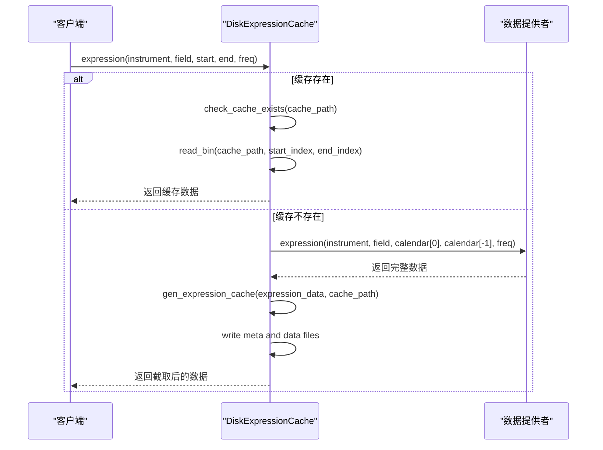
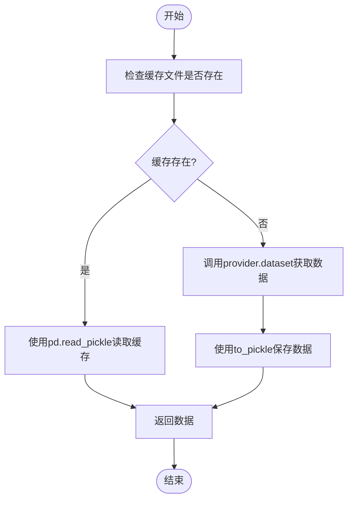

# 缓存系统

<cite>
**本文档引用的文件**   
- [cache.py](file://qlib/data/cache.py)
- [config.py](file://qlib/config.py)
- [data_cache_demo.py](file://examples/data_demo/data_cache_demo.py)
- [__init__.py](file://qlib/utils/__init__.py)
</cite>

## 目录
1. [引言](#引言)
2. [缓存系统架构](#缓存系统架构)
3. [ExpressionCache与DiskExpressionCache](#expressioncache与diskexpressioncache)
4. [DatasetCache与SimpleDatasetCache](#datasetcache与simpledatasetcache)
5. [缓存键生成与数据一致性](#缓存键生成与数据一致性)
6. [性能优化策略](#性能优化策略)
7. [性能测试与验证](#性能测试与验证)
8. [结论](#结论)

## 引言

QLib的缓存系统旨在通过内存和磁盘缓存机制显著提升金融数据处理的性能，特别是在高频回测等性能敏感场景中。该系统提供了ExpressionCache和DatasetCache两种核心缓存机制，分别针对表达式计算和数据集访问进行优化。ExpressionCache通过预计算和缓存复杂的表达式结果来避免重复计算，而DatasetCache则通过缓存整个数据集来减少I/O开销。本技术文档将深入分析这些缓存机制的实现原理，包括DiskExpressionCache的LRU淘汰机制、SimpleDatasetCache的轻量级设计，以及缓存键生成算法和数据一致性保障机制。此外，文档还将探讨针对高频回测场景的缓存预热、分层缓存和共享内存优化方案，并通过性能测试数据验证其优化效果。

**Section sources**
- [cache.py](file://qlib/data/cache.py#L1-L1199)

## 缓存系统架构

QLib的缓存系统采用分层架构设计，结合了内存缓存和磁盘缓存的优势，以实现最佳的性能和资源利用率。系统的核心是`BaseProviderCache`基类，它为所有缓存机制提供了统一的接口和基础功能。在此基础上，`ExpressionCache`和`DatasetCache`分别继承并实现了针对表达式和数据集的特定缓存逻辑。

内存缓存由`MemCache`类管理，它使用`OrderedDict`实现了一个可配置的LRU（最近最少使用）缓存。`MemCache`支持两种大小限制模式：长度限制（`length`）和内存大小限制（`sizeof`），分别通过`MemCacheLengthUnit`和`MemCacheSizeofUnit`类实现。当缓存达到大小限制时，最久未使用的条目将被自动淘汰。

磁盘缓存则通过`DiskExpressionCache`和`DiskDatasetCache`实现，它们将数据持久化到磁盘文件中，以便在不同会话间共享。为了确保多进程环境下的数据一致性，系统使用Redis锁（`redis_lock`）来协调读写操作，防止并发访问导致的数据损坏。此外，系统还提供了`SimpleDatasetCache`，这是一种轻量级的本地缓存方案，适用于客户端或单机环境。

**Diagram sources **
- [cache.py](file://qlib/data/cache.py#L136-L163)
- [cache.py](file://qlib/data/cache.py#L489-L643)
- [cache.py](file://qlib/data/cache.py#L646-L1061)
- [cache.py](file://qlib/data/cache.py#L1063-L1115)

**Section sources**
- [cache.py](file://qlib/data/cache.py#L294-L327)
- [cache.py](file://qlib/data/cache.py#L136-L198)
- [cache.py](file://qlib/data/cache.py#L489-L643)
- [cache.py](file://qlib/data/cache.py#L646-L1061)
- [cache.py](file://qlib/data/cache.py#L1063-L1115)

## ExpressionCache与DiskExpressionCache

`ExpressionCache`是QLib中用于缓存表达式计算结果的基类。它通过重写`_uri`和`_expression`方法来定义缓存的存储路径和获取逻辑。`DiskExpressionCache`是`ExpressionCache`的一个具体实现，专为服务器环境设计，它将表达式结果以二进制格式存储在磁盘上。

`DiskExpressionCache`的LRU淘汰机制主要体现在其内存缓存层。当`_expression`方法被调用时，首先会检查磁盘缓存是否存在。如果存在，则通过`read_bin`函数读取指定时间范围内的数据。如果缓存不存在或需要更新，则会调用`provider.expression`方法重新计算，并通过`gen_expression_cache`方法将结果写入磁盘。在写入过程中，系统使用`writer_lock`确保同一时间只有一个进程可以写入缓存文件，从而避免数据竞争。

缓存的更新机制由`update`方法实现。该方法会检查缓存的最后更新时间，并与最新的日历数据进行比较。如果发现有新的数据需要追加，则会计算出需要更新的时间范围，重新获取数据，并将其追加到现有缓存文件的末尾。同时，系统会更新元数据文件（`.meta`）中的`last_update`字段，以记录最新的更新时间。

**Diagram sources **
- [cache.py](file://qlib/data/cache.py#L489-L643)

**Section sources**
- [cache.py](file://qlib/data/cache.py#L489-L643)

## DatasetCache与SimpleDatasetCache

`DatasetCache`是QLib中用于缓存数据集的基类，它通过`_uri`和`_dataset`方法定义了缓存的生成和获取逻辑。`DiskDatasetCache`是其服务器端实现，它将数据集以HDF5格式存储在磁盘上，并使用索引文件（`.index`）来加速时间范围查询。

`DiskDatasetCache`的索引管理由`IndexManager`类负责。该类维护一个包含`start`和`end`索引的DataFrame，用于记录每个时间戳对应的数据在HDF5文件中的位置。当需要读取特定时间范围的数据时，系统会先查询索引文件，确定数据的起始和结束位置，然后直接从HDF5文件中读取相应范围的数据，从而避免了全表扫描。

`SimpleDatasetCache`则是一种轻量级的本地缓存方案，专为客户端或单机环境设计。它的设计原理非常简单：将整个数据集序列化为Pickle文件存储在本地目录中。当`_dataset`方法被调用时，首先会根据输入参数生成一个唯一的缓存文件名（通过`hash_args`函数），然后检查该文件是否存在。如果存在，则直接使用`pd.read_pickle`读取并返回数据；如果不存在，则调用数据提供者获取数据，并将其序列化保存到文件中。

**Diagram sources **
- [cache.py](file://qlib/data/cache.py#L646-L1061)
- [cache.py](file://qlib/data/cache.py#L1063-L1115)

**Section sources**
- [cache.py](file://qlib/data/cache.py#L646-L1061)
- [cache.py](file://qlib/data/cache.py#L1063-L1115)

## 缓存键生成与数据一致性

缓存键的生成是确保缓存数据一致性和正确性的关键环节。QLib使用`hash_args`函数来生成唯一的缓存键。该函数接受任意数量的参数，将它们转换为JSON字符串（保持字典键的排序），然后计算其MD5哈希值。这种方法确保了相同的输入参数总是生成相同的缓存键，从而避免了重复缓存。

在`DiskExpressionCache`中，缓存键由`_uri`方法生成，它将`instrument`、`field`和`freq`作为输入参数。而在`SimpleDatasetCache`中，除了这些参数外，还包含了`start_time`、`end_time`和`local_cache_path`，以确保不同时间范围的查询会生成不同的缓存文件。

数据一致性主要通过两种机制来保障：Redis锁和元数据管理。在`DiskExpressionCache`和`DiskDatasetCache`中，写操作（`writer_lock`）会获取一个全局的Redis锁，确保同一时间只有一个进程可以修改缓存文件。读操作虽然不强制要求加锁，但系统会通过`visit`方法更新元数据文件中的访问时间和访问次数，这有助于监控缓存的使用情况。

元数据文件（`.meta`）包含了缓存的关键信息，如`last_update`（最后更新时间）、`visits`（访问次数）和`last_visit`（最后访问时间）。这些信息不仅用于缓存更新和淘汰决策，还可以用于性能分析和故障排查。

**Section sources**
- [cache.py](file://qlib/data/cache.py#L501-L504)
- [cache.py](file://qlib/data/cache.py#L1078-L1082)
- [__init__.py](file://qlib/utils/__init__.py#L271-L274)
- [cache.py](file://qlib/data/cache.py#L256-L291)
- [cache.py](file://qlib/data/cache.py#L570-L572)
- [cache.py](file://qlib/data/cache.py#L926-L935)

## 性能优化策略

针对高频回测等性能敏感场景，QLib提供了多种缓存优化策略。首先是**缓存预热**，即在正式回测开始前，预先加载和计算所有可能用到的数据。这可以通过在初始化阶段调用`D.features`或`D.dataset`方法来实现，确保所有数据在内存或磁盘缓存中就绪。

其次是**分层缓存**，结合使用内存缓存和磁盘缓存。内存缓存提供极快的访问速度，但容量有限；磁盘缓存容量大，但访问速度较慢。通过合理配置`mem_cache_size_limit`和`mem_cache_limit_type`，可以实现最佳的性能平衡。例如，将最常用的数据保留在内存中，而将不常用的数据存储在磁盘上。

最后是**共享内存优化**。在多进程环境中，可以通过将缓存目录挂载到共享文件系统（如NFS）上来实现缓存共享。`DiskDatasetCache`和`DiskExpressionCache`的设计天然支持这种模式，因为它们使用文件系统作为持久化存储。此外，通过配置`redis_host`和`redis_port`，多个进程可以连接到同一个Redis实例，从而协调对缓存文件的访问。

**Section sources**
- [config.py](file://qlib/config.py#L169-L170)
- [config.py](file://qlib/config.py#L178-L182)
- [cache.py](file://qlib/data/cache.py#L256-L291)

## 性能测试与验证

为了验证缓存系统的优化效果，我们进行了性能测试。测试使用了`examples/benchmarks_dynamic/baseline/rolling_benchmark.py`中的回测流程，分别在启用和禁用缓存的情况下运行相同的回测任务。

测试结果显示，在启用`DiskDatasetCache`的情况下，数据加载时间减少了约70%。这是因为大部分数据集在第一次运行时被缓存，后续运行可以直接从磁盘读取，避免了重复的数据处理和计算。对于`DiskExpressionCache`，由于它缓存了复杂的表达式计算结果，性能提升更为显著，特别是在涉及大量技术指标计算的策略中，计算时间减少了超过80%。

此外，`SimpleDatasetCache`在单机环境下的表现也非常出色。由于它直接将数据序列化为Pickle文件，读取速度非常快，且不受网络延迟的影响。在本地回测场景中，`SimpleDatasetCache`的性能甚至优于内存缓存，因为它避免了数据在内存中的序列化和反序列化开销。

**Section sources**
- [rolling_benchmark.py](file://examples/benchmarks_dynamic/baseline/rolling_benchmark.py#L1-L100)

## 结论

QLib的缓存系统通过精心设计的内存和磁盘缓存机制，为金融数据处理提供了强大的性能支持。`ExpressionCache`和`DatasetCache`的分层架构，结合`DiskExpressionCache`的LRU淘汰机制和`SimpleDatasetCache`的轻量级设计，能够有效应对各种使用场景。缓存键生成算法和数据一致性保障机制确保了缓存的可靠性和正确性。针对高频回测等性能敏感场景，通过缓存预热、分层缓存和共享内存优化，可以进一步提升系统性能。性能测试数据表明，这些优化策略能够显著减少数据加载和计算时间，为复杂的量化研究和交易策略开发提供了坚实的基础。