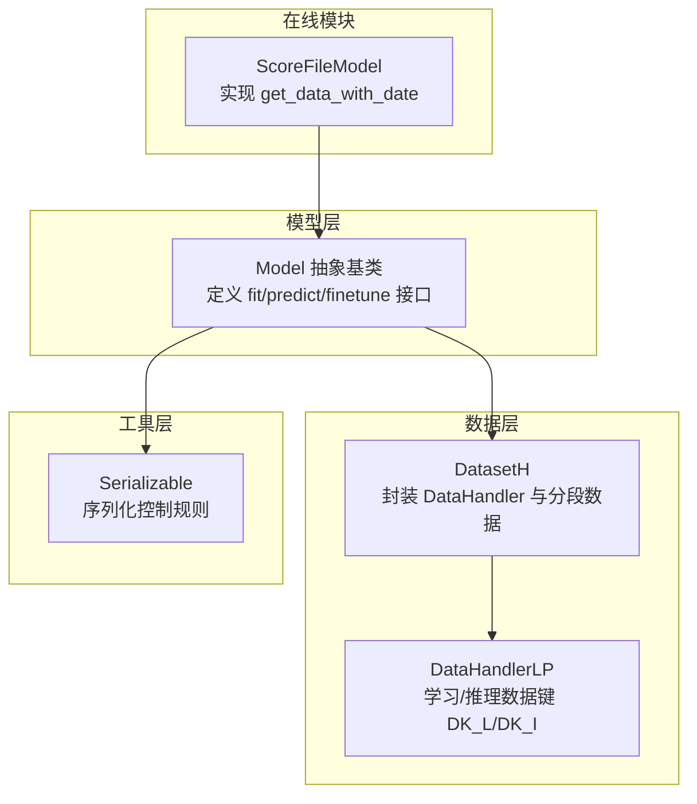
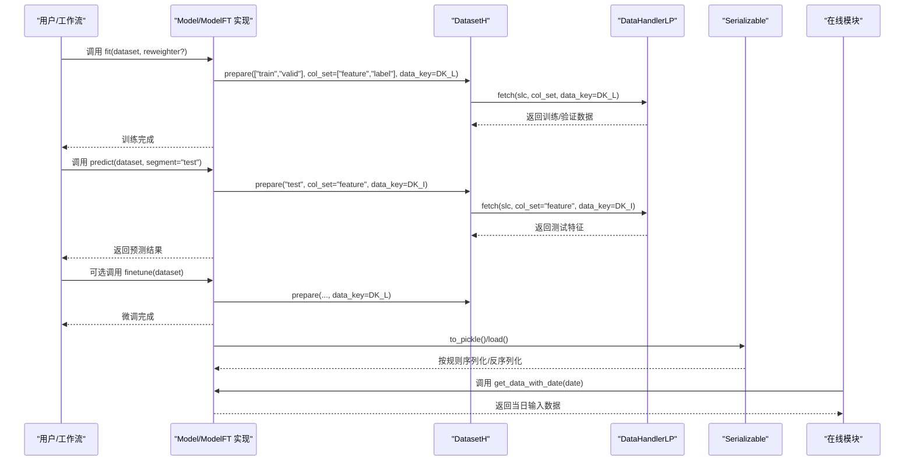
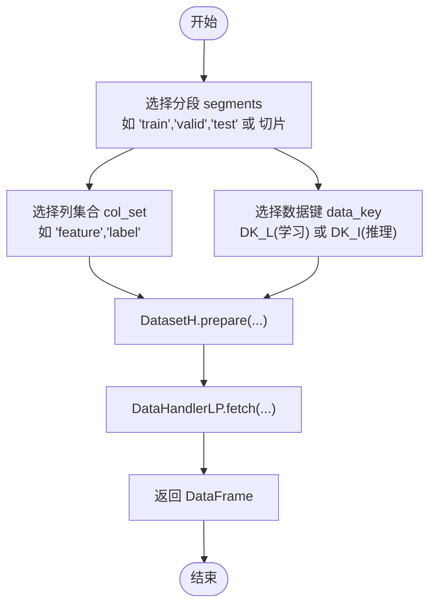
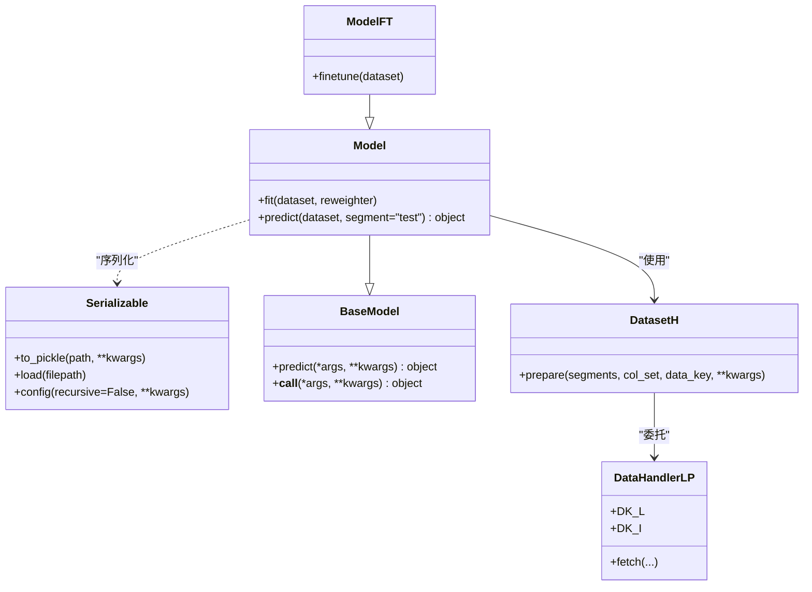

# 基础模型接口

<cite>
**本文引用的文件列表**
- [qlib/model/base.py](file://qlib/model/base.py)
- [qlib/data/dataset/__init__.py](file://qlib/data/dataset/__init__.py)
- [qlib/data/dataset/handler.py](file://qlib/data/dataset/handler.py)
- [qlib/utils/serial.py](file://qlib/utils/serial.py)
- [docs/start/integration.rst](file://docs/start/integration.rst)
- [qlib/contrib/online/online_model.py](file://qlib/contrib/online/online_model.py)
- [qlib/contrib/online/__init__.py](file://qlib/contrib/online/__init__.py)
- [qlib/contrib/model/gbdt.py](file://qlib/contrib/model/gbdt.py)
- [qlib/contrib/model/pytorch_adarnn.py](file://qlib/contrib/model/pytorch_adarnn.py)
</cite>

## 目录
1. [简介](#简介)
2. [项目结构与定位](#项目结构与定位)
3. [核心组件总览](#核心组件总览)
4. [架构概览](#架构概览)
5. [详细组件分析](#详细组件分析)
6. [依赖关系分析](#依赖关系分析)
7. [性能与可扩展性](#性能与可扩展性)
8. [故障排查指南](#故障排查指南)
9. [结论](#结论)
10. [附录：集成与配置要点](#附录：集成与配置要点)

## 简介
本文件面向希望在Qlib工作流中实现“可训练、可预测、可微调”的基础模型接口的开发者，系统梳理并解释以下内容：
- 抽象基类Model与ModelFT的设计与职责边界
- fit()、predict()、finetune()三大核心方法的调用规范、参数约定与返回值类型
- 模型状态序列化与可扩展性设计（基于Serializable）
- 与数据模块DatasetH的交互模式与典型数据准备流程
- 在线预测所需的扩展方法get_data_with_date的契约与实现建议
- 结合官方集成文档，给出继承Model/ModelFT实现自定义模型的最佳实践

## 项目结构与定位
- 抽象基类位于模型层：qlib/model/base.py
- 数据准备与访问位于数据层：qlib/data/dataset/__init__.py、qlib/data/dataset/handler.py
- 序列化工具位于通用工具层：qlib/utils/serial.py
- 集成示例与配置说明位于文档：docs/start/integration.rst
- 在线模块对模型扩展方法的约定位于：qlib/contrib/online/online_model.py、qlib/contrib/online/__init__.py
- 典型实现参考：LightGBM（ModelFT）、PyTorch系列（Model）

图表来源
- [qlib/model/base.py](file://qlib/model/base.py#L9-L111)
- [qlib/data/dataset/__init__.py](file://qlib/data/dataset/__init__.py#L72-L248)
- [qlib/data/dataset/handler.py](file://qlib/data/dataset/handler.py#L26-L110)
- [qlib/utils/serial.py](file://qlib/utils/serial.py#L11-L190)
- [qlib/contrib/online/online_model.py](file://qlib/contrib/online/online_model.py#L13-L28)

章节来源
- [qlib/model/base.py](file://qlib/model/base.py#L9-L111)
- [qlib/data/dataset/__init__.py](file://qlib/data/dataset/__init__.py#L72-L248)
- [qlib/data/dataset/handler.py](file://qlib/data/dataset/handler.py#L26-L110)
- [qlib/utils/serial.py](file://qlib/utils/serial.py#L11-L190)
- [qlib/contrib/online/online_model.py](file://qlib/contrib/online/online_model.py#L13-L28)

## 核心组件总览
- BaseModel：定义统一的predict接口，并提供函数式调用糖语法（__call__转发到predict）
- Model：可学习模型的抽象，强制实现fit与predict；提供可选的reweighter参数
- ModelFT：在Model基础上增加finetune接口，用于增量训练/微调
- DatasetH：封装DataHandler与分段数据，提供prepare方法按col_set与data_key获取训练/验证/测试数据
- DataHandlerLP：区分学习阶段（DK_L）与推理阶段（DK_I）的数据键
- Serializable：统一序列化控制，决定哪些属性被持久化

章节来源
- [qlib/model/base.py](file://qlib/model/base.py#L9-L111)
- [qlib/data/dataset/__init__.py](file://qlib/data/dataset/__init__.py#L72-L248)
- [qlib/data/dataset/handler.py](file://qlib/data/dataset/handler.py#L26-L110)
- [qlib/utils/serial.py](file://qlib/utils/serial.py#L11-L190)

## 架构概览
下图展示模型接口与数据模块的交互路径，以及在线模块对模型扩展方法的要求。

图表来源
- [qlib/model/base.py](file://qlib/model/base.py#L24-L109)
- [qlib/data/dataset/__init__.py](file://qlib/data/dataset/__init__.py#L186-L248)
- [qlib/data/dataset/handler.py](file://qlib/data/dataset/handler.py#L199-L277)
- [qlib/utils/serial.py](file://qlib/utils/serial.py#L116-L155)
- [qlib/contrib/online/online_model.py](file://qlib/contrib/online/online_model.py#L22-L27)

## 详细组件分析

### 抽象基类与接口契约
- BaseModel
  - 定义抽象方法predict，返回任意对象（通常为pandas.Series等）
  - 提供__call__将调用转发至predict，便于以函数式方式使用
- Model
  - fit(dataset: Dataset, reweighter: Reweighter)
    - 参数约定：dataset为数据集对象；reweighter为重采样器（可选）
    - 行为约定：从dataset.prepare中读取训练/验证数据，构建特征、标签与权重；训练完成后可序列化
    - 注意：已训练模型的属性名不应以“_”开头，以便序列化持久化
  - predict(dataset: Dataset, segment: Union[Text, slice]="test") -> object
    - 参数约定：segment支持字符串或切片；默认为“test”
    - 返回约定：返回预测结果（如pandas.Series），索引与数据对齐
- ModelFT
  - finetune(dataset: Dataset)
    - 行为约定：在已有模型基础上进行增量训练；典型场景通过工作流记录器加载先前模型后调用

章节来源
- [qlib/model/base.py](file://qlib/model/base.py#L9-L111)

### 数据模块交互模式（DatasetH 与 DataHandlerLP）
- DatasetH.prepare(segments, col_set, data_key, **kwargs)
  - 支持按字符串或列表/元组指定多个分段（如“train”、“valid”、“test”）
  - data_key选择不同数据键：
    - DK_L：学习阶段（训练/验证时使用）
    - DK_I：推理阶段（测试时使用）
  - col_set选择列集合（如“feature”、“label”等）
- DataHandlerLP
  - 维护三类数据视图：原始数据、学习数据、推理数据
  - fetch(selector, level, col_set, data_key, ...)按键返回DataFrame

图表来源
- [qlib/data/dataset/__init__.py](file://qlib/data/dataset/__init__.py#L186-L248)
- [qlib/data/dataset/handler.py](file://qlib/data/dataset/handler.py#L199-L277)

章节来源
- [qlib/data/dataset/__init__.py](file://qlib/data/dataset/__init__.py#L72-L248)
- [qlib/data/dataset/handler.py](file://qlib/data/dataset/handler.py#L26-L110)

### 序列化与可扩展性（Serializable）
- 规则要点
  - 属性保留策略：优先级为 include > exclude > 非下划线前缀 > 下划线前缀（dump_all控制）
  - 提供to_pickle/load等统一接口，支持递归配置
- 模型序列化建议
  - 已训练模型的属性名不应以“_”开头，否则会被序列化排除
  - 使用Serializable提供的include/exclude/dump_all控制持久化内容

章节来源
- [qlib/utils/serial.py](file://qlib/utils/serial.py#L11-L190)
- [qlib/model/base.py](file://qlib/model/base.py#L24-L59)

### 在线预测扩展：get_data_with_date
- 在线模块约定
  - 若需在线预测，模型应实现get_data_with_date(date, **kwargs)，返回当日用于预测的输入数据
  - 示例实现：ScoreFileModel通过多索引查询返回当日分数序列
- 契约要点
  - 输入：日期（pd.Timestamp）
  - 输出：可用于预测的输入数据（如Series）
  - 异常：未实现时抛出未实现错误

章节来源
- [qlib/contrib/online/online_model.py](file://qlib/contrib/online/online_model.py#L22-L27)
- [qlib/contrib/online/__init__.py](file://qlib/contrib/online/__init__.py#L1-L21)

### 典型实现参考

#### LightGBM（ModelFT）
- fit(dataset, num_boost_round, early_stopping_rounds, verbose_eval, evals_result, reweighter, ...)
  - 从dataset.prepare读取训练/验证数据，构造lgb.Dataset并训练
  - 支持可选的重采样器Reweighter
- predict(dataset, segment="test")
  - 从DK_I键获取测试特征，返回Series
- finetune(dataset, num_boost_round, verbose_eval, reweighter)
  - 基于已有模型继续训练若干轮

章节来源
- [qlib/contrib/model/gbdt.py](file://qlib/contrib/model/gbdt.py#L16-L127)

#### PyTorch ADARNN（Model）
- fit(dataset: DatasetH, ...)
  - 从DK_L键准备训练/验证数据，按批训练并早停
- predict(dataset: DatasetH, segment="test")
  - 从DK_I键准备测试特征，返回Series
- infer(x_test)
  - 内部推理逻辑，将特征张量转换为预测分数Series

章节来源
- [qlib/contrib/model/pytorch_adarnn.py](file://qlib/contrib/model/pytorch_adarnn.py#L22-L337)

## 依赖关系分析
- Model/ModelFT依赖Dataset与DataHandlerLP提供的数据键与分段能力
- 模型实现通常依赖第三方训练库（如LightGBM、PyTorch），但接口保持一致
- Serializable作为通用序列化工具，贯穿模型生命周期

图表来源
- [qlib/model/base.py](file://qlib/model/base.py#L9-L111)
- [qlib/data/dataset/__init__.py](file://qlib/data/dataset/__init__.py#L72-L248)
- [qlib/data/dataset/handler.py](file://qlib/data/dataset/handler.py#L26-L110)
- [qlib/utils/serial.py](file://qlib/utils/serial.py#L11-L190)

章节来源
- [qlib/model/base.py](file://qlib/model/base.py#L9-L111)
- [qlib/data/dataset/__init__.py](file://qlib/data/dataset/__init__.py#L72-L248)
- [qlib/data/dataset/handler.py](file://qlib/data/dataset/handler.py#L26-L110)
- [qlib/utils/serial.py](file://qlib/utils/serial.py#L11-L190)

## 性能与可扩展性
- 数据准备
  - 使用DK_L与DK_I分离学习与推理数据，避免不必要的列与行过滤
  - 合理设置segments，减少无用数据加载
- 训练与微调
  - 支持可选的重采样器Reweighter，便于样本不平衡处理
  - 微调时复用已有模型参数，缩短训练时间
- 序列化
  - 控制include/exclude/dump_all，仅持久化必要参数，避免大对象被序列化
- 在线预测
  - get_data_with_date应尽量轻量，避免在线时大量IO

[本节为通用指导，不直接分析具体文件]

## 故障排查指南
- 训练前检查
  - 确认dataset.segments包含“train”，且prepare返回非空DataFrame
  - 确认data_key正确（学习阶段用DK_L，推理阶段用DK_I）
- 预测前检查
  - 若模型未fit，predict会抛出“尚未训练”的错误
- 序列化问题
  - 已训练模型属性名不应以下划线开头，否则不会被持久化
  - 如需持久化内部大对象，使用include_attr或dump_all显式声明
- 在线预测
  - 未实现get_data_with_date时，调用会抛出未实现错误

章节来源
- [qlib/contrib/model/gbdt.py](file://qlib/contrib/model/gbdt.py#L92-L106)
- [qlib/contrib/online/online_model.py](file://qlib/contrib/online/online_model.py#L22-L27)
- [qlib/utils/serial.py](file://qlib/utils/serial.py#L11-L190)

## 结论
- Model/ModelFT提供了清晰的接口契约，保证了训练、预测与微调的一致性
- DatasetH/DataHandlerLP为模型提供了标准化的数据访问方式，支持灵活的列集合与数据键
- Serializable统一了序列化策略，确保模型可持久化与可复现
- 在线模块对get_data_with_date的约定明确了模型在线预测的扩展点
- 建议在实现自定义模型时严格遵循上述契约，确保与Qlib工作流无缝集成

[本节为总结，不直接分析具体文件]

## 附录：集成与配置要点

### 继承Model/ModelFT实现自定义模型
- 继承关系
  - 若需要微调：继承ModelFT
  - 仅训练与预测：继承Model
- 必须实现的方法
  - fit(dataset, reweighter?)：从dataset.prepare读取训练/验证数据，训练模型
  - predict(dataset, segment="test")：从dataset.prepare读取测试特征，返回预测结果
  - 可选：finetune(dataset)（若继承ModelFT）
- 数据键与列集合
  - 学习阶段使用DK_L，推理阶段使用DK_I
  - 常见列集合包括“feature”、“label”、“weight”
- 序列化
  - 已训练模型属性名不应以下划线开头
  - 可通过include/exclude/dump_all精细控制持久化内容

章节来源
- [docs/start/integration.rst](file://docs/start/integration.rst#L12-L106)
- [qlib/model/base.py](file://qlib/model/base.py#L24-L109)
- [qlib/data/dataset/__init__.py](file://qlib/data/dataset/__init__.py#L186-L248)
- [qlib/data/dataset/handler.py](file://qlib/data/dataset/handler.py#L199-L277)
- [qlib/utils/serial.py](file://qlib/utils/serial.py#L11-L190)

### 在线预测扩展
- 实现get_data_with_date(date, **kwargs)
  - 返回当日用于预测的输入数据（如Series）
- 参考实现
  - ScoreFileModel通过多索引查询返回当日分数序列

章节来源
- [qlib/contrib/online/online_model.py](file://qlib/contrib/online/online_model.py#L22-L27)
- [qlib/contrib/online/__init__.py](file://qlib/contrib/online/__init__.py#L1-L21)