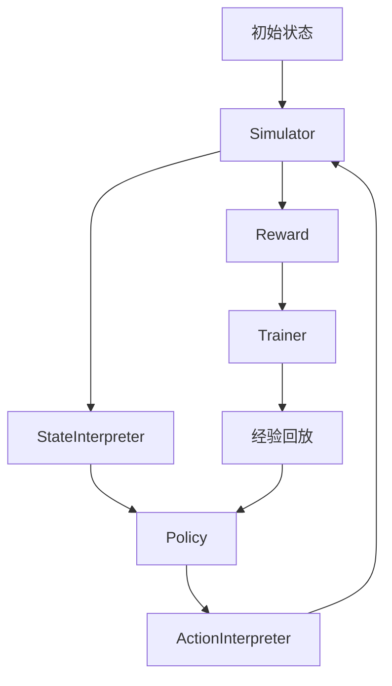
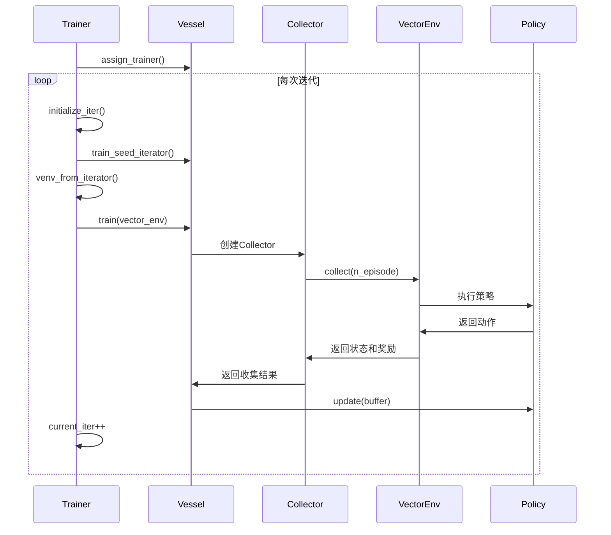
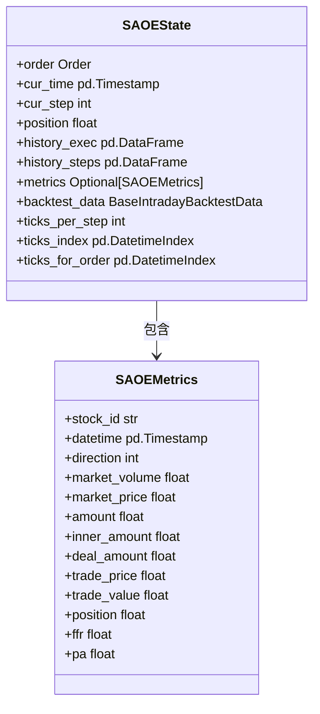
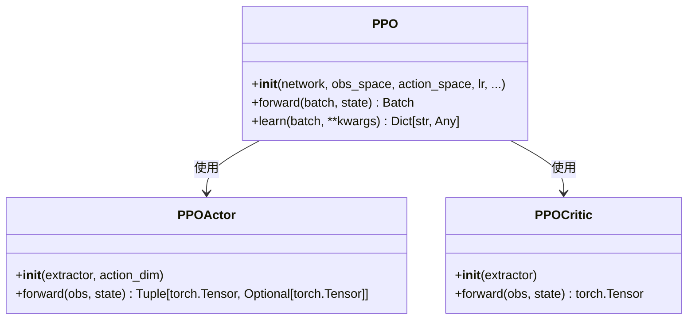
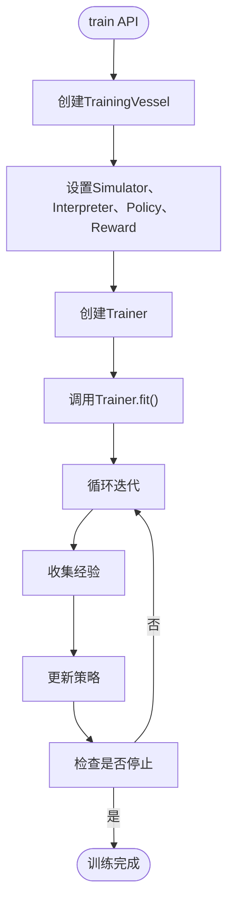

# 强化学习模型框架

<cite>
**本文档中引用的文件**  
- [__init__.py](file://qlib/rl/__init__.py)
- [simulator.py](file://qlib/rl/simulator.py)
- [reward.py](file://qlib/rl/reward.py)
- [trainer/api.py](file://qlib/rl/trainer/api.py)
- [trainer/trainer.py](file://qlib/rl/trainer/trainer.py)
- [trainer/vessel.py](file://qlib/rl/trainer/vessel.py)
- [order_execution/__init__.py](file://qlib/rl/order_execution/__init__.py)
- [order_execution/policy.py](file://qlib/rl/order_execution/policy.py)
- [order_execution/state.py](file://qlib/rl/order_execution/state.py)
- [order_execution/simulator_simple.py](file://qlib/rl/order_execution/simulator_simple.py)
- [order_execution/interpreter.py](file://qlib/rl/order_execution/interpreter.py)
- [order_execution/reward.py](file://qlib/rl/order_execution/reward.py)
- [examples/rl_order_execution/exp_configs/train_ppo.yml](file://examples/rl_order_execution/exp_configs/train_ppo.yml)
- [examples/rl_order_execution/exp_configs/backtest_ppo.yml](file://examples/rl_order_execution/exp_configs/backtest_ppo.yml)
</cite>

## 目录
1. [简介](#简介)
2. [核心组件](#核心组件)
3. [训练器（Trainer）机制](#训练器trainer机制)
4. [订单执行环境（OrderExecutionEnv）](#订单执行环境orderexecutionenv)
5. [策略（Policy）实现](#策略policy实现)
6. [奖励函数（Reward）设计](#奖励函数reward设计)
7. [训练与回测调用链](#训练与回测调用链)
8. [自定义RL环境开发](#自定义rl环境开发)
9. [与Qlib回测系统集成](#与qlib回测系统集成)
10. [附录](#附录)

## 简介
本文档全面介绍Qlib强化学习框架的API设计，重点阐述环境（Simulator）、策略（Policy）、奖励函数（Reward）和训练器（Trainer）四大组件的接口设计与交互协议。框架基于Tianshou构建，为订单执行等金融场景提供端到端的强化学习解决方案。

## 核心组件

Qlib的强化学习框架由四个核心组件构成：环境（Simulator）、策略（Policy）、奖励函数（Reward）和训练器（Trainer）。这些组件通过标准化的接口进行交互，形成一个完整的强化学习工作流。



**组件来源**
- [__init__.py](file://qlib/rl/__init__.py#L4-L8)
- [trainer/__init__.py](file://qlib/rl/trainer/__init__.py#L6-L9)

## 训练器（Trainer）机制

`RLTrainer`是整个训练流程的核心控制器，负责协调数据收集、策略更新和评估。其训练流程基于“收集-更新”（collect-update）范式，而非传统的“epoch”或“mini-batch”。

### 训练流程控制
训练流程由`Trainer`类控制，其核心方法是`fit`。在每次迭代中，`Trainer`会：
1.  通过`venv_from_iterator`创建并行化的向量环境。
2.  调用`vessel.train`方法进行一次完整的“收集”操作。
3.  在收集到的经验上更新策略。
4.  根据配置决定是否进行验证。



**图示来源**
- [trainer/trainer.py](file://qlib/rl/trainer/trainer.py#L188-L249)
- [trainer/vessel.py](file://qlib/rl/trainer/vessel.py#L164-L185)

### 经验回放与策略更新
框架使用`VectorReplayBuffer`作为经验回放缓冲区。在每次收集后，策略会根据缓冲区中的数据进行多次更新（由`repeat_per_collect`参数控制），以提高样本利用率。

**本节来源**
- [trainer/trainer.py](file://qlib/rl/trainer/trainer.py#L30-L38)
- [trainer/vessel.py](file://qlib/rl/trainer/vessel.py#L170-L182)

## 订单执行环境（OrderExecutionEnv）

`OrderExecutionEnv`通过`SingleAssetOrderExecutionSimple`类实现，用于模拟单资产订单的执行过程。

### 状态空间定义
状态由`SAOEState`类定义，包含订单信息、当前时间、剩余仓位、历史执行记录和市场数据等。



**图示来源**
- [order_execution/state.py](file://qlib/rl/order_execution/state.py#L70-L102)
- [order_execution/simulator_simple.py](file://qlib/rl/order_execution/simulator_simple.py#L24-L67)

### 动作空间定义
动作空间由`ActionInterpreter`定义。`CategoricalActionInterpreter`将离散动作（如0,1,2,3）映射为要交易的订单比例。

**本节来源**
- [order_execution/interpreter.py](file://qlib/rl/order_execution/interpreter.py#L199-L231)
- [order_execution/state.py](file://qlib/rl/order_execution/state.py#L70-L102)

## 策略（Policy）实现

策略由`BasePolicy`派生，框架提供了`PPO`和`DQN`等实现。

### PPO策略
`PPO`类是对Tianshou的`PPOPolicy`的封装，自动创建Actor和Critic网络，并支持从检查点文件加载权重。



**图示来源**
- [order_execution/policy.py](file://qlib/rl/order_execution/policy.py#L102-L156)
- [order_execution/policy.py](file://qlib/rl/order_execution/policy.py#L69-L83)
- [order_execution/policy.py](file://qlib/rl/order_execution/policy.py#L86-L99)

## 奖励函数（Reward）设计

奖励函数通过`Reward`基类实现，用于计算每个时间步的奖励。

### PAPenaltyReward
该奖励函数鼓励更高的价格优势（PA），但会惩罚在短时间内交易大量订单的行为。

```python
reward = (PA_t * vol_t / target - vol_t^2 * penalty) * scale
```

### PPOReward
该奖励函数基于论文《An End-to-End Optimal Trade Execution Framework based on Proximal Policy Optimization》提出，在交易结束时根据VWAP与TWAP的比率给予奖励。

**本节来源**
- [order_execution/reward.py](file://qlib/rl/order_execution/reward.py#L17-L50)
- [order_execution/reward.py](file://qlib/rl/order_execution/reward.py#L53-L100)

## 训练与回测调用链

训练和回测通过`train`和`backtest` API函数启动，其调用链清晰地展示了各组件的协作。

### 训练调用链


**本节来源**
- [trainer/api.py](file://qlib/rl/trainer/api.py#L19-L63)
- [trainer/trainer.py](file://qlib/rl/trainer/trainer.py#L188-L249)

### 配置文件示例
PPO训练和回测的完整配置在YAML文件中定义。

```yaml
# train_ppo.yml (节选)
policy:
  class: PPO
  kwargs:
    lr: 0.0001
trainer:
  max_epoch: 500
  episode_per_collect: 10000
```

```yaml
# backtest_ppo.yml (节选)
strategies:
  1day:
    class: SAOEIntStrategy
    kwargs:
      policy:
        class: PPO
        kwargs:
          lr: 0.0001
          # weight_file: outputs/ppo/checkpoints/latest.pth
```

**本节来源**
- [examples/rl_order_execution/exp_configs/train_ppo.yml](file://examples/rl_order_execution/exp_configs/train_ppo.yml)
- [examples/rl_order_execution/exp_configs/backtest_ppo.yml](file://examples/rl_order_execution/exp_configs/backtest_ppo.yml)

## 自定义RL环境开发

开发者可以通过继承`Simulator`基类来创建自定义的RL环境。

### 开发模板
```python
from qlib.rl.simulator import Simulator

class MyCustomEnv(Simulator[InitialStateType, StateType, ActType]):
    def __init__(self, initial_state):
        super().__init__(initial_state)
    
    def step(self, action):
        # 实现状态转移逻辑
        pass
    
    def get_state(self):
        # 返回当前状态
        pass
    
    def done(self):
        # 判断是否结束
        pass
```

### 状态预处理
使用`StateInterpreter`对原始状态进行预处理，例如归一化、特征提取等。

### 奖励塑形
通过组合多个`Reward`实例（使用`RewardCombination`）来实现复杂的奖励塑形。

**本节来源**
- [simulator.py](file://qlib/rl/simulator.py#L21-L76)
- [reward.py](file://qlib/rl/reward.py#L38-L50)
- [interpreter.py](file://qlib/rl/order_execution/interpreter.py#L68-L147)

## 与Qlib回测系统集成

订单执行策略可以通过`SAOEIntStrategy`与Qlib的回测系统集成，实现从训练到实盘的无缝衔接。

**本节来源**
- [order_execution/strategy.py](file://qlib/rl/order_execution/strategy.py)
- [backtest/](file://qlib/backtest/)

## 附录

### 核心API参考
- `train()`: 启动训练流程。
- `backtest()`: 启动回测流程。
- `Simulator`: 环境基类。
- `Reward`: 奖励基类。
- `StateInterpreter`: 状态解释器基类。
- `ActionInterpreter`: 动作解释器基类。