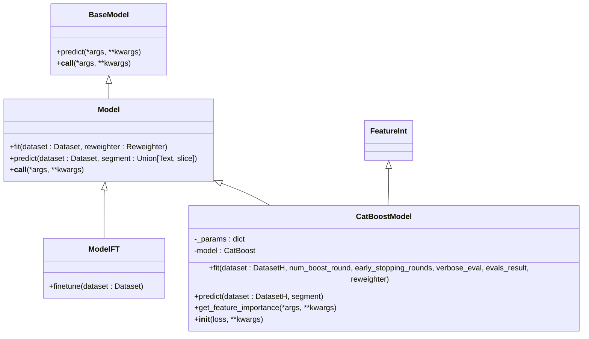
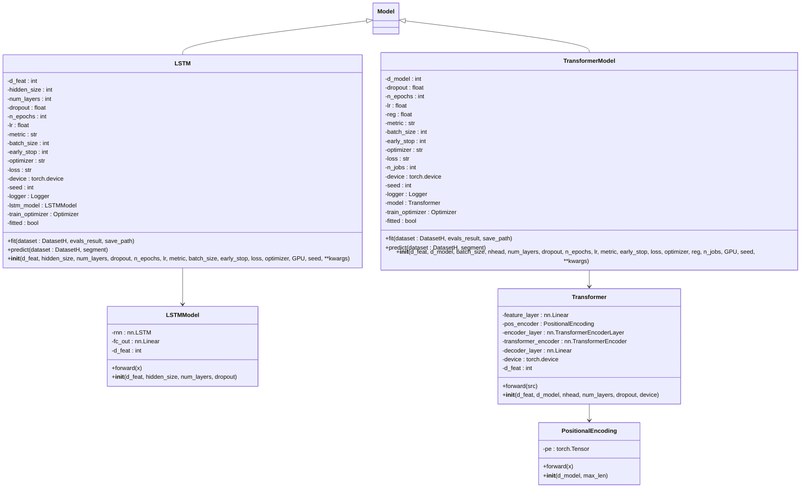
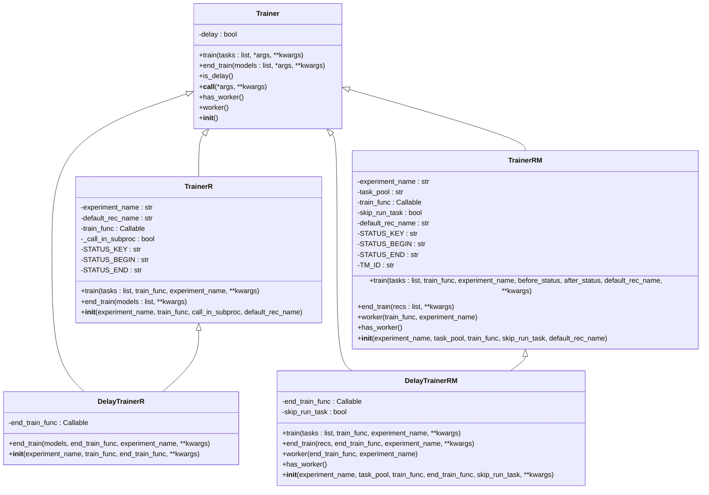
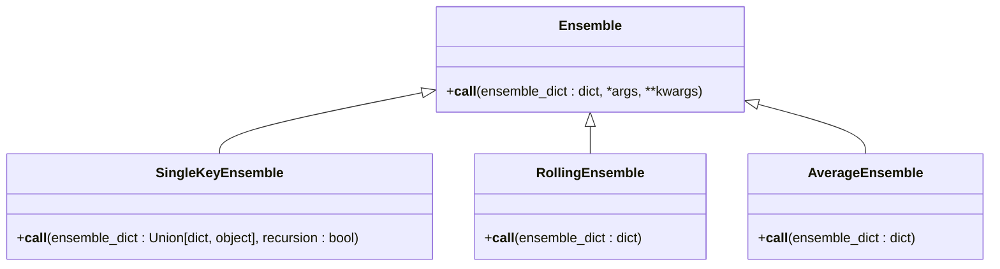
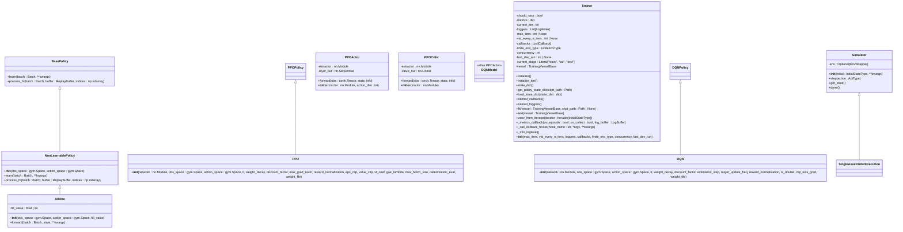

# 模型API

<cite>
**本文档引用的文件**
- [base.py](file://qlib/model/base.py)
- [trainer.py](file://qlib/model/trainer.py)
- [__init__.py](file://qlib/contrib/model/__init__.py)
- [ensemble.py](file://qlib/model/ens/ensemble.py)
- [__init__.py](file://qlib/rl/__init__.py)
- [catboost_model.py](file://qlib/contrib/model/catboost_model.py)
- [pytorch_lstm.py](file://qlib/contrib/model/pytorch_lstm.py)
- [pytorch_transformer.py](file://qlib/contrib/model/pytorch_transformer.py)
- [trainer.py](file://qlib/rl/trainer/trainer.py)
- [base.py](file://qlib/rl/data/base.py)
- [policy.py](file://qlib/rl/order_execution/policy.py)
- [simulator.py](file://qlib/rl/simulator.py)
</cite>

## 目录
1. [简介](#简介)
2. [基础模型接口](#基础模型接口)
3. [训练器](#训练器)
4. [集成学习](#集成学习)
5. [强化学习框架](#强化学习框架)
6. [自定义模型开发指南](#自定义模型开发指南)

## 简介
Qlib提供了一套完整的模型API，支持从基础模型训练到复杂强化学习的全流程。本技术文档详细说明了模型API的核心组件，包括基础模型接口、训练器、集成学习和强化学习框架。文档重点阐述了Model.fit()、Model.predict()等标准方法的实现规范，以及如何通过Trainer进行分布式训练。同时，文档详细描述了contrib.model中各类模型（如CatBoost、LSTM、Transformer）的配置参数与调用方式，并针对qlib.rl模块说明了环境、策略、训练器的API设计与交互模式。

## 基础模型接口

Qlib的基础模型接口定义了机器学习模型的标准行为和生命周期。所有可学习的模型都继承自`Model`类，该类实现了`fit`和`predict`两个核心方法。`Model`类继承自`BaseModel`，后者提供了`__call__`方法，使得模型实例可以像函数一样被调用，实际上调用的是`predict`方法。

`Model`类的`fit`方法用于从数据集中学习模型参数。该方法接收一个`Dataset`对象作为输入，该对象负责生成用于模型训练的预处理数据。在训练过程中，模型需要从数据集中提取特征、标签和权重。`predict`方法则用于在给定数据集上进行预测，返回特定类型（如`pandas.Series`）的预测结果。

对于需要微调的模型，Qlib提供了`ModelFT`基类，它定义了`finetune`方法。微调模型的典型使用场景是先训练一个初始模型，然后基于该模型进行微调。这种模式在迁移学习和持续学习场景中非常有用。

**Section sources**
- [base.py](file://qlib/model/base.py#L1-L111)

### CatBoost模型

CatBoost模型是Qlib中集成的一个梯度提升决策树模型。`CatBoostModel`类继承自`Model`和`FeatureInt`，实现了`fit`、`predict`和`get_feature_importance`方法。`fit`方法配置了CatBoost的训练参数，包括损失函数、迭代次数、早停轮数等，并支持GPU加速。`predict`方法在模型未训练时会抛出异常，确保模型状态的正确性。`get_feature_importance`方法返回特征重要性，支持CatBoost提供的各种重要性计算方法。

**Diagram sources**
- [base.py](file://qlib/model/base.py#L10-L80)
- [catboost_model.py](file://qlib/contrib/model/catboost_model.py#L17-L101)

### PyTorch模型

Qlib支持多种基于PyTorch的深度学习模型，包括LSTM、Transformer等。这些模型都遵循相同的训练和预测模式。以`LSTM`模型为例，它继承自`Model`类，实现了`fit`和`predict`方法。`fit`方法负责模型的训练过程，包括数据准备、模型初始化、优化器配置、训练循环和早停机制。`predict`方法则用于在测试集上进行预测，返回预测结果。

PyTorch模型的训练过程通常包括以下几个步骤：首先，从数据集中准备训练、验证和测试数据；然后，初始化模型和优化器；接着，执行训练循环，在每个epoch中进行训练和验证；最后，保存最佳模型参数。预测过程则相对简单，主要是将测试数据输入训练好的模型，获取预测结果。

**Diagram sources**
- [pytorch_lstm.py](file://qlib/contrib/model/pytorch_lstm.py#L24-L307)
- [pytorch_transformer.py](file://qlib/contrib/model/pytorch_transformer.py#L27-L286)

## 训练器

Qlib的训练器（Trainer）负责管理模型的训练过程。`Trainer`类是一个抽象基类，定义了`train`和`end_train`两个核心方法。`train`方法负责开始训练过程，而`end_train`方法则在训练结束后执行一些收尾工作。`Trainer`类还提供了`is_delay`方法来判断是否为延迟训练器，以及`has_worker`和`worker`方法来支持并行训练。

`TrainerR`是基于记录器（Recorder）的训练器实现，它以线性方式训练一系列任务并返回训练好的记录器列表。`DelayTrainerR`是`TrainerR`的延迟实现，其`train`方法只进行一些准备工作，真正的模型拟合在`end_train`方法中完成。`TrainerRM`是基于记录器和任务管理器（TaskManager）的训练器，支持多进程方式训练任务。`DelayTrainerRM`是`TrainerRM`的延迟实现，适用于在线模拟等场景。

**Diagram sources**
- [trainer.py](file://qlib/model/trainer.py#L131-L620)

## 集成学习

Qlib的集成学习模块提供了多种模型集成方法。`Ensemble`类是一个抽象基类，定义了`__call__`方法，用于将多个模型的预测结果合并为一个集成预测。`SingleKeyEnsemble`类用于提取字典中唯一的键值对，使得结果更易读。`RollingEnsemble`类用于合并滚动预测结果，通过连接多个数据帧并去除重复索引来生成完整的滚动结果。`AverageEnsemble`类用于对多个相同形状的数据帧进行平均和标准化，首先将嵌套字典展平，然后沿指定轴连接值，最后计算均值。

**Diagram sources**
- [ensemble.py](file://qlib/model/ens/ensemble.py#L14-L133)

## 强化学习框架

Qlib的强化学习框架提供了一套完整的API来构建和训练强化学习模型。框架的核心组件包括环境（Simulator）、策略（Policy）和训练器（Trainer）。`Simulator`类是一个泛型类，定义了强化学习环境的基本行为，包括`__init__`、`step`、`get_state`和`done`方法。`step`方法接收一个动作并更新环境状态，`get_state`方法返回当前状态，`done`方法检查环境是否处于结束状态。

`Policy`类定义了强化学习策略的行为。Qlib提供了多种策略实现，包括非学习型策略（如`AllOne`）和学习型策略（如`PPO`和`DQN`）。`AllOne`策略返回一个全为1的批次，适用于实现一些基线算法（如TWAP）。`PPO`和`DQN`策略是基于tianshou库的封装，支持离散动作空间，并提供了自动创建actor和critic网络、去重公共参数、加载检查点等功能。

`Trainer`类是强化学习训练的核心，负责管理整个训练过程。它以"收集"（collect）为迭代单位，而不是传统的"epoch"或"mini-batch"。在每次收集过程中，收集器（Collector）收集一定数量的策略-环境交互，并将其累积到回放缓冲区中。这个缓冲区作为训练策略的"数据"。在每次收集结束时，策略会被更新多次。`Trainer`类还支持验证、日志记录和回调函数，提供了类似于PyTorch Lightning的API风格，但专为强化学习应用设计。

**Diagram sources**
- [simulator.py](file://qlib/rl/simulator.py#L21-L76)
- [policy.py](file://qlib/rl/order_execution/policy.py#L25-L238)
- [trainer.py](file://qlib/rl/trainer/trainer.py#L30-L356)

## 自定义模型开发指南

开发自定义模型时，需要继承`Model`或`ModelFT`基类，并实现`fit`和`predict`方法。`fit`方法负责模型的训练过程，需要从`Dataset`对象中准备训练和验证数据，并执行模型训练。`predict`方法用于在测试集上进行预测，返回预测结果。如果需要支持微调功能，则应继承`ModelFT`类并实现`finetune`方法。

在实现`fit`方法时，需要注意以下几点：首先，需要从数据集中提取特征、标签和权重；其次，需要配置模型的训练参数，如迭代次数、学习率、早停轮数等；最后，需要实现训练循环，并在验证集上监控模型性能，以实现早停。在实现`predict`方法时，需要检查模型是否已经训练，如果未训练则抛出异常。

状态序列化是自定义模型开发中的一个重要方面。Qlib的模型需要能够被序列化和反序列化，以便在不同环境中使用。这通常通过实现`Serializable`接口来完成。性能监控则可以通过在训练过程中记录损失、准确率等指标来实现，这些指标可以用于早停和模型选择。

**Section sources**
- [base.py](file://qlib/model/base.py#L1-L111)
- [catboost_model.py](file://qlib/contrib/model/catboost_model.py#L17-L101)
- [pytorch_lstm.py](file://qlib/contrib/model/pytorch_lstm.py#L24-L307)
- [pytorch_transformer.py](file://qlib/contrib/model/pytorch_transformer.py#L27-L286)