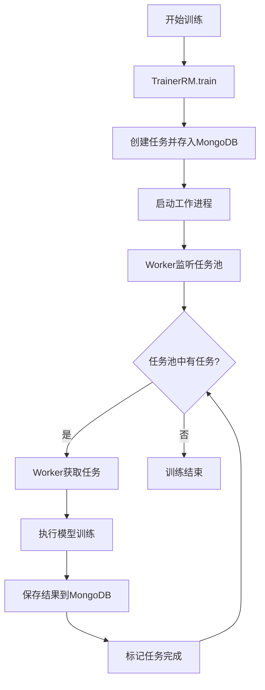
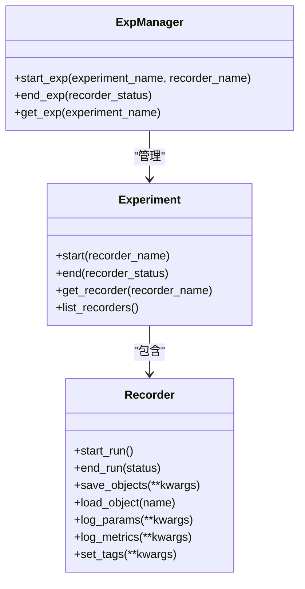
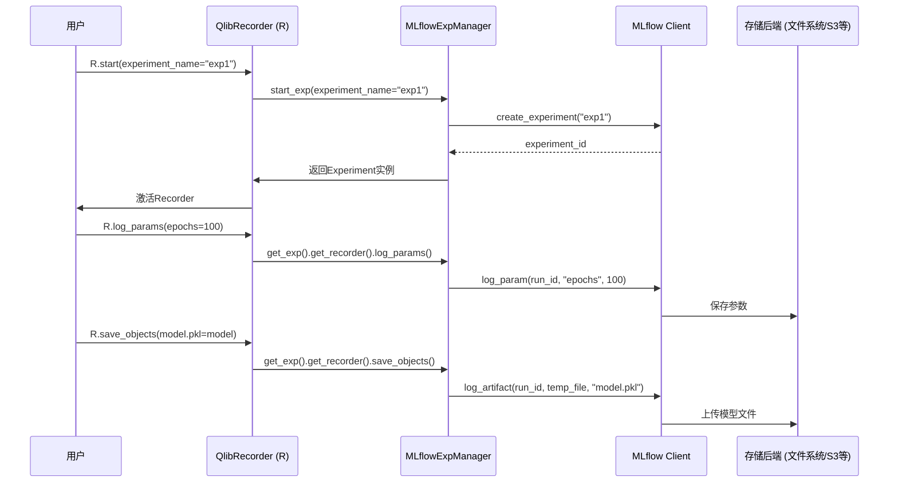

# 模型训练与评估

<cite>
**本文档引用的文件**   
- [trainer.py](file://qlib/model/trainer.py)
- [expm.py](file://qlib/workflow/expm.py)
- [exp.py](file://qlib/workflow/exp.py)
- [recorder.py](file://qlib/workflow/recorder.py)
- [manage.py](file://qlib/workflow/task/manage.py)
- [workflow_config_doubleensemble_early_stop_Alpha158.yaml](file://examples/benchmarks/DoubleEnsemble/workflow_config_doubleensemble_early_stop_Alpha158.yaml)
- [workflow_config_gru_Alpha158.yaml](file://examples/benchmarks/GRU/workflow_config_gru_Alpha158.yaml)
</cite>

## 目录
1. [简介](#简介)
2. [Trainer类与分布式训练管理](#trainer类与分布式训练管理)
3. [实验记录与模型检查点](#实验记录与模型检查点)
4. [训练配置参数传递](#训练配置参数传递)
5. [工作流与外部系统集成](#工作流与外部系统集成)
6. [高级训练模式与性能优化](#高级训练模式与性能优化)

## 简介
本文档详细阐述了QLib框架中模型训练与评估的完整流程。核心内容围绕`Trainer`类展开，该类负责协调数据加载、模型训练、验证评估和结果记录的整个生命周期。文档将深入解析`Trainer`的两种实现方式（`TrainerR`和`TrainerRM`），它们分别支持线性训练和基于任务管理器的多进程/分布式训练。同时，文档会详细介绍实验管理器（ExpManager）如何与MLflow等外部系统集成，实现对训练过程的全面追踪和记录。此外，还将说明训练配置参数（如epochs、batch_size、early_stopping）的作用域和传递路径，并提供多GPU训练和混合精度训练等高级模式的配置示例与性能优化建议。

## Trainer类与分布式训练管理

`Trainer`是QLib中负责模型训练的核心抽象类，它定义了训练流程的两个关键阶段：`train`（开始训练）和`end_train`（结束训练）。`Trainer`的实现遵循“延迟训练”（DelayTrainer）的概念，允许将训练任务的准备和实际执行分离，这对于在线模拟和并行训练场景至关重要。

`Trainer`有两个主要的实现类：`TrainerR`和`TrainerRM`。`TrainerR`是最简单的实现，它在`train`方法中直接完成模型的拟合，以线性方式训练任务列表。而`TrainerRM`则基于`TaskManager`，能够实现多进程甚至跨机器的分布式训练。`TrainerRM`通过将任务定义存储在MongoDB数据库中，允许多个工作进程或机器从任务池中获取并执行任务，从而实现并行化。

`TrainerRM`的`worker`方法是其分布式能力的关键。调用此方法后，一个独立的进程会持续监听指定的任务池（`task_pool`），并自动执行处于“等待”（waiting）状态的任务。这使得主训练流程可以专注于任务的调度和管理，而繁重的模型拟合工作则由后台工作进程完成。

**Diagram sources**
- [trainer.py](file://qlib/model/trainer.py#L341-L619)
- [manage.py](file://qlib/workflow/task/manage.py#L483-L549)

**Section sources**
- [trainer.py](file://qlib/model/trainer.py#L131-L619)

## 实验记录与模型检查点

QLib通过`ExpManager`（实验管理器）和`Recorder`（记录器）来管理训练过程中的所有信息，包括模型检查点、预测结果、超参数和评估指标。这一机制与MLflow深度集成，提供了强大的实验追踪能力。

`ExpManager`是实验的顶层管理器，它负责创建和管理`Experiment`实例。`Experiment`代表一个逻辑上的实验，可以包含多个`Recorder`。每个`Recorder`对应一次具体的模型训练运行，它负责记录该次运行的所有细节。当使用`Trainer`进行训练时，`task_train`函数会启动一个`Recorder`，记录任务配置，并在训练完成后保存模型和数据集对象。

模型检查点的保存与恢复是通过`Recorder`的`save_objects`和`load_object`方法实现的。在训练过程中，模型的状态（如PyTorch的`state_dict`）会被序列化并作为工件（artifact）保存到`Recorder`指定的存储位置（如本地文件系统或远程服务器）。在需要恢复模型时，可以通过`load_object`方法从指定的`Recorder`中加载这些检查点。这种机制确保了训练过程的可重现性和结果的可追溯性。

**Diagram sources**
- [expm.py](file://qlib/workflow/expm.py#L23-L619)
- [exp.py](file://qlib/workflow/exp.py#L15-L380)
- [recorder.py](file://qlib/workflow/recorder.py#L28-L494)

**Section sources**
- [expm.py](file://qlib/workflow/expm.py#L23-L435)
- [exp.py](file://qlib/workflow/exp.py#L15-L380)
- [recorder.py](file://qlib/workflow/recorder.py#L28-L494)

## 训练配置参数传递

训练配置参数在QLib中通过YAML配置文件定义，并在训练流程的各个组件间传递。核心配置位于`task`字段下，包含`model`、`dataset`和`record`三个主要部分。

`model`部分的`kwargs`字典定义了模型的超参数，如`epochs`（训练轮数）、`batch_size`（批次大小）和`early_stopping_rounds`（早停轮数）。这些参数在模型初始化时被传递给模型类的构造函数。例如，在`DoubleEnsemble`模型的配置中，`epochs: 1000`和`early_stopping_rounds: 50`直接控制了训练循环的迭代次数和早停条件。

`dataset`部分定义了数据集的处理逻辑，包括数据处理器（`infer_processors`和`learn_processors`）和数据分段（`segments`）。这些配置决定了训练、验证和测试数据的划分方式。

这些配置参数的作用域主要在`task_train`函数中。该函数首先解析`task_config`，初始化模型和数据集，然后调用模型的`fit`方法进行训练。在此过程中，所有在`task_config`中定义的参数都会被正确地传递到相应的组件。`R.log_params(**flatten_dict(task_config))`这行代码确保了整个任务配置都会被记录到实验管理器中，便于后续分析。

**Section sources**
- [workflow_config_doubleensemble_early_stop_Alpha158.yaml](file://examples/benchmarks/DoubleEnsemble/workflow_config_doubleensemble_early_stop_Alpha158.yaml#L31-L67)
- [workflow_config_gru_Alpha158.yaml](file://examples/benchmarks/GRU/workflow_config_gru_Alpha158.yaml#L53-L70)
- [trainer.py](file://qlib/model/trainer.py#L42-L54)

## 工作流与外部系统集成

QLib的工作流（workflow）模块是连接内部训练逻辑与外部实验管理系统（如MLflow）的桥梁。`QlibRecorder`（通常以全局变量`R`表示）是用户与实验管理系统交互的主要接口。

通过`R.start(experiment_name=...)`上下文管理器，用户可以启动一个新的实验和记录器。在此上下文中执行的所有操作，如`R.log_params`、`R.log_metrics`和`R.save_objects`，都会被自动记录到当前激活的`Recorder`中。`QlibRecorder`内部使用`MLflowExpManager`作为后端，将所有记录操作转发给MLflow客户端。

这种集成方式使得QLib能够利用MLflow强大的功能，如Web UI可视化、模型注册和跨团队协作。同时，`QlibRecorder`的封装也提供了更简洁的API，例如`save_objects`可以直接保存Python对象，而无需手动处理文件序列化。

**Diagram sources**
- [__init__.py](file://qlib/workflow/__init__.py#L26-L681)
- [expm.py](file://qlib/workflow/expm.py#L318-L435)
- [recorder.py](file://qlib/workflow/recorder.py#L247-L494)

**Section sources**
- [__init__.py](file://qlib/workflow/__init__.py#L26-L681)

## 高级训练模式与性能优化

QLib支持多种高级训练模式，以适应不同的硬件环境和性能需求。

对于多GPU训练，模型配置中通常包含一个`GPU`参数（如`GPU: 0`），指定使用的GPU设备。虽然QLib本身不直接管理多GPU的并行计算（如数据并行或模型并行），但它为底层模型（如基于PyTorch的模型）提供了指定设备的能力。用户需要在模型代码中实现具体的多GPU策略。

混合精度训练是一种重要的性能优化技术，它通过使用16位浮点数（FP16）来加速训练并减少显存占用。虽然在提供的配置文件中未直接体现，但可以在模型的`kwargs`中添加相关参数来启用。例如，对于PyTorch模型，可以设置`amp=True`（自动混合精度）或使用`torch.cuda.amp`模块。

性能优化建议包括：
1.  **使用`TrainerRM`进行并行训练**：对于大量独立任务，使用`TrainerRM`配合`TaskManager`可以显著缩短总训练时间。
2.  **合理配置`batch_size`**：过大的`batch_size`可能导致显存溢出，过小则影响训练效率。应根据GPU显存大小进行调整。
3.  **启用早停（Early Stopping）**：通过设置`early_stopping_rounds`，可以在验证集性能不再提升时提前终止训练，避免过拟合并节省计算资源。
4.  **优化数据加载**：利用`Dataset`的缓存机制和多进程数据加载（`n_jobs`参数）来减少I/O瓶颈。

**Section sources**
- [workflow_config_gru_Alpha158.yaml](file://examples/benchmarks/GRU/workflow_config_gru_Alpha158.yaml#L58-L69)
- [trainer.py](file://qlib/model/trainer.py#L222-L242)
- [pytorch_gru_ts.py](file://qlib/contrib/model/pytorch_gru_ts.py) (隐含在配置中)