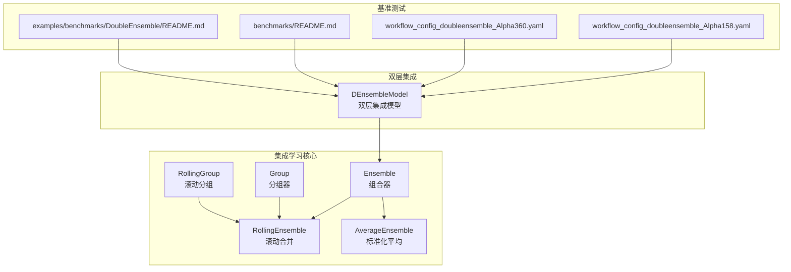
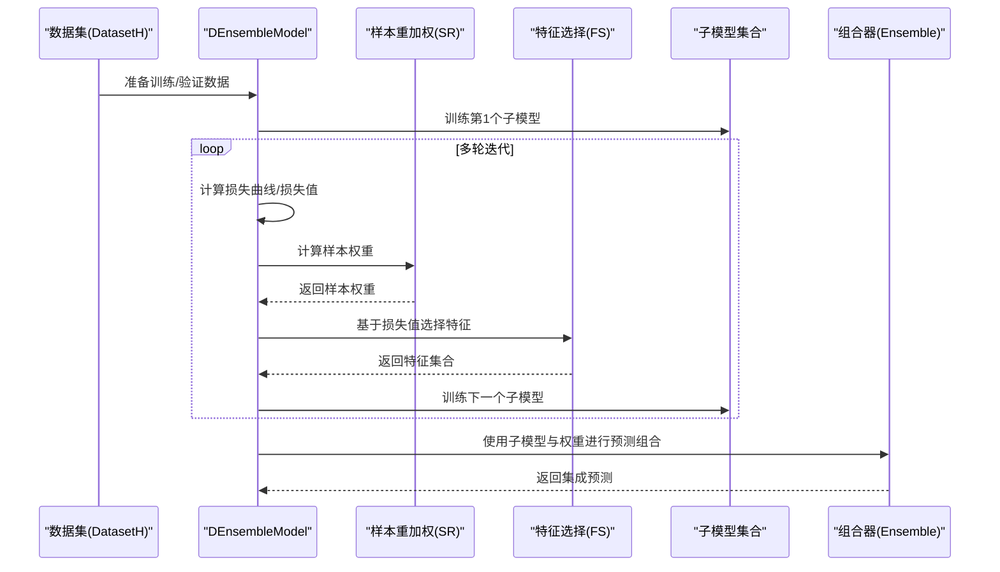
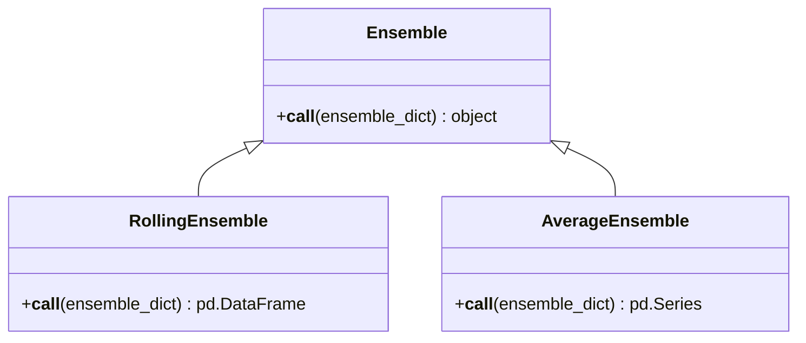
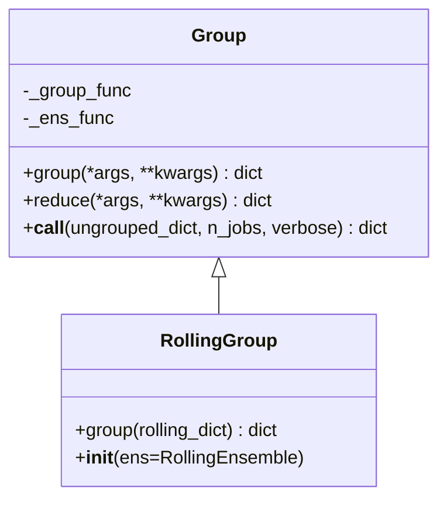
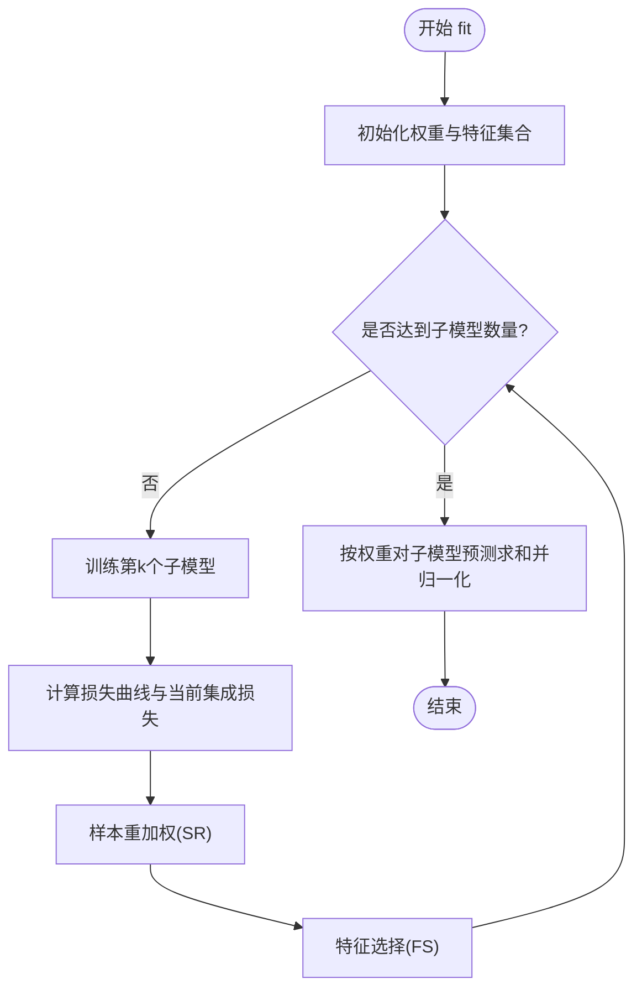
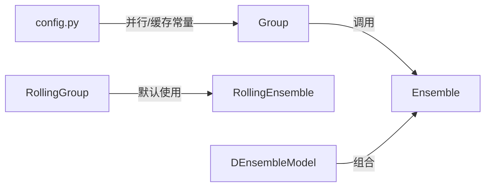

# 集成学习模型

<cite>
**本文引用的文件列表**
- [ensemble.py](file://qlib/model/ens/ensemble.py)
- [group.py](file://qlib/model/ens/group.py)
- [double_ensemble.py](file://qlib/contrib/model/double_ensemble.py)
- [workflow_config_doubleensemble_Alpha158.yaml](file://examples/benchmarks/DoubleEnsemble/workflow_config_doubleensemble_Alpha158.yaml)
- [workflow_config_doubleensemble_Alpha360.yaml](file://examples/benchmarks/DoubleEnsemble/workflow_config_doubleensemble_Alpha360.yaml)
- [README.md](file://examples/benchmarks/DoubleEnsemble/README.md)
- [benchmarks/README.md](file://examples/benchmarks/README.md)
- [config.py](file://qlib/config.py)
</cite>

## 目录
1. [简介](#简介)
2. [项目结构](#项目结构)
3. [核心组件](#核心组件)
4. [架构总览](#架构总览)
5. [详细组件分析](#详细组件分析)
6. [依赖关系分析](#依赖关系分析)
7. [性能考量](#性能考量)
8. [故障排查指南](#故障排查指南)
9. [结论](#结论)
10. [附录](#附录)

## 简介
本文件面向开发与研究者，系统梳理 Qlib 中的集成学习模型与组合策略，重点覆盖以下主题：
- Ensemble 与 Group 类的架构设计与职责边界
- 加权平均、滚动融合、堆叠（Stacking）等集成方法的实现方式与配置要点
- 双层集成（DoubleEnsemble）的双阶段机制（样本重加权与特征选择）及在基准测试中的应用
- 自定义集成策略的开发指南：权重优化、模型依赖管理、预测结果对齐
- 训练并行化、缓存复用与性能瓶颈规避

## 项目结构
围绕集成学习的关键代码位于以下模块：
- 模型组合与分组：qlib/model/ens/ensemble.py、qlib/model/ens/group.py
- 双层集成实现：qlib/contrib/model/double_ensemble.py
- 基准测试工作流配置：examples/benchmarks/DoubleEnsemble/*.yaml
- 基准测试汇总：examples/benchmarks/README.md
- 并行与缓存配置：qlib/config.py

图表来源
- [ensemble.py](file://qlib/model/ens/ensemble.py#L1-L133)
- [group.py](file://qlib/model/ens/group.py#L1-L116)
- [double_ensemble.py](file://qlib/contrib/model/double_ensemble.py#L1-L278)
- [workflow_config_doubleensemble_Alpha158.yaml](file://examples/benchmarks/DoubleEnsemble/workflow_config_doubleensemble_Alpha158.yaml#L1-L93)
- [workflow_config_doubleensemble_Alpha360.yaml](file://examples/benchmarks/DoubleEnsemble/workflow_config_doubleensemble_Alpha360.yaml#L1-L100)
- [benchmarks/README.md](file://examples/benchmarks/README.md#L27-L88)
- [README.md](file://examples/benchmarks/DoubleEnsemble/README.md#L1-L4)

章节来源
- [ensemble.py](file://qlib/model/ens/ensemble.py#L1-L133)
- [group.py](file://qlib/model/ens/group.py#L1-L116)
- [double_ensemble.py](file://qlib/contrib/model/double_ensemble.py#L1-L278)
- [workflow_config_doubleensemble_Alpha158.yaml](file://examples/benchmarks/DoubleEnsemble/workflow_config_doubleensemble_Alpha158.yaml#L1-L93)
- [workflow_config_doubleensemble_Alpha360.yaml](file://examples/benchmarks/DoubleEnsemble/workflow_config_doubleensemble_Alpha360.yaml#L1-L100)
- [benchmarks/README.md](file://examples/benchmarks/README.md#L27-L88)
- [README.md](file://examples/benchmarks/DoubleEnsemble/README.md#L1-L4)

## 核心组件
- Ensemble 抽象基类：定义组合接口，子类实现具体组合策略（如滚动合并、标准化平均）
- RollingEnsemble：按时间索引拼接滚动结果，去重并排序
- AverageEnsemble：对同形 DataFrame 进行标准化后按日期聚合平均
- Group 分组器：根据自定义分组函数将对象分组，并通过 Ensemble 对组内对象进行归约
- RollingGroup：针对滚动键元组的专用分组器，默认使用 RollingEnsemble 归约
- DEnsembleModel：双层集成模型，包含样本重加权（SR）与特征选择（FS）两阶段，最终以加权平均进行预测

章节来源
- [ensemble.py](file://qlib/model/ens/ensemble.py#L14-L133)
- [group.py](file://qlib/model/ens/group.py#L20-L116)
- [double_ensemble.py](file://qlib/contrib/model/double_ensemble.py#L1-L278)

## 架构总览
下图展示从数据到模型再到组合器的整体流程，以及双层集成的双阶段机制。

图表来源
- [double_ensemble.py](file://qlib/contrib/model/double_ensemble.py#L65-L173)
- [ensemble.py](file://qlib/model/ens/ensemble.py#L91-L133)

## 详细组件分析

### 组件一：Ensemble 家族
- Ensemble：抽象基类，要求实现调用接口以完成组合
- RollingEnsemble：将多个带“datetime”索引的 DataFrame 按最早时间排序拼接，去重保留最新，再整体排序
- AverageEnsemble：扁平化嵌套字典，按日期分组标准化后取均值，最后排序返回序列

图表来源
- [ensemble.py](file://qlib/model/ens/ensemble.py#L14-L133)

章节来源
- [ensemble.py](file://qlib/model/ens/ensemble.py#L14-L133)

### 组件二：Group 家族
- Group：接收未分组字典，通过 group_func 进行分组；随后对每个组调用 ens_func 进行归约；支持多进程并行 reduce
- RollingGroup：专门处理滚动键为元组的情形，将末尾滚动键作为第二层分组键，预设使用 RollingEnsemble 归约

图表来源
- [group.py](file://qlib/model/ens/group.py#L20-L116)

章节来源
- [group.py](file://qlib/model/ens/group.py#L20-L116)

### 组件三：双层集成（DoubleEnsemble）
- 核心思想：利用学习轨迹（每棵树的累积预测）识别关键样本并动态调整样本权重；通过打乱特征评估各特征对整体预测稳定性的影响，从而进行特征筛选
- 关键流程：
  - 初始化样本权重与特征集合
  - 循环训练子模型，每次：
    - 计算损失曲线与当前集成损失
    - 样本重加权（SR）：基于损失曲线与当前损失计算 h 值，按分箱分配权重
    - 特征选择（FS）：对每个特征做随机置换，评估其对损失差异的贡献，按分箱采样选择特征
- 预测阶段：对所有子模型按权重求和并归一化

图表来源
- [double_ensemble.py](file://qlib/contrib/model/double_ensemble.py#L65-L173)
- [double_ensemble.py](file://qlib/contrib/model/double_ensemble.py#L175-L219)
- [double_ensemble.py](file://qlib/contrib/model/double_ensemble.py#L247-L264)

章节来源
- [double_ensemble.py](file://qlib/contrib/model/double_ensemble.py#L1-L278)

### 组件四：基准测试与配置
- 在 Alpha158 与 Alpha360 数据集上运行双层集成工作流，分别提供配置文件与结果对比
- 配置项涵盖：子模型数量、是否启用 SR/FS、权重衰减、采样比例、子模型权重、LightGBM 超参等

章节来源
- [workflow_config_doubleensemble_Alpha158.yaml](file://examples/benchmarks/DoubleEnsemble/workflow_config_doubleensemble_Alpha158.yaml#L1-L93)
- [workflow_config_doubleensemble_Alpha360.yaml](file://examples/benchmarks/DoubleEnsemble/workflow_config_doubleensemble_Alpha360.yaml#L1-L100)
- [benchmarks/README.md](file://examples/benchmarks/README.md#L27-L88)
- [README.md](file://examples/benchmarks/DoubleEnsemble/README.md#L1-L4)

## 依赖关系分析
- 组合器依赖：
  - RollingEnsemble 依赖 RollingGroup 的分组结果
  - AverageEnsemble 依赖数据结构满足“datetime”索引且形状一致
- 并行与缓存：
  - Group 的 reduce 支持 joblib 并行执行
  - 全局配置提供 CPU 数量与缓存类型常量，便于并行与缓存策略选择

图表来源
- [group.py](file://qlib/model/ens/group.py#L20-L116)
- [ensemble.py](file://qlib/model/ens/ensemble.py#L14-L133)
- [double_ensemble.py](file://qlib/contrib/model/double_ensemble.py#L1-L278)
- [config.py](file://qlib/config.py#L104-L132)

章节来源
- [group.py](file://qlib/model/ens/group.py#L20-L116)
- [ensemble.py](file://qlib/model/ens/ensemble.py#L14-L133)
- [double_ensemble.py](file://qlib/contrib/model/double_ensemble.py#L1-L278)
- [config.py](file://qlib/config.py#L104-L132)

## 性能考量
- 训练并行化
  - Group 的 reduce 支持多进程并行，适合在 CPU 密集场景加速组合过程
  - 注意：若对象不可序列化，多进程会引发错误，需确保可被 pickle 序列化
- 缓存复用
  - 利用全局缓存常量选择合适的缓存策略，减少重复数据加载与计算
- 性能瓶颈规避
  - 标准化平均与滚动合并均为 O(N log N) 排序操作，建议控制输入规模或分批处理
  - 双层集成中 SR/FS 的分箱与分组操作可能成为热点，可通过合理设置分箱数与采样比例降低开销

章节来源
- [group.py](file://qlib/model/ens/group.py#L80-L90)
- [config.py](file://qlib/config.py#L126-L132)

## 故障排查指南
- “请指定有效的 group_func”或“请指定有效的 _ens_func”
  - 症状：调用 Group 时未提供有效的分组或归约函数
  - 处理：在初始化 Group 时传入可调用的 group_func 与 ens
- “Expected tuple type”异常
  - 症状：RollingGroup 输入键非元组
  - 处理：确保滚动字典的键为元组形式，且滚动键位于末尾
- “空数据”或“多标签不支持”
  - 症状：数据准备为空或标签维度不符合 LightGBM 要求
  - 处理：检查数据集配置与标签预处理流程
- “模型未拟合”
  - 症状：预测前未训练
  - 处理：先 fit 再 predict

章节来源
- [group.py](file://qlib/model/ens/group.py#L48-L66)
- [group.py](file://qlib/model/ens/group.py#L106-L112)
- [double_ensemble.py](file://qlib/contrib/model/double_ensemble.py#L66-L71)
- [double_ensemble.py](file://qlib/contrib/model/double_ensemble.py#L247-L249)

## 结论
- Qlib 的集成学习体系以 Ensemble 与 Group 为核心，提供了滚动合并、标准化平均等组合策略，并通过 RollingGroup 实现滚动场景下的高效分组与归约
- DEnsembleModel 将双层集成思想工程化落地，结合 SR 与 FS 两个阶段提升模型稳健性与泛化能力
- 通过合理的并行化与缓存策略，可在大规模数据与多模型场景下获得良好性能

## 附录

### 集成方法与配置要点
- 加权平均
  - 适用：多模型预测结果形状一致且具可比性
  - 关键点：确保预测结果对齐（索引一致），并在组合前进行必要的标准化
  - 参考实现：AverageEnsemble
- 排序融合
  - 适用：需要对预测进行排序稳定化处理
  - 关键点：按日期分组后进行标准化，避免不同日期间尺度差异影响
  - 参考实现：AverageEnsemble
- 堆叠（Stacking）
  - 适用：以子模型输出作为元特征训练上层模型
  - 关键点：注意特征对齐与时间一致性；可借助 Group/Ensemble 进行分组与归约
  - 参考实现：DEnsembleModel 的子模型集合与权重组合

章节来源
- [ensemble.py](file://qlib/model/ens/ensemble.py#L91-L133)
- [double_ensemble.py](file://qlib/contrib/model/double_ensemble.py#L247-L264)

### 双层集成（DoubleEnsemble）配置清单
- 子模型数量、是否启用 SR/FS、alpha1/alpha2、bins_sr/bins_fs、decay、sample_ratios、sub_weights、epochs、LightGBM 超参
- 参考配置文件：
  - [Alpha158 配置](file://examples/benchmarks/DoubleEnsemble/workflow_config_doubleensemble_Alpha158.yaml#L36-L66)
  - [Alpha360 配置](file://examples/benchmarks/DoubleEnsemble/workflow_config_doubleensemble_Alpha360.yaml#L43-L72)

章节来源
- [workflow_config_doubleensemble_Alpha158.yaml](file://examples/benchmarks/DoubleEnsemble/workflow_config_doubleensemble_Alpha158.yaml#L36-L66)
- [workflow_config_doubleensemble_Alpha360.yaml](file://examples/benchmarks/DoubleEnsemble/workflow_config_doubleensemble_Alpha360.yaml#L43-L72)

### 自定义集成策略开发指南
- 权重优化
  - 建议：以损失曲线与当前集成误差为依据，采用分箱与衰减策略动态分配样本权重
  - 参考：SR 模块的 h 值计算与分箱赋权
- 模型依赖管理
  - 建议：子模型特征集合与预测结果需保持一致；预测阶段按子模型权重线性组合并归一化
  - 参考：DEnsembleModel 的特征集合与权重组合
- 预测结果对齐
  - 建议：统一索引（如“datetime”）与排序，避免跨日期偏移导致的错误组合
  - 参考：RollingEnsemble 的去重与排序逻辑

章节来源
- [double_ensemble.py](file://qlib/contrib/model/double_ensemble.py#L140-L173)
- [double_ensemble.py](file://qlib/contrib/model/double_ensemble.py#L175-L219)
- [double_ensemble.py](file://qlib/contrib/model/double_ensemble.py#L247-L264)
- [ensemble.py](file://qlib/model/ens/ensemble.py#L65-L89)