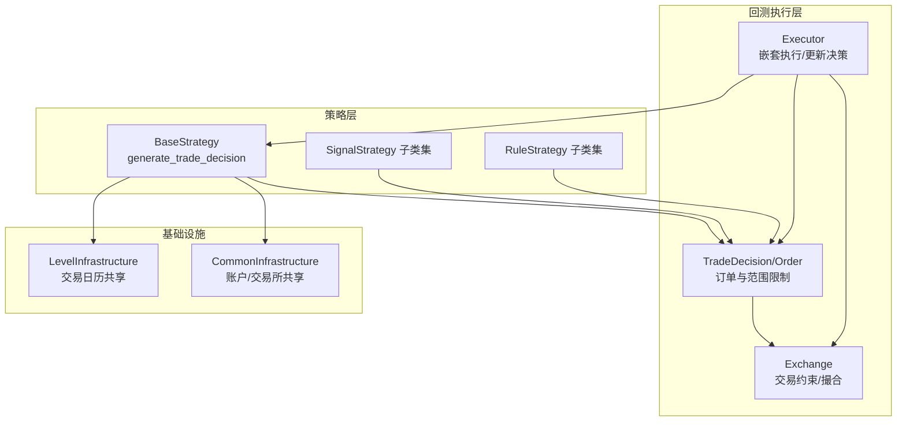
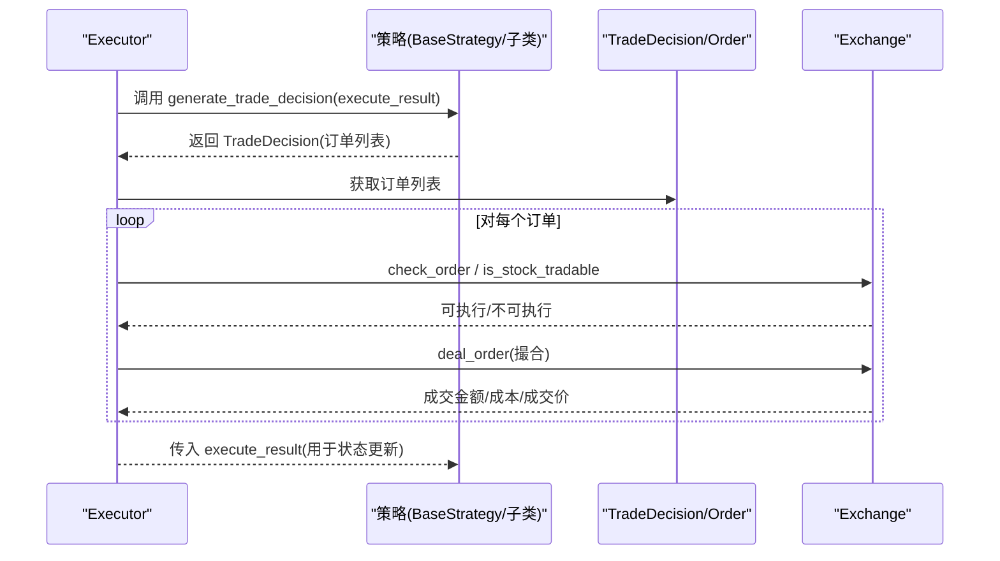
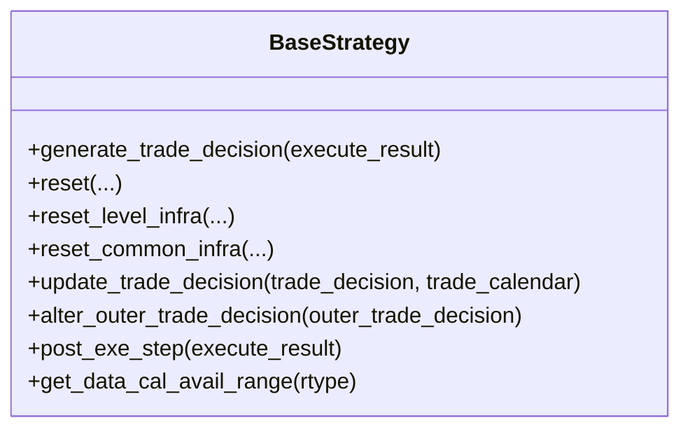
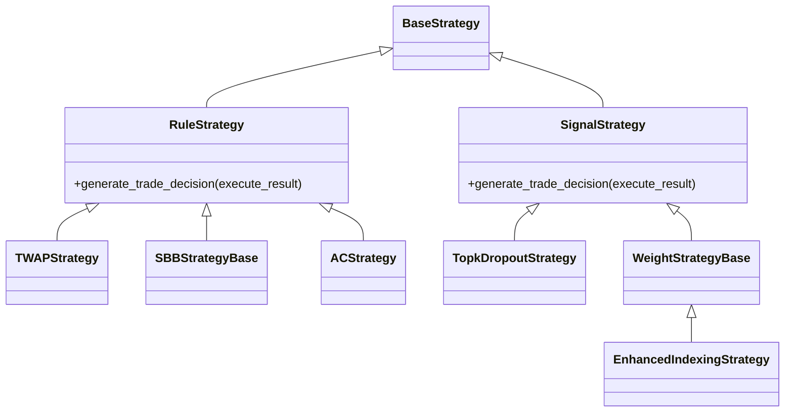
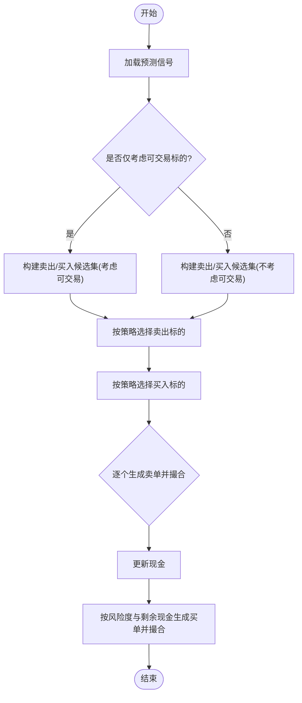
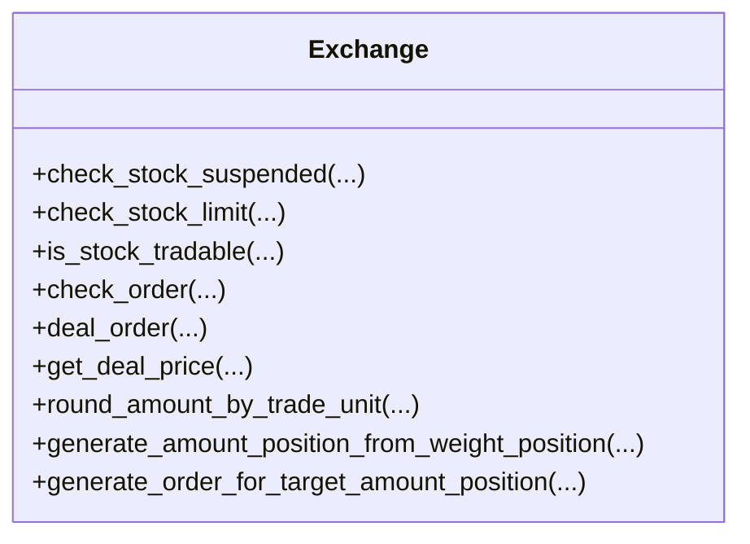
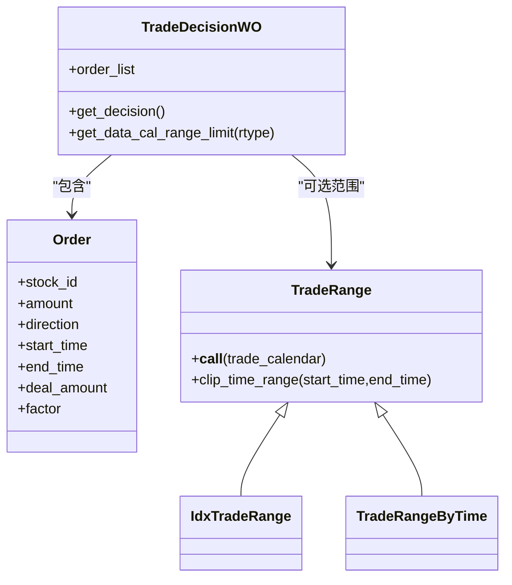
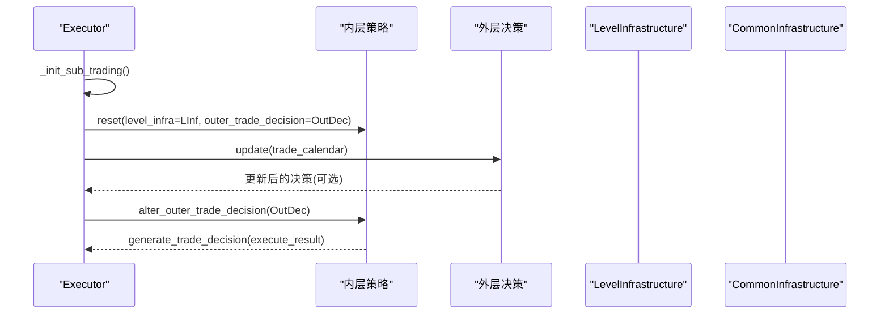
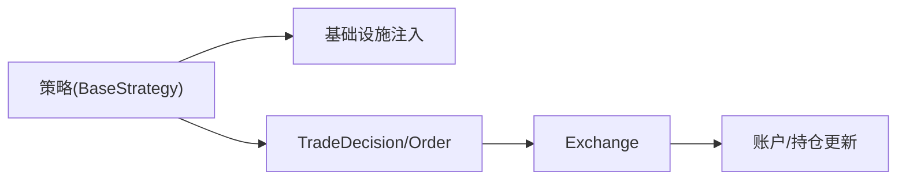

# 交易策略

<cite>
**本文引用的文件列表**
- [qlib/strategy/base.py](file://qlib/strategy/base.py)
- [qlib/contrib/strategy/rule_strategy.py](file://qlib/contrib/strategy/rule_strategy.py)
- [qlib/contrib/strategy/signal_strategy.py](file://qlib/contrib/strategy/signal_strategy.py)
- [qlib/backtest/decision.py](file://qlib/backtest/decision.py)
- [qlib/backtest/exchange.py](file://qlib/backtest/exchange.py)
- [qlib/backtest/executor.py](file://qlib/backtest/executor.py)
- [qlib/backtest/utils.py](file://qlib/backtest/utils.py)
- [qlib/contrib/strategy/order_generator.py](file://qlib/contrib/strategy/order_generator.py)
- [examples/benchmarks/LightGBM/workflow_config_lightgbm_Alpha158.yaml](file://examples/benchmarks/LightGBM/workflow_config_lightgbm_Alpha158.yaml)
- [qlib/contrib/evaluate.py](file://qlib/contrib/evaluate.py)
- [examples/nested_decision_execution/workflow.py](file://examples/nested_decision_execution/workflow.py)
- [examples/online_srv/online_management_simulate.py](file://examples/online_srv/online_management_simulate.py)
</cite>

## 目录
1. [引言](#引言)
2. [项目结构](#项目结构)
3. [核心组件](#核心组件)
4. [架构总览](#架构总览)
5. [详细组件分析](#详细组件分析)
6. [依赖关系分析](#依赖关系分析)
7. [性能考量](#性能考量)
8. [故障排查指南](#故障排查指南)
9. [结论](#结论)
10. [附录：自定义策略开发指南](#附录自定义策略开发指南)

## 引言
本文件面向希望深入理解并使用 Qlib 交易策略框架的开发者与研究者，系统解析以下关键问题：
- BaseStrategy 基类的核心接口 generate_trade_decision 的调用逻辑与返回结构
- RuleStrategy（基于规则）与 SignalStrategy（基于信号）两类策略在实现模式上的差异
- 以 TopkDropoutStrategy 为例，详解“选优去劣”算法流程及其参数（topk、n_drop）对换手率的影响
- 自定义策略开发的完整指南：如何继承基类、重写决策逻辑、处理边界条件
- 结合 workflow_config 示例说明策略在实际工作流中的集成方式
- 策略开发常见陷阱与最佳实践

## 项目结构
策略框架位于 qlib/strategy 与 qlib/contrib/strategy 下，核心交互围绕以下模块展开：
- 策略基类与具体策略：qlib/strategy/base.py、qlib/contrib/strategy/rule_strategy.py、qlib/contrib/strategy/signal_strategy.py
- 决策与订单模型：qlib/backtest/decision.py
- 交易执行与市场约束：qlib/backtest/exchange.py
- 执行器与基础设施：qlib/backtest/executor.py、qlib/backtest/utils.py
- 权重型策略的订单生成器：qlib/contrib/strategy/order_generator.py
- 工作流配置示例：examples/benchmarks/LightGBM/workflow_config_lightgbm_Alpha158.yaml 等

图表来源
- [qlib/strategy/base.py](file://qlib/strategy/base.py#L23-L147)
- [qlib/contrib/strategy/rule_strategy.py](file://qlib/contrib/strategy/rule_strategy.py#L22-L123)
- [qlib/contrib/strategy/signal_strategy.py](file://qlib/contrib/strategy/signal_strategy.py#L25-L110)
- [qlib/backtest/decision.py](file://qlib/backtest/decision.py#L302-L597)
- [qlib/backtest/exchange.py](file://qlib/backtest/exchange.py#L28-L120)
- [qlib/backtest/executor.py](file://qlib/backtest/executor.py#L389-L404)
- [qlib/backtest/utils.py](file://qlib/backtest/utils.py#L220-L250)

章节来源
- [qlib/strategy/base.py](file://qlib/strategy/base.py#L23-L147)
- [qlib/backtest/decision.py](file://qlib/backtest/decision.py#L302-L597)
- [qlib/backtest/exchange.py](file://qlib/backtest/exchange.py#L28-L120)
- [qlib/backtest/executor.py](file://qlib/backtest/executor.py#L389-L404)
- [qlib/backtest/utils.py](file://qlib/backtest/utils.py#L220-L250)

## 核心组件
- BaseStrategy：定义策略生命周期、基础设施注入、抽象接口 generate_trade_decision，以及跨层级通信钩子（如 update_trade_decision、alter_outer_trade_decision）
- TradeDecision/Order：封装单步交易决策（订单列表），支持时间范围限制与数据日历范围裁剪
- Exchange：提供交易约束检查（停牌、涨跌停、成交量限制）、报价与撮合、按交易单位取整等能力
- Executor：驱动策略迭代，负责决策更新、内外层策略联动、基础设施传递
- SignalStrategy/WeightStrategyBase：基于预测信号生成目标权重或直接生成订单；TopkDropoutStrategy 实现“选优去劣”的典型范式

章节来源
- [qlib/strategy/base.py](file://qlib/strategy/base.py#L23-L147)
- [qlib/backtest/decision.py](file://qlib/backtest/decision.py#L302-L597)
- [qlib/backtest/exchange.py](file://qlib/backtest/exchange.py#L338-L515)
- [qlib/backtest/executor.py](file://qlib/backtest/executor.py#L389-L404)
- [qlib/contrib/strategy/signal_strategy.py](file://qlib/contrib/strategy/signal_strategy.py#L25-L110)

## 架构总览
下图展示策略在一次回测中的典型调用链路：执行器推进到每一步，策略生成 TradeDecision，Exchange 检查可执行性并撮合，最终更新账户与报告。

图表来源
- [qlib/backtest/executor.py](file://qlib/backtest/executor.py#L389-L404)
- [qlib/strategy/base.py](file://qlib/strategy/base.py#L133-L146)
- [qlib/backtest/decision.py](file://qlib/backtest/decision.py#L547-L597)
- [qlib/backtest/exchange.py](file://qlib/backtest/exchange.py#L417-L464)

## 详细组件分析

### BaseStrategy 接口与调用逻辑
- generate_trade_decision(execute_result=None)：每步交易调用，返回 TradeDecision 或生成器（用于分步/异步决策）
- reset/reset_level_infra/reset_common_infra：注入基础设施（交易日历、账户、交易所等）
- update_trade_decision/alter_outer_trade_decision/post_exe_step：跨层级通信与后处理钩子
- get_data_cal_avail_range：结合外层决策与数据日历，计算可用决策区间

图表来源
- [qlib/strategy/base.py](file://qlib/strategy/base.py#L23-L239)

章节来源
- [qlib/strategy/base.py](file://qlib/strategy/base.py#L23-L239)

### RuleStrategy（基于规则）与 SignalStrategy（基于信号）实现模式对比
- RuleStrategy：以显式规则驱动下单，典型如 TWAP、SBB、AC、随机/文件驱动策略。侧重“按步按规则生成订单”，常直接构造 Order 并返回 TradeDecisionWO
- SignalStrategy：以预测信号为输入，先生成目标权重或直接生成订单，再由 Exchange 生成买卖订单。典型如 TopkDropoutStrategy、WeightStrategyBase、EnhancedIndexingStrategy

图表来源
- [qlib/contrib/strategy/rule_strategy.py](file://qlib/contrib/strategy/rule_strategy.py#L22-L123)
- [qlib/contrib/strategy/signal_strategy.py](file://qlib/contrib/strategy/signal_strategy.py#L25-L110)

章节来源
- [qlib/contrib/strategy/rule_strategy.py](file://qlib/contrib/strategy/rule_strategy.py#L22-L123)
- [qlib/contrib/strategy/signal_strategy.py](file://qlib/contrib/strategy/signal_strategy.py#L25-L110)

### TopkDropoutStrategy：“选优去劣”算法流程与参数影响
- 输入：pred_score（预测信号）、topk（保留/买入数量）、n_drop（每日替换数量）、method_buy/method_sell（选择策略）、hold_thresh（最低持有天数）、only_tradable/forbid_all_trade_at_limit（交易约束）
- 流程要点：
  - 计算当前持仓与新候选的排序，决定卖出集合（按策略选择低分股票或随机）
  - 计算买入集合（从剩余池中选 top 或随机，确保不超过 n_drop）
  - 逐个生成卖单并撮合，更新现金
  - 基于风险度与剩余现金按价格分配资金，生成买单并撮合
- 参数对换手率的影响：
  - topk：越大，保留池越大，潜在换手越低；但若信号区分度不高，仍可能频繁调整
  - n_drop：越大，每日调整幅度越高，换手率上升；过小则收敛慢
  - method_buy/method_sell：随机策略通常带来更高波动与换手
  - only_tradable/forbid_all_trade_at_limit：严格过滤可交易标的会减少无效订单，但可能降低择时精度

图表来源
- [qlib/contrib/strategy/signal_strategy.py](file://qlib/contrib/strategy/signal_strategy.py#L138-L295)

章节来源
- [qlib/contrib/strategy/signal_strategy.py](file://qlib/contrib/strategy/signal_strategy.py#L75-L295)

### 交易约束与撮合（Exchange）
- 交易约束：停牌、涨跌停、成交量限制、最小手续费等
- 报价与撮合：根据 deal_price（开盘/收盘/VWAP 等）计算成交金额与成本
- 交易单位取整：按 factor 与 trade_unit 进行向下取整，避免非整数手
- 订单检查：check_order/is_stock_tradable 统一入口

图表来源
- [qlib/backtest/exchange.py](file://qlib/backtest/exchange.py#L338-L785)

章节来源
- [qlib/backtest/exchange.py](file://qlib/backtest/exchange.py#L338-L785)

### 决策模型与范围限制（TradeDecision/Order）
- Order：封装股票代码、数量、方向、起止时间、成交结果等
- TradeDecisionWO：包含订单列表与可选的时间范围限制
- TradeRange/IdxTradeRange/TradeRangeByTime：支持按索引或时间段限制交易范围
- 数据日历范围限制：get_data_cal_range_limit 支持按日或步骤裁剪

图表来源
- [qlib/backtest/decision.py](file://qlib/backtest/decision.py#L30-L152)
- [qlib/backtest/decision.py](file://qlib/backtest/decision.py#L206-L301)
- [qlib/backtest/decision.py](file://qlib/backtest/decision.py#L547-L597)

章节来源
- [qlib/backtest/decision.py](file://qlib/backtest/decision.py#L30-L152)
- [qlib/backtest/decision.py](file://qlib/backtest/decision.py#L206-L301)
- [qlib/backtest/decision.py](file://qlib/backtest/decision.py#L547-L597)

### 嵌套执行与跨层通信（Executor/Infrastructure）
- Executor 在每步初始化子执行器，重置策略的 level_infra，并将外层 TradeDecision 注入
- update_trade_decision/alter_outer_trade_decision 允许上层策略动态调整下层决策
- LevelInfrastructure/CommonInfrastructure 提供交易日历、账户、交易所等共享资源

图表来源
- [qlib/backtest/executor.py](file://qlib/backtest/executor.py#L389-L404)
- [qlib/backtest/utils.py](file://qlib/backtest/utils.py#L220-L250)

章节来源
- [qlib/backtest/executor.py](file://qlib/backtest/executor.py#L389-L404)
- [qlib/backtest/utils.py](file://qlib/backtest/utils.py#L220-L250)

## 依赖关系分析
- 策略依赖基础设施：通过 reset 注入 LevelInfrastructure（交易日历）与 CommonInfrastructure（账户/交易所）
- 决策依赖 Exchange：所有订单在生成后需经 Exchange 检查与撮合
- 规则型策略与信号型策略分别通过不同路径生成订单：前者直接构造订单，后者通过信号生成目标权重再由 Exchange 生成订单

图表来源
- [qlib/strategy/base.py](file://qlib/strategy/base.py#L91-L147)
- [qlib/backtest/decision.py](file://qlib/backtest/decision.py#L547-L597)
- [qlib/backtest/exchange.py](file://qlib/backtest/exchange.py#L417-L464)

章节来源
- [qlib/strategy/base.py](file://qlib/strategy/base.py#L91-L147)
- [qlib/backtest/decision.py](file://qlib/backtest/decision.py#L547-L597)
- [qlib/backtest/exchange.py](file://qlib/backtest/exchange.py#L417-L464)

## 性能考量
- 交易单位取整与撮合：round_amount_by_trade_unit 与 deal_order 的组合会影响订单执行精度与成本
- 信号型策略的订单生成：WeightStrategyBase 通过 Exchange 的批量订单生成函数减少循环开销
- 嵌套执行：多层策略时，update_trade_decision/alter_outer_trade_decision 的调用频率与复杂度需控制，避免额外计算负担

[本节为通用指导，无需列出具体文件来源]

## 故障排查指南
- 订单无法成交：检查 is_stock_tradable/check_stock_limit/check_stock_suspended 与 deal_price 设置
- 换手异常：核对 topk、n_drop、method_buy/method_sell、only_tradable、forbid_all_trade_at_limit 的设置
- 决策范围不符：确认 TradeRange 的设置与 get_data_cal_range_limit 的裁剪行为
- 嵌套策略联动：确认 update_trade_decision/alter_outer_trade_decision 是否按预期修改决策

章节来源
- [qlib/backtest/exchange.py](file://qlib/backtest/exchange.py#L338-L515)
- [qlib/backtest/decision.py](file://qlib/backtest/decision.py#L452-L507)
- [qlib/backtest/executor.py](file://qlib/backtest/executor.py#L389-L404)

## 结论
Qlib 的策略框架以 BaseStrategy 为核心，通过 TradeDecision/Order 将抽象决策转化为可执行订单，并由 Exchange 提供统一的交易约束与撮合能力。RuleStrategy 与 SignalStrategy 分别代表“规则驱动”和“信号驱动”的两种主流范式，TopkDropoutStrategy 作为信号型策略的典型代表，展示了“选优去劣”的工程化实现。通过 workflow_config 的标准化配置，策略可无缝接入端到端工作流，实现从模型训练到回测分析的闭环。

[本节为总结性内容，无需列出具体文件来源]

## 附录：自定义策略开发指南
- 继承基类与实现接口
  - 继承 BaseStrategy，至少实现 generate_trade_decision
  - 如需跨层级通信，重写 update_trade_decision/alter_outer_trade_decision/post_exe_step
- 注入基础设施
  - 使用 reset/reset_level_infra/reset_common_infra 注入交易日历、账户、交易所等
- 决策生成规范
  - 返回 TradeDecisionWO（包含订单列表），必要时设置 trade_range 限制交易时段
  - 对于信号型策略，优先使用 SignalStrategy 基类，复用目标权重生成与订单生成流程
- 边界条件处理
  - 使用 Exchange 的 is_stock_tradable/check_order 确保订单可执行
  - 处理停牌、涨跌停、成交量限制等场景
  - 注意交易单位取整与最小手续费
- 集成工作流
  - 在 workflow_config 中声明策略 class/module_path/kwargs
  - 通过 qrun 或脚本方式运行，验证策略效果

章节来源
- [qlib/strategy/base.py](file://qlib/strategy/base.py#L23-L239)
- [qlib/contrib/strategy/signal_strategy.py](file://qlib/contrib/strategy/signal_strategy.py#L25-L110)
- [qlib/backtest/decision.py](file://qlib/backtest/decision.py#L547-L597)
- [qlib/backtest/exchange.py](file://qlib/backtest/exchange.py#L338-L515)
- [examples/benchmarks/LightGBM/workflow_config_lightgbm_Alpha158.yaml](file://examples/benchmarks/LightGBM/workflow_config_lightgbm_Alpha158.yaml#L1-L72)

## 实际工作流集成示例
- 通过 workflow_config 指定策略类与参数，回测阶段自动加载模型/数据并生成信号，随后由策略生成交易决策
- 在在线模拟场景中，先生成信号，再以 TopkDropoutStrategy 进行回测分析

章节来源
- [examples/benchmarks/LightGBM/workflow_config_lightgbm_Alpha158.yaml](file://examples/benchmarks/LightGBM/workflow_config_lightgbm_Alpha158.yaml#L1-L72)
- [examples/nested_decision_execution/workflow.py](file://examples/nested_decision_execution/workflow.py#L276-L394)
- [examples/online_srv/online_management_simulate.py](file://examples/online_srv/online_management_simulate.py#L90-L122)