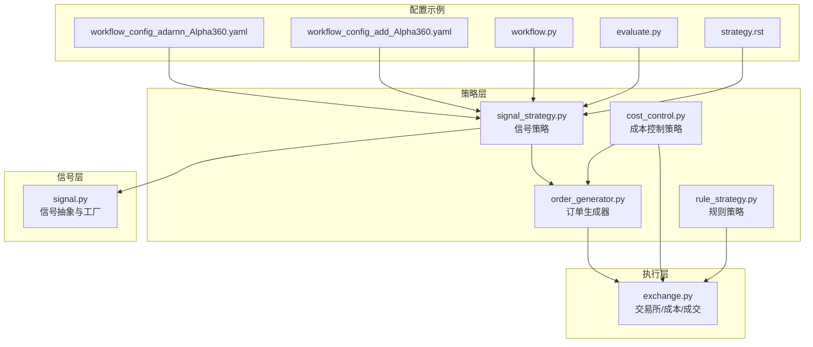
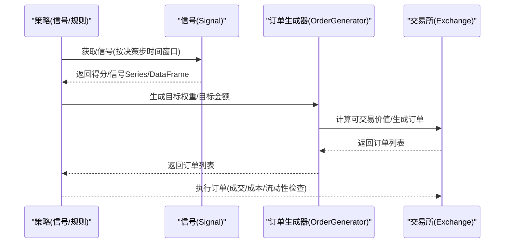
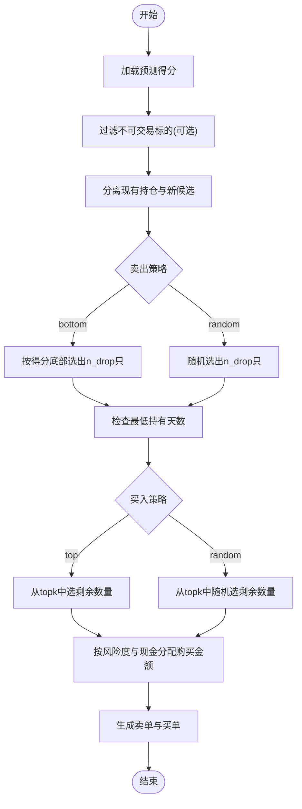
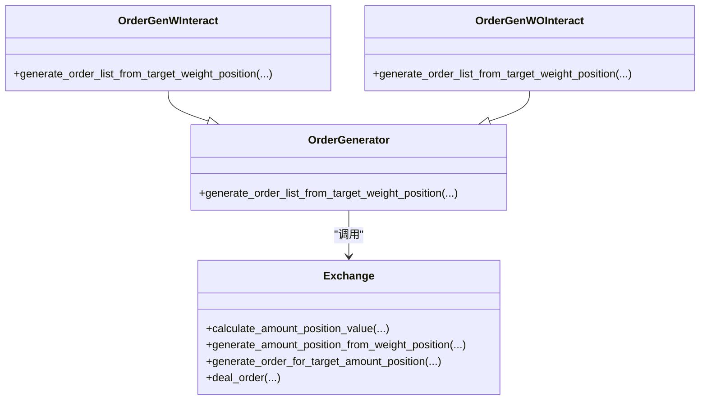
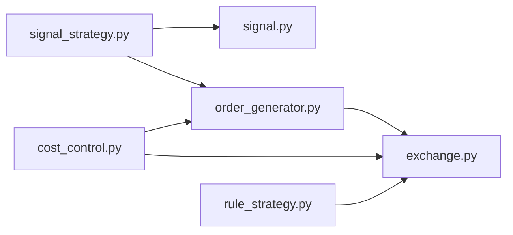

# 内置策略实现

<cite>
**本文引用的文件**
- [rule_strategy.py](file://qlib/contrib/strategy/rule_strategy.py)
- [signal_strategy.py](file://qlib/contrib/strategy/signal_strategy.py)
- [cost_control.py](file://qlib/contrib/strategy/cost_control.py)
- [order_generator.py](file://qlib/contrib/strategy/order_generator.py)
- [signal.py](file://qlib/backtest/signal.py)
- [exchange.py](file://qlib/backtest/exchange.py)
- [workflow_config_adarnn_Alpha360.yaml](file://examples/benchmarks/ADARNN/workflow_config_adarnn_Alpha360.yaml)
- [workflow_config_add_Alpha360.yaml](file://examples/benchmarks/ADD/workflow_config_add_Alpha360.yaml)
- [workflow.py](file://examples/nested_decision_execution/workflow.py)
- [evaluate.py](file://qlib/contrib/evaluate.py)
- [strategy.rst](file://docs/component/strategy.rst)
</cite>

## 目录
1. [引言](#引言)
2. [项目结构](#项目结构)
3. [核心组件](#核心组件)
4. [架构总览](#架构总览)
5. [详细组件分析](#详细组件分析)
6. [依赖关系分析](#依赖关系分析)
7. [性能考量](#性能考量)
8. [故障排查指南](#故障排查指南)
9. [结论](#结论)
10. [附录](#附录)

## 引言
本文件系统性梳理QLib框架内置的两类核心策略实现：
- 基于规则的RuleStrategy：通过预设条件（如价格突破、均线交叉等）直接生成交易信号与订单，强调“规则驱动”的可解释性与稳定性。
- 基于信号的SignalStrategy：依赖外部模型输出的预测值（alpha信号）进行投资组合优化或选股，强调“信号驱动”的灵活性与扩展性。

在此基础上，重点拆解TopkDropoutStrategy的“选优去劣”算法细节，解释topk参数如何筛选强势资产、n_drop参数如何控制换手率与交易成本；并说明CostControl模块在动态调整订单规模、防范流动性风险中的作用。最后结合workflow_config示例，演示如何在YAML配置中实例化并参数化这些策略。

## 项目结构
围绕策略实现的核心目录与文件如下：
- 策略实现：qlib/contrib/strategy/rule_strategy.py、qlib/contrib/strategy/signal_strategy.py、qlib/contrib/strategy/cost_control.py、qlib/contrib/strategy/order_generator.py
- 信号抽象：qlib/backtest/signal.py
- 交易执行与成本：qlib/backtest/exchange.py
- 配置示例：examples/benchmarks/*/workflow_config_*.yaml、examples/nested_decision_execution/workflow.py、qlib/contrib/evaluate.py、docs/component/strategy.rst

图表来源
- [rule_strategy.py](file://qlib/contrib/strategy/rule_strategy.py#L1-L673)
- [signal_strategy.py](file://qlib/contrib/strategy/signal_strategy.py#L1-L523)
- [cost_control.py](file://qlib/contrib/strategy/cost_control.py#L1-L102)
- [order_generator.py](file://qlib/contrib/strategy/order_generator.py#L1-L219)
- [signal.py](file://qlib/backtest/signal.py#L1-L106)
- [exchange.py](file://qlib/backtest/exchange.py#L886-L917)
- [workflow_config_adarnn_Alpha360.yaml](file://examples/benchmarks/ADARNN/workflow_config_adarnn_Alpha360.yaml#L1-L88)
- [workflow_config_add_Alpha360.yaml](file://examples/benchmarks/ADD/workflow_config_add_Alpha360.yaml#L1-L93)
- [workflow.py](file://examples/nested_decision_execution/workflow.py#L276-L394)
- [evaluate.py](file://qlib/contrib/evaluate.py#L172-L213)
- [strategy.rst](file://docs/component/strategy.rst#L214-L251)

章节来源
- [rule_strategy.py](file://qlib/contrib/strategy/rule_strategy.py#L1-L673)
- [signal_strategy.py](file://qlib/contrib/strategy/signal_strategy.py#L1-L523)
- [cost_control.py](file://qlib/contrib/strategy/cost_control.py#L1-L102)
- [order_generator.py](file://qlib/contrib/strategy/order_generator.py#L1-L219)
- [signal.py](file://qlib/backtest/signal.py#L1-L106)
- [exchange.py](file://qlib/backtest/exchange.py#L886-L917)
- [workflow_config_adarnn_Alpha360.yaml](file://examples/benchmarks/ADARNN/workflow_config_adarnn_Alpha360.yaml#L1-L88)
- [workflow_config_add_Alpha360.yaml](file://examples/benchmarks/ADD/workflow_config_add_Alpha360.yaml#L1-L93)
- [workflow.py](file://examples/nested_decision_execution/workflow.py#L276-L394)
- [evaluate.py](file://qlib/contrib/evaluate.py#L172-L213)
- [strategy.rst](file://docs/component/strategy.rst#L214-L251)

## 核心组件
- 规则策略（RuleStrategy）
  - 提供基于市场特征的交易决策，典型如TWAPStrategy、SBBStrategyEMA、ACStrategy等，直接依据数据特征生成订单。
- 信号策略（SignalStrategy）
  - 基于外部模型输出的alpha信号进行选股或权重优化，典型如TopkDropoutStrategy、WeightStrategyBase、EnhancedIndexingStrategy等。
- 成本控制（CostControl）
  - 在WeightStrategyBase基础上提供软Top-k等策略，通过目标权重分配与订单生成器控制换手与成本。
- 订单生成器（OrderGenerator）
  - 将目标权重位置转换为具体订单，支持交互式与非交互式两种路径，分别考虑实时价格与预测期价格。
- 信号抽象（Signal）
  - 统一不同来源的信号接口，支持缓存、模型预测、配置实例化等。

章节来源
- [rule_strategy.py](file://qlib/contrib/strategy/rule_strategy.py#L1-L673)
- [signal_strategy.py](file://qlib/contrib/strategy/signal_strategy.py#L1-L523)
- [cost_control.py](file://qlib/contrib/strategy/cost_control.py#L1-L102)
- [order_generator.py](file://qlib/contrib/strategy/order_generator.py#L1-L219)
- [signal.py](file://qlib/backtest/signal.py#L1-L106)

## 架构总览
下图展示策略到执行的关键调用链路与职责边界。

图表来源
- [signal_strategy.py](file://qlib/contrib/strategy/signal_strategy.py#L138-L295)
- [order_generator.py](file://qlib/contrib/strategy/order_generator.py#L50-L219)
- [exchange.py](file://qlib/backtest/exchange.py#L886-L917)
- [signal.py](file://qlib/backtest/signal.py#L36-L106)

## 详细组件分析

### 规则策略（RuleStrategy）与信号策略（SignalStrategy）对比
- 决策逻辑差异
  - RuleStrategy：直接从数据特征（如均线、波动率）推导买卖方向与数量，不依赖外部模型输出。
  - SignalStrategy：以alpha信号为依据，进行选股或权重优化，再由订单生成器转化为订单。
- 典型实现
  - RuleStrategy：TWAPStrategy、SBBStrategyEMA、ACStrategy等。
  - SignalStrategy：TopkDropoutStrategy、WeightStrategyBase、EnhancedIndexingStrategy等。

章节来源
- [rule_strategy.py](file://qlib/contrib/strategy/rule_strategy.py#L1-L673)
- [signal_strategy.py](file://qlib/contrib/strategy/signal_strategy.py#L1-L523)

### TopkDropoutStrategy：“选优去劣”算法详解
- 参数说明
  - topk：每日入选股票数量。
  - n_drop：每日替换的股票数量。
  - method_sell/method_buy：卖出/买入策略（bottom/random/top）。
  - hold_thresh：最低持有天数。
  - only_tradable：是否仅考虑可交易标的。
  - forbid_all_trade_at_limit：涨跌停时是否禁止所有交易。
- 算法流程（简化）
  1) 读取预测得分，按降序排序。
  2) 从当前持仓中选择前n_drop个低分标的进行卖出（受hold_thresh与可交易性约束）。
  3) 从候选池中选择新标的（top或随机），数量与卖出数量对齐。
  4) 按可用资金与风险度分配购买金额，生成买单。
  5) 对卖出与买入分别进行可执行性检查与成交模拟，更新现金与头寸。

图表来源
- [signal_strategy.py](file://qlib/contrib/strategy/signal_strategy.py#L138-L295)

章节来源
- [signal_strategy.py](file://qlib/contrib/strategy/signal_strategy.py#L75-L295)

### 信号抽象与来源
- Signal接口统一了多种信号来源：
  - 缓存信号（SignalWCache）
  - 模型预测信号（ModelSignal）
  - 配置实例化（create_signal_from）
- SignalStrategy通过create_signal_from接收多种输入形式，兼容直接传入DataFrame/Series、(model, dataset)元组、或配置对象。

章节来源
- [signal.py](file://qlib/backtest/signal.py#L1-L106)
- [signal_strategy.py](file://qlib/contrib/strategy/signal_strategy.py#L25-L74)

### 订单生成器与执行成本
- 订单生成器
  - OrderGenWInteract：考虑可交易性与实时价格，先计算可交易总值与保留现金，再生成目标金额并生成订单。
  - OrderGenWOInteract：不与交易所交互，使用预测期收盘价估算目标金额，再生成订单。
- 成本与流动性
  - 交易所根据滑点、手续费、最小成本等参数动态调整订单规模与成交金额，避免负现金流与过度冲击。

图表来源
- [order_generator.py](file://qlib/contrib/strategy/order_generator.py#L1-L219)
- [exchange.py](file://qlib/backtest/exchange.py#L886-L917)

章节来源
- [order_generator.py](file://qlib/contrib/strategy/order_generator.py#L50-L219)
- [exchange.py](file://qlib/backtest/exchange.py#L886-L917)

### CostControl模块：软Top-k与换手控制
- SoftTopkStrategy在WeightStrategyBase基础上，通过最大卖出权重与买入填充方式，控制换手与风险暴露，避免过度调整。
- 与OrderGenerator配合，可在生成目标权重后，进一步限制卖出比例与买入补仓方式，从而降低交易成本与冲击。

章节来源
- [cost_control.py](file://qlib/contrib/strategy/cost_control.py#L1-L102)
- [signal_strategy.py](file://qlib/contrib/strategy/signal_strategy.py#L298-L373)

### YAML配置示例与实例化
- 示例1：ADARNN基准任务
  - 在strategy段指定TopkDropoutStrategy，传入signal占位符与topk、n_drop参数。
- 示例2：ADD基准任务
  - 同样使用TopkDropoutStrategy，参数与示例1一致。
- 示例3：嵌套决策执行
  - 使用workflow.py在代码中以字典形式构造strategy配置，包含class、module_path与kwargs。
- 示例4：evaluate.py
  - 展示了通过字典或直接传入DataFrame/Series的方式实例化TopkDropoutStrategy。

章节来源
- [workflow_config_adarnn_Alpha360.yaml](file://examples/benchmarks/ADARNN/workflow_config_adarnn_Alpha360.yaml#L1-L88)
- [workflow_config_add_Alpha360.yaml](file://examples/benchmarks/ADD/workflow_config_add_Alpha360.yaml#L1-L93)
- [workflow.py](file://examples/nested_decision_execution/workflow.py#L276-L394)
- [evaluate.py](file://qlib/contrib/evaluate.py#L172-L213)
- [strategy.rst](file://docs/component/strategy.rst#L214-L251)

## 依赖关系分析
- 策略依赖
  - SignalStrategy依赖Signal抽象与OrderGenerator，最终落到Exchange执行。
  - RuleStrategy直接依赖Exchange进行可交易性判断与成交。
  - CostControl策略依赖OrderGenerator与Exchange进行权重分配与订单生成。
- 外部依赖
  - 数据源：D.features、Dataset、Model等。
  - 配置解析：create_signal_from、init_instance_by_config等。

图表来源
- [signal_strategy.py](file://qlib/contrib/strategy/signal_strategy.py#L1-L523)
- [order_generator.py](file://qlib/contrib/strategy/order_generator.py#L1-L219)
- [exchange.py](file://qlib/backtest/exchange.py#L886-L917)
- [signal.py](file://qlib/backtest/signal.py#L1-L106)
- [rule_strategy.py](file://qlib/contrib/strategy/rule_strategy.py#L1-L673)
- [cost_control.py](file://qlib/contrib/strategy/cost_control.py#L1-L102)

## 性能考量
- 信号频率与决策频率匹配：SignalWCache会按决策步时间窗口进行重采样，确保使用最新信号。
- 订单生成器路径选择：交互式路径更贴近真实成交，但计算量更大；非交互式路径更快但可能引入估计误差。
- 换手控制：SoftTopkStrategy通过最大卖出权重与买入填充方式降低换手，有助于降低成本与冲击。
- 流动性与成本：Exchange在成交时考虑滑点、手续费与最小成本，避免负现金流与过度冲击。

[本节为通用指导，无需列出章节来源]

## 故障排查指南
- 信号为空
  - 当信号返回None时，策略将返回空订单。请检查信号构建与时间窗口设置。
- 涨跌停限制
  - forbid_all_trade_at_limit开启时，涨跌停将禁止所有交易；关闭时允许在涨跌停条件下进行相反方向交易。
- 可交易性检查
  - only_tradable开启时，策略仅考虑可交易标的；否则可能生成无法成交的订单。
- 成交失败与负现金流
  - 若现金不足或订单被截断，Exchange会记录日志并返回零成交。请检查open_cost、close_cost与min_cost设置。

章节来源
- [signal_strategy.py](file://qlib/contrib/strategy/signal_strategy.py#L138-L295)
- [exchange.py](file://qlib/backtest/exchange.py#L886-L917)

## 结论
- RuleStrategy适合规则明确、可解释性强的场景；SignalStrategy适合以模型信号为核心的投资框架。
- TopkDropoutStrategy通过topk与n_drop在“选优去劣”之间取得平衡，结合only_tradable、forbid_all_trade_at_limit等参数可灵活控制换手与风控。
- CostControl模块与OrderGenerator协同，能在目标权重生成阶段就考虑流动性与成本，有效降低交易成本与冲击。
- YAML与代码两种方式均可实例化策略，建议在复杂场景中优先采用YAML配置，便于实验管理与复现。

[本节为总结性内容，无需列出章节来源]

## 附录
- 关键参数速查
  - topk：入选股票数量
  - n_drop：每日替换数量
  - method_sell/method_buy：bottom/random/top
  - hold_thresh：最低持有天数
  - only_tradable：是否仅考虑可交易标的
  - forbid_all_trade_at_limit：涨跌停是否禁止交易
  - risk_degree：风险度（占总资产比例）

[本节为辅助信息，无需列出章节来源]