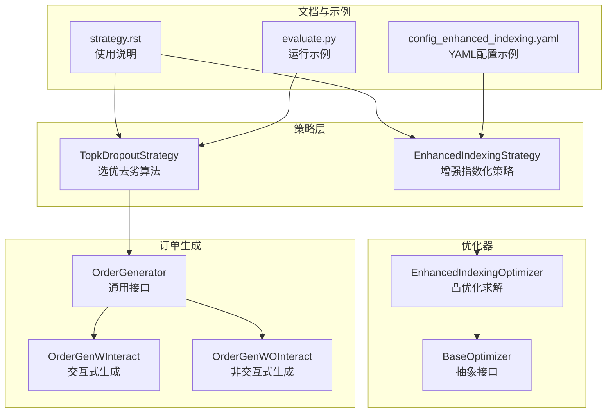
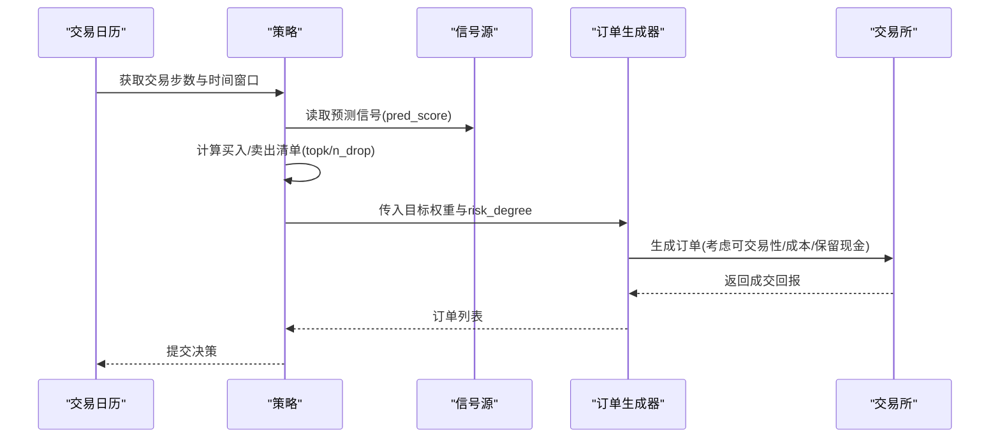
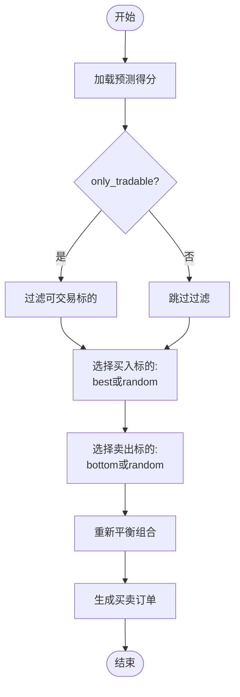
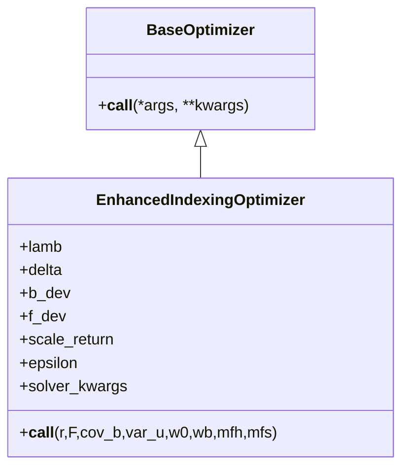
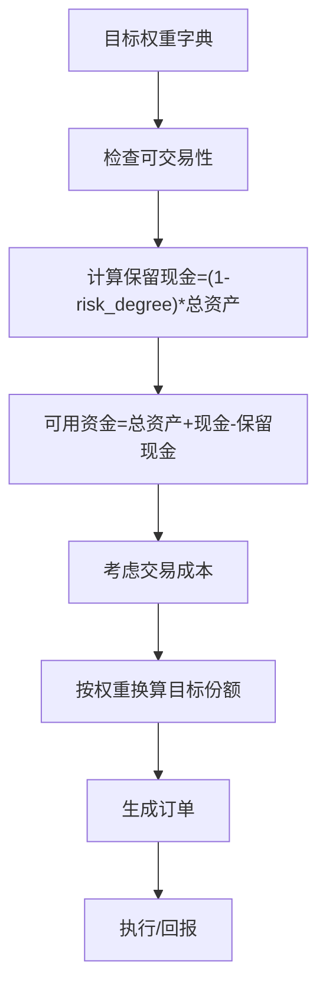
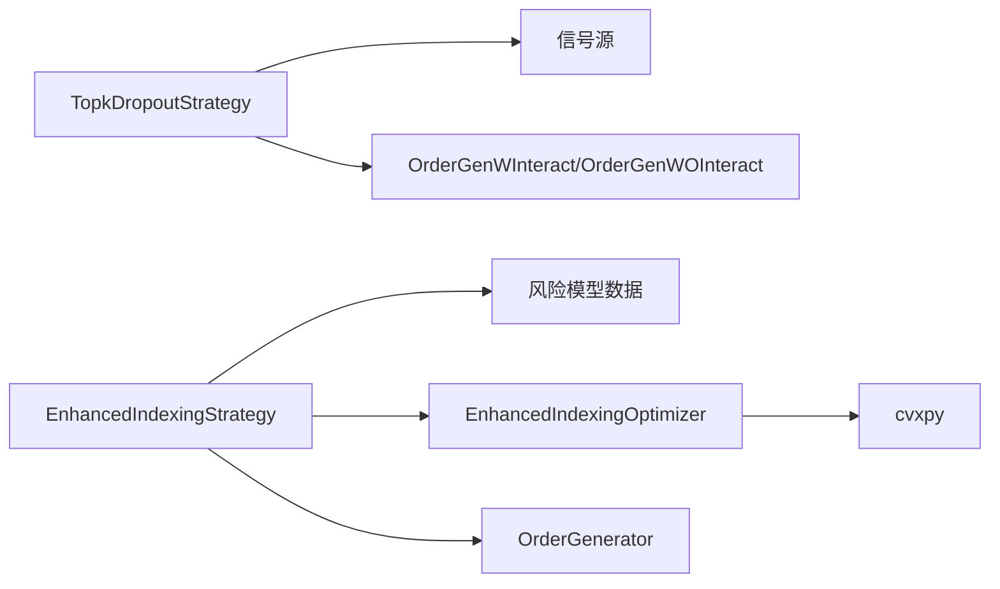

# 基于信号的策略

<cite>
**本文引用的文件**
- [signal_strategy.py](file://qlib/contrib/strategy/signal_strategy.py)
- [order_generator.py](file://qlib/contrib/strategy/order_generator.py)
- [enhanced_indexing.py](file://qlib/contrib/strategy/optimizer/enhanced_indexing.py)
- [base.py](file://qlib/contrib/strategy/optimizer/base.py)
- [strategy.rst](file://docs/component/strategy.rst)
- [config_enhanced_indexing.yaml](file://examples/portfolio/config_enhanced_indexing.yaml)
- [evaluate.py](file://qlib/contrib/evaluate.py)
</cite>

## 目录
1. [引言](#引言)
2. [项目结构](#项目结构)
3. [核心组件](#核心组件)
4. [架构总览](#架构总览)
5. [详细组件分析](#详细组件分析)
6. [依赖关系分析](#依赖关系分析)
7. [性能考量](#性能考量)
8. [故障排查指南](#故障排查指南)
9. [结论](#结论)
10. [附录](#附录)

## 引言
本文件系统性阐述基于信号的投资组合管理策略，聚焦两类策略：
- TopkDropoutStrategy：通过“选优去劣”算法，利用模型预测的Alpha信号，按topk参数筛选排名靠前的资产构建投资组合；通过n_drop参数控制每日换手规模，平衡收益与交易成本。
- EnhancedIndexingStrategy：增强指数化策略，结合用户提供的风险模型数据（因子暴露、因子协方差、特质风险）与Alpha信号，在跟踪误差约束下求解最优投资组合权重，实现超越基准指数的收益；通过risk_degree参数控制整体投资仓位。

同时给出YAML配置示例，展示如何在工作流中集成这些策略。

## 项目结构
围绕策略相关的代码主要位于以下模块：
- 策略基类与具体策略：qlib/contrib/strategy/signal_strategy.py
- 订单生成器：qlib/contrib/strategy/order_generator.py
- 增强指数化优化器：qlib/contrib/strategy/optimizer/enhanced_indexing.py
- 优化器抽象基类：qlib/contrib/strategy/optimizer/base.py
- 使用示例与文档：docs/component/strategy.rst、examples/portfolio/config_enhanced_indexing.yaml
- 运行评估与示例：qlib/contrib/evaluate.py



图表来源
- [signal_strategy.py](file://qlib/contrib/strategy/signal_strategy.py#L75-L114)
- [enhanced_indexing.py](file://qlib/contrib/strategy/optimizer/enhanced_indexing.py#L16-L45)
- [base.py](file://qlib/contrib/strategy/optimizer/base.py#L7-L13)
- [order_generator.py](file://qlib/contrib/strategy/order_generator.py#L14-L219)
- [strategy.rst](file://docs/component/strategy.rst#L70-L120)
- [config_enhanced_indexing.yaml](file://examples/portfolio/config_enhanced_indexing.yaml#L1-L72)
- [evaluate.py](file://qlib/contrib/evaluate.py#L172-L213)

章节来源
- [signal_strategy.py](file://qlib/contrib/strategy/signal_strategy.py#L75-L114)
- [order_generator.py](file://qlib/contrib/strategy/order_generator.py#L14-L219)
- [enhanced_indexing.py](file://qlib/contrib/strategy/optimizer/enhanced_indexing.py#L16-L45)
- [base.py](file://qlib/contrib/strategy/optimizer/base.py#L7-L13)
- [strategy.rst](file://docs/component/strategy.rst#L70-L120)
- [config_enhanced_indexing.yaml](file://examples/portfolio/config_enhanced_indexing.yaml#L1-L72)
- [evaluate.py](file://qlib/contrib/evaluate.py#L172-L213)

## 核心组件
- TopkDropoutStrategy
  - 通过topk确定目标持仓数量，通过n_drop控制每日替换数量，实现稳定换手与收益平衡。
  - 支持method_buy/method_sell选择（top/random），支持仅可交易标的过滤与涨停限制处理。
- EnhancedIndexingStrategy
  - 读取风险模型数据（因子暴露、因子协方差、特质风险、黑名单），结合Alpha信号与基准权重，在跟踪误差约束下求解最优权重。
  - 通过risk_degree控制整体仓位规模，sum权重等于risk_degree。
- EnhancedIndexingOptimizer
  - 基于凸优化（cvxpy）求解增强指数化问题，包含目标函数（超额收益减去跟踪误差风险）、边界约束、换手约束等。
- OrderGenerator系列
  - 将目标权重映射为实际订单，考虑可交易性、交易成本、保留现金等。

章节来源
- [signal_strategy.py](file://qlib/contrib/strategy/signal_strategy.py#L75-L114)
- [signal_strategy.py](file://qlib/contrib/strategy/signal_strategy.py#L375-L523)
- [enhanced_indexing.py](file://qlib/contrib/strategy/optimizer/enhanced_indexing.py#L16-L45)
- [order_generator.py](file://qlib/contrib/strategy/order_generator.py#L14-L219)

## 架构总览
策略执行流程（以TopkDropoutStrategy为例）：
- 读取预测信号（pred_score）
- 依据topk与n_drop计算买入/卖出清单
- 生成订单列表并执行

策略执行流程（以EnhancedIndexingStrategy为例）：
- 读取风险模型数据与基准权重
- 用Alpha信号与当前权重构造优化问题
- 求解得到目标权重
- 通过OrderGenerator生成订单



图表来源
- [signal_strategy.py](file://qlib/contrib/strategy/signal_strategy.py#L138-L295)
- [signal_strategy.py](file://qlib/contrib/strategy/signal_strategy.py#L345-L372)
- [order_generator.py](file://qlib/contrib/strategy/order_generator.py#L50-L219)

## 详细组件分析

### TopkDropoutStrategy：选优去劣算法
- 参数与职责
  - topk：目标持仓数量
  - n_drop：每日替换数量，控制换手率
  - method_buy/method_sell：选择“best”或“random”
  - only_tradable：是否仅考虑可交易标的
  - forbid_all_trade_at_limit：涨跌停时是否禁止交易
- 算法要点
  - 从预测得分中选出topk候选，按n_drop决定买入/卖出数量
  - 卖出低分股票，买入高分未持有股票，避免“高买低卖”
  - 可根据hold_thresh设置最低持有期
  - 通过risk_degree控制可用资金比例
- 换手率与成本
  - 在大池子、大K、小n_drop场景下，换手率约为2×n_drop/K
  - 通过n_drop平衡收益与交易成本



图表来源
- [signal_strategy.py](file://qlib/contrib/strategy/signal_strategy.py#L138-L295)

章节来源
- [signal_strategy.py](file://qlib/contrib/strategy/signal_strategy.py#L75-L114)
- [signal_strategy.py](file://qlib/contrib/strategy/signal_strategy.py#L138-L295)
- [strategy.rst](file://docs/component/strategy.rst#L70-L120)

### EnhancedIndexingStrategy：增强指数化策略
- 数据输入
  - 风险模型数据：因子暴露、因子协方差、特质风险、黑名单
  - Alpha信号：用于衡量超额收益预期
  - 基准权重：来自市场指数
- 关键流程
  - 加载风险数据与Alpha信号，对缺失值进行填充
  - 读取当前权重并按risk_degree归一化
  - 读取基准权重与可交易性/黑名单掩码
  - 调用优化器求解最优权重
  - 输出目标权重字典
- risk_degree的作用
  - 控制总投入权重之和，sum(w) = risk_degree
  - 通过get_risk_degree动态调整，实现仓位择时

```mermaid
sequenceDiagram
participant Strat as "EnhancedIndexingStrategy"
participant Risk as "风险数据加载"
participant Bench as "基准权重"
participant Opt as "EnhancedIndexingOptimizer"
participant Gen as "OrderGenerator"
Strat->>Risk : 加载因子暴露/协方差/特质风险
Strat->>Bench : 读取基准权重
Strat->>Strat : 当前权重归一化(除以risk_degree)
Strat->>Opt : 传入r/F/cov_b/var_u/w0/wb/mask
Opt-->>Strat : 返回最优权重
Strat->>Gen : 传入目标权重与risk_degree
Gen-->>Strat : 返回订单列表
```

图表来源
- [signal_strategy.py](file://qlib/contrib/strategy/signal_strategy.py#L462-L523)
- [enhanced_indexing.py](file://qlib/contrib/strategy/optimizer/enhanced_indexing.py#L88-L203)
- [order_generator.py](file://qlib/contrib/strategy/order_generator.py#L50-L219)

章节来源
- [signal_strategy.py](file://qlib/contrib/strategy/signal_strategy.py#L375-L523)
- [enhanced_indexing.py](file://qlib/contrib/strategy/optimizer/enhanced_indexing.py#L16-L45)
- [enhanced_indexing.py](file://qlib/contrib/strategy/optimizer/enhanced_indexing.py#L88-L203)
- [order_generator.py](file://qlib/contrib/strategy/order_generator.py#L50-L219)

### EnhancedIndexingOptimizer：凸优化求解
- 目标函数
  - 最大化超额收益减去跟踪误差风险
- 约束条件
  - 权重非负、全市场完全投资
  - 基准偏离上下限、因子暴露偏离上下限
  - 总换手约束（可选）
- 容错机制
  - 失败时回退到当前持有权重
  - 可移除换手约束后重试
  - 小权重置零并重新归一化



图表来源
- [base.py](file://qlib/contrib/strategy/optimizer/base.py#L7-L13)
- [enhanced_indexing.py](file://qlib/contrib/strategy/optimizer/enhanced_indexing.py#L16-L45)
- [enhanced_indexing.py](file://qlib/contrib/strategy/optimizer/enhanced_indexing.py#L88-L203)

章节来源
- [enhanced_indexing.py](file://qlib/contrib/strategy/optimizer/enhanced_indexing.py#L16-L45)
- [enhanced_indexing.py](file://qlib/contrib/strategy/optimizer/enhanced_indexing.py#L88-L203)

### 订单生成器：从权重到订单
- 交互式生成（OrderGenWInteract）
  - 考虑可交易性与保留现金，按目标权重生成订单
  - 对交易成本进行统一折扣估算
- 非交互式生成（OrderGenWOInteract）
  - 不与交易所实时交互，使用预测日或当前价格估算
  - 仅对可交易标的生成订单



图表来源
- [order_generator.py](file://qlib/contrib/strategy/order_generator.py#L50-L219)

章节来源
- [order_generator.py](file://qlib/contrib/strategy/order_generator.py#L50-L219)

## 依赖关系分析
- 组件耦合
  - TopkDropoutStrategy直接依赖信号源与订单生成器
  - EnhancedIndexingStrategy依赖风险模型数据、基准权重与优化器
  - 优化器依赖cvxpy求解
- 外部依赖
  - 风险模型数据格式与路径约定
  - 交易成本与可交易性判断
- 潜在循环依赖
  - 策略与订单生成器之间为单向依赖，无循环



图表来源
- [signal_strategy.py](file://qlib/contrib/strategy/signal_strategy.py#L75-L114)
- [signal_strategy.py](file://qlib/contrib/strategy/signal_strategy.py#L375-L523)
- [enhanced_indexing.py](file://qlib/contrib/strategy/optimizer/enhanced_indexing.py#L16-L45)
- [order_generator.py](file://qlib/contrib/strategy/order_generator.py#L14-L219)

章节来源
- [signal_strategy.py](file://qlib/contrib/strategy/signal_strategy.py#L75-L114)
- [signal_strategy.py](file://qlib/contrib/strategy/signal_strategy.py#L375-L523)
- [enhanced_indexing.py](file://qlib/contrib/strategy/optimizer/enhanced_indexing.py#L16-L45)
- [order_generator.py](file://qlib/contrib/strategy/order_generator.py#L14-L219)

## 性能考量
- TopkDropoutStrategy
  - n_drop越小，换手越低，交易成本越低，但可能错过更高收益机会
  - topk越大，池子越大，选优效果更稳健，但计算与交易成本上升
- EnhancedIndexingStrategy
  - 优化器求解复杂度与资产数量、因子数量相关
  - 风险模型数据缓存可减少重复IO
  - delta过大可能导致优化失败，建议逐步放宽约束
- 订单生成
  - 交互式生成更贴近真实执行，非交互式生成更快但精度较低

## 故障排查指南
- 风险数据缺失
  - 若某日风险数据不存在，策略会跳过该日优化并记录警告
- 优化失败
  - 优化器会在失败时回退到当前持有权重，并记录warning
  - 可尝试移除换手约束后重试
- 可交易性与涨跌停
  - only_tradable与forbid_all_trade_at_limit会影响买卖决策
- 仓位超配
  - 若当前权重之和超过risk_degree，策略会发出警告

章节来源
- [signal_strategy.py](file://qlib/contrib/strategy/signal_strategy.py#L462-L523)
- [enhanced_indexing.py](file://qlib/contrib/strategy/optimizer/enhanced_indexing.py#L160-L203)

## 结论
- TopkDropoutStrategy通过topk与n_drop实现稳定的“选优去劣”，适合追求稳健换手与信号驱动收益的场景。
- EnhancedIndexingStrategy在跟踪误差约束下最大化超额收益，适合希望在可控风险内跑赢基准的场景。
- 两者均通过risk_degree控制整体仓位，实现灵活的仓位择时。

## 附录

### YAML配置示例（增强指数化）
- 示例路径：examples/portfolio/config_enhanced_indexing.yaml
- 关键点
  - strategy.class: EnhancedIndexingStrategy
  - strategy.kwargs.riskmodel_root: 风险模型根目录
  - strategy.kwargs.market: 基准市场（如csi300）
  - backtest.account: 初始资金
  - backtest.exchange_kwargs: 交易成本与滑点参数

章节来源
- [config_enhanced_indexing.yaml](file://examples/portfolio/config_enhanced_indexing.yaml#L1-L72)

### 使用示例（TopkDropoutStrategy）
- 文档示例：docs/component/strategy.rst
- 运行示例：qlib/contrib/evaluate.py
- 关键参数
  - topk：目标持仓数
  - n_drop：每日替换数
  - signal：预测得分

章节来源
- [strategy.rst](file://docs/component/strategy.rst#L150-L263)
- [evaluate.py](file://qlib/contrib/evaluate.py#L172-L213)