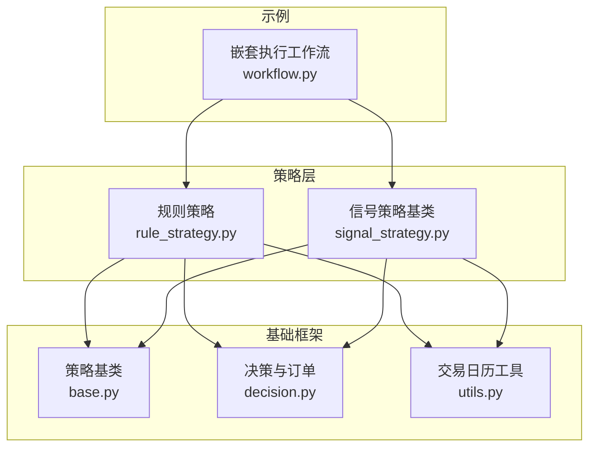
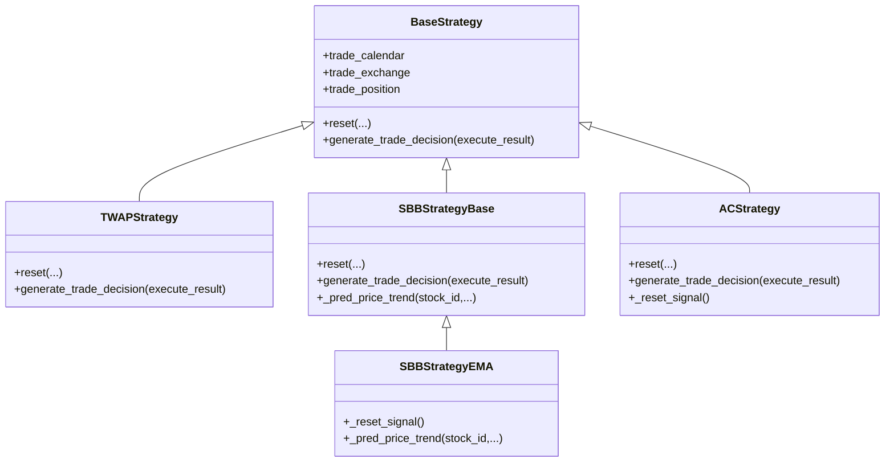
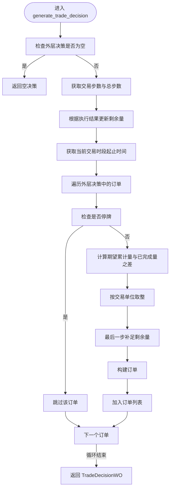
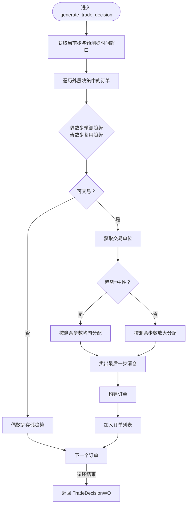
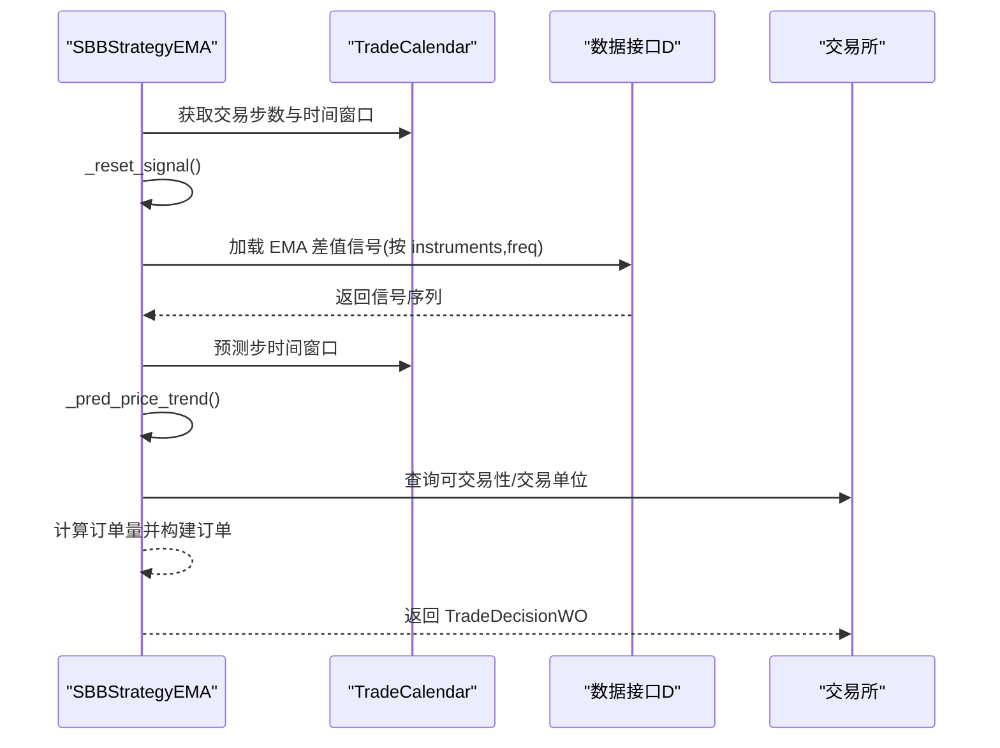
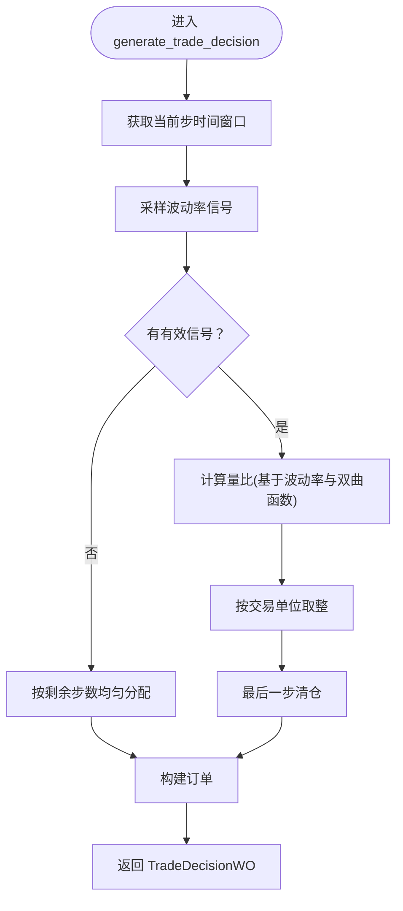
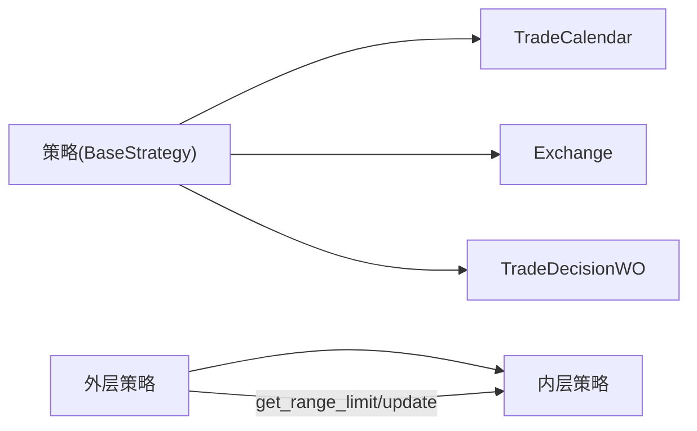

# 基于规则的策略

<cite>
**本文引用的文件列表**
- [rule_strategy.py](file://qlib/contrib/strategy/rule_strategy.py)
- [base.py](file://qlib/strategy/base.py)
- [decision.py](file://qlib/backtest/decision.py)
- [utils.py](file://qlib/backtest/utils.py)
- [workflow.py](file://examples/nested_decision_execution/workflow.py)
- [signal_strategy.py](file://qlib/contrib/strategy/signal_strategy.py)
</cite>

## 目录
1. [引言](#引言)
2. [项目结构](#项目结构)
3. [核心组件](#核心组件)
4. [架构总览](#架构总览)
5. [组件详解](#组件详解)
6. [依赖关系分析](#依赖关系分析)
7. [性能考量](#性能考量)
8. [故障排查指南](#故障排查指南)
9. [结论](#结论)
10. [附录](#附录)

## 引言
本文件面向希望理解并应用QLIB中“基于规则”的交易策略实现的读者，重点解析以下策略：
- TWAPStrategy：按时间均匀拆分大单，降低市场冲击
- SBBStrategyBase 及其衍生类 SBBStrategyEMA：基于相邻交易时段的价格趋势预测进行择时交易
- ACStrategy：结合波动率信号（Volatility）动态调整交易量，实现风险自适应的执行

同时，我们将对比规则策略与“信号驱动策略”在决策逻辑上的根本差异：规则策略依赖预设的市场条件（如时间、价格、波动率）直接生成交易指令，不依赖外部模型的预测信号；而信号驱动策略则以模型输出的信号为依据生成交易指令。

## 项目结构
围绕规则策略的相关代码主要位于以下模块：
- 策略实现：qlib/contrib/strategy/rule_strategy.py
- 策略基类：qlib/strategy/base.py
- 决策与订单：qlib/backtest/decision.py
- 日历与步进：qlib/backtest/utils.py
- 示例工作流（包含规则策略的使用方式）：examples/nested_decision_execution/workflow.py
- 信号驱动策略（用于对比）：qlib/contrib/strategy/signal_strategy.py

图表来源
- [rule_strategy.py](file://qlib/contrib/strategy/rule_strategy.py#L22-L123)
- [signal_strategy.py](file://qlib/contrib/strategy/signal_strategy.py#L25-L170)
- [base.py](file://qlib/strategy/base.py#L23-L147)
- [decision.py](file://qlib/backtest/decision.py#L302-L596)
- [utils.py](file://qlib/backtest/utils.py#L87-L119)
- [workflow.py](file://examples/nested_decision_execution/workflow.py#L180-L221)

章节来源
- [rule_strategy.py](file://qlib/contrib/strategy/rule_strategy.py#L22-L123)
- [base.py](file://qlib/strategy/base.py#L23-L147)
- [decision.py](file://qlib/backtest/decision.py#L302-L596)
- [utils.py](file://qlib/backtest/utils.py#L87-L119)
- [workflow.py](file://examples/nested_decision_execution/workflow.py#L180-L221)

## 核心组件
- TWAPStrategy：将大额订单均匀拆分到多个交易时段，避免集中抛单导致的市场冲击。其核心在于根据当前交易步数计算应完成的累计期望量，并据此生成当期订单量，同时考虑交易单位与最后一步的收尾处理。
- SBBStrategyBase：每两个相邻交易时段为一组，选择其中更好的一个时段进行交易。它通过抽象方法 _pred_price_trend 预测价格趋势（短期/长期/中性），并据此决定买卖方向与交易量。
- SBBStrategyEMA：SBBStrategyBase 的具体实现，使用 EMA 差值信号作为趋势判断依据，对每个股票在指定频率下计算信号并进行择时。
- ACStrategy：基于波动率信号（Volatility）的自适应交易策略。当无有效信号时退化为 TWAP；当存在信号时，根据波动率动态调整各期交易量比例，实现风险自适应。

章节来源
- [rule_strategy.py](file://qlib/contrib/strategy/rule_strategy.py#L22-L123)
- [rule_strategy.py](file://qlib/contrib/strategy/rule_strategy.py#L125-L295)
- [rule_strategy.py](file://qlib/contrib/strategy/rule_strategy.py#L297-L381)
- [rule_strategy.py](file://qlib/contrib/strategy/rule_strategy.py#L383-L537)

## 架构总览
规则策略与信号策略共享相同的策略基类接口，但决策来源不同：
- 规则策略：由时间、价格、波动率等“规则”直接生成订单
- 信号策略：由模型信号生成目标权重或目标头寸，再转换为订单

图表来源
- [base.py](file://qlib/strategy/base.py#L23-L147)
- [rule_strategy.py](file://qlib/contrib/strategy/rule_strategy.py#L22-L123)
- [rule_strategy.py](file://qlib/contrib/strategy/rule_strategy.py#L125-L295)
- [rule_strategy.py](file://qlib/contrib/strategy/rule_strategy.py#L297-L381)
- [rule_strategy.py](file://qlib/contrib/strategy/rule_strategy.py#L383-L537)

## 组件详解

### TWAPStrategy：时间加权平均策略
- 设计要点
  - 将总交易量按交易步数线性分配，确保在每个交易时段均匀下单
  - 考虑交易单位（最小交易量）进行取整，避免非整数下单
  - 最后一步必须清仓，保证所有份额全部成交
  - 对停牌股票跳过下单，避免 NaN 导致异常
- 关键流程
  - 计算当前相对交易步数与总步数
  - 基于期望累计量与已完成量之差得到当期应成交量
  - 按交易单位取整，并在最后一步补足剩余量
  - 生成订单并返回 TradeDecisionWO

图表来源
- [rule_strategy.py](file://qlib/contrib/strategy/rule_strategy.py#L43-L122)

章节来源
- [rule_strategy.py](file://qlib/contrib/strategy/rule_strategy.py#L22-L123)

### SBBStrategyBase：相邻时段择时策略（抽象）
- 设计要点
  - 每两个相邻交易时段为一组，先在第一个时段预测趋势，再在第二个时段基于预测择时
  - 支持三种趋势：中性、短期看涨、长期看涨
  - 根据趋势与方向决定交易量大小：中性时按剩余天数均匀分配；趋势明确时放大交易量
  - 考虑交易单位与最后一步清仓约束
- 关键流程
  - 获取当前步与预测步的时间窗口
  - 在偶数步预测趋势，在奇数步复用上一步预测
  - 判断可交易性与交易单位，计算订单量
  - 构建订单并返回

图表来源
- [rule_strategy.py](file://qlib/contrib/strategy/rule_strategy.py#L157-L294)

章节来源
- [rule_strategy.py](file://qlib/contrib/strategy/rule_strategy.py#L125-L295)

### SBBStrategyEMA：基于 EMA 的择时策略
- 设计要点
  - 使用 EMA(10) 与 EMA(20) 的差值作为趋势信号
  - 在策略重置时加载指定频率下的信号数据，按交易时段采样
  - 当信号为正（长期趋势）、负（短期趋势）、零或缺失（中性）时分别对应不同择时行为
- 关键流程
  - 初始化 instruments 与 freq
  - reset_level_infra 中加载信号并缓存
  - _pred_price_trend 采样并判定趋势
  - 交由 SBBStrategyBase 的逻辑生成订单

图表来源
- [rule_strategy.py](file://qlib/contrib/strategy/rule_strategy.py#L297-L381)

章节来源
- [rule_strategy.py](file://qlib/contrib/strategy/rule_strategy.py#L297-L381)

### ACStrategy：基于波动率的风险自适应策略
- 设计要点
  - 使用滚动对数收益率方差的平方根（波动率）作为信号
  - 当无有效信号时退化为 TWAP；当有信号时，利用波动率动态调整各期交易量比例
  - 通过双曲函数 sinh 与 arccosh 构造随步数变化的量比，实现“越靠近结束越加速”的自适应曲线
- 关键流程
  - 初始化 lamb、eta、window_size、instruments、freq
  - reset_level_infra 中加载波动率信号
  - generate_trade_decision：
    - 采样波动率信号
    - 无信号：按剩余步数均匀分配（TWAP）
    - 有信号：计算量比并按交易单位取整，最后一步清仓

图表来源
- [rule_strategy.py](file://qlib/contrib/strategy/rule_strategy.py#L383-L537)

章节来源
- [rule_strategy.py](file://qlib/contrib/strategy/rule_strategy.py#L383-L537)

### 与信号驱动策略的对比
- 决策来源
  - 规则策略：基于时间、价格、波动率等“规则”直接生成订单，不依赖外部模型信号
  - 信号驱动策略：以模型输出的信号为依据，通常转化为目标权重或目标头寸后再生成订单
- 实现差异
  - 规则策略：在 generate_trade_decision 中直接计算订单量与方向
  - 信号驱动策略：通过信号对象获取分数或预测，再调用订单生成器构造订单
- 示例参考
  - 规则策略在嵌套执行工作流中被作为内层策略使用
  - 信号驱动策略在相同工作流中作为外层策略使用，二者可组合嵌套

章节来源
- [workflow.py](file://examples/nested_decision_execution/workflow.py#L180-L221)
- [signal_strategy.py](file://qlib/contrib/strategy/signal_strategy.py#L25-L170)

## 依赖关系分析
- 策略与基础设施
  - 所有规则策略均继承自 BaseStrategy，依赖 trade_calendar、trade_exchange、trade_position 等基础设施
  - TradeCalendar 提供步数与时间窗口；Exchange 提供可交易性、交易单位与订单辅助工具
- 决策与订单
  - 策略返回 TradeDecisionWO，内部封装订单列表与时间范围
  - TradeDecisionWO 在构造时自动填充订单的起止时间
- 外层与内层策略协作
  - 外层策略生成外层决策，内层策略在其限定的时间范围内生成内层决策
  - 通过 get_range_limit 与 update 机制实现跨层级的时间范围限制与更新

图表来源
- [base.py](file://qlib/strategy/base.py#L23-L147)
- [decision.py](file://qlib/backtest/decision.py#L302-L596)
- [utils.py](file://qlib/backtest/utils.py#L87-L119)

章节来源
- [base.py](file://qlib/strategy/base.py#L23-L147)
- [decision.py](file://qlib/backtest/decision.py#L302-L596)
- [utils.py](file://qlib/backtest/utils.py#L87-L119)

## 性能考量
- 时间复杂度
  - TWAP：对每个订单进行常数次计算，整体 O(N)，N 为订单数量
  - SBB：每两步共享一次趋势预测，整体 O(N·T)，T 为交易步数
  - AC：每次迭代计算波动率信号与量比，整体 O(N·T)
- 数据访问
  - EMA 与波动率信号需按 instruments 与 freq 加载，建议在 reset_level_infra 中一次性加载并缓存
- 交易单位与最后一步
  - 取整与最后一步补足会减少额外的微小订单，提高执行效率与稳定性

## 故障排查指南
- 停牌股票导致 NaN
  - TWAP 在下单前检查停牌状态，避免因 NaN 导致异常
- 交易单位不足
  - 若未设置交易单位，策略会按剩余步数均匀分配；若设置了交易单位，需确保订单量可被整除
- 最后一步未清仓
  - 策略在最后一步强制清仓，若出现剩余量，检查交易单位与取整逻辑
- 信号缺失
  - SBBStrategyEMA 与 ACStrategy 在信号缺失时返回中性趋势或退化为 TWAP，需确认数据加载范围与频率设置

章节来源
- [rule_strategy.py](file://qlib/contrib/strategy/rule_strategy.py#L70-L122)
- [rule_strategy.py](file://qlib/contrib/strategy/rule_strategy.py#L168-L294)
- [rule_strategy.py](file://qlib/contrib/strategy/rule_strategy.py#L461-L537)

## 结论
- TWAPStrategy 通过均匀拆分降低市场冲击，适合大单执行
- SBBStrategyEMA 以 EMA 信号择时，提升择时效果；SBBStrategyBase 提供了灵活的趋势预测接口
- ACStrategy 将波动率信号融入执行，实现风险自适应，兼顾速度与稳健性
- 规则策略与信号驱动策略在决策来源与实现路径上存在本质差异，可根据场景选择或组合使用

## 附录

### 配置文件示例与参数说明
- 在嵌套执行工作流中，规则策略可通过配置文件声明：
  - class：策略类名（如 TWAPStrategy、SBBStrategyEMA）
  - module_path：策略模块路径
  - kwargs：策略参数（如 instruments、freq 等）

章节来源
- [workflow.py](file://examples/nested_decision_execution/workflow.py#L180-L221)