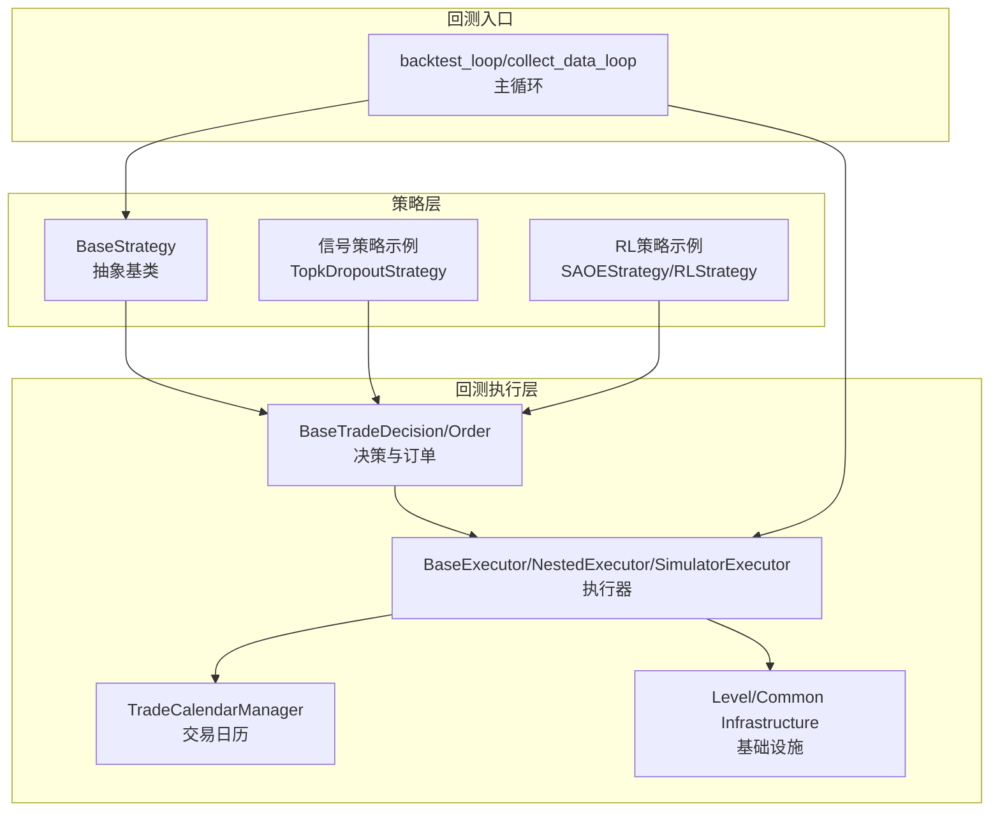
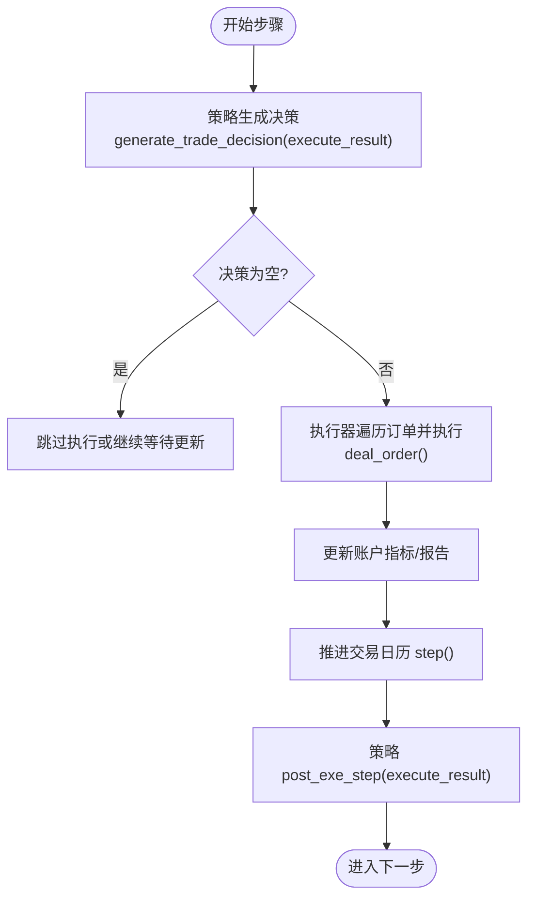
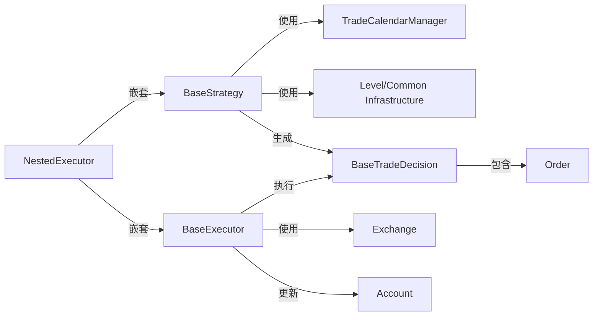

# 策略基础架构

<cite>
**本文引用的文件**
- [qlib/strategy/base.py](file://qlib/strategy/base.py)
- [qlib/backtest/decision.py](file://qlib/backtest/decision.py)
- [qlib/backtest/executor.py](file://qlib/backtest/executor.py)
- [qlib/backtest/backtest.py](file://qlib/backtest/backtest.py)
- [qlib/backtest/utils.py](file://qlib/backtest/utils.py)
- [qlib/contrib/strategy/signal_strategy.py](file://qlib/contrib/strategy/signal_strategy.py)
- [qlib/rl/order_execution/strategy.py](file://qlib/rl/order_execution/strategy.py)
- [examples/nested_decision_execution/workflow.py](file://examples/nested_decision_execution/workflow.py)
</cite>

## 目录
1. [引言](#引言)
2. [项目结构](#项目结构)
3. [核心组件](#核心组件)
4. [架构总览](#架构总览)
5. [详细组件分析](#详细组件分析)
6. [依赖分析](#依赖分析)
7. [性能考虑](#性能考虑)
8. [故障排查指南](#故障排查指南)
9. [结论](#结论)
10. [附录：自定义策略实现要点](#附录自定义策略实现要点)

## 引言
本文件系统性解析 QLib 交易策略的基础架构，聚焦于 BaseStrategy 抽象基类的接口规范与生命周期管理机制；阐明 generate_trade_decision 在回测流程中的调用时机与上下文依赖（输入参数、输出结构契约）；解释策略决策如何经由 Executor 与 TradeDecision 的协作被回测引擎消费并转化为实际交易订单；同时说明 TradeRange 在嵌套策略中的时间范围控制作用。文档还提供策略开发常见边界问题（如空决策、时间对齐异常）的解决方案，并通过代码片段路径展示自定义策略继承 BaseStrategy 时必须实现的核心方法。

## 项目结构
围绕策略与回测的核心模块分布如下：
- 策略层：策略抽象与具体策略实现
  - 基类与 RL 扩展：qlib/strategy/base.py
  - 信号驱动策略示例：qlib/contrib/strategy/signal_strategy.py
  - RL 策略示例：qlib/rl/order_execution/strategy.py
- 回测执行层：执行器与决策模型
  - 决策模型与订单：qlib/backtest/decision.py
  - 执行器与嵌套执行：qlib/backtest/executor.py
  - 日历与基础设施：qlib/backtest/utils.py
  - 回测主循环：qlib/backtest/backtest.py
- 示例工作流：examples/nested_decision_execution/workflow.py



图表来源
- [qlib/strategy/base.py](file://qlib/strategy/base.py#L23-L297)
- [qlib/backtest/decision.py](file://qlib/backtest/decision.py#L302-L597)
- [qlib/backtest/executor.py](file://qlib/backtest/executor.py#L22-L629)
- [qlib/backtest/utils.py](file://qlib/backtest/utils.py#L23-L291)
- [qlib/backtest/backtest.py](file://qlib/backtest/backtest.py#L26-L111)

章节来源
- [qlib/strategy/base.py](file://qlib/strategy/base.py#L23-L297)
- [qlib/backtest/decision.py](file://qlib/backtest/decision.py#L302-L597)
- [qlib/backtest/executor.py](file://qlib/backtest/executor.py#L22-L629)
- [qlib/backtest/utils.py](file://qlib/backtest/utils.py#L23-L291)
- [qlib/backtest/backtest.py](file://qlib/backtest/backtest.py#L26-L111)

## 核心组件
- BaseStrategy：策略抽象基类，定义 generate_trade_decision 接口、生命周期钩子、基础设施注入与嵌套策略通信能力。
- BaseTradeDecision/Order：策略输出的决策载体，包含订单列表与可选的时间范围限制。
- BaseExecutor/NestedExecutor/SimulatorExecutor：执行器负责推进交易日历、收集数据、执行订单并更新账户指标。
- TradeCalendarManager：统一管理交易时间步长、步进与区间定位。
- backtest_loop/collect_data_loop：顶层回测循环，驱动策略生成决策并交由执行器执行。

章节来源
- [qlib/strategy/base.py](file://qlib/strategy/base.py#L23-L297)
- [qlib/backtest/decision.py](file://qlib/backtest/decision.py#L302-L597)
- [qlib/backtest/executor.py](file://qlib/backtest/executor.py#L22-L629)
- [qlib/backtest/utils.py](file://qlib/backtest/utils.py#L23-L291)
- [qlib/backtest/backtest.py](file://qlib/backtest/backtest.py#L26-L111)

## 架构总览
下图展示了从顶层回测循环到策略生成决策、再到执行器执行与账户更新的完整链路。

```mermaid
sequenceDiagram
participant Loop as "collect_data_loop/backtest_loop"
participant Strat as "BaseStrategy"
participant Exec as "BaseExecutor/NestedExecutor"
participant Dec as "BaseTradeDecision/Order"
participant Exg as "Exchange"
participant Acc as "Account"
Loop->>Strat : 调用 generate_trade_decision(execute_result)
Strat-->>Loop : 返回 BaseTradeDecision 或生成器
Loop->>Exec : collect_data(Dec, level=0)
Exec->>Exec : 初始化/重置基础设施与日历
Exec->>Exg : 遍历订单并执行 deal_order()
Exg-->>Exec : 返回成交价值/成本/价格
Exec->>Acc : update_bar_end(指标/报告)
Exec->>Exec : trade_calendar.step()
Loop->>Strat : post_exe_step(execute_result)
Loop-->>Loop : 进入下一步交易步
```

图表来源
- [qlib/backtest/backtest.py](file://qlib/backtest/backtest.py#L53-L111)
- [qlib/backtest/executor.py](file://qlib/backtest/executor.py#L183-L304)
- [qlib/backtest/decision.py](file://qlib/backtest/decision.py#L302-L597)
- [qlib/backtest/utils.py](file://qlib/backtest/utils.py#L23-L291)

## 详细组件分析

### BaseStrategy 抽象基类与生命周期
- 接口规范
  - generate_trade_decision(execute_result: list | None) -> BaseTradeDecision | Generator
    - 输入：上一步执行结果 execute_result（用于策略状态更新）
    - 输出：策略决策对象 BaseTradeDecision 或生成器（支持 RL 策略的代理/异步交互）
- 生命周期钩子
  - reset(...)：重置层级与通用基础设施、外层决策
  - post_exe_step(execute_result)：每步执行后钩子
  - post_upper_level_exe_step()：上层执行完成后钩子
  - alter_outer_trade_decision(outer_trade_decision)：允许策略在执行过程中修改外层决策
  - update_trade_decision(trade_decision, trade_calendar)：默认返回 None，允许内层策略基于内层日历更新外层决策
- 嵌套策略通信
  - get_data_cal_avail_range(rtype)：结合外层决策与当前策略日历，计算可用数据索引范围
  - 外层决策通过 trade_range 限制内层执行步数范围

章节来源
- [qlib/strategy/base.py](file://qlib/strategy/base.py#L23-L297)

### 决策模型与订单
- BaseTradeDecision
  - get_decision()：返回具体决策（通常为订单列表）
  - update(trade_calendar)：在每步开始时更新决策（例如根据内层日历调整）
  - get_range_limit(inner_calendar, default_value=None)：返回决策在内层日历上的起止步索引
  - get_data_cal_range_limit(rtype, raise_error=False)：基于数据日历计算时间范围
  - empty()：判断决策是否为空或仅含零量订单
  - mod_inner_decision(inner_trade_decision)：将外层决策的部分信息（如 trade_range）传递给内层
- TradeRange 及其实现
  - TradeRange：可调用对象，接收内层日历并返回可交易步索引区间
  - IdxTradeRange：直接指定步索引区间
  - TradeRangeByTime：按日内的起止时间映射到步索引区间
- Order
  - 订单字段：股票代码、方向、起止时间、金额、成交数量与因子等
  - 辅助工具：OrderHelper.create 便捷创建订单

章节来源
- [qlib/backtest/decision.py](file://qlib/backtest/decision.py#L206-L597)

### 执行器与订单执行
- BaseExecutor
  - reset(start_time, end_time, common_infra)：重置日历与账户等基础设施
  - collect_data(trade_decision, return_value, level)：生成器推进，产出执行结果并更新账户指标
  - execute(trade_decision, level)：直接执行并返回执行结果（内部委托 collect_data）
  - trade_calendar/level_infra/common_infra 属性：统一访问基础设施
- NestedExecutor
  - 支持嵌套策略与执行器，逐步推进内层日历
  - _init_sub_trading：初始化内层执行器与策略
  - _update_trade_decision：在每步开始时更新外层决策并允许内层策略修改外层决策
  - get_start_end_idx：根据外层决策的 trade_range 获取内层可执行步范围
- SimulatorExecutor
  - 按 trade_type（串行/并行）遍历订单执行 deal_order 并更新账户
  - 维护日内已成交金额，避免跨日混淆

章节来源
- [qlib/backtest/executor.py](file://qlib/backtest/executor.py#L22-L629)

### 交易日历与基础设施
- TradeCalendarManager
  - reset/freq/start_time/end_time/trade_len/trade_step/get_step_time
  - get_range_idx：将时间区间映射为步索引
  - get_data_cal_range：按日粒度计算数据索引范围
- LevelInfrastructure/CommonInfrastructure
  - 提供 trade_calendar、executor、trade_account、trade_exchange 等共享资源

章节来源
- [qlib/backtest/utils.py](file://qlib/backtest/utils.py#L23-L291)

### 回测主循环
- collect_data_loop/backtest_loop
  - 初始化外层执行器与策略，推进交易步
  - 每步：策略生成决策 -> 执行器执行 -> 更新指标 -> 策略后处理
  - 收集各执行器的组合回报与指标

章节来源
- [qlib/backtest/backtest.py](file://qlib/backtest/backtest.py#L26-L111)

### 生成决策的调用时机与上下文契约
- 调用时机
  - 在 collect_data_loop 中，每步先调用策略的 generate_trade_decision，再交给执行器执行
  - 执行器在 collect_data 中推进日历并更新账户指标
- 上下文依赖
  - execute_result：上一步执行结果，策略可据此更新内部状态
  - 策略可通过 trade_calendar 获取当前步的时间窗口，通过 trade_position 获取当前持仓
  - 外层策略可通过 outer_trade_decision 为内层策略提供时间范围限制
- 输出契约
  - 返回 BaseTradeDecision 实例，get_decision() 应返回订单列表
  - 若为空决策，应返回空列表或 EmptyTradeDecision，避免执行器误判

章节来源
- [qlib/backtest/backtest.py](file://qlib/backtest/backtest.py#L53-L111)
- [qlib/strategy/base.py](file://qlib/strategy/base.py#L133-L146)
- [qlib/backtest/decision.py](file://qlib/backtest/decision.py#L302-L597)

### 交易范围控制（TradeRange）在嵌套策略中的作用
- 外层策略通过 BaseTradeDecision 的 trade_range 限制内层策略的可执行步范围
- NestedExecutor 在每步开始时调用 get_range_limit，若超出范围则跳过该步或按配置对齐
- TradeRangeByTime 将日内的起止时间映射为步索引，便于日内高频策略按时间段执行

章节来源
- [qlib/backtest/decision.py](file://qlib/backtest/decision.py#L206-L451)
- [qlib/backtest/executor.py](file://qlib/backtest/executor.py#L390-L484)
- [qlib/backtest/utils.py](file://qlib/backtest/utils.py#L271-L291)

### 自定义策略继承 BaseStrategy 的实现要点
- 必须实现的方法
  - generate_trade_decision(execute_result): 返回 BaseTradeDecision 或生成器
- 建议实现的钩子
  - post_exe_step(execute_result)：用于统计/记录
  - post_upper_level_exe_step()：用于收尾/汇总
  - alter_outer_trade_decision(outer_trade_decision)：在嵌套场景中动态调整外层决策
  - update_trade_decision(trade_decision, trade_calendar)：允许内层策略基于内层日历更新外层决策
- 常见实现参考
  - 信号驱动策略：TopkDropoutStrategy.generate_trade_decision
  - RL 策略：RLStrategy.generate_trade_decision（通过 Interpreter 与策略输出交互）

章节来源
- [qlib/strategy/base.py](file://qlib/strategy/base.py#L133-L239)
- [qlib/contrib/strategy/signal_strategy.py](file://qlib/contrib/strategy/signal_strategy.py#L138-L296)
- [qlib/rl/order_execution/strategy.py](file://qlib/rl/order_execution/strategy.py#L299-L399)

### 策略决策与执行器的交互流程
- 策略生成 BaseTradeDecision
- 执行器 collect_data：遍历订单执行 deal_order，更新账户指标
- 执行器推进 trade_calendar.step()
- 策略 post_exe_step 接收 execute_result 做后续处理



图表来源
- [qlib/backtest/executor.py](file://qlib/backtest/executor.py#L228-L304)
- [qlib/backtest/decision.py](file://qlib/backtest/decision.py#L547-L597)
- [qlib/backtest/backtest.py](file://qlib/backtest/backtest.py#L53-L111)

## 依赖分析
- 组件耦合
  - BaseStrategy 依赖 TradeCalendarManager、CommonInfrastructure、LevelInfrastructure
  - BaseExecutor 依赖 BaseStrategy、BaseTradeDecision、Exchange、Account
  - NestedExecutor 依赖 Inner Strategy/Executor，形成嵌套执行链
- 关键依赖链
  - 策略 -> 决策 -> 执行器 -> 交易所 -> 账户
  - 日历与基础设施贯穿策略与执行器
- 循环依赖
  - 通过类型检查与延迟导入避免循环导入



图表来源
- [qlib/strategy/base.py](file://qlib/strategy/base.py#L23-L297)
- [qlib/backtest/executor.py](file://qlib/backtest/executor.py#L22-L629)
- [qlib/backtest/decision.py](file://qlib/backtest/decision.py#L302-L597)
- [qlib/backtest/utils.py](file://qlib/backtest/utils.py#L23-L291)

章节来源
- [qlib/strategy/base.py](file://qlib/strategy/base.py#L23-L297)
- [qlib/backtest/executor.py](file://qlib/backtest/executor.py#L22-L629)
- [qlib/backtest/decision.py](file://qlib/backtest/decision.py#L302-L597)
- [qlib/backtest/utils.py](file://qlib/backtest/utils.py#L23-L291)

## 性能考虑
- 嵌套执行的步长控制：通过 TradeRange 限制内层执行范围，避免无效步推进
- 原生日频 vs 分钟级：日频执行器更快，分钟级执行器更精细
- 指标计算与日志：合理配置 indicator_config 与 verbose，平衡可观测性与性能
- 订单排序：SimulatorExecutor 的并行模式需注意资金冲突，建议按方向排序或采用串行

[本节为通用指导，无需特定文件引用]

## 故障排查指南
- 空决策处理
  - 策略应返回空订单列表或 EmptyTradeDecision，避免执行器误判
  - NestedExecutor 支持跳过空决策（skip_empty_decision），但需确保外层决策可能随步更新
- 时间对齐异常
  - 使用 get_data_cal_avail_range(rtype="step") 获取当前步可用范围
  - TradeRangeByTime 将时间映射为步索引，注意日期边界与分钟粒度
- 嵌套范围越界
  - get_range_limit 会裁剪到内层总步数范围内，若越界会发出警告
- 原生日频与分钟级数据不一致
  - 参考示例工作流，多层嵌套回测在不同频率下应保持累计收益一致性校验

章节来源
- [qlib/backtest/decision.py](file://qlib/backtest/decision.py#L385-L451)
- [qlib/backtest/executor.py](file://qlib/backtest/executor.py#L390-L484)
- [qlib/backtest/utils.py](file://qlib/backtest/utils.py#L133-L166)
- [examples/nested_decision_execution/workflow.py](file://examples/nested_decision_execution/workflow.py#L1-L395)

## 结论
QLib 的策略基础架构以 BaseStrategy 为核心，通过清晰的接口契约与生命周期钩子，将策略决策与执行器解耦。TradeDecision/Order 作为策略输出的标准化载体，配合 NestedExecutor 的嵌套执行与 TradeRange 的时间范围控制，实现了从日频到分钟级的灵活回测。开发者只需实现 generate_trade_decision 并遵循输出契约，即可无缝接入回测引擎。通过合理的空决策处理与时间对齐策略，可有效规避边界问题，提升回测稳定性与可维护性。

[本节为总结，无需特定文件引用]

## 附录：自定义策略实现要点
- 必须实现
  - generate_trade_decision(execute_result): 返回 BaseTradeDecision 或生成器
- 建议实现
  - post_exe_step(execute_result)、post_upper_level_exe_step()
  - alter_outer_trade_decision(outer_trade_decision)、update_trade_decision(trade_decision, trade_calendar)
- 参考实现
  - 信号策略：TopkDropoutStrategy.generate_trade_decision
  - RL 策略：RLStrategy.generate_trade_decision（通过 Interpreter 与策略输出交互）

章节来源
- [qlib/strategy/base.py](file://qlib/strategy/base.py#L133-L239)
- [qlib/contrib/strategy/signal_strategy.py](file://qlib/contrib/strategy/signal_strategy.py#L138-L296)
- [qlib/rl/order_execution/strategy.py](file://qlib/rl/order_execution/strategy.py#L299-L399)