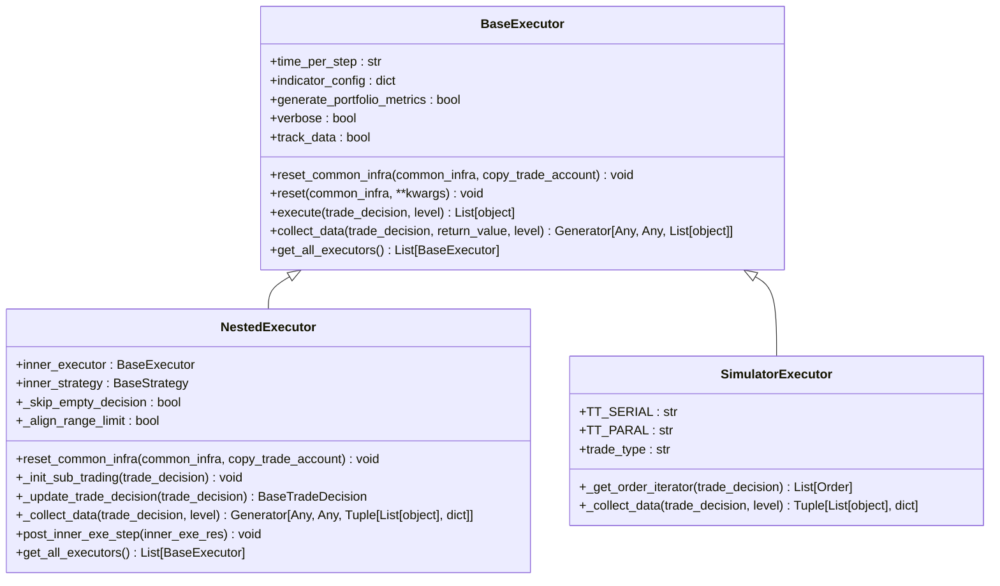
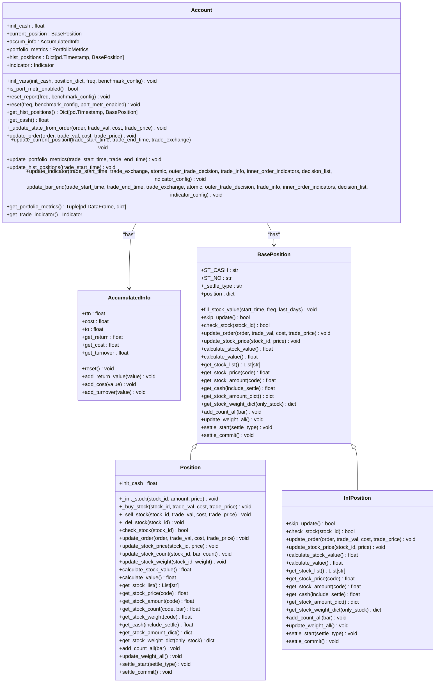
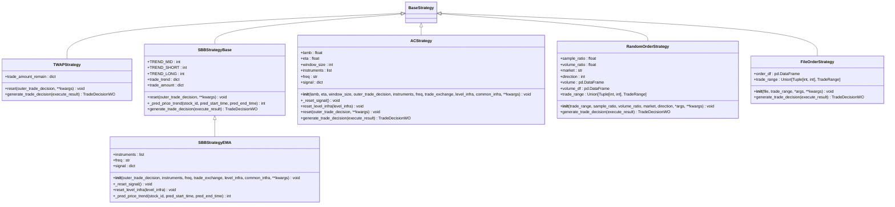
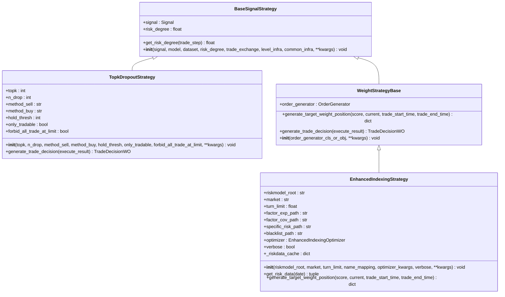
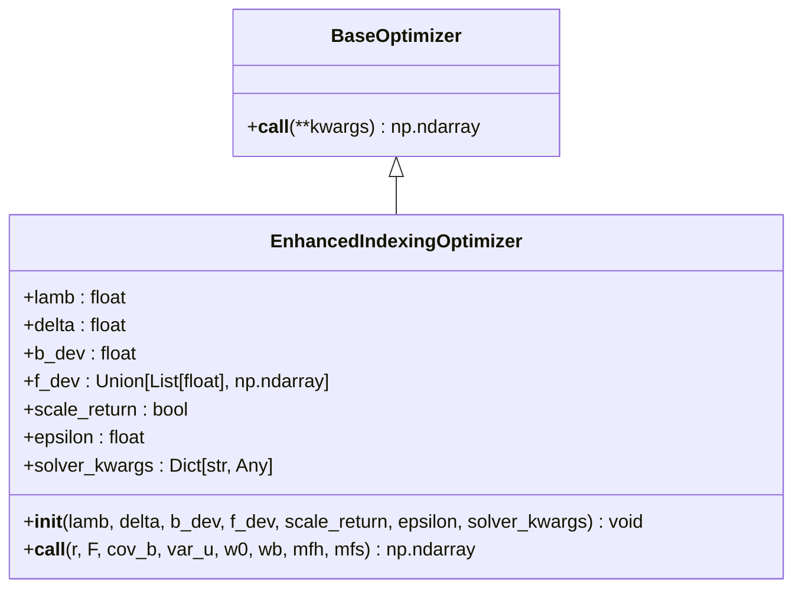
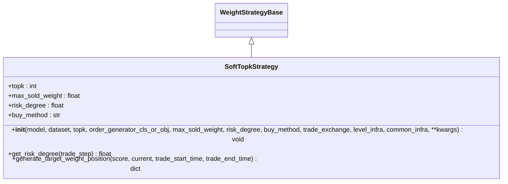
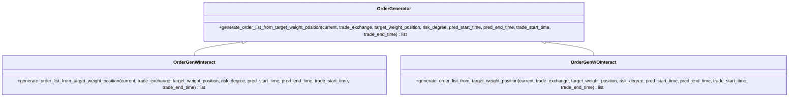
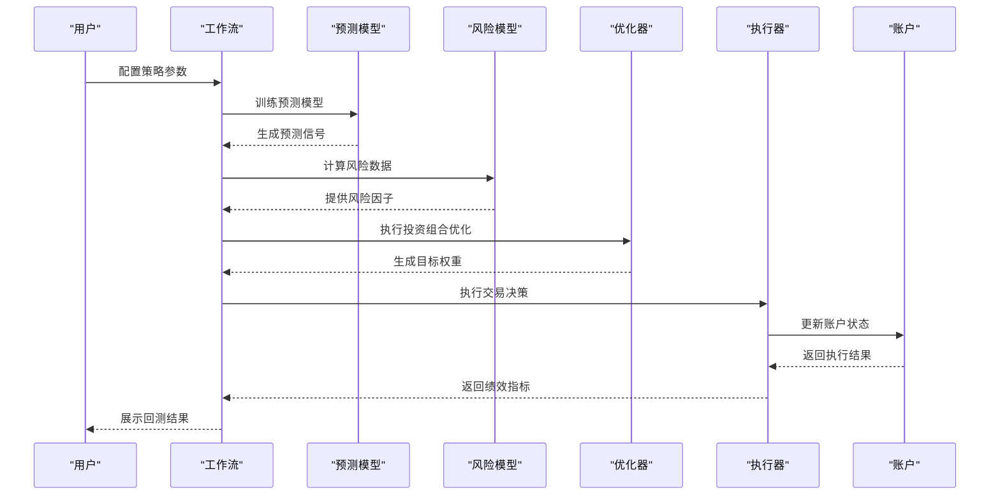

# 回测与策略

<cite>
**本文档引用的文件**   
- [account.py](file://qlib/backtest/account.py)
- [executor.py](file://qlib/backtest/executor.py)
- [exchange.py](file://qlib/backtest/exchange.py)
- [position.py](file://qlib/backtest/position.py)
- [rule_strategy.py](file://qlib/contrib/strategy/rule_strategy.py)
- [signal_strategy.py](file://qlib/contrib/strategy/signal_strategy.py)
- [order_generator.py](file://qlib/contrib/strategy/order_generator.py)
- [cost_control.py](file://qlib/contrib/strategy/cost_control.py)
- [enhanced_indexing.py](file://qlib/contrib/strategy/optimizer/enhanced_indexing.py)
- [config_enhanced_indexing.yaml](file://examples/portfolio/config_enhanced_indexing.yaml)
- [prepare_riskdata.py](file://examples/portfolio/prepare_riskdata.py)
</cite>

## 目录
1. [引言](#引言)
2. [Executor执行器设计](#executor执行器设计)
3. [Account账户模型](#account账户模型)
4. [内置策略实现](#内置策略实现)
5. [投资组合优化功能](#投资组合优化功能)
6. [自定义策略开发](#自定义策略开发)
7. [复杂策略应用示例](#复杂策略应用示例)
8. [结论](#结论)

## 引言
本文档详细描述了QLib回测系统和策略引擎的设计与实现。我们将深入分析Executor执行器如何模拟真实交易环境，Account账户模型如何跟踪持仓和资金变化，介绍RuleStrategy和SignalStrategy等内置策略的逻辑与配置方法，说明投资组合优化功能（如增强型指数跟踪）的实现，并提供自定义策略开发的完整示例。

## Executor执行器设计

Executor执行器是QLib回测系统的核心组件，负责模拟真实交易环境的执行过程。执行器通过分层架构设计，能够处理不同频率的交易决策，从日频到分钟频的复杂交易场景。

执行器的主要职责包括：
- 管理交易日历和时间步进
- 执行交易决策并更新账户状态
- 处理嵌套执行逻辑
- 计算交易指标和绩效

执行器的基类`BaseExecutor`定义了执行器的基本接口和通用功能。执行器通过`collect_data`方法实现交易决策的收集和执行，该方法是一个生成器函数，支持在强化学习等场景中进行数据收集。

**图源**
- [executor.py](file://qlib/backtest/executor.py#L22-L503)

**本节来源**
- [executor.py](file://qlib/backtest/executor.py#L22-L503)

## Account账户模型

Account账户模型是回测系统中用于跟踪持仓和资金变化的核心组件。账户模型通过Position位置管理器来维护股票持仓、现金和相关指标。

账户模型的主要功能包括：
- 跟踪现金和持仓价值
- 计算累计收益、成本和换手率
- 更新投资组合绩效指标
- 维护历史持仓记录

账户模型通过`AccumulatedInfo`类来管理累计信息，包括累计收益、成本和换手率。这些信息在交易执行过程中不断更新，用于计算投资组合的绩效。

**图源**
- [account.py](file://qlib/backtest/account.py#L71-L418)
- [position.py](file://qlib/backtest/position.py#L16-L566)

**本节来源**
- [account.py](file://qlib/backtest/account.py#L71-L418)
- [position.py](file://qlib/backtest/position.py#L16-L566)

## 内置策略实现

QLib提供了多种内置策略，包括基于规则的策略（RuleStrategy）和基于信号的策略（SignalStrategy）。这些策略为用户提供了灵活的交易决策框架。

### RuleStrategy规则策略

RuleStrategy是一类基于预定义规则的交易策略。这类策略通过简单的逻辑规则来生成交易决策，适用于各种交易场景。

**图源**
- [rule_strategy.py](file://qlib/contrib/strategy/rule_strategy.py#L22-L673)

**本节来源**
- [rule_strategy.py](file://qlib/contrib/strategy/rule_strategy.py#L22-L673)

### SignalStrategy信号策略

SignalStrategy是一类基于预测信号的交易策略。这类策略通过分析市场信号来生成交易决策，适用于量化投资场景。

**图源**
- [signal_strategy.py](file://qlib/contrib/strategy/signal_strategy.py#L25-L523)

**本节来源**
- [signal_strategy.py](file://qlib/contrib/strategy/signal_strategy.py#L25-L523)

## 投资组合优化功能

QLib提供了强大的投资组合优化功能，特别是增强型指数跟踪策略的实现。该功能通过优化器来实现，能够有效控制跟踪误差并提高超额收益。

### 增强型指数跟踪优化器

增强型指数跟踪优化器通过求解一个凸优化问题来生成最优投资组合。优化器考虑了预期收益、风险因子暴露和跟踪误差等多个因素。

优化问题的数学形式如下：
- 目标函数：最大化超额收益减去风险惩罚
- 约束条件：权重非负、权重和为1、换手率限制、基准偏离限制、因子偏离限制

**图源**
- [enhanced_indexing.py](file://qlib/contrib/strategy/optimizer/enhanced_indexing.py#L16-L203)

**本节来源**
- [enhanced_indexing.py](file://qlib/contrib/strategy/optimizer/enhanced_indexing.py#L16-L203)

## 自定义策略开发

QLib提供了灵活的接口，支持用户开发自定义策略。用户可以通过继承基类并实现特定方法来创建自己的交易策略。

### 成本控制策略

成本控制是交易策略中的重要环节。QLib通过Exchange组件提供了多种成本控制机制，包括交易成本、最小成本和市场冲击成本。

**图源**
- [cost_control.py](file://qlib/contrib/strategy/cost_control.py#L13-L102)

**本节来源**
- [cost_control.py](file://qlib/contrib/strategy/cost_control.py#L13-L102)

### 订单生成器

订单生成器负责将目标权重转换为具体的交易订单。QLib提供了两种订单生成器：带交互的订单生成器和不带交互的订单生成器。

**图源**
- [order_generator.py](file://qlib/contrib/strategy/order_generator.py#L14-L219)

**本节来源**
- [order_generator.py](file://qlib/contrib/strategy/order_generator.py#L14-L219)

## 复杂策略应用示例

### 增强型指数跟踪策略示例

增强型指数跟踪策略是一个复杂策略的典型应用。该策略结合了预测模型、风险模型和投资组合优化，实现了对基准指数的超额收益。

配置文件`config_enhanced_indexing.yaml`定义了增强型指数跟踪策略的完整配置，包括数据源、模型、策略和回测参数。

**图源**
- [config_enhanced_indexing.yaml](file://examples/portfolio/config_enhanced_indexing.yaml#L1-L72)
- [prepare_riskdata.py](file://examples/portfolio/prepare_riskdata.py#L1-L53)

**本节来源**
- [config_enhanced_indexing.yaml](file://examples/portfolio/config_enhanced_indexing.yaml#L1-L72)
- [prepare_riskdata.py](file://examples/portfolio/prepare_riskdata.py#L1-L53)

## 结论
QLib的回测系统和策略引擎提供了完整而灵活的框架，支持从简单规则策略到复杂优化策略的各种交易场景。通过Executor执行器、Account账户模型和多种内置策略的协同工作，用户可以高效地开发和测试量化交易策略。系统的模块化设计和丰富的配置选项使得它能够适应不同的研究和生产需求。