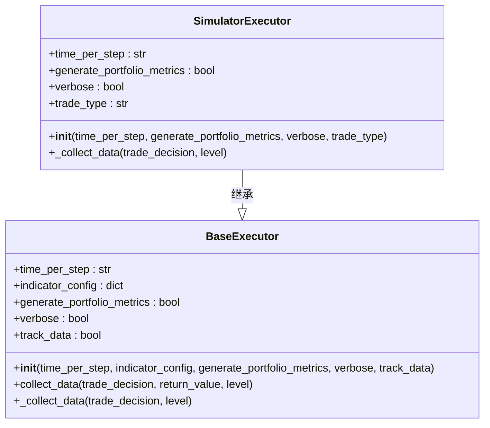
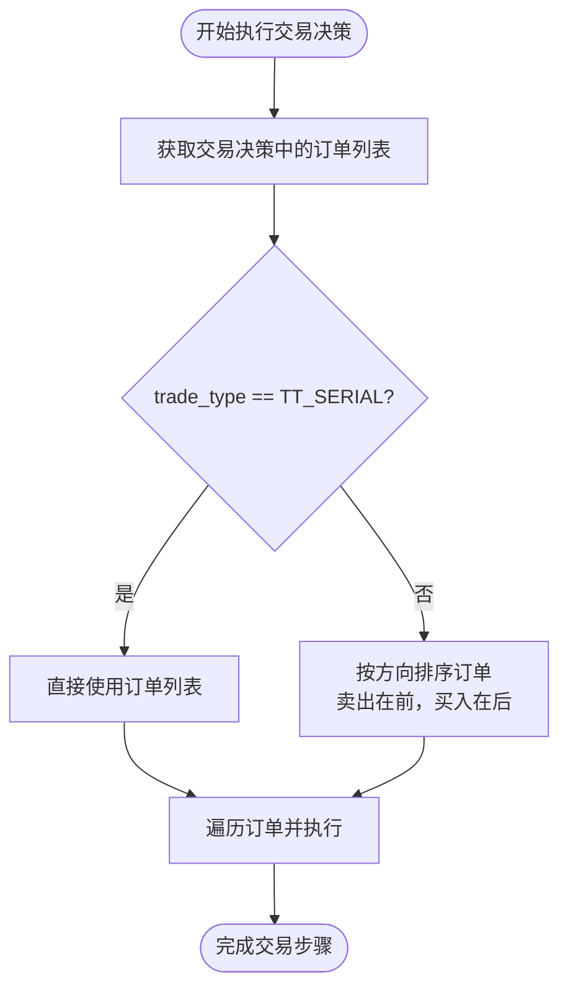
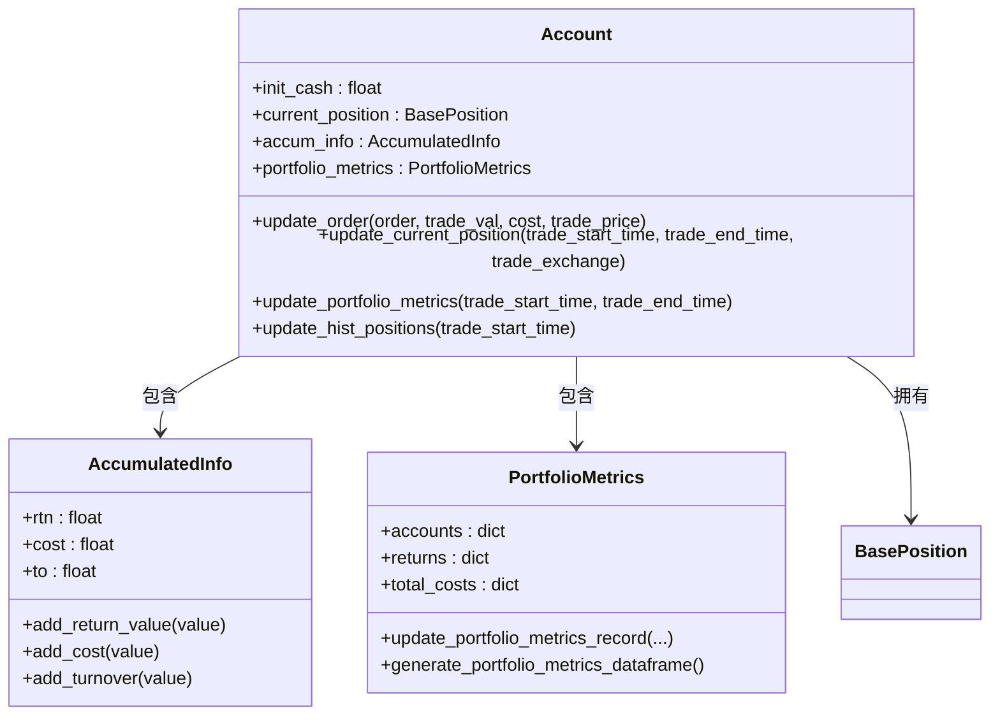
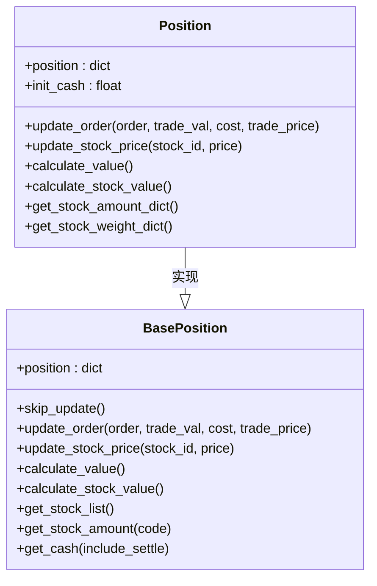
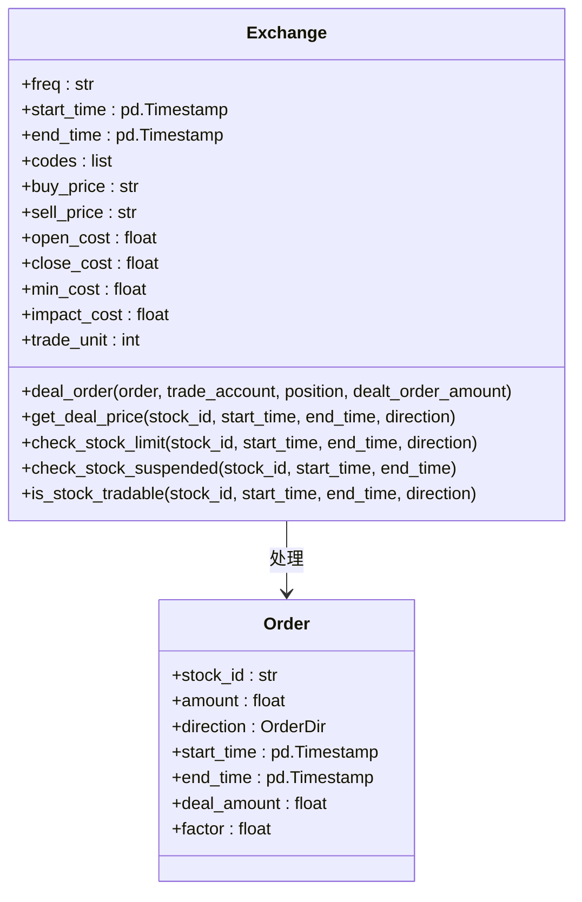
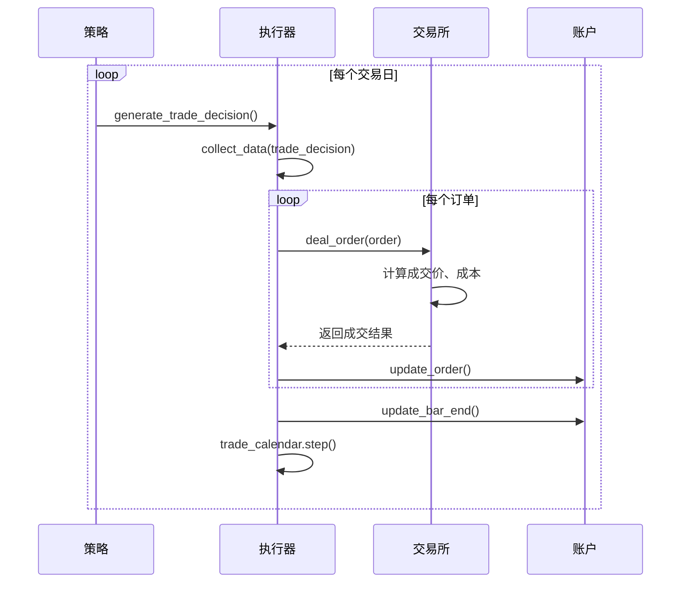

# 回测引擎

<cite>
**本文档引用的文件**   
- [executor.py](file://qlib/backtest/executor.py)
- [account.py](file://qlib/backtest/account.py)
- [position.py](file://qlib/backtest/position.py)
- [exchange.py](file://qlib/backtest/exchange.py)
- [decision.py](file://qlib/backtest/decision.py)
- [backtest.py](file://qlib/backtest/backtest.py)
- [report.py](file://qlib/backtest/report.py)
</cite>

## 目录
1. [引言](#引言)
2. [SimulatorExecutor执行器设计](#simulatorexecutor执行器设计)
3. [账户与头寸模型](#账户与头寸模型)
4. [交易所与撮合逻辑](#交易所与撮合逻辑)
5. [回测数据流与配置](#回测数据流与配置)
6. [高精度回测与性能优化](#高精度回测与性能优化)
7. [典型使用场景与调试](#典型使用场景与调试)
8. [结论](#结论)

## 引言

回测引擎是量化投资系统中的核心组件，用于在历史数据上模拟交易策略的执行过程，评估其性能表现。本文档详尽描述了QLib回测引擎的设计与实现，重点分析了`SimulatorExecutor`执行器如何模拟真实交易环境，`Account`账户模型如何跟踪资金和持仓变化，`Position`类如何管理个股头寸，以及`Exchange`交易所模块如何处理撮合逻辑与交易成本。文档还将结合代码示例，展示关键配置参数的作用机制，并提供高精度回测的配置方法和性能优化策略。

**Section sources**
- [executor.py](file://qlib/backtest/executor.py#L1-L629)
- [account.py](file://qlib/backtest/account.py#L1-L418)
- [position.py](file://qlib/backtest/position.py#L1-L566)
- [exchange.py](file://qlib/backtest/exchange.py#L1-L800)

## SimulatorExecutor执行器设计

`SimulatorExecutor`是回测引擎的核心执行器，继承自`BaseExecutor`，负责模拟真实的市场交易环境。它通过一系列精心设计的参数和流程，将策略生成的交易决策转化为具体的成交回报。

### 核心参数与作用机制

`SimulatorExecutor`的初始化方法定义了多个关键参数，这些参数共同决定了回测的精确度和行为模式。



**Diagram sources**
- [executor.py](file://qlib/backtest/executor.py#L513-L629)

#### time_per_step 参数

`time_per_step`参数定义了每次交易步骤的时间粒度，是生成交易日历的基础。它可以设置为`"day"`、`"30min"`、`"5min"`等，直接决定了回测的频率。例如，设置为`"5min"`时，执行器会在每个交易日的每5分钟进行一次交易决策和执行，从而实现分钟级的高精度回测。

#### generate_portfolio_metrics 参数

`generate_portfolio_metrics`是一个布尔值，用于控制是否生成投资组合的绩效指标。当设置为`True`时，执行器会通过`Account`账户对象，在每个交易步骤结束时计算并记录账户价值、收益率、换手率、交易成本等关键指标。这些指标对于评估策略的整体表现至关重要。

#### verbose 参数

`verbose`参数控制是否在执行过程中打印详细的交易信息。当设置为`True`时，系统会输出每笔成交的详细信息，包括买卖方向、股票代码、成交价格、成交数量、成交价值和交易后剩余现金等，这对于调试和分析交易过程非常有帮助。

#### trade_type 参数

`trade_type`参数定义了订单的执行方式，支持两种模式：
- **`TT_SERIAL` (串行)**: 订单按顺序执行。这允许在同一个交易步骤内先卖出股票，然后用获得的资金购买新的股票。
- **`TT_PARAL` (并行)**: 订单同时执行。在这种模式下，如果策略试图用卖出股票的资金购买新股票，可能会因资金不足而失败。



**Diagram sources**
- [executor.py](file://qlib/backtest/executor.py#L561-L588)

### 执行流程

`SimulatorExecutor`的执行流程由`_collect_data`方法实现。该方法遍历由`_get_order_iterator`方法提供的订单列表，对每个订单调用`Exchange`的`deal_order`方法进行撮合。在每个交易日开始时，系统会清空`dealt_order_amount`字典，以确保该字典仅维护当日的交易信息。

**Section sources**
- [executor.py](file://qlib/backtest/executor.py#L590-L629)

## 账户与头寸模型

`Account`（账户）和`Position`（头寸）是回测系统中用于跟踪资金和持仓的核心数据模型。

### Account账户模型

`Account`类是交易账户的抽象，它维护了初始现金、当前头寸、累计收益、成本和换手率等信息。其核心功能是通过`update_bar_end`方法，在每个交易步骤结束时更新账户状态。



**Diagram sources**
- [account.py](file://qlib/backtest/account.py#L71-L418)

`update_order`方法是账户更新的核心。当一笔交易成交后，该方法会根据订单方向（买入或卖出）来更新账户状态。对于卖出订单，它首先更新累计收益（不考虑成本），然后更新头寸；对于买入订单，它先更新头寸，再更新累计收益。这种顺序确保了在计算收益时，卖出股票的利润是基于其买入成本计算的。

`update_portfolio_metrics`方法负责计算每日的投资组合绩效。它会计算当天的收益（账户价值变化）、成本和换手率，并将这些指标记录到`portfolio_metrics`对象中，最终可通过`generate_portfolio_metrics_dataframe`方法导出为Pandas DataFrame。

### Position头寸管理

`Position`类是`BasePosition`的实现，用于管理具体的持仓信息。它以字典形式存储每只股票的持仓量、价格、持有天数和权重。



**Diagram sources**
- [position.py](file://qlib/backtest/position.py#L231-L566)

`update_order`方法根据订单方向调用`_buy_stock`或`_sell_stock`来更新持仓。在买入时，它会增加相应股票的持仓量，并从现金中扣除交易价值和成本。在卖出时，它会减少持仓量，并将交易价值（扣除成本后）加入现金。`calculate_value`方法计算账户总价值，包括股票市值和现金余额。

**Section sources**
- [account.py](file://qlib/backtest/account.py#L71-L418)
- [position.py](file://qlib/backtest/position.py#L231-L566)

## 交易所与撮合逻辑

`Exchange`（交易所）模块是回测引擎中模拟市场行为的关键组件，它负责提供市场数据、执行订单撮合以及计算交易成本。

### 核心功能与参数

`Exchange`的初始化方法接受一系列参数，用于配置回测环境。



**Diagram sources**
- [exchange.py](file://qlib/backtest/exchange.py#L28-L800)

#### 价格与成本

`deal_price`参数定义了成交价格的计算方式，可以是`"$close"`（收盘价）、`"$open"`（开盘价）或`"$vwap"`（成交量加权平均价）。`open_cost`和`close_cost`分别代表开仓和关仓的费率，`min_cost`是单笔交易的最低成本。`impact_cost`则模拟了市场冲击成本（滑点）。

#### 交易限制

`limit_threshold`参数用于设置涨跌停板限制。例如，设置为`0.095`表示当股票价格变动超过9.5%时，将被视为涨停或跌停，无法进行交易。`check_stock_limit`和`check_stock_suspended`方法用于检查股票是否处于涨跌停或停牌状态，`is_stock_tradable`方法综合判断股票是否可交易。

### 订单撮合流程

`deal_order`方法是撮合逻辑的核心。它首先调用`check_order`方法验证订单的有效性。如果订单有效，则调用`_calc_trade_info_by_order`方法计算成交价格、成交价值和交易成本。最后，根据`trade_account`或`position`参数，调用相应对象的`update_order`方法来更新账户或头寸。

**Section sources**
- [exchange.py](file://qlib/backtest/exchange.py#L28-L800)

## 回测数据流与配置

回测过程是一个由策略、执行器和交易所协同工作的循环。数据流从策略生成交易决策开始，经过执行器执行，最终在交易所完成撮合。

### 数据流分析



**Diagram sources**
- [backtest.py](file://qlib/backtest/backtest.py#L53-L111)
- [executor.py](file://qlib/backtest/executor.py#L227-L303)
- [exchange.py](file://qlib/backtest/exchange.py#L421-L463)

1.  **信号生成**: 策略（`BaseStrategy`）根据市场数据生成`TradeDecisionWO`类型的交易决策，其中包含具体的买入/卖出订单。
2.  **决策执行**: `SimulatorExecutor`的`collect_data`方法接收交易决策，并调用其`_collect_data`方法。
3.  **订单撮合**: `_collect_data`方法遍历订单，调用`Exchange`的`deal_order`方法进行撮合。交易所根据配置的成交价格和交易限制，计算出实际的成交价格、价值和成本。
4.  **状态更新**: 成交结果返回给执行器后，执行器调用`Account`的`update_order`方法更新资金和持仓。在每个交易步骤结束时，`update_bar_end`方法会更新持仓价格、计算投资组合绩效并记录交易指标。
5.  **日历推进**: 交易步骤完成后，`trade_calendar`向前推进一步，进入下一个交易周期。

### 配置示例

以下是一个典型的回测配置示例，展示了如何设置`SimulatorExecutor`和`Exchange`：

```yaml
executor:
  class: SimulatorExecutor
  module_path: qlib.backtest.executor
  kwargs:
    time_per_step: 5min
    generate_portfolio_metrics: True
    verbose: True
    indicator_config:
      show_indicator: True
backtest:
  start_time: 2020-01-01
  end_time: 2020-12-31
  account: 1000000
  exchange_kwargs:
    freq: 1min
    limit_threshold: 0.095
    deal_price: close
    open_cost: 0.0005
    close_cost: 0.0015
    min_cost: 5
    trade_unit: 100
```

**Section sources**
- [workflow.py](file://examples/nested_decision_execution/workflow.py#L160-L221)
- [workflow_config_lightgbm_Alpha158.yaml](file://examples/benchmarks/LightGBM/workflow_config_lightgbm_Alpha158.yaml#L20-L30)

## 高精度回测与性能优化

实现分钟级甚至更高频率的回测是评估高频策略性能的关键。

### 高精度回测配置

要实现高精度回测，关键在于配置正确的数据频率和执行器时间粒度。如示例配置所示，将`executor`的`time_per_step`设置为`"5min"`或`"1min"`，并将`exchange_kwargs`中的`freq`设置为`"1min"`，即可启用分钟级回测。同时，需要确保数据源提供了相应频率的行情数据。

### 性能优化策略

高频率回测会产生大量的计算，因此性能优化至关重要：
1.  **数据预加载**: 确保高频数据（如1分钟K线）已预先下载并缓存，避免在回测过程中实时拉取数据。
2.  **简化指标计算**: 在`indicator_config`中，仅启用必要的交易指标（如`ffr`、`pa`），避免不必要的计算开销。
3.  **并行化**: QLib框架支持一定程度的并行化处理，可以在配置中利用多线程来加速模型训练和回测过程。
4.  **内存优化**: 使用`InfPosition`等特殊头寸模型可以减少内存占用，适用于生成大量随机订单的场景。

**Section sources**
- [highfreq_handler.py](file://qlib/contrib/data/highfreq_handler.py#L199-L219)
- [workflow.py](file://examples/nested_decision_execution/workflow.py#L160-L221)

## 典型使用场景与调试

### 嵌套决策执行

一个典型的高级使用场景是嵌套决策执行，即在日频生成投资组合，然后在分钟频执行订单。这可以通过`NestedExecutor`实现：

```python
executor_config = {
    "class": "NestedExecutor",
    "kwargs": {
        "time_per_step": "day",
        "inner_executor": {
            "class": "SimulatorExecutor",
            "kwargs": {
                "time_per_step": "5min",
                "generate_portfolio_metrics": True
            }
        },
        "inner_strategy": {
            "class": "TWAPStrategy"
        }
    }
}
```

### 常见配置错误及调试方法

1.  **数据频率不匹配**: 确保`executor.time_per_step`、`exchange.freq`和数据源的频率一致。不匹配会导致回测结果异常。
2.  **交易成本设置错误**: 检查`open_cost`、`close_cost`和`min_cost`的设置是否符合实际市场情况。
3.  **涨跌停限制**: 如果回测结果过于理想，可能是因为`limit_threshold`未正确设置，导致策略在涨停板上仍能买入。
4.  **调试方法**: 启用`verbose: True`可以输出详细的交易日志，帮助定位问题。同时，检查`portfolio_metrics`的输出，确认账户价值、成本等指标的变化是否合理。

**Section sources**
- [workflow.py](file://examples/nested_decision_execution/workflow.py#L160-L221)

## 结论

QLib的回测引擎通过`SimulatorExecutor`、`Account`、`Position`和`Exchange`等核心组件的紧密协作，构建了一个高度可配置且精确的交易模拟环境。`SimulatorExecutor`通过`time_per_step`和`generate_portfolio_metrics`等参数灵活控制回测粒度和指标生成；`Account`和`Position`模型精确跟踪资金流和持仓变化；`Exchange`模块则真实地模拟了市场撮合、交易成本和涨跌停限制。通过合理的配置，用户可以实现从日频到分钟级的高精度回测，并利用嵌套执行器等高级功能来模拟复杂的交易策略。理解这些组件的设计与交互，是有效利用QLib进行量化策略研究和评估的基础。