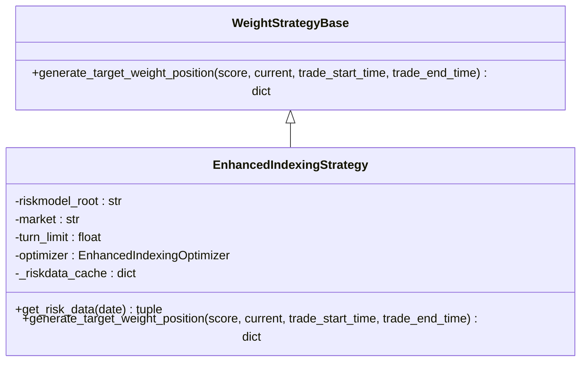
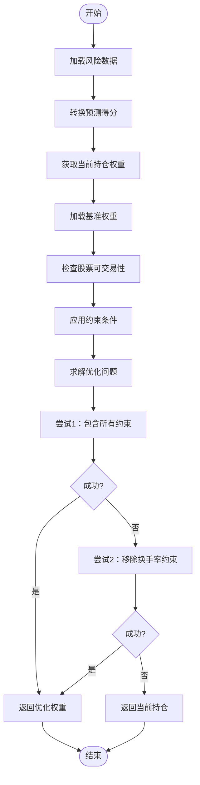
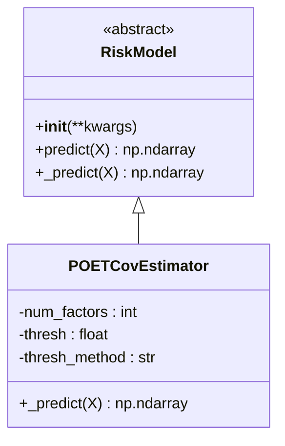
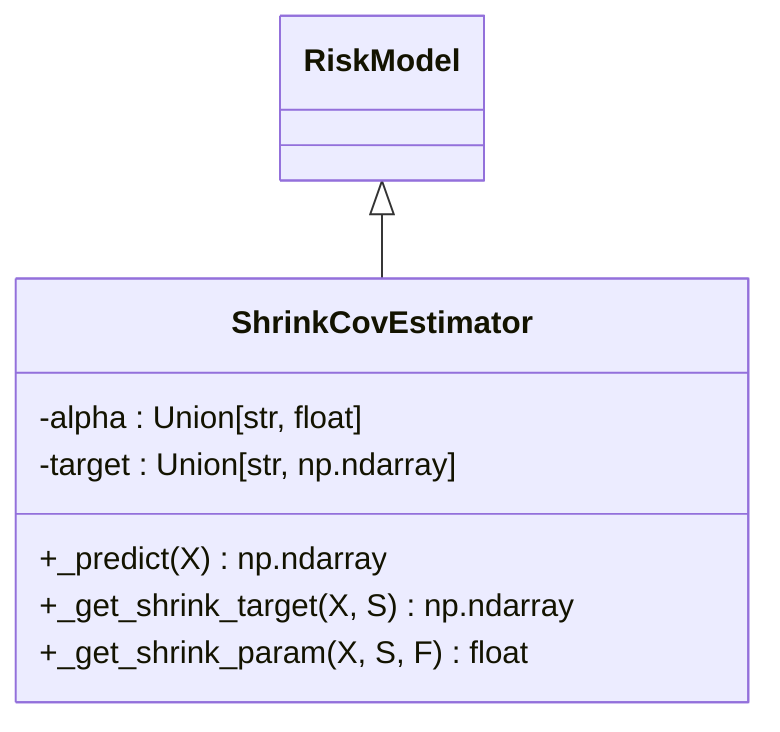
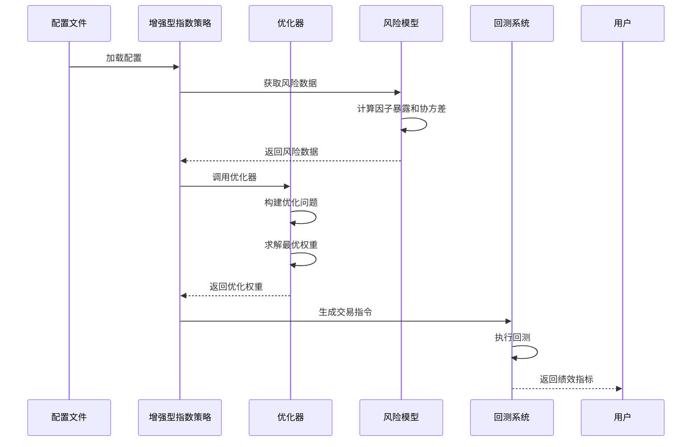

# 投资组合管理

<cite>
**本文档中引用的文件**  
- [enhanced_indexing.py](file://qlib/contrib/strategy/optimizer/enhanced_indexing.py)
- [signal_strategy.py](file://qlib/contrib/strategy/signal_strategy.py)
- [config_enhanced_indexing.yaml](file://examples/portfolio/config_enhanced_indexing.yaml)
- [prepare_riskdata.py](file://examples/portfolio/prepare_riskdata.py)
- [poet.py](file://qlib/model/riskmodel/poet.py)
- [shrink.py](file://qlib/model/riskmodel/shrink.py)
</cite>

## 目录
1. [引言](#引言)
2. [增强型指数跟踪策略](#增强型指数跟踪策略)
3. [优化器实现原理](#优化器实现原理)
4. [风险模型集成](#风险模型集成)
5. [配置参数详解](#配置参数详解)
6. [端到端示例分析](#端到端示例分析)
7. [扩展可能性](#扩展可能性)
8. [结论](#结论)

## 引言
增强型指数跟踪策略（Enhanced Indexing Strategy）是一种结合主动管理与被动跟踪的投资组合管理方法。该策略旨在追求超额收益的同时，有效控制跟踪误差（tracking error）。通过数学规划求解目标权重，该策略能够平衡收益与风险，实现优于基准指数的表现。本文档将深入剖析该策略的实现原理，包括优化器的工作机制、风险模型的集成方式以及关键配置参数的作用。

## 增强型指数跟踪策略
增强型指数跟踪策略通过优化投资组合权重，在追求超额收益的同时控制风险暴露。该策略继承自`WeightStrategyBase`，利用预期收益、因子暴露和风险模型数据来生成目标权重。

**图表来源**  
- [signal_strategy.py](file://qlib/contrib/strategy/signal_strategy.py#L374-L523)

**本节来源**  
- [signal_strategy.py](file://qlib/contrib/strategy/signal_strategy.py#L374-L523)

## 优化器实现原理
`EnhancedIndexingOptimizer`是实现增强型指数跟踪策略的核心组件，它通过凸优化求解投资组合权重。优化问题的目标函数为最大化超额收益减去风险惩罚项。

**图表来源**  
- [enhanced_indexing.py](file://qlib/contrib/strategy/optimizer/enhanced_indexing.py#L16-L203)

**本节来源**  
- [enhanced_indexing.py](file://qlib/contrib/strategy/optimizer/enhanced_indexing.py#L16-L203)

## 风险模型集成
增强型指数跟踪策略支持多种风险模型的集成，包括POET和Shrinkage等先进的协方差估计方法。这些模型用于估计因子协方差矩阵和特质风险。

### POET风险模型
POET（Principal Orthogonal Complement Thresholding）是一种基于主正交补阈值的风险模型，适用于高维协方差矩阵估计。

**图表来源**  
- [poet.py](file://qlib/model/riskmodel/poet.py#L6-L84)

### Shrinkage风险模型
Shrinkage协方差估计器通过将样本协方差矩阵向目标矩阵收缩来改善估计质量。

**图表来源**  
- [shrink.py](file://qlib/model/riskmodel/shrink.py#L7-L260)

**本节来源**  
- [poet.py](file://qlib/model/riskmodel/poet.py#L6-L84)
- [shrink.py](file://qlib/model/riskmodel/shrink.py#L7-L260)

## 配置参数详解
配置文件中的关键参数对策略表现有重要影响。以下是主要参数的作用机制：

| 参数 | 类型 | 默认值 | 说明 |
|------|------|--------|------|
| risk_goal | float | 1.0 | 风险目标，控制风险厌恶程度 |
| max_pos_change | float | 0.2 | 最大持仓变化限制，控制换手率 |
| b_dev | float | 0.01 | 基准偏离限制 |
| f_dev | list | None | 因子偏离限制 |
| scale_return | bool | True | 是否对收益进行缩放 |
| epsilon | float | 5e-5 | 最小权重阈值 |

**本节来源**  
- [enhanced_indexing.py](file://qlib/contrib/strategy/optimizer/enhanced_indexing.py#L47-L87)
- [config_enhanced_indexing.yaml](file://examples/portfolio/config_enhanced_indexing.yaml#L1-L72)

## 端到端示例分析
以下是从配置定义到结果分析的完整流程示例：

**图表来源**  
- [config_enhanced_indexing.yaml](file://examples/portfolio/config_enhanced_indexing.yaml#L1-L72)
- [prepare_riskdata.py](file://examples/portfolio/prepare_riskdata.py#L1-L53)

**本节来源**  
- [config_enhanced_indexing.yaml](file://examples/portfolio/config_enhanced_indexing.yaml#L1-L72)
- [prepare_riskdata.py](file://examples/portfolio/prepare_riskdata.py#L1-L53)

## 扩展可能性
增强型指数跟踪策略具有良好的扩展性，可以集成更多先进的优化技术和风险模型：

1. **多目标优化**：同时优化收益、风险和换手率等多个目标
2. **动态风险模型**：使用时间序列模型预测风险参数
3. **机器学习优化**：利用深度学习模型生成优化参数
4. **约束条件扩展**：添加行业暴露、风格因子等约束
5. **交易成本建模**：更精确地建模市场冲击成本

**本节来源**  
- [enhanced_indexing.py](file://qlib/contrib/strategy/optimizer/enhanced_indexing.py#L16-L203)
- [signal_strategy.py](file://qlib/contrib/strategy/signal_strategy.py#L374-L523)

## 结论
增强型指数跟踪策略通过结合主动管理和被动跟踪的优势，实现了在控制跟踪误差的同时追求超额收益的目标。该策略的核心在于`EnhancedIndexingOptimizer`，它通过数学规划求解最优投资组合权重。通过集成POET、Shrinkage等先进的风险模型，该策略能够更准确地估计风险参数。配置文件中的关键参数如`risk_goal`和`max_pos_change`提供了灵活的控制手段。端到端的示例展示了从配置定义到结果分析的完整流程，验证了策略的有效性。未来可以通过多目标优化、动态风险模型等方向进一步扩展该策略的能力。