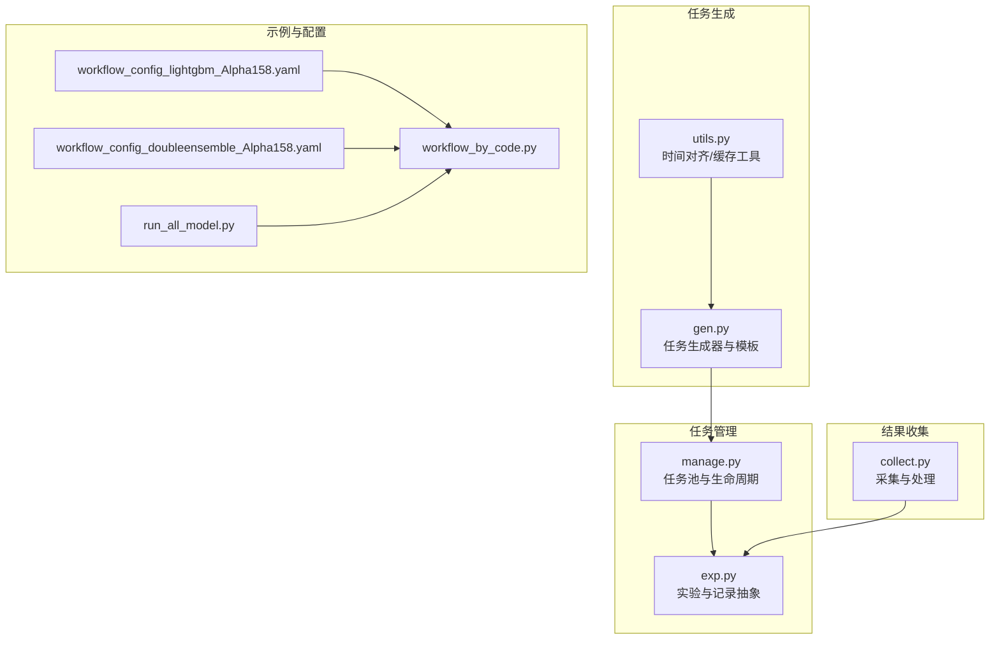
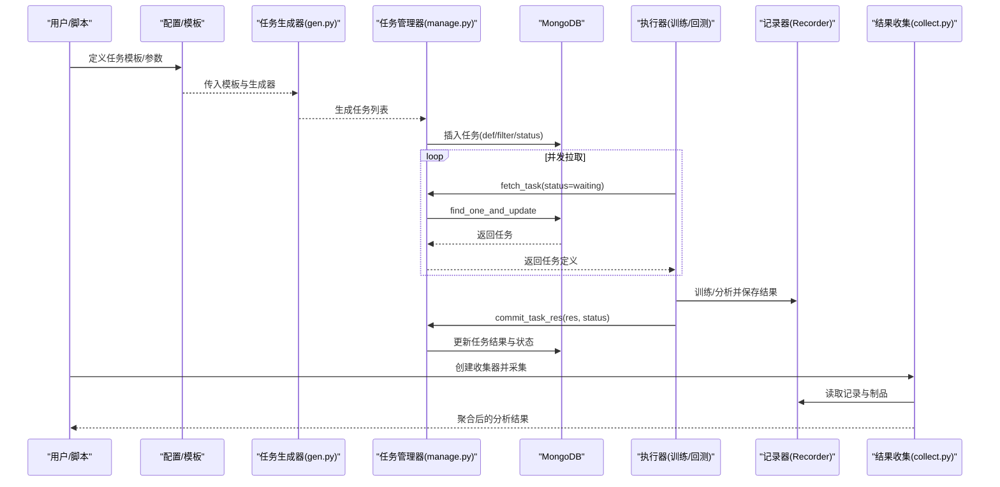
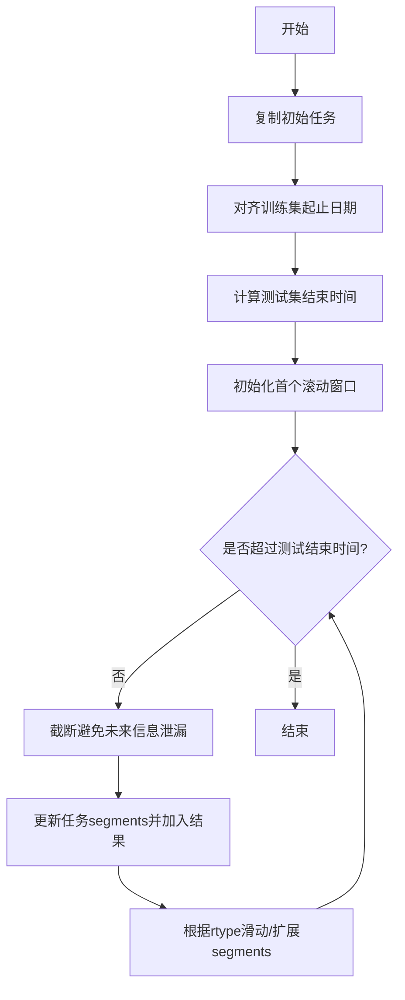
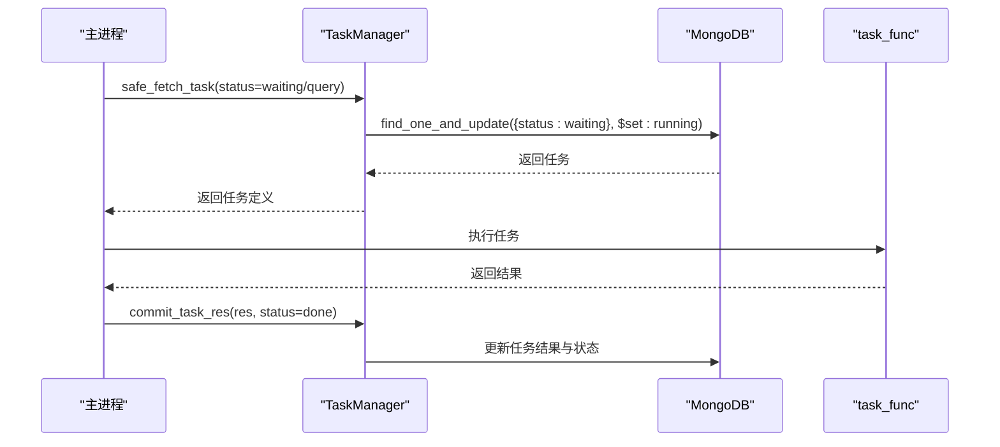
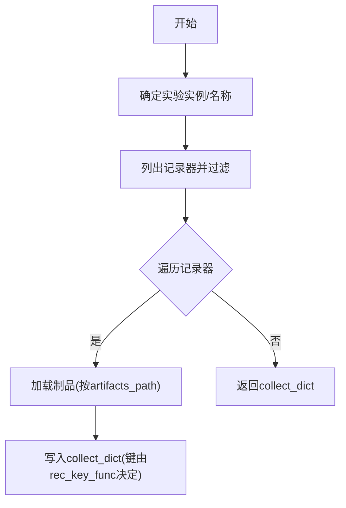
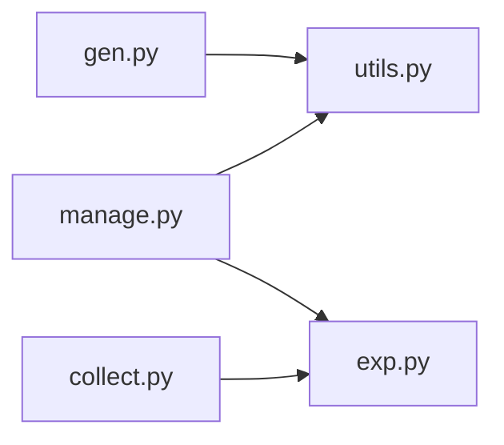

# 任务调度与执行

<cite>
**本文引用的文件**
- [gen.py](file://qlib/workflow/task/gen.py)
- [manage.py](file://qlib/workflow/task/manage.py)
- [collect.py](file://qlib/workflow/task/collect.py)
- [utils.py](file://qlib/workflow/task/utils.py)
- [exp.py](file://qlib/workflow/exp.py)
- [workflow_config_lightgbm_Alpha158.yaml](file://examples/benchmarks/LightGBM/workflow_config_lightgbm_Alpha158.yaml)
- [workflow_config_doubleensemble_Alpha158.yaml](file://examples/benchmarks/DoubleEnsemble/workflow_config_doubleensemble_Alpha158.yaml)
- [workflow_by_code.py](file://examples/workflow_by_code.py)
- [run_all_model.py](file://examples/run_all_model.py)
</cite>

## 目录
1. [简介](#简介)
2. [项目结构](#项目结构)
3. [核心组件](#核心组件)
4. [架构总览](#架构总览)
5. [详细组件分析](#详细组件分析)
6. [依赖关系分析](#依赖关系分析)
7. [性能考量](#性能考量)
8. [故障排查指南](#故障排查指南)
9. [结论](#结论)
10. [附录](#附录)

## 简介
本文件系统性解析 Qlib 的任务管理系统，围绕三类核心模块展开：
- 任务生成：通过模板与生成器组合，批量构造任务（如多模型、多参数、滚动回测等）
- 任务管理：基于 MongoDB 的任务池，支持并发拉取、状态流转、错误恢复与等待机制
- 结果收集：从实验记录中提取、合并、处理指标，支撑统一分析与报告

文档将结合配置文件与示例脚本，给出在大规模模型评估场景中的组织与执行策略，并提供可视化流程图帮助理解。

## 项目结构
任务管理相关代码集中在 qlib/workflow/task 下，配合实验与记录模块完成端到端工作流。

图表来源
- [gen.py](file://qlib/workflow/task/gen.py#L1-L352)
- [utils.py](file://qlib/workflow/task/utils.py#L1-L309)
- [manage.py](file://qlib/workflow/task/manage.py#L1-L557)
- [exp.py](file://qlib/workflow/exp.py#L1-L200)
- [collect.py](file://qlib/workflow/task/collect.py#L1-L259)
- [workflow_config_lightgbm_Alpha158.yaml](file://examples/benchmarks/LightGBM/workflow_config_lightgbm_Alpha158.yaml#L1-L72)
- [workflow_config_doubleensemble_Alpha158.yaml](file://examples/benchmarks/DoubleEnsemble/workflow_config_doubleensemble_Alpha158.yaml#L1-L93)
- [workflow_by_code.py](file://examples/workflow_by_code.py#L1-L86)
- [run_all_model.py](file://examples/run_all_model.py#L1-L404)

章节来源
- [gen.py](file://qlib/workflow/task/gen.py#L1-L352)
- [manage.py](file://qlib/workflow/task/manage.py#L1-L557)
- [collect.py](file://qlib/workflow/task/collect.py#L1-L259)
- [utils.py](file://qlib/workflow/task/utils.py#L1-L309)
- [exp.py](file://qlib/workflow/exp.py#L1-L200)

## 核心组件
- 任务生成器（gen.py）
  - 提供通用的任务模板与生成器接口，支持滚动回测、多时长预测等扩展
  - 关键类：TaskGen 抽象基类、RollingGen 滚动生成器、MultiHorizonGenBase 多时长生成器基类
- 任务管理器（manage.py）
  - 基于 MongoDB 的任务池，封装插入、查询、状态流转、结果提交、等待等能力
  - 关键类：TaskManager；关键函数：run_task
- 结果收集器（collect.py）
  - 从实验记录中采集指标，支持合并、分组、集成等后处理
  - 关键类：Collector、MergeCollector、RecorderCollector
- 工具与基础设施（utils.py）
  - 时间对齐与滚动位移 TimeAdjuster
  - MongoDB 连接 get_mongodb
  - 缓存数据处理器 replace_task_handler_with_cache
- 实验与记录（exp.py）
  - 实验与记录器抽象，为收集器提供实验上下文

章节来源
- [gen.py](file://qlib/workflow/task/gen.py#L1-L352)
- [manage.py](file://qlib/workflow/task/manage.py#L1-L557)
- [collect.py](file://qlib/workflow/task/collect.py#L1-L259)
- [utils.py](file://qlib/workflow/task/utils.py#L1-L309)
- [exp.py](file://qlib/workflow/exp.py#L1-L200)

## 架构总览
下图展示了从“配置/模板”到“任务池”再到“结果收集”的完整链路。

图表来源
- [gen.py](file://qlib/workflow/task/gen.py#L1-L352)
- [manage.py](file://qlib/workflow/task/manage.py#L1-L557)
- [collect.py](file://qlib/workflow/task/collect.py#L1-L259)
- [exp.py](file://qlib/workflow/exp.py#L1-L200)

## 详细组件分析

### 任务生成（gen.py）
- 设计要点
  - 通过 task_generator 将多个生成器与任务模板组合，实现笛卡尔积式扩展
  - RollingGen 支持 expanding/sliding 两种滚动类型，自动调整 segments 并避免未来信息泄漏
  - MultiHorizonGenBase 支持按 horizon 列表生成多时长任务，并对 segments 进行截断
  - handler_mod 与 trunc_segments 配合，确保数据边界安全
- 关键流程（滚动生成）

图表来源
- [gen.py](file://qlib/workflow/task/gen.py#L141-L303)

章节来源
- [gen.py](file://qlib/workflow/task/gen.py#L1-L352)

### 任务管理（manage.py）
- 设计要点
  - 任务池以集合形式存储，字段包含 def（任务定义）、filter（去重用）、status（状态）、res（结果）
  - 使用 find_one_and_update 原子性地取出并置为 running，保证并发安全
  - 提供 safe_fetch_task 上下文，异常时自动归还任务
  - run_task 统一封装“拉取-执行-提交”的循环
  - wait 提供进度条等待未完成任务
- 关键流程（任务拉取与执行）

图表来源
- [manage.py](file://qlib/workflow/task/manage.py#L263-L381)
- [manage.py](file://qlib/workflow/task/manage.py#L483-L550)

章节来源
- [manage.py](file://qlib/workflow/task/manage.py#L1-L557)

### 结果收集（collect.py）
- 设计要点
  - Collector 抽象，要求实现 collect 方法；process_collect 对收集结果逐级应用处理器
  - MergeCollector 可将多个收集器的结果合并为统一字典，支持自定义外层键
  - RecorderCollector 从实验中筛选记录器，按 artifacts_path 加载制品，支持过滤与状态选择
- 关键流程（记录器采集）

图表来源
- [collect.py](file://qlib/workflow/task/collect.py#L136-L259)

章节来源
- [collect.py](file://qlib/workflow/task/collect.py#L1-L259)

### 工具与基础设施（utils.py）
- TimeAdjuster：交易日历对齐、截断、滚动位移
- get_mongodb：从全局配置读取 MongoDB 地址与库名
- replace_task_handler_with_cache：将 handler 序列化为本地缓存文件路径，便于跨进程复用

章节来源
- [utils.py](file://qlib/workflow/task/utils.py#L1-L309)

### 实验与记录（exp.py）
- Experiment 抽象了实验生命周期，提供记录器创建、激活、查询等能力
- 与 Recorder/Collector 协作，支撑结果采集与分析

章节来源
- [exp.py](file://qlib/workflow/exp.py#L1-L200)

## 依赖关系分析
- 组件耦合
  - gen.py 依赖 utils.py 的 TimeAdjuster 与时间对齐逻辑
  - manage.py 依赖 utils.py 的 get_mongodb 与序列化工具
  - collect.py 依赖 exp.py 的 Experiment 与 Recorder 抽象
- 外部依赖
  - MongoDB：任务池持久化与并发控制
  - MLflow：实验与记录器（在实验实现中使用）

图表来源
- [gen.py](file://qlib/workflow/task/gen.py#L1-L352)
- [utils.py](file://qlib/workflow/task/utils.py#L1-L309)
- [manage.py](file://qlib/workflow/task/manage.py#L1-L557)
- [exp.py](file://qlib/workflow/exp.py#L1-L200)
- [collect.py](file://qlib/workflow/task/collect.py#L1-L259)

章节来源
- [gen.py](file://qlib/workflow/task/gen.py#L1-L352)
- [manage.py](file://qlib/workflow/task/manage.py#L1-L557)
- [collect.py](file://qlib/workflow/task/collect.py#L1-L259)
- [utils.py](file://qlib/workflow/task/utils.py#L1-L309)
- [exp.py](file://qlib/workflow/exp.py#L1-L200)

## 性能考量
- 并发与原子性
  - 使用 find_one_and_update 原子性取出任务，避免重复执行
  - safe_fetch_task 在异常时自动归还任务，降低死锁风险
- 数据边界与泄漏防护
  - RollingGen 与 MultiHorizonGenBase 在生成任务时对 segments 截断，避免未来信息泄露
- 序列化与网络开销
  - 任务与结果采用 pickle 序列化，注意 dump 协议版本一致性
  - replace_task_handler_with_cache 将 handler 缓存为本地文件，减少远程 IO
- 等待与进度
  - wait 提供进度条统计，便于监控大规模任务的完成情况

[本节为通用指导，不直接分析具体文件]

## 故障排查指南
- MongoDB 未配置
  - 现象：调用 get_mongodb 抛出错误
  - 处理：在初始化时提供 C.mongo 配置（URL 与数据库名）
- 任务长时间无进展
  - 现象：其他进程意外退出导致 running 任务无法释放
  - 处理：使用 reset_waiting 或 reset_status 将运行中的任务重置为 waiting
- 任务重复执行
  - 现象：filter 字段未正确设置导致重复插入
  - 处理：确保 create_task 中的 filter 与任务定义一致
- 结果加载失败
  - 现象：RecorderCollector 在加载制品时报错
  - 处理：检查 artifacts_path 是否存在；必要时启用 only_exist 忽略缺失项

章节来源
- [utils.py](file://qlib/workflow/task/utils.py#L22-L58)
- [manage.py](file://qlib/workflow/task/manage.py#L382-L455)
- [collect.py](file://qlib/workflow/task/collect.py#L184-L249)

## 结论
Qlib 的任务管理系统以“模板+生成器”驱动任务批量生成，“任务池+状态机”保障执行可靠性，“记录器+采集器”实现结果统一分析。通过配置文件与代码两种方式，既能快速落地标准化流程，也能灵活扩展复杂场景。在大规模模型评估中，建议：
- 明确任务模板与生成器组合策略（滚动/多时长/多参数）
- 合理划分任务池与优先级，确保并发与资源平衡
- 使用缓存与截断策略提升稳定性与效率
- 以 RecorderCollector 为核心构建统一分析流水线

[本节为总结，不直接分析具体文件]

## 附录

### 示例：批量任务与回测配置
- LightGBM Alpha158 配置
  - 包含 model/dataset/record 三部分，支持信号、信号分析与组合投资分析
  - 参考路径：[workflow_config_lightgbm_Alpha158.yaml](file://examples/benchmarks/LightGBM/workflow_config_lightgbm_Alpha158.yaml#L1-L72)
- DoubleEnsemble Alpha158 配置
  - 展示多子模型与样本比例等参数空间
  - 参考路径：[workflow_config_doubleensemble_Alpha158.yaml](file://examples/benchmarks/DoubleEnsemble/workflow_config_doubleensemble_Alpha158.yaml#L1-L93)

章节来源
- [workflow_config_lightgbm_Alpha158.yaml](file://examples/benchmarks/LightGBM/workflow_config_lightgbm_Alpha158.yaml#L1-L72)
- [workflow_config_doubleensemble_Alpha158.yaml](file://examples/benchmarks/DoubleEnsemble/workflow_config_doubleensemble_Alpha158.yaml#L1-L93)

### 示例：代码驱动的工作流
- 通过代码组装模型、数据集与记录器，演示从训练到回测的完整过程
- 参考路径：[workflow_by_code.py](file://examples/workflow_by_code.py#L1-L86)

章节来源
- [workflow_by_code.py](file://examples/workflow_by_code.py#L1-L86)

### 示例：批量模型评估与结果汇总
- run_all_model.py 展示如何批量运行不同模型、收集指标并生成表格
- 参考路径：[run_all_model.py](file://examples/run_all_model.py#L1-L404)

章节来源
- [run_all_model.py](file://examples/run_all_model.py#L1-L404)