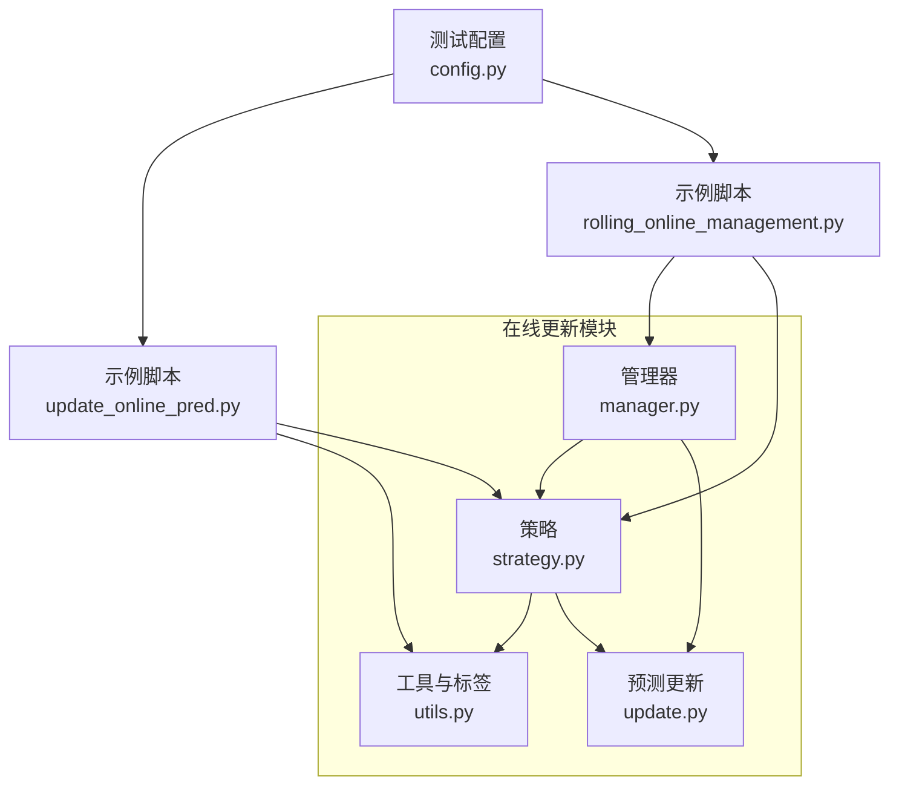
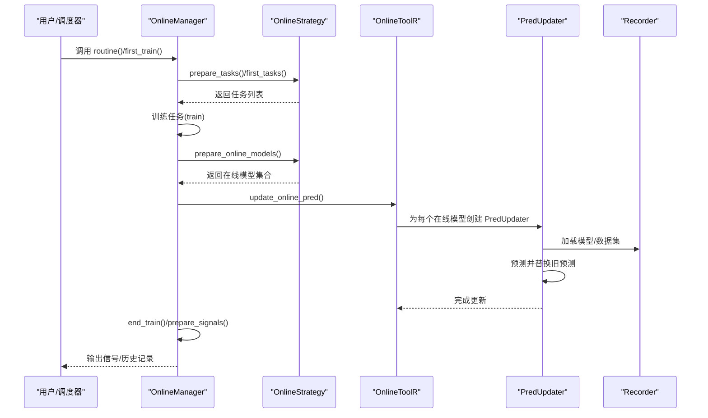
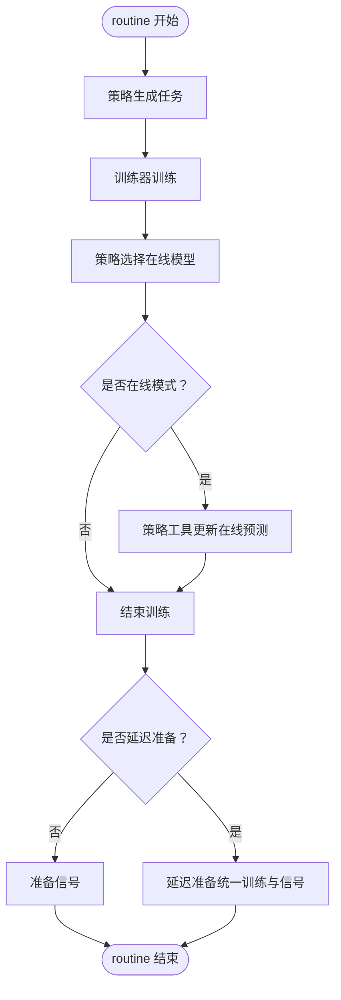
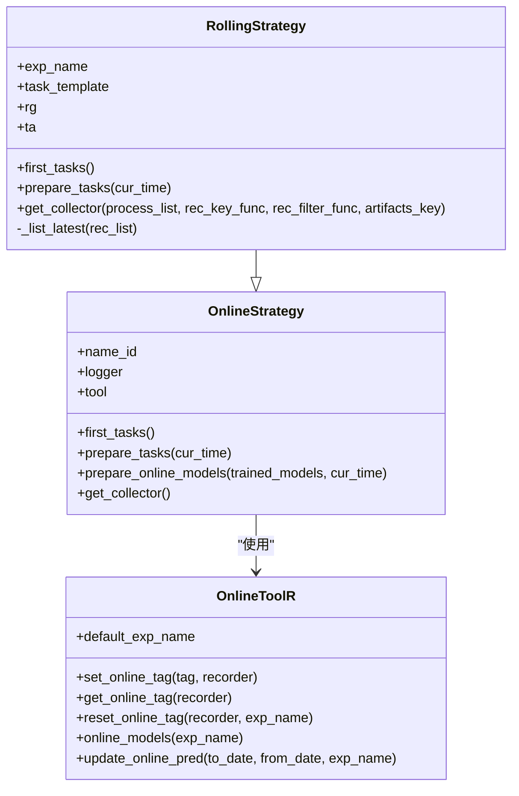
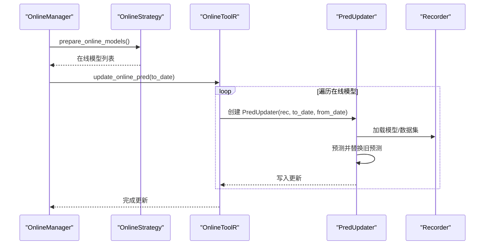
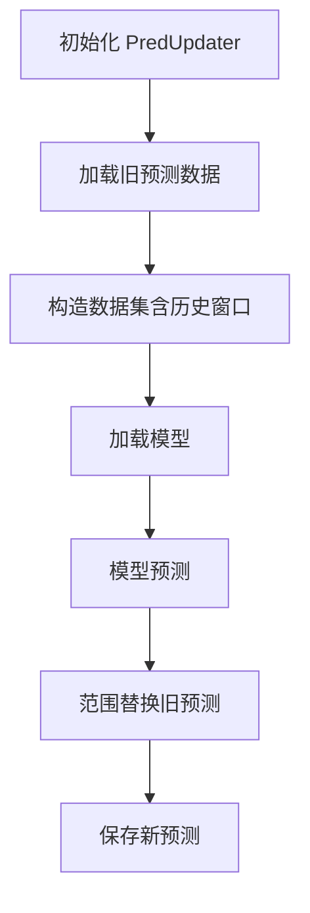
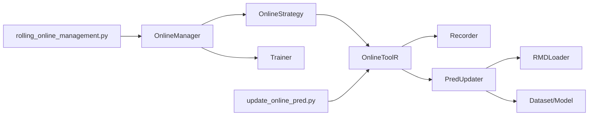

# 在线模型更新

<cite>
**本文引用的文件列表**
- [manager.py](file://qlib/workflow/online/manager.py)
- [strategy.py](file://qlib/workflow/online/strategy.py)
- [update.py](file://qlib/workflow/online/update.py)
- [utils.py](file://qlib/workflow/online/utils.py)
- [update_online_pred.py](file://examples/online_srv/update_online_pred.py)
- [rolling_online_management.py](file://examples/online_srv/rolling_online_management.py)
- [config.py](file://qlib/tests/config.py)
</cite>

## 目录
1. [引言](#引言)
2. [项目结构](#项目结构)
3. [核心组件](#核心组件)
4. [架构总览](#架构总览)
5. [详细组件分析](#详细组件分析)
6. [依赖关系分析](#依赖关系分析)
7. [性能考量](#性能考量)
8. [故障排查指南](#故障排查指南)
9. [结论](#结论)
10. [附录](#附录)

## 引言
本文件系统性地文档化在线模型更新机制，聚焦于在线策略管理、预测更新流程与自动化滚动部署。重点解释 online/ 目录下 manager.py 与 update.py 如何协同工作，以实现模型预测的定期刷新与服务切换；阐述在线策略（strategy.py）的配置与执行逻辑，支撑生产环境中的模型迭代；结合 update_online_pred.py 示例，完整展示在线服务更新工作流。

## 项目结构
在线更新相关代码主要位于以下模块：
- 策略层：workflow/online/strategy.py
- 管理器：workflow/online/manager.py
- 预测更新：workflow/online/update.py
- 工具与标签管理：workflow/online/utils.py
- 示例：examples/online_srv/update_online_pred.py、examples/online_srv/rolling_online_management.py
- 测试配置：qlib/tests/config.py

图表来源
- [manager.py](file://qlib/workflow/online/manager.py#L1-L200)
- [strategy.py](file://qlib/workflow/online/strategy.py#L1-L120)
- [update.py](file://qlib/workflow/online/update.py#L1-L120)
- [utils.py](file://qlib/workflow/online/utils.py#L1-L120)
- [update_online_pred.py](file://examples/online_srv/update_online_pred.py#L1-L55)
- [rolling_online_management.py](file://examples/online_srv/rolling_online_management.py#L1-L144)
- [config.py](file://qlib/tests/config.py#L1-L168)

章节来源
- [manager.py](file://qlib/workflow/online/manager.py#L1-L120)
- [strategy.py](file://qlib/workflow/online/strategy.py#L1-L120)
- [update.py](file://qlib/workflow/online/update.py#L1-L120)
- [utils.py](file://qlib/workflow/online/utils.py#L1-L120)
- [update_online_pred.py](file://examples/online_srv/update_online_pred.py#L1-L55)
- [rolling_online_management.py](file://examples/online_srv/rolling_online_management.py#L1-L144)
- [config.py](file://qlib/tests/config.py#L1-L168)

## 核心组件
- OnlineManager：负责在线策略的生命周期管理，包括首次训练、例行更新、信号准备、模拟回放等。
- OnlineStrategy/RollingStrategy：定义任务生成、在线模型选择与收集器接口，支持滚动策略。
- OnlineToolR：基于 Recorder 的在线模型标签管理与预测更新工具。
- PredUpdater/LabelUpdater：针对 Recorder 中的预测或标签进行增量更新。
- 示例脚本：update_online_pred.py 展示单次模型上线与预测更新；rolling_online_management.py 展示滚动策略的在线管理全流程。

章节来源
- [manager.py](file://qlib/workflow/online/manager.py#L100-L220)
- [strategy.py](file://qlib/workflow/online/strategy.py#L19-L90)
- [utils.py](file://qlib/workflow/online/utils.py#L87-L188)
- [update.py](file://qlib/workflow/online/update.py#L150-L299)
- [update_online_pred.py](file://examples/online_srv/update_online_pred.py#L26-L55)
- [rolling_online_management.py](file://examples/online_srv/rolling_online_management.py#L25-L144)

## 架构总览
在线更新的整体流程由“策略驱动的任务生成—训练—在线模型切换—预测更新—信号准备”构成，并支持模拟回放与延迟训练以提升效率。

图表来源
- [manager.py](file://qlib/workflow/online/manager.py#L156-L228)
- [strategy.py](file://qlib/workflow/online/strategy.py#L37-L90)
- [utils.py](file://qlib/workflow/online/utils.py#L159-L179)
- [update.py](file://qlib/workflow/online/update.py#L211-L282)

## 详细组件分析

### OnlineManager：在线策略生命周期与例行更新
- 初始化与状态
  - 支持多策略实例，可设置开始时间、频率与训练器。
  - 维护在线历史字典，记录每日各策略的在线模型集合。
- 首次训练（first_train）
  - 逐策略调用 first_tasks 生成初始任务，训练后通过 prepare_online_models 设置在线模型，并写入历史。
- 例行更新（routine）
  - 按策略 prepare_tasks 生成新任务，训练后 prepare_online_models 更新在线模型集合。
  - 在线模式下，例行结束后调用策略工具的 update_online_pred 刷新预测。
  - 若非延迟训练，则在 routine 结束后统一执行 end_train 并 prepare_signals。
- 模拟回放（simulate）
  - 从当前时间到结束时间按日历推进 routine，支持延迟训练与延迟准备。
- 延迟准备（delay_prepare）
  - 当使用延迟训练时，汇总历史中新增的在线模型并统一完成训练与信号准备。

图表来源
- [manager.py](file://qlib/workflow/online/manager.py#L184-L228)
- [manager.py](file://qlib/workflow/online/manager.py#L302-L347)
- [manager.py](file://qlib/workflow/online/manager.py#L349-L383)

章节来源
- [manager.py](file://qlib/workflow/online/manager.py#L110-L228)
- [manager.py](file://qlib/workflow/online/manager.py#L302-L383)

### OnlineStrategy/RollingStrategy：策略定义与滚动任务生成
- OnlineStrategy
  - 抽象接口：first_tasks、prepare_tasks、prepare_online_models、get_collector。
  - 默认在线模型选择策略：若无新模型则沿用上次在线模型；否则将新训练模型全部置为在线。
- RollingStrategy
  - 基于 RollingGen 的滚动任务生成，按最新测试区间推导后续任务。
  - 提供收集器，按模型类型与滚动测试区间区分不同模型结果。
  - first_tasks 使用 RollingGen 生成初始滚动任务序列。

图表来源
- [strategy.py](file://qlib/workflow/online/strategy.py#L19-L90)
- [strategy.py](file://qlib/workflow/online/strategy.py#L92-L209)
- [utils.py](file://qlib/workflow/online/utils.py#L87-L188)

章节来源
- [strategy.py](file://qlib/workflow/online/strategy.py#L19-L90)
- [strategy.py](file://qlib/workflow/online/strategy.py#L92-L209)
- [utils.py](file://qlib/workflow/online/utils.py#L87-L188)

### OnlineToolR：在线模型标签与预测更新
- 标签管理
  - set_online_tag：为模型 Recorder 设置在线/离线标签。
  - reset_online_tag：将实验内所有模型置为离线，仅将指定模型置为在线。
  - online_models：查询当前在线模型集合。
- 预测更新
  - update_online_pred：遍历在线模型，为每个模型创建 PredUpdater 并执行增量预测更新。
  - 自动跳过缺失预测文件的 Recorder 并记录警告。

图表来源
- [utils.py](file://qlib/workflow/online/utils.py#L159-L179)
- [update.py](file://qlib/workflow/online/update.py#L211-L282)

章节来源
- [utils.py](file://qlib/workflow/online/utils.py#L87-L188)
- [update.py](file://qlib/workflow/online/update.py#L211-L282)

### PredUpdater/LabelUpdater：预测与标签的增量更新
- PredUpdater
  - 基于 Recorder 的模型与数据集加载，执行模型预测，对旧预测进行范围替换并保存。
- LabelUpdater
  - 基于 SignalRecord 生成标签，同样进行范围替换并保存。
- RMDLoader
  - 封装 Recorder 中模型与数据集的加载与配置，支持按时间段切片与历史依赖长度自动推断。

图表来源
- [update.py](file://qlib/workflow/online/update.py#L150-L299)

章节来源
- [update.py](file://qlib/workflow/online/update.py#L1-L299)

### 示例：update_online_pred.py
- 功能概述
  - 展示首次训练并将模型设为在线，随后更新在线预测的完整流程。
- 关键步骤
  - 初始化与任务配置，执行 task_train 后通过 OnlineToolR.reset_online_tag 设为在线。
  - 调用 OnlineToolR.update_online_pred 执行预测更新。
- 使用方式
  - 命令行分别执行 first_train 与 update_online_pred，或通过 main 组合运行。

章节来源
- [update_online_pred.py](file://examples/online_srv/update_online_pred.py#L26-L55)
- [config.py](file://qlib/tests/config.py#L94-L121)

### 示例：rolling_online_management.py
- 功能概述
  - 展示滚动策略的在线管理全流程：首次训练、例行更新、添加新策略、再次例行更新。
- 关键步骤
  - 构建 RollingStrategy 列表，创建 OnlineManager。
  - first_run：首次训练并收集结果、持久化。
  - routine：加载持久化对象，执行 routine 并输出结果。
  - add_strategy：动态添加新策略并执行首次训练。
- 延迟训练
  - 支持 DelayTrainerR/DelayTrainerRM，提高训练并发度与回放效率。

章节来源
- [rolling_online_management.py](file://examples/online_srv/rolling_online_management.py#L25-L144)
- [strategy.py](file://qlib/workflow/online/strategy.py#L92-L209)
- [manager.py](file://qlib/workflow/online/manager.py#L156-L228)

## 依赖关系分析
- OnlineManager 依赖 OnlineStrategy 接口与 Trainer 进行训练与在线模型切换。
- OnlineStrategy 依赖 OnlineToolR 进行在线模型标签管理与预测更新。
- OnlineToolR 依赖 Recorder 与 PredUpdater 执行预测更新。
- PredUpdater 依赖 Recorder、RMDLoader、Dataset/Model 进行预测更新。
- 示例脚本依赖测试配置与在线工具。

图表来源
- [manager.py](file://qlib/workflow/online/manager.py#L156-L228)
- [strategy.py](file://qlib/workflow/online/strategy.py#L19-L90)
- [utils.py](file://qlib/workflow/online/utils.py#L159-L179)
- [update.py](file://qlib/workflow/online/update.py#L150-L299)
- [update_online_pred.py](file://examples/online_srv/update_online_pred.py#L26-L55)
- [rolling_online_management.py](file://examples/online_srv/rolling_online_management.py#L25-L144)

章节来源
- [manager.py](file://qlib/workflow/online/manager.py#L156-L228)
- [strategy.py](file://qlib/workflow/online/strategy.py#L19-L90)
- [utils.py](file://qlib/workflow/online/utils.py#L159-L179)
- [update.py](file://qlib/workflow/online/update.py#L150-L299)
- [update_online_pred.py](file://examples/online_srv/update_online_pred.py#L26-L55)
- [rolling_online_management.py](file://examples/online_srv/rolling_online_management.py#L25-L144)

## 性能考量
- 延迟训练与延迟准备
  - OnlineManager 支持 DelayTrainer 与延迟准备，可在模拟回放中并行训练与统一准备，减少重复计算与IO开销。
- 历史依赖窗口
  - PredUpdater 自动推断历史依赖长度（如 TSDatasetH 的 step_len），避免不必要的数据重算。
- 在线模型筛选
  - RollingStrategy 仅对最新测试区间的模型生成后续任务，降低任务规模与训练成本。
- 日志与状态控制
  - 模拟回放时降低日志级别，减少I/O干扰，便于大规模回放。

章节来源
- [manager.py](file://qlib/workflow/online/manager.py#L145-L155)
- [manager.py](file://qlib/workflow/online/manager.py#L302-L347)
- [update.py](file://qlib/workflow/online/update.py#L190-L209)
- [strategy.py](file://qlib/workflow/online/strategy.py#L167-L189)

## 故障排查指南
- 预测更新未生效
  - 检查 OnlineManager 是否处于在线模式且 routine 结束后调用了 update_online_pred。
  - 确认 OnlineToolR.reset_online_tag 已正确将模型标记为在线。
- 预测文件缺失
  - OnlineToolR.update_online_pred 对缺失预测文件会记录警告并跳过，需确认 Recorder 中是否存在 pred.pkl。
- 延迟训练兼容性
  - 使用 DelayTrainer 时，注意延迟准备阶段的时序与信号污染风险，必要时调整 to_date 与 from_date。
- 数据集配置问题
  - PredUpdater.prepare_data 会根据历史依赖自动推断窗口，若自定义数据集请显式提供 hist_ref，避免信息泄漏。

章节来源
- [manager.py](file://qlib/workflow/online/manager.py#L220-L228)
- [utils.py](file://qlib/workflow/online/utils.py#L167-L179)
- [update.py](file://qlib/workflow/online/update.py#L170-L180)
- [update.py](file://qlib/workflow/online/update.py#L202-L209)

## 结论
在线模型更新机制通过 OnlineManager 的策略编排、OnlineStrategy 的任务生成与在线模型选择、OnlineToolR 的标签管理与预测更新，以及 PredUpdater 的增量更新能力，实现了生产环境中的模型迭代与自动化滚动部署。配合示例脚本与延迟训练，可高效完成首次训练、例行更新与信号准备，满足高频交易与回测场景的需求。

## 附录
- 快速参考
  - 首次训练与在线模型设置：见 update_online_pred.py 的 first_train 与 reset_online_tag。
  - 在线预测更新：见 update_online_pred.py 的 update_online_pred 与 OnlineToolR.update_online_pred。
  - 滚动策略管理：见 rolling_online_management.py 的 first_run/routine/add_strategy/main。
- 相关配置
  - 测试任务模板与数据集配置：见 config.py 中的 get_gbdt_task、get_dataset_config、CSI300_GBDT_TASK 等。

章节来源
- [update_online_pred.py](file://examples/online_srv/update_online_pred.py#L26-L55)
- [rolling_online_management.py](file://examples/online_srv/rolling_online_management.py#L25-L144)
- [config.py](file://qlib/tests/config.py#L94-L168)