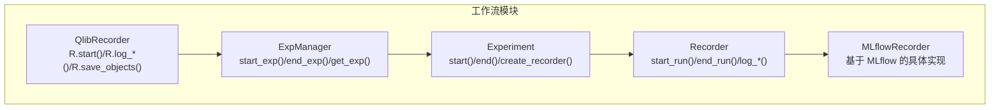
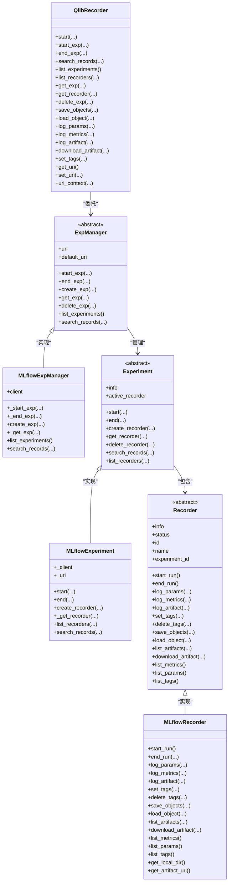
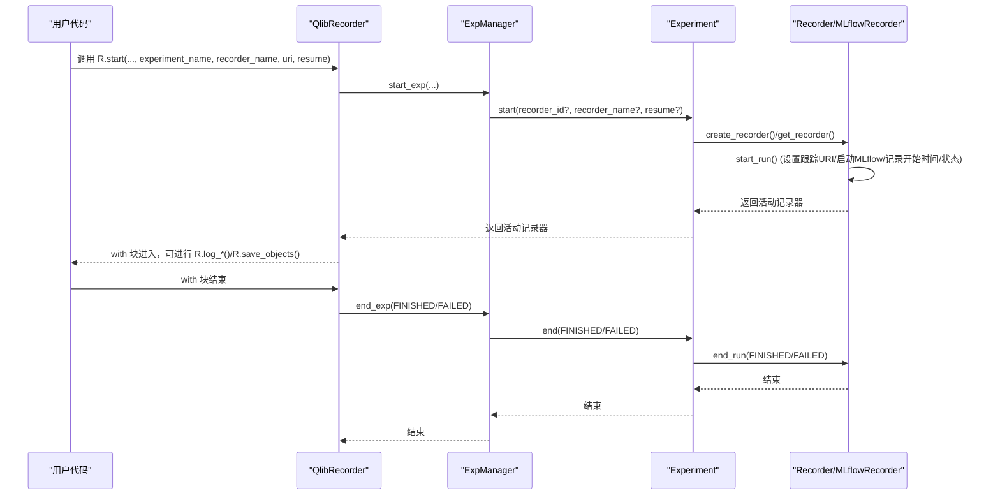
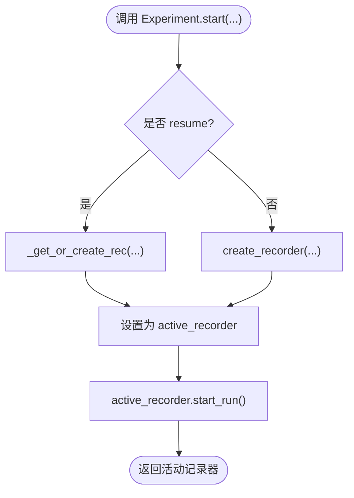
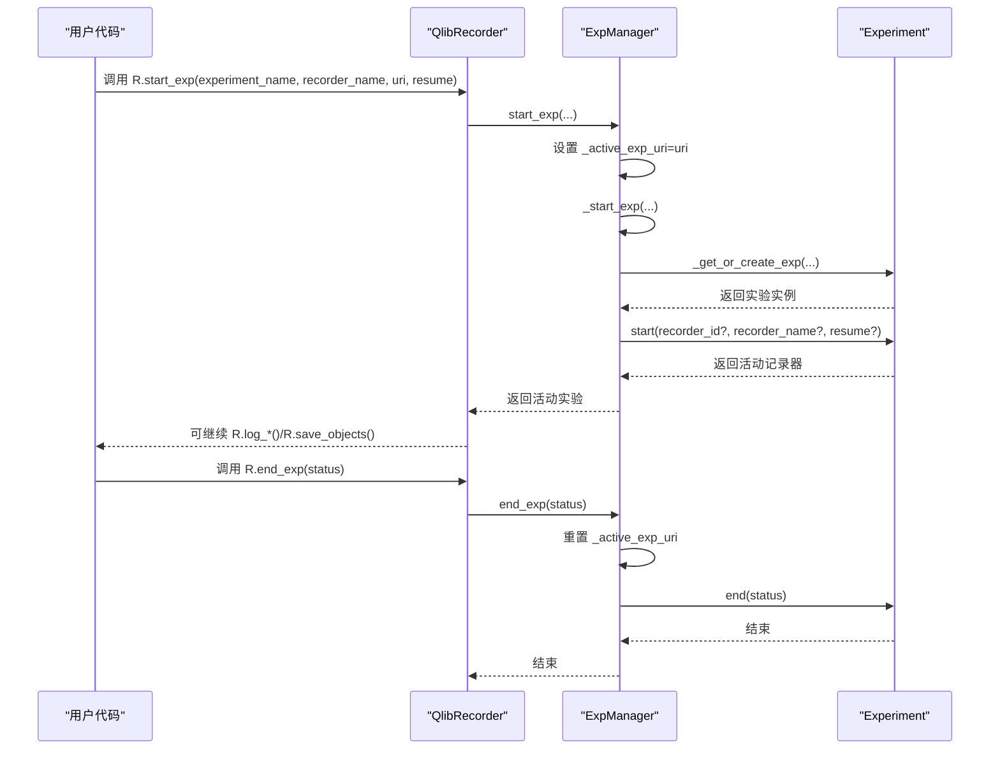
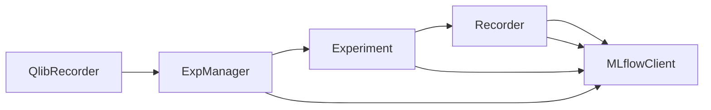

# 实验记录与管理

<cite>
**本文引用的文件列表**
- [recorder.py](file://qlib/workflow/recorder.py)
- [exp.py](file://qlib/workflow/exp.py)
- [expm.py](file://qlib/workflow/expm.py)
- [__init__.py](file://qlib/workflow/__init__.py)
- [utils.py](file://qlib/workflow/utils.py)
- [run_all_model.py](file://examples/run_all_model.py)
- [recorder.rst](file://docs/component/recorder.rst)
</cite>

## 目录
1. [引言](#引言)
2. [项目结构](#项目结构)
3. [核心组件](#核心组件)
4. [架构总览](#架构总览)
5. [详细组件分析](#详细组件分析)
6. [依赖关系分析](#依赖关系分析)
7. [性能考量](#性能考量)
8. [故障排查指南](#故障排查指南)
9. [结论](#结论)
10. [附录](#附录)

## 引言
本文件系统性阐述 QLib 中“实验记录器（Recorder）”与“实验管理器（Exp/ExpManager）”的设计与实现，重点覆盖以下方面：
- 如何通过 R.start() 启动实验记录，捕获模型训练、回测结果以及关联的元数据（如配置、指标、模型文件等）
- 实验记录的生命周期管理：创建、启动、运行、结束、持久化、查询与加载
- 结合 Python API 展示如何组织与检索历史实验，支撑研究可复现性
- expm.py 中的实验收集与管理能力，用于大规模实验分析

## 项目结构
围绕实验记录与管理的相关模块主要位于 qlib/workflow 目录，关键文件如下：
- recorder.py：定义 Recorder 抽象类与 MLflowRecorder 具体实现，提供日志参数、指标、标签、对象存取、制品下载等能力
- exp.py：定义 Experiment 抽象类与 MLflowExperiment 实现，负责实验的启动/结束、记录器的创建/获取/删除、记录查询等
- expm.py：定义 ExpManager 抽象类与 MLflowExpManager 实现，负责实验的创建/获取/删除、实验列表、记录查询等，并维护默认 URI 与当前活动实验
- __init__.py：提供高层 API QlibRecorder（变量 R），封装 start/end/start_exp/search_records/list_experiments 等常用接口
- utils.py：提供异常退出时自动结束实验的钩子函数，确保异常情况下也能正确收尾
- examples/run_all_model.py：演示大规模实验组织与结果收集的典型用法
- docs/component/recorder.rst：官方组件文档对 Recorder/ExpManager 的说明

图表来源
- [__init__.py](file://qlib/workflow/__init__.py#L1-L120)
- [expm.py](file://qlib/workflow/expm.py#L1-L120)
- [exp.py](file://qlib/workflow/exp.py#L1-L120)
- [recorder.py](file://qlib/workflow/recorder.py#L1-L120)

章节来源
- [recorder.py](file://qlib/workflow/recorder.py#L1-L120)
- [exp.py](file://qlib/workflow/exp.py#L1-L120)
- [expm.py](file://qlib/workflow/expm.py#L1-L120)
- [__init__.py](file://qlib/workflow/__init__.py#L1-L120)

## 核心组件
- Recorder 抽象类：定义记录器的统一接口，包括启动/结束、参数/指标/标签/制品管理、对象保存/加载、制品列表/下载、度量/参数/标签列表等
- MLflowRecorder：基于 MLflow 的具体实现，负责与 MLflow 客户端交互，异步日志、自动记录未提交代码、对象序列化/反序列化、制品下载清理等
- Experiment 抽象类：定义实验的统一接口，包括启动/结束、记录器的创建/获取/删除、记录查询、记录器列表等
- MLflowExperiment：基于 MLflow 的具体实现，负责实验的启动/结束、记录器的创建/获取/删除、记录查询、记录器列表等
- ExpManager 抽象类：定义实验管理器的统一接口，包括启动/结束实验、创建/获取/删除实验、实验列表、记录查询等
- MLflowExpManager：基于 MLflow 的具体实现，负责实验的创建/获取/删除、实验列表、记录查询、URI 管理、并发安全（文件锁）等
- QlibRecorder（R）：高层 API 封装，提供 with 上下文启动/结束实验、日志记录、对象存取、记录查询、实验/记录器管理等便捷接口

章节来源
- [recorder.py](file://qlib/workflow/recorder.py#L28-L120)
- [exp.py](file://qlib/workflow/exp.py#L15-L120)
- [expm.py](file://qlib/workflow/expm.py#L23-L120)
- [__init__.py](file://qlib/workflow/__init__.py#L26-L120)

## 架构总览
整体架构采用三层抽象：管理器层（ExpManager）、实验层（Experiment）、记录器层（Recorder），并通过 QlibRecorder 提供统一入口。

图表来源
- [__init__.py](file://qlib/workflow/__init__.py#L26-L200)
- [expm.py](file://qlib/workflow/expm.py#L23-L120)
- [exp.py](file://qlib/workflow/exp.py#L15-L120)
- [recorder.py](file://qlib/workflow/recorder.py#L28-L120)

## 详细组件分析

### 组件一：实验记录器（Recorder/MLflowRecorder）
- 职责
  - 记录器生命周期管理：start_run/end_run
  - 日志能力：log_params/log_metrics/log_artifact/set_tags/delete_tags
  - 对象存取：save_objects/load_object（支持直接传入对象或本地路径）
  - 制品管理：list_artifacts/download_artifact/artifact_uri 获取
  - 度量/参数/标签查询：list_metrics/list_params/list_tags
  - 辅助能力：自动记录未提交代码、异步日志、Azure Blob 清理临时文件
- 关键流程
  - 启动：设置跟踪 URI，启动 MLflow 运行，记录开始时间与状态，开启异步日志队列
  - 结束：等待异步日志完成，更新结束时间与状态，调用 MLflow.end_run
  - 对象保存：若传入本地路径则直接上传；否则序列化到临时目录后上传
  - 对象加载：下载制品到临时目录，反序列化为对象，必要时清理临时目录

图表来源
- [__init__.py](file://qlib/workflow/__init__.py#L37-L120)
- [exp.py](file://qlib/workflow/exp.py#L243-L317)
- [recorder.py](file://qlib/workflow/recorder.py#L335-L494)

章节来源
- [recorder.py](file://qlib/workflow/recorder.py#L28-L120)
- [recorder.py](file://qlib/workflow/recorder.py#L335-L494)

### 组件二：实验（Experiment/MLflowExperiment）
- 职责
  - 实验启动/结束：start/end，设置/清除活动记录器
  - 记录器管理：create_recorder/get_recorder/_get_or_create_rec/_get_recorder/list_recorders/delete_recorder
  - 记录查询：search_records（基于 MLflow 搜索）
- 关键流程
  - start：根据 resume 决定是恢复已有记录器还是新建记录器，并设为活动记录器
  - get_recorder：支持按 id/name 获取，或在 create=True 时自动创建并可选择立即启动
  - list_recorders：基于 MLflow 搜索运行并按状态过滤

图表来源
- [exp.py](file://qlib/workflow/exp.py#L243-L317)

章节来源
- [exp.py](file://qlib/workflow/exp.py#L15-L120)
- [exp.py](file://qlib/workflow/exp.py#L243-L380)

### 组件三：实验管理器（ExpManager/MLflowExpManager）
- 职责
  - 实验管理：start_exp/end_exp/create_exp/get_exp/_get_or_create_exp/_get_exp/delete_exp/list_experiments
  - 记录查询：search_records（基于 MLflow 搜索）
  - URI 管理：default_uri（来自全局配置 C）与 _active_exp_uri（临时覆盖）
  - 并发安全：文件锁保护实验创建冲突（file scheme）
- 关键流程
  - start_exp：设置 _active_exp_uri，调用 _start_exp 创建/激活实验并启动其记录器
  - end_exp：重置 _active_exp_uri，调用 _end_exp 结束实验
  - get_exp：优先返回活动实验；否则按 create 参数决定创建或抛错
  - create_exp：调用 MLflow 客户端创建实验，处理已存在异常

图表来源
- [expm.py](file://qlib/workflow/expm.py#L47-L119)
- [expm.py](file://qlib/workflow/expm.py#L318-L435)
- [exp.py](file://qlib/workflow/exp.py#L243-L317)

章节来源
- [expm.py](file://qlib/workflow/expm.py#L23-L120)
- [expm.py](file://qlib/workflow/expm.py#L318-L435)

### 组件四：高层 API（QlibRecorder/R）
- 职责
  - 提供 with 上下文启动/结束实验（R.start(...)）
  - 自动创建默认实验与记录器，自动设置/恢复状态
  - 统一的日志接口：log_params/log_metrics/log_artifact/set_tags
  - 对象存取：save_objects/load_object
  - 查询与管理：search_records/list_experiments/list_recorders/get_exp/get_recorder/delete_exp/delete_recorder
  - URI 管理：get_uri/set_uri/uri_context
- 使用要点
  - R.start(...) 仅能在 with 块中使用；异常时自动以 FAILED 结束
  - R.save_objects 支持直接传入对象或本地路径两种方式
  - R.get_exp 默认创建默认实验，便于无上下文场景快速记录

章节来源
- [__init__.py](file://qlib/workflow/__init__.py#L26-L200)
- [__init__.py](file://qlib/workflow/__init__.py#L200-L480)
- [__init__.py](file://qlib/workflow/__init__.py#L480-L682)

### 实践示例：大规模实验收集与分析
- 示例脚本 run_all_model.py 展示了如何：
  - 初始化实验管理器（MLflowExpManager），指定实验存储 URI 与默认实验名
  - 通过 R.get_exp(experiment_name=..., create=False) 获取历史实验
  - 遍历实验中的记录器，筛选 FINISHED 状态，读取指标并统计
  - 输出汇总表格，便于对比不同模型/配置的结果
- 该模式体现了“可复现实验”的关键实践：统一的实验命名、记录器状态管理、指标标准化、结果聚合

章节来源
- [run_all_model.py](file://examples/run_all_model.py#L133-L166)
- [run_all_model.py](file://examples/run_all_model.py#L208-L260)

## 依赖关系分析
- 组件耦合
  - QlibRecorder 依赖 ExpManager；ExpManager 依赖 Experiment；Experiment 依赖 Recorder；Recorder 依赖 MLflow 客户端
  - MLflowExpManager 通过 MlflowClient 与后端交互，支持搜索实验/运行、删除实验/运行
- 外部依赖
  - MLflow：作为底层追踪与制品存储后端
  - 文件锁（FileLock）：在 file scheme 下避免多进程同时创建实验导致冲突
- 可能的循环依赖
  - 模块间通过接口解耦，未见循环导入

图表来源
- [expm.py](file://qlib/workflow/expm.py#L318-L435)
- [exp.py](file://qlib/workflow/exp.py#L243-L380)
- [recorder.py](file://qlib/workflow/recorder.py#L335-L494)

章节来源
- [expm.py](file://qlib/workflow/expm.py#L318-L435)
- [exp.py](file://qlib/workflow/exp.py#L243-L380)
- [recorder.py](file://qlib/workflow/recorder.py#L335-L494)

## 性能考量
- 异步日志：MLflowRecorder 在启动时启用异步日志队列，减少网络写入阻塞，但可能带来日志延迟与时间戳不精确的问题
- 制品下载清理：针对特定制品仓库（如 Azure Blob）会清理临时目录，节省磁盘空间
- 搜索限制：MLflow 搜索结果数量上限与排序策略会影响查询性能与结果完整性
- 并发控制：文件锁保护实验创建，避免并发冲突；HTTP 方案通过二次校验降低冲突概率

章节来源
- [recorder.py](file://qlib/workflow/recorder.py#L335-L494)
- [expm.py](file://qlib/workflow/expm.py#L236-L246)

## 故障排查指南
- 异常退出自动收尾
  - 使用 atexit 注册实验结束钩子，异常时自动以 FAILED 状态结束实验
  - 可通过异常钩子打印堆栈并记录错误信息
- 常见问题定位
  - 记录器未启动：检查是否先通过 R.start 或显式调用 Experiment.start
  - 对象加载失败：确认 artifact 名称正确，制品已上传且未被清理
  - 实验/记录器不存在：确认实验名/记录器名拼写正确，或允许自动创建
  - URI 不一致：R.start(uri=...) 与后续调用需保持一致，避免追踪 URI 不匹配
- 建议
  - 在 with 块中使用 R.start，确保异常时自动结束
  - 使用 R.save_objects 时二选一（本地路径或对象字典），避免参数冲突
  - 对大规模实验，建议统一命名规范与状态过滤（仅统计 FINISHED）

章节来源
- [utils.py](file://qlib/workflow/utils.py#L16-L48)
- [__init__.py](file://qlib/workflow/__init__.py#L37-L120)
- [__init__.py](file://qlib/workflow/__init__.py#L520-L620)

## 结论
QLib 的实验记录与管理通过 Recorder/Experiment/ExpManager 三层抽象与 QlibRecorder 高层 API，实现了从实验启动、记录器管理、对象与指标持久化，到查询与加载的完整闭环。配合 MLflow 后端，具备良好的可扩展性与可复现实验能力。在大规模实验场景中，推荐使用统一的实验命名、状态过滤与结果聚合策略，以提升可比性与可维护性。

## 附录
- 官方组件文档参考：docs/component/recorder.rst
- 示例脚本参考：examples/run_all_model.py

章节来源
- [recorder.rst](file://docs/component/recorder.rst#L42-L69)
- [run_all_model.py](file://examples/run_all_model.py#L133-L166)