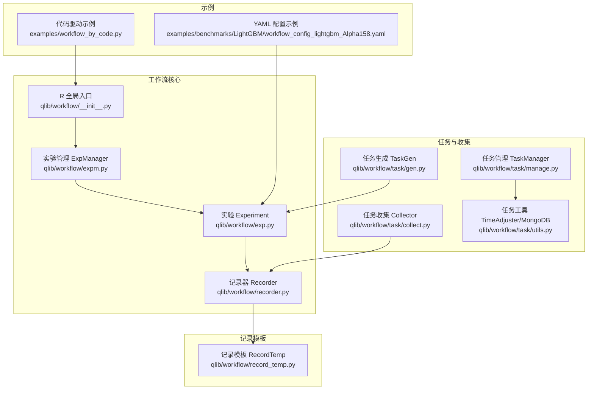
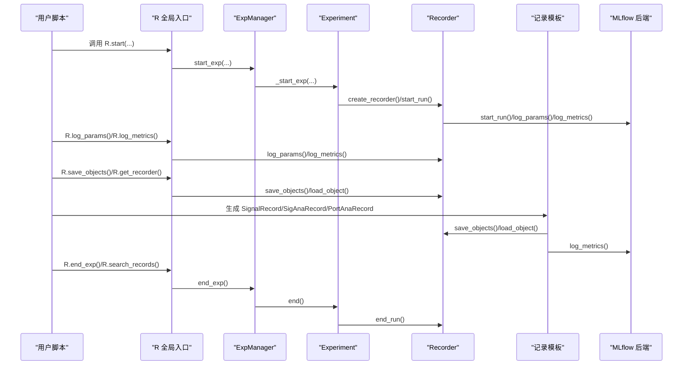
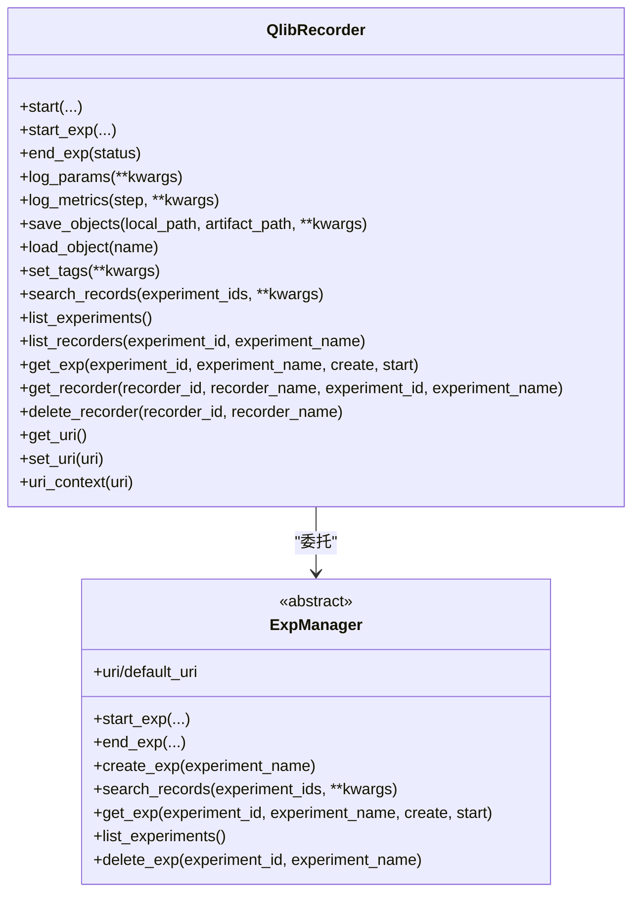
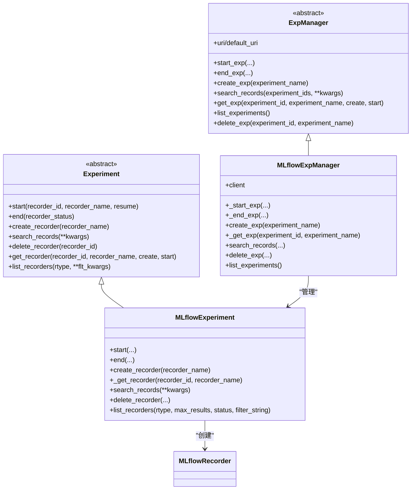
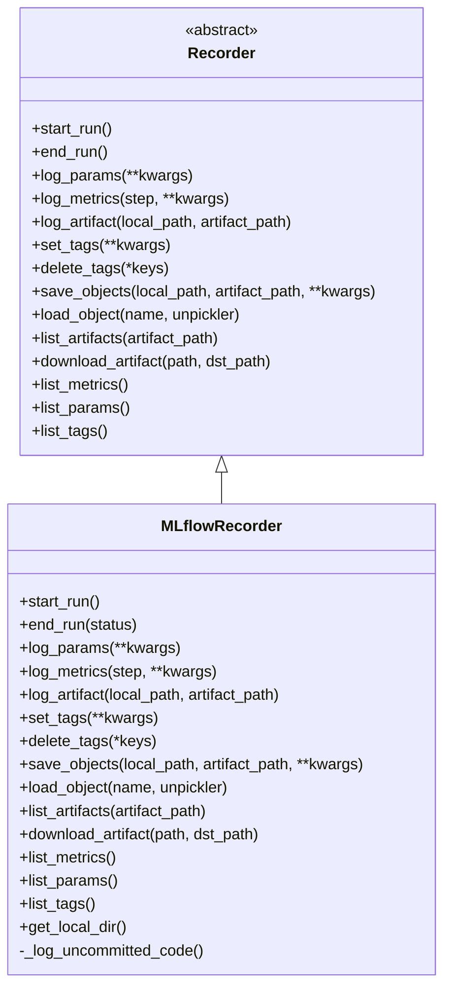
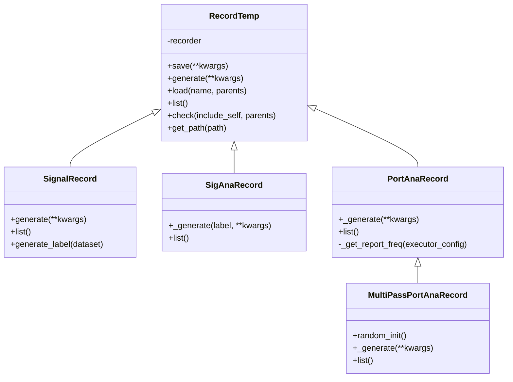
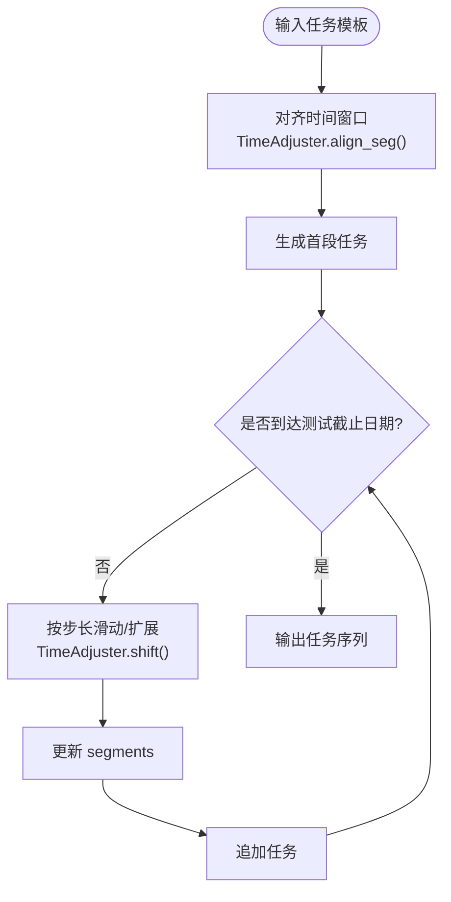
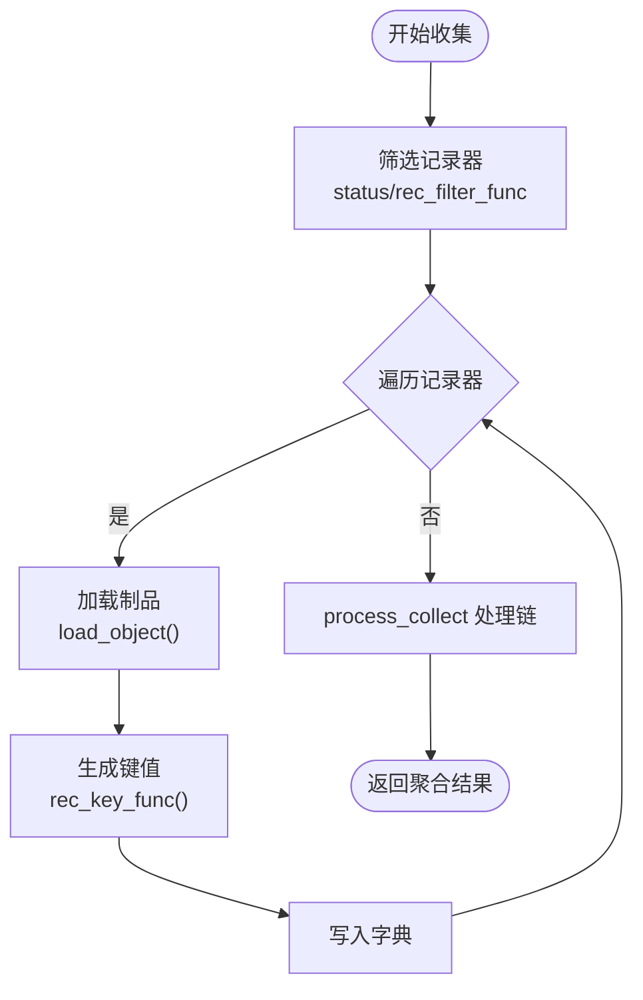
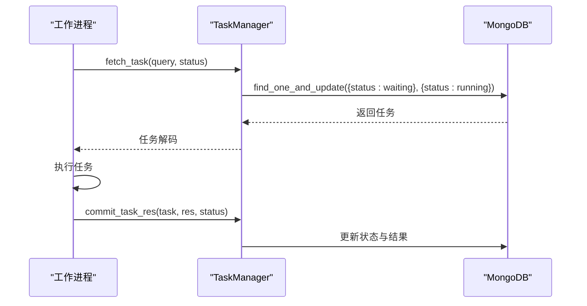
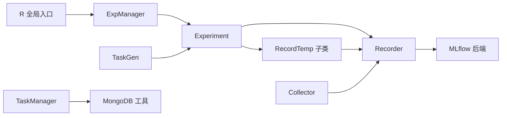

# 工作流管理

<cite>
**本文引用的文件列表**
- [qlib/workflow/recorder.py](file://qlib/workflow/recorder.py)
- [qlib/workflow/expm.py](file://qlib/workflow/expm.py)
- [qlib/workflow/exp.py](file://qlib/workflow/exp.py)
- [qlib/workflow/__init__.py](file://qlib/workflow/__init__.py)
- [qlib/workflow/utils.py](file://qlib/workflow/utils.py)
- [qlib/workflow/record_temp.py](file://qlib/workflow/record_temp.py)
- [qlib/workflow/task/collect.py](file://qlib/workflow/task/collect.py)
- [qlib/workflow/task/gen.py](file://qlib/workflow/task/gen.py)
- [qlib/workflow/task/manage.py](file://qlib/workflow/task/manage.py)
- [qlib/workflow/task/utils.py](file://qlib/workflow/task/utils.py)
- [examples/workflow_by_code.py](file://examples/workflow_by_code.py)
- [examples/benchmarks/LightGBM/workflow_config_lightgbm_Alpha158.yaml](file://examples/benchmarks/LightGBM/workflow_config_lightgbm_Alpha158.yaml)
</cite>

## 目录
1. [简介](#简介)
2. [项目结构](#项目结构)
3. [核心组件](#核心组件)
4. [架构总览](#架构总览)
5. [详细组件分析](#详细组件分析)
6. [依赖关系分析](#依赖关系分析)
7. [性能考量](#性能考量)
8. [故障排查指南](#故障排查指南)
9. [结论](#结论)
10. [附录](#附录)

## 简介
本文件系统性地文档化 Qlib 的工作流管理系统，覆盖“配置驱动”和“代码驱动”两类模式，解释实验记录器（Recorder）如何捕获与存储模型训练与回测的完整元数据，如何通过 YAML 配置文件定义复杂的工作流管道，以及如何通过 Python API（如 R.start()、R.log_params()、R.save_objects() 等）实现动态工作流控制。同时介绍实验管理（expm.py）、任务收集（collect.py）与任务生成/调度（gen.py、manage.py、task/utils.py）在大规模实验组织与分析中的作用。

## 项目结构
工作流相关模块主要位于 qlib/workflow 及其子目录中，配合 examples 中的 YAML 示例与代码示例，形成完整的“配置驱动 + 代码驱动”的研究工作流体系。

图表来源
- [qlib/workflow/__init__.py](file://qlib/workflow/__init__.py#L1-L200)
- [qlib/workflow/expm.py](file://qlib/workflow/expm.py#L1-L120)
- [qlib/workflow/exp.py](file://qlib/workflow/exp.py#L1-L120)
- [qlib/workflow/recorder.py](file://qlib/workflow/recorder.py#L1-L120)
- [qlib/workflow/record_temp.py](file://qlib/workflow/record_temp.py#L1-L120)
- [qlib/workflow/task/gen.py](file://qlib/workflow/task/gen.py#L1-L120)
- [qlib/workflow/task/collect.py](file://qlib/workflow/task/collect.py#L1-L120)
- [qlib/workflow/task/manage.py](file://qlib/workflow/task/manage.py#L1-L120)
- [qlib/workflow/task/utils.py](file://qlib/workflow/task/utils.py#L1-L120)
- [examples/benchmarks/LightGBM/workflow_config_lightgbm_Alpha158.yaml](file://examples/benchmarks/LightGBM/workflow_config_lightgbm_Alpha158.yaml#L1-L72)
- [examples/workflow_by_code.py](file://examples/workflow_by_code.py#L1-L86)

章节来源
- [qlib/workflow/recorder.py](file://qlib/workflow/recorder.py#L1-L120)
- [qlib/workflow/expm.py](file://qlib/workflow/expm.py#L1-L120)
- [qlib/workflow/exp.py](file://qlib/workflow/exp.py#L1-L120)
- [qlib/workflow/__init__.py](file://qlib/workflow/__init__.py#L1-L200)
- [qlib/workflow/record_temp.py](file://qlib/workflow/record_temp.py#L1-L120)
- [qlib/workflow/task/gen.py](file://qlib/workflow/task/gen.py#L1-L120)
- [qlib/workflow/task/collect.py](file://qlib/workflow/task/collect.py#L1-L120)
- [qlib/workflow/task/manage.py](file://qlib/workflow/task/manage.py#L1-L120)
- [qlib/workflow/task/utils.py](file://qlib/workflow/task/utils.py#L1-L120)
- [examples/benchmarks/LightGBM/workflow_config_lightgbm_Alpha158.yaml](file://examples/benchmarks/LightGBM/workflow_config_lightgbm_Alpha158.yaml#L1-L72)
- [examples/workflow_by_code.py](file://examples/workflow_by_code.py#L1-L86)

## 核心组件
- 全局入口 R：提供统一的上下文管理器 R.start(...)、参数/指标/对象存取接口、实验与记录器查询与删除等能力。
- 实验管理 ExpManager：负责实验的创建、激活、搜索记录、列出实验等；提供 MLflowExpManager 实现。
- 实验 Experiment：封装一次实验的生命周期，负责记录器的创建、启动、结束、查询与删除。
- 记录器 Recorder：抽象记录器接口，提供参数、指标、标签、对象存取、制品下载等能力；提供 MLflowRecorder 实现。
- 记录模板 RecordTemp：面向信号预测、信号分析、组合分析等结果的生成与保存，自动处理依赖关系与路径。
- 任务生成 TaskGen：滚动、多时序窗口等任务模板生成器，辅助构建大规模实验任务集。
- 任务收集 Collector：从多个记录器聚合产物，支持合并、分组、集成等处理流程。
- 任务管理 TaskManager：基于 MongoDB 的任务池管理，支持并发、去重、状态机、优先级与等待机制。
- 任务工具 TimeAdjuster：时间对齐、截断、滑动/扩展窗口等工具，保证实验时间窗口一致性与避免未来信息泄露。

章节来源
- [qlib/workflow/__init__.py](file://qlib/workflow/__init__.py#L1-L200)
- [qlib/workflow/expm.py](file://qlib/workflow/expm.py#L1-L200)
- [qlib/workflow/exp.py](file://qlib/workflow/exp.py#L1-L200)
- [qlib/workflow/recorder.py](file://qlib/workflow/recorder.py#L1-L200)
- [qlib/workflow/record_temp.py](file://qlib/workflow/record_temp.py#L1-L200)
- [qlib/workflow/task/gen.py](file://qlib/workflow/task/gen.py#L1-L200)
- [qlib/workflow/task/collect.py](file://qlib/workflow/task/collect.py#L1-L200)
- [qlib/workflow/task/manage.py](file://qlib/workflow/task/manage.py#L1-L200)
- [qlib/workflow/task/utils.py](file://qlib/workflow/task/utils.py#L1-L200)

## 架构总览
下图展示从用户调用到实验执行、记录与结果产出的整体流程，包括配置驱动与代码驱动两条主线。

图表来源
- [qlib/workflow/__init__.py](file://qlib/workflow/__init__.py#L1-L200)
- [qlib/workflow/expm.py](file://qlib/workflow/expm.py#L1-L200)
- [qlib/workflow/exp.py](file://qlib/workflow/exp.py#L1-L200)
- [qlib/workflow/recorder.py](file://qlib/workflow/recorder.py#L1-L200)
- [qlib/workflow/record_temp.py](file://qlib/workflow/record_temp.py#L1-L200)

## 详细组件分析

### 组件一：全局入口 R（Python API）
- 提供上下文管理器 R.start(...)，在 with 块内自动开始/结束实验与记录器，异常时自动标记失败。
- 提供 R.log_params、R.log_metrics、R.save_objects、R.load_object、R.set_tags、R.search_records、R.list_experiments、R.list_recorders、R.get_recorder、R.delete_recorder 等常用接口。
- 支持 URI 上下文切换与默认 URI 设置，便于多后端或多目录实验隔离。

图表来源
- [qlib/workflow/__init__.py](file://qlib/workflow/__init__.py#L1-L200)
- [qlib/workflow/expm.py](file://qlib/workflow/expm.py#L1-L200)

章节来源
- [qlib/workflow/__init__.py](file://qlib/workflow/__init__.py#L1-L200)

### 组件二：实验管理 ExpManager 与实验 Experiment
- ExpManager 抽象实验管理接口，MLflowExpManager 基于 MLflow 实现；支持活动实验与 URI 切换。
- Experiment 封装实验生命周期，负责记录器的创建、启动、结束与查询；MLflowExperiment 基于 MLflow 实现记录器检索与运行查询。

图表来源
- [qlib/workflow/expm.py](file://qlib/workflow/expm.py#L1-L200)
- [qlib/workflow/exp.py](file://qlib/workflow/exp.py#L1-L200)

章节来源
- [qlib/workflow/expm.py](file://qlib/workflow/expm.py#L1-L200)
- [qlib/workflow/exp.py](file://qlib/workflow/exp.py#L1-L200)

### 组件三：记录器 Recorder（含 MLflowRecorder）
- Recorder 定义统一接口：start_run/end_run、log_params/log_metrics/set_tags/delete_tags、save_objects/load_object、list_artifacts/download_artifact、list_metrics/list_params/list_tags。
- MLflowRecorder 基于 MLflow 实现，支持异步日志、自动记录未提交代码差异、参数/指标/标签/制品上传与下载、制品本地路径解析等。

图表来源
- [qlib/workflow/recorder.py](file://qlib/workflow/recorder.py#L1-L200)

章节来源
- [qlib/workflow/recorder.py](file://qlib/workflow/recorder.py#L1-L200)

### 组件四：记录模板 RecordTemp（信号/分析/组合分析）
- RecordTemp 抽象记录模板，提供 save/load/list/check 等通用接口；子类包括 SignalRecord、SigAnaRecord、PortAnaRecord、MultiPassPortAnaRecord 等。
- 自动处理依赖关系（如 PortAnaRecord 依赖 SignalRecord），支持自动检查前置产物是否存在，避免重复生成。

图表来源
- [qlib/workflow/record_temp.py](file://qlib/workflow/record_temp.py#L1-L200)

章节来源
- [qlib/workflow/record_temp.py](file://qlib/workflow/record_temp.py#L1-L200)

### 组件五：任务生成 TaskGen（滚动/多时序）
- TaskGen 抽象任务生成器；RollingGen 支持滑动/扩展窗口滚动生成任务；MultiHorizonGenBase 支持多预测时序窗口生成。
- 结合 TimeAdjuster 对齐交易日历、截断避免未来信息泄露、调整 segments。

图表来源
- [qlib/workflow/task/gen.py](file://qlib/workflow/task/gen.py#L1-L200)
- [qlib/workflow/task/utils.py](file://qlib/workflow/task/utils.py#L1-L200)

章节来源
- [qlib/workflow/task/gen.py](file://qlib/workflow/task/gen.py#L1-L200)
- [qlib/workflow/task/utils.py](file://qlib/workflow/task/utils.py#L1-L200)

### 组件六：任务收集 Collector（聚合/处理）
- Collector 抽象收集器；MergeCollector 支持多收集器结果合并；RecorderCollector 从实验中筛选记录器并加载制品，支持过滤器与状态筛选。
- 支持对收集结果进行链式处理（process_list）。

图表来源
- [qlib/workflow/task/collect.py](file://qlib/workflow/task/collect.py#L1-L200)

章节来源
- [qlib/workflow/task/collect.py](file://qlib/workflow/task/collect.py#L1-L200)

### 组件七：任务管理 TaskManager（MongoDB）
- 基于 MongoDB 的任务池，支持任务定义入库、去重、并发安全获取、状态机（waiting/running/part_done/done）、优先级、统计与等待。
- 提供命令行工具与 run_task 辅助函数，简化分布式执行。

图表来源
- [qlib/workflow/task/manage.py](file://qlib/workflow/task/manage.py#L1-L200)
- [qlib/workflow/task/utils.py](file://qlib/workflow/task/utils.py#L1-L120)

章节来源
- [qlib/workflow/task/manage.py](file://qlib/workflow/task/manage.py#L1-L200)
- [qlib/workflow/task/utils.py](file://qlib/workflow/task/utils.py#L1-L120)

## 依赖关系分析
- R 作为门面，委托给 ExpManager；ExpManager 再委托给 Experiment；Experiment 创建并管理 Recorder；Recorder 与 MLflow 后端交互。
- 记录模板 RecordTemp 依赖 Recorder 进行制品保存与读取，并通过依赖类字段声明依赖关系。
- 任务生成与收集模块独立于实验管理，但可与 Experiment/Recorder 协同使用；任务管理模块依赖 MongoDB。
- 示例代码与 YAML 配置分别体现“代码驱动”和“配置驱动”的两种工作流入口。

图表来源
- [qlib/workflow/__init__.py](file://qlib/workflow/__init__.py#L1-L200)
- [qlib/workflow/expm.py](file://qlib/workflow/expm.py#L1-L200)
- [qlib/workflow/exp.py](file://qlib/workflow/exp.py#L1-L200)
- [qlib/workflow/recorder.py](file://qlib/workflow/recorder.py#L1-L200)
- [qlib/workflow/record_temp.py](file://qlib/workflow/record_temp.py#L1-L200)
- [qlib/workflow/task/gen.py](file://qlib/workflow/task/gen.py#L1-L200)
- [qlib/workflow/task/collect.py](file://qlib/workflow/task/collect.py#L1-L200)
- [qlib/workflow/task/manage.py](file://qlib/workflow/task/manage.py#L1-L200)
- [qlib/workflow/task/utils.py](file://qlib/workflow/task/utils.py#L1-L200)

章节来源
- [qlib/workflow/__init__.py](file://qlib/workflow/__init__.py#L1-L200)
- [qlib/workflow/expm.py](file://qlib/workflow/expm.py#L1-L200)
- [qlib/workflow/exp.py](file://qlib/workflow/exp.py#L1-L200)
- [qlib/workflow/recorder.py](file://qlib/workflow/recorder.py#L1-L200)
- [qlib/workflow/record_temp.py](file://qlib/workflow/record_temp.py#L1-L200)
- [qlib/workflow/task/gen.py](file://qlib/workflow/task/gen.py#L1-L200)
- [qlib/workflow/task/collect.py](file://qlib/workflow/task/collect.py#L1-L200)
- [qlib/workflow/task/manage.py](file://qlib/workflow/task/manage.py#L1-L200)
- [qlib/workflow/task/utils.py](file://qlib/workflow/task/utils.py#L1-L200)

## 性能考量
- 异步日志：MLflowRecorder 使用异步调用减少阻塞，但需注意结束时等待队列完成，避免 MLflow 报错。
- 文件锁与并发：ExpManager 在本地文件后端使用文件锁避免并发创建实验冲突；远程后端（如 HTTP）采用二次校验避免冲突。
- 时间对齐与截断：TimeAdjuster 保证滚动/多时序任务的时间窗口与交易日历一致，避免未来信息泄露导致的无效计算。
- 任务池并发：TaskManager 使用 find_one_and_update 原子更新任务状态，结合优先级排序，确保任务公平分配与高吞吐。

章节来源
- [qlib/workflow/recorder.py](file://qlib/workflow/recorder.py#L340-L420)
- [qlib/workflow/expm.py](file://qlib/workflow/expm.py#L230-L260)
- [qlib/workflow/task/utils.py](file://qlib/workflow/task/utils.py#L1-L120)
- [qlib/workflow/task/manage.py](file://qlib/workflow/task/manage.py#L260-L340)

## 故障排查指南
- 异常自动收尾：utils.experiment_exit_handler 注册 atexit 与异常钩子，在非正常退出时自动结束实验并标记为失败。
- 记录器初始化冲突：当已存在活动实验时，禁止重新初始化 Qlib，避免实验存储位置被修改。
- 记录器对象加载失败：load_object 捕获 LoadObjectError 并抛出更明确的错误类型，便于定位制品缺失或格式问题。
- 任务池异常恢复：TaskManager.safe_fetch_task 在异常时自动归还任务，避免任务悬挂；reset_waiting 可将意外中断的任务重置为等待状态。

章节来源
- [qlib/workflow/utils.py](file://qlib/workflow/utils.py#L1-L48)
- [qlib/workflow/__init__.py](file://qlib/workflow/__init__.py#L650-L682)
- [qlib/workflow/recorder.py](file://qlib/workflow/recorder.py#L410-L460)
- [qlib/workflow/task/manage.py](file://qlib/workflow/task/manage.py#L280-L340)

## 结论
Qlib 的工作流管理以“配置驱动 + 代码驱动”双轨并行：YAML 配置文件用于快速定义模型、数据集、记录模板与回测策略；Python API（R.*）则提供灵活的动态控制与实验编排能力。通过 Recorder/Experiment/ExpManager 的分层设计，结合 RecordTemp 的结果模板化产出与 Collector 的聚合处理，能够高效支撑大规模实验的组织、执行与分析。任务生成与任务管理模块进一步完善了从任务设计到分布式执行的全链路能力。

## 附录

### 配置驱动示例：YAML 工作流管道
- 示例文件展示了如何通过 YAML 定义 qlib_init、市场/基准、数据处理器、回测配置、模型与数据集、以及记录模板（SignalRecord、SigAnaRecord、PortAnaRecord）。
- 用户可通过 qrun 命令直接运行该 YAML，实现端到端的训练、分析与回测。

章节来源
- [examples/benchmarks/LightGBM/workflow_config_lightgbm_Alpha158.yaml](file://examples/benchmarks/LightGBM/workflow_config_lightgbm_Alpha158.yaml#L1-L72)

### 代码驱动示例：Python API 控制工作流
- 示例脚本演示了如何通过 R.start(...) 开启实验，记录参数与指标，保存模型对象，生成信号、信号分析与组合分析报告，并进行回测。
- 展示了 R.log_params、R.save_objects、R.get_recorder、R.end_exp 等 API 的典型用法。

章节来源
- [examples/workflow_by_code.py](file://examples/workflow_by_code.py#L1-L86)