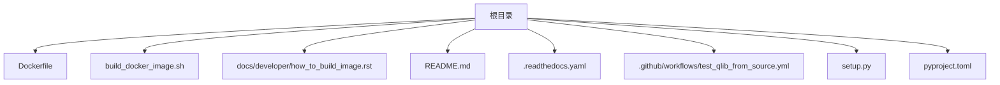
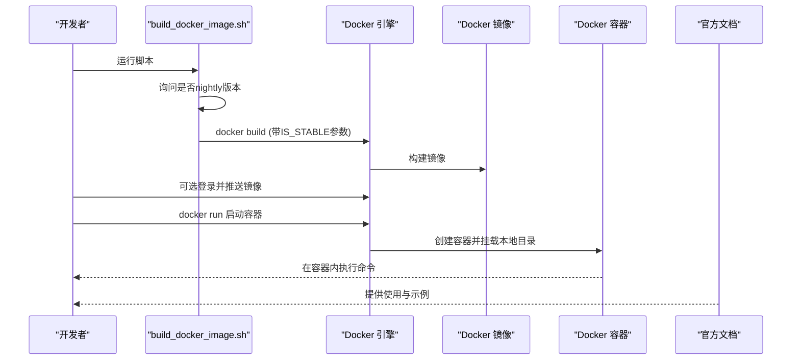
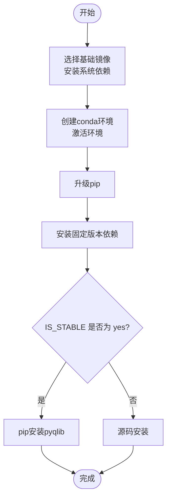
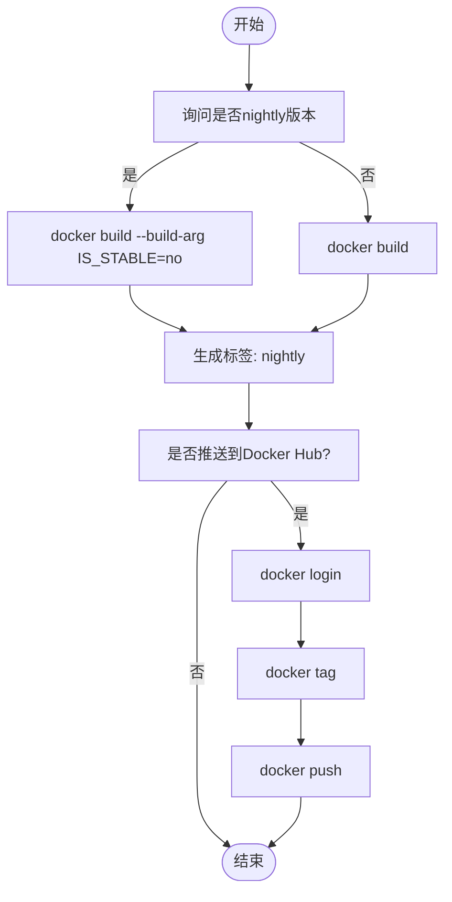
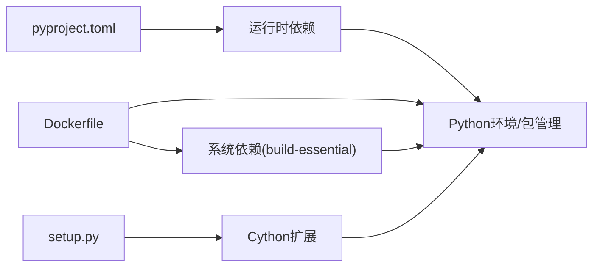

# Docker镜像构建

<cite>
**本文引用的文件列表**
- [Dockerfile](file://Dockerfile)
- [build_docker_image.sh](file://build_docker_image.sh)
- [docs/developer/how_to_build_image.rst](file://docs/developer/how_to_build_image.rst)
- [README.md](file://README.md)
- [.readthedocs.yaml](file://.readthedocs.yaml)
- [.github/workflows/test_qlib_from_source.yml](file://.github/workflows/test_qlib_from_source.yml)
- [setup.py](file://setup.py)
- [pyproject.toml](file://pyproject.toml)
</cite>

## 目录
1. [简介](#简介)
2. [项目结构](#项目结构)
3. [核心组件](#核心组件)
4. [架构总览](#架构总览)
5. [详细组件分析](#详细组件分析)
6. [依赖关系分析](#依赖关系分析)
7. [性能考量](#性能考量)
8. [故障排查指南](#故障排查指南)
9. [结论](#结论)
10. [附录](#附录)

## 简介
本指南面向需要基于仓库中的Dockerfile与build_docker_image.sh脚本进行Docker镜像构建的用户，覆盖基础镜像选择、系统依赖安装、Python环境与包管理器配置、工作目录与入口点说明，并提供构建、测试与推送的完整流程建议，以及在CI/CD或生产部署场景下的最佳实践与常见问题诊断方法。读者无需深入的容器知识即可完成镜像构建与使用。

## 项目结构
与Docker镜像构建直接相关的文件集中在根目录：
- Dockerfile：定义镜像构建步骤、基础镜像、工作目录、依赖安装与版本选择逻辑
- build_docker_image.sh：自动化构建脚本，支持稳定版与夜间版切换、可选推送至Docker Hub
- 文档：docs/developer/how_to_build_image.rst 提供官方构建说明与使用示例
- README.md：包含官方镜像拉取与容器运行示例
- 其他辅助文件：.readthedocs.yaml（文档构建环境）、.github/workflows/test_qlib_from_source.yml（源码测试工作流，可作为构建参考）

图表来源
- [Dockerfile](file://Dockerfile#L1-L32)
- [build_docker_image.sh](file://build_docker_image.sh#L1-L32)
- [docs/developer/how_to_build_image.rst](file://docs/developer/how_to_build_image.rst#L1-L82)
- [README.md](file://README.md#L320-L350)
- [.readthedocs.yaml](file://.readthedocs.yaml#L1-L27)
- [.github/workflows/test_qlib_from_source.yml](file://.github/workflows/test_qlib_from_source.yml#L1-L129)
- [setup.py](file://setup.py#L1-L26)
- [pyproject.toml](file://pyproject.toml#L1-L125)

章节来源
- [Dockerfile](file://Dockerfile#L1-L32)
- [build_docker_image.sh](file://build_docker_image.sh#L1-L32)
- [docs/developer/how_to_build_image.rst](file://docs/developer/how_to_build_image.rst#L1-L82)
- [README.md](file://README.md#L320-L350)
- [.readthedocs.yaml](file://.readthedocs.yaml#L1-L27)
- [.github/workflows/test_qlib_from_source.yml](file://.github/workflows/test_qlib_from_source.yml#L1-L129)
- [setup.py](file://setup.py#L1-L26)
- [pyproject.toml](file://pyproject.toml#L1-L125)

## 核心组件
- 基础镜像与系统依赖
  - 使用continuumio/miniconda3作为基础镜像，便于后续创建隔离的Python环境
  - 安装build-essential以满足编译C/Cython扩展所需的工具链
- Python环境与包管理
  - 创建名为qlib_env的conda环境并激活
  - 升级pip后安装固定版本的NumPy、Pandas、Scikit-learn等核心库
  - 安装Cython、pybind11、cvxpy等用于加速计算与优化的扩展
- 版本选择与安装方式
  - 通过构建参数IS_STABLE控制安装路径：稳定版使用pip安装pyqlib；夜间版使用当前源码安装
- 工作目录与入口点
  - 设置工作目录为/qlib
  - 当前Dockerfile未显式声明ENTRYPOINT或CMD，容器启动后默认进入shell

章节来源
- [Dockerfile](file://Dockerfile#L1-L32)
- [pyproject.toml](file://pyproject.toml#L1-L125)
- [setup.py](file://setup.py#L1-L26)

## 架构总览
下图展示了从源码到镜像再到容器运行的整体流程，以及脚本与文档对构建过程的补充说明。

图表来源
- [build_docker_image.sh](file://build_docker_image.sh#L1-L32)
- [Dockerfile](file://Dockerfile#L1-L32)
- [docs/developer/how_to_build_image.rst](file://docs/developer/how_to_build_image.rst#L1-L82)
- [README.md](file://README.md#L320-L350)

## 详细组件分析

### 组件A：Dockerfile解析
- 基础镜像与工作目录
  - 基于continuumio/miniconda3:latest，便于后续conda环境管理
  - WORKDIR /qlib设置工作目录
- 依赖安装
  - 更新apt并安装build-essential，确保C/Cython扩展编译可用
  - 创建conda环境qlib_env并将其加入PATH
  - 升级pip后安装固定版本的核心库与扩展
- 版本选择逻辑
  - ARG IS_STABLE="yes"定义构建参数
  - IF分支根据IS_STABLE值选择pip安装pyqlib或源码安装
- 入口点与交互
  - 未显式设置ENTRYPOINT/CMD，容器启动后默认交互式shell

图表来源
- [Dockerfile](file://Dockerfile#L1-L32)

章节来源
- [Dockerfile](file://Dockerfile#L1-L32)

### 组件B：build_docker_image.sh自动化脚本
- 功能概述
  - 交互式询问是否构建nightly版本，默认稳定版
  - 自动执行docker build并生成stable或nightly标签
  - 可选登录Docker Hub并推送镜像（需先在脚本中填写docker_user）
- 使用建议
  - 在CI环境中可配合--build-arg传递IS_STABLE参数，避免交互
  - 推送前确保已登录Docker Hub

图表来源
- [build_docker_image.sh](file://build_docker_image.sh#L1-L32)

章节来源
- [build_docker_image.sh](file://build_docker_image.sh#L1-L32)

### 组件C：官方文档与使用示例
- 官方文档
  - docs/developer/how_to_build_image.rst提供两种构建方式与自动构建脚本说明
- 使用示例
  - README.md提供官方镜像拉取与容器运行示例，便于快速验证

章节来源
- [docs/developer/how_to_build_image.rst](file://docs/developer/how_to_build_image.rst#L1-L82)
- [README.md](file://README.md#L320-L350)

## 依赖关系分析
- Python与包管理
  - pyproject.toml定义了项目依赖与构建后端（setuptools、Cython、NumPy等），Dockerfile中通过pip安装固定版本依赖，二者共同保证运行时一致性
- 源码扩展
  - setup.py定义了Cython扩展模块，Dockerfile中安装Cython与NumPy头文件以支持编译
- 文档与CI参考
  - .readthedocs.yaml与.test_qlib_from_source.yml展示了项目在不同平台上的构建与测试策略，可用于对比镜像构建环境

图表来源
- [pyproject.toml](file://pyproject.toml#L1-L125)
- [setup.py](file://setup.py#L1-L26)
- [Dockerfile](file://Dockerfile#L1-L32)

章节来源
- [pyproject.toml](file://pyproject.toml#L1-L125)
- [setup.py](file://setup.py#L1-L26)
- [Dockerfile](file://Dockerfile#L1-L32)

## 性能考量
- 构建阶段
  - 固定版本依赖可减少构建不确定性，提高可重复性
  - 将C/Cython依赖安装放在conda环境内，有助于避免系统级冲突
- 运行阶段
  - 容器内默认交互式shell，适合开发与调试；生产部署建议明确ENTRYPOINT/CMD以实现无交互运行
- CI/CD集成
  - 可参考项目现有CI工作流，按需在流水线中添加镜像构建与推送步骤，确保跨平台兼容性

[本节为通用建议，不直接分析具体文件]

## 故障排查指南
- 构建失败（系统依赖缺失）
  - 现象：编译C/Cython扩展时报错
  - 排查：确认已安装build-essential；检查Dockerfile中apt更新与安装步骤是否成功
  - 参考：Dockerfile中系统依赖安装与conda环境创建步骤
- 构建失败（Python版本或包冲突）
  - 现象：pip安装失败或版本不匹配
  - 排查：核对pyproject.toml与Dockerfile中的依赖版本；必要时调整固定版本
  - 参考：pyproject.toml中的依赖与构建后端配置
- 构建失败（源码安装异常）
  - 现象：nightly版本源码安装失败
  - 排查：确认源码可读性与权限；检查Dockerfile中ARG IS_STABLE逻辑
  - 参考：Dockerfile中的版本选择分支
- 容器无法启动或交互异常
  - 现象：容器启动后无入口点
  - 排查：当前Dockerfile未设置ENTRYPOINT/CMD，容器默认交互式shell；如需自动化运行，可在镜像中显式设置
  - 参考：Dockerfile工作目录与环境变量设置
- 推送失败（Docker Hub认证）
  - 现象：docker login或docker push报错
  - 排查：确保已正确填写docker_user；先docker login再执行tag与push
  - 参考：build_docker_image.sh中的推送流程

章节来源
- [Dockerfile](file://Dockerfile#L1-L32)
- [pyproject.toml](file://pyproject.toml#L1-L125)
- [build_docker_image.sh](file://build_docker_image.sh#L1-L32)

## 结论
本指南基于仓库中的Dockerfile与build_docker_image.sh，给出了从基础镜像选择、系统与Python依赖安装、版本控制到容器运行与推送的完整流程。结合官方文档与README示例，用户可在本地或CI/CD中快速构建并使用QLIB镜像，同时具备完善的故障排查路径以应对常见问题。

[本节为总结性内容，不直接分析具体文件]

## 附录

### A. 构建与使用步骤清单
- 本地构建
  - 稳定版：docker build -t <镜像名> -f ./Dockerfile .
  - 夜间版：docker build --build-arg IS_STABLE=no -t <镜像名> -f ./Dockerfile .
- 自动化脚本
  - sh build_docker_image.sh，按提示选择nightly与是否推送
- 容器运行
  - docker run -it --name <容器名> -v <本地目录>:/app <镜像名>
  - 在容器内执行示例命令与数据准备脚本

章节来源
- [docs/developer/how_to_build_image.rst](file://docs/developer/how_to_build_image.rst#L1-L82)
- [README.md](file://README.md#L320-L350)
- [build_docker_image.sh](file://build_docker_image.sh#L1-L32)
- [Dockerfile](file://Dockerfile#L1-L32)

### B. CI/CD集成建议
- 在CI中使用build_docker_image.sh或直接调用docker build
- 为nightly与stable分别打标签并推送至镜像仓库
- 可参考项目现有CI工作流，确保多平台兼容性与缓存利用

章节来源
- [.github/workflows/test_qlib_from_source.yml](file://.github/workflows/test_qlib_from_source.yml#L1-L129)
- [build_docker_image.sh](file://build_docker_image.sh#L1-L32)