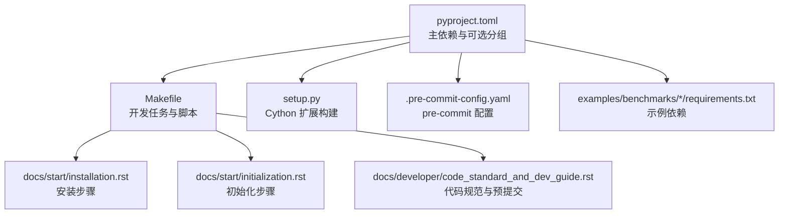
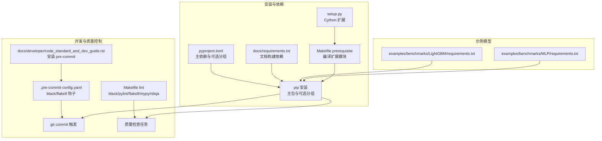
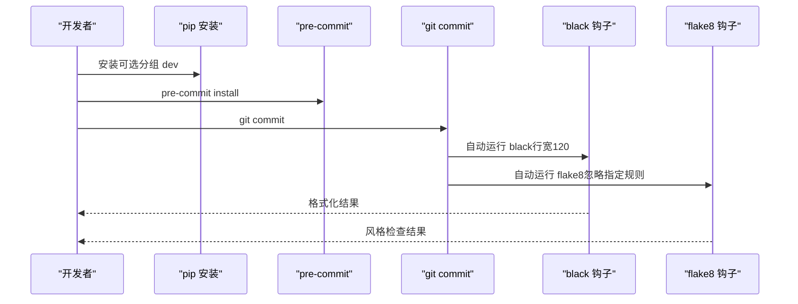
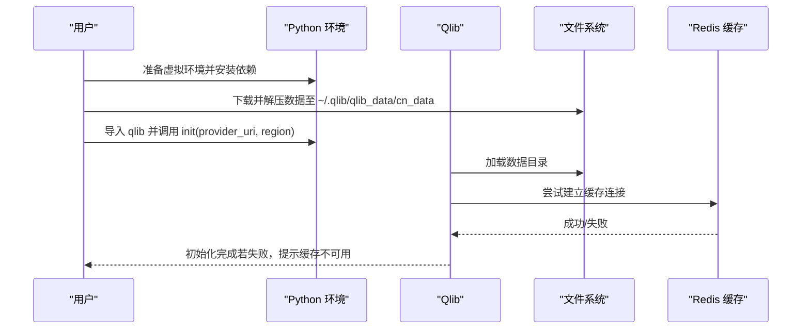
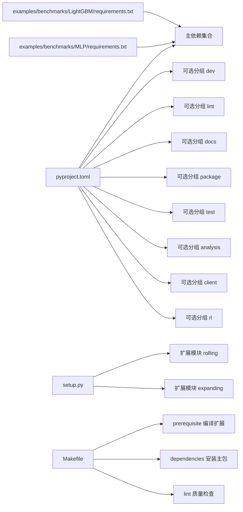

# 开发环境搭建

<cite>
**本文引用的文件列表**
- [README.md](file://README.md)
- [pyproject.toml](file://pyproject.toml)
- [setup.py](file://setup.py)
- [.pre-commit-config.yaml](file://.pre-commit-config.yaml)
- [Makefile](file://Makefile)
- [docs/start/installation.rst](file://docs/start/installation.rst)
- [docs/start/initialization.rst](file://docs/start/initialization.rst)
- [docs/developer/code_standard_and_dev_guide.rst](file://docs/developer/code_standard_and_dev_guide.rst)
- [examples/benchmarks/LightGBM/requirements.txt](file://examples/benchmarks/LightGBM/requirements.txt)
- [examples/benchmarks/MLP/requirements.txt](file://examples/benchmarks/MLP/requirements.txt)
- [docs/requirements.txt](file://docs/requirements.txt)
</cite>

## 目录
1. [简介](#简介)
2. [项目结构与入口](#项目结构与入口)
3. [核心组件与依赖关系](#核心组件与依赖关系)
4. [架构总览](#架构总览)
5. [详细组件解析](#详细组件解析)
6. [依赖关系分析](#依赖关系分析)
7. [性能与构建特性](#性能与构建特性)
8. [故障排查指南](#故障排查指南)
9. [结论](#结论)
10. [附录](#附录)

## 简介
本指南面向希望在本地搭建 Qlib 开发环境的开发者，覆盖以下内容：
- 使用 Python 虚拟环境隔离开发依赖
- 基于 pyproject.toml 的依赖安装与可选功能选择
- 预提交钩子（pre-commit）的安装与使用
- 代码格式化工具（black、flake8）的配置与使用
- 常见环境问题排查（依赖冲突、编译错误）
- 正确初始化 Qlib 并连接测试数据源

## 项目结构与入口
- 核心安装与依赖声明位于 pyproject.toml，其中定义了主依赖、可选分组（dev、lint、docs、package、test、analysis、client、rl）以及脚本入口。
- 构建扩展模块（Cython）通过 setup.py 完成，Makefile 提供便捷的开发任务（prerequisite、dependencies、lint、docs、test、analysis、client、all、install、dev 等）。
- 文档与开发指南位于 docs/，包含安装、初始化、代码规范等说明。
- 示例模型的依赖位于 examples/benchmarks/*/requirements.txt，便于按需安装特定模型所需的额外依赖。

图表来源
- [pyproject.toml](file://pyproject.toml#L1-L125)
- [Makefile](file://Makefile#L1-L213)
- [setup.py](file://setup.py#L1-L26)
- [docs/start/installation.rst](file://docs/start/installation.rst#L1-L47)
- [docs/start/initialization.rst](file://docs/start/initialization.rst#L1-L98)
- [docs/developer/code_standard_and_dev_guide.rst](file://docs/developer/code_standard_and_dev_guide.rst#L1-L63)
- [.pre-commit-config.yaml](file://.pre-commit-config.yaml#L1-L13)
- [examples/benchmarks/LightGBM/requirements.txt](file://examples/benchmarks/LightGBM/requirements.txt#L1-L4)
- [examples/benchmarks/MLP/requirements.txt](file://examples/benchmarks/MLP/requirements.txt#L1-L5)

章节来源
- [pyproject.toml](file://pyproject.toml#L1-L125)
- [Makefile](file://Makefile#L1-L213)
- [setup.py](file://setup.py#L1-L26)
- [docs/start/installation.rst](file://docs/start/installation.rst#L1-L47)
- [docs/start/initialization.rst](file://docs/start/initialization.rst#L1-L98)
- [docs/developer/code_standard_and_dev_guide.rst](file://docs/developer/code_standard_and_dev_guide.rst#L1-L63)
- [.pre-commit-config.yaml](file://.pre-commit-config.yaml#L1-L13)
- [examples/benchmarks/LightGBM/requirements.txt](file://examples/benchmarks/LightGBM/requirements.txt#L1-L4)
- [examples/benchmarks/MLP/requirements.txt](file://examples/benchmarks/MLP/requirements.txt#L1-L5)
- [docs/requirements.txt](file://docs/requirements.txt#L1-L9)

## 核心组件与依赖关系
- 主依赖（来自 pyproject.toml）包括 pandas、numpy、lightgbm、matplotlib、jupyter、pyarrow、pydantic-settings 等，满足数据处理、建模与可视化需求。
- 可选分组：
  - dev：pytest、statsmodels
  - rl：tianshou、torch，并限制 numpy<2.0.0
  - lint：black、pylint、mypy、flake8、nbqa
  - docs：sphinx、sphinx_rtd_theme、readthedocs_sphinx_ext、scipy<=1.15.3、snowballstemmer<3.0
  - package：twine、build
  - test：yahooquery、baostock
  - analysis：plotly、statsmodels
  - client：python-socketio<6、tables
- 构建扩展模块（Cython）：setup.py 定义了两个扩展模块（rolling、expanding），Makefile 的 prerequisite 目标负责编译这些模块。
- 预提交钩子：.pre-commit-config.yaml 指定 black 与 flake8 的检查规则；docs/developer/code_standard_and_dev_guide.rst 提供 pre-commit 安装与使用的说明。

章节来源
- [pyproject.toml](file://pyproject.toml#L1-L125)
- [setup.py](file://setup.py#L1-L26)
- [Makefile](file://Makefile#L1-L213)
- [.pre-commit-config.yaml](file://.pre-commit-config.yaml#L1-L13)
- [docs/developer/code_standard_and_dev_guide.rst](file://docs/developer/code_standard_and_dev_guide.rst#L1-L63)

## 架构总览
下图展示了从“安装与依赖”到“开发与质量控制”的整体流程，以及与“示例模型依赖”的关系。

图表来源
- [pyproject.toml](file://pyproject.toml#L1-L125)
- [setup.py](file://setup.py#L1-L26)
- [Makefile](file://Makefile#L1-L213)
- [.pre-commit-config.yaml](file://.pre-commit-config.yaml#L1-L13)
- [docs/developer/code_standard_and_dev_guide.rst](file://docs/developer/code_standard_and_dev_guide.rst#L1-L63)
- [examples/benchmarks/LightGBM/requirements.txt](file://examples/benchmarks/LightGBM/requirements.txt#L1-L4)
- [examples/benchmarks/MLP/requirements.txt](file://examples/benchmarks/MLP/requirements.txt#L1-L5)
- [docs/requirements.txt](file://docs/requirements.txt#L1-L9)

## 详细组件解析

### Python 虚拟环境配置
- 建议使用 Conda 或 venv 创建独立的 Python 3.8–3.12 虚拟环境，以避免系统级依赖冲突。
- 在虚拟环境中安装主包与可选分组，例如：
  - 开发模式：pip install -e ".[dev]"
  - 代码规范工具：pip install -e ".[lint]"
  - 文档构建：pip install -e ".[docs]"
  - 测试依赖：pip install -e ".[test]"
  - 分析报告：pip install -e ".[analysis]"
  - 客户端：pip install -e ".[client]"
  - RL 相关：pip install -e ".[rl]"（注意 numpy 版本限制）

章节来源
- [pyproject.toml](file://pyproject.toml#L1-L125)
- [Makefile](file://Makefile#L1-L213)
- [docs/developer/code_standard_and_dev_guide.rst](file://docs/developer/code_standard_and_dev_guide.rst#L1-L63)

### 依赖安装（基于 pyproject.toml）
- 主要步骤：
  - 安装 NumPy（必要）
  - 升级 Cython（必要，用于构建扩展模块）
  - 克隆仓库并安装主包（推荐开发模式：pip install -e .）
- 可选分组安装：
  - 开发：pip install -e ".[dev]"
  - 代码规范：pip install -e ".[lint]"
  - 文档：pip install -e ".[docs]"
  - 测试：pip install -e ".[test]"
  - 分析：pip install -e ".[analysis]"
  - 客户端：pip install -e ".[client]"
  - RL：pip install -e ".[rl]"（注意 numpy<2.0.0 的限制）

章节来源
- [README.md](file://README.md#L168-L209)
- [pyproject.toml](file://pyproject.toml#L1-L125)
- [Makefile](file://Makefile#L1-L213)

### 预提交钩子设置（pre-commit）
- 安装与启用：
  - 在开发环境中安装可选分组 dev（包含 pre-commit）
  - 运行 pre-commit install，使在 git commit 时自动触发 black 与 flake8 检查
- 钩子配置：
  - black：对 qlib 目录执行，行宽限制为 120
  - flake8：忽略部分常见规则，具体规则由 .pre-commit-config.yaml 指定
- 手动检查：
  - 可使用 Makefile 中的 lint 目标统一运行 black、pylint、flake8、mypy、nbqa

图表来源
- [.pre-commit-config.yaml](file://.pre-commit-config.yaml#L1-L13)
- [docs/developer/code_standard_and_dev_guide.rst](file://docs/developer/code_standard_and_dev_guide.rst#L1-L63)
- [Makefile](file://Makefile#L1-L213)

章节来源
- [.pre-commit-config.yaml](file://.pre-commit-config.yaml#L1-L13)
- [docs/developer/code_standard_and_dev_guide.rst](file://docs/developer/code_standard_and_dev_guide.rst#L1-L63)
- [Makefile](file://Makefile#L1-L213)

### 代码格式化工具配置（black、flake8）
- black：
  - 在 pre-commit 中默认对 qlib 目录执行，行宽 120
  - 可使用 Makefile 的 black 目标进行检查（不修改文件）
- flake8：
  - 在 pre-commit 中默认忽略若干规则，具体规则见 .pre-commit-config.yaml
  - 可使用 Makefile 的 flake8 目标进行检查
- 统一质量检查：
  - 使用 Makefile 的 lint 目标一次性运行 black、pylint、flake8、mypy、nbqa

章节来源
- [.pre-commit-config.yaml](file://.pre-commit-config.yaml#L1-L13)
- [Makefile](file://Makefile#L1-L213)
- [docs/developer/code_standard_and_dev_guide.rst](file://docs/developer/code_standard_and_dev_guide.rst#L1-L63)

### 初始化 Qlib 并连接测试数据源
- 初始化步骤：
  - 下载并准备数据（参考 README 的数据准备章节）
  - 在 Python 中调用 qlib.init，传入 provider_uri（指向已下载的数据目录）与 region（如 REG_CN）
- 注意事项：
  - 不要在仓库根目录导入 qlib 包，否则可能引发异常
  - region 必须与 provider_uri 中的数据一致（当前 get_data.py 仅提供中国股票市场数据）
  - 若无法连接 Redis，缓存机制将不可用，请确保 Redis 服务可用

图表来源
- [README.md](file://README.md#L212-L318)
- [docs/start/initialization.rst](file://docs/start/initialization.rst#L1-L98)

章节来源
- [README.md](file://README.md#L212-L318)
- [docs/start/initialization.rst](file://docs/start/initialization.rst#L1-L98)

## 依赖关系分析
- 主依赖与可选分组：
  - 主依赖：pandas、numpy、lightgbm、matplotlib、jupyter、pyarrow、pydantic-settings 等
  - 可选分组：dev、lint、docs、package、test、analysis、client、rl（含 numpy 版本限制）
- 构建链路：
  - setup.py 定义扩展模块，Makefile prerequisite 负责编译
  - pip 安装主包后，可按需安装可选分组
- 示例模型依赖：
  - LightGBM 示例：pandas==1.1.2、numpy==1.21.0、lightgbm
  - MLP 示例：pandas==1.1.2、numpy==1.21.0、scikit_learn==0.23.2、torch==1.7.0

图表来源
- [pyproject.toml](file://pyproject.toml#L1-L125)
- [setup.py](file://setup.py#L1-L26)
- [Makefile](file://Makefile#L1-L213)
- [examples/benchmarks/LightGBM/requirements.txt](file://examples/benchmarks/LightGBM/requirements.txt#L1-L4)
- [examples/benchmarks/MLP/requirements.txt](file://examples/benchmarks/MLP/requirements.txt#L1-L5)

章节来源
- [pyproject.toml](file://pyproject.toml#L1-L125)
- [setup.py](file://setup.py#L1-L26)
- [Makefile](file://Makefile#L1-L213)
- [examples/benchmarks/LightGBM/requirements.txt](file://examples/benchmarks/LightGBM/requirements.txt#L1-L4)
- [examples/benchmarks/MLP/requirements.txt](file://examples/benchmarks/MLP/requirements.txt#L1-L5)

## 性能与构建特性
- Cython 扩展模块：
  - 通过 setup.py 定义扩展模块（rolling、expanding），使用 numpy 头文件路径
  - Makefile 的 prerequisite 目标会检测是否已有 so 文件，若无则编译并放置到原位置
- Windows 特性：
  - Makefile 在 Windows 上优先安装二进制 pywinpty，避免本地编译带来的麻烦
- 文档构建：
  - docs/requirements.txt 提供文档构建所需依赖（Cython、cmake、numpy、scipy、sphinx_rtd_theme 等）
  - Makefile 的 docs-gen 目标使用 sphinx 构建文档

章节来源
- [setup.py](file://setup.py#L1-L26)
- [Makefile](file://Makefile#L1-L213)
- [docs/requirements.txt](file://docs/requirements.txt#L1-L9)

## 故障排查指南
- 依赖冲突与版本不兼容：
  - RL 分组依赖 torch，且要求 numpy<2.0.0；请在安装 rl 分组前确认虚拟环境中的 numpy 版本
  - 文档构建受限于 scipy<=1.15.3；安装 docs 分组时注意该版本限制
- 编译错误（Cython/扩展模块）：
  - 确保已安装 NumPy 与 Cython，并在执行安装前运行 Makefile 的 prerequisite 目标
  - Windows 上建议使用二进制 pywinpty，避免本地编译
- 数据连接问题：
  - 若无法连接 Redis，缓存机制将不可用；请检查 Redis 服务状态与网络连通性
  - 初始化时 provider_uri 与 region 必须与实际数据一致
- 预提交失败：
  - black 与 flake8 的规则由 .pre-commit-config.yaml 指定；可通过 Makefile 的 lint 目标先本地检查并修复
  - 若规则与团队约定不符，可在 pre-commit 配置中调整

章节来源
- [pyproject.toml](file://pyproject.toml#L1-L125)
- [Makefile](file://Makefile#L1-L213)
- [docs/start/initialization.rst](file://docs/start/initialization.rst#L1-L98)
- [.pre-commit-config.yaml](file://.pre-commit-config.yaml#L1-L13)

## 结论
通过以上步骤，开发者可以：
- 在隔离的虚拟环境中安装 Qlib 主包与可选分组
- 使用 pre-commit 钩子与 Makefile 的 lint 目标统一保证代码风格与质量
- 正确初始化 Qlib 并连接测试数据源
- 面对常见依赖冲突与编译问题时具备快速定位与解决能力

## 附录
- 常用 Makefile 任务速览：
  - prerequisite：编译扩展模块
  - dependencies：安装主包（开发模式）
  - develop：安装 dev 分组
  - lint：统一运行 black、pylint、flake8、mypy、nbqa
  - docs：安装 docs 分组
  - test：安装 test 分组
  - analysis：安装 analysis 分组
  - client：安装 client 分组
  - rl：安装 rl 分组
  - all：一次性安装多个分组
  - install/dev：组合 prerequisite 与 dependencies
  - docs-gen：使用 sphinx 构建文档

章节来源
- [Makefile](file://Makefile#L1-L213)