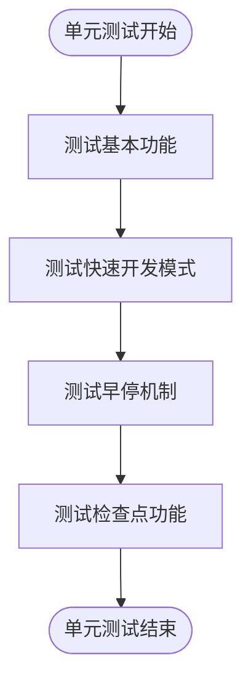

# 测试策略

<cite>
**本文档中引用的文件**  
- [conftest.py](file://tests/conftest.py)
- [pytest.ini](file://tests/pytest.ini)
- [test_all_pipeline.py](file://tests/test_all_pipeline.py)
- [test_workflow.py](file://tests/test_workflow.py)
- [test_trainer.py](file://tests/rl/test_trainer.py)
- [test_dataloader.py](file://tests/data_mid_layer_tests/test_dataloader.py)
- [test_general_nn.py](file://tests/model/test_general_nn.py)
- [__init__.py](file://qlib/tests/__init__.py)
- [config.py](file://qlib/tests/config.py)
- [data.py](file://qlib/tests/data.py)
</cite>

## 目录
1. [简介](#简介)
2. [测试架构与组织结构](#测试架构与组织结构)
3. [测试类型划分](#测试类型划分)
4. [测试运行方式](#测试运行方式)
5. [覆盖率要求](#覆盖率要求)
6. [新增测试用例编写规范](#新增测试用例编写规范)
7. [结论](#结论)

## 简介
QLIB项目采用pytest作为主要的测试框架，构建了一套完整的测试体系来确保代码质量和功能稳定性。本测试策略文档全面介绍项目的测试架构与策略，包括基于pytest框架的组织结构、测试类型划分、测试运行方式、覆盖率要求以及新增测试用例的编写规范。

**Section sources**
- [conftest.py](file://tests/conftest.py#L1-L11)
- [pytest.ini](file://tests/pytest.ini#L1-L7)

## 测试架构与组织结构
QLIB项目的测试架构基于pytest框架构建，测试代码主要位于`tests/`目录下，按照功能模块进行组织。项目通过`conftest.py`文件定义了全局的测试配置和fixtures，实现了测试环境的统一管理和配置。

测试目录结构清晰，按照功能划分为多个子目录：
- `backtest/`: 回测相关测试
- `data_mid_layer_tests/`: 数据中间层测试
- `dataset_tests/`: 数据集测试
- `dependency_tests/`: 依赖项测试
- `misc/`: 杂项测试
- `model/`: 模型测试
- `ops/`: 操作符测试
- `rl/`: 强化学习测试
- `rolling_tests/`: 滚动测试
- `storage_tests/`: 存储测试

项目通过`pytest.ini`文件配置了测试标记和警告过滤规则，其中定义了`slow`标记用于标识耗时较长的测试用例，可以通过`-m "not slow"`参数排除这些测试用例以加快测试执行速度。


**Diagram sources**
- [conftest.py](file://tests/conftest.py#L1-L11)
- [pytest.ini](file://tests/pytest.ini#L1-L7)

**Section sources**
- [conftest.py](file://tests/conftest.py#L1-L11)
- [pytest.ini](file://tests/pytest.ini#L1-L7)

## 测试类型划分
QLIB项目根据测试目的和范围将测试划分为不同的类型，包括端到端测试、集成测试和单元测试，每种测试类型都有其特定的职责和覆盖范围。

### 端到端测试
端到端测试是最高层次的测试，验证整个工作流程的正确性。`test_all_pipeline.py`文件中的`TestAllFlow`类实现了完整的端到端测试，涵盖了模型训练、回测分析和实验管理器测试三个阶段。

该测试通过`train()`函数验证模型训练流程，确保模型能够正确生成预测分数并计算IC和RIC指标；通过`backtest_analysis()`函数验证回测流程，确保能够正确生成投资组合分析结果；通过`fake_experiment()`函数验证实验管理器的功能，确保URI配置正确。


**Diagram sources**
- [test_all_pipeline.py](file://tests/test_all_pipeline.py#L147-L178)

**Section sources**
- [test_all_pipeline.py](file://tests/test_all_pipeline.py#L147-L178)

### 集成测试
集成测试验证多个组件协同工作的正确性。`test_workflow.py`文件中的`WorkflowTest`类实现了工作流相关的集成测试，主要验证记录器（Recorder）的功能。

该测试通过`test_get_local_dir()`方法验证记录器能够正确获取本地目录，确保实验数据能够正确存储和访问。测试使用了临时目录来避免对现有文件系统的干扰，并在测试结束后自动清理临时文件。


**Diagram sources**
- [test_workflow.py](file://tests/test_workflow.py#L20-L29)

**Section sources**
- [test_workflow.py](file://tests/test_workflow.py#L11-L30)

### 单元测试
单元测试验证单个函数或类的正确性。`test_trainer.py`文件中的测试用例展示了强化学习训练器的单元测试，通过模拟环境验证训练器的各项功能。

该测试使用了`ZeroSimulator`、`NoopStateInterpreter`等模拟类来隔离被测代码的依赖，确保测试的独立性和可重复性。测试覆盖了训练器的基本功能、快速开发运行模式、早停机制和检查点功能，确保训练器在各种配置下都能正常工作。



**Diagram sources**
- [test_trainer.py](file://tests/rl/test_trainer.py#L97-L203)

**Section sources**
- [test_trainer.py](file://tests/rl/test_trainer.py#L97-L203)

## 测试运行方式
QLIB项目提供了灵活的测试运行方式，支持运行全部测试套件或特定模块的测试用例，满足不同场景下的测试需求。

### 运行全部测试套件
要运行全部测试套件，可以使用以下命令：
```bash
pytest tests/
```
这将执行`tests/`目录下的所有测试用例。由于部分测试用例执行时间较长，项目通过`@pytest.mark.slow`标记来标识这些耗时测试，可以通过以下命令排除慢速测试以加快执行速度：
```bash
pytest tests/ -m "not slow"
```

### 运行特定模块测试
要运行特定模块的测试，可以直接指定模块路径。例如，要运行数据加载器的测试：
```bash
pytest tests/data_mid_layer_tests/test_dataloader.py
```
要运行强化学习训练器的测试：
```bash
pytest tests/rl/test_trainer.py
```

### 使用标记运行测试
项目定义了`slow`标记用于管理耗时测试。可以通过以下方式使用标记：
- 运行所有非慢速测试：`pytest tests/ -m "not slow"`
- 仅运行慢速测试：`pytest tests/ -m "slow"`

### 测试数据准备
部分测试用例需要准备测试数据。`qlib/tests/data.py`文件中的`GetData`类提供了下载和解压测试数据的功能。测试用例通常会继承`TestAutoData`类，该类在`setUpClass`方法中自动下载和初始化测试数据。


**Diagram sources**
- [data.py](file://qlib/tests/data.py#L18-L212)
- [__init__.py](file://qlib/tests/__init__.py#L16-L62)

**Section sources**
- [data.py](file://qlib/tests/data.py#L18-L212)
- [__init__.py](file://qlib/tests/__init__.py#L16-L62)

## 覆盖率要求
QLIB项目对代码覆盖率有明确的要求，确保核心功能得到充分测试。虽然具体的覆盖率目标值未在代码中明确指定，但从测试架构和测试用例的设计可以看出项目对覆盖率的重视。

### 覆盖率目标
项目要求核心模块的测试覆盖率应达到较高水平，特别是：
- 数据处理模块：确保各种数据处理逻辑得到充分测试
- 模型训练模块：验证不同模型配置下的训练流程
- 回测模块：确保回测逻辑的正确性
- 工作流管理模块：验证实验管理和结果记录功能

### 覆盖率测量
项目可以通过标准的pytest覆盖率插件来测量代码覆盖率：
```bash
pytest tests/ --cov=qlib --cov-report=html
```
这将生成HTML格式的覆盖率报告，帮助开发者识别未覆盖的代码区域。

### 覆盖率维护
为了维护高覆盖率，项目采取了以下措施：
1. 新增功能必须同时提供相应的测试用例
2. 修改现有代码时需要确保相关测试用例的更新
3. 定期审查覆盖率报告，补充缺失的测试用例

## 新增测试用例编写规范
为了确保新增测试用例与现有测试框架兼容，开发者应遵循以下编写规范。

### 继承基类
大多数测试用例应继承`TestAutoData`基类，该类提供了自动下载和初始化测试数据的功能。对于需要特殊数据准备的测试，可以继承`TestOperatorData`或其他合适的基类。

```python
class TestMyFeature(TestAutoData):
    def test_my_function(self):
        # 测试代码
        pass
```

### 使用合适的测试标记
对于执行时间较长的测试用例，应使用`@pytest.mark.slow`标记：
```python
@pytest.mark.slow
def test_long_running_process(self):
    # 耗时较长的测试
    pass
```

### 数据隔离
测试用例应使用临时目录来避免对现有文件系统的干扰，并在测试结束后自动清理资源：
```python
def tearDown(self) -> None:
    if self.TMP_PATH.exists():
        shutil.rmtree(self.TMP_PATH)
```

### 模拟依赖
对于有外部依赖的测试，应使用模拟对象来隔离依赖，确保测试的独立性和可重复性：
```python
class ZeroSimulator(Simulator):
    def __init__(self, *args, **kwargs):
        self.action = self.correct = 0
```

### 配置复用
对于常用的测试配置，应复用`qlib/tests/config.py`中定义的配置，避免重复定义：
```python
from qlib.tests.config import CSI300_GBDT_TASK
```

### 测试命名规范
测试方法应使用`test_`前缀，并采用描述性名称：
```python
def test_model_training_with_custom_dataset(self):
    # 测试自定义数据集上的模型训练
    pass
```

**Section sources**
- [__init__.py](file://qlib/tests/__init__.py#L16-L290)
- [config.py](file://qlib/tests/config.py#L1-L168)
- [test_dataloader.py](file://tests/data_mid_layer_tests/test_dataloader.py#L1-L90)
- [test_general_nn.py](file://tests/model/test_general_nn.py#L1-L81)

## 结论
QLIB项目建立了一套完善的测试体系，基于pytest框架实现了端到端测试、集成测试和单元测试的分层测试策略。通过`conftest.py`和`pytest.ini`文件实现了测试配置的集中管理，通过合理的测试组织结构确保了测试的可维护性。

项目对测试覆盖率有明确要求，通过基类继承、配置复用和标准化的测试编写规范，确保了新增测试用例与现有测试框架的兼容性。开发者在新增功能时应遵循测试编写规范，确保代码质量和功能稳定性。