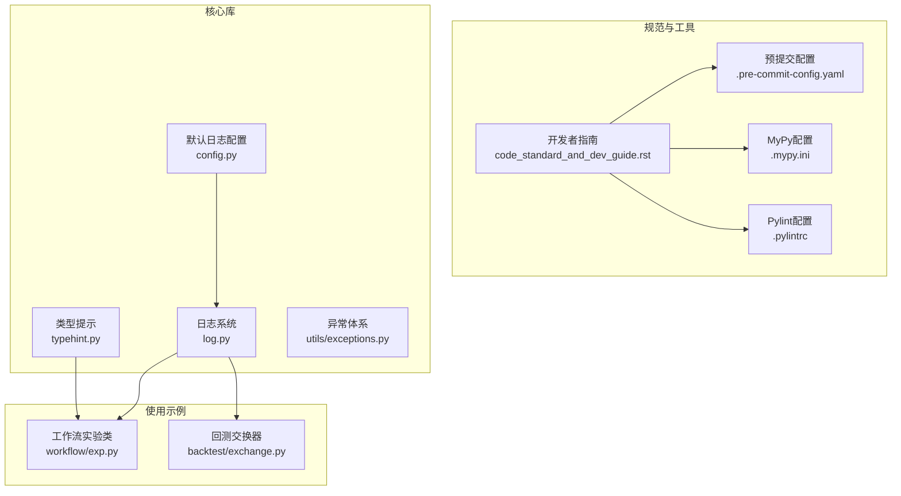
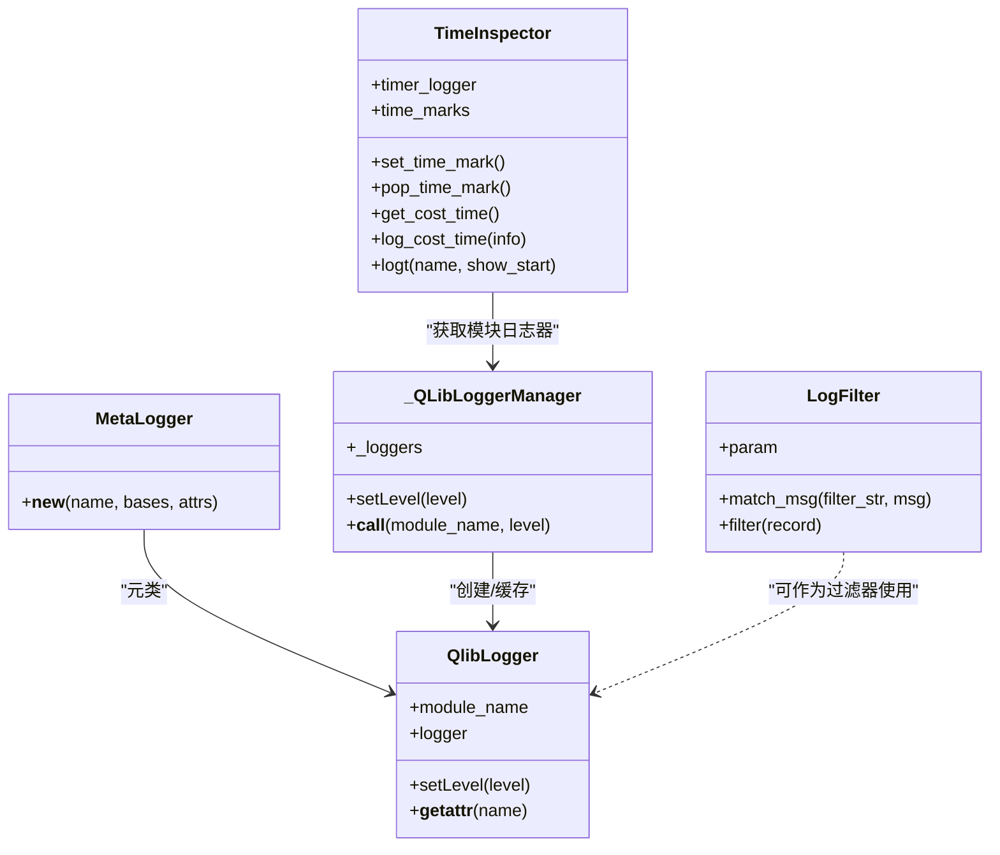
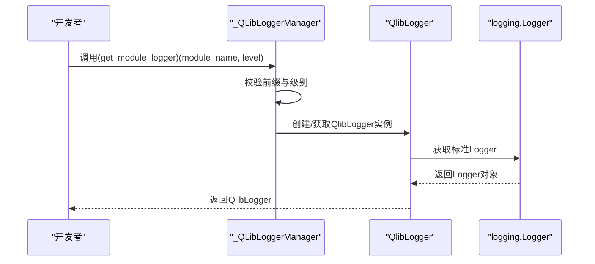
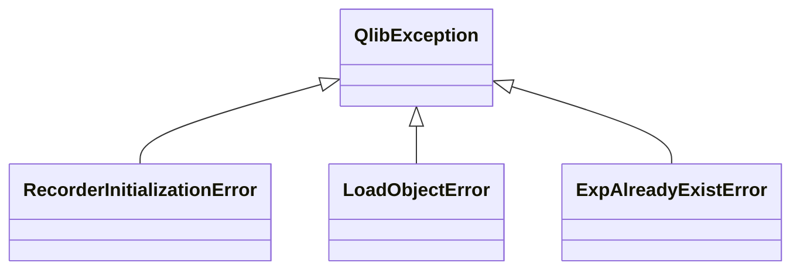
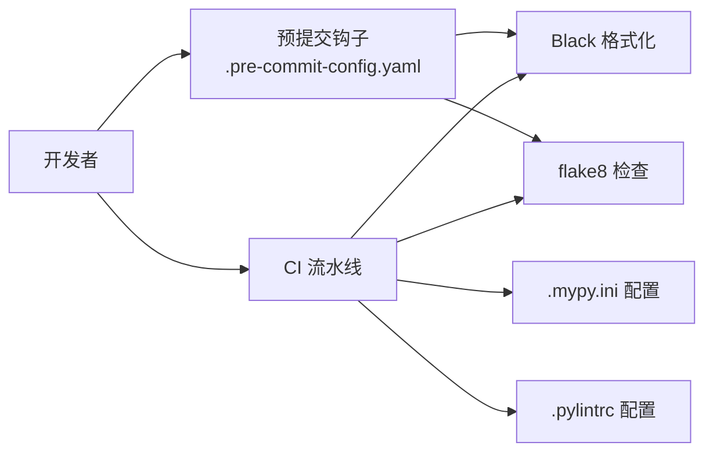

# 编码规范

<cite>
**本文引用的文件**
- [typehint.py](file://qlib/typehint.py)
- [log.py](file://qlib/log.py)
- [exceptions.py](file://qlib/utils/exceptions.py)
- [code_standard_and_dev_guide.rst](file://docs/developer/code_standard_and_dev_guide.rst)
- [.pre-commit-config.yaml](file://.pre-commit-config.yaml)
- [.mypy.ini](file://.mypy.ini)
- [.pylintrc](file://.pylintrc)
- [config.py](file://qlib/config.py)
- [exp.py](file://qlib/workflow/exp.py)
- [exchange.py](file://qlib/backtest/exchange.py)
</cite>

## 目录
1. [引言](#引言)
2. [项目结构](#项目结构)
3. [核心组件](#核心组件)
4. [架构总览](#架构总览)
5. [详细组件分析](#详细组件分析)
6. [依赖关系分析](#依赖关系分析)
7. [性能考量](#性能考量)
8. [故障排查指南](#故障排查指南)
9. [结论](#结论)
10. [附录](#附录)

## 引言
本规范旨在为QLib项目提供统一的Python编码标准，覆盖命名约定、模块结构、类型提示使用、日志记录与异常处理，并结合仓库中的开发者指南与pre-commit配置，明确强制执行的检查项（代码风格、导入顺序、文档字符串格式等）。通过实际代码示例路径展示良好实践与反模式对比，帮助贡献者在开发过程中保持一致性和高质量。

## 项目结构
- 核心规范相关文件分布于：
  - 类型提示：qlib/typehint.py
  - 日志：qlib/log.py、qlib/config.py（日志默认配置）
  - 异常：qlib/utils/exceptions.py
  - 开发规范与CI/预提交：docs/developer/code_standard_and_dev_guide.rst、.pre-commit-config.yaml、.mypy.ini、.pylintrc
  - 使用示例：qlib/workflow/exp.py（日志与异常使用）、qlib/backtest/exchange.py（日志使用）

图表来源
- [code_standard_and_dev_guide.rst](file://docs/developer/code_standard_and_dev_guide.rst#L1-L63)
- [.pre-commit-config.yaml](file://.pre-commit-config.yaml#L1-L13)
- [.mypy.ini](file://.mypy.ini#L1-L18)
- [.pylintrc](file://.pylintrc#L1-L6)
- [typehint.py](file://qlib/typehint.py#L1-L64)
- [log.py](file://qlib/log.py#L1-L263)
- [exceptions.py](file://qlib/utils/exceptions.py#L1-L20)
- [config.py](file://qlib/config.py#L200-L234)
- [exp.py](file://qlib/workflow/exp.py#L1-L200)
- [exchange.py](file://qlib/backtest/exchange.py#L1-L234)

章节来源
- [code_standard_and_dev_guide.rst](file://docs/developer/code_standard_and_dev_guide.rst#L1-L63)
- [.pre-commit-config.yaml](file://.pre-commit-config.yaml#L1-L13)
- [.mypy.ini](file://.mypy.ini#L1-L18)
- [.pylintrc](file://.pylintrc#L1-L6)

## 核心组件
- 类型提示（typehint.py）
  - 提供跨Python版本兼容的常用类型别名与数据结构定义，便于统一配置与实例化类型描述。
  - 关键点：使用TypedDict描述配置字典；使用Union组合多种配置类型；对Python版本进行条件导入以保证兼容性。
- 日志（log.py）
  - 自定义QlibLogger与全局管理器，支持按模块获取日志器、设置级别、时间测量与过滤。
  - 关键点：MetaLogger动态代理Logger方法；_QLibLoggerManager集中管理；TimeInspector提供便捷计时；LogFilter支持正则过滤消息。
- 异常（exceptions.py）
  - 定义基础异常类与业务相关异常，便于上层捕获与区分错误类型。
  - 关键点：继承层次清晰，便于扩展新的业务异常类型。

章节来源
- [typehint.py](file://qlib/typehint.py#L1-L64)
- [log.py](file://qlib/log.py#L1-L263)
- [exceptions.py](file://qlib/utils/exceptions.py#L1-L20)

## 架构总览
下图展示了日志系统的内部交互与关键类关系，体现模块化设计与职责分离。

图表来源
- [log.py](file://qlib/log.py#L1-L263)

## 详细组件分析

### 类型提示（typehint.py）
- 设计要点
  - 使用TypedDict定义配置字典结构，确保配置字段的可读性与静态检查友好性。
  - 使用Union组合多种配置形态（字典、字符串、对象、路径），提升灵活性与可扩展性。
  - 条件导入兼容不同Python版本，避免运行时差异导致的问题。
- 命名约定
  - 类型别名采用大写驼峰或全大写（如Literal、TypedDict、final），保持与typing/typing_extensions一致的风格。
  - 字段命名遵循小驼峰，避免与Python关键字冲突时采用注释或替代方案。
- 复杂度与性能
  - 类型别名本身不引入运行时开销；在大型工程中能显著减少类型检查与IDE提示成本。
- 最佳实践与反模式
  - 最佳实践：使用TypedDict约束配置字典；通过Union组合多种配置形态；在需要兼容旧版本时使用typing_extensions。
  - 反模式：直接使用裸字典作为配置；混合使用不同风格的类型注解；忽略Python版本差异导致的导入失败。

章节来源
- [typehint.py](file://qlib/typehint.py#L1-L64)

### 日志（log.py）
- 设计要点
  - MetaLogger通过动态注入Logger方法，使QlibLogger具备与标准Logger相同的接口能力。
  - _QLibLoggerManager负责按模块名获取/缓存日志器，并自动添加“qlib.”前缀，避免重复与命名冲突。
  - TimeInspector提供栈式时间标记与上下文管理器，简化耗时统计与日志输出。
  - LogFilter支持基于正则的消息过滤，便于屏蔽噪声或敏感信息。
  - set_log_with_config与set_global_logger_level提供灵活的日志配置与全局级别调整能力。
- 命名约定
  - 类名使用大写驼峰；模块级函数使用小驼峰；类属性与方法使用小驼峰；常量使用全大写。
- 错误处理
  - 在过滤器中对异常进行吞并，避免影响日志链路稳定性。
  - 上下文管理器确保资源恢复，防止全局级别调整后无法复原。
- 性能考量
  - 通过缓存日志器与延迟初始化降低重复创建成本。
  - 正则匹配仅在必要时触发，避免频繁正则带来的开销。
- 最佳实践与反模式
  - 最佳实践：使用get_module_logger获取模块日志器；在需要时使用TimeInspector进行计时；通过LogFilter屏蔽无关消息；使用上下文管理器调整全局级别。
  - 反模式：直接使用logging.getLogger而不加前缀；在循环中频繁创建日志器；忽略异常过滤器的异常处理。

图表来源
- [log.py](file://qlib/log.py#L51-L83)

章节来源
- [log.py](file://qlib/log.py#L1-L263)

### 异常（exceptions.py）
- 设计要点
  - 统一的基础异常类QlibException，便于上层捕获与区分。
  - 针对具体业务场景定义子类（如RecorderInitializationError、LoadObjectError、ExpAlreadyExistError），增强语义表达。
- 命名约定
  - 异常类使用大写驼峰，后缀为Error，保持与Python异常命名一致。
- 最佳实践与反模式
  - 最佳实践：在业务逻辑中抛出明确的子类异常；在调用方捕获特定异常并给出针对性处理。
  - 反模式：抛出通用Exception；不区分业务异常与系统异常；异常信息模糊不清。

图表来源
- [exceptions.py](file://qlib/utils/exceptions.py#L1-L20)

章节来源
- [exceptions.py](file://qlib/utils/exceptions.py#L1-L20)

### 使用示例与最佳实践对照

#### 日志使用示例
- 在工作流中使用模块日志器
  - 示例路径：[workflow/exp.py](file://qlib/workflow/exp.py#L1-L200)
  - 说明：通过get_module_logger获取“workflow”模块日志器，用于记录流程信息。
- 在回测模块中使用日志
  - 示例路径：[backtest/exchange.py](file://qlib/backtest/exchange.py#L1-L234)
  - 说明：在数据加载与价格字段校验处使用logger.warning输出告警信息。
- 默认日志配置
  - 示例路径：[config.py](file://qlib/config.py#L200-L234)
  - 说明：定义了默认日志器配置，包含控制台处理器、格式化器与过滤器，以及是否传播到根日志器的策略。

#### 异常使用示例
- 在工作流中捕获并处理特定异常
  - 示例路径：[workflow/exp.py](file://qlib/workflow/exp.py#L178-L200)
  - 说明：在尝试获取记录器失败时捕获ValueError并创建新记录器，体现异常驱动的容错机制。

章节来源
- [exp.py](file://qlib/workflow/exp.py#L1-L200)
- [exchange.py](file://qlib/backtest/exchange.py#L1-L234)
- [config.py](file://qlib/config.py#L200-L234)

## 依赖关系分析
- 工具链与规范
  - Black：统一代码风格，限制行长，强制一致缩进与空格。
  - flake8：检查常见风格问题与潜在错误，忽略部分规则以平衡可用性。
  - MyPy：静态类型检查，排除部分模块以避免第三方复杂依赖导致的误报。
  - Pylint：针对动态生成成员忽略警告，减少误报。
- 规范与工具的耦合
  - 开发者指南明确了CI检查项与预提交安装步骤，确保每次提交前自动格式化与风格检查。
  - 日志系统与默认配置相互配合，保证模块化日志输出的一致性。

图表来源
- [.pre-commit-config.yaml](file://.pre-commit-config.yaml#L1-L13)
- [.mypy.ini](file://.mypy.ini#L1-L18)
- [.pylintrc](file://.pylintrc#L1-L6)
- [code_standard_and_dev_guide.rst](file://docs/developer/code_standard_and_dev_guide.rst#L1-L63)

章节来源
- [.pre-commit-config.yaml](file://.pre-commit-config.yaml#L1-L13)
- [.mypy.ini](file://.mypy.ini#L1-L18)
- [.pylintrc](file://.pylintrc#L1-L6)
- [code_standard_and_dev_guide.rst](file://docs/developer/code_standard_and_dev_guide.rst#L1-L63)

## 性能考量
- 类型提示
  - 使用TypedDict与Union组合可减少运行时类型判断成本，提升静态检查效率。
- 日志
  - 缓存日志器与延迟初始化降低重复创建开销；正则过滤避免不必要的消息处理。
  - TimeInspector使用栈式时间标记，避免频繁IO与字符串拼接。
- 异常
  - 明确的异常类型有助于快速定位问题，减少无谓的回溯与重试成本。

## 故障排查指南
- 预提交失败
  - 症状：提交被拒绝，提示格式或风格问题。
  - 排查：先本地运行Black与flake8修复；确认已安装并启用预提交钩子。
  - 参考：[code_standard_and_dev_guide.rst](file://docs/developer/code_standard_and_dev_guide.rst#L1-L63)、[.pre-commit-config.yaml](file://.pre-commit-config.yaml#L1-L13)
- 类型检查失败
  - 症状：MyPy报错或忽略某些模块。
  - 排查：检查.mypy.ini排除列表与忽略策略；必要时临时跳过特定模块。
  - 参考：[.mypy.ini](file://.mypy.ini#L1-L18)
- 日志输出不符合预期
  - 症状：日志未显示或级别不正确。
  - 排查：确认模块名前缀是否为“qlib.”；检查默认日志配置与全局级别调整；使用LogFilter屏蔽噪声。
  - 参考：[log.py](file://qlib/log.py#L51-L83)、[config.py](file://qlib/config.py#L200-L234)
- 异常处理不当
  - 症状：异常被吞没或无法区分。
  - 排查：使用明确的子类异常；在调用方捕获并记录上下文信息。
  - 参考：[exceptions.py](file://qlib/utils/exceptions.py#L1-L20)、[exp.py](file://qlib/workflow/exp.py#L178-L200)

章节来源
- [code_standard_and_dev_guide.rst](file://docs/developer/code_standard_and_dev_guide.rst#L1-L63)
- [.pre-commit-config.yaml](file://.pre-commit-config.yaml#L1-L13)
- [.mypy.ini](file://.mypy.ini#L1-L18)
- [log.py](file://qlib/log.py#L51-L83)
- [config.py](file://qlib/config.py#L200-L234)
- [exceptions.py](file://qlib/utils/exceptions.py#L1-L20)
- [exp.py](file://qlib/workflow/exp.py#L178-L200)

## 结论
通过统一的类型提示、日志与异常体系，结合pre-commit与CI的强制检查，QLib能够在团队协作中保持一致的代码质量与可维护性。建议在新增模块时优先参考本文档与示例路径，确保命名、结构与规范的一致性。

## 附录
- 文档字符串风格
  - 采用Numpydoc风格，确保参数、返回值、示例与异常说明完整。
  - 参考：[code_standard_and_dev_guide.rst](file://docs/developer/code_standard_and_dev_guide.rst#L1-L63)
- 导入顺序与风格
  - 由flake8与Black共同保障，避免混用空格与制表符、保持一致的导入顺序与缩进。
  - 参考：[code_standard_and_dev_guide.rst](file://docs/developer/code_standard_and_dev_guide.rst#L1-L63)、[.pre-commit-config.yaml](file://.pre-commit-config.yaml#L1-L13)