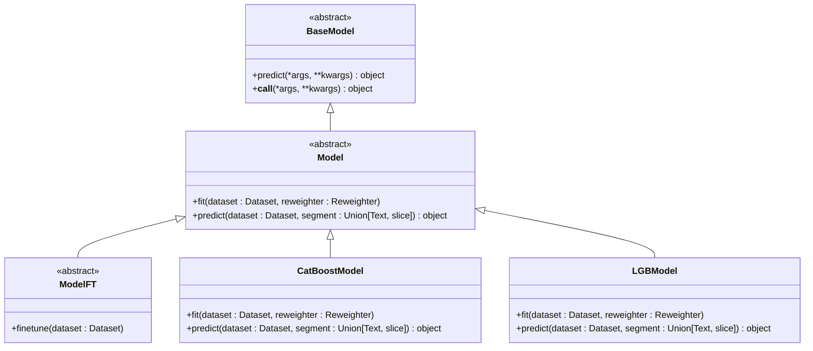
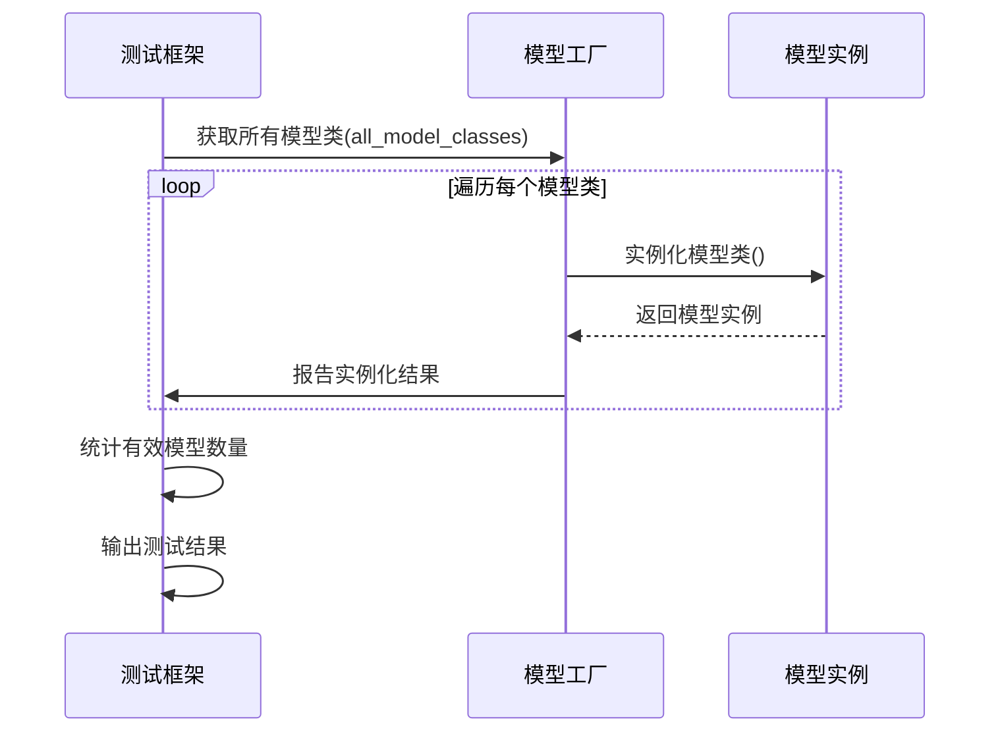

# 贡献流程

<cite>
**本文档中引用的文件**  
- [README.md](file://README.md)
- [CODE_OF_CONDUCT.md](file://CODE_OF_CONDUCT.md)
- [docs/developer/code_standard_and_dev_guide.rst](file://docs/developer/code_standard_and_dev_guide.rst)
- [qlib/model/base.py](file://qlib/model/base.py)
- [qlib/contrib/model/__init__.py](file://qlib/contrib/model/__init__.py)
- [qlib/contrib/data/processor.py](file://qlib/contrib/data/processor.py)
- [qlib/contrib/strategy/__init__.py](file://qlib/contrib/strategy/__init__.py)
- [tests/test_contrib_model.py](file://tests/test_contrib_model.py)
- [tests/test_contrib_workflow.py](file://tests/test_contrib_workflow.py)
</cite>

## 目录
1. [代码贡献流程](#代码贡献流程)
2. [PR审查标准](#pr审查标准)
3. [添加新组件指南](#添加新组件指南)
4. [测试验证](#测试验证)
5. [行为准则](#行为准则)

## 代码贡献流程

在QLib项目中，代码贡献遵循标准的开源项目流程。贡献者需要首先Fork仓库，然后创建特性分支进行开发，最后提交Pull Request（PR）以合并代码。

贡献流程如下：
1. Fork QLib仓库到个人账户
2. 克隆Fork后的仓库到本地
3. 创建新的特性分支（feature branch）
4. 在特性分支上进行代码修改和开发
5. 提交更改并推送到远程分支
6. 在GitHub上创建Pull Request

在提交PR之前，建议在本地安装开发依赖并设置pre-commit钩子，以确保代码格式符合项目标准：
```bash
pip install -e ".[dev]"
pre-commit install
```

**本节来源**
- [README.md](file://README.md#L589-L608)
- [docs/developer/code_standard_and_dev_guide.rst](file://docs/developer/code_standard_and_dev_guide.rst#L54-L63)

## PR审查标准

Pull Request的审查遵循严格的质量标准，确保代码库的稳定性和可维护性。审查标准包括以下几个方面：

### 代码质量
PR必须符合项目的代码标准：
- 使用Numpydoc风格编写文档字符串
- 通过black进行代码格式化（行长度限制为120）
- 通过pylint和flake8代码风格检查
- 避免混合使用空格和制表符

项目使用GitHub Actions进行持续集成，每次提交都会自动运行测试和代码检查。PR必须通过所有CI检查才能被合并。

### 测试覆盖
所有新功能必须包含相应的测试用例。对于添加的新模型、数据处理器或策略，需要在`tests/`目录下添加对应的测试文件，并确保测试覆盖率符合要求。

### 文档更新
任何功能变更或新增功能都必须更新相关文档，包括：
- 更新README.md中的相关说明
- 在docs/目录下添加或修改相应的RST文档
- 为新类和方法提供完整的docstring

### 向后兼容性
在修改现有API时，必须考虑向后兼容性。如果必须进行破坏性变更，需要：
- 在变更前充分讨论
- 提供迁移指南
- 在版本变更日志中明确记录

**本节来源**
- [README.md](file://README.md#L597-L615)
- [docs/developer/code_standard_and_dev_guide.rst](file://docs/developer/code_standard_and_dev_guide.rst#L1-L43)
- [.commitlintrc.js](file://.commitlintrc.js#L1-L21)

## 添加新组件指南

QLib采用模块化设计，支持通过继承基类来添加新组件。以下是添加不同类型组件的指南。

### 添加新模型
新模型需要继承`Model`基类，该基类定义在`qlib/model/base.py`中。`Model`类是所有可学习模型的抽象基类，要求实现`fit`和`predict`方法。

添加新模型的步骤：
1. 在`qlib/contrib/model/`目录下创建新的Python文件
2. 继承`Model`基类并实现必要的方法
3. 在`__init__.py`中导入新模型类
4. 确保模型可以通过`init_instance_by_config`函数实例化



**图表来源**
- [qlib/model/base.py](file://qlib/model/base.py#L10-L111)
- [qlib/contrib/model/__init__.py](file://qlib/contrib/model/__init__.py#L1-L44)

### 添加新数据处理器
数据处理器用于对原始数据进行预处理和特征工程。新处理器需要继承`Processor`基类。

添加新数据处理器的步骤：
1. 在`qlib/contrib/data/`目录下创建新的处理器文件
2. 继承`Processor`基类并实现`__call__`方法
3. 处理器应支持配置化实例化，以便在工作流配置中使用
4. 确保处理器的`readonly`属性正确设置

### 添加新策略
交易策略用于生成交易决策。新策略需要继承`Strategy`基类。

添加新策略的步骤：
1. 在`qlib/contrib/strategy/`目录下创建新的策略文件
2. 继承`Strategy`基类并实现`generate_trades`方法
3. 策略应支持参数化配置
4. 在`__init__.py`中导出新策略类

**本节来源**
- [qlib/model/base.py](file://qlib/model/base.py#L10-L111)
- [qlib/contrib/model/__init__.py](file://qlib/contrib/model/__init__.py#L1-L44)
- [qlib/contrib/data/processor.py](file://qlib/contrib/data/processor.py#L7-L130)
- [qlib/contrib/strategy/__init__.py](file://qlib/contrib/strategy/__init__.py#L1-L29)

## 测试验证

所有新组件必须通过contrib测试来验证其集成正确性。QLib提供了专门的测试文件来验证贡献模块的功能。

### 模型测试
`tests/test_contrib_model.py`文件包含对所有贡献模型的初始化测试。该测试会尝试实例化`all_model_classes`列表中的每个模型类，确保它们可以被正确创建。



**图表来源**
- [tests/test_contrib_model.py](file://tests/test_contrib_model.py#L1-L28)
- [qlib/contrib/model/__init__.py](file://qlib/contrib/model/__init__.py#L43-L44)

### 工作流测试
`tests/test_contrib_workflow.py`文件验证贡献的工作流组件是否能正确集成到QLib的工作流系统中。测试包括：
- 多段记录（MultiSegRecord）功能
- 信号MSE记录（SignalMseRecord）功能
- 实验记录器（Recorder）集成

测试通过创建真实的工作流实验来验证组件的端到端功能，确保新组件能与QLib的核心工作流系统无缝集成。

**本节来源**
- [tests/test_contrib_model.py](file://tests/test_contrib_model.py#L1-L28)
- [tests/test_contrib_workflow.py](file://tests/test_contrib_workflow.py#L1-L87)

## 行为准则

本项目遵循[Microsoft开源行为准则](https://opensource.microsoft.com/codeofconduct/)。所有参与者都应遵守该准则，共同维护一个开放、包容的社区环境。

贡献者在提交PR时需要同意贡献者许可协议（CLA）。GitHub的CLA机器人会自动检测并指导贡献者完成CLA签署流程。一旦签署，该协议在所有使用Microsoft CLA的仓库中都有效。

对于希望成为项目维护者的贡献者，可以通过邮件[qlib@microsoft.com](mailto:qlib@microsoft.com)联系项目团队，申请更高的权限。

**本节来源**
- [CODE_OF_CONDUCT.md](file://CODE_OF_CONDUCT.md#L1-L10)
- [README.md](file://README.md#L628-L634)
- [CONTRIBUTING.md](file://README.md#L590-L622)