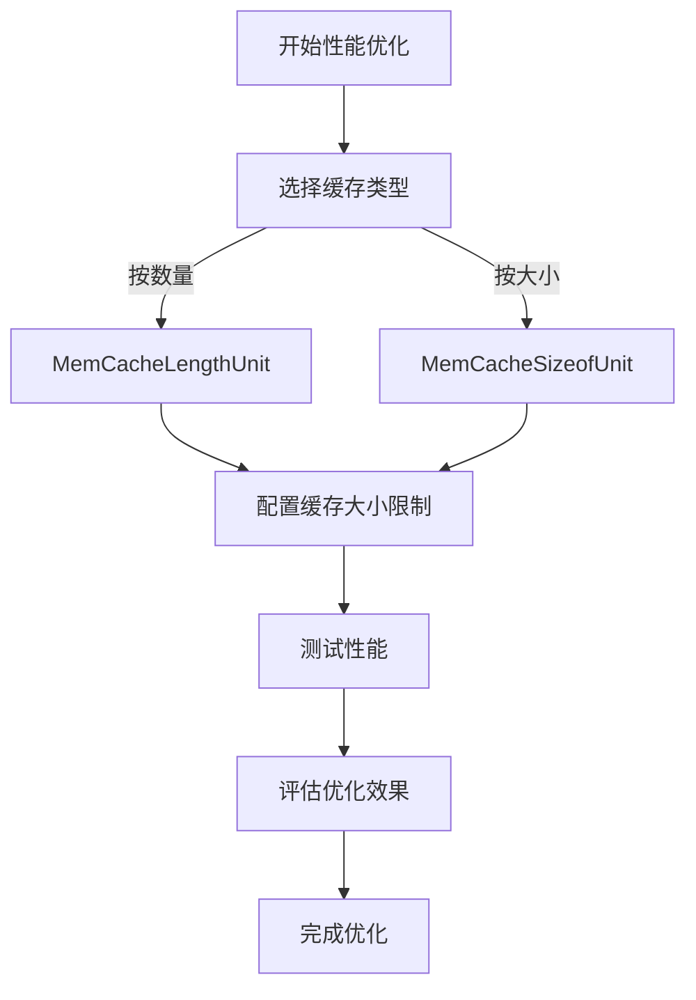
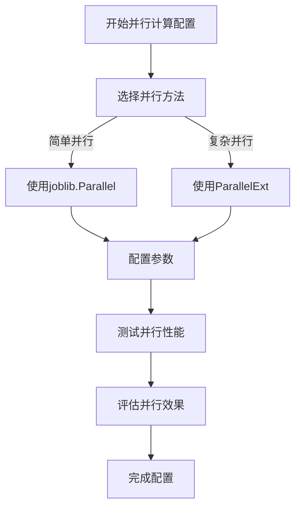

# 故障排除与常见问题

<cite>
**本文档中引用的文件**   
- [FAQ.rst](file://docs/FAQ/FAQ.rst)
- [exceptions.py](file://qlib/utils/exceptions.py)
- [test_all_pipeline.py](file://tests/test_all_pipeline.py)
- [test_get_data.py](file://tests/test_get_data.py)
- [test_workflow.py](file://tests/test_workflow.py)
- [test_contrib_model.py](file://tests/test_contrib_model.py)
- [test_contrib_workflow.py](file://tests/test_contrib_workflow.py)
- [config.py](file://qlib/config.py)
- [cache.py](file://qlib/data/cache.py)
- [paral.py](file://qlib/utils/paral.py)
- [data_cache_demo.py](file://examples/data_demo/data_cache_demo.py)
- [data_mem_resuse_demo.py](file://examples/data_demo/data_mem_resuse_demo.py)
- [workflow.py](file://examples/nested_decision_execution/workflow.py)
- [workflow.py](file://examples/highfreq/workflow.py)
- [run_all_model.py](file://examples/run_all_model.py)
</cite>

## 目录
1. [数据加载问题](#数据加载问题)
2. [模型训练异常](#模型训练异常)
3. [回测结果偏差](#回测结果偏差)
4. [性能调优建议](#性能调优建议)
5. [常见错误信息解析](#常见错误信息解析)

## 数据加载问题

### 数据加载失败诊断
当遇到数据加载失败时，首先需要检查QLib的数据目录配置是否正确。根据`test_get_data.py`中的测试用例，需要确保在初始化QLib时正确设置了`provider_uri`参数，指向包含数据的目录。如果数据目录配置不正确，会导致`D.features()`等数据访问函数返回空数据或抛出异常。

**诊断步骤：**
1. 验证数据目录路径是否存在且可访问
2. 检查`provider_uri`配置是否正确指向数据目录
3. 确认数据文件格式是否符合QLib要求
4. 验证数据文件是否完整无损坏

**解决方案：**
- 使用`scripts/get_data.py`脚本重新下载数据
- 确保数据目录权限设置正确
- 检查数据文件的完整性

**Section sources**
- [test_get_data.py](file://tests/test_get_data.py#L8-L51)

### 数据缓存问题
QLib提供了数据缓存机制来提高数据加载效率。根据`data_cache_demo.py`和`data_mem_resuse_demo.py`中的示例，可以通过序列化`DataHandlerLP`对象来避免重复的数据预处理过程。

**诊断步骤：**
1. 检查是否启用了数据缓存功能
2. 验证缓存文件是否正确生成
3. 确认缓存文件路径是否可访问

**解决方案：**
- 使用`handler.to_pickle()`方法将处理后的数据保存到磁盘
- 在后续运行中直接加载序列化的处理器对象
- 通过内存重用避免重复的数据加载和处理

**Section sources**
- [data_cache_demo.py](file://examples/data_demo/data_cache_demo.py#L1-L55)
- [data_mem_resuse_demo.py](file://examples/data_demo/data_mem_resuse_demo.py#L1-L60)

## 模型训练异常

### 多进程启动问题
在Windows系统上运行QLib时，可能会遇到多进程启动问题，如FAQ中提到的"RuntimeError: An attempt has been made to start a new process before the current process has finished its bootstrapping phase..."错误。

**诊断步骤：**
1. 确认代码是否在`if __name__ == '__main__':`块中执行
2. 检查是否正确配置了多进程启动方法
3. 验证Python版本和操作系统兼容性

**解决方案：**
- 确保所有QLib代码都在`if __name__ == '__main__':`块中执行
- 在主模块中正确设置多进程启动方法
- 考虑使用`freeze_support()`函数（如果程序需要冻结为可执行文件）

**Section sources**
- [FAQ.rst](file://docs/FAQ/FAQ.rst#L15-L37)

### 模型初始化失败
当模型初始化失败时，可能会抛出`QlibException`或其子类异常。根据`exceptions.py`中的定义，常见的异常包括`RecorderInitializationError`和`LoadObjectError`。

**诊断步骤：**
1. 检查模型配置是否正确
2. 验证模型参数是否符合要求
3. 确认依赖的组件是否已正确初始化

**解决方案：**
- 检查模型配置文件的语法和结构
- 确保所有必需的参数都已提供
- 验证模型依赖的组件状态

**Section sources**
- [exceptions.py](file://qlib/utils/exceptions.py#L6-L18)

## 回测结果偏差

### 回测配置问题
回测结果偏差可能源于配置不当。根据`test_all_pipeline.py`中的测试用例，需要确保回测的开始时间、结束时间、基准指数和账户资金等参数设置正确。

**诊断步骤：**
1. 验证回测时间段是否合理
2. 检查基准指数选择是否恰当
3. 确认交易成本参数设置是否准确
4. 验证执行器配置是否符合预期

**解决方案：**
- 使用`PortAnaRecord`类进行回测分析
- 确保回测配置与实际交易环境一致
- 通过多次运行验证结果的稳定性

**Section sources**
- [test_all_pipeline.py](file://tests/test_all_pipeline.py#L106-L138)

### 高频交易问题
在高频交易场景下，可能会遇到时间精度和数据对齐问题。根据`highfreq/workflow.py`中的示例，需要特别注意时间戳的精度和数据段的配置。

**诊断步骤：**
1. 检查时间戳精度是否满足高频交易要求
2. 验证数据段配置是否正确
3. 确认日历缓存是否已正确准备

**解决方案：**
- 使用精确到秒或毫秒的时间戳
- 正确配置数据段的开始和结束时间
- 预先准备日历缓存以提高性能

**Section sources**
- [workflow.py](file://examples/highfreq/workflow.py#L130-L175)

## 性能调优建议

### 内存优化
QLib提供了多种内存优化策略。根据`cache.py`中的实现，可以使用不同类型的内存缓存单元来控制内存使用。

**优化策略：**
- 使用`MemCacheLengthUnit`按对象数量限制缓存大小
- 使用`MemCacheSizeofUnit`按对象大小限制缓存大小
- 配置合适的缓存大小限制

**Diagram sources**
- [cache.py](file://qlib/data/cache.py#L120-L134)

**Section sources**
- [cache.py](file://qlib/data/cache.py#L107-L291)

### 并行计算配置
QLib通过`paral.py`模块提供了强大的并行计算支持。根据该模块的实现，可以使用`ParallelExt`类来增强joblib的并行功能。

**优化策略：**
- 使用`ParallelExt`类进行并行计算
- 配置合适的`n_jobs`参数
- 使用`datetime_groupby_apply`函数进行时间序列数据的并行处理

**Diagram sources**
- [paral.py](file://qlib/utils/paral.py#L20-L31)

**Section sources**
- [paral.py](file://qlib/utils/paral.py#L1-L333)

## 常见错误信息解析

### BadNamespaceError
当遇到`BadNamespaceError: / is not a connected namespace`错误时，通常是由于`python-socketio`版本不匹配导致的。

**解决方案：**
- 确保QLib和QLib服务器的`python-socketio`版本一致
- 使用`pip install -U python-socketio==<qlib-server python-socketio version>`命令更新版本

**Section sources**
- [FAQ.rst](file://docs/FAQ/FAQ.rst#L103-L125)

### TypeError: send() got an unexpected keyword argument 'binary'
此错误通常与`websocket-client`库的版本有关。

**解决方案：**
- 检查`websocket-client`库的版本
- 更新到兼容的版本

**Section sources**
- [FAQ.rst](file://docs/FAQ/FAQ.rst#L127-L130)

### ExpAlreadyExistError
当尝试创建已存在的实验时，会抛出`ExpAlreadyExistError`异常。

**解决方案：**
- 检查实验名称是否已存在
- 使用唯一的实验名称
- 在必要时删除已存在的实验

**Section sources**
- [exceptions.py](file://qlib/utils/exceptions.py#L18-L19)